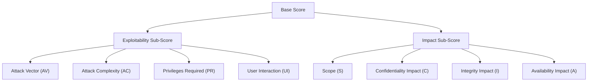
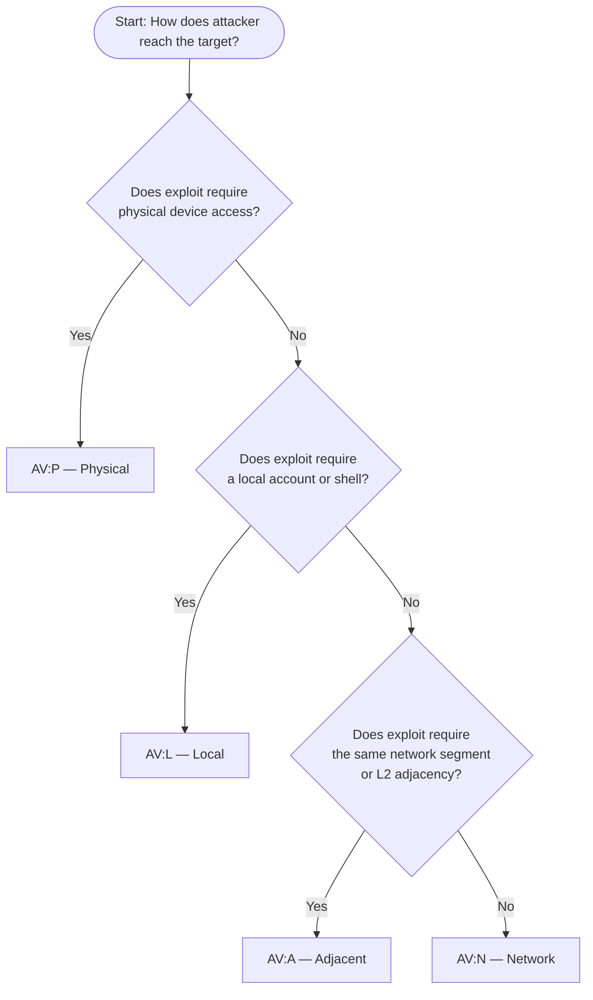
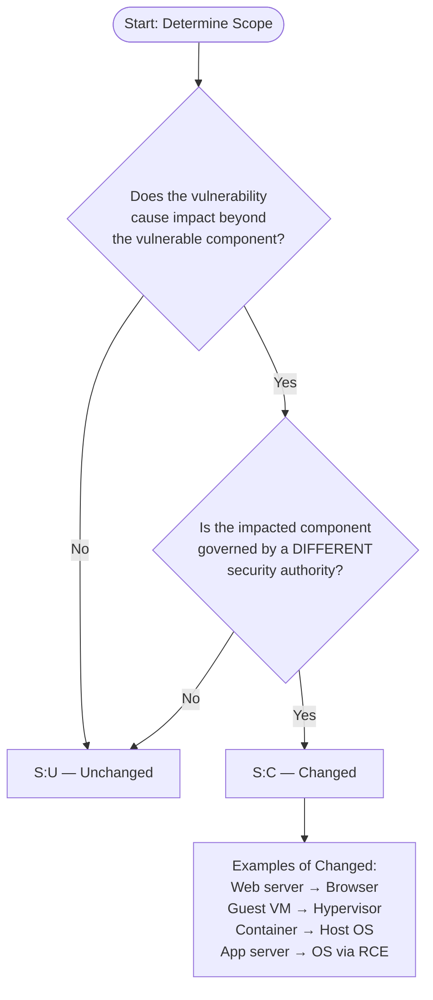
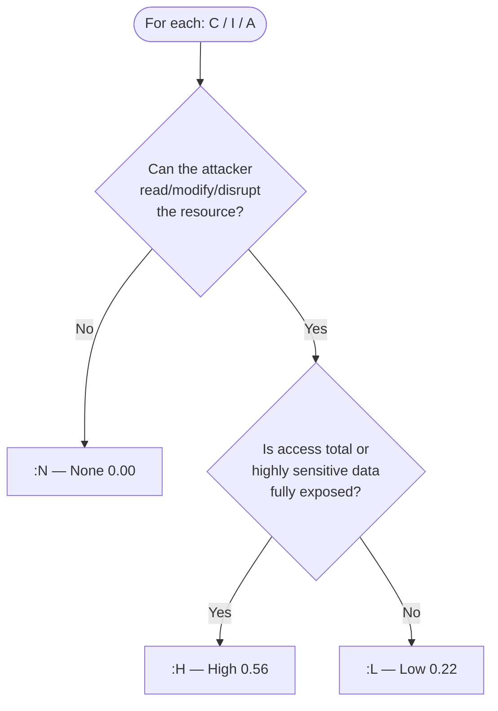

# CVSS v3.1 — Common Vulnerability Scoring System

> **Difficulty:** Beginner → Advanced | **Category:** Penetration Testing

---

## 1. Introduction

The **Common Vulnerability Scoring System (CVSS)** is an open framework for communicating the
characteristics and severity of software vulnerabilities. It provides a standardised method for
rating vulnerabilities so that organisations can prioritise responses and resources according to
threat severity.

### 1.1 Brief History

| Version | Year | Key Changes |
|---------|------|-------------|
| CVSS v1 | 2005 | Initial release by NIAC; rough severity model, limited adoption |
| CVSS v2 | 2007 | Published by FIRST; improved Base/Temporal/Environmental model; widely adopted |
| CVSS v3.0 | 2015 | Major overhaul: Scope metric introduced, PR/UI split, numeric weights revised |
| CVSS v3.1 | 2019 | Clarifications only — no formula changes; improved specification language |
| CVSS v4.0 | 2023 | New nomenclature, supplemental metrics, threat metrics replace temporal, OT/ICS support |

CVSS is maintained by **FIRST** (Forum of Incident Response and Security Teams) at
[https://www.first.org/cvss/](https://www.first.org/cvss/). Scores appear in the National
Vulnerability Database (NVD), vendor security advisories, and penetration test reports worldwide.

### 1.2 Purpose

- Provide a **consistent, repeatable** severity rating for vulnerabilities
- Enable **prioritisation** of patching and remediation efforts
- Give stakeholders a **common language** — a score of 9.8 means the same thing across vendors
- Form the foundation of **SLA-based remediation timelines** in many organisations

> **Note:** CVSS measures **technical severity**, not business risk. A Critical CVSS score on an
> isolated internal system may pose less organisational risk than a Medium score on an
> internet-facing authentication endpoint. Always contextualise scores.

### 1.3 Score Components

A full CVSS v3.1 score has three groups of metrics:

```
CVSS:3.1/AV:N/AC:L/PR:N/UI:N/S:C/C:H/I:H/A:H
         ─────── Base ──────────────────────────
```

```
CVSS:3.1/AV:N/AC:L/PR:N/UI:N/S:C/C:H/I:H/A:H/E:P/RL:O/RC:C
                                              ─── Temporal ──
```

```
CVSS:3.1/.../E:P/RL:O/RC:C/CR:H/IR:H/AR:M/MAV:N/...
                              ─────── Environmental ────────
```

---

## 2. Score Ranges

| Score Range | Severity | Typical SLA |
|-------------|----------|-------------|
| 0.0 | None | Informational only |
| 0.1 – 3.9 | **Low** | 90 days |
| 4.0 – 6.9 | **Medium** | 30 – 60 days |
| 7.0 – 8.9 | **High** | 7 – 30 days |
| 9.0 – 10.0 | **Critical** | 24 – 72 hours |

> **Warning:** Many organisations treat 7.0 as the patching threshold, ignoring Medium findings.
> This is dangerous — a Medium CVSS score on a publicly accessible endpoint with sensitive data
> can be far more impactful than a High score on a hardened internal service.

---

## 3. Base Score Metrics

The Base Score captures the intrinsic characteristics of a vulnerability that are constant over
time and across user environments. It has two sub-groups: **Exploitability** metrics (how the
vulnerability is exploited) and **Impact** metrics (what happens when it is exploited).



---

### 3.1 Attack Vector (AV)

**Definition:** How the vulnerability is exploited — specifically, how close to the target system
the attacker must be.

| Value | Abbreviation | Weight | Meaning |
|-------|-------------|--------|---------|
| Network | N | 0.85 | Exploitable remotely over the network (internet or intranet) with no physical proximity |
| Adjacent | A | 0.62 | Exploitable only from the same physical or logical network segment (LAN, Bluetooth, Wi-Fi) |
| Local | L | 0.55 | Requires local access: an interactive shell, or the ability to execute code locally |
| Physical | P | 0.20 | Requires physical access to the device (e.g., USB attacks, cold-boot attacks) |

**Network (0.85):** The most common and most severe. The attacker sends exploit traffic over a
routable network — this includes the internet. Examples: web application vulnerabilities,
remote buffer overflows, unauthenticated API endpoints.

**Adjacent (0.62):** The attacker must be on the same broadcast domain or logical segment. This
covers ARP poisoning attacks, DHCP starvation, Wi-Fi deauthentication, and attacks requiring
layer-2 adjacency. An attacker on the corporate Wi-Fi who can attack a server accessible only
on that segment would use AV:A.

**Local (0.55):** The attacker already has access to the system — either a local user account or
the ability to run code. Privilege escalation vulnerabilities, local kernel exploits, and SUID
binary abuse typically score AV:L.

**Physical (0.20):** The attacker must be physically present. Evil-maid attacks, hardware
implants, and firmware flashing via JTAG use AV:P.

> **Note:** "Network" does not mean "internet-only." A vulnerability reachable from any network
> location (even internal) scores AV:N if no proximity requirement exists. The deciding factor
> is whether a routable path exists.

---

### 3.2 Attack Complexity (AC)

**Definition:** Conditions beyond the attacker's control that must be met for exploitation.

| Value | Abbreviation | Weight | Meaning |
|-------|-------------|--------|---------|
| Low | L | 0.77 | No special conditions required; repeatable at will |
| High | H | 0.44 | Specific conditions outside the attacker's control must exist |

**Low (0.77):** The attacker can exploit the vulnerability reliably without needing to meet
preconditions. A simple SQL injection or command injection with no race conditions is AC:L.

**High (0.44):** Exploitation depends on factors the attacker cannot directly control. Examples:
- A race condition must be won (timing window required)
- A man-in-the-middle position is required
- Specific target configuration must exist (non-default setting)
- Attack requires gathering target-specific information first

> **Warning:** AC:H does **not** mean "difficult to find" or "requires advanced skills." The
> skill level of the attacker is not measured by CVSS. AC:H means specific environmental
> preconditions outside the attacker's control must be in place.

---

### 3.3 Privileges Required (PR)

**Definition:** The level of privileges the attacker must have before exploiting the vulnerability.

| Value | Abbreviation | Weight (S:U) | Weight (S:C) | Meaning |
|-------|-------------|-------------|-------------|---------|
| None | N | 0.85 | 0.85 | No authentication required |
| Low | L | 0.62 | 0.68 | Basic user-level privileges (authenticated user) |
| High | H | 0.27 | 0.50 | Administrative or privileged account required |

The weights change when **Scope is Changed** (S:C). When exploitation affects components
beyond the vulnerable component, having elevated privileges in the vulnerable component is a
larger enabler — so the PR weight increases for Low and High when S:C.

**None (0.85):** The attacker needs no credentials. Unauthenticated attacks always use PR:N.

**Low (0.62 / 0.68):** The attacker needs a standard user account. Authenticated but
unprivileged. Common in post-authentication vulnerabilities accessible to any logged-in user.

**High (0.27 / 0.50):** The attacker needs administrator, root, or an elevated service account.
Used when the vulnerability is only accessible to privileged users and exploiting it gives them
further access or impact.

---

### 3.4 User Interaction (UI)

**Definition:** Whether exploitation requires a human (other than the attacker) to take some
action.

| Value | Abbreviation | Weight | Meaning |
|-------|-------------|--------|---------|
| None | N | 0.85 | No interaction from another user required |
| Required | R | 0.62 | A victim user must perform an action |

**None (0.85):** The attacker can exploit the vulnerability independently. Server-side remote
code execution vulnerabilities are typically UI:N.

**Required (0.62):** A victim must click a link, open a file, visit a page, or perform another
action. XSS, CSRF, phishing-delivered malware, and macro-enabled documents typically use UI:R.

> **Note:** "User Interaction" refers to the **victim** taking an action, not the attacker.
> An attacker always has to do something — the question is whether they also need the victim
> to participate.

---

### 3.5 Scope (S) — The Most Misunderstood Metric

**Definition:** Whether the exploited vulnerability affects resources beyond the vulnerable
component itself.

| Value | Abbreviation | Meaning |
|-------|-------------|---------|
| Unchanged | U | Impact is confined to the vulnerable component |
| Changed | C | Impact extends to other components with a different security authority |

This is the most commonly misunderstood metric in CVSS v3. Understanding it requires
understanding two key concepts:

**Vulnerable Component:** The thing that contains the vulnerability — e.g., the web application,
the kernel module, the library.

**Impacted Component:** The thing that suffers the impact — e.g., the OS, the hypervisor,
another application, the user's browser.

**Scope: Unchanged (U):** The vulnerable component and impacted component are the same, or are
governed by the same security authority. A SQL injection that reads data from the same database
the application already accesses — S:U. A local privilege escalation that gives root on the
same system — it's still the same authority boundary — S:U.

**Scope: Changed (C):** The exploit causes impact to a component outside the original security
authority. Classic examples:

- **XSS:** The vulnerable component is the web server. The impacted component is the
  **victim's browser** (a different security context). → S:C
- **Hypervisor escape (VM breakout):** The vulnerable component is the guest VM. The impacted
  component is the **hypervisor / host OS** — a completely different security domain. → S:C
- **Container escape:** The vulnerable component is the container. The impacted component is
  the **host kernel**. → S:C
- **Stored XSS injecting admin actions:** Affects the browser of a different user — S:C

> **Warning:** Scope does NOT mean "high impact." S:U with C:H/I:H/A:H scores higher than
> S:C with C:L/I:L/A:N. Scope drives which formula branch to use, not directly the score.

**Common Scope Mistakes:**

| Scenario | Correct Scope | Common Mistake |
|----------|--------------|----------------|
| RCE on web server | S:U | Choosing S:C because "it's severe" |
| Reflected XSS | S:C | Choosing S:U because "it's just XSS" |
| SQLi reading DB data | S:U | Choosing S:C because "it reads other users' data" |
| Guest VM escape to host | S:C | Choosing S:U because "it's the same physical box" |
| SSRF to internal services | S:C (often) | Ignoring cross-boundary impact |

---

### 3.6 Confidentiality Impact (C)

**Definition:** Impact to confidentiality of data accessible to the impacted component.

| Value | Abbreviation | Weight | Meaning |
|-------|-------------|--------|---------|
| None | N | 0.00 | No loss of confidentiality |
| Low | L | 0.22 | Some information disclosed; limited scope or access |
| High | H | 0.56 | Total or significant loss of confidentiality |

**None (0.00):** The vulnerability has no confidentiality impact. A DoS vulnerability with no
data leakage scores C:N.

**Low (0.22):** Some information is leaked but the attacker has limited control over what.
Examples: partial path disclosure, verbose error messages revealing internal structure,
limited enumeration.

**High (0.56):** The attacker can read all data, or selectively read highly sensitive data.
Examples: reading `/etc/shadow`, full database dump, reading all session tokens.

---

### 3.7 Integrity Impact (I)

**Definition:** Impact to integrity of data or processing.

| Value | Abbreviation | Weight | Meaning |
|-------|-------------|--------|---------|
| None | N | 0.00 | No impact on integrity |
| Low | L | 0.22 | Limited modification; no control over scope of changes |
| High | H | 0.56 | Total or critical integrity loss; attacker can modify anything |

**None (0.00):** The vulnerability cannot be used to modify data. Read-only SQL injection that
only reads data scores I:N.

**Low (0.22):** Some modification is possible but limited. Attacker can alter some data but
cannot control which data or cause serious downstream consequences.

**High (0.56):** Attacker can modify any data, or can modify critical data (system files,
configs, credentials). Remote code execution always implies I:H because the attacker controls
execution state.

---

### 3.8 Availability Impact (A)

**Definition:** Impact to the availability of the impacted component.

| Value | Abbreviation | Weight | Meaning |
|-------|-------------|--------|---------|
| None | N | 0.00 | No availability impact |
| Low | L | 0.22 | Reduced performance or interruptions; service not fully unavailable |
| High | H | 0.56 | Total loss of availability; complete denial of service |

**None (0.00):** The vulnerability has no effect on service availability.

**Low (0.22):** Intermittent disruptions — the attacker can degrade service but not fully
knock it offline. Example: a resource-intensive query that slows the application.

**High (0.56):** Complete unavailability of the resource. A crash, infinite loop, or network
flood that brings down the service scores A:H.

---

## 4. Base Score Formula

The CVSS v3.1 base score calculation involves several intermediate values:

### 4.1 ISC Base (Impact Sub-Score Base)

```
ISCBase = 1 - [ (1 - ImpactConf) × (1 - ImpactInteg) × (1 - ImpactAvail) ]
```

This is a multiplicative formula — it calculates the probability that at least one of the
three impact dimensions is affected. Three High impacts give:

```
ISCBase = 1 - [(1-0.56) × (1-0.56) × (1-0.56)]
         = 1 - [0.44 × 0.44 × 0.44]
         = 1 - 0.0852
         = 0.9148
```

### 4.2 Impact Sub-Score (ISC)

The ISC branches depending on Scope:

```
If Scope = Unchanged:
    ISC = 6.42 × ISCBase

If Scope = Changed:
    ISC = 7.52 × [ISCBase - 0.029] - 3.25 × [ISCBase - 0.02]^15
```

The S:C formula uses a non-linear term (`^15`) that prevents very small ISCBase values from
generating inflated scores when scope is changed.

### 4.3 Exploitability Sub-Score (ESC)

```
ESC = 8.22 × AttackVector × AttackComplexity × PrivilegesRequired × UserInteraction
```

This is purely multiplicative — each metric directly scales the exploitability of the
vulnerability. Maximum value: `8.22 × 0.85 × 0.77 × 0.85 × 0.85 = 3.899`

### 4.4 Base Score (Final)

```
If ISC ≤ 0:
    BaseScore = 0

If Scope = Unchanged:
    BaseScore = Roundup( min(ISC + ESC, 10) )

If Scope = Changed:
    BaseScore = Roundup( min(1.08 × (ISC + ESC), 10) )
```

The `1.08` multiplier for S:C reflects the additional severity of cross-boundary impact.
`Roundup` rounds to the nearest tenth, always rounding up (e.g., 7.01 → 7.1).

> **Note:** The maximum theoretical ESC is approximately 3.9. The maximum ISC for S:U is
> approximately 5.9. This is why 10.0 scores require S:C — the 1.08 multiplier is needed to
> push the sum above 10 before capping.

---

## 5. Temporal Score

Temporal metrics adjust the Base Score based on factors that change over time as a
vulnerability is discovered, exploited, and patched. All temporal metrics default to **X
(Not Defined)** which has no effect on the score.

### 5.1 Exploit Code Maturity (E)

Reflects the current state of exploitation techniques and available exploit code.

| Value | Abbreviation | Weight | Meaning |
|-------|-------------|--------|---------|
| Not Defined | X | 1.00 | No change to score |
| Unproven | U | 0.91 | Theoretical only; no PoC |
| Proof-of-Concept | P | 0.94 | PoC published; not functional exploit |
| Functional | F | 0.97 | Functional exploit available |
| High | H | 1.00 | Widely deployed; automated / weaponised |

### 5.2 Remediation Level (RL)

Reflects the current availability of a fix.

| Value | Abbreviation | Weight | Meaning |
|-------|-------------|--------|---------|
| Not Defined | X | 1.00 | No change to score |
| Official Fix | O | 0.95 | Vendor patch available |
| Temporary Fix | T | 0.96 | Unofficial or interim patch |
| Workaround | W | 0.97 | Configuration-based mitigation |
| Unavailable | U | 1.00 | No fix or workaround |

### 5.3 Report Confidence (RC)

Reflects the confidence in the existence of the vulnerability and technical details.

| Value | Abbreviation | Weight | Meaning |
|-------|-------------|--------|---------|
| Not Defined | X | 1.00 | No change to score |
| Unknown | U | 0.92 | Unconfirmed report |
| Reasonable | R | 0.96 | Reasonable confidence; not fully confirmed |
| Confirmed | C | 1.00 | Acknowledged by vendor or proven |

### 5.4 Temporal Score Formula

```
TemporalScore = Roundup( BaseScore × ExploitCodeMaturity × RemediationLevel × ReportConfidence )
```

**Example:** A 10.0 Base with E:P, RL:O, RC:C:

```
TemporalScore = Roundup( 10.0 × 0.94 × 0.95 × 1.00 )
              = Roundup( 8.93 )
              = 8.9
```

> **Note:** Temporal scores are rarely included in NVD entries. Vendors sometimes publish them
> in their security advisories. They are more commonly used for internal risk tracking than
> in penetration test reports.

---

## 6. Environmental Score

Environmental metrics allow organisations to customise the CVSS score based on their own IT
infrastructure, operational context, and business importance of the affected system.

### 6.1 Modified Base Metrics

Every Base metric can be overridden with a modified equivalent (prefix `M`):

`MAV`, `MAC`, `MPR`, `MUI`, `MS`, `MC`, `MI`, `MA`

Each accepts the same values as its corresponding Base metric, plus **X (Not Defined)** which
means "use the Base value." This allows security teams to say: "In our environment, this
vulnerability is not exploitable via Network — it's only reachable locally."

### 6.2 Impact Requirements

These weights reflect the importance of each CIA dimension to the specific organisation.

| Metric | Abbreviation | Values |
|--------|-------------|--------|
| Confidentiality Requirement | CR | Low (0.50), Medium (1.00), High (1.50), X (1.00) |
| Integrity Requirement | IR | Low (0.50), Medium (1.00), High (1.50), X (1.00) |
| Availability Requirement | AR | Low (0.50), Medium (1.00), High (1.50), X (1.00) |

**Example use case:** A vulnerability on a public-facing e-commerce site:
- `CR:H` — customer data confidentiality is paramount
- `IR:H` — order tampering would be catastrophic
- `AR:M` — some downtime is acceptable

The same vulnerability on a batch-processing logging server:
- `CR:L` — logs contain no sensitive data
- `IR:L` — log corruption is recoverable
- `AR:H` — log availability is critical for compliance

### 6.3 Environmental Score Formula (Summary)

The Environmental Score recalculates the Base Score using Modified metrics and CIA Requirements:

```
ModifiedISCBase = 1 - [(1 - MC × CR) × (1 - MI × IR) × (1 - MA × AR)]
(capped at 0.915 for Scope:Changed variant)

If ModifiedScope = Unchanged:
    ModifiedISC = 6.42 × ModifiedISCBase

If ModifiedScope = Changed:
    ModifiedISC = 7.52×[ModifiedISCBase-0.029] - 3.25×[ModifiedISCBase×0.9731-0.02]^13

EnvironmentalScore = Roundup( Roundup(min([ModifiedISC + ModifiedESC], 10))
                     × ExploitCodeMaturity × RemediationLevel × ReportConfidence )
```

> **Warning:** The Environmental Score v3.1 formula has a correction over v3.0 — the exponent
> changed from 15 to 13 in the S:C branch of the Modified ISC. Always use a validated
> calculator rather than implementing the formula manually.

---

## 7. Worked Examples

### 7.1 Log4Shell — CVE-2021-44228 (Critical: 10.0)

**Vector:** `CVSS:3.1/AV:N/AC:L/PR:N/UI:N/S:C/C:H/I:H/A:H`

| Metric | Value | Rationale |
|--------|-------|-----------|
| Attack Vector | Network | Exploitable by sending a crafted HTTP header over the internet |
| Attack Complexity | Low | No special conditions; a single malicious string triggers the vulnerability |
| Privileges Required | None | No authentication required on the target service |
| User Interaction | None | The server processes the payload automatically; no user clicks needed |
| Scope | Changed | The vulnerable component is the Log4j library; the JNDI callback causes RCE on the JVM/OS — a different security context; also, an external LDAP server is contacted |
| Confidentiality | High | Full RCE means all data on the system is readable |
| Integrity | High | Full RCE means all data on the system is writable |
| Availability | High | Full RCE means the attacker can crash or halt the service |

**Step-by-step calculation:**

```
AV=0.85, AC=0.77, PR=0.85, UI=0.85
ESC = 8.22 × 0.85 × 0.77 × 0.85 × 0.85 = 3.899

C=0.56, I=0.56, A=0.56
ISCBase = 1 - [(1-0.56)(1-0.56)(1-0.56)]
        = 1 - [0.44^3]
        = 1 - 0.0852 = 0.9148

Scope = Changed:
ISC = 7.52×(0.9148-0.029) - 3.25×(0.9148-0.02)^15
    = 7.52×0.8858 - 3.25×(0.8948)^15
    = 6.661 - 3.25×0.1885
    = 6.661 - 0.613 = 6.048

Base = Roundup( min(1.08×(6.048+3.899), 10) )
     = Roundup( min(1.08×9.947, 10) )
     = Roundup( min(10.742, 10) )
     = Roundup( 10.0 )
     = 10.0 ✓
```

---

### 7.2 Reflected XSS — Generic (Medium: 6.1)

**Vector:** `CVSS:3.1/AV:N/AC:L/PR:N/UI:R/S:C/C:L/I:L/A:N`

| Metric | Value | Rationale |
|--------|-------|-----------|
| Attack Vector | Network | The attacker sends a crafted URL; the victim accesses it over the network |
| Attack Complexity | Low | No preconditions; crafting a payload is trivial |
| Privileges Required | None | No account required on the vulnerable application |
| User Interaction | Required | The victim must click the malicious link |
| Scope | Changed | The vulnerable component is the web server. The impacted component is the victim's browser (different security authority) |
| Confidentiality | Low | Attacker can steal cookies/session tokens — significant but partial |
| Integrity | Low | Attacker can inject content into the page but cannot modify stored data |
| Availability | None | Reflected XSS has no availability impact |

> **Note:** XSS almost always scores S:C because the browser is a separate security context
> from the web server. This is one of the most common mistakes — testers score S:U because
> "it's the same website" — but the impact is on the **browser**, not the server.

---

### 7.3 Local Privilege Escalation — Generic (High: 7.8)

**Vector:** `CVSS:3.1/AV:L/AC:L/PR:L/UI:N/S:U/C:H/I:H/A:H`

| Metric | Value | Rationale |
|--------|-------|-----------|
| Attack Vector | Local | The attacker must already have a local shell or user session |
| Attack Complexity | Low | The exploit is reliable and repeatable (e.g., SUID binary abuse) |
| Privileges Required | Low | A standard user account is required to execute the exploit |
| User Interaction | None | No other user action is needed |
| Scope | Unchanged | The impact is on the same system the user is already on — same authority |
| Confidentiality | High | Root access means all system files are readable |
| Integrity | High | Root access means any file can be modified |
| Availability | High | Root access means services can be stopped |

> **Note:** LPE scoring as S:U may seem counterintuitive — the impact is huge. But the
> vulnerable component (the OS/binary) and the impacted component (also the OS) are governed
> by the **same security authority** (the kernel). The privilege level changes, but the
> security boundary does not cross.

---

### 7.4 SQLi on Internal Application — (High: 8.8)

**Vector:** `CVSS:3.1/AV:N/AC:L/PR:L/UI:N/S:U/C:H/I:H/A:H`

| Metric | Value | Rationale |
|--------|-------|-----------|
| Attack Vector | Network | Exploitable over the network via the application's HTTP interface |
| Attack Complexity | Low | Standard UNION/error-based SQLi; no special conditions |
| Privileges Required | Low | Requires a valid user account (application is authenticated) |
| User Interaction | None | The attacker directly submits the malicious query |
| Scope | Unchanged | The database is the impacted component; it is part of the same application's security domain |
| Confidentiality | High | Attacker can dump the entire database |
| Integrity | High | Attacker may use INTO OUTFILE, xp_cmdshell, or UPDATE statements |
| Availability | High | Attacker can use heavy queries or DROP TABLE to disrupt service |

> **Note:** The score difference between this (8.8) and Log4Shell (10.0) comes down to PR:L
> (requires authentication) vs PR:N, and S:U vs S:C. Authentication requirements and scope
> boundary are significant score drivers.

---

## 8. Common Scoring Mistakes

### 8.1 Confusing Scope: Unchanged vs Changed

The most common error. Remember: Scope is about **security authority boundaries**, not about
**impact magnitude**.

Ask yourself: *"Does the exploit cause impact in a component governed by a different security
policy than the vulnerable component?"*

- Web server → browser: **S:C**
- Application → its own database: **S:U**
- Guest VM → host OS: **S:C**
- User process → kernel (privilege escalation): Usually **S:U** (same kernel authority)
- Kernel exploit → hypervisor: **S:C**

### 8.2 Using AV:N When It Should Be AV:L

If the vulnerability requires a local shell or code execution first, it's AV:L — not AV:N
just because the system is "on the network."

**Wrong:** "This kernel vuln is on a network-accessible server → AV:N"
**Right:** "This kernel vuln requires local code execution first → AV:L"

### 8.3 Ignoring Environmental Scoring

Default Base Scores assume a generic environment. For client reports, environmental scoring can
demonstrate how controls reduce risk:

```bash
# A High (7.8) LPE on a system with:
# - No internet exposure (MAV:L is already base)
# - Strong access controls (MPR:H)
# - Low data sensitivity (CR:L, IR:L)
# Environmental score could drop to 4.x (Medium)
```

### 8.4 Mixing v2 and v3 Thinking

CVSS v2 had no Scope metric and different numeric weights. Scores are **not comparable
across versions**. A v2 score of 7.8 and a v3 score of 7.8 are calculated completely
differently. NVD publishes both — always reference v3.1 in modern reports.

### 8.5 Ten Common Scoring Errors

| # | Error | Correct Approach |
|---|-------|-----------------|
| 1 | Scoring AV:N for local kernel exploits | Use AV:L if local access is required first |
| 2 | Scoring S:U for XSS (browser is same as server) | Browser is a different security context → S:C |
| 3 | Scoring S:C for SQLi (database = different component) | Same application security domain → S:U |
| 4 | Using C:H/I:H/A:H for DoS-only vulnerabilities | DoS = A:H only; C:N, I:N |
| 5 | Ignoring PR weight change when S:C | PR weights for Low and High change with S:C |
| 6 | Assuming AC:H = "hard to exploit" (skill) | AC:H = external preconditions needed, not skill |
| 7 | Applying temporal metrics globally instead of per-deployment | Temporal/Environmental are per-deployment |
| 8 | Conflating CVSS score with business risk | A 9.8 on a dev sandbox may matter less than a 5.0 on a production payments API |
| 9 | Not using Roundup correctly | Always round up, never round normally |
| 10 | Using "X" (Not Defined) in Base metrics | Base metrics must all have explicit values; only Temporal/Environmental allow X |

---

## 9. Complete Metrics Reference Table

| Group | Metric | Value | Abbreviation | Weight |
|-------|--------|-------|-------------|--------|
| Exploitability | Attack Vector | Network | AV:N | 0.85 |
| Exploitability | Attack Vector | Adjacent | AV:A | 0.62 |
| Exploitability | Attack Vector | Local | AV:L | 0.55 |
| Exploitability | Attack Vector | Physical | AV:P | 0.20 |
| Exploitability | Attack Complexity | Low | AC:L | 0.77 |
| Exploitability | Attack Complexity | High | AC:H | 0.44 |
| Exploitability | Privileges Required | None | PR:N | 0.85 |
| Exploitability | Privileges Required | Low (S:U) | PR:L | 0.62 |
| Exploitability | Privileges Required | Low (S:C) | PR:L | 0.68 |
| Exploitability | Privileges Required | High (S:U) | PR:H | 0.27 |
| Exploitability | Privileges Required | High (S:C) | PR:H | 0.50 |
| Exploitability | User Interaction | None | UI:N | 0.85 |
| Exploitability | User Interaction | Required | UI:R | 0.62 |
| Impact | Scope | Unchanged | S:U | (formula branch) |
| Impact | Scope | Changed | S:C | (formula branch + 1.08) |
| Impact | Confidentiality | None | C:N | 0.00 |
| Impact | Confidentiality | Low | C:L | 0.22 |
| Impact | Confidentiality | High | C:H | 0.56 |
| Impact | Integrity | None | I:N | 0.00 |
| Impact | Integrity | Low | I:L | 0.22 |
| Impact | Integrity | High | I:H | 0.56 |
| Impact | Availability | None | A:N | 0.00 |
| Impact | Availability | Low | A:L | 0.22 |
| Impact | Availability | High | A:H | 0.56 |
| Temporal | Exploit Code Maturity | Not Defined | E:X | 1.00 |
| Temporal | Exploit Code Maturity | Unproven | E:U | 0.91 |
| Temporal | Exploit Code Maturity | Proof-of-Concept | E:P | 0.94 |
| Temporal | Exploit Code Maturity | Functional | E:F | 0.97 |
| Temporal | Exploit Code Maturity | High | E:H | 1.00 |
| Temporal | Remediation Level | Not Defined | RL:X | 1.00 |
| Temporal | Remediation Level | Official Fix | RL:O | 0.95 |
| Temporal | Remediation Level | Temporary Fix | RL:T | 0.96 |
| Temporal | Remediation Level | Workaround | RL:W | 0.97 |
| Temporal | Remediation Level | Unavailable | RL:U | 1.00 |
| Temporal | Report Confidence | Not Defined | RC:X | 1.00 |
| Temporal | Report Confidence | Unknown | RC:U | 0.92 |
| Temporal | Report Confidence | Reasonable | RC:R | 0.96 |
| Temporal | Report Confidence | Confirmed | RC:C | 1.00 |
| Environmental | Confidentiality Req. | Low | CR:L | 0.50 |
| Environmental | Confidentiality Req. | Medium | CR:M | 1.00 |
| Environmental | Confidentiality Req. | High | CR:H | 1.50 |
| Environmental | Integrity Req. | Low | IR:L | 0.50 |
| Environmental | Integrity Req. | Medium | IR:M | 1.00 |
| Environmental | Integrity Req. | High | IR:H | 1.50 |
| Environmental | Availability Req. | Low | AR:L | 0.50 |
| Environmental | Availability Req. | Medium | AR:M | 1.00 |
| Environmental | Availability Req. | High | AR:H | 1.50 |

---

## 10. Mermaid Decision Trees

### 10.1 Attack Vector Selection



### 10.2 Scope Selection



### 10.3 Impact Metric Selection



---

## 11. CVSS v4.0 Overview

CVSS v4.0 was released in November 2023. It is not backwards-compatible with v3.1 scores.

### 11.1 New Metric Groups

| Group | Purpose |
|-------|---------|
| Base | Core technical characteristics (similar to v3.1) |
| Threat | Replaces Temporal — focuses on real-world threat intelligence |
| Environmental | Contextualises score per deployment (similar to v3.1) |
| Supplemental | Optional context metrics; do not affect score |

### 11.2 New and Changed Metrics

**Removed or merged:**
- Temporal metrics `E`, `RL`, `RC` replaced by a single **Threat** group with metric `E`
  (Exploit Maturity: Attacked, POC, Unreported, Not Defined)

**Added to Base:**
- **Attack Requirements (AT):** None / Present — similar to AC:H but more precise
- **Subsequent System Impact (VC/VI/VA and SC/SI/SA):** Separates impact on the
  **Vulnerable System** from impact on **Subsequent Systems** (what was "Scope" in v3.1)

**Supplemental Metrics (informational only):**
- `S` (Safety), `AU` (Automatable), `R` (Recovery), `V` (Value Density),
  `RE` (Response Effort), `U` (Urgency)

### 11.3 Nomenclature Changes

CVSS v4.0 scores use a new naming system based on which metric groups are present:

| Groups Present | Nomenclature |
|---------------|-------------|
| Base only | CVSS-B |
| Base + Threat | CVSS-BT |
| Base + Environmental | CVSS-BE |
| Base + Threat + Environmental | CVSS-BTE |

### 11.4 OT/ICS Considerations

CVSS v4.0 explicitly addresses **Operational Technology** and **Industrial Control Systems**
through:
- Safety (`S`) supplemental metric for physical harm potential
- Automatable (`AU`) for worm-propagation risk in flat OT networks
- Separate vulnerable/subsequent system impact allowing scoring of sensor→PLC→physical impact

> **Note:** As of 2024, NVD continues to publish v3.1 scores for historical CVEs. New CVEs
> will gradually receive v4.0 scores. Most penetration test report templates still use v3.1
> until industry-wide tooling catches up.

---

## 12. Using CVSS in Penetration Test Reports

### 12.1 Presenting CVSS Scores

Always include:
1. The full vector string: `CVSS:3.1/AV:N/AC:L/PR:N/UI:N/S:C/C:H/I:H/A:H`
2. The numeric score: `10.0`
3. The severity label: `Critical`
4. A brief justification of key metric choices

```markdown
**CVSS Score:** 10.0 (Critical)
**Vector:** CVSS:3.1/AV:N/AC:L/PR:N/UI:N/S:C/C:H/I:H/A:H

The vulnerability is remotely exploitable without authentication (AV:N, PR:N) and
requires no user interaction (UI:N). Successful exploitation results in remote code
execution affecting the host operating system (S:C), with full confidentiality,
integrity, and availability impact (C:H/I:H/A:H).
```

### 12.2 Limitations of CVSS

| Limitation | Implication |
|------------|-------------|
| Does not measure business risk | A 9.8 on a dev sandbox may matter less than a 5.0 on a production payments API |
| Does not account for compensating controls | Firewall rules, WAFs, and monitoring can significantly reduce exploitability |
| Does not reflect exploitability in context | A "Network" vector behind 5 firewalls differs from one on the internet |
| Score inflation | Testers sometimes score conservatively to avoid under-reporting |
| No chaining support | CVSS scores individual vulnerabilities; attack chains require narrative |

### 12.3 Combining CVSS with Business Context

A mature report combines CVSS with a **risk rating** that incorporates:

```
Risk = Likelihood × Impact

Likelihood factors:
  - Exploitability (CVSS Exploitability Sub-Score)
  - Exposure (internet-facing vs internal)
  - Existing controls (WAF, EDR, network segmentation)
  - Threat actor capability (opportunistic vs targeted)

Impact factors:
  - Data sensitivity (PII, PCI, IP)
  - Business process dependency
  - Regulatory implications
  - Reputational risk
```

> **Warning:** Do not replace CVSS with a purely qualitative "High/Medium/Low" scheme without
> a defined methodology. CVSS provides auditability and comparability. Use it as a foundation,
> not a ceiling.

---

## 13. NVD vs Vendor CVSS Scores

### 13.1 Why Scores Differ

It is common for the NVD score and the vendor's score to differ — sometimes significantly.

| Reason | Example |
|--------|---------|
| Different interpretation of Scope | Microsoft often scores S:U for vulnerabilities NVD scores S:C |
| Vendor has more context | Vendor knows authentication is required by default; NVD assumes worst case |
| Timing | NVD may score before vendor publishes full details |
| Methodology disagreement | Genuine metric interpretation differences |
| PR inflation | Vendors sometimes inflate PR:H to lower the score |

### 13.2 Real-World Example: CVE-2021-34527 (PrintNightmare)

| Source | Score | Vector |
|--------|-------|--------|
| NVD | 8.8 High | AV:N/AC:L/PR:L/UI:N/S:U/C:H/I:H/A:H |
| Microsoft | 8.8 High | AV:N/AC:L/PR:L/UI:N/S:U/C:H/I:H/A:H |
| Some researchers | 9.8 Critical | PR:N — local system account has print driver access |

### 13.3 Which Score to Use

- **For patch prioritisation:** Use the **NVD score** as a baseline, then apply environmental
  scoring for your context
- **For vendor SLA compliance:** Use the **vendor score** if your SLA references vendor advisories
- **In pen test reports:** Use your own assessed score with justification — you have full
  context of the environment
- **For regulatory reporting:** Use NVD unless your compliance framework specifies otherwise

> **Note:** When scores differ, always document which source you used and why.
> "CVSS 8.8 (NVD, CVE-2021-34527)" is unambiguous; "CVSS 8.8" is not.

---

## 14. Tools and Calculators

### 14.1 Web Calculators

```bash
# Official NVD CVSS v3.1 Calculator:
https://nvd.nist.gov/vuln-metrics/cvss/v3-calculator

# FIRST Official Calculator:
https://www.first.org/cvss/calculator/3.1

# Both support Base, Temporal, and Environmental score calculation
# with metric-by-metric explanations
```

### 14.2 Python: `cvss` Package

The `cvss` package implements CVSS v2, v3, and v4 parsing and calculation:

```bash
pip install cvss
```

```python
from cvss import CVSS3

# Parse a vector string and calculate scores
v = CVSS3("CVSS:3.1/AV:N/AC:L/PR:N/UI:N/S:C/C:H/I:H/A:H")

print(v.base_score)           # Decimal('10.0')
print(v.severities())         # ('Critical', 'Critical', 'Critical')
print(v.clean_vector())       # CVSS:3.1/AV:N/AC:L/PR:N/UI:N/S:C/C:H/I:H/A:H

# Access individual metric values
print(v.metrics)
# {'AV': 'N', 'AC': 'L', 'PR': 'N', 'UI': 'N', 'S': 'C',
#  'C': 'H', 'I': 'H', 'A': 'H'}

# Score with temporal metrics
v2 = CVSS3("CVSS:3.1/AV:N/AC:L/PR:N/UI:N/S:C/C:H/I:H/A:H/E:P/RL:O/RC:C")
print(v2.temporal_score)      # Decimal('9.0')
```

```bash
# Command-line usage:
python -m cvss "CVSS:3.1/AV:N/AC:L/PR:N/UI:N/S:C/C:H/I:H/A:H"
# Output: CVSS3 base score: 10.0 (Critical)
```

### 14.3 Python: `nvdlib` Package

For fetching NVD data including CVSS scores programmatically:

```bash
pip install nvdlib
```

```python
import nvdlib

# Search for a specific CVE
cve = nvdlib.searchCVE(cveId="CVE-2021-44228")[0]

print(cve.id)                          # CVE-2021-44228
print(cve.score[0])                    # v31  (CVSS version)
print(cve.score[1])                    # 10.0 (score)
print(cve.score[2])                    # CRITICAL (severity)
print(cve.v31vector)                   # CVSS:3.1/AV:N/AC:L/PR:N/...

# Search for CVEs by keyword with score filtering
results = nvdlib.searchCVE(
    keywordSearch="apache log4j",
    cvssV3Severity="CRITICAL"
)
for cve in results:
    print(f"{cve.id}: {cve.score[1]} ({cve.score[2]})")
```

### 14.4 Bash One-Liners: NVD API v2.0

```bash
# Fetch CVSS score for a CVE via NVD API 2.0
CVE="CVE-2021-44228"
curl -s "https://services.nvd.nist.gov/rest/json/cves/2.0?cveId=${CVE}" \
  | python3 -c "
import sys, json
d = json.load(sys.stdin)
m = d['vulnerabilities'][0]['cve']['metrics']
v31 = m.get('cvssMetricV31', m.get('cvssMetricV30', [{}]))[0]
data = v31.get('cvssData', {})
print(f\"Score: {data.get('baseScore')} {data.get('baseSeverity')}\")
print(f\"Vector: {data.get('vectorString')}\")
"

# Bulk fetch CVEs for a keyword and print scores
curl -s "https://services.nvd.nist.gov/rest/json/cves/2.0?keywordSearch=apache+struts&cvssV3Severity=CRITICAL" \
  | python3 -c "
import sys, json
d = json.load(sys.stdin)
for item in d['vulnerabilities']:
    cve = item['cve']
    m = cve.get('metrics', {})
    v31 = m.get('cvssMetricV31', [{}])[0].get('cvssData', {})
    print(f\"{cve['id']}: {v31.get('baseScore','N/A')} {v31.get('baseSeverity','N/A')}\")
"
```

### 14.5 Metasploit: CVSS Score Display

```bash
# Within msfconsole, module info shows CVSS score for known CVEs:
msf6 > info exploit/multi/handler
msf6 > vulns                    # List found vulnerabilities with scores
msf6 > vulns -S CVE-2021-44228  # Search for specific CVE

# Generate a report of findings with scores:
msf6 > db_export -f xml /tmp/msf_report.xml
```

### 14.6 OpenVAS / Greenbone CLI

```bash
# OpenVAS reports include CVSS v3.1 scores natively
# CLI interaction via gvm-cli:
pip install gvm-tools

# Get all results with CVSS >= 7.0
gvm-cli socket --gvm-auth admin:admin \
  --xml "<get_results filter='severity>7.0'/>"

# Export full report as CSV with CVSS scores:
gvm-cli socket --gvm-auth admin:admin \
  --xml "<get_reports report_id='REPORT-UUID' \
  format_id='c1645568-627a-11e3-a660-406186ea4fc5'/>"
```

---

## Quick Reference Card

```
┌─────────────────────────────────────────────────────────────────┐
│                    CVSS v3.1 QUICK REFERENCE                    │
├──────────┬────────┬────────────────────────────────────────────┤
│ Metric   │ Values │ Key Question                               │
├──────────┼────────┼────────────────────────────────────────────┤
│ AV       │ N/A/L/P│ How close must the attacker be?            │
│ AC       │ L/H    │ Are special conditions required?           │
│ PR       │ N/L/H  │ What privileges are needed?                │
│ UI       │ N/R    │ Must the victim do something?              │
│ S        │ U/C    │ Does impact cross security boundaries?     │
│ C/I/A    │ N/L/H  │ What is the impact on each CIA dimension?  │
├──────────┼────────┼────────────────────────────────────────────┤
│ Severity │ Score  │ Typical patch SLA                          │
├──────────┼────────┼────────────────────────────────────────────┤
│ None     │ 0.0    │ Informational                              │
│ Low      │ 0.1-3.9│ 90 days                                    │
│ Medium   │ 4.0-6.9│ 30-60 days                                 │
│ High     │ 7.0-8.9│ 7-30 days                                  │
│ Critical │ 9.0-10 │ 24-72 hours                                │
└──────────┴────────┴────────────────────────────────────────────┘
```

> **Note:** Always link to the FIRST CVSS specification
> ([https://www.first.org/cvss/specification-document](https://www.first.org/cvss/specification-document))
> in your reports so clients can verify scoring methodology. The specification is the
> authoritative reference — when in doubt, consult it directly.

---

*References:*
- *FIRST CVSS v3.1 Specification: https://www.first.org/cvss/v3.1/specification-document*
- *NVD CVSS Scoring Guide: https://nvd.nist.gov/vuln-metrics/cvss*
- *FIRST CVSS v4.0 Specification: https://www.first.org/cvss/v4.0/specification-document*
- *NVD CVE Database: https://nvd.nist.gov/vuln*
