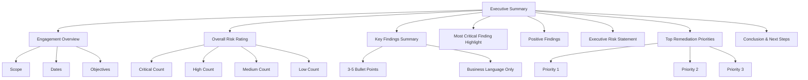
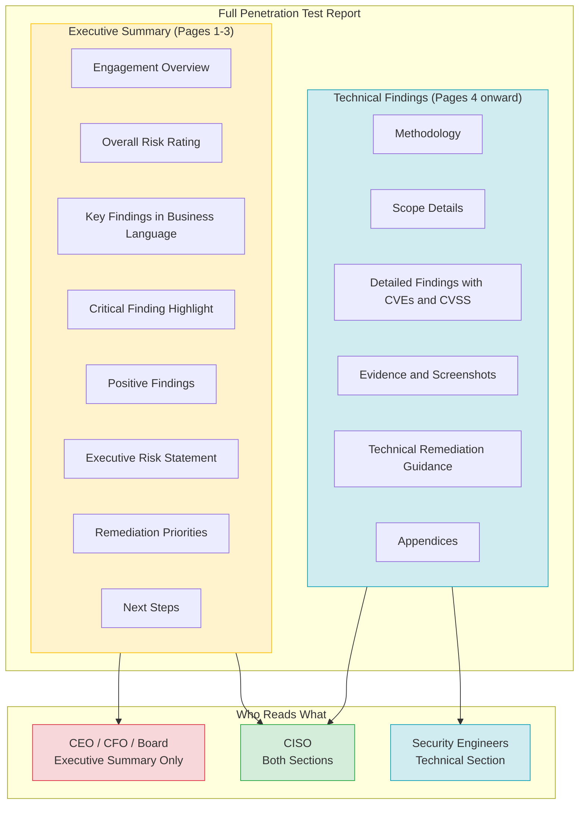

# Writing the Executive Summary

> **Difficulty:** Beginner → Advanced | **Category:** Penetration Testing

---

## Table of Contents

1. [Why the Executive Summary Is the Most Important Section](#1-why-the-executive-summary-is-the-most-important-section)
2. [Knowing Your Audience](#2-knowing-your-audience)
3. [What NOT to Include](#3-what-not-to-include)
4. [Components of a Great Executive Summary](#4-components-of-a-great-executive-summary)
5. [Language Guide — Translating Technical to Business](#5-language-guide--translating-technical-to-business)
6. [Bad vs Good Examples](#6-bad-vs-good-examples)
7. [Full Executive Summary Template](#7-full-executive-summary-template)
8. [Tailoring for Different C-Suite Roles](#8-tailoring-for-different-c-suite-roles)
9. [Visual Elements in Executive Summaries](#9-visual-elements-in-executive-summaries)
10. [Structure Diagram](#10-structure-diagram)
11. [Common Mistakes](#11-common-mistakes)
12. [Length and Format Guidance](#12-length-and-format-guidance)
13. [Review Process Before Delivery](#13-review-process-before-delivery)

---

## 1. Why the Executive Summary Is the Most Important Section

When a penetration test is complete, you will typically produce a report that is anywhere from 30 to 200+ pages long. That report contains technical details, screenshots of exploits, CVE references, CVSS scores, remediation guidance for developers, and evidence of every step you took during the engagement. It is a thorough, professional artifact.

Almost nobody at the top of the organization will read it.

The CEO will not read 150 pages of technical findings. The CFO will not parse CVSS scoring methodology. The Board of Directors will not study packet capture screenshots. These are not failings on their part — they have a different job than understanding exploit chains. Their job is to make strategic decisions about risk, investment, liability, and organizational direction.

The executive summary is the one section of the report that decision-makers will actually read. In many organizations, it is the *only* section they read. This means that everything that matters about your engagement — every critical risk you uncovered, every urgent remediation priority, every business-level implication — must be captured clearly, concisely, and in plain language within the first one to three pages of your report.

If the executive summary is poorly written, the following happens:

- Critical vulnerabilities fail to get the organizational priority they deserve
- Budget is not allocated for remediation because leadership does not understand the risk
- The security team cannot escalate issues because they have no executive-friendly language to cite
- The penetration test investment is wasted — the findings sit in a PDF, unread and unaddressed

Conversely, a well-written executive summary can:

- Directly drive board-level security investment decisions
- Trigger immediate remediation action on critical findings
- Build the case for larger security programs
- Demonstrate the value of the penetration testing engagement to the business
- Create organizational awareness of the real-world threat landscape

> **Note:** Think of the executive summary not as a summary of your work, but as a business communication tool. Your job is not to prove what you did — your job is to communicate what the organization is at risk of, and what they should do about it.

The executive summary is also typically the most re-read section of the report. It gets forwarded by the CISO to the CEO. The CEO may share it with the board. The CFO may share it with legal counsel. Each of these recipients will only see the executive summary, not the full technical report. Every word matters.

### 1.1 The Stakes Are Real

Poor security reporting has real-world consequences. Organizations that receive technically excellent penetration test findings but poorly communicated executive summaries often:

- Defer remediation indefinitely because "it didn't seem that urgent"
- Under-resource their security teams because leadership doesn't grasp the threat
- Fail compliance audits because systemic issues were never escalated to decision-makers
- Suffer breaches from vulnerabilities that were identified in a pentest report but never prioritized

Your executive summary is not administrative overhead. It is potentially the most impactful piece of writing you produce in an engagement.

---

## 2. Knowing Your Audience

Before writing a single word, you must understand who will read the executive summary and what they care about. The technical section of your report is written for security engineers and developers. The executive summary is written for an entirely different group of people.

### 2.1 The C-Suite and Board — Who They Are

| Role | Primary Concern | How They Measure Risk |
|------|----------------|----------------------|
| **CEO** | Business viability, brand reputation, strategic direction | "Does this threaten our ability to operate or compete?" |
| **CFO** | Financial exposure, cost of breach vs. cost of fix | "What is this going to cost us, and can we afford not to fix it?" |
| **CISO** | Security posture, program maturity, technical priorities | "What are the top risks and what do I need to fix first?" |
| **COO** | Operational continuity, process disruption | "Will this take down our operations?" |
| **General Counsel / CLO** | Legal liability, regulatory compliance, data breach obligations | "What is our legal exposure?" |
| **Board of Directors** | Strategic risk, regulatory obligations, fiduciary duty | "Are we managing risk responsibly as an organization?" |
| **CTO** | Technical architecture, development practices | "Where do our systems need to be redesigned?" |

### 2.2 What Each Role Cares About

**CEO**
The CEO is responsible for the overall health and direction of the business. They want to know:
- Is this a crisis that requires immediate action?
- Does this affect customers, partners, or the brand?
- What is the worst-case scenario if this is not fixed?
- Is this a competitive liability?

**CFO**
The CFO is focused on financial exposure. They want to know:
- What is the potential financial cost of a breach resulting from these findings?
- What does remediation cost?
- What is the ROI of the security investment?
- What are the regulatory fine risks?

**CISO**
The CISO is the bridge between technical security and the business. They will likely read both the executive summary and the full technical report. For the executive summary, they care about:
- Whether the findings align with their existing risk assessments
- How to communicate the risk to the rest of the C-suite
- Which findings represent immediate escalation priorities
- Whether the security program is improving over time

**Board of Directors**
Board members are typically non-technical senior business leaders or investors. They are focused on:
- Fiduciary responsibility and governance
- Regulatory and compliance risk (GDPR, SOC 2, HIPAA, PCI-DSS)
- Reputational risk and brand damage
- Whether management is handling security responsibly

> **Warning:** Never write an executive summary assuming the reader has any technical background. Even a CTO who is technically sophisticated is reading the executive summary in their role as a business decision-maker, not as an engineer.

### 2.3 What They Are Not Interested In

Executives are not interested in:
- The methodology you used to conduct the test
- The specific tools you ran
- Raw vulnerability scanner output
- How clever your exploit chain was
- The technical details of any specific CVE
- Network topology diagrams
- Packet captures or raw command output

These belong in the technical findings section of the report. Keep them there.

---

## 3. What NOT to Include

This section deserves dedicated attention because violations of it are the most common failures in real-world penetration test executive summaries.

### 3.1 Technical Jargon

Avoid all of the following in the executive summary:

- Buffer overflow, stack smashing, heap spray
- SQL injection, XSS, CSRF, XXE, SSRF, RCE, LFI, RFI
- Privilege escalation, lateral movement, persistence mechanism
- Pass-the-hash, Kerberoasting, Golden Ticket, DCSync
- CVSS scores, CVE numbers, CWE identifiers
- TCP/UDP, port numbers, protocol names
- SHA-1, MD5, AES-128, RSA-2048 (unless explaining in plain English what "weak encryption" means for them)
- Any tool names (Metasploit, Burp Suite, Nmap, BloodHound, Mimikatz)

> **Warning:** Using technical jargon in an executive summary signals to business leaders that you don't understand communication. It undermines trust in your findings, because if you can't explain the risk in plain English, they will assume you may not fully understand it yourself.

### 3.2 CVE Numbers and Raw Vulnerability Data

A finding like "CVE-2021-44228 (CVSS 10.0) was identified on Apache Log4j version 2.14.1" means nothing to a CFO. Instead, say: "A critical flaw was found in a widely-used software component on your web servers that would allow an outside attacker to take complete control of those servers without any authentication."

### 3.3 Exhaustive Finding Lists

The executive summary is not a compressed version of the full finding list. If you found 47 vulnerabilities, do not list all 47 in the executive summary. Select the 3 to 5 most impactful findings and present only those, in business language. Direct the reader to the full technical report for the complete list.

### 3.4 Tool Output and Screenshots

Raw Nmap output, Burp Suite screenshots, Metasploit session output — none of this belongs in the executive summary. Technical evidence belongs in the technical findings section.

### 3.5 Unsubstantiated Claims

Do not include alarmist language that is not supported by your findings. If you found medium-severity findings, do not write that the organization is "on the brink of catastrophic breach." Maintain credibility through accuracy.

### 3.6 Remediation Technical Instructions

Specific remediation steps (patch version numbers, configuration directives, code changes) belong in the technical findings section, not the executive summary. At the executive level, you communicate priorities, not implementation instructions.

---

## 4. Components of a Great Executive Summary

A well-structured executive summary contains the following components, in roughly this order:



### 4.1 Engagement Overview

The engagement overview is a brief, 2–4 sentence description of what was tested, when, and by whom. Keep it factual and extremely concise.

Include:
- **What was tested:** "The external network perimeter, web application at [domain], and internal network from an assumed-breach perspective."
- **When:** Testing dates, e.g., "Testing was conducted from January 15–26, 2025."
- **Type of test:** "A black-box external penetration test" or "A gray-box web application assessment."
- **Performed by:** Your firm and team, if relevant.

Do not include: scope exclusions, testing constraints, detailed methodology, or tool lists.

### 4.2 Overall Risk Rating

Provide a high-level risk rating for the engagement as a whole, and a breakdown of finding severity counts. This gives executives an at-a-glance view of the security posture.

**Example format:**

| Severity | Count | Description |
|----------|-------|-------------|
| 🔴 Critical | 2 | Immediate threat to business operations or data |
| 🟠 High | 5 | Significant risk requiring urgent remediation |
| 🟡 Medium | 11 | Moderate risk requiring planned remediation |
| 🟢 Low | 8 | Minor risk, addressed in routine maintenance |
| ℹ️ Informational | 4 | Best practice recommendations |

**Overall Engagement Risk: HIGH**

The overall rating should reflect the aggregate risk posture, weighted toward the highest-severity findings. Two critical findings make an engagement HIGH or CRITICAL overall, regardless of how many lows were found.

> **Note:** Use a simple, consistent color-coded system. Traffic light colors (red/orange/yellow/green) are universally understood and require no explanation.

### 4.3 Key Findings Summary

List the 3 to 5 most significant findings from the engagement, written entirely in business language. Each bullet should describe:
1. What the risk is (in plain English)
2. What the business impact could be
3. The severity level

**Example:**
- 🔴 **Critical:** An attacker on the internet could gain administrative control of your internal network without requiring any valid credentials, potentially accessing all company data, email systems, and financial records.
- 🔴 **Critical:** Customer payment card data is stored in a format that violates PCI-DSS requirements, creating direct regulatory liability and potential fines exceeding $500,000.
- 🟠 **High:** Employee credentials obtained through phishing could provide direct access to your cloud infrastructure, with no secondary verification mechanism to prevent unauthorized access.

### 4.4 Most Critical Finding Highlight

Single out the single most impactful finding for a dedicated paragraph. Describe it in plain language, explain what an attacker could do if they exploited it, describe the business impact, and indicate whether it is immediately exploitable.

> **Warning:** The "most critical finding highlight" should create urgency. If it is truly critical, say so clearly and directly. Do not soften the language to the point where the urgency is lost. Decision-makers need to feel the weight of a critical finding.

### 4.5 Positive Findings — What's Working Well

Every professional executive summary should include a section on what the organization is doing well. This serves several purposes:
- It demonstrates that the assessment was balanced and fair
- It gives the security team credit for effective controls
- It provides executive leadership with reassurance about areas of lower risk
- It makes the overall report more credible (a report that finds only problems looks biased)

**Example:**
- Network segmentation between the production environment and corporate network was effectively implemented and prevented lateral movement from the DMZ.
- Multi-factor authentication was enforced consistently for all remote access systems.
- Patch management for internet-facing systems was timely and well-maintained.

### 4.6 Executive Risk Statement

This is a single, powerful paragraph that synthesizes the overall risk to the business. It should be written in the kind of language a CEO or board member can quote directly in a meeting. It should answer: "What is our risk exposure, and what is the business consequence if we don't act?"

**Example:**
> "The results of this assessment indicate that [Organization Name] faces material risk of unauthorized access to customer data and internal systems from both external internet-based attackers and potential insider threats. Two critical vulnerabilities, if exploited, could result in complete loss of control over core business systems. Given the sensitive nature of customer data processed by [Organization Name], exploitation of these vulnerabilities would likely trigger breach notification obligations under applicable privacy regulations, in addition to significant reputational and financial harm."

### 4.7 Top 3–5 Remediation Priorities

List the top remediation priorities in order of urgency, written in business language. Each priority should include a rough timeframe.

| Priority | Action | Urgency | Business Rationale |
|----------|--------|---------|-------------------|
| 1 | Enforce multi-factor authentication on all remote access systems | Immediate (within 7 days) | Prevents credential-based account takeovers |
| 2 | Isolate and patch the two critical vulnerabilities on internet-facing servers | Immediate (within 7 days) | Eliminates the highest-risk attack path |
| 3 | Implement encryption for stored customer payment data | Short-term (30 days) | Achieves PCI-DSS compliance and reduces regulatory liability |
| 4 | Deploy email filtering to reduce phishing exposure | Short-term (60 days) | Reduces risk of credential compromise through social engineering |
| 5 | Conduct security awareness training for all staff | Medium-term (90 days) | Addresses human-factor risk across the organization |

### 4.8 Conclusion and Recommended Next Steps

Close the executive summary with a brief conclusion that reinforces the key message and provides clear next steps. This is not the place for lengthy recaps — keep it to 3–5 sentences.

Recommended next steps typically include:
- Schedule a remediation kickoff meeting with technical teams
- Establish a timeline for addressing critical and high findings
- Schedule a re-test following remediation of top priorities
- Consider expanded scope for future assessments if gaps were found
- Engage executive leadership in a debrief session if needed

---

## 5. Language Guide — Translating Technical to Business

This is one of the most valuable skills a penetration tester can develop. The ability to translate deeply technical findings into clear, business-relevant language is what separates an average report from an exceptional one.

### 5.1 The Core Translation Principle

Ask yourself: **"What can an attacker DO with this vulnerability, and what does that mean for the BUSINESS?"**

Never describe the vulnerability mechanism. Always describe the business impact.

| Technical Language | Business Language |
|-------------------|-------------------|
| SQL injection vulnerability in the login form | An attacker could extract the entire customer database, including usernames, passwords, email addresses, and any stored payment data, without requiring valid credentials |
| Weak SSL/TLS configuration (SSLv3/TLS 1.0 supported) | Customer data transmitted to your website — including login credentials and personal information — could be intercepted by an attacker on the same network |
| Unauthenticated remote code execution via CVE-2021-44228 | An attacker could take complete control of your web servers from anywhere on the internet, without needing a username or password |
| NTLM hash capture and relay attack | An attacker already inside your network could silently impersonate any employee, including administrators, and gain access to all systems and data those employees can access |
| Exposed .git directory on web server | The source code of your entire web application, potentially including hardcoded passwords and API keys, is publicly accessible to anyone on the internet |
| Kerberoasting leading to domain admin | Once an attacker gains a foothold on any workstation in your network, they can likely gain full administrative control of your entire Active Directory environment within minutes |
| Stored cross-site scripting (XSS) in customer portal | Malicious code could be injected into pages viewed by your customers, allowing attackers to steal customer session tokens, redirect users to phishing sites, or perform actions on their behalf |
| Insecure direct object reference (IDOR) in API | A logged-in customer could access the private data of any other customer simply by changing a number in a web request — no hacking tools required |
| Password spray resulting in account compromise | A common attack technique of trying a small number of frequently-used passwords against all user accounts succeeded, resulting in access to internal systems with a valid employee account |
| Absence of multi-factor authentication on VPN | If an employee's password is compromised through phishing or a data breach, an attacker can immediately access your entire internal network without any additional barrier |
| Cleartext credentials in application config files | Passwords that grant access to critical systems and databases are stored in plaintext on servers, meaning any attacker who gains access to those servers instantly gains access to everything those credentials protect |
| Privilege escalation via misconfigured sudo rules | An attacker who gains access to a low-privilege account (such as one used by a web application) can immediately elevate themselves to full administrative control of the server |
| SMB signing not enforced | An attacker on your internal network can intercept and manipulate file-sharing traffic between computers, potentially redirecting users to attacker-controlled servers without detection |
| Default credentials on management interfaces | Network equipment and servers can be accessed using factory-default usernames and passwords, which are publicly known and require no skill to use |

### 5.2 The Impact Escalation Ladder

When describing business impact, work up from the immediate technical consequence to the business consequence:

```
Technical Finding
       ↓
What an attacker can do (capability)
       ↓
What they can access (scope)
       ↓
What the business loses (impact)
       ↓
Financial / Regulatory / Reputational consequence
```

**Example applied to SQL injection:**
1. Technical: SQL injection in login form
2. Capability: Attacker can query the database directly
3. Scope: Can extract all 2.4 million customer records
4. Impact: Complete loss of confidentiality for all customer data
5. Consequence: GDPR breach notification obligation, potential fine, reputational damage, customer churn

### 5.3 Phrases to Use and Avoid

| Avoid | Use Instead |
|-------|-------------|
| "Vulnerability was identified" | "An attacker could..." |
| "The CVSS score is 9.8" | "This is a critical risk" |
| "RCE via deserialization flaw" | "Complete server takeover possible" |
| "Exploitable with public tools" | "Requires minimal skill to exploit" |
| "Privilege escalation chain" | "Could gain full administrative access" |
| "Lateral movement was possible" | "Could move freely across the network" |
| "Sensitive data exposure" | "Customer/employee data could be stolen" |
| "The system was compromised" | "We were able to gain full control of..." |
| "Hash cracking was performed" | "Passwords were recovered" |
| "Misconfigured ACL" | "Access controls were not properly set" |

---

## 6. Bad vs Good Examples

### 6.1 Example of a BAD Executive Summary

---

**Executive Summary — Network Penetration Test**
*AcmeCorp Infrastructure Assessment — Q1 2025*

During the engagement, our team identified 26 vulnerabilities across the assessed scope. The following critical findings were identified:

**Finding 1: CVE-2021-44228 — Apache Log4j Remote Code Execution (CVSS 10.0)**
Apache Log4Shell vulnerability (CVE-2021-44228) was identified on hosts 10.10.1.45 and 10.10.1.78 running Apache Log4j versions 2.14.0 and 2.12.1 respectively. JNDI injection via the User-Agent HTTP header was confirmed exploitable using publicly available PoC tooling. This results in unauthenticated RCE as the tomcat service account (UID 1001), with subsequent privilege escalation to root via CVE-2021-4034 (PwnKit).

**Finding 2: NTLM Relay Attack via SMB (CWE-294)**
SMB signing was not enforced on 34 of 41 domain-joined workstations. Using Responder and ntlmrelayx, we captured and relayed NTLM authentication requests, successfully authenticating to multiple hosts as DOMAIN\admin_backup. From this access, DCSync was performed using Impacket's secretsdump.py, extracting NTLM hashes for all 312 domain accounts including krbtgt.

**Finding 3: SQL Injection — /api/v2/users/login (CWE-89, CVSS 9.8)**
Time-based blind SQL injection was identified in the username parameter of the POST /api/v2/users/login endpoint. Using sqlmap with --level=3 --risk=2 flags, database enumeration confirmed a MySQL 8.0.26 backend with 14 tables in the production_users database, including PII fields such as SSN, DOB, and full_address.

**Remediation:**
Upgrade Log4j to 2.17.1 or later. Enable SMB signing via GPO (Network security: Digitally sign communications (always)). Parameterize SQL queries per OWASP guidelines A03:2021.

---

**Why this is bad:**

- Opens with a raw count of vulnerabilities with no business context
- Uses CVE numbers that mean nothing to executives
- Includes IP addresses, UIDs, and tool-specific flags — technical noise
- Names specific tools (Responder, ntlmrelayx, sqlmap, Impacket)
- Uses terms like "NTLM relay," "DCSync," "Time-based blind SQL injection," "JNDI injection"
- Remediation is a technical instruction, not a business priority
- Provides no business impact whatsoever
- Would cause a CEO or CFO to immediately stop reading

---

### 6.2 Example of a GOOD Executive Summary

---

**Executive Summary — Network Security Assessment**
*AcmeCorp | Conducted January 15–26, 2025 | Conducted by SecureState Consulting*

**Engagement Overview**

SecureState Consulting conducted a comprehensive security assessment of AcmeCorp's external network perimeter and internal corporate network during January 2025. The objective was to identify security vulnerabilities that could be exploited by an outside attacker or a malicious insider, and to provide prioritized guidance for improving the organization's security posture.

**Overall Security Rating: CRITICAL**

| Severity | Findings |
|----------|----------|
| 🔴 Critical | 2 |
| 🟠 High | 5 |
| 🟡 Medium | 10 |
| 🟢 Low | 9 |

**What We Found**

The assessment identified serious vulnerabilities that, if exploited, could result in complete loss of control over AcmeCorp's internal systems and unauthorized access to sensitive customer data. The two most critical findings are:

- 🔴 **An attacker on the internet could take complete control of two of your publicly accessible web servers without any username or password.** From that position, they could access your internal network and potentially reach all company systems, email, and data.

- 🔴 **Once inside the network, it was possible to gain full administrative control over all 312 employee accounts and every system on the corporate network within hours.** This includes access to financial systems, HR data, and all customer records.

- 🟠 **Customer personal data including home addresses, dates of birth, and identifying information could be extracted from your customer database by an attacker who exploits the web application login page.** This would trigger regulatory notification obligations under applicable data protection law.

- 🟠 **Remote access to the corporate network is not protected by a second layer of verification.** Any employee whose password is stolen through a phishing email could give an attacker immediate, unrestricted access to the internal network.

- 🟡 **Several internal systems are accessible using factory-default passwords that are publicly known.** Any employee or contractor with network access could log into these systems without authorization.

**What Is Working Well**

AcmeCorp has made meaningful investments in security that should be recognized. Network segmentation between customer-facing systems and internal corporate systems was found to be effective. Patch management for the majority of internet-facing systems was up to date. Security monitoring tooling was deployed and logging was configured on critical servers.

**Our Risk Assessment**

The findings from this assessment indicate that AcmeCorp faces a critical level of security risk. The combination of an externally exploitable server vulnerability and the ability to gain full administrative control of the internal network represents the highest possible risk scenario. An opportunistic attacker — or a sophisticated threat actor targeting AcmeCorp specifically — could cause significant operational disruption, data theft, and regulatory harm. The time to exploit these vulnerabilities is measured in hours, not weeks.

**Top Priorities for Remediation**

| Priority | Action Required | Timeframe |
|----------|----------------|-----------|
| 1 | Apply emergency patches to the two critical internet-facing web servers | Within 48 hours |
| 2 | Enable multi-factor authentication for all remote access systems | Within 7 days |
| 3 | Reset credentials for all network administrative accounts | Within 7 days |
| 4 | Address the vulnerability on the customer login page that exposes personal data | Within 30 days |
| 5 | Change all factory-default passwords on network equipment | Within 30 days |

**Recommended Next Steps**

We recommend scheduling an immediate remediation kickoff meeting with AcmeCorp's technical teams to begin addressing the critical findings. Following remediation of the top two priorities, a targeted re-test is recommended to confirm the vulnerabilities have been resolved. We are available for an executive debrief to discuss these findings in further detail.

---

**Why this is good:**

- Opens with what was tested, not with raw counts
- Risk rating is immediately visible and uses simple color coding
- All findings are described in business impact language
- No CVE numbers, tool names, IP addresses, or technical jargon
- Acknowledges what is working well, adding credibility
- The risk statement creates appropriate urgency without being alarmist
- Remediation priorities are business decisions, not technical instructions
- Timeframes are clear and actionable
- A CEO, CFO, or Board member can read and fully understand it in under two minutes

---

## 7. Full Executive Summary Template

Use this template as a starting point for every engagement. Fill in each section with engagement-specific content.

---

```
EXECUTIVE SUMMARY
[Client Name] — [Assessment Type]
Conducted: [Start Date] – [End Date]
Prepared by: [Your Firm Name]
Classification: CONFIDENTIAL

─────────────────────────────────────────────────────────

ENGAGEMENT OVERVIEW

[Your firm] conducted a [type of assessment: external network / web
application / internal network / red team / etc.] assessment of
[Client Name]'s [scope description] during [dates]. The objective of
this engagement was to [state objectives in 1-2 sentences in plain
English]. This assessment was conducted from the perspective of
[attacker profile: an unauthenticated internet attacker / an
authenticated insider / etc.].

─────────────────────────────────────────────────────────

OVERALL SECURITY POSTURE: [CRITICAL / HIGH / MEDIUM / LOW]

┌───────────────┬────────┬─────────────────────────────────────┐
│ Severity      │ Count  │ Description                         │
├───────────────┼────────┼─────────────────────────────────────┤
│ Critical      │  [N]   │ Requires immediate action           │
│ High          │  [N]   │ Requires urgent attention           │
│ Medium        │  [N]   │ Requires planned remediation        │
│ Low           │  [N]   │ Address in routine maintenance      │
│ Informational │  [N]   │ Best practice recommendations       │
└───────────────┴────────┴─────────────────────────────────────┘

─────────────────────────────────────────────────────────

KEY FINDINGS

The following findings represent the most significant risks
identified during this assessment:

• [CRITICAL] [Business-language description of finding 1.
  What could an attacker do? What data or systems are at risk?
  What is the business consequence?]

• [CRITICAL] [Business-language description of finding 2, if
  applicable. Same structure as above.]

• [HIGH] [Business-language description of high-severity
  finding. Focus on business impact.]

• [HIGH] [Additional high-severity finding if applicable.]

• [MEDIUM] [Most significant medium-severity finding, if
  relevant to executive audience.]

For a complete list of all findings and technical remediation
guidance, refer to the Technical Findings section of this report.

─────────────────────────────────────────────────────────

MOST CRITICAL FINDING

[Write a dedicated paragraph about the single most impactful
finding. Describe what it is (in plain English), how easily it can
be exploited (is it immediate? does it require skill?), what an
attacker could achieve if they exploited it, and what the business
impact would be. This paragraph should be written with enough
urgency that a CEO immediately understands why this requires
priority action.]

─────────────────────────────────────────────────────────

WHAT IS WORKING WELL

[Client Name] has implemented several security controls that
demonstrate a commitment to security and should be recognized:

• [Positive finding 1 — specific and genuine]
• [Positive finding 2]
• [Positive finding 3]

These controls contributed to limiting the scope of risk in
several areas during the assessment.

─────────────────────────────────────────────────────────

EXECUTIVE RISK STATEMENT

[Write 3–5 sentences synthesizing the overall risk to the
organization in plain English. Answer: What is the overall risk
level? What could happen if the top findings are not addressed?
Is the organization at risk of regulatory liability? Is there a
risk to business operations, customer data, or brand reputation?
End with a statement about the urgency of remediation.]

─────────────────────────────────────────────────────────

REMEDIATION PRIORITIES

The following actions are recommended in priority order:

┌──────────┬──────────────────────────────────┬────────────┐
│ Priority │ Action                           │ Timeframe  │
├──────────┼──────────────────────────────────┼────────────┤
│    1     │ [Action — business language]     │ [X days]   │
│    2     │ [Action — business language]     │ [X days]   │
│    3     │ [Action — business language]     │ [X days]   │
│    4     │ [Action — business language]     │ [X days]   │
│    5     │ [Action — business language]     │ [X days]   │
└──────────┴──────────────────────────────────┴────────────┘

Technical remediation guidance for all findings is provided in
the Technical Findings section of this report.

─────────────────────────────────────────────────────────

CONCLUSION AND NEXT STEPS

[1–3 sentences concluding the summary. Reinforce the overall risk
message and express confidence that remediation of the identified
issues will meaningfully improve the security posture.]

Recommended next steps:
1. Schedule a remediation kickoff meeting with technical teams
2. Establish a formal tracking process for finding remediation
3. Schedule a re-test following remediation of critical and high
   findings
4. [Any engagement-specific recommendation]

[Your firm] is available to provide clarification on any findings,
assist with remediation planning, or conduct a re-assessment
following remediation activities.
```

---

## 8. Tailoring for Different C-Suite Roles

While a single executive summary will be read by multiple people, if you have the opportunity to provide a dedicated briefing or cover letter to a specific executive, tailor your language accordingly.

### 8.1 Tailoring for the CEO

The CEO needs to understand risk in the context of business strategy and reputation.

**Emphasize:**
- Risk to brand reputation and customer trust
- Risk to business continuity and operations
- Competitive risk if a breach occurs
- Whether the organization would be viewed as negligent if it were breached today
- The strategic investment required to remediate vs. the cost of a breach

**Key phrases:**
- "This vulnerability could allow an attacker to access customer data, resulting in a notification obligation affecting all [X] customers."
- "A breach resulting from this vulnerability could disrupt operations for an estimated [days/weeks]."
- "Competitors who have addressed similar vulnerabilities are less likely to face the same liability exposure."

### 8.2 Tailoring for the CFO

The CFO frames everything in financial terms. Meet them there.

**Emphasize:**
- Estimated cost of a data breach (cite IBM Cost of a Data Breach report if appropriate)
- Regulatory fine exposure (GDPR: up to 4% of annual global turnover; HIPAA: up to $1.9M per violation category; PCI-DSS: fines plus card brand penalties)
- Cost of remediation vs. cost of a breach (remediation is almost always vastly cheaper)
- Cyber insurance implications (some policies require passing security standards)
- Litigation and legal cost exposure

**Key phrases:**
- "The average cost of a data breach in [industry] is $[X]M according to industry data."
- "Failure to encrypt stored payment card data exposes the organization to PCI-DSS fines of up to $[X] per month plus potential loss of the ability to process card payments."
- "The estimated cost to remediate the top 5 priorities is significantly less than the regulatory exposure from a single breach event."

| Financial Risk Category | Example Exposure |
|------------------------|-----------------|
| GDPR fine (severe) | Up to 4% of global annual turnover |
| HIPAA fine (willful neglect) | Up to $1.9M per violation category |
| PCI-DSS non-compliance | $5,000–$100,000/month + card brand penalties |
| Average cost of data breach | ~$4.9M (IBM 2024 report) |
| Cyber incident response | $150–$500K for external forensics alone |
| Litigation / class action | Highly variable; can reach hundreds of millions |

### 8.3 Tailoring for the CISO

The CISO will read both the executive summary and the full technical report. For an executive briefing with the CISO specifically:

**Emphasize:**
- How findings relate to existing risk register items
- Security program maturity gaps revealed by the assessment
- Which findings represent architectural issues vs. configuration issues
- How the security posture compares to prior assessments (if applicable)
- Specific quick wins vs. long-term architectural improvements

> **Note:** The CISO is your ally in communicating risk to the rest of the C-suite. Ensure the executive summary gives them clear, quotable language they can use when briefing their peers.

### 8.4 Tailoring for the Board of Directors

Board members focus on governance, fiduciary responsibility, and strategic risk.

**Emphasize:**
- Whether the organization is meeting its legal and regulatory obligations
- Whether management is adequately addressing known security risks
- Reputational risk and impact on shareholder/stakeholder value
- Whether the organization has the resources and processes to manage cyber risk
- Benchmarking against industry peers or regulatory requirements

**Key phrases:**
- "As a board member, you have a governance obligation to ensure the organization has adequate controls over data security. The findings of this assessment suggest that [specific control area] requires board-level attention."
- "This assessment identified risks that, if not addressed, could result in regulatory penalties that would require disclosure in annual reports or regulatory filings."
- "Based on industry benchmarks, the organization's current security posture is below average for companies of similar size and data handling scope."

---

## 9. Visual Elements in Executive Summaries

Visual elements are powerful tools for communicating risk at a glance to non-technical audiences. They should complement — never replace — clear written explanations.

### 9.1 Risk Heat Map

A risk heat map plots findings by likelihood of exploitation vs. business impact. It gives executives an immediate visual understanding of where the most serious risks sit.

```
                    RISK HEAT MAP

HIGH     │  Med-H  │ CRITICAL│ CRITICAL│
         │         │         │         │
MEDIUM   │  Med    │  Med    │  High   │
Impact   │         │         │         │
LOW      │  Low    │  Low    │  Medium │
         └─────────┴─────────┴─────────┘
              LOW     MEDIUM     HIGH
                    Likelihood
```

Plot each finding as a labeled dot on this grid. Anything in the top-right quadrant (high impact, high likelihood) is where executives should focus. Critical findings should always appear in the top-right. Low-impact informational findings belong in the bottom-left.

### 9.2 Finding Distribution Chart

A simple horizontal bar chart or segmented bar showing finding distribution across severity levels. This is immediately readable and can be created in any word processor.

```
FINDING DISTRIBUTION

Critical  ██░░░░░░░░░░░░░░░░░░░░  2
High      █████░░░░░░░░░░░░░░░░░  5
Medium    ███████████░░░░░░░░░░░  11
Low       ████████░░░░░░░░░░░░░░  8
Info      ████░░░░░░░░░░░░░░░░░░  4
          0    5    10   15   20
```

### 9.3 Risk Trend (Re-Tests)

If this is a re-test or follow-on engagement, a risk trend chart is extremely valuable for executives. It shows whether the security posture is improving over time.

| Metric | Baseline (Q3 2024) | Re-Test (Q1 2025) | Change |
|--------|-------------------|-------------------|--------|
| Critical findings | 4 | 2 | ↓ 50% |
| High findings | 8 | 5 | ↓ 38% |
| Medium findings | 15 | 11 | ↓ 27% |
| Overall risk rating | CRITICAL | HIGH | Improved |

This table communicates progress clearly and validates the investment in both the original assessment and the remediation work. Executives respond well to seeing measurable improvement — it demonstrates that the security program is functioning effectively.

### 9.4 Remediation Progress Tracker (Re-Test)

Show which findings from the prior report were remediated and which remain open.

| Finding | Prior Status | Current Status |
|---------|-------------|----------------|
| Unauthenticated server access | Open | Remediated |
| Weak remote access controls | Open | Remediated |
| Customer data encryption | Open | Partial |
| Default credentials on equipment | Open | Still Open |
| Email filtering gaps | Open | Open |

> **Warning:** Never inflate remediation progress. If a fix was partial or ineffective, say so honestly. Misrepresenting remediation status can expose your firm to professional liability and damages the trust relationship with the client.

---

## 10. Structure Diagram

The following diagram shows the full structure of a penetration test report and where the executive summary sits within it, along with who reads each section:



### 10.1 The Layered Reading Model

One way to think about a penetration test report is as a layered document, where each layer is designed for a specific audience:

| Layer | Section | Audience | Reading Time |
|-------|---------|----------|-------------|
| Layer 1 | Executive Summary | CEO, CFO, Board, CISO | 2–5 minutes |
| Layer 2 | Finding Summaries | CISO, Security Manager | 15–30 minutes |
| Layer 3 | Full Technical Findings | Security Engineers, Developers | 1–3 hours |
| Layer 4 | Appendices and Evidence | Forensic reviewers, auditors | As needed |

Design each layer to stand completely on its own. A reader of Layer 1 should not need to read Layer 3 to understand the business risk. A reader of Layer 3 should not need to infer context from Layer 1.

---

## 11. Common Mistakes

Even experienced penetration testers make predictable mistakes in executive summaries. Understanding these failure modes helps you avoid them.

### 11.1 Writing for Yourself, Not the Reader

The most common mistake: writing what you found, not what the reader needs to know. The executive summary is not a demonstration of your technical skill. It is a communication to a specific audience with specific concerns. Keep asking: "Does a non-technical executive care about this? Can they take action based on this?"

### 11.2 Overloading with Findings

Listing every finding in the executive summary defeats its purpose. If you found 40 vulnerabilities, the executive summary should cover the 3–5 that matter most. Everything else goes in the technical section. An executive who sees a list of 40 items will feel overwhelmed and disengage.

### 11.3 Being Too Vague

The opposite extreme: being so vague that the executive summary communicates nothing of substance. "The organization has several areas for improvement" is useless. Be specific about what the risks are, even if you stay in business language.

### 11.4 Underselling Critical Risks

Some testers soften their language out of concern for how findings will be received. This is a disservice to the client. If something is critical, communicate that clearly. The client hired you to tell them the truth about their security posture, not to make them feel good.

### 11.5 Including Unrequested Scope

Do not editorialize about things that were outside the scope of the engagement. If you noticed something that looks like a security issue in an out-of-scope system, note it briefly in the technical section. Do not reference it in the executive summary unless it is so serious that it requires immediate escalation regardless of scope.

### 11.6 Not Acknowledging What Went Well

A report that only contains negative findings can come across as one-sided and can actually reduce trust in your findings. Always include a genuine acknowledgment of effective security controls. Make it specific — generic praise ("security awareness seems good") is transparent filler and erodes credibility.

### 11.7 Inconsistent Severity Ratings

If you rate a finding "Critical" in the executive summary but "High" in the technical section, executives will notice — and so will anyone who reads the full report. Ensure severity ratings are consistent throughout the entire document. Run a final check before delivery comparing executive summary severities against technical finding severities.

### 11.8 Missing Timeframes on Remediation

Saying "fix these issues" without providing urgency guidance is incomplete advice. Remediation priorities without timeframes leave the client without the information they need to plan. Always pair each priority with a recommended timeframe: immediate (24–72 hours), urgent (7 days), short-term (30 days), medium-term (60–90 days).

### 11.9 Failing to Distinguish Exploited vs. Identified

There is a significant difference between "we found this vulnerability theoretically exists" and "we successfully exploited this vulnerability and accessed your database." The executive summary should make this distinction clear. Confirmed exploitation carries more urgency and credibility.

### 11.10 Forgetting the Action Orientation

Every executive summary should end with a clear answer to: "What should we do now?" If the executive reads the summary and thinks "that's interesting, but I'm not sure what happens next," the summary has failed. Always end with explicit next steps.

### 11.11 Passive Voice Everywhere

Passive voice is the enemy of clarity and urgency. Compare:

- Passive: "Vulnerabilities were identified that could potentially be exploited."
- Active: "An attacker could exploit these vulnerabilities to steal customer data."

The active construction is more direct, more urgent, and more clearly communicates who does what. Use it consistently throughout the executive summary.

### 11.12 Failing to Connect to Business Context

If you know the client is a healthcare organization, connect findings to HIPAA. If they process payment cards, connect to PCI-DSS. If they operate in the EU, reference GDPR. Connecting findings to the client's specific regulatory and business context makes the executive summary far more impactful and demonstrates that you understand their business, not just their technology.

---

## 12. Length and Format Guidance

### 12.1 Length

The executive summary should be **1 to 3 pages** in a formatted report. This is an absolute maximum. One to two pages is ideal.

If your executive summary is running longer than 3 pages, you have included too much detail. Cut technical specifics ruthlessly. Push anything that requires explanation into the technical section.

> **Note:** Decision-makers who receive a 5-page "executive summary" will not read all of it. You will lose their attention after the first two pages. Length is not a substitute for quality — conciseness is a skill.

### 12.2 Typography and Visual Formatting

| Element | Recommendation |
|---------|---------------|
| Font | Clean, professional sans-serif (Calibri, Arial, Open Sans) |
| Body font size | 11–12pt |
| Heading font size | 14–16pt for main headings, 12–13pt for subheadings |
| Line spacing | 1.15–1.5x |
| Margins | Standard (1 inch / 2.5cm) all around |
| Color | Use sparingly — primarily for severity indicators |
| Tables | Use to present finding counts and remediation priorities |
| Bold text | Use for severity labels and key terms only |
| Logo and branding | Your firm's branding in the header; client logo if appropriate |
| Page numbering | Always include page numbers |
| Header/footer | Include document title and confidentiality marking on every page |

### 12.3 Reading Level

Aim for a reading level of approximately Grade 10–12 (Flesch-Kincaid). This is not about making the content "simple" — it is about making it accessible to busy professionals reading quickly.

Tools like the Hemingway Editor or Microsoft Word's readability statistics can help you check this.

Characteristics of the right reading level:
- Sentences average 15–20 words
- Paragraphs are 3–5 sentences maximum
- No passive voice where active voice works
- No nominalization ("the identification of" → "identifying")
- No unnecessary qualifiers ("somewhat," "potentially," "it could be argued")

### 12.4 Structure at a Glance

The executive summary should be skimmable. A CISO who has 45 seconds before a board meeting should be able to pick up the key messages by skimming headings, the risk rating table, the bullet-pointed findings, and the remediation priority table.

Use:
- Clear section headings
- Bullet points for finding summaries
- Tables for risk ratings and priorities
- Bold text for the most critical points
- White space — do not cram the page

### 12.5 Confidentiality Marking

Every page of the executive summary should carry a confidentiality marking. Common options:

- **CONFIDENTIAL** — standard for most client reports
- **CONFIDENTIAL — RESTRICTED DISTRIBUTION** — if distribution should be limited to named individuals
- **ATTORNEY-CLIENT PRIVILEGED** — if the engagement was commissioned through legal counsel for privilege protection purposes

Mark it consistently in the header or footer of every page. The executive summary will circulate beyond the original recipients — make sure the confidentiality expectation travels with it.

### 12.6 File Format and Delivery

Deliver the report in PDF format. PDF preserves formatting across all devices and operating systems, cannot be accidentally edited, and carries metadata that can be used to track document distribution if needed.

If a Word document is also requested for internal use, provide it separately and clearly mark it as a working copy, not the official report.

Never deliver the report as a plaintext email or inline in a message. Always deliver as a standalone, branded, formatted document.

---

## 13. Review Process Before Delivery

No executive summary should go to the client without a structured review process. Even an excellent tester can write a poor executive summary when tired at the end of a long engagement.

### 13.1 The Internal Review Checklist

Before the report is delivered, the executive summary should be reviewed against this checklist:

| Check | Reviewer | Questions |
|-------|----------|-----------|
| Technical accuracy | Lead tester | Does the executive summary accurately represent the findings? Are severity ratings consistent with the technical section? |
| Business language | Senior consultant or PM | Is every sentence free of technical jargon? Could a non-technical executive understand every paragraph? |
| Completeness | Lead tester | Are the top findings covered? Are all remediation priorities listed? Is there a conclusion and next steps? |
| Tone and credibility | Senior consultant | Is the tone professional? Are risks communicated with appropriate urgency, neither understated nor alarmist? |
| Factual review | QA reviewer | Are all client names, dates, system names, and counts accurate and correct? |
| Consistency | QA reviewer | Do severity ratings match between the executive summary and technical findings? Do finding counts match? |
| Confidentiality | Report lead | Is the correct confidentiality marking applied? Is the client name correct throughout? |
| Readability | Fresh reviewer | Does it read clearly? Is it under 3 pages? Is it skimmable? |
| Action orientation | PM | Does the reader know exactly what to do after reading this? |

### 13.2 Peer Review — The "Blank Slate" Test

Have someone who was not involved in the engagement read the executive summary cold, with no prior briefing. Ask them:
- After reading this, what do you think the three biggest risks are?
- What should this organization do immediately?
- Is there anything you didn't understand?

If they cannot answer the first two questions accurately, the summary needs revision. If they found anything confusing, that section needs clarification. This is the single most effective quality check you can run on an executive summary.

### 13.3 CISO Pre-Delivery Review

On longer engagements or in established client relationships, it is often appropriate to share a draft executive summary with the CISO before formal delivery. This gives the CISO the opportunity to:

- Flag any factual inaccuracies
- Provide context that might affect how findings are framed
- Prepare to brief their leadership before the report arrives
- Request any additional framing for specific executive concerns

> **Warning:** Pre-delivery review with the CISO should never result in downgrading or removing legitimate findings to make the report look better. If a CISO pressures you to soften or remove critical findings, that is a professional ethics issue. Document the original findings and the request. Your firm's integrity depends on reporting what you found, accurately and completely.

### 13.4 Final Review Timeline

| Stage | Timing | Owner |
|-------|--------|-------|
| First draft complete | 2–3 days before delivery | Lead tester |
| Internal technical review | 1–2 days before delivery | Senior consultant |
| Business language review | 1–2 days before delivery | PM or senior consultant |
| QA and consistency check | 1 day before delivery | QA reviewer |
| Final sign-off | Morning of delivery day | Engagement lead |
| Optional CISO pre-review | 1 day before formal delivery | Engagement lead with CISO |

> **Note:** Never deliver a report on the same day it was written. Even a one-day gap between writing and delivery review catches errors that are invisible to the writer in the moment. Fresh eyes find mistakes that the author's brain autocorrects past.

### 13.5 Post-Delivery Debrief

After formal delivery, offer a debrief call or meeting with the CISO and relevant executives. This debrief serves to:

- Walk leadership through the executive summary verbally
- Answer questions in real time
- Emphasize the most urgent findings
- Help the security team build internal momentum for remediation
- Establish expectations for the re-test timeline

A well-delivered debrief often has more impact than the written report itself. Prepare talking points from the executive summary before the debrief. Know which two or three findings you want leadership to remember when they leave the room.

---

## Summary

The executive summary is the highest-leverage piece of writing in a penetration test report. It determines whether your findings drive organizational change or sit unread in a PDF. Master it by:

1. **Writing for decision-makers**, not technical practitioners
2. **Using business impact language** — what can an attacker *do*, and what does it cost the *business*
3. **Including only the most significant findings** — 3 to 5 maximum
4. **Being specific about risk** while avoiding technical jargon entirely
5. **Providing clear, time-bound remediation priorities** that executives can act on
6. **Acknowledging what is working** to build credibility and balance
7. **Keeping it to 1–3 pages** — no more
8. **Reviewing rigorously** before delivery

A one-page executive summary that moves the CEO to act is infinitely more valuable than a technically perfect 200-page report that no one reads.

---

*See also: [Technical Findings Structure](./technical-findings.md) | [Risk Scoring Methodology](./risk-scoring.md) | [Report Delivery and Debrief](./report-delivery.md)*
