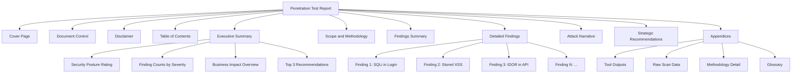

# Penetration Test Report Structure

> **Difficulty:** Intermediate | **Category:** Penetration Testing

---

## Why Good Reports Matter

The penetration test report is the **primary deliverable** of any engagement. Not the shells obtained, not the data exfiltrated in a demo, not the clever exploit chains discovered — the *report* is what the client receives, reads, stores, and acts upon. A tester who compromises a client's entire infrastructure but submits a disorganized, vague, or incomplete report has failed the engagement.

> **Note:** Clients are paying for documented risk reduction, not for hacking. The report translates technical compromise into business decisions. Without a clear, actionable report, even critical findings may go unaddressed.

### The Report IS the Product

Consider the lifecycle of a penetration test:

1. Pre-engagement scoping and contracts
2. Active testing (days to weeks)
3. **Report writing and delivery (days)**
4. Remediation by client teams (weeks to months)
5. Re-test verification

Steps 4 and 5 are entirely driven by the quality of the report. If remediation teams cannot reproduce findings, cannot understand impact, or cannot identify which system is affected — the finding effectively does not exist.

### Legal and Compliance Value

Reports serve multiple legal and governance functions:

- **Liability documentation:** Evidence that authorized testing occurred, defining scope boundaries
- **Compliance evidence:** PCI-DSS Requirement 11.3 mandates penetration testing and documentation. ISO 27001 Clause A.12.6.1 requires vulnerability management documentation. SOC 2 Type II auditors review pentest reports as evidence of control testing.
- **Insurance support:** Cyber insurance underwriters increasingly require pentest reports as part of premium assessment and claims processes
- **Board-level evidence:** Directors and Officers need documented evidence that the organization is taking reasonable steps to assess and address cybersecurity risk

> **Warning:** A poorly formatted report that references systems or findings outside the agreed scope can create serious legal liability for both the testing firm and the client. Document scope explicitly.

---

## Report Audiences

A penetration test report must serve multiple audiences simultaneously. Understanding each audience is essential to structuring the document correctly.

### Executive Audience

**Who they are:** CISO, CTO, CFO, CEO, Board members, Risk Officers

**What they need:**
- Business risk framing, not technical detail
- Financial and reputational impact of findings
- Strategic recommendations with prioritization
- Overall security posture assessment
- Comparison to industry peers or previous assessments

**What they do NOT want:**
- CVE numbers
- CVSS vector strings
- Technical reproduction steps
- Raw tool output
- Acronyms without explanation (SSRF, XXE, IDOR)

**How to write for them:** Use plain English. Replace "SQL injection enabling UNION-based data extraction" with "a vulnerability allowing unauthorized access to the customer database." Quantify business impact where possible: "an attacker could access all 87,000 customer payment records."

---

### Technical Audience

**Who they are:** Security engineers, application developers, system administrators, DevOps engineers, network engineers

**What they need:**
- Exact URLs, IP addresses, and parameters affected
- Step-by-step reproduction instructions
- HTTP request/response evidence
- Specific code references or configuration lines to fix
- Detailed technical remediation with code examples

**What they do NOT want:**
- Business buzzwords without substance
- Vague findings like "weak authentication observed"
- Remediation guidance that says "fix the vulnerability"
- Missing evidence that prevents reproduction

---

### Compliance Audience

**Who they are:** Internal auditors, external auditors (QSA, ISO 27001 auditors), legal teams, regulatory examiners

**What they need:**
- Clear methodology documentation (PTES, OWASP, NIST SP 800-115)
- Explicit scope confirmation matching signed Rules of Engagement
- Evidence of test authorization
- Testing dates and timeframes
- Tester qualifications (OSCP, CREST, GPEN)
- Chain of custody for evidence

---

## Complete Report Structure

The following structure is used by professional penetration testing firms and is recognized by compliance frameworks.



---

### Section 1: Cover Page

The cover page is the first thing the client sees and must project professionalism and confidentiality.

**Required elements:**

| Element | Example |
|---|---|
| Report title | Web Application Penetration Test Report |
| Client name | AcmeCorp Inc. |
| Engagement reference | ACM-PT-2024-003 |
| Testing dates | November 1–15, 2024 |
| Report date | November 22, 2024 |
| Report version | v1.0 FINAL |
| Classification marking | **CONFIDENTIAL — RESTRICTED DISTRIBUTION** |
| Author | Jane Smith, OSCP, CEH |
| Reviewer | John Doe, CREST CRT |
| Company logo | [Testing firm logo] |

> **Warning:** Every page of the report must include a classification header/footer: "CONFIDENTIAL — RESTRICTED DISTRIBUTION." This is not optional. Reports containing vulnerability details are sensitive documents.

---

### Section 2: Document Control

Tracks changes across report versions and controls distribution.

**Version History Table:**

| Version | Date | Author | Changes |
|---|---|---|---|
| v0.1 | 2024-11-16 | Jane Smith | Initial draft — findings sections complete |
| v0.2 | 2024-11-18 | Jane Smith | Executive summary added, screenshots attached |
| v0.9 | 2024-11-20 | John Doe | Peer review — severity adjustments on F-003, F-007 |
| v1.0 | 2024-11-22 | Jane Smith | Final version incorporating review feedback |

**Distribution List:**

| Name | Role | Company | Delivery Method |
|---|---|---|---|
| Sarah Johnson | CISO | AcmeCorp Inc. | Encrypted email |
| Michael Chen | Head of IT Security | AcmeCorp Inc. | Encrypted email |
| Tom Williams | CTO | AcmeCorp Inc. | Executive summary only |
| Engagement Archive | — | TestingFirm Ltd. | Secure document vault |

---

### Section 3: Disclaimer

The disclaimer protects both the testing firm and the client by setting legal context for the report.

**Standard disclaimer language:**

```
This report documents the findings of a penetration test performed by TestingFirm Ltd. 
for AcmeCorp Inc. under the terms of the Statement of Work dated October 15, 2024, 
and the Rules of Engagement signed by both parties.

This assessment represents a point-in-time evaluation of the security posture of 
the systems within the defined scope. The absence of a finding in this report does 
not indicate that the system is free from vulnerabilities — only that no vulnerability 
was identified within the time constraints and scope of this engagement.

This report is classified CONFIDENTIAL. It contains detailed information about 
security vulnerabilities that could be used to compromise AcmeCorp Inc. systems. 
Distribution is restricted to those listed in the Document Control section. 
AcmeCorp Inc. is responsible for securing this document appropriately.

All testing was performed with explicit written authorization from AcmeCorp Inc. 
Testing activities may have been logged by AcmeCorp security systems.
```

---

### Section 4: Table of Contents

Auto-generated in word processing tools. Must include page numbers. Should list all sections down to H2/H3 level for easy navigation. For PDF delivery, all ToC entries should be hyperlinked.

---

### Section 5: Executive Summary

**Length:** 1–2 pages maximum. This is the most important section of the report.

**Required components:**

#### 5a. Overall Security Posture Rating

A visual, color-coded assessment of the organization's overall security posture:

| Rating | Color | Meaning |
|---|---|---|
| **Critical** | 🔴 Red | Active exploitation likely or actively occurring. Immediate action required. |
| **High Risk** | 🟠 Orange | Significant vulnerabilities with likely exploitation potential. Urgent action needed. |
| **Moderate Risk** | 🟡 Yellow | Several vulnerabilities identified. Remediation should be prioritized. |
| **Low Risk** | 🟢 Green | Minor findings only. Security posture is generally adequate. |
| **Minimal Risk** | 🔵 Blue | No significant findings. Strong security controls observed. |

> **Note:** Use only ONE overall rating per report. Avoid vague ratings like "Fair" or "Needs Improvement." The rating should reflect the worst realistic attack scenario given current findings.

#### 5b. Key Findings Count

| Severity | Count | Definition |
|---|---|---|
| Critical | 2 | Immediate exploitation possible, catastrophic business impact |
| High | 5 | Likely exploitation, significant business impact |
| Medium | 8 | Conditional exploitation, moderate impact |
| Low | 11 | Limited exploitation potential, minor impact |
| Informational | 6 | Best practice observations, no direct risk |
| **Total** | **32** | |

#### 5c. Top Risk Statement (Plain English)

"During testing, we identified two critical vulnerabilities that, if exploited by an attacker, would allow unauthorized access to AcmeCorp's customer database containing 87,000 payment records. These findings require immediate remediation."

#### 5d. Business Impact Overview

Written in plain English, tied to specific business outcomes:
- Customer data exposure risk
- Regulatory compliance implications
- Operational disruption potential
- Reputational risk scenarios

#### 5e. Top 3 Strategic Recommendations

High-level, business-focused actions:
1. Implement a formal patch management program to address the 3 critical unpatched systems identified
2. Deploy multi-factor authentication across all remote access and administrative interfaces
3. Initiate a developer security training program focused on secure coding practices for web applications

---

### Section 6: Scope and Methodology

This section satisfies compliance audiences and defines the boundaries of the assessment.

#### 6a. Scope Definition

**In-Scope Systems:**

| Asset Type | Description | Testing Window |
|---|---|---|
| Web Application | https://app.acmecorp.com | Nov 1–15, 2024, 24/7 |
| Web Application | https://admin.acmecorp.com | Nov 1–15, 2024, business hours only |
| API Endpoints | https://api.acmecorp.com/v1/* | Nov 1–15, 2024, 24/7 |
| IP Range | 203.0.113.0/24 (external perimeter) | Nov 1–15, 2024, 24/7 |
| IP Range | 10.10.0.0/16 (internal, post-initial-access) | Nov 5–15, 2024, business hours only |

**Out-of-Scope Items:**

| Asset | Reason for Exclusion |
|---|---|
| https://partner.acmecorp.com | Third-party hosted, authorization not obtained |
| Production database servers | Risk of data corruption — read-only testing only |
| CEO and executive workstations | Explicitly excluded by client request |
| Any cloud infrastructure not listed above | Not assessed in this engagement |

#### 6b. Methodology

Testing followed the **Penetration Testing Execution Standard (PTES)** phases:

| Phase | Activities Performed |
|---|---|
| Pre-Engagement | Scoping, rules of engagement, legal authorization |
| Intelligence Gathering | OSINT, DNS enumeration, web crawling |
| Threat Modeling | Identifying high-value targets and attack vectors |
| Vulnerability Analysis | Automated scanning + manual verification |
| Exploitation | Attempting to exploit confirmed vulnerabilities |
| Post-Exploitation | Privilege escalation, lateral movement, data access |
| Reporting | Documentation, risk rating, recommendations |

Additional frameworks referenced:
- **OWASP Testing Guide v4.2** for web application testing
- **NIST SP 800-115** for technical methodology documentation
- **OWASP Top 10 2021** for web vulnerability classification

#### 6c. Testing Constraints

- Testing was performed from an external attacker perspective (black box) unless otherwise noted
- No credentials were provided at engagement start
- No source code was provided for review
- Testing was performed from dedicated testing infrastructure (IP: 203.0.113.100)
- All testing activities were logged with timestamps for audit purposes

---

### Section 7: Findings Summary

#### 7a. Severity Breakdown

| Severity | Count | Percentage |
|---|---|---|
| Critical | 2 | 6% |
| High | 5 | 16% |
| Medium | 8 | 25% |
| Low | 11 | 34% |
| Informational | 6 | 19% |

#### 7b. Findings by Category

| Category | Critical | High | Medium | Low | Info |
|---|---|---|---|---|---|
| Injection Vulnerabilities | 1 | 1 | 2 | 0 | 0 |
| Authentication & Session Mgmt | 1 | 2 | 1 | 2 | 1 |
| Access Control | 0 | 1 | 2 | 1 | 0 |
| Cryptography | 0 | 0 | 1 | 3 | 1 |
| Security Misconfiguration | 0 | 1 | 1 | 3 | 2 |
| Sensitive Data Exposure | 0 | 0 | 1 | 1 | 1 |
| Outdated Software | 0 | 0 | 0 | 1 | 1 |

---

### Section 8: Detailed Findings

Each finding must follow the same consistent template. Findings should be ordered by severity (Critical first), then by business impact within the same severity tier.

#### Finding Template

```
┌─────────────────────────────────────────────────────────────────────┐
│  FINDING ID:     F-001                                               │
│  TITLE:          SQL Injection in /api/users/login Enables           │
│                  Authentication Bypass and Full Database Dump        │
│  SEVERITY:       Critical                                            │
│  CVSS v3.1:      9.8 (CVSS:3.1/AV:N/AC:L/PR:N/UI:N/S:U/C:H/I:H/A:H)│
│  CWE:            CWE-89: Improper Neutralization of SQL Commands     │
│  AFFECTED HOST:  https://api.acmecorp.com/v1/users/login            │
│  PARAMETER:      username (POST body, JSON)                          │
└─────────────────────────────────────────────────────────────────────┘
```

**Vulnerability Description:**

A SQL injection vulnerability exists in the login endpoint at `/api/v1/users/login`. The `username` parameter is incorporated into a SQL query without parameterization or sanitization, allowing an attacker to manipulate the query structure. This vulnerability allows authentication bypass (logging in as any user without a password) and extraction of the entire database contents.

**Steps to Reproduce:**

1. Navigate to the application login page at `https://app.acmecorp.com/login`
2. Open Burp Suite and enable interception
3. Enter any username and password, click Login
4. Intercept the POST request to `/api/v1/users/login`
5. Modify the `username` JSON field to: `admin' OR '1'='1'--`
6. Forward the request
7. Observe that authentication succeeds without a valid password
8. For full database extraction, use the payload: `' UNION SELECT NULL,NULL,username,password,NULL FROM users--`

**Evidence:**

```http
POST /api/v1/users/login HTTP/1.1
Host: api.acmecorp.com
Content-Type: application/json
Content-Length: 67

{"username":"admin' OR '1'='1'--","password":"anything"}
```

```http
HTTP/1.1 200 OK
Content-Type: application/json

{
  "token": "eyJhbGciOiJIUzI1NiIsInR5cCI6IkpXVCJ9...",
  "user": {"id": 1, "username": "admin", "role": "superadmin"},
  "message": "Login successful"
}
```

**Business Impact:**

An unauthenticated attacker with access to the internet can exploit this vulnerability to:
1. Bypass authentication and log in as any user, including administrators
2. Extract the complete users database table, exposing 87,000 customer records including usernames, email addresses, bcrypt-hashed passwords, and home addresses
3. Potentially access additional database tables containing payment history, order data, and internal business records

Based on the schema discovered, the `users` table contains PII subject to GDPR and CCPA. A data breach resulting from this vulnerability would trigger mandatory regulatory notification requirements and could result in fines of up to 4% of annual global turnover under GDPR Article 83(5).

**Remediation:**

1. **Immediate (within 24 hours):** Deploy a WAF rule to block SQL metacharacters in the login endpoint as a temporary measure.

2. **Short-term (within 72 hours):** Replace string concatenation with parameterized queries in the authentication service. The vulnerable code pattern is:

```java
// VULNERABLE — do not use
String query = "SELECT * FROM users WHERE username='" + username + "' AND password='" + password + "'";
Statement stmt = conn.createStatement();
ResultSet rs = stmt.executeQuery(query);
```

Replace with:

```java
// SECURE — parameterized query
String query = "SELECT * FROM users WHERE username = ? AND password = ?";
PreparedStatement pstmt = conn.prepareStatement(query);
pstmt.setString(1, username);
pstmt.setString(2, hashedPassword);
ResultSet rs = pstmt.executeQuery();
```

3. **Long-term:** Implement a database account with minimum necessary privileges for the application. The application database user should not have SELECT permissions on the `payment_cards` or `internal_documents` tables.

**References:**
- OWASP: SQL Injection Prevention Cheat Sheet
- CWE-89: Improper Neutralization of Special Elements used in an SQL Command
- OWASP Top 10 2021: A03 Injection
- NIST NVD for similar CVEs: CVE-2021-27101 (Accellion FTA SQL injection)

---

### Section 9: Attack Narrative (Optional)

The attack narrative tells the story of a realistic attack scenario that chains multiple findings together to achieve a maximum business impact scenario. This section is highly valuable for executive audiences and for conveying the real-world risk of seemingly "low" individual findings.

**Example narrative excerpt:**

"Beginning from an unauthenticated external perspective, our testers first identified a SQL injection vulnerability in the login portal (F-001, Critical). By exploiting this vulnerability, we extracted a list of all user accounts and their password hashes. Using the extracted hashes, we cracked the password of the account `dbadmin@acmecorp.com` within 4 minutes using commodity hardware and a standard wordlist (F-007, High — Weak Password Policy).

Using these credentials, we logged into the internal administration panel (https://admin.acmecorp.com), where we identified a file upload function that did not validate file types (F-003, High). We uploaded a PHP web shell, which the server executed, granting us command execution on the web application server. From this position, we escalated privileges to root through a local privilege escalation exploit in the unpatched Linux kernel (F-002, Critical) and obtained full control of the server and its attached database."

---

### Section 10: Strategic Recommendations

Present as a prioritized roadmap rather than a list of technical fixes:

| Priority | Timeframe | Recommendation | Estimated Effort | Business Value |
|---|---|---|---|---|
| 1 | Immediate (0–7 days) | Remediate 2 Critical findings (F-001, F-002) | 2–4 developer days | Eliminates full database access risk |
| 2 | Short-term (8–30 days) | Remediate 5 High findings | 5–10 developer days | Eliminates authentication bypass risks |
| 3 | Medium-term (31–90 days) | Implement WAF, patch management process | 2–4 weeks sysadmin | Reduces future attack surface |
| 4 | Long-term (91–180 days) | Developer security training program | Ongoing | Prevents future vulnerability introduction |

---

### Section 11: Appendices

**Appendix A — Tools Used:**

| Tool | Version | Purpose |
|---|---|---|
| Nmap | 7.94 | Network discovery and port scanning |
| Burp Suite Professional | 2023.10 | Web application testing proxy |
| sqlmap | 1.7.8 | SQL injection detection and exploitation |
| Metasploit Framework | 6.3.25 | Exploitation framework |
| Nikto | 2.1.6 | Web server vulnerability scanning |
| FFUF | 2.1.0 | Web fuzzing and directory enumeration |
| Gobuster | 3.6 | Directory and DNS enumeration |
| Hashcat | 6.2.6 | Password hash cracking |

**Appendix B — Methodology Detail:**  Detailed description of each testing phase, including specific tests performed.

**Appendix C — Raw Scan Data:** Full Nmap scan output, Nikto reports, automated scanner results (before manual verification).

**Appendix D — Glossary:** Definitions of technical terms used in the report for non-technical readers.

---

## Common Report Writing Mistakes

| Mistake | Why It's Bad | Better Approach |
|---|---|---|
| Writing the executive summary for a technical audience | Executives cannot act on CVE numbers and CVSS vectors | Translate all technical findings into business impact language |
| Generic finding titles like "SQL Injection Found" | Provides no context, cannot be tracked or assigned | Use specific titles: "SQL Injection in /api/v1/login Allows Authentication Bypass" |
| Missing business impact statements | Developers and executives don't understand why a fix is urgent | Every finding must have a concrete business impact tied to data, operations, or compliance |
| Copy-pasting scanner output as a finding | Scanner output is not verified, is often wrong, and is not a finding description | Every finding must be manually verified. Scanner output belongs in appendices. |
| Remediation says "sanitize user input" | Developers don't know what "sanitize" means in context | Provide specific code changes, library recommendations, configuration settings |
| Grammar and spelling errors | Undermines professionalism and trust in the testing firm | Peer review required before delivery. Spell-check is not enough. |
| Missing reproduction evidence | Finding cannot be confirmed by client's remediation team | Include full HTTP requests/responses, screenshots, or PoC code for every finding |
| Incorrect severity ratings | Over-rating causes alert fatigue. Under-rating causes critical issues being ignored | Use CVSS v3.1 methodology. Document justification for any deviation from pure CVSS. |
| Template artifacts left in report | Shows the report is a fill-in-the-blank form, not a real assessment | Review every page for placeholder text like "[COMPANY NAME]" or "[INSERT IMPACT]" |
| Findings not sorted by severity | Remediation teams don't know what to fix first | Always sort: Critical → High → Medium → Low → Informational |
| No executive summary | Non-technical readers have no entry point to understand the report | Every report must have an executive summary, even for small engagements |
| Mixing tenses | "The attacker can access / could have accessed" inconsistency | Use present tense for vulnerability descriptions ("An attacker can...") |
| Missing scope reference | Compliance auditors cannot confirm testing matched authorized scope | Reference the signed Rules of Engagement document by date/reference number |
| No version number or date | Multiple report versions cause confusion about which is final | Always include version number and date, update with each revision |

---

## Executive vs Technical Sections Comparison

| Aspect | Executive Summary | Technical Findings |
|---|---|---|
| **Audience** | C-suite, Board, Risk Officers | Security engineers, developers, sysadmins |
| **Length** | 1–2 pages | As long as needed (typically 5–50 pages) |
| **Language** | Plain English, business context | Technical terminology acceptable |
| **Findings detail** | Count by severity, top risks only | Full detail for every finding |
| **CVE/CVSS numbers** | Never | Always |
| **Reproduction steps** | Never | Always |
| **Business impact** | Primary focus | Secondary context |
| **Technical remediation** | High-level strategic | Specific, actionable, with code |
| **Charts/visuals** | Essential | Helpful but not required |
| **Reading time** | 5–10 minutes | 60–120+ minutes |
| **Action items** | Strategic investment decisions | Specific fix-it tasks |
| **Tone** | Risk advisory | Technical documentation |

---

## Report Templates

### Finding Template

```markdown
## F-[ID]: [Specific Finding Title]

**Severity:** [Critical / High / Medium / Low / Informational]  
**CVSS v3.1 Score:** [X.X] — [CVSS:3.1/AV:?/AC:?/PR:?/UI:?/S:?/C:?/I:?/A:?]  
**CWE:** [CWE-XXX: Description]  
**CVE:** [CVE-YYYY-NNNNN if applicable, or N/A]  
**Affected System:** [IP / Hostname / URL]  
**Affected Component:** [Specific endpoint, parameter, service, configuration]

### Description
[2–4 sentence description of the vulnerability — what it is, where it exists, 
how it can be triggered. No jargon without explanation. Technical enough for 
engineers to understand, referenced to business impact.]

### Steps to Reproduce
1. [First step — specific, numbered]
2. [Second step — include exact values, payloads, parameters]
3. [Continue until finding is fully reproduced]
4. [Final step — show the impact achieved]

### Evidence
[HTTP request/response, screenshot description, tool output, PoC code]

### Business Impact
[Specific statement of what an attacker can achieve. Quantify where possible: 
number of records, type of data, business function impacted, regulatory implications]

### Remediation
**Immediate (within 24–72 hours):**
[Interim mitigation if applicable]

**Remediation:**
[Specific fix with code example, configuration change, or architectural change]

### References
- [OWASP / CWE / CVE / Vendor Advisory links]
```

---

### Executive Summary Template

```markdown
# Executive Summary

## Overall Security Posture: HIGH RISK 🟠

[Organization Name] engaged [Testing Firm] to perform a penetration test of [scope] 
during [dates]. Our assessment identified [N] findings, including [X] critical 
vulnerabilities that require immediate attention.

## Findings Overview

| Severity | Count |
|---|---|
| Critical | X |
| High | X |
| Medium | X |
| Low | X |
| Informational | X |

## Key Risk

[One paragraph in plain English describing the single most significant risk 
identified, using only business language.]

## Business Impact

If these vulnerabilities were exploited by a malicious actor:
- [Specific business impact 1 — customer data, operational, financial]
- [Specific business impact 2]
- [Specific business impact 3]

## Top Recommendations

1. [Strategic recommendation 1 — business-framed, actionable]
2. [Strategic recommendation 2]
3. [Strategic recommendation 3]

## Requested Next Steps

- Remediation of critical and high findings within [timeframe]
- Schedule re-test verification for [proposed date]
- [Additional next steps]
```

---

### Scope Definition Template

```markdown
## Scope Definition

**Engagement Reference:** [FIRM-CLIENT-YYYY-NNN]  
**Authorized by:** [Name, Title, Company] — [Date]  
**Rules of Engagement Reference:** [Document title and date]

### In-Scope Assets

| Asset | Description | Testing Type | Testing Window |
|---|---|---|---|
| [URL/IP] | [Description] | [Black/Grey/White box] | [Dates/Times] |

### Out-of-Scope Assets

| Asset | Reason |
|---|---|
| [URL/IP/System] | [Why excluded] |

### Testing Constraints

- [Any restrictions: no DoS testing, read-only database access, etc.]
- [Any required notifications before testing specific systems]
- [Emergency contact and abort procedures]
```

---

> **Note:** Always deliver the final report as a **password-protected PDF** with the password communicated through a separate channel (phone call, secure message). Never email a report without encryption. Many testing firms use Signal or encrypted email (PGP) for report delivery.

> **Warning:** Never include actual credentials, active API keys, or session tokens in a report. Redact or truncate sensitive values: show only enough to demonstrate the finding. Example: show `sk-proj-aBcD...XyZ` instead of a full API key.
