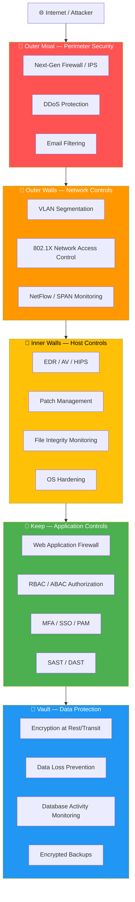
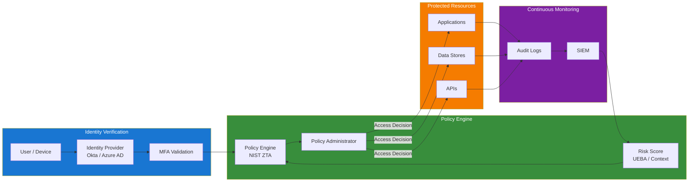
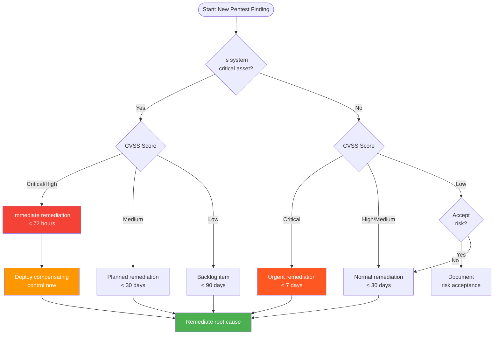

# Defense in Depth

> **Difficulty:** Intermediate | **Category:** Penetration Testing — Remediation

**Defense in depth** is the security principle that no single control is sufficient — multiple independent layers of protection are required so that the failure of any one layer does not result in a complete compromise. It is the most effective architectural approach to reducing attacker dwell time and limiting blast radius when a breach occurs.

---

## The Castle Model Analogy

Medieval castle architects understood layered security intuitively — no single wall was trusted to stop an attacker. Modern security architecture mirrors this design.



Each layer independently:
- **Detects** attacker activity (alerts, logs)
- **Delays** attacker progress (increases time-to-compromise)
- **Denies** access to the next layer if possible

An attacker must defeat **all** applicable layers to succeed. A defender needs only **one** layer to detect and respond.

---

## Security Layers

### Layer 1: Perimeter

The perimeter is the boundary between your network and the untrusted internet. While **perimeter-only security is dead**, the perimeter layer still provides valuable first-line filtering.

| Control | Technology | What It Stops |
|---------|-----------|---------------|
| **NGFW** | Palo Alto, Fortinet, Check Point | Known malware C2, unauthorized ports |
| **IDS/IPS** | Snort, Suricata | Known exploit signatures, protocol anomalies |
| **DDoS Protection** | Cloudflare, AWS Shield, Akamai | Volumetric attacks, SYN floods, amplification |
| **Email Filtering** | Proofpoint, Mimecast, MS Defender | Phishing, malware attachments, BEC |
| **Web Proxy** | Squid, Zscaler, Netskope | Malicious downloads, C2 over HTTP |
| **DNS Filtering** | Cisco Umbrella, Cloudflare Gateway | C2 domains, malware downloads |

#### Snort/Suricata Rules

```bash
# ── Install Suricata (IDS/IPS) ────────────────────────────────────
apt install suricata -y

# Download Emerging Threats ruleset
suricata-update

# Enable specific rule categories
suricata-update enable-source et/open
suricata-update enable-source oisf/trafficid
suricata-update update

# ── Custom Rules ─────────────────────────────────────────────────
# /etc/suricata/rules/local.rules

# Detect Mimikatz LSASS access
alert process any any -> any any (msg:"MIMIKATZ LSASS memory access"; \
    event_type:process; process_name:"mimikatz.exe"; sid:9000001; rev:1;)

# Detect PowerShell download cradles
alert http any any -> any any (msg:"Suspicious PowerShell download cradle"; \
    content:"IEX"; content:"DownloadString"; distance:0; within:50; \
    flow:established,to_server; sid:9000002; rev:1;)

# Detect DNS over HTTPS bypass attempts (DoH to non-standard servers)
alert dns any any -> !8.8.8.8 !1.1.1.1 any (msg:"DNS query to non-standard resolver"; \
    dns.query; content:"."; sid:9000003; rev:1;)

# Detect Port Scan (more than 15 unique ports in 60 seconds)
# Handled by the stream engine and threshold config:
threshold gen_id 1, sig_id 9000004, type both, track by_src, count 15, seconds 60

# ── Suricata in IPS mode (inline) ────────────────────────────────
# Modify /etc/suricata/suricata.yaml:
# af-packet:
#   - interface: eth0
#     cluster-id: 99
#     cluster-type: cluster_flow
#     defrag: yes
#     use-mmap: yes
#     tpacket-v3: yes

suricata -c /etc/suricata/suricata.yaml -i eth0 --af-packet
```

### Layer 2: Network

Network controls assume the perimeter has been breached (or an attacker is inside) and limit lateral movement.

```bash
# ── VLAN Configuration (Cisco IOS example) ───────────────────────

# Create VLANs for segmentation
vlan 10
  name DMZ
vlan 20
  name Servers_Production
vlan 30
  name Workstations
vlan 40
  name Printers
vlan 50
  name Management
vlan 99
  name Native_VLAN_Unused

# Assign ports to VLANs
interface GigabitEthernet0/1
  switchport mode access
  switchport access vlan 20
  spanning-tree portfast
  spanning-tree bpduguard enable

# Trunk port (between switches/router)
interface GigabitEthernet0/24
  switchport mode trunk
  switchport trunk allowed vlan 10,20,30,40,50
  switchport trunk native vlan 99

# ── Inter-VLAN routing with ACLs (restrict lateral movement) ─────
ip access-list extended VLAN30_TO_VLAN20
  permit tcp 10.0.30.0 0.0.0.255 10.0.20.0 0.0.0.255 eq 443
  permit tcp 10.0.30.0 0.0.0.255 10.0.20.0 0.0.0.255 eq 80
  deny   ip  10.0.30.0 0.0.0.255 10.0.20.0 0.0.0.255 log
  permit ip  any any

# Workstations should NOT be able to directly reach databases
ip access-list extended BLOCK_WORKSTATION_TO_DB
  deny   tcp 10.0.30.0 0.0.0.255 10.0.20.100 0.0.0.0 eq 3306 log
  deny   tcp 10.0.30.0 0.0.0.255 10.0.20.100 0.0.0.0 eq 5432 log
  deny   tcp 10.0.30.0 0.0.0.255 10.0.20.100 0.0.0.0 eq 1433 log
  permit ip  any any
```

#### 802.1X Network Access Control

```
# FreeRADIUS configuration for 802.1X
# /etc/freeradius/3.0/mods-enabled/eap
eap {
    default_eap_type = peap
    timer_expire = 60
    
    peap {
        default_eap_type = mschapv2
        copy_request_to_tunnel = no
        use_tunneled_reply = yes
        virtual_server = "inner-tunnel"
    }
    
    tls-config tls-common {
        private_key_file = /etc/freeradius/3.0/certs/server.key
        certificate_file = /etc/freeradius/3.0/certs/server.crt
        ca_file = /etc/freeradius/3.0/certs/ca.crt
        cipher_list = "ECDHE+AESGCM:DHE+AESGCM"
        min_version = "1.2"
    }
}

# Network policy: assign VLAN based on user group
# /etc/freeradius/3.0/policy.d/vlan_assignment
post-auth {
    if (LDAP-Group == "Employees") {
        reply:Tunnel-Type = VLAN
        reply:Tunnel-Medium-Type = IEEE-802
        reply:Tunnel-Private-Group-Id = "30"
    }
    elsif (LDAP-Group == "Guests") {
        reply:Tunnel-Private-Group-Id = "100"
    }
    elsif (LDAP-Group == "Servers") {
        reply:Tunnel-Private-Group-Id = "20"
    }
}
```

### Layer 3: Host

Host-based controls assume the network has been traversed and focus on protecting individual systems.

#### EDR Deployment and Configuration

```bash
# ── CrowdStrike Falcon Sensor (Linux) ────────────────────────────
# Download sensor from CrowdStrike console
wget "https://api.crowdstrike.com/sensors/entities/download-urls/v1" \
  -H "Authorization: Bearer $API_TOKEN" \
  -O falcon-sensor.rpm

rpm -ivh falcon-sensor.rpm
/opt/CrowdStrike/falconctl s --cid="YOUR_CUSTOMER_ID"
systemctl start falcon-sensor
systemctl enable falcon-sensor

# Verify sensor status
/opt/CrowdStrike/falconctl g --rfm-state --version --aid

# ── File Integrity Monitoring with AIDE ──────────────────────────
apt install aide aide-common -y

# Configure what to monitor
cat >> /etc/aide/aide.conf << 'EOF'
# Monitor critical system files
/bin NORMAL
/sbin NORMAL
/usr/bin NORMAL
/usr/sbin NORMAL
/etc NORMAL
/boot NORMAL
/lib NORMAL
/lib64 NORMAL
/opt NORMAL

# Exclude frequently-changing files (reduce false positives)
!/var/log
!/var/run
!/tmp
!/proc
!/sys
!/dev
EOF

# Initialize the AIDE database (first run — captures baseline)
aideinit
cp /var/lib/aide/aide.db.new /var/lib/aide/aide.db

# Run check (compare current state vs baseline)
aide --check 2>&1 | tee /var/log/aide-check-$(date +%Y%m%d).log

# Schedule daily checks
cat > /etc/cron.daily/aide-check << 'EOF'
#!/bin/bash
/usr/bin/aide --check 2>&1 | mail -s "AIDE Daily Report - $(hostname)" security@company.com
EOF
chmod +x /etc/cron.daily/aide-check
```

#### Application Whitelisting

```powershell
# ── Windows Defender Application Control (WDAC) ──────────────────
# More robust than AppLocker — enforced by kernel

# Create a WDAC base policy
New-CIPolicy -FilePath "C:\WDAC\BasePolicy.xml" `
    -Level Publisher `
    -Fallback Hash `
    -UserPEs `
    -MultiplePolicyFormat

# Convert to binary for deployment
ConvertFrom-CIPolicy -XmlFilePath "C:\WDAC\BasePolicy.xml" `
    -BinaryFilePath "C:\WDAC\BasePolicy.bin"

# Deploy via GPO (Computer Configuration → Windows Settings → Security Settings → 
# Application Control Policies)
Copy-Item "C:\WDAC\BasePolicy.bin" "C:\Windows\System32\CodeIntegrity\SIPolicy.p7b"

# ── AppLocker (simpler, for initial deployment) ───────────────────
# Allow only signed executables from Program Files and Windows
$rules = New-Object System.Security.AccessControl.FileSystemAccessRule

# Generate default rules (allow standard Windows applications)
Get-AppLockerFileInformation -Directory "C:\Windows\System32" -Recurse | `
    New-AppLockerPolicy -RuleType Publisher -Xml | `
    Out-File "C:\AppLocker\SystemPolicy.xml"

# Import via GPO or Set-AppLockerPolicy
Set-AppLockerPolicy -XmlPolicy "C:\AppLocker\SystemPolicy.xml" -Merge

# Test what would be blocked
Get-AppLockerFileInformation -Path "C:\Users\User\Downloads\suspect.exe" | `
    Test-AppLockerPolicy -Path "C:\AppLocker\SystemPolicy.xml" -User Everyone
```

### Layer 4: Application

Application controls focus on the software itself — preventing vulnerabilities from being exploitable.

#### Web Application Firewall (ModSecurity with OWASP CRS)

```bash
# ── Install ModSecurity with OWASP Core Rule Set ──────────────────
apt install libapache2-mod-security2 -y
a2enmod security2

# Download OWASP CRS
wget https://github.com/coreruleset/coreruleset/archive/refs/tags/v3.3.5.tar.gz
tar xvf v3.3.5.tar.gz
mv coreruleset-3.3.5 /etc/modsecurity/crs

# Configure ModSecurity
cp /etc/modsecurity/crs/crs-setup.conf.example /etc/modsecurity/crs/crs-setup.conf

# /etc/modsecurity/modsecurity.conf key settings
cat >> /etc/modsecurity/modsecurity.conf << 'EOF'
SecRuleEngine On                    # Enforce mode (not just detect)
SecRequestBodyAccess On
SecResponseBodyAccess Off           # Enable if needed for data leakage detection
SecRequestBodyLimit 13107200        # 12.5 MB
SecRequestBodyNoFilesLimit 131072   # 128 KB
SecPcreMatchLimit 1000
SecPcreMatchLimitRecursion 1000

# Log location
SecAuditEngine RelevantOnly
SecAuditLog /var/log/apache2/modsec_audit.log
SecAuditLogParts ABIJDEFHZ

# Paranoia level (1=least strict, 4=most strict)
# Start at 1, tune, then increase
SecAction "id:900000,phase:1,nolog,pass,t:none,setvar:tx.paranoia_level=1"
EOF

# Enable CRS in Apache config
cat >> /etc/apache2/conf-available/modsecurity.conf << 'EOF'
<IfModule mod_security2.c>
    SecRuleEngine On
    Include /etc/modsecurity/modsecurity.conf
    Include /etc/modsecurity/crs/crs-setup.conf
    Include /etc/modsecurity/crs/rules/*.conf
</IfModule>
EOF

a2enconf modsecurity
systemctl restart apache2

# Monitor ModSecurity alerts
tail -f /var/log/apache2/modsec_audit.log | grep -E '"message"|"uri"|"clientip"'
```

#### Input Validation and Output Encoding

```python
# ── Python/Flask: Secure Input Handling ──────────────────────────
from flask import Flask, request, abort
import bleach
import re
from markupsafe import escape

app = Flask(__name__)

# Allowlist validation for expected input formats
def validate_username(username: str) -> bool:
    """Only allow alphanumeric characters and underscores, 3-32 chars."""
    return bool(re.match(r'^[a-zA-Z0-9_]{3,32}$', username))

def validate_email(email: str) -> bool:
    """Basic email format validation."""
    pattern = r'^[a-zA-Z0-9._%+\-]+@[a-zA-Z0-9.\-]+\.[a-zA-Z]{2,}$'
    return bool(re.match(pattern, email)) and len(email) <= 254

# Safe HTML sanitization using bleach
ALLOWED_TAGS = ['b', 'i', 'em', 'strong', 'p', 'br']
ALLOWED_ATTRIBUTES = {}

def sanitize_html(user_input: str) -> str:
    """Strip all HTML except safe formatting tags."""
    return bleach.clean(user_input, tags=ALLOWED_TAGS, attributes=ALLOWED_ATTRIBUTES, strip=True)

@app.route('/user/<username>')
def get_user(username):
    # Validate before processing
    if not validate_username(username):
        abort(400, "Invalid username format")
    
    # Use parameterized queries (never string formatting)
    # user = db.execute("SELECT * FROM users WHERE username = ?", (username,))
    
    # Output encode before rendering
    safe_username = escape(username)
    return f"<p>User: {safe_username}</p>"
```

```javascript
// Node.js/Express: Secure input handling
const express = require('express');
const validator = require('validator');
const xss = require('xss');
const helmet = require('helmet');

const app = express();

// Helmet sets security headers automatically
app.use(helmet({
    contentSecurityPolicy: {
        directives: {
            defaultSrc: ["'self'"],
            scriptSrc: ["'self'"],
            styleSrc: ["'self'", "'unsafe-inline'"],
            imgSrc: ["'self'", "data:"],
        },
    },
    hsts: { maxAge: 31536000, includeSubDomains: true, preload: true },
    noSniff: true,
    frameguard: { action: 'sameorigin' },
}));

// Input validation middleware
const validateUserInput = (req, res, next) => {
    const { email, username, comment } = req.body;
    
    if (email && !validator.isEmail(email)) {
        return res.status(400).json({ error: 'Invalid email format' });
    }
    
    if (username && !validator.isAlphanumeric(username)) {
        return res.status(400).json({ error: 'Username must be alphanumeric' });
    }
    
    // Sanitize HTML in free-text fields
    if (comment) {
        req.body.comment = xss(comment);
    }
    
    next();
};
```

### Layer 5: Data

The data layer is the ultimate target — protecting it even when all other layers fail.

```bash
# ── Encryption at Rest ────────────────────────────────────────────

# LUKS full disk encryption (Linux)
cryptsetup luksFormat /dev/sdb --type luks2 \
    --cipher aes-xts-plain64 \
    --key-size 512 \
    --hash sha512 \
    --pbkdf argon2id

cryptsetup luksOpen /dev/sdb encrypted_data
mkfs.ext4 /dev/mapper/encrypted_data
mount /dev/mapper/encrypted_data /mnt/secure

# File-level encryption with GPG
gpg --symmetric --cipher-algo AES256 --compress-algo none sensitive_data.tar
gpg --decrypt sensitive_data.tar.gpg > sensitive_data.tar

# ── Encryption at Rest for AWS (S3) ──────────────────────────────
# Enforce encryption on S3 bucket
aws s3api put-bucket-encryption \
    --bucket my-sensitive-bucket \
    --server-side-encryption-configuration '{
        "Rules": [{
            "ApplyServerSideEncryptionByDefault": {
                "SSEAlgorithm": "aws:kms",
                "KMSMasterKeyID": "arn:aws:kms:us-east-1:123456789:key/key-id"
            },
            "BucketKeyEnabled": true
        }]
    }'

# Block unencrypted uploads
aws s3api put-bucket-policy --bucket my-sensitive-bucket --policy '{
    "Statement": [{
        "Sid": "DenyUnencryptedObjectUploads",
        "Effect": "Deny",
        "Principal": "*",
        "Action": "s3:PutObject",
        "Resource": "arn:aws:s3:::my-sensitive-bucket/*",
        "Condition": {
            "StringNotEquals": {
                "s3:x-amz-server-side-encryption": "aws:kms"
            }
        }
    }]
}'

# ── Database Transparent Data Encryption ─────────────────────────
# MySQL InnoDB TDE
# In my.cnf:
# early-plugin-load=keyring_file.so
# keyring_file_data=/var/lib/mysql-keyring/keyring
# innodb_encrypt_tables=ON
# innodb_encrypt_log=ON

# PostgreSQL pgcrypto for column-level encryption
# CREATE EXTENSION pgcrypto;
# INSERT INTO users (name, ssn) VALUES ('John', pgp_sym_encrypt('123-45-6789', 'encryption_key'));
# SELECT pgp_sym_decrypt(ssn, 'encryption_key') FROM users;
```

#### 3-2-1 Backup Rule Implementation

```bash
# ── 3-2-1 Backup Strategy ─────────────────────────────────────────
# 3 copies of data
# 2 different storage media
# 1 offsite copy

# Local backup (copy 1 — primary media)
tar czf /backup/local/db-$(date +%Y%m%d).tar.gz /var/lib/postgresql/

# Offsite backup to cloud (copy 3 — offsite)
aws s3 cp /backup/local/db-$(date +%Y%m%d).tar.gz \
    s3://company-backups-encrypted/databases/ \
    --sse aws:kms \
    --storage-class STANDARD_IA

# NAS/secondary storage (copy 2 — different media)
rsync -avz --progress /backup/local/ nas01:/backups/$(hostname)/

# Test restore procedure monthly
cat > /usr/local/bin/test-restore.sh << 'EOF'
#!/bin/bash
BACKUP_FILE=$(ls -t /backup/local/*.tar.gz | head -1)
RESTORE_DIR=/tmp/restore-test-$(date +%Y%m%d)
mkdir -p "$RESTORE_DIR"

echo "[+] Testing restore of: $BACKUP_FILE"
tar xzf "$BACKUP_FILE" -C "$RESTORE_DIR" || { echo "RESTORE FAILED"; exit 1; }

echo "[+] Verifying file count..."
ORIGINAL_COUNT=$(find /var/lib/postgresql/ -type f | wc -l)
RESTORED_COUNT=$(find "$RESTORE_DIR" -type f | wc -l)

if [ "$ORIGINAL_COUNT" -eq "$RESTORED_COUNT" ]; then
    echo "[✓] Restore test PASSED: $RESTORED_COUNT files"
else
    echo "[✗] Restore test FAILED: Expected $ORIGINAL_COUNT, got $RESTORED_COUNT"
fi
rm -rf "$RESTORE_DIR"
EOF
chmod +x /usr/local/bin/test-restore.sh
```

---

## Zero Trust Architecture



### Zero Trust vs Traditional Perimeter Security

| Aspect | Traditional Perimeter | Zero Trust |
|--------|----------------------|------------|
| **Trust model** | Trust anything inside the network | Never trust, always verify |
| **Perimeter** | Hard shell (firewall at edge) | No perimeter — identity-centric |
| **Lateral movement** | Easy once inside | Blocked by microsegmentation |
| **Remote work** | VPN brings inside | Native cloud/mobile support |
| **Cloud assets** | Not protected | First-class citizens |
| **Credential theft impact** | Attacker has full network access | Attacker limited by session context |
| **Implementation complexity** | Lower (for legacy arch) | Higher (requires IdP, PKI, UEBA) |
| **BYOD** | Risky — untrusted devices get in | Device posture checked continuously |

### Zero Trust Implementation Components

```bash
# ── NIST SP 800-207 Zero Trust Architecture Components ────────────

# 1. Identity Provider (IdP) — Okta, Azure AD, Ping Identity
#    - All authentication flows through IdP
#    - MFA enforced for all access
#    - Conditional access based on risk score

# 2. Privileged Access Management (PAM)
#    CyberArk, BeyondTrust, Delinea
#    - Vault credentials (no human knows production passwords)
#    - Just-in-time (JIT) privileged access

# 3. Microsegmentation
#    Illumio, VMware NSX, Cisco TrustSec
#    - Workload-level firewall rules
#    - East-west traffic control

# 4. Endpoint Trust Verification
#    - Device certificate required for access
#    - Patch compliance check
#    - EDR agent required

# Example: Azure AD Conditional Access Policy (pseudocode)
# IF user == ANY AND app == "SalesApp"
#   REQUIRE MFA
#   REQUIRE compliant device
#   REQUIRE known location OR named location
#   ALLOW access
# ELSE IF user == ANY AND app == "AdminPortal"  
#   REQUIRE MFA
#   REQUIRE privileged workstation
#   REQUIRE privileged role
#   ALLOW access ONLY during business hours
# ELSE
#   BLOCK access
```

---

## Identity as the New Perimeter

### Multi-Factor Authentication

```bash
# ── MFA Strength Comparison ───────────────────────────────────────
```

| MFA Method | Phishing Resistant | Strength | Use Case |
|------------|-------------------|---------|---------|
| **FIDO2/WebAuthn (YubiKey)** | ✅ Yes | ⭐⭐⭐⭐⭐ | Privileged accounts, high-value targets |
| **Certificate (Smart Card)** | ✅ Yes | ⭐⭐⭐⭐⭐ | Enterprise workstations, VPN |
| **Passkeys** | ✅ Yes | ⭐⭐⭐⭐⭐ | Consumer/enterprise authentication |
| **TOTP (Authenticator App)** | ❌ No | ⭐⭐⭐⭐ | Standard enterprise MFA |
| **Push notification** | ❌ No | ⭐⭐⭐ | Convenient enterprise MFA (MFA fatigue risk) |
| **SMS OTP** | ❌ No | ⭐⭐ | Legacy — susceptible to SIM swap |
| **Email OTP** | ❌ No | ⭐ | Weakest — attacker may own email |

> **Warning:** SMS-based MFA is vulnerable to SIM swapping and SS7 attacks. Migrate to app-based TOTP or hardware keys for any privileged access. The MGM Resorts breach (2023) began with a social engineering attack that bypassed SMS MFA.

### Privileged Access Management

```bash
# ── CyberArk PAM Integration Pattern ─────────────────────────────

# 1. No human knows root/admin passwords
#    CyberArk rotates them automatically every N hours

# 2. Just-in-time access request flow:
#    User requests access → Approval workflow → 
#    CyberArk grants time-limited session → Session recorded → 
#    Access revoked automatically

# 3. Break-glass accounts (emergency access)
#    - Stored in physical safe + CyberArk
#    - Use triggers automatic alert to security team
#    - All activity logged and reviewed

# ── Service Account Hygiene ───────────────────────────────────────
# Audit service accounts — find accounts with:
# - Non-expiring passwords
# - Passwords not changed in > 90 days
# - Excessive privileges
# - No associated business owner

# PowerShell: Find risky service accounts
Get-ADUser -Filter {ServicePrincipalName -ne "$null"} -Properties * | 
    Select-Object Name, PasswordLastSet, PasswordNeverExpires, Enabled |
    Where-Object {$_.PasswordNeverExpires -eq $true} |
    Format-Table

# Linux: Find accounts with UID 0 (root-level)
awk -F: '$3 == 0 {print "WARNING: UID 0 account found:", $1}' /etc/passwd

# Find accounts that can sudo
grep -E "^[^#]" /etc/sudoers /etc/sudoers.d/* 2>/dev/null | grep -v "^Defaults"
```

---

## Monitoring Layer

### SIEM Architecture

```bash
# ── Elastic SIEM (Elasticsearch + Kibana) ────────────────────────

# Install Elasticsearch
wget -qO - https://artifacts.elastic.co/GPG-KEY-elasticsearch | apt-key add -
echo "deb https://artifacts.elastic.co/packages/8.x/apt stable main" | \
    tee /etc/apt/sources.list.d/elastic-8.x.list
apt update && apt install elasticsearch kibana -y

# Configure Elasticsearch for security
cat >> /etc/elasticsearch/elasticsearch.yml << 'EOF'
xpack.security.enabled: true
xpack.security.enrollment.enabled: true
xpack.security.http.ssl.enabled: true
xpack.security.transport.ssl.enabled: true
EOF

# Start and generate enrollment token
systemctl enable --now elasticsearch
/usr/share/elasticsearch/bin/elasticsearch-reset-password -u elastic
/usr/share/elasticsearch/bin/elasticsearch-create-enrollment-token -s kibana

# ── Filebeat: Ship logs to SIEM ───────────────────────────────────
apt install filebeat -y
filebeat modules enable system nginx apache mysql

# Configure modules and output
cat > /etc/filebeat/filebeat.yml << 'EOF'
filebeat.config.modules:
  path: ${path.config}/modules.d/*.yml
  reload.enabled: true

output.elasticsearch:
  hosts: ["https://siem.internal:9200"]
  username: "filebeat_writer"
  password: "${FILEBEAT_PASSWORD}"
  ssl.certificate_authorities: ["/etc/filebeat/ca.crt"]

setup.kibana:
  host: "https://kibana.internal:5601"
EOF

filebeat setup --dashboards
systemctl enable --now filebeat
```

### SOC Tier Structure

| Tier | Role | Activities | Tools |
|------|------|-----------|-------|
| **Tier 1** | Alert analyst | Triage alerts, basic investigation, close false positives | SIEM dashboards, ticketing |
| **Tier 2** | Incident responder | Deep investigation, malware analysis, incident coordination | Sandbox, EDR console, network forensics |
| **Tier 3** | Threat hunter | Proactive hunting, threat intel, complex investigations | Custom queries, UEBA, reverse engineering |
| **Tier 4** | Security engineer | Tool development, detection engineering, automation | SOAR, custom tools, API integration |

### Threat Hunting Queries

```bash
# ── Splunk SPL: Threat Hunting Queries ───────────────────────────

# Detect LSASS dumping (Mimikatz-style)
# index=windows EventCode=10 TargetImage="*lsass.exe" 
# | stats count by SourceImage, CallTrace
# | where count > 0

# Detect lateral movement via PsExec
# index=windows EventCode=7045 ServiceName="PSEXESVC"
# | stats count by host, AccountName
# | where count > 0

# Detect PowerShell download cradles
# index=windows EventCode=4688 CommandLine="*DownloadString*" OR CommandLine="*WebClient*"
# | stats count by host, AccountName, CommandLine
# | sort -count

# Detect suspicious scheduled tasks
# index=windows EventCode=4698
# | eval cmd=mvindex(spath(xml,"Task.Actions.Exec.Command"),0)
# | where match(cmd, "powershell|cmd|wscript|cscript|mshta")
# | table host, TaskName, cmd, AccountName

# ── Elastic EQL: Threat Hunting ───────────────────────────────────
# Find process injection (suspicious parent-child relationships)
# process where process.name == "cmd.exe" and 
#   process.parent.name in ("word.exe", "excel.exe", "outlook.exe", "powerpnt.exe")

# Find living-off-the-land binaries (LOLBins)
# process where process.name in ("certutil.exe", "regsvr32.exe", "mshta.exe", "wmic.exe") and
#   process.args : ("*http*", "*download*", "*encode*")
```

---

## Mapping Pentest Findings to Defense Layers

| Finding Type | Layer That Failed | Layer That Should Catch It | Remediation Layer |
|-------------|-------------------|---------------------------|-------------------|
| **SQL Injection** | Application | Application (WAF) | Application (parameterized queries) |
| **RCE via unpatched service** | Host | Host (EDR), Network (IPS) | Host (patch management) |
| **Lateral movement via stolen creds** | Identity | Identity (UEBA), Network (segmentation) | Identity (MFA, PAM) |
| **Phishing → malware exec** | Perimeter, Host | Perimeter (email filter), Host (EDR) | Perimeter + Host |
| **Data exfiltration over HTTPS** | Data, Network | Network (DLP, proxy), Data (DLP) | Data (DLP, encryption) |
| **Pass-the-hash** | Identity, Host | Host (EDR), Identity (UEBA) | Identity (Credential Guard, PAM) |
| **Kerberoasting** | Identity | Identity (SIEM, UEBA) | Identity (service account hygiene) |
| **Weak TLS configuration** | Application | Perimeter (TLS scan) | Application (TLS hardening) |
| **Default credentials** | Host, Application | Perimeter (scanner), Application | Host (configuration management) |
| **Path traversal** | Application | Application (WAF) | Application (input validation) |
| **Open cloud storage (S3)** | Data | Data (CSPM scan) | Data (access controls, encryption) |
| **SSRF** | Application | Application (WAF, egress filtering) | Application (allowlist validation) |

---

## Control Selection Framework



### Compliance Mapping

| Control | PCI-DSS | HIPAA | SOC 2 | ISO 27001 | NIST CSF |
|---------|---------|-------|-------|-----------|---------|
| Firewall | Req 1 | §164.312(e) | CC6.6 | A.13.1 | PR.AC-5 |
| Patch Management | Req 6 | §164.308(a)(5) | CC7.1 | A.12.6 | PR.IP-12 |
| MFA | Req 8.4 | §164.312(d) | CC6.1 | A.9.4 | PR.AC-7 |
| Encryption at Rest | Req 3 | §164.312(a)(2) | CC6.7 | A.10.1 | PR.DS-1 |
| Encryption in Transit | Req 4 | §164.312(e)(1) | CC6.7 | A.10.1 | PR.DS-2 |
| Audit Logging | Req 10 | §164.312(b) | CC7.2 | A.12.4 | DE.AE-3 |
| Access Control | Req 7 | §164.312(a)(1) | CC6.2 | A.9.1 | PR.AC-4 |
| SIEM / Monitoring | Req 10 | §164.308(a)(1) | CC7.2 | A.12.4 | DE.CM-1 |
| Incident Response | Req 12.10 | §164.308(a)(6) | CC7.5 | A.16.1 | RS.RP-1 |
| Vuln Management | Req 6 | §164.308(a)(5) | CC7.1 | A.12.6 | ID.RA-1 |

> **Note:** Defense in depth is not about buying every security product — it is about thoughtfully layering controls that provide independent detection and prevention capabilities. Start with the highest-impact, lowest-cost controls (hardening, patching, MFA) before investing in expensive tooling.
