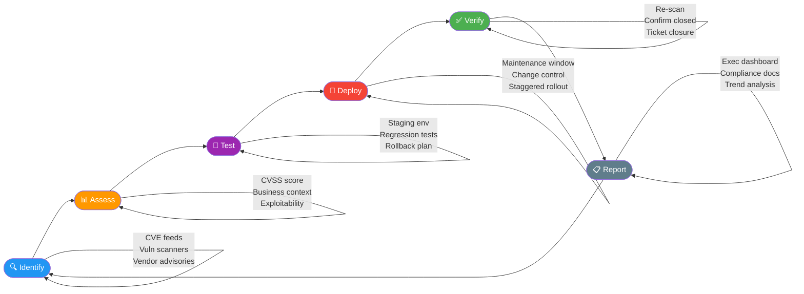

# Patch Management

> **Difficulty:** Intermediate | **Category:** Penetration Testing — Remediation

**Patch management** is the systematic process of identifying, testing, and deploying software updates to close known vulnerabilities. It remains the single highest-ROI security control available — the majority of successful breaches exploit vulnerabilities that had patches available weeks or months before the attack.

---

## Why Unpatched Systems Are the #1 Attack Vector

### The Statistics

- **60%+ of data breaches** involve exploitation of a known, patchable vulnerability (Ponemon Institute)
- The average time between CVE publication and exploitation in the wild is **15 days** (Rapid7 Vulnerability Intelligence Report)
- **WannaCry (2017):** MS17-010 (EternalBlue) was patched by Microsoft on **March 14, 2017** — WannaCry launched on **May 12, 2017**. Organizations had 59 days to patch and still ~200,000 systems were compromised in 150 countries
- **Equifax (2017):** Apache Struts CVE-2017-5638 patch was available **March 7, 2017** — Equifax breach ran from **May to July 2017**. 147 million records exposed. Settlement cost: $575 million
- **Log4Shell (CVE-2021-44228):** Disclosed December 9, 2021. Within 72 hours, exploitation attempts numbered in the hundreds of millions. Patch was available same day but the library was embedded in thousands of products

### Cost Comparison

| Metric | Patching Cost | Breach Cost |
|--------|--------------|-------------|
| Average patching cost per vulnerability | ~$500–$2,000 (labor + testing) | — |
| Average cost of a data breach (2023) | — | $4.45 million (IBM) |
| Equifax breach total cost | — | ~$1.4 billion |
| NHS WannaCry disruption | — | £92 million |
| **ROI of patching** | **1 hour of labor vs millions in remediation** | |

> **Note:** These figures exclude reputational damage, regulatory fines (GDPR max: 4% of global turnover), and lost business — which can dwarf direct breach costs.

---

## Patch Management Lifecycle



### Phase 1: Identify

**Goal:** Maintain complete visibility into what needs patching.

**Vulnerability Scanners:**

```bash
# ── Nessus (Tenable) ─────────────────────────────────────────────
# Launch authenticated scan via CLI
/opt/nessus/sbin/nessusd -D
# Use Nessus UI at https://localhost:8834 or Tenable.io API

# Export vulnerability data via API
curl -k -X GET "https://localhost:8834/scans/12/export" \
  -H "X-Cookie: token=YOUR_TOKEN" \
  -H "Content-Type: application/json" \
  -d '{"format":"csv"}' -o vulns.csv

# ── OpenVAS / Greenbone ───────────────────────────────────────────
# Install Greenbone Community Edition
apt install gvm -y
gvm-setup
gvm-start

# Create and run a scan task via CLI
gvm-cli socket --xml "<create_task>
  <name>Production Patch Scan</name>
  <config id='daba56c8-73ec-11df-a475-002264764cea'/>
  <target id='TARGET_ID'/>
</create_task>"

# ── Nuclei (fast CVE detection) ───────────────────────────────────
# Install
go install -v github.com/projectdiscovery/nuclei/v3/cmd/nuclei@latest

# Scan for known CVEs only
nuclei -u https://target.com -t cves/ -severity critical,high

# ── CVE Monitoring (continuous) ──────────────────────────────────
# Subscribe to NVD feed
curl -s "https://services.nvd.nist.gov/rest/json/cves/2.0?pubStartDate=2024-01-01T00:00:00.000&pubEndDate=2024-01-31T00:00:00.000" \
  | python3 -m json.tool | grep '"id"' | head -20

# Subscribe to CISA KEV (Known Exploited Vulnerabilities)
curl -s https://www.cisa.gov/sites/default/files/feeds/known_exploited_vulnerabilities.json \
  | python3 -c "import json,sys; data=json.load(sys.stdin); [print(v['cveID'], v['vulnerabilityName']) for v in data['vulnerabilities'][:20]]"
```

**Vendor Advisory Feeds:**

| Vendor | Advisory URL | RSS/API |
|--------|-------------|---------|
| Microsoft | security.microsoft.com | MSRC API |
| Red Hat | access.redhat.com/security | RSS feed |
| Ubuntu | ubuntu.com/security/notices | USN RSS |
| Debian | www.debian.org/security | DSA RSS |
| Apache | httpd.apache.org/security | RSS |
| CISA KEV | cisa.gov/known-exploited-vulnerabilities | JSON feed |
| NVD | nvd.nist.gov | JSON feeds |

### Phase 2: Assess

**Goal:** Prioritize patches by real risk, not just CVSS score alone.

**CVSS Scoring Factors:**

```
Attack Vector (AV): Network/Adjacent/Local/Physical
Attack Complexity (AC): Low/High
Privileges Required (PR): None/Low/High
User Interaction (UI): None/Required
Scope (S): Unchanged/Changed
Confidentiality (C): None/Low/High
Integrity (I): None/Low/High
Availability (A): None/Low/High
```

**Assessment Decision Matrix:**

```bash
# Script to assess and prioritize vulnerabilities
cat > assess_vulns.py << 'EOF'
#!/usr/bin/env python3
"""
Vulnerability assessment and prioritization script.
Input: CSV from Nessus/OpenVAS with columns: host, port, plugin_name, cvss_base, cvss3_base
"""
import csv
import sys

PRIORITY_RULES = {
    "critical": {"cvss_min": 9.0, "patch_days": 1,  "color": "\033[91m"},
    "high":     {"cvss_min": 7.0, "patch_days": 7,  "color": "\033[93m"},
    "medium":   {"cvss_min": 4.0, "patch_days": 30, "color": "\033[94m"},
    "low":      {"cvss_min": 0.1, "patch_days": 90, "color": "\033[92m"},
}

def get_priority(cvss: float, internet_facing: bool, exploit_public: bool) -> dict:
    for sev, rules in PRIORITY_RULES.items():
        if cvss >= rules["cvss_min"]:
            days = rules["patch_days"]
            # Accelerate if exploit is public or internet-facing
            if exploit_public and cvss >= 7.0:
                days = min(days, 1)
            elif internet_facing and cvss >= 7.0:
                days = min(days, 3)
            return {"severity": sev, "days": days, "color": rules["color"]}
    return {"severity": "info", "days": 180, "color": "\033[0m"}

# Example vulnerability records
vulns = [
    {"host": "10.0.1.45", "cve": "CVE-2021-44228", "cvss": 10.0, "internet_facing": True,  "exploit_public": True},
    {"host": "10.0.1.12", "cve": "CVE-2023-23397", "cvss": 9.8,  "internet_facing": False, "exploit_public": True},
    {"host": "10.0.2.33", "cve": "CVE-2023-3519",  "cvss": 9.8,  "internet_facing": True,  "exploit_public": True},
    {"host": "10.0.3.10", "cve": "CVE-2024-1234",  "cvss": 6.5,  "internet_facing": False, "exploit_public": False},
]

print(f"{'CVE':<20} {'Host':<15} {'CVSS':>5} {'Severity':<10} {'SLA (days)':>10} {'Accelerated?'}")
print("-" * 75)
for v in sorted(vulns, key=lambda x: x["cvss"], reverse=True):
    p = get_priority(v["cvss"], v["internet_facing"], v["exploit_public"])
    accelerated = "YES" if (v["internet_facing"] or v["exploit_public"]) else "No"
    print(f"{p['color']}{v['cve']:<20} {v['host']:<15} {v['cvss']:>5.1f} {p['severity']:<10} {p['days']:>10} {accelerated}\033[0m")
EOF
python3 assess_vulns.py
```

### Phase 3: Test

**Goal:** Validate patches do not break production functionality.

```bash
# ── Staging Environment Patch Testing Workflow ───────────────────

# 1. Snapshot/checkpoint the staging VM before patching
# VMware: vmrun snapshot /path/to/vm.vmx "pre-patch-$(date +%Y%m%d)"
# AWS: aws ec2 create-snapshot --volume-id vol-12345678 --description "pre-patch-$(date +%Y%m%d)"
aws ec2 create-snapshot \
    --volume-id vol-0a1b2c3d4e5f67890 \
    --description "pre-patch-$(date +%F)" \
    --tag-specifications 'ResourceType=snapshot,Tags=[{Key=Name,Value=pre-patch-baseline}]'

# 2. Apply patches in staging
sudo apt update && sudo apt upgrade -y    # Debian/Ubuntu
sudo dnf upgrade -y                        # RHEL/Rocky/Fedora

# 3. Run automated regression tests
# Smoke test critical services
services=("nginx" "postgresql" "redis" "myapp")
for svc in "${services[@]}"; do
    systemctl is-active --quiet "$svc" && echo "[OK] $svc" || echo "[FAIL] $svc"
done

# 4. Application-level health check
curl -sf https://staging.internal/health && echo "App health: OK" || echo "App health: FAILED"

# 5. Check for broken dependencies
python3 -c "import flask, sqlalchemy, requests; print('Python deps OK')"
node -e "require('express'); require('mongoose'); console.log('Node deps OK')"

# 6. Test specific functionality affected by the patch
# (depends on what was patched — write test scripts per change)
```

### Phase 4: Deploy

```bash
# ── Deployment Strategies ─────────────────────────────────────────

# Strategy 1: Canary deployment (patch 5% of fleet first)
# Strategy 2: Blue-green deployment (patch blue, switch traffic, validate)
# Strategy 3: Rolling deployment (staggered across server groups)

# ── Pre-deployment checklist ──────────────────────────────────────
cat > pre_patch_checklist.sh << 'EOF'
#!/bin/bash
HOST=$1
echo "=== Pre-Patch Checklist for $HOST ==="

echo "[1] Checking disk space..."
ssh "$HOST" "df -h / | awk 'NR==2{print \$5}'" | awk -F% '{if($1 > 80) print "WARNING: Low disk space"; else print "OK: Disk space adequate"}'

echo "[2] Creating system snapshot..."
ssh "$HOST" "sudo timeshift --create --comments 'pre-patch-$(date +%F)' --tags D" 2>/dev/null || echo "Timeshift not available, ensure backup exists"

echo "[3] Noting current service states..."
ssh "$HOST" "systemctl list-units --type=service --state=running --no-pager --no-legend" > /tmp/"$HOST"-services-pre.txt

echo "[4] Recording current package versions..."
ssh "$HOST" "dpkg -l | grep '^ii'" > /tmp/"$HOST"-packages-pre.txt

echo "[5] Checking for existing pending reboots..."
ssh "$HOST" "[ -f /var/run/reboot-required ] && echo 'WARN: Reboot already pending' || echo 'OK: No pending reboot'"

echo "=== Checklist complete. Proceed with patching? [y/N]"
EOF
chmod +x pre_patch_checklist.sh

# ── Maintenance Window Patching Script ────────────────────────────
cat > patch_window.sh << 'EOF'
#!/bin/bash
set -e
LOG=/var/log/patch-$(date +%Y%m%d-%H%M%S).log
exec > >(tee -a "$LOG") 2>&1

echo "[$(date)] Starting maintenance window patching"

# Update package lists
apt update

# Show what will be upgraded
echo "=== Packages to be upgraded ==="
apt list --upgradable 2>/dev/null | grep -v "Listing"

# Apply security updates only (safer for production)
unattended-upgrade --dry-run 2>&1 | head -30

# Apply all upgrades (full patch window)
DEBIAN_FRONTEND=noninteractive apt upgrade -y \
    -o Dpkg::Options::="--force-confdef" \
    -o Dpkg::Options::="--force-confold"

echo "[$(date)] Patching complete"

# Check if reboot is required
if [ -f /var/run/reboot-required ]; then
    echo "REBOOT REQUIRED. Packages requiring reboot:"
    cat /var/run/reboot-required.pkgs
fi
EOF
chmod +x patch_window.sh
```

### Phase 5: Verify

```bash
# ── Post-patch verification ───────────────────────────────────────

# Re-run vulnerability scanner to confirm fix
# Nessus: Schedule rescan of same targets with same policy
# OpenVAS: Re-run task

# Verify specific CVE is fixed (using nuclei)
nuclei -u https://target.com -t cves/2021/CVE-2021-44228.yaml -v

# Manual verification for specific package versions
# Apache Struts CVE-2017-5638 — check Struts version
find /opt /usr /var -name "struts*.jar" -ls 2>/dev/null
jar -tf /path/to/struts2-core.jar | grep META-INF/MANIFEST.MF
# Look for "Implementation-Version" >= 2.5.10.1

# Java log4j CVE-2021-44228 — check for vulnerable versions
find / -name "log4j*.jar" -o -name "log4j-core*.jar" 2>/dev/null | \
    xargs -I{} sh -c 'jar -tf "{}" 2>/dev/null | grep -q "JndiLookup.class" && echo "VULNERABLE: {}"'

# Check patch was applied with proper version
apt show nginx 2>/dev/null | grep -E "Version|Installed"
dpkg -l nginx | awk '{print $2, $3}'
```

### Phase 6: Report

```bash
# ── Generate Patch Management Report ─────────────────────────────
cat > generate_patch_report.py << 'EOF'
#!/usr/bin/env python3
"""
Simple patch management reporting script.
Generates a summary of patching status from vulnerability scan comparison.
"""
from datetime import datetime
import json

# Sample data — in production, pull from your vuln management platform
pre_patch_findings = [
    {"host": "web-01", "cve": "CVE-2021-44228", "cvss": 10.0, "status": "open"},
    {"host": "web-01", "cve": "CVE-2023-3519",  "cvss": 9.8,  "status": "open"},
    {"host": "db-01",  "cve": "CVE-2023-23397", "cvss": 9.8,  "status": "open"},
    {"host": "app-01", "cve": "CVE-2024-1234",  "cvss": 6.5,  "status": "open"},
    {"host": "web-01", "cve": "CVE-2023-44487", "cvss": 7.5,  "status": "open"},
]

post_patch_findings = [
    {"host": "web-01", "cve": "CVE-2023-3519",  "cvss": 9.8,  "status": "open"},
    {"host": "app-01", "cve": "CVE-2024-1234",  "cvss": 6.5,  "status": "open"},
]

pre_cves  = {(f["host"], f["cve"]) for f in pre_patch_findings}
post_cves = {(f["host"], f["cve"]) for f in post_patch_findings}
remediated = pre_cves - post_cves
new_findings = post_cves - pre_cves

print("=" * 60)
print(f"PATCH MANAGEMENT REPORT — {datetime.now().strftime('%Y-%m-%d')}")
print("=" * 60)
print(f"\nTotal vulnerabilities before: {len(pre_cves)}")
print(f"Total vulnerabilities after:  {len(post_cves)}")
print(f"Remediated this cycle:        {len(remediated)}")
print(f"Remediation rate:             {len(remediated)/len(pre_cves)*100:.1f}%")
print(f"\nRemediated:")
for host, cve in sorted(remediated):
    print(f"  [✓] {host}: {cve}")
if new_findings:
    print(f"\nNew findings (investigate):")
    for host, cve in sorted(new_findings):
        print(f"  [!] {host}: {cve}")
EOF
python3 generate_patch_report.py
```

---

## CVSS-Based Patch Prioritization

### Priority Matrix

| CVSS Range | Severity | SLA (Normal) | SLA (Internet-Facing) | SLA (Exploit in Wild) |
|------------|----------|-------------|----------------------|----------------------|
| 9.0–10.0 | **Critical** | 24–72 hours | 24 hours | Immediate (< 4 hours) |
| 7.0–8.9 | **High** | 7–14 days | 3–7 days | 24–72 hours |
| 4.0–6.9 | **Medium** | 30 days | 14 days | 7 days |
| 0.1–3.9 | **Low** | 90 days | 60 days | 30 days |
| 0.0 | **Info** | Next window | Next window | Next window |

> **Warning:** CVSS alone is insufficient for prioritization. A CVSS 6.5 vulnerability with a public exploit on an internet-facing system is more urgent than a CVSS 9.8 vulnerability on an isolated development box with no network access.

### EPSS — Exploit Prediction Scoring System

**EPSS** (from FIRST.org) provides a probability score (0–1) of exploitation in the next 30 days — more accurate than CVSS for prioritization.

```bash
# Query EPSS score for a specific CVE
curl -s "https://api.first.org/data/v1/epss?cve=CVE-2021-44228" | python3 -m json.tool

# Get EPSS for multiple CVEs
curl -s "https://api.first.org/data/v1/epss?cve=CVE-2021-44228,CVE-2023-3519,CVE-2023-44487" \
  | python3 -c "
import json, sys
data = json.load(sys.stdin)
print(f'{'CVE':<20} {'EPSS Score':>12} {'Percentile':>12}')
print('-' * 46)
for item in data['data']:
    print(f'{item[\"cve\"]:<20} {float(item[\"epss\"]):>12.4f} {float(item[\"percentile\"]):>12.4f}')
"
```

| CVE | CVSS | EPSS Score | Exploitation Likelihood |
|-----|------|-----------|------------------------|
| CVE-2021-44228 (Log4Shell) | 10.0 | 0.9754 | Very High (97.5%) |
| CVE-2023-3519 (Citrix Bleed) | 9.8 | 0.9681 | Very High (96.8%) |
| CVE-2023-44487 (HTTP/2 Rapid Reset) | 7.5 | 0.8921 | High (89.2%) |
| CVE-2024-1234 (hypothetical) | 6.5 | 0.0031 | Low (0.3%) |

---

## Automated Patching Tools

### Windows — WSUS + PSWindowsUpdate

```powershell
# ── Install and Configure WSUS ────────────────────────────────────
Install-WindowsFeature -Name UpdateServices, UpdateServices-UI -IncludeManagementTools

# Post-installation configuration (configure storage location)
& "C:\Program Files\Update Services\Tools\WsusUtil.exe" postinstall `
    CONTENT_DIR="D:\WSUS" `
    SQL_INSTANCE_NAME="WSUS\SQLExpress"

# Configure WSUS synchronization options via PowerShell
[reflection.assembly]::LoadWithPartialName("Microsoft.UpdateServices.Administration") | Out-Null
$wsus = [Microsoft.UpdateServices.Administration.AdminProxy]::GetUpdateServer("localhost", $false, 8530)
$config = $wsus.GetConfiguration()
$config.SyncFromMicrosoftUpdate = $true
$config.Save()

# ── Windows Update via PSWindowsUpdate Module ─────────────────────
Install-Module PSWindowsUpdate -Force -Scope AllUsers

# Check for available updates
Get-WindowsUpdate

# Install all updates, accept all, no auto-reboot
Install-WindowsUpdate -AcceptAll -IgnoreReboot -Verbose

# Install only security updates
Get-WindowsUpdate -Category "Security Updates" | Install-WindowsUpdate -AcceptAll -IgnoreReboot

# Schedule reboot for maintenance window
$rebootTime = (Get-Date).AddHours(2)
Register-ScheduledReboot -RebootTime $rebootTime

# ── Check Windows Update history ─────────────────────────────────
Get-WUHistory | Select-Object -First 20 | Format-Table Date, Result, Title

# ── Remote patching for multiple servers ─────────────────────────
$servers = @("server01", "server02", "server03")
Invoke-Command -ComputerName $servers -ScriptBlock {
    Install-WindowsUpdate -AcceptAll -IgnoreReboot -Category "Security Updates"
} -Credential (Get-Credential)
```

### Linux — Unattended Upgrades (Ubuntu/Debian)

```bash
# ── Install and configure unattended-upgrades ─────────────────────
apt install unattended-upgrades apt-listchanges -y

# Interactive configuration
dpkg-reconfigure -plow unattended-upgrades

# Manual configuration
cat > /etc/apt/apt.conf.d/50unattended-upgrades << 'EOF'
Unattended-Upgrade::Allowed-Origins {
    "${distro_id}:${distro_codename}";
    "${distro_id}:${distro_codename}-security";
    "${distro_id}ESMApps:${distro_codename}-apps-security";
    "${distro_id}ESM:${distro_codename}-infra-security";
};

// Packages to never auto-upgrade (too risky)
Unattended-Upgrade::Package-Blacklist {
    "nginx";
    "postgresql-*";
    "mysql-server";
    "kernel-*";
};

// Auto-remove unused dependencies after upgrade
Unattended-Upgrade::Remove-Unused-Kernel-Packages "true";
Unattended-Upgrade::Remove-New-Unused-Dependencies "true";
Unattended-Upgrade::Remove-Unused-Dependencies "true";

// Email on failures and summary
Unattended-Upgrade::Mail "security@company.com";
Unattended-Upgrade::MailReport "on-change";

// Reboot if required (only during maintenance window)
Unattended-Upgrade::Automatic-Reboot "false";
Unattended-Upgrade::Automatic-Reboot-Time "03:00";
EOF

# Configure upgrade schedule
cat > /etc/apt/apt.conf.d/20auto-upgrades << 'EOF'
APT::Periodic::Update-Package-Lists "1";
APT::Periodic::Download-Upgradeable-Packages "1";
APT::Periodic::AutocleanInterval "7";
APT::Periodic::Unattended-Upgrade "1";
EOF

# Test the configuration
unattended-upgrade --dry-run --debug 2>&1 | tail -30

# Run immediately (not dry-run)
unattended-upgrade -v

# Check logs
cat /var/log/unattended-upgrades/unattended-upgrades.log | tail -30
```

### RHEL / Rocky / CentOS — dnf-automatic

```bash
# ── Install dnf-automatic ─────────────────────────────────────────
dnf install dnf-automatic -y

# Configure for security-only updates
cat > /etc/dnf/automatic.conf << 'EOF'
[commands]
# Type of upgrade to perform:
# default = all packages
# security = only packages with security advisories
upgrade_type = security

# Apply updates (vs just download)
apply_updates = yes

# Reboot if necessary (false for most production systems)
reboot = never

[emitters]
# System name for notifications
system_name = My System

emit_via = email

[email]
email_from = dnf-automatic@company.com
email_to = security@company.com
email_host = localhost

[base]
debuglevel = 1
EOF

# Enable and start the automatic update timer
systemctl enable --now dnf-automatic-install.timer

# Check timer status
systemctl list-timers dnf-automatic*

# Run immediately to test
dnf-automatic /etc/dnf/automatic.conf --verbose

# View what was installed automatically
journalctl -u dnf-automatic --since "24 hours ago"
```

### AWS Systems Manager Patch Manager

```bash
# ── Create a custom patch baseline ───────────────────────────────
aws ssm create-patch-baseline \
  --name "SecurityPatchBaseline-AmazonLinux2" \
  --operating-system "AMAZON_LINUX_2" \
  --approval-rules '{
    "PatchRules": [
      {
        "PatchFilterGroup": {
          "PatchFilters": [
            {"Key": "CLASSIFICATION", "Values": ["Security"]},
            {"Key": "SEVERITY",       "Values": ["Critical", "High"]}
          ]
        },
        "ApproveAfterDays": 3,
        "ComplianceLevel": "CRITICAL",
        "EnableNonSecurity": false
      },
      {
        "PatchFilterGroup": {
          "PatchFilters": [
            {"Key": "SEVERITY", "Values": ["Medium"]}
          ]
        },
        "ApproveAfterDays": 14,
        "ComplianceLevel": "HIGH"
      }
    ]
  }' \
  --description "Security patches: Critical/High in 3 days, Medium in 14 days"

# ── Create a maintenance window ───────────────────────────────────
aws ssm create-maintenance-window \
  --name "Sunday-0200-MaintenanceWindow" \
  --schedule "cron(0 2 ? * SUN *)" \
  --duration 4 \
  --cutoff 1 \
  --allow-unassociated-targets

# ── Scan for patch compliance (no installation) ───────────────────
aws ssm send-command \
  --document-name "AWS-RunPatchBaseline" \
  --targets '[{"Key":"tag:Environment","Values":["Production"]}]' \
  --parameters '{"Operation":["Scan"]}' \
  --comment "Patch compliance scan - $(date +%Y-%m-%d)"

# ── Install patches ───────────────────────────────────────────────
COMMAND_ID=$(aws ssm send-command \
  --document-name "AWS-RunPatchBaseline" \
  --targets '[{"Key":"tag:PatchGroup","Values":["Web-Servers"]}]' \
  --parameters '{"Operation":["Install"],"RebootOption":["RebootIfNeeded"]}' \
  --comment "Scheduled patch installation" \
  --query 'Command.CommandId' \
  --output text)

echo "Command ID: $COMMAND_ID"

# ── Monitor patch command progress ───────────────────────────────
aws ssm list-command-invocations \
  --command-id "$COMMAND_ID" \
  --details \
  --query 'CommandInvocations[].{Instance:InstanceId,Status:Status,Summary:CommandPlugins[0].OutputS3BucketName}' \
  --output table

# ── Get patch compliance report ───────────────────────────────────
aws ssm describe-instance-patch-states \
  --instance-ids $(aws ec2 describe-instances \
    --filters "Name=tag:Environment,Values=Production" \
    --query 'Reservations[].Instances[].InstanceId' \
    --output text)
```

---

## Virtual Patching with WAF

When you cannot immediately patch (due to testing requirements, vendor support contracts, legacy systems), **virtual patching** via WAF rules buys time.

> **Warning:** Virtual patching is a temporary measure, not a replacement for actual patching. WAF rules can often be bypassed by determined attackers. Always prioritize actual patching.

### ModSecurity Rules

```apache
# ── ModSecurity Virtual Patch Examples ───────────────────────────

# Log4Shell (CVE-2021-44228) — block JNDI lookup attempts
SecRule REQUEST_URI|REQUEST_HEADERS|REQUEST_BODY|ARGS "@rx \$\{.*?j.*?n.*?d.*?i.*?:.*?\}" \
    "id:1000001,phase:2,deny,status:403,log,auditlog,\
    msg:'Log4Shell exploitation attempt',\
    severity:'CRITICAL',\
    tag:'CVE-2021-44228'"

# Additional Log4Shell variants (obfuscation bypass)
SecRule REQUEST_URI|REQUEST_HEADERS|REQUEST_BODY "@rx \$\{[\w\$\:\-\+\{]{0,15}j[\w\$\:\-\+\{]{0,15}n[\w\$\:\-\+\{]{0,15}d[\w\$\:\-\+\{]{0,15}i" \
    "id:1000002,phase:2,deny,status:403,log,msg:'Log4Shell obfuscation attempt'"

# Apache Struts CVE-2017-5638 — Content-Type injection
SecRule REQUEST_HEADERS:Content-Type "@rx (multipart/form-data|application/x-www-form-urlencoded).*#cmd=" \
    "id:1000003,phase:1,deny,status:403,msg:'Struts2 S2-045 exploitation attempt'"

# CVE-2021-26084 (Confluence OGNL injection)
SecRule REQUEST_URI "@contains /pages/createpage-entervariables.action" \
    "chain,id:1000004,phase:1,deny,status:403"
SecRule ARGS "@rx \$\{|#\{|\@\{" "msg:'Confluence OGNL injection attempt'"

# Generic path traversal
SecRule REQUEST_URI|ARGS "@rx \.\./" \
    "id:1000010,phase:2,deny,status:403,\
    msg:'Path traversal attempt',t:urlDecodeUni,t:normalizePath"
```

### Cloudflare WAF Rules

```
# Log4Shell blocking rule (Cloudflare expression syntax)
(
  http.request.uri.query contains "${jndi:" or
  http.request.headers["User-Agent"] contains "${jndi:" or
  http.request.body contains "${jndi:" or
  http.request.uri.query matches r"(?i)\$\{[a-zA-Z0-9:\-]*j[a-zA-Z0-9:\-]*n[a-zA-Z0-9:\-]*d[a-zA-Z0-9:\-]*i[a-zA-Z0-9:\-]*:"
)

# Block known malicious User-Agent strings
(
  http.request.headers["User-Agent"] eq "" or
  http.request.headers["User-Agent"] matches r"(?i)(sqlmap|nikto|masscan|nessus|openvas|dirbuster|gobuster|hydra|medusa)"
)

# Rate limit login attempts
(http.request.uri.path eq "/login" and http.request.method eq "POST")
# Rate: 5 requests per minute per IP
```

---

## Emergency Patching Procedures — Log4Shell Case Study

```mermaid
gantt
    title Log4Shell Emergency Response Timeline (CVE-2021-44228)
    dateFormat HH:mm
    axisFormat %H:%M

    section Hour 0–1 Identify
    CVE announced & team alerted      :crit, done, 00:00, 30m
    Asset inventory scan for log4j    :crit, done, 00:30, 30m

    section Hour 1–4 Contain
    WAF virtual patch deployed        :crit, done, 01:00, 60m
    JVM flag mitigation applied       :done, 02:00, 60m
    Monitoring alerts tuned           :done, 03:00, 60m

    section Hour 4–24 Patch Critical
    Patch tested in staging           :active, 04:00, 4h
    Critical internet-facing systems  :active, 08:00, 8h
    Verify & rescan critical systems  :active, 16:00, 2h

    section Day 2–3 Patch High
    Internal critical systems         :24:00, 24h

    section Day 4–7 Patch All
    Remaining affected systems        :72:00, 72h

    section Week 2 Verify
    Final compliance scan             :168:00, 12h
    Close tickets & report            :180:00, 12h
```

### Immediate Mitigation (Before Patch)

```bash
# ── Log4Shell Immediate Mitigations ──────────────────────────────

# 1. Find all affected log4j versions
find / -name "log4j-core-*.jar" 2>/dev/null | while read jar; do
    version=$(unzip -p "$jar" META-INF/MANIFEST.MF 2>/dev/null | grep "Implementation-Version" | cut -d' ' -f2)
    echo "Found: $jar — Version: $version"
done

# 2. JVM flag workaround (Java 8u191+ / 11.0.1+)
# Add to JVM startup arguments:
# -Dlog4j2.formatMsgNoLookups=true

# 3. Delete JndiLookup class from log4j-core jar (if can't update immediately)
zip -q -d /path/to/log4j-core-2.14.1.jar org/apache/logging/log4j/core/lookup/JndiLookup.class

# 4. Set LOG4J_FORMAT_MSG_NO_LOOKUPS environment variable
export LOG4J_FORMAT_MSG_NO_LOOKUPS=true

# 5. Detect exploitation attempts in logs
grep -r '\${jndi:' /var/log/ 2>/dev/null
grep -rE '\$\{[a-z:]*j[a-z:]*n[a-z:]*d[a-z:]*i[a-z:]*:' /var/log/ 2>/dev/null | head -20

# 6. Update to patched version (2.17.1 for Java 8+)
# Maven: update log4j-core to 2.17.1 in pom.xml
# Gradle: update in build.gradle
# Direct: replace jar file and restart service
```

---

## Tracking Patching Progress

```bash
# ── Vulnerability Management Metrics ─────────────────────────────

# Key metrics to track:
# - Mean Time to Patch (MTTP) by severity
# - Patch compliance rate (% of systems current)
# - Vulnerability exposure window (days open)
# - SLA adherence rate

cat > vuln_metrics.sh << 'EOF'
#!/bin/bash
# Pull patch compliance data from various sources

echo "=== Patch Compliance Dashboard ==="
echo "Date: $(date +%Y-%m-%d)"
echo ""

# Linux systems — check for pending updates
echo "--- Pending Security Updates by Host ---"
for host in $(cat /etc/patch-management/hosts.txt 2>/dev/null || echo "localhost"); do
    pending=$(ssh -o ConnectTimeout=5 "$host" "apt list --upgradable 2>/dev/null | grep -i security | wc -l" 2>/dev/null)
    reboot=$(ssh -o ConnectTimeout=5 "$host" "[ -f /var/run/reboot-required ] && echo 'REBOOT NEEDED' || echo 'OK'" 2>/dev/null)
    echo "  $host: $pending pending security updates | $reboot"
done

echo ""
echo "--- Systems not patched in 30 days ---"
find /var/log/patch-management/ -name "*.log" -mtime +30 -ls 2>/dev/null
EOF
chmod +x vuln_metrics.sh
```

> **Note:** Integrate your vulnerability scanner with a ticketing system (Jira, ServiceNow) to automatically create, track, and close remediation tickets. This provides the audit trail needed for compliance frameworks like SOC 2, ISO 27001, and PCI-DSS.

---

## Patch Management Policy Framework

| Policy Element | Recommendation |
|---------------|----------------|
| **Patch inventory frequency** | Daily automated scan |
| **Critical patch SLA** | 24–72 hours |
| **High patch SLA** | 7–14 days |
| **Medium patch SLA** | 30 days |
| **Low patch SLA** | 90 days |
| **Patch testing requirement** | All patches tested in staging first |
| **Emergency patching process** | Defined CAB fast-track procedure |
| **Rollback procedure** | Documented per patch type |
| **Exception process** | Risk-accepted exceptions with compensating controls |
| **Compliance reporting** | Monthly to CISO, quarterly to board |
| **Patch window** | Weekly for non-critical, monthly for critical systems |
| **Tool coverage** | 100% of internet-facing systems; 95%+ of internal |
