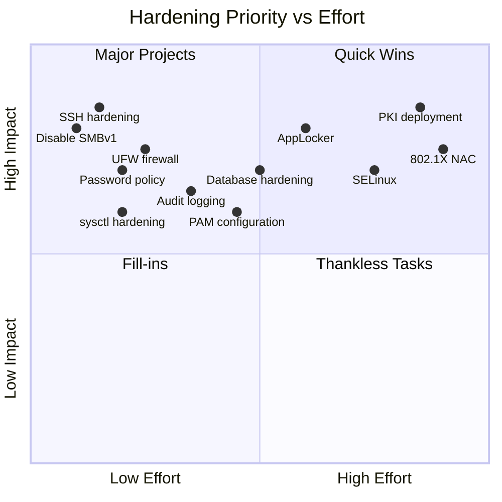

# Secure Configurations

> **Difficulty:** Intermediate | **Category:** Penetration Testing — Remediation

Implementing **secure configurations** is among the most impactful remediations a security team can apply after a penetration test. Misconfigurations account for a significant percentage of successful breaches — hardening removes entire attack surface classes rather than patching individual vulnerabilities.

---

## CIS Benchmarks Overview

**CIS (Center for Internet Security) Benchmarks** are consensus-based, vendor-agnostic configuration guidelines developed by security practitioners worldwide. They represent the gold standard for OS, application, and cloud hardening.

### Benchmark Levels

| Level | Description | Impact | Target Audience |
|-------|-------------|--------|-----------------|
| **Level 1** | Essential hygiene, minimal operational impact | Low | All organizations |
| **Level 2** | Defense-in-depth, may affect functionality | Medium-High | High-security environments |

> **Note:** Start with Level 1 across all systems before attempting Level 2. Applying Level 2 blindly to production systems without testing can cause service disruptions.

### Key CIS Benchmarks by Technology

| Benchmark | Latest Version | Key Focus Areas |
|-----------|---------------|-----------------|
| CIS Ubuntu Linux 22.04 LTS | 1.0 | PAM, SSH, auditing, filesystem |
| CIS Windows Server 2022 | 3.0 | Account policies, audit, registry |
| CIS nginx | 2.0.1 | TLS, headers, request limits |
| CIS Apache HTTP Server 2.4 | 2.0 | Server tokens, headers, modules |
| CIS MySQL 8.0 | 1.0 | Users, logging, encryption |
| CIS PostgreSQL 15 | 1.1 | pg_hba.conf, roles, auditing |
| CIS Amazon Web Services Foundations | 3.0 | IAM, logging, networking |
| CIS Docker | 1.6.0 | Daemon config, images, runtime |
| CIS Kubernetes | 1.8.0 | API server, etcd, kubelet |

### CIS-CAT Pro — Automated Assessment

**CIS-CAT Pro** is the official CIS assessment tool that automatically scores a system against a benchmark.

```bash
# Download CIS-CAT Pro Assessor (requires CIS SecureSuite membership)
# Run assessment against Ubuntu 22.04 Level 1 benchmark
./Assessor-CLI.sh -b benchmarks/CIS_Ubuntu_Linux_22.04_LTS_Benchmark_v1.0.0-xccdf.xml \
  -p "Level 1 - Server" \
  -r /tmp/cis-report \
  -f html

# Non-interactive mode with specific profile
./Assessor-CLI.sh --benchmark CIS_Ubuntu_Linux_22.04_LTS_Benchmark_v1.0.0-xccdf.xml \
  --profile "xccdf_org.cisecurity.benchmarks_profile_Level_1_-_Server" \
  --report-prefix ubuntu22-assessment \
  --destination /var/reports/
```

### CIS Controls v8 — 18 Controls Overview

| # | Control | Priority |
|---|---------|----------|
| 1 | Inventory and Control of Enterprise Assets | IG1 |
| 2 | Inventory and Control of Software Assets | IG1 |
| 3 | Data Protection | IG1 |
| 4 | Secure Configuration of Enterprise Assets and Software | IG1 |
| 5 | Account Management | IG1 |
| 6 | Access Control Management | IG1 |
| 7 | Continuous Vulnerability Management | IG1 |
| 8 | Audit Log Management | IG1 |
| 9 | Email and Web Browser Protections | IG1 |
| 10 | Malware Defenses | IG1 |
| 11 | Data Recovery | IG2 |
| 12 | Network Infrastructure Management | IG2 |
| 13 | Network Monitoring and Defense | IG2 |
| 14 | Security Awareness and Skills Training | IG2 |
| 15 | Service Provider Management | IG2 |
| 16 | Application Software Security | IG2 |
| 17 | Incident Response Management | IG2 |
| 18 | Penetration Testing | IG3 |

> **Note:** IG1 = Implementation Group 1 (basic cyber hygiene for all orgs). IG2 adds to IG1. IG3 adds to IG2.

---

## Hardening Priority Matrix



---

## Linux OS Hardening

### SSH Hardening

**OpenSSH** is the most common remote access vector attacked in penetration tests. Default configurations are dangerously permissive.

```bash
# ── SSH Configuration Hardening ──────────────────────────────────────
# Always backup the original configuration first
cp /etc/ssh/sshd_config /etc/ssh/sshd_config.bak

# Disable root login entirely
sed -i 's/#PermitRootLogin prohibit-password/PermitRootLogin no/' /etc/ssh/sshd_config
sed -i 's/PermitRootLogin yes/PermitRootLogin no/' /etc/ssh/sshd_config

# Enforce key-based authentication only
sed -i 's/#PasswordAuthentication yes/PasswordAuthentication no/' /etc/ssh/sshd_config
sed -i 's/PasswordAuthentication yes/PasswordAuthentication no/' /etc/ssh/sshd_config

# Move SSH off default port (reduces automated scan noise)
sed -i 's/#Port 22/Port 2222/' /etc/ssh/sshd_config

# Block empty password logins
sed -i 's/#PermitEmptyPasswords no/PermitEmptyPasswords no/' /etc/ssh/sshd_config

# Restrict to specific users only — principle of least privilege
echo "AllowUsers deployer sysadmin jenkins" >> /etc/ssh/sshd_config

# Limit authentication attempts
echo "MaxAuthTries 3" >> /etc/ssh/sshd_config
echo "MaxSessions 4" >> /etc/ssh/sshd_config

# Timeout idle sessions after 5 minutes
echo "ClientAliveInterval 300" >> /etc/ssh/sshd_config
echo "ClientAliveCountMax 2" >> /etc/ssh/sshd_config

# Disable X11 forwarding (attack surface)
sed -i 's/X11Forwarding yes/X11Forwarding no/' /etc/ssh/sshd_config

# Disable TCP forwarding unless needed
echo "AllowTcpForwarding no" >> /etc/ssh/sshd_config
echo "AllowAgentForwarding no" >> /etc/ssh/sshd_config

# Enforce strong modern ciphers only
cat >> /etc/ssh/sshd_config << 'EOF'

# ── Cryptography hardening ──
Ciphers aes256-gcm@openssh.com,chacha20-poly1305@openssh.com,aes256-ctr
MACs hmac-sha2-512-etm@openssh.com,hmac-sha2-256-etm@openssh.com
KexAlgorithms curve25519-sha256,diffie-hellman-group16-sha512,diffie-hellman-group18-sha512
HostKeyAlgorithms ssh-ed25519,rsa-sha2-512,rsa-sha2-256
PubkeyAcceptedAlgorithms ssh-ed25519,rsa-sha2-512,rsa-sha2-256

# ── Banner and logging ──
Banner /etc/ssh/banner
LogLevel VERBOSE
EOF

# Create a legal warning banner
cat > /etc/ssh/banner << 'EOF'
*****************************************************************************
AUTHORIZED ACCESS ONLY. All activity on this system is monitored and logged.
Unauthorized access is prohibited and will be prosecuted to the full extent
of applicable law.
*****************************************************************************
EOF

# Validate configuration before restarting
sshd -t && systemctl restart sshd
systemctl status sshd
```

> **Warning:** Always test SSH connectivity in a second session before closing your current connection. A misconfigured sshd_config can lock you out completely.

### Disable Unnecessary Services

Reducing the **attack surface** by removing services that are not required:

```bash
# List all running services to identify candidates for removal
systemctl list-units --type=service --state=running

# Common unnecessary services on servers
SERVICES_TO_DISABLE=(
    "avahi-daemon"    # mDNS/Bonjour — not needed on servers
    "cups"            # Printing service
    "bluetooth"       # Bluetooth daemon
    "rpcbind"         # NFS dependency (disable if NFS not used)
    "nfs-server"      # NFS server
    "telnet"          # Plaintext remote access (use SSH instead)
    "ftp"             # Plaintext file transfer
    "vsftpd"          # FTP server
    "xinetd"          # Legacy service manager
    "talk"            # Legacy user communication
    "chargen"         # Character generator (legacy test service)
)

for svc in "${SERVICES_TO_DISABLE[@]}"; do
    if systemctl is-active --quiet "$svc" 2>/dev/null; then
        systemctl stop "$svc"
        systemctl disable "$svc"
        echo "[+] Disabled: $svc"
    fi
done

# Verify which ports are listening after cleanup
ss -tlnp
# Cross-reference with expected services only
```

### UFW Firewall Configuration

```bash
# ── UFW (Uncomplicated Firewall) Setup ──────────────────────────────
# Install if not present
apt install ufw -y

# Set default deny-all incoming, allow outgoing
ufw default deny incoming
ufw default allow outgoing
ufw default deny forward

# Allow SSH on new port (BEFORE enabling ufw!)
ufw allow 2222/tcp comment 'SSH'

# Allow HTTPS only (not HTTP)
ufw allow 443/tcp comment 'HTTPS'

# If HTTP is needed (redirect to HTTPS at web server layer)
ufw allow 80/tcp comment 'HTTP redirect'

# Allow specific source IPs for management (if applicable)
ufw allow from 10.0.1.0/24 to any port 2222 comment 'SSH from mgmt network'

# Rate limiting to prevent brute force
ufw limit 2222/tcp comment 'SSH rate limiting'

# Enable the firewall
ufw --force enable

# Verify rules
ufw status verbose

# For more granular logging
ufw logging medium
```

### Kernel Hardening via sysctl

**sysctl** parameters control the Linux kernel's runtime behavior — many defaults leave systems vulnerable to network attacks.

```bash
# ── Kernel Hardening ──────────────────────────────────────────────
cat > /etc/sysctl.d/99-security-hardening.conf << 'EOF'
# ── Network: IP Forwarding (disable unless router/VPN) ──
net.ipv4.ip_forward = 0
net.ipv6.conf.all.forwarding = 0

# ── Network: Source Routing (disable — used in spoofing attacks) ──
net.ipv4.conf.all.accept_source_route = 0
net.ipv4.conf.default.accept_source_route = 0
net.ipv6.conf.all.accept_source_route = 0

# ── Network: SYN Flood Protection ──
net.ipv4.tcp_syncookies = 1
net.ipv4.tcp_syn_retries = 3
net.ipv4.tcp_synack_retries = 3

# ── Network: ICMP Redirect (disable to prevent MITM) ──
net.ipv4.conf.all.accept_redirects = 0
net.ipv4.conf.default.accept_redirects = 0
net.ipv4.conf.all.send_redirects = 0
net.ipv4.conf.default.send_redirects = 0
net.ipv6.conf.all.accept_redirects = 0

# ── Network: Log Suspicious Packets ──
net.ipv4.conf.all.log_martians = 1
net.ipv4.conf.default.log_martians = 1

# ── Network: Disable IPv6 if not used ──
net.ipv6.conf.all.disable_ipv6 = 1
net.ipv6.conf.default.disable_ipv6 = 1
net.ipv6.conf.lo.disable_ipv6 = 1

# ── Network: SMURF Attack Protection ──
net.ipv4.icmp_echo_ignore_broadcasts = 1
net.ipv4.icmp_ignore_bogus_error_responses = 1

# ── Network: Reverse Path Filtering (prevent IP spoofing) ──
net.ipv4.conf.all.rp_filter = 1
net.ipv4.conf.default.rp_filter = 1

# ── Memory: ASLR (Address Space Layout Randomization) ──
kernel.randomize_va_space = 2

# ── Memory: Disable core dumps for SUID programs ──
fs.suid_dumpable = 0

# ── Kernel: Restrict dmesg to root ──
kernel.dmesg_restrict = 1

# ── Kernel: Restrict kernel pointer leaks ──
kernel.kptr_restrict = 2

# ── Kernel: Disable kexec (prevents loading new kernel while running) ──
kernel.kexec_load_disabled = 1

# ── Kernel: Restrict ptrace to parent processes ──
kernel.yama.ptrace_scope = 2

# ── Kernel: Restrict unprivileged BPF ──
kernel.unprivileged_bpf_disabled = 1
net.core.bpf_jit_harden = 2
EOF

# Apply immediately
sysctl --system

# Verify specific setting
sysctl net.ipv4.tcp_syncookies
sysctl kernel.randomize_va_space
```

### File Permissions Hardening

```bash
# ── Critical File Permissions ─────────────────────────────────────
# Sensitive password files
chmod 640 /etc/shadow        # root:shadow only
chmod 644 /etc/passwd        # World-readable (normal)
chmod 640 /etc/gshadow       # root:shadow only
chmod 644 /etc/group         # World-readable (normal)

# Boot configuration
chmod 600 /boot/grub/grub.cfg  # root only
chown root:root /boot/grub/grub.cfg

# Root home directory
chmod 700 /root
chown root:root /root

# World-writable directories — identify and review
find / -xdev -type d -perm -0002 -ls 2>/dev/null | grep -v '/proc\|/sys\|/dev\|/run'

# SUID/SGID binaries — audit and remove unnecessary ones
find / -xdev -type f \( -perm -4000 -o -perm -2000 \) -ls 2>/dev/null

# Files with no owner
find / -xdev -nouser -o -nogroup 2>/dev/null | head -20

# World-readable sensitive configuration files
chmod 600 /etc/crontab
chmod 700 /etc/cron.d /etc/cron.daily /etc/cron.hourly /etc/cron.weekly /etc/cron.monthly
```

### PAM Password Policy

**PAM (Pluggable Authentication Modules)** enforces password complexity, lockout policies, and session controls.

```bash
# Install password quality library
apt install libpam-pwquality -y

# Configure password complexity
cat > /etc/security/pwquality.conf << 'EOF'
# Minimum password length
minlen = 14

# Require at least 1 digit
dcredit = -1

# Require at least 1 uppercase
ucredit = -1

# Require at least 1 special character
ocredit = -1

# Require at least 1 lowercase
lcredit = -1

# Max consecutive repeated characters
maxrepeat = 3

# Max consecutive characters from same class
maxclassrepeat = 4

# Minimum number of changed characters from old password
difok = 8

# Reject if password contains username
gecoscheck = 1
EOF

# Account lockout after failed attempts
# Edit /etc/pam.d/common-auth and add:
cat >> /etc/pam.d/common-auth << 'EOF'
auth required pam_faillock.so preauth silent deny=5 unlock_time=900
auth [success=1 default=bad] pam_unix.so
auth [default=die] pam_faillock.so authfail deny=5 unlock_time=900
auth sufficient pam_faillock.so authsucc deny=5 unlock_time=900
EOF

# Password history — prevent reuse of last 12 passwords
# In /etc/pam.d/common-password, add remember=12:
# password sufficient pam_unix.so obscure use_authtok try_first_pass sha512 remember=12

# Set password aging policies
chage --maxdays 90 --mindays 7 --warndays 14 username
# Apply defaults for new users
sed -i 's/PASS_MAX_DAYS.*/PASS_MAX_DAYS 90/' /etc/login.defs
sed -i 's/PASS_MIN_DAYS.*/PASS_MIN_DAYS 7/' /etc/login.defs
sed -i 's/PASS_WARN_AGE.*/PASS_WARN_AGE 14/' /etc/login.defs
```

### Audit Daemon (auditd)

```bash
# Install auditd
apt install auditd audispd-plugins -y
systemctl enable --now auditd

# ── Audit Rules ──────────────────────────────────────────────────
cat > /etc/audit/rules.d/99-security.rules << 'EOF'
# Delete all previous rules
-D

# Set buffer size
-b 8192

# Failures: 2 = panic (kernel), 1 = printk
-f 2

# ── System calls: privilege escalation ──
-a always,exit -F arch=b64 -S setuid -S setreuid -S setresuid -k setuid
-a always,exit -F arch=b64 -S setgid -S setregid -S setresgid -k setgid

# ── Execution tracking ──
-a always,exit -F arch=b64 -S execve -k exec_commands
-a always,exit -F arch=b32 -S execve -k exec_commands

# ── Identity files ──
-w /etc/passwd -p wa -k identity_passwd
-w /etc/shadow -p wa -k identity_shadow
-w /etc/group -p wa -k identity_group
-w /etc/gshadow -p wa -k identity_gshadow
-w /etc/sudoers -p wa -k sudoers_changes

# ── Authentication logs ──
-w /var/log/auth.log -p wa -k auth_log
-w /var/log/faillog -p wa -k login_failures
-w /var/log/lastlog -p wa -k last_login

# ── SSH configuration ──
-w /etc/ssh/sshd_config -p wa -k sshd_config

# ── Cron jobs ──
-w /etc/crontab -p wa -k cron
-w /etc/cron.d/ -p wa -k cron
-w /var/spool/cron/ -p wa -k cron

# ── Kernel module loading ──
-w /sbin/insmod -p x -k kernel_modules
-w /sbin/rmmod -p x -k kernel_modules
-w /sbin/modprobe -p x -k kernel_modules

# ── Network configuration changes ──
-a always,exit -F arch=b64 -S sethostname -S setdomainname -k network_config

# ── Make audit config immutable (requires reboot to change) ──
-e 2
EOF

# Load new rules
augenrules --load

# Verify rules are active
auditctl -l | head -30

# Search audit log for specific events
ausearch -k identity_passwd -ts today
ausearch -k exec_commands --uid 0 -ts recent
```

---

## Windows OS Hardening

### Core Service and Feature Hardening

```powershell
# ── Disable Unnecessary and Dangerous Services ───────────────────
$servicesToDisable = @(
    @{Name="Spooler";        Reason="Print Spooler — PrintNightmare vector"},
    @{Name="RemoteRegistry"; Reason="Remote Registry — pentest favorite"},
    @{Name="SNMP";           Reason="SNMP v1/v2 leaks info and allows RCE"},
    @{Name="Fax";            Reason="Fax service — almost never needed"},
    @{Name="XboxNetApiSvc";  Reason="Xbox services — not needed on servers"},
    @{Name="WSearch";        Reason="Windows Search — indexing service"},
    @{Name="lltdsvc";        Reason="Link-Layer Topology Discovery"}
)

foreach ($svc in $servicesToDisable) {
    try {
        Stop-Service -Name $svc.Name -Force -ErrorAction SilentlyContinue
        Set-Service -Name $svc.Name -StartupType Disabled -ErrorAction SilentlyContinue
        Write-Host "[+] Disabled: $($svc.Name) — $($svc.Reason)" -ForegroundColor Green
    } catch {
        Write-Host "[-] Could not disable: $($svc.Name)" -ForegroundColor Yellow
    }
}

# ── Disable SMBv1 (EternalBlue/WannaCry vector) ──────────────────
Set-SmbServerConfiguration -EnableSMB1Protocol $false -Force
Set-SmbClientConfiguration -EnableBandwidthThrottling 0
Disable-WindowsOptionalFeature -Online -FeatureName SMB1Protocol -NoRestart

# Verify SMBv1 is disabled
Get-SmbServerConfiguration | Select-Object EnableSMB1Protocol, EnableSMB2Protocol

# ── Disable LLMNR and NetBIOS (credential theft via Responder) ──
# Disable LLMNR via registry
$llmnrPath = "HKLM:\SOFTWARE\Policies\Microsoft\Windows NT\DNSClient"
if (-not (Test-Path $llmnrPath)) { New-Item -Path $llmnrPath -Force }
Set-ItemProperty -Path $llmnrPath -Name "EnableMulticast" -Value 0 -Type DWord

# Disable NetBIOS over TCP/IP on all interfaces
$adapters = Get-WmiObject Win32_NetworkAdapterConfiguration -Filter "IPEnabled=True"
foreach ($adapter in $adapters) {
    $adapter.SetTcpipNetbios(2) | Out-Null  # 2 = Disable NetBIOS
}
Write-Host "[+] NetBIOS disabled on all adapters"
```

### Windows Defender and Security Features

```powershell
# ── Harden Windows Defender ──────────────────────────────────────
Set-MpPreference -DisableRealtimeMonitoring $false
Set-MpPreference -EnableControlledFolderAccess Enabled
Set-MpPreference -PUAProtection Enabled
Set-MpPreference -EnableNetworkProtection Enabled
Set-MpPreference -AttackSurfaceReductionRules_Ids @(
    "D4F940AB-401B-4EFC-AADC-AD5F3C50688A",  # Block Office from creating child processes
    "3B576869-A4EC-4529-8536-B80A7769E899",  # Block Office from creating executable content
    "75668C1F-73B5-4CF0-BB93-3ECF5CB7CC84",  # Block Office from injecting code into other processes
    "D3E037E1-3EB8-44C8-A917-57927947596D",  # Block JavaScript/VBScript from launching downloaded executable content
    "5BEB7EFE-FD9A-4556-801D-275E5FFC04CC",  # Block execution of potentially obfuscated scripts
    "92E97FA1-2EDF-4476-BDD6-9DD0B4DDDC7B",  # Block Win32 API calls from Office macros
    "BE9BA2D9-53EA-4CDC-84E5-9B1EEEE46550"   # Block executable content from email
) -AttackSurfaceReductionRules_Actions @(1,1,1,1,1,1,1)

# ── Audit Policy Configuration ───────────────────────────────────
$auditCategories = @(
    @{Sub="Logon";                          S="enable"; F="enable"},
    @{Sub="Logoff";                         S="enable"; F="enable"},
    @{Sub="Account Lockout";                S="enable"; F="enable"},
    @{Sub="Process Creation";               S="enable"; F="enable"},
    @{Sub="Process Termination";            S="enable"; F="disable"},
    @{Sub="Account Management";             S="enable"; F="enable"},
    @{Sub="Security Group Management";      S="enable"; F="enable"},
    @{Sub="Privilege Use";                  S="disable"; F="enable"},
    @{Sub="Sensitive Privilege Use";        S="enable"; F="enable"},
    @{Sub="Object Access";                  S="enable"; F="enable"},
    @{Sub="Policy Change";                  S="enable"; F="enable"},
    @{Sub="System Integrity";               S="enable"; F="enable"}
)

foreach ($cat in $auditCategories) {
    auditpol /set /subcategory:"$($cat.Sub)" /success:$($cat.S) /failure:$($cat.F) | Out-Null
    Write-Host "[+] Audit policy set for: $($cat.Sub)"
}

# ── Enable PowerShell Logging ────────────────────────────────────
$psKeys = @{
    "HKLM:\SOFTWARE\Policies\Microsoft\Windows\PowerShell\ScriptBlockLogging" = @{
        "EnableScriptBlockLogging" = 1
        "EnableScriptBlockInvocationLogging" = 1
    }
    "HKLM:\SOFTWARE\Policies\Microsoft\Windows\PowerShell\Transcription" = @{
        "EnableTranscripting" = 1
        "EnableInvocationHeader" = 1
        "OutputDirectory" = "C:\PSTranscripts"
    }
    "HKLM:\SOFTWARE\Policies\Microsoft\Windows\PowerShell\ModuleLogging" = @{
        "EnableModuleLogging" = 1
    }
}

foreach ($keyPath in $psKeys.Keys) {
    if (-not (Test-Path $keyPath)) { New-Item -Path $keyPath -Force | Out-Null }
    foreach ($valueName in $psKeys[$keyPath].Keys) {
        Set-ItemProperty -Path $keyPath -Name $valueName -Value $psKeys[$keyPath][$valueName]
    }
}

# Create transcript directory
New-Item -ItemType Directory -Path "C:\PSTranscripts" -Force | Out-Null
$acl = Get-Acl "C:\PSTranscripts"
$acl.SetAccessRuleProtection($true, $false)
$rule = New-Object System.Security.AccessControl.FileSystemAccessRule("SYSTEM","FullControl","Allow")
$acl.AddAccessRule($rule)
Set-Acl "C:\PSTranscripts" $acl
```

### Account and Credential Hardening

```powershell
# ── Rename default Administrator account ─────────────────────────
Rename-LocalUser -Name "Administrator" -NewName "LocalAdmin_Disabled"
Disable-LocalUser -Name "LocalAdmin_Disabled"

# ── Create strong local admin account ────────────────────────────
$password = ConvertTo-SecureString "$(New-Guid)-$(New-Guid)" -AsPlainText -Force
New-LocalUser -Name "SecureAdmin" -Password $password -PasswordNeverExpires $false -UserMayNotChangePassword $false
Add-LocalGroupMember -Group "Administrators" -Member "SecureAdmin"

# ── Disable Guest account ─────────────────────────────────────────
Disable-LocalUser -Name "Guest" -ErrorAction SilentlyContinue

# ── Enforce NTLMv2 only (prevent pass-the-hash on NTLMv1) ─────────
Set-ItemProperty -Path "HKLM:\SYSTEM\CurrentControlSet\Control\Lsa" `
    -Name "LmCompatibilityLevel" -Value 5

# ── Require admin elevation prompt ───────────────────────────────
Set-ItemProperty -Path "HKLM:\SOFTWARE\Microsoft\Windows\CurrentVersion\Policies\System" `
    -Name "ConsentPromptBehaviorAdmin" -Value 2

# ── Credential Guard (requires UEFI + Virtualization) ────────────
# Enable via group policy or direct registry
Set-ItemProperty -Path "HKLM:\SYSTEM\CurrentControlSet\Control\DeviceGuard" `
    -Name "EnableVirtualizationBasedSecurity" -Value 1
Set-ItemProperty -Path "HKLM:\SYSTEM\CurrentControlSet\Control\Lsa" `
    -Name "LsaCfgFlags" -Value 1
```

---

## Web Server Hardening

### nginx Security Configuration

```nginx
# /etc/nginx/nginx.conf — Security hardening
# ── Global settings ──
user www-data;
worker_processes auto;
pid /run/nginx.pid;

# Hide nginx version from all responses
server_tokens off;

# ── HTTP settings ──
http {
    # ── Security Headers ──────────────────────────────────────
    add_header X-Frame-Options "SAMEORIGIN" always;
    add_header X-Content-Type-Options "nosniff" always;
    add_header X-XSS-Protection "1; mode=block" always;
    add_header Referrer-Policy "strict-origin-when-cross-origin" always;
    add_header Permissions-Policy "geolocation=(), microphone=(), camera=(), payment=(), usb=(), interest-cohort=()" always;
    add_header Content-Security-Policy "default-src 'self'; script-src 'self'; style-src 'self' 'unsafe-inline'; img-src 'self' data: https:; font-src 'self'; connect-src 'self'; frame-ancestors 'self'; base-uri 'self'; form-action 'self';" always;
    add_header Strict-Transport-Security "max-age=31536000; includeSubDomains; preload" always;

    # ── TLS Configuration ────────────────────────────────────
    ssl_protocols TLSv1.2 TLSv1.3;
    ssl_ciphers ECDHE-ECDSA-AES128-GCM-SHA256:ECDHE-RSA-AES128-GCM-SHA256:ECDHE-ECDSA-AES256-GCM-SHA384:ECDHE-RSA-AES256-GCM-SHA384:ECDHE-ECDSA-CHACHA20-POLY1305:ECDHE-RSA-CHACHA20-POLY1305:DHE-RSA-AES128-GCM-SHA256;
    ssl_prefer_server_ciphers off;  # Let client choose from the secure set
    ssl_session_cache shared:SSL:10m;
    ssl_session_timeout 1d;
    ssl_session_tickets off;         # Disable for perfect forward secrecy
    ssl_stapling on;
    ssl_stapling_verify on;
    resolver 8.8.8.8 8.8.4.4 valid=300s;
    resolver_timeout 5s;

    # Diffie-Hellman parameters (generate: openssl dhparam -out /etc/nginx/dhparam.pem 4096)
    ssl_dhparam /etc/nginx/dhparam.pem;

    # ── Rate Limiting Zones ──────────────────────────────────
    limit_req_zone $binary_remote_addr zone=general:10m rate=30r/m;
    limit_req_zone $binary_remote_addr zone=api:10m rate=10r/s;
    limit_req_zone $binary_remote_addr zone=login:10m rate=5r/m;
    limit_conn_zone $binary_remote_addr zone=addr:10m;

    # ── Request Hardening ────────────────────────────────────
    client_max_body_size 10M;
    client_body_timeout 12;
    client_header_timeout 12;
    keepalive_timeout 15;
    send_timeout 10;

    # ── Buffer Overflow Prevention ───────────────────────────
    client_body_buffer_size 1k;
    client_header_buffer_size 1k;
    large_client_header_buffers 2 1k;

    server {
        listen 443 ssl http2;
        server_name example.com;

        root /var/www/html;
        index index.html;

        # Disable directory listing
        autoindex off;

        # Hide sensitive files
        location ~ /\. { deny all; return 404; }
        location ~* \.(git|svn|env|bak|sql|log)$ { deny all; return 404; }

        # Apply rate limiting to login endpoint
        location /login {
            limit_req zone=login burst=3 nodelay;
            proxy_pass http://backend;
        }

        # Apply rate limiting to API
        location /api/ {
            limit_req zone=api burst=20 nodelay;
            limit_conn addr 10;
            proxy_pass http://backend;
        }

        # HTTP methods restriction
        if ($request_method !~ ^(GET|HEAD|POST|PUT|DELETE|OPTIONS)$) {
            return 405;
        }
    }

    # Redirect HTTP to HTTPS
    server {
        listen 80;
        server_name example.com;
        return 301 https://$server_name$request_uri;
    }
}
```

### Apache Hardening

```apache
# /etc/apache2/conf-available/security.conf

# ── Server Information Disclosure ───────────────────────────────
ServerTokens Prod           # Only show "Apache" not version
ServerSignature Off         # Remove signature from error pages
TraceEnable Off             # Disable TRACE method (XST attacks)

# ── Security Headers ─────────────────────────────────────────────
Header always set X-Frame-Options "SAMEORIGIN"
Header always set X-Content-Type-Options "nosniff"
Header always set X-XSS-Protection "1; mode=block"
Header always set Referrer-Policy "strict-origin-when-cross-origin"
Header always set Strict-Transport-Security "max-age=31536000; includeSubDomains; preload"
Header always set Permissions-Policy "geolocation=(), microphone=(), camera=()"
Header always set Content-Security-Policy "default-src 'self'; script-src 'self'; style-src 'self' 'unsafe-inline';"

# ── Disable directory browsing ───────────────────────────────────
Options -Indexes

# ── Disable following symlinks (prevent directory traversal) ─────
Options -FollowSymLinks

# ── Restrict HTTP Methods ────────────────────────────────────────
<LimitExcept GET POST HEAD PUT DELETE OPTIONS>
    Require all denied
</LimitExcept>

# ── ModSecurity (WAF) Integration ────────────────────────────────
# LoadModule security2_module modules/mod_security2.so
# SecRuleEngine On
# SecRequestBodyAccess On
# Include /etc/modsecurity/*.conf
# Include /usr/share/modsecurity-crs/crs-setup.conf
# Include /usr/share/modsecurity-crs/rules/*.conf

# ── Timeout settings ─────────────────────────────────────────────
Timeout 60
KeepAliveTimeout 5
MaxKeepAliveRequests 100

# ── Hide .git and sensitive files ────────────────────────────────
<FilesMatch "(\.git|\.env|\.bak|composer\.lock|package-lock\.json)">
    Require all denied
</FilesMatch>
```

---

## Database Hardening

### MySQL / MariaDB

```sql
-- ── Initial Security Hardening (equivalent to mysql_secure_installation) ──

-- 1. Remove anonymous users
DELETE FROM mysql.user WHERE User='';

-- 2. Remove remote root login (only allow localhost)
DELETE FROM mysql.user WHERE User='root' AND Host NOT IN ('localhost', '127.0.0.1', '::1');

-- 3. Remove test database
DROP DATABASE IF EXISTS test;
DELETE FROM mysql.db WHERE Db='test' OR Db='test\\_%';

-- 4. Flush privilege tables
FLUSH PRIVILEGES;

-- ── Principle of Least Privilege for Applications ─────────────
-- Create a limited-privilege application user
CREATE USER 'appuser'@'localhost' IDENTIFIED BY 'S3cur3P@ssw0rd!2024' REQUIRE SSL;
GRANT SELECT, INSERT, UPDATE, DELETE ON appdb.* TO 'appuser'@'localhost';
-- No DROP, CREATE, ALTER, or FILE privileges

-- Read-only reporting user
CREATE USER 'reporter'@'10.0.1.0/255.255.255.0' IDENTIFIED BY 'R3port3r!2024' REQUIRE SSL;
GRANT SELECT ON appdb.* TO 'reporter'@'10.0.1.0/255.255.255.0';

FLUSH PRIVILEGES;

-- ── Enable Audit Logging ──────────────────────────────────────
-- Check existing log settings
SHOW VARIABLES LIKE '%log%';
SHOW VARIABLES LIKE '%audit%';

-- Enable general query log (temporary — high performance impact)
SET GLOBAL general_log = 'ON';
SET GLOBAL general_log_file = '/var/log/mysql/mysql-general.log';

-- Enable slow query log (permanent — helps identify issues)
SET GLOBAL slow_query_log = 'ON';
SET GLOBAL slow_query_log_file = '/var/log/mysql/mysql-slow.log';
SET GLOBAL long_query_time = 2;

-- ── Validate Security ────────────────────────────────────────
-- Check for accounts with no password
SELECT User, Host, authentication_string FROM mysql.user WHERE authentication_string = '';

-- Check for accounts with full privileges
SELECT User, Host FROM mysql.user WHERE Super_priv = 'Y';

-- Show all user privileges
SELECT User, Host, Grant_priv, Super_priv, File_priv FROM mysql.user;
```

```ini
# /etc/mysql/mysql.conf.d/security.cnf — MySQL security settings

[mysqld]
# ── Network ──────────────────────────────────────────────────────
bind-address = 127.0.0.1        # Only listen on localhost
port = 3306

# ── Authentication ────────────────────────────────────────────────
default_authentication_plugin = caching_sha2_password

# ── Logging ──────────────────────────────────────────────────────
log_error = /var/log/mysql/error.log
slow_query_log = 1
slow_query_log_file = /var/log/mysql/slow.log
long_query_time = 2

# ── Binary Logging (for point-in-time recovery + audit) ──────────
log_bin = /var/log/mysql/mysql-bin.log
binlog_format = ROW
expire_logs_days = 30

# ── Security ──────────────────────────────────────────────────────
local_infile = 0                 # Disable LOAD DATA LOCAL INFILE
symbolic-links = 0               # Disable symlinks
skip-show-database               # Hide database list from users without access
```

### PostgreSQL Hardening

```bash
# ── PostgreSQL pg_hba.conf — Authentication Configuration ────────
# Location: /etc/postgresql/15/main/pg_hba.conf

# TYPE  DATABASE  USER       ADDRESS          METHOD
# Reject all remote connections except via SSL with scram-sha-256
local   all       postgres                    peer
local   all       all                         md5
host    all       all        127.0.0.1/32     scram-sha-256
# Block all other connections
host    all       all        0.0.0.0/0        reject

# Reload after changes
sudo -u postgres psql -c "SELECT pg_reload_conf();"
```

```sql
-- ── PostgreSQL Hardening ──────────────────────────────────────
-- Revoke public schema access (PostgreSQL 14 default changed this)
REVOKE CREATE ON SCHEMA public FROM PUBLIC;
REVOKE ALL ON DATABASE appdb FROM PUBLIC;

-- Create application user with limited privileges
CREATE ROLE appuser WITH LOGIN PASSWORD 'S3cur3P@ss!2024' NOSUPERUSER NOCREATEDB NOCREATEROLE;
GRANT CONNECT ON DATABASE appdb TO appuser;
GRANT USAGE ON SCHEMA public TO appuser;
GRANT SELECT, INSERT, UPDATE, DELETE ON ALL TABLES IN SCHEMA public TO appuser;
GRANT USAGE, SELECT ON ALL SEQUENCES IN SCHEMA public TO appuser;

-- Enable pgAudit extension for comprehensive audit logging
CREATE EXTENSION IF NOT EXISTS pgaudit;
-- In postgresql.conf:
-- pgaudit.log = 'ddl, write, role'
-- pgaudit.log_catalog = off
-- pgaudit.log_relation = on
-- pgaudit.log_statement_once = off
```

---

## Network Hardening

### iptables Rules

```bash
# ── Production Server iptables Rules ─────────────────────────────
# Flush existing rules
iptables -F
iptables -X
iptables -t nat -F
iptables -t mangle -F

# Default policies: drop everything
iptables -P INPUT DROP
iptables -P FORWARD DROP
iptables -P OUTPUT ACCEPT   # Allow all outbound (restrict further if needed)

# ── Allow established/related connections ─────────────────────────
iptables -A INPUT -m conntrack --ctstate ESTABLISHED,RELATED -j ACCEPT

# ── Allow loopback ───────────────────────────────────────────────
iptables -A INPUT -i lo -j ACCEPT

# ── Allow specific management services ───────────────────────────
iptables -A INPUT -p tcp --dport 2222 -m conntrack --ctstate NEW -m limit --limit 10/min --limit-burst 20 -j ACCEPT
iptables -A INPUT -p tcp --dport 443 -m conntrack --ctstate NEW -j ACCEPT
iptables -A INPUT -p tcp --dport 80 -m conntrack --ctstate NEW -j ACCEPT

# ── Drop invalid packets ──────────────────────────────────────────
iptables -A INPUT -m conntrack --ctstate INVALID -j DROP

# ── Log dropped packets (before drop rule) ───────────────────────
iptables -A INPUT -j LOG --log-prefix "[IPTABLES DROP] " --log-level 4
iptables -A INPUT -j DROP

# ── Persist rules ─────────────────────────────────────────────────
apt install iptables-persistent -y
iptables-save > /etc/iptables/rules.v4
```

### nftables (Modern Alternative)

```bash
# /etc/nftables.conf — Modern nftables configuration
cat > /etc/nftables.conf << 'EOF'
#!/usr/sbin/nft -f

flush ruleset

table inet filter {
    chain input {
        type filter hook input priority 0; policy drop;

        # Allow loopback
        iif lo accept

        # Allow established/related
        ct state established,related accept

        # Drop invalid
        ct state invalid drop

        # ICMP (limited)
        ip protocol icmp icmp type { echo-request, echo-reply, destination-unreachable, time-exceeded } accept
        ip6 nexthdr ipv6-icmp accept

        # SSH (rate limited)
        tcp dport 2222 ct state new limit rate 10/minute burst 20 packets accept

        # HTTPS
        tcp dport 443 ct state new accept

        # HTTP (for redirect)
        tcp dport 80 ct state new accept

        # Log and drop everything else
        log prefix "[NFT DROP] " flags all counter drop
    }

    chain forward {
        type filter hook forward priority 0; policy drop;
    }

    chain output {
        type filter hook output priority 0; policy accept;
    }
}
EOF

systemctl enable --now nftables
nft list ruleset
```

---

## TLS Assessment with testssl.sh

```bash
# ── Install testssl.sh ────────────────────────────────────────────
git clone --depth 1 https://github.com/drwetter/testssl.sh.git
cd testssl.sh/

# ── Basic assessment ─────────────────────────────────────────────
./testssl.sh https://target.com

# ── Full comprehensive assessment ────────────────────────────────
./testssl.sh --full https://target.com

# ── Check only specific vulnerabilities ──────────────────────────
./testssl.sh --vulnerabilities https://target.com

# ── Save output for reporting ─────────────────────────────────────
./testssl.sh --full --html --logfile /tmp/tls-report.html https://target.com
./testssl.sh --full --json --logfile /tmp/tls-report.json https://target.com

# ── Non-web TLS services ─────────────────────────────────────────
./testssl.sh --starttls smtp smtp.target.com:587
./testssl.sh --starttls imap imap.target.com:143
./testssl.sh target.com:8443  # Non-standard port
```

### testssl.sh Output Interpretation

| Section | What to Look For | Severity If Misconfigured |
|---------|-----------------|--------------------------|
| **Protocol Support** | TLS 1.0/1.1 enabled = bad; only TLS 1.2+1.3 = good | High |
| **Cipher List** | RC4, DES, 3DES, EXPORT = critical; AES-GCM = good | Critical |
| **Certificate** | Expired, self-signed, wrong hostname, weak key | High |
| **HSTS** | Missing or short max-age | Medium |
| **POODLE** | SSL 3.0 still enabled | High |
| **BEAST** | CBC ciphers on TLS 1.0 | Medium |
| **HEARTBLEED** | OpenSSL 1.0.1a-1.0.1f | Critical |
| **ROBOT** | RSA key exchange enabled | High |
| **CRIME/BREACH** | HTTP compression + secrets in response | Medium |
| **SWEET32** | 3DES or Blowfish ciphers | Medium |
| **LOGJAM** | Weak DH params < 1024-bit | High |
| **DROWN** | SSLv2 on any service sharing key | Critical |

---

## CIS Benchmark Reference by OS

| OS/Platform | CIS Benchmark | Key Hardening Areas | CIS-CAT Profile |
|-------------|--------------|--------------------|--------------------|
| Ubuntu 22.04 LTS | CIS_Ubuntu_Linux_22.04_LTS v1.0 | SSH, PAM, auditd, filesystem | Level 1 Server |
| RHEL / Rocky 9 | CIS_RHEL_9 v1.0 | SELinux, firewalld, PAM | Level 1 Server |
| Windows Server 2022 | CIS_WS2022 v3.0 | GPO, audit, registry, services | Level 1 |
| Windows Server 2019 | CIS_WS2019 v3.0.1 | Same as 2022 + legacy fixes | Level 1 |
| nginx 1.x | CIS_nginx v2.0.1 | TLS, headers, modules | Level 1 |
| Apache 2.4 | CIS_Apache_HTTP_2.4 v2.0 | Modules, headers, .htaccess | Level 1 |
| MySQL 8.0 | CIS_MySQL_8.0 v1.0 | Users, logging, encryption | Level 1 |
| PostgreSQL 15 | CIS_PostgreSQL_15 v1.1 | pg_hba, roles, SSL | Level 1 |
| Docker CE | CIS_Docker v1.6.0 | Daemon, images, runtime | Level 1 |
| Kubernetes 1.x | CIS_Kubernetes v1.8.0 | API server, etcd, networking | Level 1 |
| AWS Foundations | CIS_AWS_Foundations v3.0 | IAM, CloudTrail, VPC | Level 1 |

---

## Hardening Verification Checklist

```bash
# ── Quick post-hardening verification ────────────────────────────

echo "=== Checking SSH Configuration ==="
sshd -T | grep -E "permitrootlogin|passwordauthentication|port|permitemptypasswords"

echo "=== Checking Listening Ports ==="
ss -tlnp | grep -v "127.0.0.1\|::1"

echo "=== Checking SUID Binaries ==="
find /usr/bin /usr/sbin /bin /sbin -perm /4000 -ls 2>/dev/null

echo "=== Checking Firewall Status ==="
ufw status verbose || iptables -L -n --line-numbers | head -30

echo "=== Checking Auditd Status ==="
systemctl is-active auditd && auditctl -l | wc -l

echo "=== Checking sysctl Values ==="
sysctl net.ipv4.tcp_syncookies kernel.randomize_va_space net.ipv4.ip_forward

echo "=== Checking Failed Login Attempts ==="
grep "Failed password" /var/log/auth.log | tail -10

echo "=== Running CIS-CAT Quick Check (if available) ==="
# ./Assessor-CLI.sh -b benchmarks/ubuntu22.xml --quick-report
```

> **Note:** Hardening is an ongoing process, not a one-time event. Re-assess configurations quarterly and whenever major changes are deployed to the environment.

> **Warning:** Always test hardening changes in a staging environment first. Kernel parameter changes, PAM modifications, and SSH configuration changes can prevent system access if misconfigured. Keep a console/out-of-band access method available.
