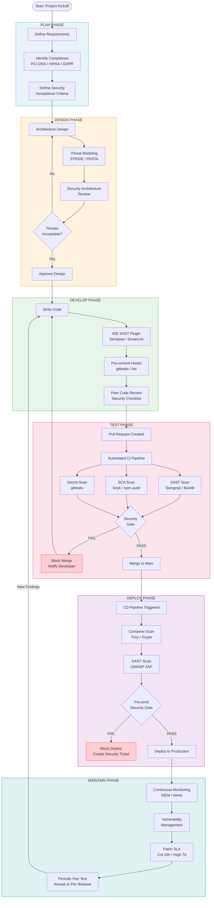

# Secure Development & Secure SDLC

> **Difficulty:** Beginner → Advanced | **Category:** Penetration Testing

---

## Table of Contents

1. [Why Secure Development Matters](#1-why-secure-development-matters)
2. [Secure SDLC Overview](#2-secure-sdlc-overview)
3. [Threat Modeling with STRIDE](#3-threat-modeling-with-stride)
4. [Security Testing Tools in CI/CD](#4-security-testing-tools-in-cicd)
5. [OWASP Top 10 2021 Remediation](#5-owasp-top-10-2021-remediation)
6. [CI/CD Security Integration](#6-cicd-security-integration)
7. [Developer Training and Secure Coding Principles](#7-developer-training-and-secure-coding-principles)
8. [Secure SDLC Flow Diagram](#8-secure-sdlc-flow-diagram)
9. [Security Requirements Checklist](#9-security-requirements-checklist)
10. [Bug Bounty vs Internal Security Testing](#10-bug-bounty-vs-internal-security-testing)

---

## 1. Why Secure Development Matters

Security vulnerabilities are exponentially cheaper to fix the earlier they are discovered.
This is captured by the **NIST 1:10:100 Rule**:

| Phase Vulnerability Found | Relative Cost to Fix |
|--------------------------|----------------------|
| Requirements / Design    | 1x                   |
| Development              | 10x                  |
| QA / Testing             | 100x                 |
| Post-Production          | 1000x or more        |

A SQL injection found during a design review costs an hour of a developer's time.
The same flaw found after a data breach costs legal fees, regulatory fines (GDPR up to 4%
of global turnover), incident response, reputational damage, and customer loss.

### Real-world Cost Examples

- **Equifax (2017):** Unpatched Apache Struts vulnerability led to a breach of 147 million records. Settlement: **$700 million**.
- **Log4Shell (2021):** A single deserialization bug in a logging library affected millions of systems. Remediation cost: billions industry-wide.
- **Capital One (2019):** SSRF via misconfigured WAF led to 100 million customer records exposed. Fine: **$80 million**.

> **Note:** The Ponemon Institute Cost of a Data Breach Report consistently shows that organisations
> with a mature secure development lifecycle reduce breach costs by an average of **$2.66 million**.

### The Shift-Left Principle

Shifting left means moving security activities earlier in the SDLC timeline. Rather than
performing security reviews only before release, teams integrate:

- Security requirements alongside functional requirements
- Threat modeling during design
- Static analysis in developers' IDEs
- Automated scanning in CI/CD pipelines
- Penetration testing before release, not after

---

## 2. Secure SDLC Overview

### 2.1 Traditional SDLC Phases and Security Activities

| SDLC Phase   | Core Activities                    | Security Activities                                              |
|--------------|------------------------------------|------------------------------------------------------------------|
| **Plan**     | Scope, budget, timeline            | Identify compliance (PCI-DSS, HIPAA, GDPR), define risk appetite |
| **Design**   | Architecture, data flow, DB schema | Threat modeling (STRIDE), security architecture review           |
| **Develop**  | Writing code                       | Secure coding standards, IDE SAST plugins, security code review  |
| **Test**     | Functional QA, integration tests   | SAST, DAST, SCA, fuzz testing, security regression tests         |
| **Deploy**   | Release to production              | Infrastructure hardening, secrets management, security gates     |
| **Maintain** | Patches, features, monitoring      | Vulnerability management, patch SLAs, SIEM, incident response   |

### 2.2 Microsoft Security Development Lifecycle (SDL)

Microsoft SDL, introduced after the Trustworthy Computing initiative in 2002, adds mandatory
security practices to each SDLC phase:

**SDL Core Practices:**

1. **Provide Training** — Annual security training for all engineers
2. **Define Security Requirements** — Driven by legal, regulatory, and organisational requirements
3. **Define Metrics and Compliance Reporting** — Minimum security bar (e.g., no critical CVEs shipped)
4. **Perform Threat Modeling** — STRIDE-based analysis for every new feature
5. **Establish Design Requirements** — Cryptography standards, authentication patterns
6. **Define and Use Cryptography Standards** — Only approved algorithms (AES-256, RSA-2048+, SHA-256+)
7. **Manage Third-Party Software Risk** — Inventory and patch all OSS dependencies
8. **Use Approved Tools** — Compiler flags, static analysis, banned function lists
9. **Perform SAST** — Required before each milestone
10. **Perform DAST** — Automated fuzzing and web scanning
11. **Perform Penetration Testing** — Third-party or internal red team before major releases
12. **Establish an Incident Response Plan** — CVE process, security contact, disclosure policy
13. **Final Security Review (FSR)** — Pre-ship checklist sign-off by security team

| SDL Practice         | When Applied     | Owner               | Output                         |
|----------------------|------------------|---------------------|--------------------------------|
| Threat Modeling      | Design phase     | Dev + Security      | Threat model document          |
| SAST                 | Every CI build   | Developer / CI      | Findings report, fixed code    |
| DAST                 | Pre-release      | Security / QA       | Active vulnerability report    |
| Pen Test             | Pre-major release| Internal/External   | Pen test report + remediation  |
| FSR                  | Pre-ship         | Security team       | Sign-off or blocking issues    |

### 2.3 OWASP SAMM (Software Assurance Maturity Model)

OWASP SAMM provides a measurable, actionable framework for assessing and improving a software
security programme. Built around **5 Business Functions**, each with **3 Security Practices**,
each assessed at **3 Maturity Levels**.

| Business Function    | Security Practices                                          |
|----------------------|-------------------------------------------------------------|
| **Governance**       | Strategy and Metrics, Policy and Compliance, Education      |
| **Design**           | Threat Assessment, Security Requirements, Security Arch     |
| **Implementation**   | Secure Build, Secure Deployment, Defect Management          |
| **Verification**     | Architecture Assessment, Requirements Testing, Sec Testing  |
| **Operations**       | Incident Management, Environment Management, Ops Management |

**Maturity Levels:**

- **Level 0:** Ad hoc, no formal practice
- **Level 1:** Initial understanding; security performed informally
- **Level 2:** Managed, consistent practice with process documentation
- **Level 3:** Measuring effectiveness; optimising and automating

> **Note:** OWASP SAMM assessments are conducted using the SAMM Toolbox or the online tool
> at owaspsamm.org. Organisations typically target Level 2 across all practices.

---

## 3. Threat Modeling with STRIDE

### 3.1 What Is Threat Modeling?

Threat modeling is a structured process for identifying, quantifying, and addressing security
threats to a system **before they are exploited**. It answers four key questions:

1. **What are we building?** — System description, data flows, trust boundaries
2. **What can go wrong?** — Enumerate threats using STRIDE
3. **What are we going to do about it?** — Mitigations, controls, accepted risks
4. **Did we do a good job?** — Validation that mitigations are sufficient

### 3.2 STRIDE Categories

STRIDE is a mnemonic developed by Microsoft that categorises threats by their effect:

| Letter | Threat Category        | Violated Property  | Example                                                  |
|--------|------------------------|--------------------|----------------------------------------------------------|
| **S**  | Spoofing               | Authentication     | Attacker impersonates a legitimate user or service        |
| **T**  | Tampering              | Integrity          | Attacker modifies data in transit or at rest              |
| **R**  | Repudiation            | Non-repudiation    | User denies performing an action; no audit log exists     |
| **I**  | Information Disclosure | Confidentiality    | Sensitive data leaked in error messages or via IDOR       |
| **D**  | Denial of Service      | Availability       | Attacker floods service, making it unavailable            |
| **E**  | Elevation of Privilege | Authorisation      | Attacker gains admin rights from low-privileged account  |

### 3.3 Threat Modeling Process

```
1. DIAGRAM    =>  Draw the system (DFD or architecture diagram)
2. IDENTIFY   =>  Apply STRIDE to each element and data flow
3. MITIGATE   =>  Define controls for each identified threat
4. VALIDATE   =>  Verify controls are implemented and effective
```

**Data Flow Diagram (DFD) Elements:**

| Element         | STRIDE Threats Applicable  | Description                            |
|-----------------|----------------------------|----------------------------------------|
| External Entity | S, R                       | Users, external systems, third parties |
| Process         | S, T, R, I, D, E (all)     | Application logic, services, APIs      |
| Data Store      | T, R, I, D                 | Databases, caches, files               |
| Data Flow       | T, I, D                    | HTTP requests, internal calls, queues  |
| Trust Boundary  | All                        | Perimeter where trust changes           |

**Example Threat Model: Web App Login Flow**

For a login flow (User -> HTTPS -> Web Server -> DB Query -> Database):

| Component     | Threat (STRIDE) | Description                                 | Mitigation                            |
|---------------|-----------------|---------------------------------------------|---------------------------------------|
| User->Server  | S - Spoofing    | Credential stuffing / password spraying     | MFA, account lockout, CAPTCHA         |
| User->Server  | T - Tampering   | Parameter manipulation of POST body         | Server-side validation, signed tokens |
| Server        | R - Repudiation | No logging of failed login attempts         | Immutable audit log with timestamp    |
| Server->DB    | I - Info Disc.  | SQL errors revealing schema details         | Generic error pages, exception handler|
| Server        | D - DoS         | No rate limiting on login endpoint          | Rate limiting: 5 attempts / 15 min    |
| Server        | E - EoP         | JWT algorithm confusion attack              | Validate alg header; reject "none"    |

### 3.4 Threat Modeling Tools

```bash
# OWASP Threat Dragon — free, open-source, GitHub integration
npm install -g @threatdragon/owasp-threat-dragon
# Or run via Docker:
docker pull threatdragon/owasp-threat-dragon:stable
docker run -it --rm -p 3000:3000 threatdragon/owasp-threat-dragon:stable

# pytm — programmatic threat modeling in Python
pip install pytm
python your_threat_model.py --report report.html --dfd dfd.png

# Threagile — Agile threat modeling via YAML
docker pull threagile/threagile
docker run --rm -it \
  -v "$(pwd)":/app/work \
  threagile/threagile \
  -verbose \
  -model /app/work/threagile.yaml \
  -output /app/work/output

# Microsoft Threat Modeling Tool (Windows, free)
# Download: https://aka.ms/threatmodelingtool
# Supports STRIDE-per-element analysis with auto-generated threats
```

> **Note:** Start with OWASP Threat Dragon for new teams — it is free, runs locally or
> as a web app, and stores model files in JSON that can be committed alongside code.

---

## 4. Security Testing Tools in CI/CD

### 4.1 SAST — Static Application Security Testing

SAST analyses source code without executing the application. It catches issues early —
often within seconds in a CI pipeline.

#### Semgrep (Multi-language, open-source)

```bash
# Install
pip install semgrep

# Run with OWASP Top 10 ruleset
semgrep --config "p/owasp-top-ten" ./src

# Run with security-audit ruleset
semgrep --config "p/security-audit" ./src

# Auto-detect language and apply default rules
semgrep --config auto ./src

# Output JSON for CI parsing
semgrep --config "p/owasp-top-ten" --json ./src > semgrep-results.json

# Fail pipeline if any findings
semgrep --config "p/owasp-top-ten" --error ./src
```

#### SonarQube (Multi-language, enterprise-grade)

```bash
# Start SonarQube server via Docker
docker run -d --name sonarqube -p 9000:9000 sonarqube:community

# Install sonar-scanner
wget https://binaries.sonarsource.com/Distribution/sonar-scanner-cli/sonar-scanner-cli-5.0.1.3006-linux.zip
unzip sonar-scanner-cli-*.zip

# Run scan from project root
sonar-scanner \
  -Dsonar.projectKey=my-project \
  -Dsonar.sources=./src \
  -Dsonar.host.url=http://localhost:9000 \
  -Dsonar.login=your-token-here

# Wait for quality gate result (fail if gate fails)
sonar-scanner \
  -Dsonar.projectKey=my-project \
  -Dsonar.qualitygate.wait=true \
  -Dsonar.sources=./src
```

#### Bandit (Python)

```bash
# Install
pip install bandit

# Scan Python project
bandit -r ./src

# Report only high-severity, high-confidence
bandit -r ./src -ll -ii

# Output JSON for CI
bandit -r ./src -f json -o bandit-report.json

# Exit code 1 on issues found
bandit -r ./src -ll
```

#### Brakeman (Ruby on Rails)

```bash
# Install
gem install brakeman

# Run basic scan
brakeman /path/to/rails/app

# Output JSON
brakeman -o brakeman-report.json /path/to/rails/app

# Fail pipeline on any warning
brakeman --exit-on-warn /path/to/rails/app

# Skip false positives with ignore file
brakeman -I brakeman.ignore /path/to/rails/app

# Only report medium severity and above
brakeman --min-confidence 2 /path/to/rails/app
```

#### SpotBugs + Find Security Bugs (Java)

```bash
# Maven plugin — add to pom.xml, then run:
mvn spotbugs:check

# Standalone CLI with Find Security Bugs plugin
java -jar spotbugs.jar -textui \
  -pluginList findsecbugs-plugin.jar \
  -include security-include-filter.xml \
  target/classes/

# Gradle
./gradlew spotbugsMain

# Fail build on HIGH severity
# In pom.xml: <maxAllowedViolations>0</maxAllowedViolations>
# <failOnError>true</failOnError>
```

#### Checkmarx (Enterprise SAST)

```bash
# Checkmarx CLI scan via CxConsole
runCxConsole.sh Scan \
  -CxServer https://checkmarx.company.com \
  -CxUser admin \
  -CxPassword "$CX_PASSWORD" \
  -ProjectName "CxServer\My-Project" \
  -LocationType folder \
  -LocationPath ./src \
  -ReportXML results.xml \
  -SASTHigh 0

# Checkmarx One (cloud) via CLI
cx scan create --project-name "My-Project" \
  --file-filter "!node_modules,!vendor" \
  -s . \
  --branch main
```

### 4.2 DAST — Dynamic Application Security Testing

DAST tests a running application from the outside, simulating real attacks.

#### OWASP ZAP (Zed Attack Proxy)

```bash
# Pull ZAP Docker image
docker pull zaproxy/zap-stable

# Baseline scan (passive — no active attacks)
docker run --rm zaproxy/zap-stable zap-baseline.py \
  -t https://target-app.example.com \
  -r zap-baseline-report.html

# Full active scan
docker run --rm zaproxy/zap-stable zap-full-scan.py \
  -t https://target-app.example.com \
  -r zap-full-report.html \
  -J zap-full-report.json

# API scan from OpenAPI spec
docker run --rm zaproxy/zap-stable zap-api-scan.py \
  -t https://target-app.example.com/openapi.json \
  -f openapi \
  -r zap-api-report.html

# Authenticated scan
docker run --rm zaproxy/zap-stable zap-full-scan.py \
  -t https://target-app.example.com \
  -z "auth.loginurl=https://target-app.example.com/login" \
  -r zap-auth-report.html
```

#### Nikto (Web Server Scanner)

```bash
# Install
sudo apt install nikto

# Basic scan
nikto -h https://target-app.example.com

# Scan with SSL
nikto -h target-app.example.com -ssl -port 443

# Save output as HTML
nikto -h https://target-app.example.com -o nikto-report.html -Format html

# Scan via proxy (chain with Burp)
nikto -h https://target-app.example.com -useproxy http://127.0.0.1:8080

# Tune test categories: 1=interesting files, 2=misconfig, 4=injection
nikto -h https://target-app.example.com -Tuning 1234
```

#### Burp Suite Enterprise (CI Integration)

```bash
# Start a scan via REST API
curl -X POST https://burp-enterprise.company.com/api/v1/scan \
  -H "Authorization: Bearer $BURP_API_KEY" \
  -H "Content-Type: application/json" \
  -d '{"scope":{"include":[{"rule":"https://target.example.com"}]},"urls":["https://target.example.com"]}'

# Poll scan status
curl https://burp-enterprise.company.com/api/v1/scan/SCAN_ID \
  -H "Authorization: Bearer $BURP_API_KEY"

# Get issues
curl https://burp-enterprise.company.com/api/v1/scan/SCAN_ID/issues \
  -H "Authorization: Bearer $BURP_API_KEY"
```

### 4.3 SCA — Software Composition Analysis

SCA identifies known vulnerabilities (CVEs) in third-party and open-source dependencies.

#### Snyk

```bash
# Install
npm install -g snyk

# Authenticate
snyk auth

# Test Node.js project
snyk test

# Test Python project
snyk test --file=requirements.txt

# Test Docker image
snyk container test ubuntu:20.04

# Test Terraform / Kubernetes IaC
snyk iac test ./terraform/

# Monitor (send to Snyk dashboard nightly)
snyk monitor

# Auto-fix (upgrade vulnerable deps)
snyk fix

# Fail on HIGH or CRITICAL
snyk test --severity-threshold=high
```

#### OWASP Dependency-Check

```bash
# Install
wget https://github.com/jeremylong/DependencyCheck/releases/download/v9.0.9/dependency-check-9.0.9-release.zip
unzip dependency-check-*.zip
export PATH=$PATH:$(pwd)/dependency-check/bin

# Scan project
dependency-check.sh \
  --project "MyApp" \
  --scan ./target \
  --format HTML \
  --out ./reports/

# With NVD API key (avoid rate limiting)
dependency-check.sh \
  --project "MyApp" \
  --scan ./target \
  --nvdApiKey "$NVD_API_KEY" \
  --format JSON \
  --out ./reports/

# Maven plugin
mvn dependency-check:check

# Fail build if CVSS score >= 7.0 (HIGH)
dependency-check.sh --scan . --failOnCVSS 7
```

#### npm audit

```bash
# Run audit (reads package-lock.json)
npm audit

# Output JSON
npm audit --json > npm-audit-report.json

# Auto-fix (upgrades to patched versions)
npm audit fix

# Fail on CRITICAL
npm audit --audit-level=critical

# Fail on HIGH or CRITICAL
npm audit --audit-level=high
```

#### pip-audit (Python)

```bash
# Install
pip install pip-audit

# Audit current environment
pip-audit

# Audit from requirements file
pip-audit -r requirements.txt

# Output JSON
pip-audit -r requirements.txt -f json -o pip-audit-report.json

# Fix (upgrade vulnerable packages in requirements.txt)
pip-audit --fix -r requirements.txt

# Audit with OSV (Open Source Vulnerabilities) database
pip-audit -r requirements.txt --vulnerability-service osv
```

### 4.4 Secret Scanning

Secrets committed to version control are a critical vulnerability class.

#### gitleaks

```bash
# Install
brew install gitleaks
# Linux binary:
wget https://github.com/gitleaks/gitleaks/releases/download/v8.18.2/gitleaks_8.18.2_linux_x64.tar.gz
tar xzf gitleaks_8.18.2_linux_x64.tar.gz
sudo mv gitleaks /usr/local/bin/

# Scan entire repository history
gitleaks detect --source . --verbose

# Scan only staged files (use as pre-commit hook)
gitleaks protect --staged --verbose

# Scan with custom config
gitleaks detect --source . --config .gitleaks.toml

# Output SARIF for GitHub Security tab
gitleaks detect --source . --report-format sarif --report-path gitleaks.sarif

# Example .gitleaks.toml — add to repository root:
# [extend]
# useDefault = true
# [[rules]]
# id = "custom-internal-token"
# description = "Internal API Token"
# regex = '''INTAPI-[0-9A-Za-z]{32}'''
# tags = ["secret", "api-token"]
```

#### truffleHog

```bash
# Install
pip install trufflehog
# Or Docker:
docker pull trufflesecurity/trufflehog

# Scan git repository
trufflehog git file://. --only-verified

# Scan remote GitHub repository
trufflehog github --repo https://github.com/org/repo --only-verified

# Scan entire GitHub organisation
trufflehog github --org=my-org --token="$GITHUB_TOKEN" --only-verified

# Scan S3 bucket
trufflehog s3 --bucket=my-bucket --only-verified

# Scan Docker image layers
trufflehog docker --image=myimage:latest

# Output JSON
trufflehog git file://. --json --only-verified > trufflehog-report.json
```

> **Warning:** The `--only-verified` flag filters to confirmed active secrets only.
> Remove it during thorough assessments to surface all potential secret patterns.

---

## 5. OWASP Top 10 2021 Remediation

### A01 — Broken Access Control

**Description:** Users acting outside intended permissions. Includes IDOR, path traversal,
privilege escalation, and missing function-level access control.

**Remediation:** Deny by default; implement server-side checks on every request;
log and alert on repeated access control failures.

```python
# BAD — trusts client-supplied role header
@app.route('/admin/users')
def list_users():
    if request.headers.get('X-Role') == 'admin':   # Never trust client input!
        return jsonify(get_all_users())
    return "Forbidden", 403

# GOOD — validates role from server-side session
from functools import wraps
from flask import session, abort

def require_role(role):
    def decorator(f):
        @wraps(f)
        def wrapper(*args, **kwargs):
            user = get_user_from_session(session.get('user_id'))
            if user is None or role not in user.roles:
                abort(403)
            return f(*args, **kwargs)
        return wrapper
    return decorator

@app.route('/admin/users')
@require_role('admin')
def list_users():
    return jsonify(get_all_users())
```

---

### A02 — Cryptographic Failures

**Description:** Sensitive data exposed due to weak encryption, cleartext transmission,
deprecated algorithms (MD5, SHA1, DES), or poor key management.

**Remediation:** Use TLS 1.2+, enforce HSTS, store passwords with Argon2id, rotate keys
using a secrets manager.

```python
# BAD — MD5 password hashing (broken — rainbow tables trivial)
import hashlib
def hash_password(password):
    return hashlib.md5(password.encode()).hexdigest()

# GOOD — Argon2id (Password Hashing Competition winner)
from argon2 import PasswordHasher
from argon2.exceptions import VerifyMismatchError

ph = PasswordHasher(time_cost=2, memory_cost=65536, parallelism=2)

def hash_password(password: str) -> str:
    return ph.hash(password)

def verify_password(hashed: str, password: str) -> bool:
    try:
        return ph.verify(hashed, password)
    except VerifyMismatchError:
        return False
```

```bash
# Check TLS configuration and cipher suites
testssl.sh https://target.example.com

# Check for weak ciphers
nmap --script ssl-enum-ciphers -p 443 target.example.com

# Nginx HSTS header:
# add_header Strict-Transport-Security "max-age=31536000; includeSubDomains; preload" always;
```

---

### A03 — Injection

**Description:** Untrusted data sent to an interpreter as part of a command or query.
Includes SQL, NoSQL, OS command, LDAP, and expression language injection.

**Remediation:** Use parameterised queries, apply allow-list input validation,
apply least privilege to database accounts.

```python
# BAD — SQL Injection vulnerable
import sqlite3
def get_user(username):
    conn = sqlite3.connect('app.db')
    query = f"SELECT * FROM users WHERE username = '{username}'"  # Dangerous!
    return conn.execute(query).fetchone()

# GOOD — Parameterised query
def get_user(username: str):
    conn = sqlite3.connect('app.db')
    query = "SELECT * FROM users WHERE username = ?"
    return conn.execute(query, (username,)).fetchone()

# GOOD — ORM (SQLAlchemy)
from sqlalchemy.orm import Session
def get_user(db: Session, username: str):
    return db.query(User).filter(User.username == username).first()

# GOOD — OS commands: list form, never shell=True with user input
import subprocess
result = subprocess.run(["ping", "-c", "4", hostname], capture_output=True, timeout=10)
```

---

### A04 — Insecure Design

**Description:** Missing or ineffective security controls at the design stage.
No implementation patching can fix a fundamentally insecure design.

**Remediation:** Perform threat modeling during design; apply security design patterns;
define security acceptance criteria alongside user stories.

```python
# INSECURE DESIGN: 4-digit PIN reset — only 10,000 combinations, enumerable
# SECURE DESIGN: Cryptographically random single-use token with expiry

import secrets
import hashlib
from datetime import datetime, timedelta

def generate_reset_token(user_id: int, db) -> str:
    raw_token = secrets.token_urlsafe(32)   # 256 bits of entropy
    token_hash = hashlib.sha256(raw_token.encode()).hexdigest()
    expiry = datetime.utcnow() + timedelta(minutes=15)
    db.execute(
        "INSERT INTO password_resets (user_id, token_hash, expires_at) VALUES (?,?,?)",
        (user_id, token_hash, expiry)
    )
    return raw_token   # Return raw token to user; store only the hash
```

---

### A05 — Security Misconfiguration

**Description:** Default credentials, unnecessary features enabled, unpatched systems,
cloud storage publicly exposed, verbose error messages.

**Remediation:** Automate secure baselines with IaC; disable unused features and ports;
harden HTTP response headers; enable security logging.

```bash
# Check HTTP security headers
curl -I https://target.example.com | grep -i "x-frame\|content-security\|hsts\|referrer"

# Scan for misconfigurations with Nuclei
nuclei -u https://target.example.com -t misconfiguration/

# CIS Benchmark hardening check
sudo lynis audit system

# Check S3 bucket public access
aws s3api get-bucket-acl --bucket my-bucket
aws s3api get-bucket-policy --bucket my-bucket
```

```nginx
# Nginx — complete security header configuration
server {
    add_header X-Frame-Options "DENY" always;
    add_header X-Content-Type-Options "nosniff" always;
    add_header X-XSS-Protection "1; mode=block" always;
    add_header Referrer-Policy "strict-origin-when-cross-origin" always;
    add_header Content-Security-Policy "default-src 'self'; object-src 'none';" always;
    add_header Permissions-Policy "geolocation=(), microphone=(), camera=()" always;
    server_tokens off;
}
```

---

### A06 — Vulnerable and Outdated Components

**Description:** Using libraries, frameworks, or OS packages with known vulnerabilities
without patching or replacing them.

**Remediation:** Maintain an SBOM; integrate SCA into CI/CD; subscribe to vulnerability
feeds; define patch SLAs.

```bash
# Generate SBOM with Syft (CycloneDX format)
syft packages dir:./src -o cyclonedx-json > sbom.json

# Scan SBOM with Grype
grype sbom:sbom.json

# Scan Docker image for vulnerabilities
grype nginx:latest --fail-on high

# Check OS package advisories (Debian/Ubuntu)
sudo apt-get update && sudo apt-get upgrade --dry-run | grep -i security

# List outdated Python packages
pip list --outdated

# Node.js: check for updates
npm outdated
npx npm-check-updates
```

---

### A07 — Identification and Authentication Failures

**Description:** Weak passwords, missing MFA, flawed session management,
credential exposure, brute-force susceptibility.

**Remediation:** Enforce strong passwords, require MFA for privileged accounts,
use cryptographically random session IDs, implement lockout.

```python
# BAD — Predictable session ID
import random
session_id = str(random.randint(1000, 9999))  # Only 9000 values!

# GOOD — Cryptographically random session ID
import secrets
session_id = secrets.token_hex(32)  # 256-bit session ID

# Check password against HaveIBeenPwned (k-anonymity model — safe to call)
import hashlib, requests

def is_pwned(password: str) -> int:
    sha1 = hashlib.sha1(password.encode()).hexdigest().upper()
    prefix, suffix = sha1[:5], sha1[5:]
    resp = requests.get(f"https://api.pwnedpasswords.com/range/{prefix}", timeout=5)
    for line in resp.text.splitlines():
        h, count = line.split(':')
        if h == suffix:
            return int(count)
    return 0  # 0 = not found in any known breach
```

---

### A08 — Software and Data Integrity Failures

**Description:** Code and infrastructure that does not protect against integrity violations.
Includes insecure deserialization, CI/CD pipeline poisoning, and unsigned updates.

**Remediation:** Verify digital signatures on artifacts; pin dependencies with hashes;
sign container images; protect CI/CD with branch protection and signed commits.

```bash
# Verify GPG signature on downloaded artifacts
gpg --verify sha256sums.gpg sha256sums
sha256sum -c sha256sums

# Use npm ci (uses package-lock.json hashes, fails if tampered)
npm ci

# Sign and verify Docker images with Cosign (Sigstore)
cosign sign --key cosign.key myregistry/myimage:latest
cosign verify --key cosign.pub myregistry/myimage:latest

# Python packages with hash pinning in requirements.txt:
# requests==2.31.0 --hash=sha256:58cd2187423839...
pip install -r requirements.txt --require-hashes
```

```python
# BAD — Insecure pickle deserialization
import pickle
def load_session(data: bytes):
    return pickle.loads(data)   # Arbitrary code execution!

# GOOD — JSON with Pydantic schema validation
from pydantic import BaseModel
import json

class SessionData(BaseModel):
    user_id: int
    role: str
    expires: str

def load_session(data: str) -> SessionData:
    return SessionData.model_validate_json(data)
```

---

### A09 — Security Logging and Monitoring Failures

**Description:** Insufficient logging and alerting leaves breaches undetected.
Average detection time without monitoring: 197 days (IBM Cost of Data Breach Report).

**Remediation:** Log auth events, access control failures, and input validation failures;
ship logs to a SIEM; alert on anomalies.

```python
# BAD — No security logging on login
@app.route('/login', methods=['POST'])
def login():
    user = authenticate(request.form['username'], request.form['password'])
    if user:
        session['user_id'] = user.id
        return redirect('/dashboard')
    return "Invalid credentials", 401

# GOOD — Structured security event logging
import logging, json
from datetime import datetime, timezone

sec_log = logging.getLogger('security')

@app.route('/login', methods=['POST'])
def login():
    username = request.form.get('username', '')
    source_ip = request.remote_addr
    user = authenticate(username, request.form.get('password', ''))
    sec_log.info(json.dumps({
        "timestamp": datetime.now(timezone.utc).isoformat(),
        "event_type": "AUTH_ATTEMPT",
        "source_ip": source_ip,
        "username": username,
        "user_agent": request.headers.get('User-Agent'),
        "success": user is not None
    }))
    if user:
        session['user_id'] = user.id
        return redirect('/dashboard')
    return "Invalid credentials", 401
```

```bash
# Logstash pipeline to ship security logs to Elasticsearch
# input  { file { path => "/var/log/app/security.log" codec => json } }
# filter { date { match => ["timestamp", "ISO8601"] target => "@timestamp" } }
# output { elasticsearch { hosts => ["elasticsearch:9200"] index => "security-%{+YYYY.MM.dd}" } }

# Install Graylog GELF handler for Python
pip install graypy
```

---

### A10 — Server-Side Request Forgery (SSRF)

**Description:** The server issues HTTP requests to arbitrary destinations including
internal services (169.254.169.254 metadata) and file:// URIs.

**Remediation:** Validate user-supplied URLs against an allow-list; block RFC1918 ranges;
disable unused URL schemes; enforce egress firewall rules.

```python
# BAD — SSRF vulnerable
import requests
@app.route('/fetch')
def fetch_url():
    url = request.args.get('url')
    resp = requests.get(url)    # Attacker can hit http://169.254.169.254/
    return resp.content

# GOOD — Allow-list with DNS rebinding protection
from urllib.parse import urlparse
import ipaddress, socket, requests

ALLOWED_HOSTS = {'api.partner.com', 'cdn.example.com'}

def is_safe_url(url: str) -> bool:
    parsed = urlparse(url)
    if parsed.scheme not in ('http', 'https'):
        return False
    hostname = parsed.hostname
    if hostname not in ALLOWED_HOSTS:
        return False
    try:
        ip = ipaddress.ip_address(socket.gethostbyname(hostname))
        if ip.is_private or ip.is_loopback or ip.is_link_local:
            return False
    except (socket.gaierror, ValueError):
        return False
    return True

@app.route('/fetch')
def fetch_url():
    url = request.args.get('url', '')
    if not is_safe_url(url):
        return "URL not allowed", 400
    resp = requests.get(url, timeout=5, allow_redirects=False)
    return resp.content
```

```bash
# Block cloud metadata endpoint at OS level
iptables -A OUTPUT -d 169.254.169.254 -m owner --uid-owner www-data -j DROP

# AWS IMDSv2 — requires PUT token before GET (blocks simple SSRF)
TOKEN=$(curl -s -X PUT "http://169.254.169.254/latest/api/token" \
  -H "X-aws-ec2-metadata-token-ttl-seconds: 21600")
curl -H "X-aws-ec2-metadata-token: $TOKEN" http://169.254.169.254/latest/meta-data/
```

---

## 6. CI/CD Security Integration

### 6.1 GitHub Actions Security Pipeline

```yaml
# .github/workflows/security.yml
name: Security Pipeline

on:
  push:
    branches: [main, develop]
  pull_request:
    branches: [main]

permissions:
  contents: read
  security-events: write

jobs:
  sast:
    name: SAST - Semgrep
    runs-on: ubuntu-latest
    steps:
      - uses: actions/checkout@v4
      - uses: returntocorp/semgrep-action@v1
        with:
          config: p/owasp-top-ten p/security-audit p/secrets
        env:
          SEMGREP_APP_TOKEN: ${{ secrets.SEMGREP_APP_TOKEN }}

  sca:
    name: SCA - Snyk
    runs-on: ubuntu-latest
    steps:
      - uses: actions/checkout@v4
      - uses: actions/setup-node@v4
        with:
          node-version: '20'
      - run: npm ci
      - uses: snyk/actions/node@master
        env:
          SNYK_TOKEN: ${{ secrets.SNYK_TOKEN }}
        with:
          args: --severity-threshold=high --fail-on=all
      - uses: github/codeql-action/upload-sarif@v3
        if: always()
        with:
          sarif_file: snyk.sarif

  secret-scan:
    name: Secret Scan - gitleaks
    runs-on: ubuntu-latest
    steps:
      - uses: actions/checkout@v4
        with:
          fetch-depth: 0
      - uses: gitleaks/gitleaks-action@v2
        env:
          GITHUB_TOKEN: ${{ secrets.GITHUB_TOKEN }}

  dast:
    name: DAST - OWASP ZAP
    runs-on: ubuntu-latest
    needs: [sast, sca]
    if: github.ref == 'refs/heads/develop'
    steps:
      - uses: actions/checkout@v4
      - name: Start application
        run: |
          docker compose up -d app
          sleep 15
          curl --retry 5 --retry-delay 3 http://localhost:8080/health
      - uses: zaproxy/action-baseline@v0.11.0
        with:
          target: 'http://localhost:8080'
      - uses: actions/upload-artifact@v4
        if: always()
        with:
          name: zap-report
          path: report_html.html

  dependency-review:
    name: Dependency Review
    runs-on: ubuntu-latest
    if: github.event_name == 'pull_request'
    steps:
      - uses: actions/checkout@v4
      - uses: actions/dependency-review-action@v4
        with:
          fail-on-severity: high
          deny-licenses: GPL-2.0, AGPL-3.0
```

### 6.2 GitLab CI Security Pipeline

```yaml
# .gitlab-ci.yml
stages:
  - build
  - security
  - deploy

include:
  - template: Security/SAST.gitlab-ci.yml
  - template: Security/Secret-Detection.gitlab-ci.yml
  - template: Security/Dependency-Scanning.gitlab-ci.yml
  - template: Security/Container-Scanning.gitlab-ci.yml
  - template: Security/DAST.gitlab-ci.yml

semgrep-sast:
  stage: security
  image: returntocorp/semgrep
  script:
    - semgrep --config "p/owasp-top-ten" --error --json --output semgrep.json ./src
  artifacts:
    reports:
      sast: semgrep.json
  allow_failure: false   # Security gate — blocks pipeline

snyk-sca:
  stage: security
  image: snyk/snyk:node
  script:
    - snyk auth $SNYK_TOKEN
    - snyk test --severity-threshold=high --json > snyk-report.json
  artifacts:
    paths: [snyk-report.json]
  allow_failure: false

dast:
  stage: security
  variables:
    DAST_WEBSITE: https://staging.example.com
    DAST_FULL_SCAN_ENABLED: "true"
  only:
    - main
    - /^release\/.*/
```

### 6.3 Security Gates

Security gates are pipeline steps that block progression when thresholds are violated.

| Gate Type           | Tool              | Failure Condition                        | Action             |
|---------------------|-------------------|------------------------------------------|--------------------|
| SAST critical       | Semgrep / Bandit  | Any CRITICAL severity finding            | Block merge/deploy |
| SCA high            | Snyk / npm audit  | HIGH or CRITICAL CVE in direct deps      | Block deploy       |
| Secret leak         | gitleaks          | Any detected secret                      | Block push         |
| Container vuln      | Grype / Trivy     | CVSSv3 score >= 8.0                      | Block deploy       |
| License violation   | FOSSA / Snyk      | GPL/AGPL in commercial product           | Block merge        |
| DAST critical       | OWASP ZAP         | High confidence, high risk finding       | Block production   |

```bash
# Trivy — container scan with security gate
trivy image --exit-code 1 --severity HIGH,CRITICAL myapp:latest

# Trivy — filesystem scan
trivy fs --exit-code 1 --severity CRITICAL .

# Trivy — IaC scan (Terraform, Kubernetes)
trivy config --exit-code 1 --severity HIGH,CRITICAL ./terraform/

# Generate and scan SBOM
trivy image --format cyclonedx --output sbom.cdx myapp:latest
trivy sbom --exit-code 1 --severity HIGH sbom.cdx
```

> **Warning:** Start security gates with `--severity CRITICAL` only. Tighten to HIGH
> after tuning to avoid developer frustration from excessive false positives.

---

## 7. Developer Training and Secure Coding Principles

### 7.1 Core Secure Coding Principles

| Principle                  | Description                                                                |
|----------------------------|----------------------------------------------------------------------------|
| **Input Validation**       | Validate all input server-side. Accept known-good (allow-list).            |
| **Output Encoding**        | Encode data before rendering in HTML, SQL, shell, LDAP, XML contexts.      |
| **Least Privilege**        | Grant minimum permissions needed — no more.                                |
| **Defence in Depth**       | Layer independent controls so no single failure is catastrophic.           |
| **Fail Secure**            | On error, default to deny — never accidentally permit access.              |
| **Separation of Concerns** | Keep auth, authorisation, and business logic separate.                     |
| **Don't Trust, Verify**    | Validate all data even from internal systems.                              |
| **Avoid Security by Obscurity** | Security must not depend solely on hiding implementation details.    |
| **Keep It Simple**         | Complex code has more vulnerabilities; simplify wherever possible.         |
| **Fix Security Issues First** | Security bugs outrank feature work in the backlog.                    |

### 7.2 Input Validation and Output Encoding Examples

```python
# INPUT VALIDATION — allow-list approach
import re

def validate_username(username: str) -> str:
    if not re.match(r'^[a-zA-Z0-9_]{3,32}$', username):
        raise ValueError(f"Invalid username: {username!r}")
    return username

def validate_email(email: str) -> str:
    # Use a battle-tested library, not a home-grown regex
    import email_validator
    valid = email_validator.validate_email(email)
    return valid.email

# OUTPUT ENCODING — HTML context
from markupsafe import escape

@app.route('/profile/<username>')
def profile(username):
    safe_name = escape(username)      # Prevents XSS
    return f"<h1>Profile: {safe_name}</h1>"

# OUTPUT ENCODING — JavaScript context
import json

@app.route('/api/name')
def api_name():
    user_input = request.args.get('name', '')
    return f"<script>var name = {json.dumps(user_input)};</script>"
```

### 7.3 Security Champions Program

A **Security Champion** is a developer embedded in each product team who acts as a
security advocate and liaison with the central security team.

**Champion Responsibilities:**
- Attend monthly security briefings and share learnings with the team
- Own and triage SAST/SCA findings for the team's codebase
- Conduct peer code reviews with a security focus
- Facilitate threat modeling workshops for new features
- Act as first point of contact for security questions

**Program Structure:**

```
Central Security Team
        |
        +--- Security Champion (Team Alpha)    <- Developer role, not full-time security
        +--- Security Champion (Team Beta)
        +--- Security Champion (Team Gamma)
        +--- Security Champion (Platform Team)

Champions receive:
  - Dedicated security training budget
  - Burp Suite Pro license
  - Early access to pen test findings
  - Career recognition and title
```

### 7.4 Training Resources

| Resource                         | Level        | Focus                                 | Cost       |
|----------------------------------|--------------|---------------------------------------|------------|
| PortSwigger Web Security Academy | Beginner–Adv | Web vulnerabilities with labs         | Free       |
| OWASP WebGoat                    | Beginner–Int | Hands-on intentionally vulnerable app | Free       |
| OWASP Juice Shop                 | Beginner–Adv | Gamified web app hacking              | Free       |
| HackTheBox for developers        | Intermediate | Real-world CVE exploitation           | Free/Pro   |
| SANS SEC522                      | Intermediate | Application Security for Developers   | Paid       |
| SANS SEC540                      | Advanced     | Cloud and DevSecOps                   | Paid       |
| Secure Code Warrior              | Beginner–Int | Language-specific secure coding       | Paid       |
| Checkmarx Codebashing            | Beginner–Int | Code-level security training          | Paid       |
| PentesterLab                     | Int–Advanced | Web and binary exploitation           | Free/Pro   |

```bash
# Spin up OWASP Juice Shop for developer training
docker pull bkimminich/juice-shop
docker run --rm -p 3000:3000 bkimminich/juice-shop

# Spin up WebGoat
docker pull webgoat/webgoat
docker run --rm -p 8080:8080 -p 9090:9090 webgoat/webgoat

# Spin up DVWA (Damn Vulnerable Web Application)
docker pull vulnerables/web-dvwa
docker run --rm -p 80:80 vulnerables/web-dvwa
```

---

## 8. Secure SDLC Flow Diagram



---

## 9. Security Requirements Checklist

Use this checklist during the **design phase** and as a pre-deployment review gate.

### Authentication and Session Management

- [ ] Passwords stored using Argon2id, bcrypt (cost 12+), or scrypt
- [ ] MFA available and required for admin/privileged accounts
- [ ] Account lockout after 5 to 10 failed attempts
- [ ] Session IDs are 128+ bits, cryptographically random
- [ ] Session regenerated after successful login (prevents session fixation)
- [ ] Session invalidated on logout (server-side invalidation, not just cookie deletion)
- [ ] Session timeout: idle 30 min, absolute 8 to 24 hrs
- [ ] New passwords checked against HaveIBeenPwned API

### Access Control

- [ ] Default-deny access control model
- [ ] Every endpoint requires an explicit authorisation check
- [ ] Object-level authorisation checked on every request (prevents IDOR)
- [ ] Sensitive functions require re-authentication (password change, payment)
- [ ] Admin functionality completely separated from regular user functionality

### Cryptography

- [ ] All data in transit uses TLS 1.2 minimum (prefer TLS 1.3)
- [ ] HSTS header configured: max-age 1 year+, includeSubDomains, preload
- [ ] Sensitive data at rest encrypted with AES-256-GCM
- [ ] Cryptographic keys stored in a secrets manager (Vault, KMS), not in code
- [ ] No use of MD5, SHA1, DES, RC4, or ECB cipher mode

### Input Validation and Output Encoding

- [ ] All user input validated server-side using allow-list approach
- [ ] SQL queries use parameterised statements or ORM — no string concatenation
- [ ] HTML output encoded before rendering to prevent XSS
- [ ] File uploads validate type, size, and content (magic bytes, not just extension)
- [ ] Content-Security-Policy header configured and validated

### API Security

- [ ] All API endpoints require authentication (no unauthenticated sensitive endpoints)
- [ ] API rate limiting implemented per user and per IP
- [ ] API keys and tokens have expiry and can be revoked
- [ ] Sensitive data not passed in GET query parameters (appears in server logs)
- [ ] API versioning implemented to support graceful deprecation

### Secrets and Configuration

- [ ] No hardcoded secrets, passwords, API keys, or tokens in source code
- [ ] .env files excluded from version control (in .gitignore)
- [ ] Environment configuration managed separately from application code
- [ ] Sensitive values masked in logs (e.g., passwords, tokens, card numbers)

### Logging and Monitoring

- [ ] Authentication events logged (success and failure) with IP and user agent
- [ ] Access control failures logged and alerted on
- [ ] Logs shipped to a centralised SIEM (not only local files)
- [ ] Alerting configured for: brute force, impossible travel, off-hours admin activity
- [ ] Log retention meets compliance requirements (PCI-DSS requires 12 months)

### Dependencies and Supply Chain

- [ ] SBOM generated and maintained (CycloneDX or SPDX format)
- [ ] SCA scan passes with no HIGH/CRITICAL vulnerabilities
- [ ] Dependency lock files committed and used in builds (npm ci, pip install --require-hashes)
- [ ] Third-party scripts use Subresource Integrity (SRI) hashes

### Infrastructure and Deployment

- [ ] Non-production environments do not contain production data
- [ ] Debug mode disabled in production
- [ ] Verbose error messages not returned to clients
- [ ] Security headers configured (CSP, HSTS, X-Frame-Options, etc.)
- [ ] Unnecessary ports, services, and default accounts disabled
- [ ] Container images use a non-root user
- [ ] Container images based on minimal base (distroless or alpine)

---

## 10. Bug Bounty vs Internal Security Testing

### 10.1 Comparison Overview

| Dimension          | Bug Bounty Program                      | Internal Penetration Testing             |
|--------------------|-----------------------------------------|------------------------------------------|
| **Testers**        | External crowd-sourced researchers      | Internal red team or contracted firm     |
| **Cost model**     | Pay-per-vulnerability (variable)        | Fixed engagement fee or salary           |
| **Coverage**       | Broad — many eyes, diverse expertise    | Focused — scoped to specific systems     |
| **Depth**          | Varies by researcher motivation         | Deep, systematic, structured             |
| **Control**        | Limited — researchers choose targets    | Full — you define scope and timing       |
| **Compliance**     | Does not satisfy compliance mandates    | Satisfies PCI-DSS, ISO 27001, SOC 2      |
| **Disclosure**     | Vulnerability known to external parties | Stays within the organisation            |
| **Speed**          | Continuous, 24/7                        | Requires engagement scheduling           |
| **Avg payout**     | $300 to $15,000 per finding             | N/A                                      |
| **Best for**       | Mature orgs with solid security baseline| All sizes; required before major launches|

### 10.2 When to Use Each

**Use a Bug Bounty Program when:**
- Your product is public-facing with a large attack surface
- You have a security team capable of triaging and remediating reports quickly
- Your internal security baseline is solid (no obvious low-hanging fruit)
- You want continuous coverage between penetration test engagements
- You want access to specialised researcher expertise

**Use Internal Penetration Testing when:**
- Pre-launch security assessment is required
- Compliance mandates it (PCI-DSS Req 11.4, SOC 2)
- Testing internal or privileged systems not suitable for bug bounty scope
- You need a structured, auditable report for management
- You want to test specific threat scenarios (insider threat, social engineering)

### 10.3 Sample Bug Bounty Policy

```markdown
## Scope

### In Scope
- *.example.com (excluding staging.example.com)
- api.example.com
- iOS and Android applications (latest version)

### Out of Scope
- Third-party infrastructure (AWS, Cloudflare)
- Social engineering and phishing
- Physical attacks
- DoS / DDoS
- Automated scanning without written approval

## Reward Structure

| Severity | CVSS Range | Reward         |
|----------|-----------|----------------|
| Critical | 9.0-10.0  | $5,000-$15,000 |
| High     | 7.0-8.9   | $1,000-$5,000  |
| Medium   | 4.0-6.9   | $200-$1,000    |
| Low      | 0.1-3.9   | $50-$200       |

## Safe Harbour
We will not pursue legal action against researchers who:
- Follow this responsible disclosure policy
- Do not access, modify, or exfiltrate user data
- Report findings to security@example.com within 72 hours
```

### 10.4 Vulnerability Disclosure Policy and security.txt

Every organisation should publish a security.txt and VDP regardless of bug bounty status:

```bash
# Create /.well-known/security.txt (RFC 9116 standard)
mkdir -p .well-known

cat > .well-known/security.txt << 'SECTXT'
Contact: mailto:security@example.com
Expires: 2026-01-01T00:00:00.000Z
Encryption: https://example.com/pgp-key.txt
Preferred-Languages: en
Canonical: https://example.com/.well-known/security.txt
Policy: https://example.com/security/policy
SECTXT
```

> **Note:** Major platforms — HackerOne, Bugcrowd, Intigriti, Synack — manage bug bounty
> programmes end-to-end including triage, duplicate detection, and researcher payments.

---

## Quick Reference

### Security Tool Commands

```bash
# SAST
semgrep --config "p/owasp-top-ten" --error ./src
bandit -r ./src -ll -ii
brakeman --exit-on-warn /rails/app
mvn spotbugs:check

# SCA
snyk test --severity-threshold=high
npm audit --audit-level=high
pip-audit -r requirements.txt
dependency-check.sh --scan . --failOnCVSS 7

# Secrets
gitleaks detect --source . --verbose
trufflehog git file://. --only-verified

# DAST
docker run zaproxy/zap-stable zap-baseline.py -t https://target.example.com
nikto -h https://target.example.com -ssl

# Container scanning
trivy image --exit-code 1 --severity HIGH,CRITICAL myapp:latest
grype myapp:latest --fail-on high

# TLS audit
testssl.sh https://target.example.com
nmap --script ssl-enum-ciphers -p 443 target.example.com
```

### STRIDE Quick Reference

| Threat               | Key Question                              | Primary Controls                          |
|----------------------|-------------------------------------------|-------------------------------------------|
| Spoofing             | Can attacker claim to be someone else?    | MFA, mutual TLS, signed tokens            |
| Tampering            | Can attacker modify data?                 | HMAC, TLS, DB integrity constraints       |
| Repudiation          | Can user deny their actions?              | Immutable audit logs, digital signatures  |
| Info Disclosure      | Can attacker read unauthorised data?      | Encryption, access control, minimisation  |
| Denial of Service    | Can attacker disrupt availability?        | Rate limiting, circuit breakers, scaling  |
| Elevation of Privilege | Can attacker gain more access?          | RBAC, least privilege, token validation   |

### Patch SLA Reference

| Severity | CVSS      | Patch Target | Escalation if Missed |
|----------|-----------|--------------|----------------------|
| Critical | 9.0-10.0  | 24 hours     | CISO + on-call team  |
| High     | 7.0-8.9   | 7 days       | Security lead        |
| Medium   | 4.0-6.9   | 30 days      | Team manager         |
| Low      | 0.1-3.9   | 90 days      | Next sprint          |
| Info     | 0.0       | Best effort  | Backlog              |

---

*References: OWASP Top 10 2021, NIST SP 800-64, Microsoft SDL, OWASP SAMM v2.0,
SANS Secure Coding Guidelines, CWE/SANS Top 25, IBM Cost of a Data Breach Report 2023*
