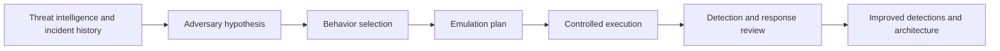

# Adversary Emulation

> **Adversary emulation is the practice of designing an exercise around how a specific threat actor, intrusion set, or threat pattern is believed to operate.** The goal is not to imitate every headline detail, but to safely reproduce the behaviors that matter most for validating defenses.

---

## Table of Contents

1. [What Adversary Emulation Means](#1-what-adversary-emulation-means)
2. [Why Fidelity Matters](#2-why-fidelity-matters)
3. [Choosing the Right Adversary Model](#3-choosing-the-right-adversary-model)
4. [Building an Emulation Plan](#4-building-an-emulation-plan)
5. [Operator and Defender Viewpoints](#5-operator-and-defender-viewpoints)
6. [Evidence, Measurement, and Safety](#6-evidence-measurement-and-safety)
7. [Common Pitfalls](#7-common-pitfalls)

---

## 1. What Adversary Emulation Means

> **Difficulty:** Beginner -> Advanced | **Category:** Red Teaming - Fundamentals

At a beginner level, adversary emulation means:

- selecting a realistic attacker type
- studying how that attacker tends to operate
- translating those behaviors into a safe and measurable exercise

The key point is that emulation is about **behavior**, not branding.

A weak approach says:

> "Let's copy a famous threat group because people know the name."

A stronger approach says:

> "This organization is realistically threatened by financially motivated identity abuse and cloud control-plane misuse, so we will emulate those behavior patterns."

### Emulation vs generic simulation

| Model | What It Focuses On |
|---|---|
| Generic attack simulation | Testing whether a behavior can be detected or blocked |
| Adversary emulation | Testing a realistic cluster of behaviors tied to a threat hypothesis |
| Full red team campaign | Evaluating end-to-end resilience across a broader objective |

Adversary emulation can be part of a red team campaign, but not every red team is a pure actor emulation exercise.

---

## 2. Why Fidelity Matters

The biggest value of emulation is that it prevents unrealistic testing.

A team that uses random, disconnected techniques may technically "test security," but the results can be misleading if the chosen behaviors do not match the organization's real threat picture.

### Fidelity dimensions

| Fidelity Dimension | Low Fidelity | Higher Fidelity |
|---|---|---|
| Objective | Generic compromise | Business-relevant target tied to likely adversaries |
| Access path | Arbitrary | Plausible entry path based on real environment and threat model |
| Technique selection | Random or tool-driven | Selected from observed or strongly inferred threat behavior |
| Timing and pacing | Artificially compressed | Closer to realistic dwell time and decision points |
| Operator choices | Rigid script | Adaptation within the adversary model |
| Reporting | "We ran techniques" | "We validated whether this threat pattern would succeed here" |

Fidelity matters because defenses are often strong against noisy, generic testing but weaker against the behaviors that actually show up in real incidents.

---

## 3. Choosing the Right Adversary Model

Good emulation starts with the question:

> "Who is most likely to target this organization, and what do they care about?"

| Adversary Pattern | Common Priorities | Typical Environmental Relevance |
|---|---|---|
| Financially motivated intrusion | Identity abuse, payment systems, extortion leverage | Enterprise IAM, cloud admin paths, business-critical apps |
| Espionage-oriented intrusion | Long dwell time, quiet collection, access to strategic information | R&D, executive communications, regulated data |
| Insider misuse | Legitimate access abuse, policy bypass, hidden data access | SaaS, file collaboration, privileged workflows |
| Supply-chain focused intrusion | Trusted relationships, build systems, third-party dependencies | CI/CD, developer tooling, vendor trust |

### Practical selection inputs

Teams usually combine several inputs:

- public threat reporting
- sector-specific advisories
- internal incident history
- architecture realities such as cloud footprint and remote access patterns
- crown-jewel analysis and likely business impact

The best emulation target is often **the most relevant attacker behavior**, not the most famous one.

---

## 4. Building an Emulation Plan

A professional emulation plan turns threat intelligence into a controlled exercise.

### Core plan components

| Component | What It Should Answer |
|---|---|
| Objective | What business-relevant condition are we trying to validate? |
| Hypothesis | Why do we believe this adversary pattern matters here? |
| Prerequisites | What conditions must exist for the exercise to be realistic? |
| Behaviors | Which tactics and techniques are in scope for the test? |
| Safety limits | What data, systems, or actions are off-limits? |
| Evidence plan | What proof will show success, failure, or control effectiveness? |
| Defender validation | What detections, alerts, or workflows should be observed? |
| Exit criteria | When do we stop, pause, or hand off to defenders? |

### What operators look for

Operators usually refine the plan around these questions:

- Which techniques are realistic in this environment?
- Which steps require too many assumptions to be credible?
- What proof can demonstrate risk without causing impact?
- Which defender artifacts are expected if telemetry is working?
- Where should the team pause to allow response observation?

### What not to do

Emulation should not become:

- a rigid checklist with no environmental judgment
- unsafe replay of destructive real-world behavior
- copy-paste actor theater disconnected from business value

---

## 5. Operator and Defender Viewpoints

### Operator viewpoint

For operators, the hard part is usually not choosing techniques. It is choosing the right **set of constraints**.

Important operator concerns include:

- credibility of the scenario
- scope and deconfliction
- realistic attacker decision points
- evidence quality
- avoiding accidental harm while still proving the path

### Defender viewpoint

For defenders, emulation is valuable because it turns threat reporting into something testable.

Important defender concerns include:

- whether telemetry exists for the selected behavior family
- whether alerts appear early enough to matter
- whether analysts recognize the pattern as part of a larger intrusion story
- whether response playbooks match the real architecture and identities involved

### Observable-focused thinking

| Exercise Element | Operator Question | Defender Question |
|---|---|---|
| Access behavior | Is this how the modeled threat would plausibly begin? | Would our front-door controls and monitoring notice this? |
| Identity use | Does the path rely on believable roles or trust paths? | Can we detect risky sign-in or privilege behavior? |
| Internal discovery | Is the activity necessary for the objective? | Do we have enough telemetry to distinguish admin work from adversary discovery? |
| Objective proof | Can we demonstrate impact safely? | Would defenders recognize this as a priority event? |

---

## 6. Evidence, Measurement, and Safety

Safe emulation is built around proof, not spectacle.

Good measurement often includes:

- whether the hypothesized path was realistic
- whether the selected behaviors were observable
- time to detect and time to escalate
- whether control failures were architectural, procedural, or tuning-related
- whether a replay exercise after remediation shows improvement

### Safety principles

- Use explicit rules of engagement.
- Prefer non-destructive proof over operational impact.
- Predefine stop conditions and pause criteria.
- Protect production data and customer workflows.
- Coordinate with a white team or engagement owner when risk changes.

The central discipline is to prove risk **without becoming the incident**.

---

## 7. Common Pitfalls

### Confusing actor names with useful scenarios

Famous actor branding does not automatically improve realism.

### Overfitting to public reporting

Public reports show only part of an adversary's behavior. Emulation requires informed judgment, not blind imitation.

### Ignoring the environment

A high-fidelity actor profile is useless if the chosen behaviors do not match the client's architecture, identity model, or business processes.

### Treating tools as the same thing as behavior

Tools change. Behavior patterns and objectives are usually more important.

### Forgetting defender validation goals

An emulation plan should always answer what defenders are expected to see, test, or improve.

The best one-line summary is:

> **Adversary emulation is the disciplined translation of threat intelligence into a safe exercise that helps an organization validate whether realistic attacker behavior would actually work here.**

---

> **Defender mindset:** Use adversary emulation to turn threat intelligence into measurable defense validation. Keep the focus on realistic behavior, clear guardrails, and evidence-driven learning rather than imitation for its own sake.
