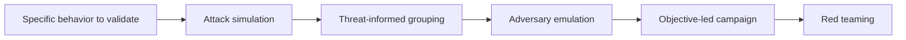

# Attack Simulation

> **Attack simulation is the controlled reproduction of selected attacker behaviors so an organization can validate prevention, detection, and response.** The point is not to cause impact. The point is to create safe evidence about how security controls perform under conditions that resemble real attack activity.

---

## Table of Contents

1. [What Attack Simulation Means](#1-what-attack-simulation-means)
2. [Simulation vs Emulation vs Broader Red Teaming](#2-simulation-vs-emulation-vs-broader-red-teaming)
3. [How a Safe Simulation Is Designed](#3-how-a-safe-simulation-is-designed)
4. [What Operators and Defenders Validate](#4-what-operators-and-defenders-validate)
5. [Measurement and Evidence](#5-measurement-and-evidence)
6. [Where Simulation Fits in a Security Program](#6-where-simulation-fits-in-a-security-program)
7. [Common Pitfalls](#7-common-pitfalls)

---

## 1. What Attack Simulation Means

> **Difficulty:** Beginner -> Advanced | **Category:** Red Teaming - Fundamentals

Attack simulation is one of the most misunderstood ideas in offensive security.

Beginners often hear the phrase and think it means "run attack steps." A more accurate definition is:

> **Select a behavior worth testing, reproduce it safely, observe what the organization sees, and measure whether the intended defenses work.**

This means a simulation can be narrow or broad.

It may focus on:

- a single risky behavior
- a specific control gap hypothesis
- a short scenario around one business workflow
- a larger path that feeds into a red or purple team exercise

The simulation is useful because it converts assumptions into measurable outcomes.

---

## 2. Simulation vs Emulation vs Broader Red Teaming

| Model | Main Goal | Typical Shape |
|---|---|---|
| Attack simulation | Validate whether selected behaviors trigger expected controls | Narrow, controlled, repeatable |
| Adversary emulation | Test a realistic cluster of behaviors based on a threat pattern | Threat-informed and higher fidelity |
| Red team engagement | Test whether a meaningful objective can be achieved against the organization | Broader, objective-led, multi-phase |

### A simple relationship

- **Simulation** is often the most focused.
- **Emulation** adds a stronger threat-intelligence layer.
- **Red teaming** adds broader objectives, campaign logic, and resilience measurement.

These are overlapping models, not rigid boxes.

---

## 3. How a Safe Simulation Is Designed

The quality of a simulation comes from preparation.

| Design Element | Key Question |
|---|---|
| Objective | What exactly are we trying to validate? |
| Scope | Which systems, identities, or workflows are in play? |
| Safety controls | What actions are prohibited, monitored, or gated? |
| Telemetry plan | Which logs, alerts, and data sources should be reviewed? |
| Evidence plan | What outcome will prove success or failure safely? |
| Exit criteria | When do we stop, pause, or escalate? |

### Safe design principles

1. **Test behaviors, not destruction.**
   - Validation should usually stop at proof of reachability or control failure.
2. **Use pre-approved safety boundaries.**
   - Especially around production data, customer workflows, and critical infrastructure.
3. **Define observables first.**
   - If nobody knows what should be visible, the simulation may generate noise without learning.
4. **Keep the scenario realistic.**
   - Synthetic tests still need plausible conditions and believable operator decisions.
5. **Plan the replay.**
   - A simulation becomes much more valuable when the same behavior can be repeated after controls are tuned.

---

## 4. What Operators and Defenders Validate

### Operator viewpoint

Operators typically ask:

- Is the selected behavior worth testing in this environment?
- What prerequisites make the scenario realistic?
- What proof is enough to show the control gap safely?
- How much timing or sequencing realism matters for this case?
- Which conditions would make the test misleading or noisy?

### Defender viewpoint

Defenders typically ask:

- Did the right telemetry fire?
- Were the alerts high confidence or too weak to trust?
- Did analysts understand the likely impact of the behavior?
- Could the incident be investigated fast enough to matter?
- Did response procedures fit the actual systems and identities involved?

### Joint validation view

| Focus Area | What Operators Validate | What Defenders Validate |
|---|---|---|
| Identity behavior | Whether the scenario is realistic and bounded | Whether sign-in, privilege, or role changes are visible and explainable |
| Endpoint behavior | Whether the proof method is safe and sufficient | Whether telemetry and triage logic distinguish risky behavior from admin noise |
| Internal movement | Whether the path is plausible | Whether segmentation and investigation workflows surface the movement early |
| Objective proof | Whether business impact can be demonstrated without harm | Whether defenders would recognize the action as urgent |

---

## 5. Measurement and Evidence

Attack simulation becomes valuable when it produces evidence that can drive change.

Common measurements include:

- **coverage:** did the expected data source or control activate?
- **quality:** was the signal meaningful enough to guide an analyst?
- **speed:** how long did it take to detect, triage, and escalate?
- **accuracy:** did responders understand the behavior correctly?
- **repeatability:** after changes, can the same test confirm improvement?

### Useful evidence types

- timestamps and timelines
- alert snapshots
- log excerpts
- analyst notes or escalation records
- screenshots of containment or response actions
- mapping of control intent versus actual outcome

Good simulation reporting often answers both:

- what happened technically
- what happened operationally

That second part is where a lot of the learning lives.

---

## 6. Where Simulation Fits in a Security Program

Attack simulation is often the bridge between theory and full-scale exercise.

It is particularly useful for:

- validating new detections
- testing changes after incidents
- proving that newly deployed controls work as expected
- preparing for larger red or purple team engagements
- teaching defenders what a behavior looks like in their own environment

A mature program often uses simulations as building blocks. Small, repeatable tests sharpen telemetry and workflows so that larger exercises produce deeper lessons instead of basic surprises.

---

## 7. Common Pitfalls

### Testing behavior with no defender hypothesis

If you do not know what should be seen, you are not validating much.

### Confusing realism with danger

Realism is about credible behavior and environment fit, not destructive or uncontrolled action.

### Making simulations too broad

The wider the scenario, the harder it becomes to isolate whether a control succeeded, failed, or simply never had a chance.

### Failing to replay after improvement

The learning loop is incomplete until tuned controls are retested.

### Reporting only the technical action

A good simulation report also explains what the defenders saw, how they interpreted it, and how to improve the next cycle.

The best summary is:

> **Attack simulation is controlled security validation: choose the right behavior, execute it safely, observe the organization's response, and turn the results into measurable improvement.**

---

> **Defender mindset:** Use simulations to validate specific assumptions about telemetry, detections, and response. Keep them scoped, repeatable, and focused on evidence rather than impact.
