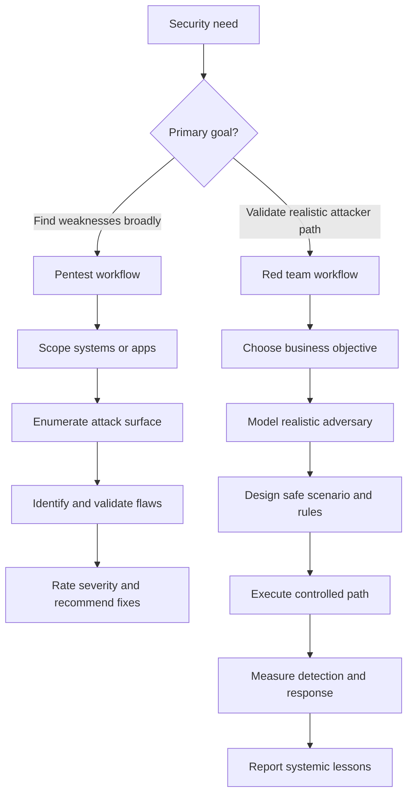

# Red Team vs Pentesting

> **Pentesting and red teaming both belong to offensive security, but they answer different questions.** Pentesting is usually about finding and validating weaknesses across a defined scope. Red teaming is about whether a realistic adversary could achieve a meaningful objective against the organization as a whole.

---

## Table of Contents

1. [Two Different Security Questions](#1-two-different-security-questions)
2. [Side-by-Side Comparison](#2-side-by-side-comparison)
3. [How the Workflows Differ](#3-how-the-workflows-differ)
4. [A Realistic Example](#4-a-realistic-example)
5. [When to Choose Each](#5-when-to-choose-each)
6. [How Good Programs Use Both](#6-how-good-programs-use-both)
7. [Common Pitfalls](#7-common-pitfalls)

---

## 1. Two Different Security Questions

> **Difficulty:** Beginner -> Advanced | **Category:** Red Teaming - Fundamentals

A simple way to separate the two is to look at the primary question being asked.

| Practice | Primary Question |
|---|---|
| Pentesting | Where are the exploitable weaknesses in this scope? |
| Red teaming | Can a realistic adversary reach a specific objective before the organization detects and stops them? |

Both are useful. Both are legitimate. But they are not interchangeable.

A pentest often optimizes for:

- coverage of applications, hosts, APIs, or networks
- breadth of issue discovery
- technical validation of exploitability
- actionable remediation guidance for identified weaknesses

A red team usually optimizes for:

- realism of the chosen attack path
- relevance to threat intelligence and business risk
- evaluation of monitoring and response
- proof of systemic control gaps, not just isolated defects

---

## 2. Side-by-Side Comparison

| Dimension | Pentesting | Red Teaming |
|---|---|---|
| Main driver | Find and validate weaknesses | Validate resilience against realistic adversary behavior |
| Scope style | Broad and asset-focused | Narrower, objective-focused, path-based |
| Success metric | Quality and severity of findings | Ability to reach objective and measure detection/response |
| Stealth | Usually not essential | Often important, but only when it fits the scenario |
| Threat intelligence | Helpful, but optional | Usually central to scenario design |
| Reporting | Vulnerability-centric with proof and remediation | Attack narrative, control gap analysis, and detection lessons |
| Audience | Engineering, app owners, infrastructure teams | Security leadership, SOC, IR, engineering, executives |
| Time horizon | Often days to a few weeks | Often multi-phase and longer-running |
| Findings style | Many discrete issues | Fewer, deeper systemic observations |
| Blue team involvement | Sometimes limited | Usually an important measurement target |
| Business context | Sometimes secondary | Usually primary |
| Typical question from client | "What is broken here?" | "Could this kind of adversary hurt us in a meaningful way?" |

### What this means in practice

A pentester may spend time proving multiple ways to exploit an application stack. A red team may intentionally ignore many lower-value weaknesses if they do not help answer the engagement objective.

That does **not** make one "better" than the other. It means each has a different job.

---

## 3. How the Workflows Differ

### Pentest workflow characteristics

Pentests usually emphasize:

- enumeration depth
- exploit validation
- coverage across the scoped environment
- reproducible remediation guidance

### Red team workflow characteristics

Red team engagements usually emphasize:

- objective selection
- threat realism
- campaign pacing and operator discipline
- detection and response measurement
- evidence for attack-path-level conclusions

---

## 4. A Realistic Example

Imagine the organization has a public customer portal and a separate finance environment.

### If the client asks for a pentest

The team may:

- enumerate the application thoroughly
- test authentication, session handling, authorization, and input handling
- validate exploitable flaws
- produce findings for developers and platform owners

The end result is something like:

> "Here are the exploitable weaknesses in the portal, how serious they are, and how to fix them."

### If the client asks for a red team

The team may instead ask:

- Could an external adversary use realistic access paths to reach finance reporting workflows?
- Would identity controls, segmentation, EDR, or SOC monitoring stop them?
- What would defenders see, and how quickly would they understand the threat?

The end result becomes:

> "A realistic attacker could move from external exposure to a high-value internal objective because identity validation, service-account governance, and detection of risky admin behavior were insufficient."

Same organization. Different question. Different engagement.

---

## 5. When to Choose Each

| Situation | Better First Choice | Why |
|---|---|---|
| New application release | Pentest | You need focused defect discovery before production risk grows |
| Major external attack surface review | Pentest | Coverage matters more than stealth or long-path realism |
| Validate phishing-to-data-access scenario | Red team | You need people, process, and detection measured across the path |
| Test SOC readiness for targeted intrusion | Red team | The monitoring and response workflow is part of the exercise |
| Baseline security posture is still immature | Pentest | The organization often needs breadth of issues first |
| Mature environment with strong baseline testing | Red team | Higher-value questions now concern resilience and attacker cost |

### A practical rule

If the client mostly needs to know **what is broken**, start with pentesting.

If the client mostly needs to know **whether a realistic adversary can achieve a defined outcome**, red teaming is usually the better fit.

---

## 6. How Good Programs Use Both

The strongest security programs do not force a false choice. They use pentesting and red teaming at different layers.

| Program Layer | Best Fit |
|---|---|
| Secure development and release validation | Pentesting |
| Periodic infrastructure or cloud review | Pentesting |
| High-value attack-path validation | Red teaming |
| Detection improvement after a red team | Purple teaming |
| Retesting after major fixes | Either, depending on the goal |

A common healthy sequence looks like this:

1. pentests find and reduce obvious weaknesses
2. engineering teams remediate and harden
3. red team validates whether meaningful attack paths still remain
4. purple team exercises tune detections and response
5. follow-up tests confirm improvement

This sequence raises attacker cost far more effectively than treating every offensive assessment as the same kind of project.

---

## 7. Common Pitfalls

### Calling every offensive test a red team

This is one of the most common mistakes in security programs. A stealthy pentest is still not automatically a red team.

### Expecting red teams to maximize finding counts

Red teams often ignore low-value issues if those issues do not contribute to the objective or the learning outcome.

### Running red teams before basics exist

If logging, ownership, or inventory are weak, a red team may reveal that the foundation is missing, but broad pentesting and hygiene work may still provide better first returns.

### Judging success by drama

The most valuable result is not "the coolest compromise." It is a defensible explanation of how an attacker path works, where defenders succeeded, and what should change next.

### Forgetting the defender audience

Pentest reports mostly help fix systems. Red team reports must also help the SOC, responders, and leadership understand systemic risk.

The cleanest summary is this:

> **Pentesting improves security by exposing weaknesses. Red teaming improves security by testing whether those weaknesses, controls, and response processes combine into real attacker opportunity.**

---

> **Defender mindset:** Choose the assessment type that matches the question you need answered. Keep pentests broad and remediation-focused, and keep red teams objective-led, threat-informed, and safely authorized.
