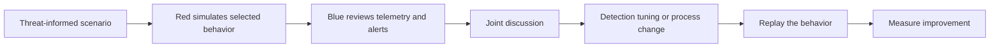

# Red Team vs Purple Team

> **Red teaming and purple teaming are related, but they are not the same exercise.** Red teaming emphasizes realistic adversary behavior and independent validation. Purple teaming emphasizes collaboration between offensive and defensive teams to improve detection and response faster.

---

## Table of Contents

1. [The Three Team Colors in Context](#1-the-three-team-colors-in-context)
2. [Red Team vs Purple Team](#2-red-team-vs-purple-team)
3. [How Purple Teaming Actually Works](#3-how-purple-teaming-actually-works)
4. [A Practical Engagement Example](#4-a-practical-engagement-example)
5. [When to Choose Each Model](#5-when-to-choose-each-model)
6. [Metrics and Outcomes](#6-metrics-and-outcomes)
7. [Common Pitfalls](#7-common-pitfalls)

---

## 1. The Three Team Colors in Context

> **Difficulty:** Beginner -> Advanced | **Category:** Red Teaming - Fundamentals

Before comparing red and purple, it helps to place them in the larger picture.

| Team | Primary Role |
|---|---|
| Red team | Simulate realistic adversary behavior in a controlled way |
| Blue team | Detect, investigate, contain, and recover |
| Purple team | Create a structured feedback loop between offense and defense |

Purple is not a third team that replaces red or blue. It is usually **a collaborative operating model** that helps both sides improve together.

---

## 2. Red Team vs Purple Team

| Dimension | Red Team | Purple Team |
|---|---|---|
| Main goal | Validate resilience against realistic attack paths | Improve detections, visibility, and response through collaboration |
| Independence | Often higher | Intentionally lower |
| Blue team awareness | May be limited or delayed | Usually aware and actively involved |
| Pace | Can be slower and more campaign-like | Usually faster, iterative, and highly interactive |
| Reporting style | Narrative, systemic lessons, business impact | Detection tuning, validation results, operational fixes |
| Best use case | Objective-led assessment of real readiness | Fast feedback on specific behaviors or detection gaps |
| Strength | Realistic measurement | Rapid improvement |
| Tradeoff | Slower remediation cycle | Less independence and less realism |

### The simplest distinction

- **Red team:** "Can a realistic adversary do this to us?"
- **Purple team:** "If that behavior happened, would we see it, understand it, and improve our controls quickly?"

Neither model is superior in all situations. Each is designed for a different learning outcome.

---

## 3. How Purple Teaming Actually Works

Purple teaming works best when the exercise is structured, scoped, and tied to specific detection or response goals.

### A typical purple-team loop

1. Choose a behavior or attack path to validate.
2. Agree on scope, evidence, and safety controls.
3. Red executes the behavior in a controlled way.
4. Blue reviews what was visible, invisible, noisy, or misleading.
5. Teams tune detections, telemetry, and runbooks.
6. The behavior is replayed to confirm improvement.

### What makes purple teaming effective

Purple teaming is not just "watching the red team in real time." It works when:

- the tested behaviors are realistic and relevant
- the telemetry needed for validation is captured
- alert quality matters more than alert volume
- both sides are honest about uncertainty and blind spots
- fixes are replayed and measured, not just discussed

---

## 4. A Practical Engagement Example

Imagine an organization wants to validate detection of risky identity behavior around privileged cloud roles.

### As a red team engagement

The scenario may focus on:

- whether a realistic adversary could chain identity weaknesses together
- whether those actions are detected in time
- whether incident responders understand the full impact

The blue team might be unaware during execution, or only partially aware.

### As a purple team exercise

The same scenario may focus on:

- which logs are present or missing
- whether alerts need better thresholds or enrichment
- whether analysts know how to investigate the behavior
- whether response runbooks match the actual environment

The learning cycle is shorter, more transparent, and more collaborative.

### What operators look for

- Is the scenario precise enough to produce useful telemetry?
- Are the selected behaviors safe and measurable?
- Can the same action be replayed cleanly after tuning?

### What defenders look for

- Which data source noticed the behavior first?
- Were the alerts understandable and actionable?
- What context was missing for fast triage?
- What change would most reduce future analyst uncertainty?

---

## 5. When to Choose Each Model

| Need | Better Fit |
|---|---|
| Validate realistic end-to-end readiness | Red team |
| Improve detections quickly around known behaviors | Purple team |
| Test executive escalation and incident coordination | Red team |
| Tune SIEM/EDR rules and investigation playbooks | Purple team |
| Prove control effectiveness to leadership | Red team |
| Build blue team capability around specific TTPs | Purple team |

### A mature program usually uses both

One common sequence is:

- red team identifies important control and response gaps
- purple team exercises replay high-value parts of that path
- tuned detections and workflows are validated again later

That combination gives both realism and speed.

---

## 6. Metrics and Outcomes

| Outcome Type | Red Team | Purple Team |
|---|---|---|
| Time to detect | Important measurement | Important and often repeatedly tested |
| Time to contain | Important measurement | Often rehearsed and improved directly |
| Alert quality | Observed as part of realism | Central measurement target |
| Root-cause insight | High-value report output | Frequently discussed live |
| Remediation speed | Usually follows the report | Usually accelerated by collaboration |
| Confidence in detections | Measured indirectly | Measured directly through replay |

Good purple team output often includes:

- validated detections
- improved queries or alert logic
- better investigation steps
- clarified telemetry requirements
- updated playbooks and ownership

Good red team output often includes:

- a credible attack narrative
- explanation of which barriers mattered or failed
- systemic control findings
- prioritization tied to realistic attacker value

---

## 7. Common Pitfalls

### Treating purple teaming as a watered-down red team

Purple teaming is not lesser. It is simply optimized for a different kind of learning.

### Treating collaboration as the same thing as realism

Purple exercises improve quickly, but they do not measure true independence the same way a realistic blind or semi-blind red team can.

### Running red teams with no follow-up improvement cycle

If a red team ends with a report and no replay or tuning, much of the operational value is lost.

### Turning purple sessions into ego contests

The best purple environments are low-ego, evidence-driven, and deeply practical.

### Testing too many behaviors at once

Whether red or purple, overloading a single exercise reduces the quality of learning. Focused scenarios produce better outcomes.

The cleanest summary is:

> **Red teaming measures realistic resilience. Purple teaming accelerates improvement. Mature security teams use both intentionally.**

---

> **Defender mindset:** Use red teams when you need realistic system-level validation, and use purple teams when you need rapid, collaborative detection and response improvement. Keep both authorized, controlled, and measurable.
