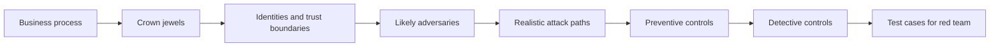

# Threat Modeling

> **Threat modeling is the structured process of asking what matters, who might target it, how they could realistically reach it, and which controls are supposed to stop them.** In red teaming, threat modeling is what keeps an exercise relevant to the business instead of drifting into generic attacker behavior.

---

## Table of Contents

1. [What Threat Modeling Is](#1-what-threat-modeling-is)
2. [The Core Questions](#2-the-core-questions)
3. [Building Blocks of a Useful Threat Model](#3-building-blocks-of-a-useful-threat-model)
4. [Common Approaches](#4-common-approaches)
5. [How Red Teams Use Threat Models](#5-how-red-teams-use-threat-models)
6. [A Practical Example](#6-a-practical-example)
7. [What Defenders Gain](#7-what-defenders-gain)
8. [Common Pitfalls](#8-common-pitfalls)

---

## 1. What Threat Modeling Is

> **Difficulty:** Beginner -> Advanced | **Category:** Red Teaming - Fundamentals

At its simplest, threat modeling is a form of risk thinking.

It asks questions such as:

- What assets matter most?
- What trust boundaries exist?
- Which identities, systems, and workflows are privileged or sensitive?
- Which attacker types are most relevant?
- What paths are realistic given the environment?
- Where would defenders expect to see suspicious activity?

In other words, threat modeling prevents a red team from chasing whatever is merely possible and forces it to focus on what is **plausible and meaningful**.

### Why this matters in red teaming

Without threat modeling, a red team can easily produce an impressive but low-value result. For example, reaching a low-importance system through an improbable path may look technically clever but teach very little about the organization's true risk.

---

## 2. The Core Questions

A useful threat model usually answers four fundamental questions.

| Question | Why It Matters |
|---|---|
| What are we trying to protect? | Defines crown jewels, critical workflows, sensitive data, and privileged control points |
| Who are we worried about? | Shapes realism by choosing likely attacker types and motives |
| How could they get there? | Produces realistic access paths, abuse paths, and trust-boundary crossings |
| What should stop or reveal them? | Identifies preventive and detective controls that should be validated |

### Beginner-friendly version

If you are new to threat modeling, think of it as building an answer to this sentence:

> "A likely attacker would try to move from **this entry point** to **this important asset** by abusing **these trust relationships**, and we expect **these controls** to stop or expose them."

That sentence alone is often enough to shape a strong red team scenario.

---

## 3. Building Blocks of a Useful Threat Model

### Core building blocks

| Building Block | Questions to Ask |
|---|---|
| Crown jewels | Which data, platforms, or workflows would materially hurt the organization if abused? |
| Identities | Which users, service accounts, and privileged roles can influence those assets? |
| Trust boundaries | Where does trust shift between users, networks, apps, tenants, or third parties? |
| Entry points | Which realistic starting points exist: internet-facing apps, identity flows, vendor access, email, endpoints? |
| Defenses | Which preventive and detective controls should stop, slow, or expose abuse? |
| Assumptions | Which beliefs about architecture, ownership, logging, and user behavior might be wrong? |

### What operators look for

Operators often focus on:

- administrative relationships that create high-value pivot paths
- shared credentials, privileged automation, or weak separation of duties
- cloud or SaaS configurations that quietly expand trust
- external-facing services that feed into identity or business workflows
- data repositories that matter more than the hosts that store them

---

## 4. Common Approaches

Different organizations use different threat-modeling methods. In practice, red teams often borrow from several at once.

| Approach | Best For | Red Teaming Value |
|---|---|---|
| STRIDE-style design analysis | Application and service design reviews | Good for understanding trust boundaries and misuse paths |
| ATT&CK-informed modeling | Enterprise and cloud attack behavior | Good for mapping realistic attacker techniques to likely objectives |
| Attack trees or attack paths | Complex multi-step environments | Good for showing alternative routes to the same objective |
| Crown-jewel analysis | Business-driven exercises | Good for keeping scenarios tied to what leadership actually cares about |
| Abuse-case modeling | Human workflow and process failure | Good for testing approval, identity, and third-party weaknesses |

The important point is not which label you use. It is whether the output helps you decide **what to test and why**.

---

## 5. How Red Teams Use Threat Models

A red team threat model is usually converted into a small set of hypotheses.

Example hypotheses might look like:

- a realistic external actor could reach a high-value internal workflow through identity-centric paths
- third-party trust creates a lower-cost path than direct exploitation
- the organization can prevent access, but not detect early discovery or privilege staging around the target area

### Turning the model into a test plan

| Threat Model Output | Red Team Translation |
|---|---|
| Crown jewel identified | Define the engagement objective |
| Likely adversary selected | Choose appropriate behaviors and pacing |
| Entry points mapped | Select initial conditions for the scenario |
| Trust paths identified | Choose likely privilege or access transitions |
| Expected controls listed | Define what detections and barriers should be validated |

A good threat model narrows the exercise. It tells the team what **not** to waste time on.

---

## 6. A Practical Example

Imagine a company whose most important risk is unauthorized access to sensitive customer records stored behind an internal business application.

### Threat-model view

- **Crown jewel:** customer records and the workflow that allows export or bulk access
- **Likely adversary:** financially motivated intrusion with strong identity abuse capability
- **Likely entry points:** remote access identity flows, exposed support tooling, third-party integrations
- **Key trust boundaries:** help-desk approval processes, cloud admin roles, internal application permissions
- **Expected controls:** MFA, role separation, EDR, application logging, privileged-access review, SOC alerting

### Red-team use of that model

The red team now has a realistic question:

> Could a motivated attacker move through those identity and workflow paths without being detected early enough to stop them?

That is a much better exercise than testing random internal systems with no business context.

---

## 7. What Defenders Gain

Threat modeling is just as valuable to defenders as it is to operators.

Defenders gain:

- clarity about which assets and workflows matter most
- better prioritization for telemetry and detections
- more realistic incident response scenarios
- better understanding of how trust relationships create attacker opportunity
- stronger justification for architectural changes or control investments

### Defender-oriented questions

| Defender Question | Why It Helps |
|---|---|
| Which events would be the earliest reliable indicators on this path? | Improves early detection engineering |
| Which step depends on human process rather than technology? | Reveals approval and escalation weaknesses |
| Which logs matter most but are missing today? | Prioritizes telemetry investment |
| Which assumptions would break our current runbooks? | Improves preparedness and investigation quality |

---

## 8. Common Pitfalls

### Modeling only technical assets

Many critical attack paths pass through people, approval processes, vendors, or identity workflows rather than a single vulnerable host.

### Treating every possible path as equally important

Threat modeling is about prioritization. If everything matters equally, the model is not helping.

### Forgetting defender visibility

A model that only shows how an attacker might move, but not what the organization should see, misses half the value.

### Being too abstract

Vague statements such as "attacker compromises internal network" are not helpful. Useful models identify specific assets, boundaries, roles, and control expectations.

### Never revisiting the model

Threat models decay as architecture, vendors, business processes, and attacker behavior change.

The best summary is:

> **Threat modeling turns business risk, architecture, and likely attacker behavior into concrete security questions that red teams and defenders can both test.**

---

> **Defender mindset:** Build threat models to focus scarce effort on the paths that matter most. Keep them practical, tied to real assets and trust boundaries, and useful for both red team planning and defensive validation.
