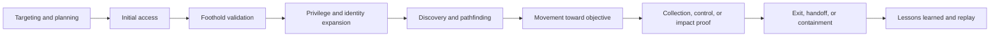

# Attack Lifecycle

> **An attack lifecycle is a practical model for how an intrusion evolves over time: before access, during access, while expanding control, while pursuing objectives, and during defender response.** It is broader and more adaptive than a simple stage list because real operations branch, pause, loop, and change based on what the attacker learns.

---

## Table of Contents

1. [Why Attack Lifecycle Thinking Matters](#1-why-attack-lifecycle-thinking-matters)
2. [A Modern Attack Lifecycle](#2-a-modern-attack-lifecycle)
3. [Tempo, Dwell Time, and Decision Points](#3-tempo-dwell-time-and-decision-points)
4. [Operator Viewpoint](#4-operator-viewpoint)
5. [Defender Viewpoint](#5-defender-viewpoint)
6. [Measurement and Reporting](#6-measurement-and-reporting)
7. [Common Pitfalls](#7-common-pitfalls)

---

## 1. Why Attack Lifecycle Thinking Matters

> **Difficulty:** Beginner -> Advanced | **Category:** Red Teaming - Adversary Methodology

Lifecycle thinking helps teams move beyond isolated techniques.

Instead of asking only:

- What did the attacker do?

it asks:

- Why did they do it at that moment?
- What had to happen first?
- What options did they have next?
- What should defenders have seen during the transition?

This matters because real intrusions are usually adaptive. Attackers change pace, switch tactics, abandon noisy paths, and adjust to the environment. A lifecycle model helps red teams and defenders reason about those transitions.

---

## 2. A Modern Attack Lifecycle

### A practical phase model

| Lifecycle Phase | What It Means | Why It Matters |
|---|---|---|
| Targeting and planning | Choosing the scenario, objective, and assumptions | Shapes realism before execution begins |
| Initial access | Establishing the first meaningful point of entry | Tests front-door controls and exposure management |
| Foothold validation | Confirming the access is usable and worth expanding | Prevents false confidence and focuses effort |
| Privilege and identity expansion | Seeking stronger permissions, roles, or trust relationships | Often where identity controls make or break the path |
| Discovery and pathfinding | Learning how the environment is organized | Reveals whether defenders notice reconnaissance after entry |
| Movement toward objective | Crossing the trust boundaries required to reach the target asset or workflow | Tests segmentation, least privilege, and monitoring |
| Collection, control, or impact proof | Safely demonstrating objective reachability | Converts technical activity into business-relevant evidence |
| Exit, handoff, or containment | Stopping, deconflicting, or observing the response | Protects safety and improves reporting quality |

Notice that this model is less rigid than older stage-chain descriptions. It leaves room for identity-first, SaaS-first, and cloud-native intrusion paths.

---

## 3. Tempo, Dwell Time, and Decision Points

One of the most important differences between a lifecycle and a static checklist is that a lifecycle includes **time**.

### Tempo

Attackers do not always move at the same speed. They may:

- move quickly to exploit a short-lived opportunity
- move slowly to reduce noise and blend into normal workflows
- pause to study how defenders react
- abandon one path and return later through another

### Dwell time

Dwell time is not automatically a sign of sophistication. Sometimes attackers stay longer because they are cautious. Sometimes they stay longer because the environment is confusing. Sometimes they move fast because controls are weak.

### Key decision points

| Decision Point | Typical Operator Question | Typical Defender Opportunity |
|---|---|---|
| After initial access | Is this worth expanding or too risky/noisy? | Catch the earliest signs before the path deepens |
| Before privilege expansion | Is stronger access necessary for the objective? | Monitor unusual changes in role, token, or admin context |
| During discovery | Do we have enough environment knowledge to proceed? | Spot reconnaissance patterns that precede objective action |
| Before objective proof | What evidence is sufficient without causing impact? | Prioritize sensitive workflow monitoring and alert context |

Lifecycle thinking is powerful because it frames an intrusion as a series of judgments, not just actions.

---

## 4. Operator Viewpoint

For operators, attack lifecycle thinking helps answer:

- which phases matter most to the scenario
- what prerequisites make the path believable
- where to collect evidence
- when to stop because the learning goal has already been met
- how to sequence actions so the narrative reflects real adversary tradeoffs

### What operators look for in real engagements

- whether the path depends on realistic identities and trust relationships
- whether defender visibility changes as the path moves from edge to core systems
- whether success depends on a single flaw or on several weak controls interacting
- whether the objective can be proven safely before unnecessary expansion

Strong operators avoid turning a lifecycle model into a script. The model is there to support decisions, not replace them.

---

## 5. Defender Viewpoint

Defenders should read attack lifecycles as maps of **visibility and response opportunity**.

| Lifecycle Phase | Defender Questions |
|---|---|
| Initial access | Which control or data source should notice the first suspicious signal? |
| Foothold validation | Can we distinguish benign setup activity from attacker intent? |
| Privilege and identity expansion | Do we recognize when access becomes more dangerous, not just when it first appears? |
| Discovery and pathfinding | Are internal reconnaissance signals available and triageable? |
| Movement toward objective | Are sensitive systems and workflows monitored differently from generic assets? |
| Objective proof | Would we understand the business significance in time to act? |

The defender's challenge is not just generating alerts. It is building enough context to understand where in the lifecycle the adversary currently is.

---

## 6. Measurement and Reporting

Attack lifecycle reporting is stronger when it includes transitions, not just events.

Good reports often show:

- when the team entered each phase
- which assumption enabled the transition
- which controls were expected to stop or expose the move
- what defenders actually saw
- how the organization's understanding lagged, matched, or outpaced the operator path

### Useful lifecycle metrics

- time from first activity to first meaningful detection
- time from initial detection to confident incident classification
- time from classification to containment decision
- number of times the attacker had to adapt because controls worked
- number of phase transitions that happened with little or no defender awareness

These metrics tell a much more useful story than a raw count of individual alerts.

---

## 7. Common Pitfalls

### Treating the lifecycle like a fixed sequence

Real intrusions can loop back, branch, pause, or skip steps.

### Ignoring the importance of timing

A defender that eventually sees everything may still lose if the visibility arrives too late.

### Reporting actions without transitions

The most important lessons often live in how the attacker moved from one phase to the next.

### Focusing only on hosts

Many modern lifecycle transitions are identity-driven, workflow-driven, or cloud-control-driven rather than host-centric.

### Overextending the exercise

If the objective is already proven, pushing deeper may add risk without adding insight.

The best summary is:

> **Attack lifecycle thinking helps teams understand intrusions as evolving decision-driven operations, which makes both red-team planning and defensive response much more realistic.**

---

> **Defender mindset:** Read lifecycle models as visibility maps. Focus on early transitions, sensitive trust-boundary crossings, and the moments where good context could have changed the outcome.
