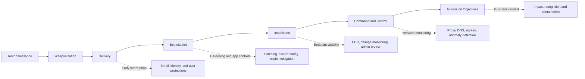

# Cyber Kill Chain

> **The Cyber Kill Chain is a stage-based model for understanding how intrusions progress from preparation to attacker objectives.** It is useful because it gives defenders interruption points and gives red teams a way to reason about sequence, dependency, and where visibility should exist.

---

## Table of Contents

1. [What the Chain Is](#1-what-the-chain-is)
2. [The Seven Stages](#2-the-seven-stages)
3. [How Red Teams Use It](#3-how-red-teams-use-it)
4. [What Defenders See at Each Stage](#4-what-defenders-see-at-each-stage)
5. [Chain Thinking vs Modern Environments](#5-chain-thinking-vs-modern-environments)
6. [Strengths and Limitations](#6-strengths-and-limitations)
7. [Common Pitfalls](#7-common-pitfalls)

---

## 1. What the Chain Is

> **Difficulty:** Beginner -> Advanced | **Category:** Red Teaming - Adversary Methodology

The Cyber Kill Chain, originally introduced by Lockheed Martin, breaks an intrusion into stages so analysts and defenders can understand where they might detect or disrupt an adversary.

The model is helpful for beginners because it answers a very practical question:

> "What must happen before an attacker reaches their objective, and where can we interrupt them first?"

The chain is not the only attack model, and it is not perfect for every environment. But it remains useful because it encourages sequence-based thinking instead of viewing incidents as isolated events.

---

## 2. The Seven Stages

| Stage | Simple Meaning | Typical Red-Team Interpretation | Typical Defender Opportunity |
|---|---|---|---|
| Reconnaissance | Learn about the target | Gather relevant, authorized intelligence about assets, identities, and workflows | Detect external interest patterns where possible; improve exposure management |
| Weaponization | Prepare the capability | Build or select safe simulation components, scenarios, and infrastructure | Harden content controls, sandboxing, and validation workflows |
| Delivery | Get the action to the target | Exercise the selected initial access path within scope | Email, web, identity, and user-facing controls can interrupt early |
| Exploitation | Trigger the intended effect | Validate whether the target condition can be achieved | Application hardening, patching, and behavioral analytics matter here |
| Installation | Establish durable presence or control | Safely demonstrate post-access capability without unsafe persistence | Endpoint monitoring, change control, and admin review can surface this |
| Command and Control | Maintain communication or control | Validate whether the exercise can coordinate follow-on steps | Network, DNS, proxy, and identity telemetry become important |
| Actions on Objectives | Reach the real goal | Safely prove access to sensitive workflows, data, or privileges | Defenders must recognize impact, not just technical artifacts |

The point of this model is not to insist every incident looks exactly like this. The point is to show that stopping earlier stages usually prevents later damage.

---

## 3. How Red Teams Use It

Red teams often use chain thinking to organize a scenario into dependencies.

Example questions include:

- What must be true before the initial access path is realistic?
- If early delivery is blocked, what does that say about control strength?
- Which follow-on stages are worth testing if defenders already stop the intrusion early?
- Where should the exercise pause to evaluate response?

### Why operators still find it useful

Even in modern cloud and identity-heavy environments, the chain helps operators think in terms of:

- sequencing
- prerequisites
- interruption points
- evidence collection at each stage
- business impact only after earlier conditions are met

It is especially useful in reporting because non-specialist stakeholders understand staged narratives more easily than scattered technical details.

---

## 4. What Defenders See at Each Stage

Good defenders do not wait for the final stage. They ask what should be visible at each phase.

| Stage | Defender Questions |
|---|---|
| Reconnaissance | Are we exposed in ways we do not understand? Are our external assets and identities discoverable beyond expectation? |
| Delivery | Which controls inspect, authenticate, or challenge the initial action? |
| Exploitation | Do we see suspicious execution or application behavior in time? |
| Installation | Would persistence-like or control-establishing activity trigger meaningful review? |
| Command and Control | Do we understand unusual communications, control patterns, or risky identity callbacks? |
| Actions on Objectives | Are sensitive workflows monitored closely enough to recognize high business impact? |

One of the most important lessons from the chain is this:

> **Early signals are often less dramatic but far more valuable.**

By the time defenders focus only on end-stage impact, they may have already missed the cheapest opportunities to stop the intrusion.

---

## 5. Chain Thinking vs Modern Environments

The classic model was shaped around more traditional intrusion patterns. Modern environments add complexity:

- cloud actions may replace classic malware-style stages
- identity abuse may reduce the need for some traditional exploitation steps
- SaaS and API workflows can blur boundaries between access, control, and objective completion
- insider or third-party misuse may not fit the original chain neatly

That does not make the model obsolete. It means teams should treat it as **a conceptual sequence model**, not a rigid law of cyber operations.

---

## 6. Strengths and Limitations

| Strength | Why It Helps |
|---|---|
| Clear stage logic | Easy to teach and report |
| Emphasis on interruption | Encourages earlier defensive action |
| Good executive narrative | Makes incidents and exercises easier to explain |
| Sequence thinking | Helps connect isolated events into one story |

| Limitation | Why It Matters |
|---|---|
| Can feel too linear | Modern intrusions often loop, branch, or skip stages |
| Less precise than ATT&CK | It describes phases better than detailed behavior |
| Traditional bias | Identity and SaaS-centric attacks do not always fit perfectly |
| Risk of oversimplification | Teams may miss the iterative nature of real campaigns |

Many mature teams use this chain for high-level narrative and ATT&CK for detailed behavior mapping.

---

## 7. Common Pitfalls

### Treating the model as exact reality

Real intrusions are messy. The model is meant to organize thinking, not eliminate complexity.

### Ignoring defender opportunities before impact

If reporting begins only at the final objective, a major defensive lesson is lost.

### Using it without environmental context

The right interruption points depend on the organization's actual architecture and workflows.

### Forgetting identity-centric intrusions

Modern attack paths often rely more on identity abuse and trusted access than on classical malware-heavy sequences.

### Treating it as a replacement for deeper frameworks

The chain is strongest when paired with more detailed behavioral models.

The best summary is:

> **The Cyber Kill Chain helps teams understand that intrusions are made of dependent stages, and every stage is an opportunity to detect, disrupt, or learn.**

---

> **Defender mindset:** Use chain thinking to identify early interruption points and to explain incidents as connected stories. Then pair that narrative with deeper technical analysis and control validation.
