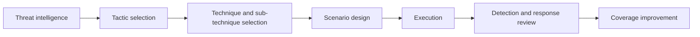

# MITRE ATT&CK Framework

> **MITRE ATT&CK is a knowledge base and shared language for describing real-world adversary behavior.** Red teams use it to design realistic scenarios and explain what they tested. Defenders use it to organize detections, hunting, reporting, and coverage analysis.

---

## Table of Contents

1. [What ATT&CK Is](#1-what-attck-is)
2. [How ATT&CK Is Organized](#2-how-attck-is-organized)
3. [How Red Teams Use ATT&CK](#3-how-red-teams-use-attck)
4. [How Defenders Use ATT&CK](#4-how-defenders-use-attck)
5. [A Practical Mapping Example](#5-a-practical-mapping-example)
6. [What ATT&CK Does Not Do](#6-what-attck-does-not-do)
7. [Common Pitfalls](#7-common-pitfalls)

---

## 1. What ATT&CK Is

> **Difficulty:** Beginner -> Advanced | **Category:** Red Teaming - Adversary Methodology

ATT&CK stands for **Adversarial Tactics, Techniques, and Common Knowledge**.

At a beginner level, it helps to think of ATT&CK as a map of **how attackers behave across their lifecycle**. It is built from observed adversary behavior and maintained as a structured knowledge base rather than a step-by-step playbook.

ATT&CK is useful because it gives offensive and defensive teams a common language.

Instead of saying:

> "We did some credential stuff and then moved around internally."

teams can say:

> "We tested behaviors associated with credential access, privilege escalation, discovery, and lateral movement to validate whether identity, endpoint, and network controls detected the path."

That shift sounds small, but it makes planning and reporting much more precise.

---

## 2. How ATT&CK Is Organized

MITRE ATT&CK is hierarchical.

| Layer | Meaning | Practical Use |
|---|---|---|
| Tactic | The adversary's immediate goal or "why" | Helps group behavior by objective |
| Technique | A common method used to achieve that goal | Useful for planning and coverage analysis |
| Sub-technique | A more specific variant of a technique | Adds precision for testing and detection |
| Procedure | A concrete real-world implementation of the technique | Useful for realism, detection tuning, and reporting |

### Beginner example

| Level | Example Interpretation |
|---|---|
| Tactic | Credential Access |
| Technique | OS Credential Dumping |
| Sub-technique | Accessing a specific credential source |
| Procedure | The exact sequence or tooling seen in a real intrusion |

### Why this hierarchy matters

- Red teams often select at the **technique** level.
- Detection teams often build logic closer to the **procedure** or observable level.
- Leadership usually wants the story at the **tactic** and business-impact level.

ATT&CK also spans multiple environments, including enterprise systems, cloud, SaaS, identity platforms, containers, and more. That matters because modern attack paths often cross those boundaries.

---

## 3. How Red Teams Use ATT&CK

ATT&CK is most useful when it helps answer three questions:

1. Which adversary behaviors matter for this organization?
2. Which of those behaviors are worth validating right now?
3. How do we explain exactly what we tested in a way defenders can act on?

### Typical red-team use cases

| Use Case | How ATT&CK Helps |
|---|---|
| Threat-informed planning | Connects public reporting to concrete behavior sets |
| Scenario design | Helps choose behavior families that match the objective |
| Reporting | Gives precise language for the tested path |
| Gap analysis | Maps missed detections or weak controls to known behaviors |
| Replay and purple follow-up | Helps replay the same behavior family after improvements |

### What operators look for

Operators usually use ATT&CK to decide:

- which behaviors are realistic for the threat model
- which techniques are safe to simulate in production
- which actions are essential to the path and which are unnecessary noise
- which observables should exist if the environment is instrumented well
- how to explain the tested path in a way blue teams can reuse

A strong operator does not treat ATT&CK as a checklist to complete. They use it as a structured vocabulary for intentional scenario design.

---

## 4. How Defenders Use ATT&CK

Defenders often use ATT&CK for:

- coverage mapping
- threat hunting hypotheses
- incident description and triage
- detection engineering prioritization
- tabletop and purple-team planning

### Defender lens

| Defender Goal | ATT&CK Contribution |
|---|---|
| Know what behaviors matter most | Organizes likely attacker actions into recognizable groups |
| Identify logging gaps | Highlights what is hard to see in current architecture |
| Build better detections | Connects behavior families to concrete observables |
| Compare incidents and exercises | Gives a shared language across teams and time |
| Prioritize improvement | Helps focus on techniques relevant to business risk |

ATT&CK becomes especially powerful when defenders stop asking only "Do we have a rule for this technique?" and instead ask:

> "Would we understand this behavior early enough to change the outcome of the incident?"

That is a much stronger defensive question.

---

## 5. A Practical Mapping Example

Imagine the organization wants to test whether an identity-centric adversary could move from an external foothold to a sensitive cloud workload.

| Engagement Question | Relevant ATT&CK Thinking | What Defenders Validate |
|---|---|---|
| How might the adversary start? | Initial access behaviors relevant to email, apps, remote services, or valid account abuse | Can front-door controls and telemetry surface suspicious entry behavior? |
| How might they strengthen control? | Privilege escalation or credential access behaviors | Are changes in privilege and identity use visible and high confidence? |
| How might they understand the environment? | Discovery behaviors | Can defenders spot reconnaissance that happens after entry? |
| How might they reach the objective? | Lateral movement or collection patterns appropriate to the environment | Are the sensitive workflows monitored as well as the endpoints? |
| How might they complete the mission? | Collection, exfiltration, or impact-related behaviors depending on objective | Do defenders recognize business impact, not just technical activity? |

This style of mapping helps both sides stay aligned on behavior, evidence, and expected learning outcomes.

---

## 6. What ATT&CK Does Not Do

ATT&CK is extremely useful, but it has clear limits.

ATT&CK does **not** tell you:

- which techniques are most relevant to your organization without additional context
- which behaviors are safe to simulate in production
- which control gap matters most to business risk
- whether a defender can distinguish benign from malicious use of the same behavior
- how a real intruder will sequence techniques in your environment

ATT&CK is a map, not the whole journey.

---

## 7. Common Pitfalls

### Treating ATT&CK like a compliance checklist

More boxes checked does not automatically mean better security.

### Confusing tools with techniques

The same technique can be implemented in many ways. Technique coverage is usually more durable than tool-specific thinking.

### Reporting only tactic names

Saying "we tested lateral movement" is too vague. Teams should explain the business context, path logic, and defender relevance.

### Choosing too many techniques at once

ATT&CK is broad. Useful exercises are selective.

### Forgetting observables

Technique mapping is much more useful when paired with the question: "What would defenders actually see?"

The best summary is:

> **ATT&CK gives red and blue teams a structured language for real attacker behavior, but the value comes from how thoughtfully they translate that language into realistic, measurable security validation.**

---

> **Defender mindset:** Use ATT&CK to structure understanding, not to imitate behavior blindly. Tie techniques to business-relevant scenarios, real observables, and clear defensive outcomes.
