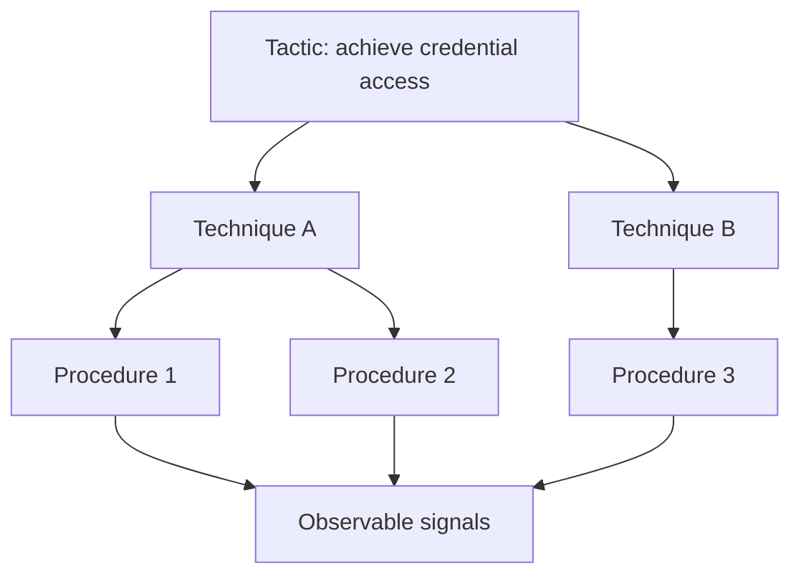

# Tactics, Techniques, and Procedures (TTPs)

> **TTPs describe attacker behavior at different levels of abstraction.** Tactics explain the goal, techniques explain the general method, and procedures explain the concrete way the method was carried out in a specific case. This hierarchy is fundamental to threat intelligence, red teaming, detection engineering, and reporting.

---

## Table of Contents

1. [What TTPs Are](#1-what-ttps-are)
2. [Why the Hierarchy Matters](#2-why-the-hierarchy-matters)
3. [Tools Are Not the Same as TTPs](#3-tools-are-not-the-same-as-ttps)
4. [How Red Teams Use TTPs](#4-how-red-teams-use-ttps)
5. [How Defenders Use TTPs](#5-how-defenders-use-ttps)
6. [A Practical Example](#6-a-practical-example)
7. [Common Pitfalls](#7-common-pitfalls)

---

## 1. What TTPs Are

> **Difficulty:** Beginner -> Advanced | **Category:** Red Teaming - Adversary Methodology

TTPs are a structured way to describe adversary behavior.

| Layer | Answers Which Question? | Example Style |
|---|---|---|
| Tactic | Why is the adversary doing this? | Gain credential access |
| Technique | How are they broadly doing it? | Use a method that obtains or abuses credentials |
| Procedure | Exactly how did they do it in this case? | The concrete implementation in a real incident or exercise |

Some frameworks also use **sub-techniques**, which sit between technique and procedure.

A beginner-friendly way to think about it is:

- **Tactic:** the goal
- **Technique:** the method family
- **Procedure:** the real-world implementation

---

## 2. Why the Hierarchy Matters

The hierarchy matters because different teams operate at different levels.

| Audience | Usually Thinks At Which Level? |
|---|---|
| Executives and risk owners | Tactic and business objective |
| Red team planners | Technique and scenario level |
| SOC and detection engineers | Procedure and observable level |
| Threat intelligence teams | All levels, depending on purpose |

This hierarchy helps teams separate what stays stable from what changes.

- A **tactic** may remain consistent across many attacks.
- A **technique** may remain useful even when tooling changes.
- A **procedure** may vary widely between actors, victims, and moments in time.

That is why good security programs avoid overfitting only to one exact procedure.

---

## 3. Tools Are Not the Same as TTPs

One of the most important ideas in adversary methodology is this:

> **A tool is not a tactic, technique, or procedure by itself.**

A tool is just one possible implementation aid.

| Concept | What It Means |
|---|---|
| Tactic | The adversary goal |
| Technique | The behavior family used to achieve that goal |
| Procedure | The specific real-world implementation |
| Tool | One possible instrument used in that implementation |

Why this matters:

- Attackers can swap tools while keeping the same technique.
- Defenders who detect only one tool signature may miss the broader behavior.
- Red teams that focus too heavily on one tool may lose realism if the environment calls for a different procedure.

Strong methodology asks, "What behavior are we testing?" before asking, "What tool will represent it safely?"

---

## 4. How Red Teams Use TTPs

Red teams use TTPs to translate threat intelligence into exercises.

### Planning questions

- Which tactics matter for the objective?
- Which techniques are realistic in this environment?
- Which procedures are safe, believable, and measurable?
- Which procedures are unnecessary because they add noise but no learning value?

### Operator viewpoint

| Planning Need | TTP Value |
|---|---|
| Keep scenario realistic | Choose behaviors that match likely adversaries |
| Avoid tool obsession | Focus on behavior families first |
| Design evidence collection | Map procedures to expected observables |
| Report clearly | Explain tested behavior in a language defenders can reuse |

TTP thinking is also what helps a red team justify why certain steps were included and others were intentionally excluded.

---

## 5. How Defenders Use TTPs

Defenders use TTPs to organize telemetry, detections, hunting, and response playbooks.

| Defender Need | TTP Value |
|---|---|
| Alerting | Map behavior to expected logs and signals |
| Threat hunting | Form hypotheses around likely technique families |
| Incident triage | Understand attacker intent from grouped behavior |
| Resilience planning | Prioritize controls around high-value tactics and techniques |

A mature defender tries to build layered understanding:

- tactic-level context for priority
- technique-level coverage for breadth
- procedure-level logic for specificity and tuning

This layered model is more resilient than a strategy built around one signature or one indicator.

---

## 6. A Practical Example

Imagine a security team wants to validate risks around privileged identity abuse.

| Level | Example Question |
|---|---|
| Tactic | Is the adversary trying to obtain or expand privileged access? |
| Technique | Which behavior family would realistically support that goal here? |
| Procedure | How would that behavior appear in this organization's actual identity systems, approval flows, and telemetry? |

### Why this is useful

This structure prevents shallow testing.

A weak exercise might say:

> "We tested an admin abuse tool."

A stronger exercise says:

> "We tested a realistic privileged-access abuse pattern, observed how the behavior surfaced in identity and audit telemetry, and measured whether analysts recognized the significance of the role change in relation to the business objective."

That phrasing carries much more operational value.

---

## 7. Common Pitfalls

### Confusing indicators with TTPs

An IP address, hash, or domain is not a TTP. Those are indicators. TTPs describe behavior.

### Treating tools as the detection target

Tool-centric detections are useful, but behavior-centric detections are usually more durable.

### Reporting at the wrong level

Executives do not need only procedure minutiae, and analysts do not benefit from tactic-only summaries. Reports should adapt the level of detail to the audience.

### Ignoring environmental context

The same technique can look very different across cloud, SaaS, Windows, Linux, or hybrid environments.

### Overcomplicating the language

TTP terminology should improve clarity, not create jargon for its own sake.

The best summary is:

> **TTPs provide a shared structure for describing attacker behavior, which helps red teams plan better exercises and helps defenders build better coverage around what attackers are trying to achieve, not just the tools they happen to use.**

---

> **Defender mindset:** Use TTP language to connect threat intelligence, detections, and response. Focus on behavior families and observables, not just one actor name or one tool signature.
