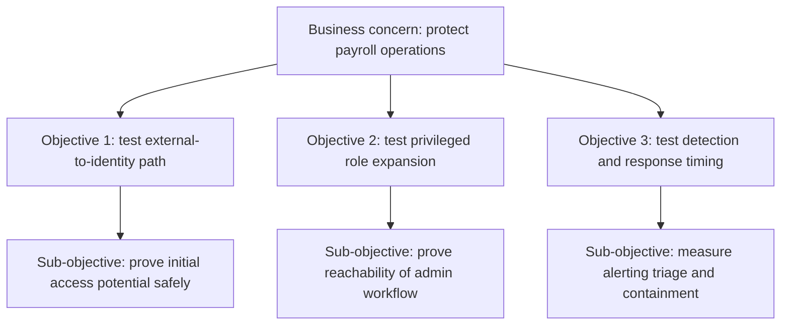

# Attack Objectives

> **Difficulty:** Beginner → Advanced | **Category:** Red Teaming — Engagement Planning

Attack objectives turn red teaming from “do something realistic” into **answer a specific business security question with controlled evidence**. A good objective tells the team what success looks like, what proof is enough, and what the organization is trying to learn if the team succeeds, fails, or gets detected early.

In professional red teaming, objectives are not chosen because they sound dramatic. They are chosen because they reveal whether important controls actually protect something the business cares about.

---

## Table of Contents

1. [Why Objectives Matter](#1-why-objectives-matter)
2. [Objectives vs Tasks vs Findings](#2-objectives-vs-tasks-vs-findings)
3. [Characteristics of Strong Objectives](#3-characteristics-of-strong-objectives)
4. [Building an Objective Tree](#4-building-an-objective-tree)
5. [Evidence and Success Criteria](#5-evidence-and-success-criteria)
6. [Operator and Defender Viewpoints](#6-operator-and-defender-viewpoints)
7. [Objective Design Checklist](#7-objective-design-checklist)
8. [Common Mistakes](#8-common-mistakes)
9. [Why Objectives Make Reporting Better](#9-why-objectives-make-reporting-better)

---

## 1. Why Objectives Matter

A red team with no clear objective tends to drift toward whatever is easiest to access or most technically interesting. That produces activity, but not necessarily useful learning.

Strong objectives anchor the engagement to questions like:

- Can an external adversary plausibly reach a crown-jewel data set?
- Can a low-privilege identity be expanded into a business-critical role?
- Can defenders detect and interrupt a realistic ransomware precursor path before impact?
- Can a privileged cloud management function be reached through normal trust relationships?

Objectives matter because they shape:

- the scenario,
- the pace of the campaign,
- what evidence operators collect,
- what defenders are expected to observe,
- and what leadership will be able to act on afterward.

---

## 2. Objectives vs Tasks vs Findings

One of the most common beginner mistakes is mixing up goals, execution steps, and report outcomes.

| Term | Meaning | Example |
|---|---|---|
| Objective | The business-relevant end state the exercise is trying to validate | “Demonstrate whether payroll reporting data is reachable from an external starting point” |
| Task | A planned action or work package in support of the objective | “Validate whether identity expansion is possible from the initial foothold” |
| Finding | A control weakness or success observed while pursuing the objective | “Conditional access did not block privileged sign-in from an unmanaged device” |

### A simple way to think about it

- **Objective:** What are we trying to prove?
- **Task:** What do we need to test to answer that question?
- **Finding:** What did we learn about the controls along the way?

Keeping those layers separate makes the campaign easier to design and the report much easier to read.

---

## 3. Characteristics of Strong Objectives

Strong red team objectives are usually:

| Characteristic | What it means in practice |
|---|---|
| Specific | Focused on a real asset, role, workflow, or business concern |
| Measurable | The team can say whether it was reached, blocked, or partially demonstrated |
| Threat-informed | Based on realistic adversary behavior or likely business exposure |
| Safe | Can be validated with approved proof methods |
| Time-aware | Reasonable within the campaign timeline |
| Detection-aware | Helps defenders learn what telemetry and response matter |

### Examples of weak and strong objectives

| Weak objective | Why it is weak | Stronger rewrite |
|---|---|---|
| Compromise the network | Too broad and hard to measure | Demonstrate whether an external path can reach a named privileged identity tier |
| Get domain admin | Tool-driven and outdated as a business goal | Demonstrate whether privileged identity controls prevent access to crown-jewel systems |
| Test phishing | A method is not an objective | Measure whether approved user populations can be safely led to an initial foothold and how quickly the SOC responds |
| Bypass defenses | Vague and ego-driven | Determine whether detection and containment interrupt the modeled attack path before objective reachability |

---

## 4. Building an Objective Tree

Mature teams usually decompose one business concern into multiple measurable objectives and sub-objectives.

### Why objective trees help

They let the team:

- prioritize the most important path first,
- define proof requirements early,
- map defensive expectations to each phase,
- and explain partial success or early detection without losing the story.

### Common objective categories

| Category | What it validates |
|---|---|
| Data objective | Whether important information is reachable |
| Identity objective | Whether privilege boundaries can be crossed |
| Process objective | Whether a key business workflow is exposed |
| Detection objective | Whether defenders see, understand, and escalate relevant activity |
| Resilience objective | Whether controls slow or stop progression before the end state |

---

## 5. Evidence and Success Criteria

A professional objective always has an evidence plan. Otherwise the team may reach an important point and still struggle to prove it cleanly.

| Objective example | Safe proof of success | Useful defender evidence |
|---|---|---|
| Reach a sensitive SaaS reporting function | Approved screenshots, metadata, timestamps, white-team confirmation | Access logs, authentication events, alert history |
| Validate identity control effectiveness | Demonstrated blocked path or approved proof of reachable privilege | Sign-in telemetry, conditional access outcomes, analyst triage notes |
| Measure SOC response to realistic attacker behavior | Timeline of observed actions and response decisions | Detection timestamps, escalations, containment actions |
| Test segmentation around a crown-jewel zone | Evidence of allowed or denied reachability using approved checks | Network logs, EDR correlation, firewall decisions |

### Success is not always “objective reached”

A successful engagement outcome may be:

- the objective was reached,
- the objective was partially reached but with high attacker cost,
- the objective was blocked by strong controls,
- or the path was detected early enough that the organization effectively “won.”

That is why objective design should include **success criteria for both offensive progress and defensive performance**.

---

## 6. Operator and Defender Viewpoints

| Topic | Operator view | Defender / stakeholder view |
|---|---|---|
| Business relevance | “Does this objective reflect a real attacker goal?” | “Will leadership care about the result?” |
| Proof method | “What is the lightest-touch way to prove the end state?” | “Is the evidence strong without exposing unnecessary data?” |
| Detection value | “What behaviors should defenders plausibly see?” | “What should we have detected sooner?” |
| Time and pacing | “Can we pursue this within the campaign window?” | “Can we measure dwell time and response quality?” |
| Partial success | “If blocked, what does that still teach us?” | “Which controls deserve credit and which gaps remain?” |

The best objectives create learning even when the red team does not fully achieve them.

---

## 7. Objective Design Checklist

- [ ] The objective is tied to a real business concern or crown jewel
- [ ] The objective can be measured clearly
- [ ] The modeled path is realistic for the adversary being emulated
- [ ] Safe proof methods are defined in advance
- [ ] The objective is feasible within the engagement timeline
- [ ] Defender expectations are identified for each major phase
- [ ] Evidence requirements are known before execution starts
- [ ] The objective does not encourage unnecessary depth or risky behavior

A useful test is this:

> “If the campaign ended halfway through, could we still explain what this objective was trying to prove and what we learned?”

If the answer is no, the objective is probably too vague.

---

## 8. Common Mistakes

### 1. Choosing objectives that sound dramatic but teach little

“Get the biggest privilege possible” is usually less valuable than testing a specific high-risk workflow.

### 2. Confusing methods with goals

Phishing, cloud abuse, or internal pivoting are campaign methods, not business objectives.

### 3. Forgetting defensive outcomes

Red teaming is not only about end-state access. It is also about whether defenders saw and interpreted the path.

### 4. Setting objectives that require unsafe proof

If the only way to prove success would be destructive or privacy-invasive, the objective needs redesign.

### 5. Creating too many objectives

A small number of well-designed objectives produces better evidence than a long list of shallow ones.

---

## 9. Why Objectives Make Reporting Better

Strong reporting depends on clean alignment between:

- what the organization asked,
- what the red team attempted,
- what defenders observed,
- and what outcome was reached.

Objectives make that alignment visible.

A mature report can say:

- Objective 1 was reached.
- Objective 2 was blocked by control X.
- Objective 3 was detected quickly, but response coordination lagged.
- Objective 4 was not pursued because the risk or timing threshold was reached.

That kind of reporting is much more valuable than a pile of disconnected technical anecdotes.

---

> **Defender mindset:** Good objectives ensure the exercise tests something the business truly cares about and measures both attacker opportunity and defender performance.
