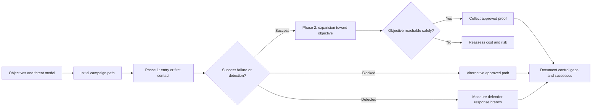

# Campaign Planning

> **Difficulty:** Beginner → Advanced | **Category:** Red Teaming — Engagement Planning

Campaign planning is the process of turning objectives, scope, and rules into **an ordered, evidence-driven sequence of actions and decisions**. This is where a red team decides what comes first, what assumptions must hold, what contingency branches exist, and how the exercise will stay realistic if defenders react faster or slower than expected.

Professional campaign plans are usually less dramatic than people imagine. They are structured, documented, and full of contingency thinking. That is exactly what makes them useful.

---

## Table of Contents

1. [What Campaign Planning Covers](#1-what-campaign-planning-covers)
2. [Core Planning Inputs](#2-core-planning-inputs)
3. [Phase Sequencing and Decision Points](#3-phase-sequencing-and-decision-points)
4. [Contingencies and Branches](#4-contingencies-and-branches)
5. [Timing Staffing and Logistics](#5-timing-staffing-and-logistics)
6. [Operator and Defender Viewpoints](#6-operator-and-defender-viewpoints)
7. [Practical Campaign Artifacts](#7-practical-campaign-artifacts)
8. [Campaign Planning Checklist](#8-campaign-planning-checklist)
9. [Common Mistakes](#9-common-mistakes)

---

## 1. What Campaign Planning Covers

Campaign planning answers the operational questions that sit between strategy and execution:

- Which objective is pursued first?
- What assumptions must be true for later phases to matter?
- Which phases need special white-team approval?
- What happens if the team is detected early?
- What evidence must be captured at each stage?
- How will the red team know when to pause, pivot, or stop?

A campaign plan is therefore part:

- scenario design,
- risk control,
- logistics,
- and reporting preparation.

### Planning supports realism

Some beginners imagine that heavy planning makes an exercise feel artificial. In reality, professional planning is what allows the team to adapt safely and still tell a coherent story afterward.

---

## 2. Core Planning Inputs

| Input | Why it matters |
|---|---|
| Threat model | Keeps the scenario realistic and threat-informed |
| Objectives | Defines what the campaign is trying to prove |
| Scope | Identifies allowed targets, identities, and boundaries |
| Rules of engagement | Sets safety controls and stop conditions |
| Deconfliction model | Determines what the white team and defenders know |
| Infrastructure plan | Supports communication, evidence, hosting, and teardown |
| Defender context | Helps decide pace, timing, and likely observation points |
| Reporting requirements | Tells operators what proof must exist before the campaign starts |

If any of these inputs are weak, the campaign becomes harder to justify and much harder to interpret later.

---

## 3. Phase Sequencing and Decision Points

Good campaign plans are built around phases and decision gates rather than a single straight line.

### Example campaign phase table

| Phase | Purpose | Example decision question | Evidence to capture |
|---|---|---|---|
| Preparation | Confirm assumptions and readiness | Are scope, contacts, and infrastructure ready? | Validation logs, approvals |
| Entry | Test the first realistic path | Did the initial scenario produce the expected conditions? | Timeline, telemetry, blockers |
| Expansion | Move toward the objective through approved paths | Are identity, segmentation, or workflow controls holding? | Access decisions, detections, analyst actions |
| Objective proof | Safely validate the end state | Can the objective be proved without unnecessary risk? | Screenshots, logs, metadata, timestamps |
| Observation and closeout | Capture defensive outcomes and cleanup | What did defenders see and how did they react? | Alert timeline, communications, cleanup records |

### Decision points matter as much as phases

Red team campaigns should define where an operator must stop and make a judgment. Examples include:

- after first access,
- before touching privileged workflows,
- before collecting any high-sensitivity proof,
- after a defender response changes the environment,
- or when a safer path becomes available.

---

## 4. Contingencies and Branches

Real engagements rarely follow the ideal path. Mature planning expects that.

### Common branch conditions

| Branch trigger | What the team may need to decide |
|---|---|
| Initial path fails | Use an alternate approved scenario or stop pursuing that objective |
| Defenders detect early | Continue under the agreed model, shift into detection measurement, or pause |
| Required access appears unexpectedly easy | Choose safer proof rather than over-collecting |
| A real incident overlaps | Halt and deconflict with the white team |
| Environmental change occurs | Adjust timing, path, or objective sequence |

### Professional planning includes “if detected” logic

One of the clearest signs of mature planning is that the team decides in advance what detection means for the exercise.

Possible models include:

- continue unless explicitly stopped,
- stop once defenders reach a named confidence threshold,
- switch from objective pursuit to response measurement,
- or allow only certain branches after detection.

This prevents chaotic decision-making later.

---

## 5. Timing Staffing and Logistics

Campaigns are shaped by people and schedules as much as by technology.

| Planning factor | Why it matters |
|---|---|
| Business calendar | Product launches, earnings periods, holidays, and change freezes can distort risk |
| SOC coverage model | Shift handoffs and follow-the-sun teams affect defender observation |
| White-team availability | High-risk phases may require named observers or rapid approval capability |
| Operator staffing | Long campaigns need coverage, note-taking, and quality control |
| Infrastructure readiness | DNS, certificates, evidence storage, and health checks must be ready before execution |
| Reporting workflow | Findings are stronger when evidence is collected in real time rather than reconstructed later |

### A practical operator workflow

Mature teams typically:

1. validate planning assumptions,
2. stage infrastructure and proof methods,
3. sequence the lowest-risk, highest-learning path first,
4. define named decision points,
5. maintain a live timeline during execution,
6. and update the white team when branch conditions are hit.

---

## 6. Operator and Defender Viewpoints

| Topic | Operator view | Defender / stakeholder view |
|---|---|---|
| Sequencing | “What order gives the most useful evidence for the least risk?” | “Was the scenario realistic and interpretable?” |
| Branch logic | “What do we do if the plan breaks early?” | “Can we separate control success from campaign adaptation?” |
| Detection timing | “If seen early, do we continue or pivot?” | “How well did our monitoring and response process function?” |
| Staffing | “Who is collecting notes, making decisions, and managing approvals?” | “Who inside the organization must be prepared behind the scenes?” |
| Evidence discipline | “What must be recorded at each stage?” | “Will the final report show both technical events and decision quality?” |

Campaign planning is where offensive realism and defensive measurability meet.

---

## 7. Practical Campaign Artifacts

Professional red teams usually maintain several working artifacts, even if the client never sees them in full.

| Artifact | Purpose |
|---|---|
| Objective matrix | Maps business goals to testable outcomes |
| Phase plan | Shows sequencing, dependencies, and decision gates |
| Contact sheet | Lists technical, white-team, executive, and legal contacts |
| Infrastructure diagram | Clarifies exposure layers, evidence paths, and teardown ownership |
| Risk register | Tracks exercise-created risk and mitigations |
| Evidence plan | Defines what proof is needed and how it will be stored |
| Daily timeline | Preserves an accurate operational narrative |

These artifacts make the exercise safer to run and easier to explain later.

---

## 8. Campaign Planning Checklist

- [ ] Objectives are prioritized, not just listed
- [ ] Phase sequencing reflects realistic attacker behavior
- [ ] Decision points and branch conditions are defined
- [ ] Detection and response expectations are documented
- [ ] White-team and emergency contacts are available
- [ ] Infrastructure and evidence systems are ready
- [ ] High-risk actions require explicit approval or safer proof methods
- [ ] Operator staffing supports note-taking and quality control
- [ ] Cleanup, teardown, and post-engagement handoff are planned

---

## 9. Common Mistakes

### 1. Treating the campaign as a fixed script

Good campaigns are planned, but they still need decision branches.

### 2. Starting with the most dramatic path

Mature teams often start with the path that provides the most learning for the least operational risk.

### 3. Forgetting detection as an outcome

If defenders see and understand the activity, that is part of the exercise result, not a failure of planning.

### 4. Not planning evidence collection early

Teams that wait until reporting to think about evidence usually regret it.

### 5. Assuming the environment will stay stable

Real organizations change constantly. Campaign plans must account for that.

Professional campaign planning often looks almost boring on paper. That is a feature, not a flaw. Boring plans are usually what keep complex exercises safe, interpretable, and worth repeating.

---

> **Defender mindset:** Good campaign planning ensures the exercise tests realistic attack paths while still producing clean evidence about what defenders saw, missed, or stopped.
