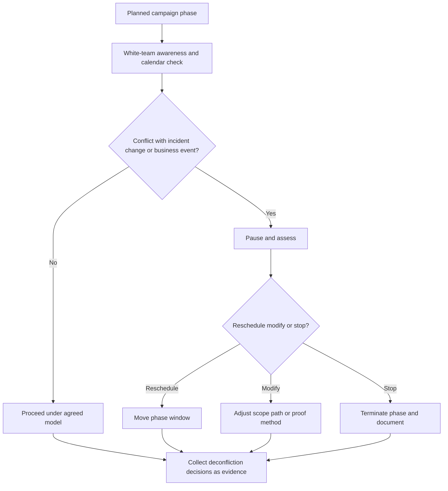

# Deconfliction

> **Difficulty:** Beginner → Advanced | **Category:** Red Teaming — Engagement Planning

Deconfliction is the process of preventing a red team exercise from colliding with **real incidents, business-critical operations, change activity, or the organization’s own defensive response**. It is one of the most important controls in professional red teaming because it protects both realism and safety.

Good deconfliction does not mean telling everyone everything. It means giving the right people enough information to keep the exercise from causing harm while still allowing defenders to experience it naturally.

---

## Table of Contents

1. [What Deconfliction Solves](#1-what-deconfliction-solves)
2. [Who Knows What](#2-who-knows-what)
3. [How Deconfliction Works Operationally](#3-how-deconfliction-works-operationally)
4. [Typical Collision Points](#4-typical-collision-points)
5. [Operator and Defender Viewpoints](#5-operator-and-defender-viewpoints)
6. [Practical Deconfliction Controls](#6-practical-deconfliction-controls)
7. [Deconfliction Checklist](#7-deconfliction-checklist)
8. [Common Mistakes](#8-common-mistakes)
9. [Why Deconfliction Improves Reporting](#9-why-deconfliction-improves-reporting)

---

## 1. What Deconfliction Solves

A red team exercise can collide with many things besides defenders:

- a real phishing wave,
- infrastructure maintenance,
- a major platform rollout,
- a disaster recovery exercise,
- a merger-related access change,
- or a live security incident.

Without deconfliction, the organization risks learning the wrong lesson. For example:

- the SOC may spend time chasing the exercise during a real incident,
- the red team may be blamed for unrelated instability,
- an exercise path may become invalid because the environment changed,
- or too much advance disclosure may ruin defensive measurement.

Deconfliction exists to preserve the integrity of the exercise and the safety of the organization at the same time.

---

## 2. Who Knows What

One of the hardest deconfliction decisions is deciding how much of the exercise each group should know.

| Group | What they typically know |
|---|---|
| White team | Full scenario, schedule, safety rules, emergency paths |
| Executive sponsor | Business objective, high-level timing, major risk boundaries |
| Platform or IT owner | Only what is necessary to protect sensitive systems |
| SOC or defenders | Depends on the model: none, partial awareness, or post-event disclosure |
| General employees | Usually nothing unless the scenario requires informed participants |

### Common awareness models

| Model | Description | Typical use |
|---|---|---|
| Overt / announced | Defenders know an exercise is active but not every step | Training-heavy internal exercises |
| Partially covert | Only a small white team knows details | Common enterprise red team model |
| Highly covert | Very limited internal awareness, tightly controlled | Mature programs with strong governance |

The right model depends on the objective, maturity, and risk tolerance of the organization.

---

## 3. How Deconfliction Works Operationally

### What professional teams actually do

Deconfliction is usually handled by a small white team that monitors:

- business calendars,
- change windows,
- live security activity,
- sensitive system health,
- and any signals that the exercise is creating confusion.

The white team does not direct every operator decision. It exists to manage collisions that the operators should not solve alone.

---

## 4. Typical Collision Points

| Collision point | Why it matters | Typical response |
|---|---|---|
| Live security incident | Exercise traffic can waste defender time or distort triage | Pause until the incident is understood |
| Major change window | Results become hard to interpret if the environment is changing | Reschedule or narrow the phase |
| Sensitive executive event | Timing may create unnecessary business disruption | Delay or modify the scenario |
| Tooling rollout | New EDR, IAM, or logging changes can distort measurement | Decide whether the changed state is the real test target |
| Third-party contact | Indicates a boundary or public-facing issue may have been crossed | Stop and escalate immediately |
| Unrelated service instability | The exercise may be blamed unfairly or may increase risk | Pause and deconflict |

### Deconfliction is not just scheduling

Scheduling is part of it, but mature deconfliction also considers interpretation. If an exercise result happens during a noisy or unstable period, defenders may not learn the right lesson from what they saw.

---

## 5. Operator and Defender Viewpoints

| Topic | Operator view | Defender / stakeholder view |
|---|---|---|
| Realism | “How much can stay hidden without creating risk?” | “Can the exercise remain natural while still being governed?” |
| Incident overlap | “Should I continue if defenders are already busy?” | “Can we protect response capacity for real threats?” |
| White-team role | “Who can make a quick judgment when conditions change?” | “Is there enough oversight without overexposing the scenario?” |
| Schedule integrity | “Does this phase still mean what we intended?” | “Will the results be credible if the environment shifted?” |
| Evidence | “Are pauses and modifications being documented?” | “Can the final report explain why the campaign changed?” |

Deconfliction works best when it is quiet, disciplined, and heavily documented behind the scenes.

---

## 6. Practical Deconfliction Controls

| Control | Purpose |
|---|---|
| White-team watch list | Tracks sensitive assets, events, and stakeholders during the exercise |
| Incident overlap check | Prevents exercise traffic from colliding with real attacks |
| Change calendar review | Avoids testing through planned instability |
| Pause-and-call procedure | Gives operators a simple action when something changes unexpectedly |
| Limited knowledge sharing | Preserves realism by telling only the people who need to know |
| Decision logging | Records every pause, exception, and schedule adjustment |

### A practical red team habit

Operators should assume that if a situation feels ambiguous from a safety or business perspective, the correct move is usually:

1. pause,
2. notify the white team,
3. and document the decision.

---

## 7. Deconfliction Checklist

- [ ] A named white team exists
- [ ] Awareness levels for executives, SOC, and IT are defined
- [ ] Change windows and blackout periods were reviewed
- [ ] Real-incident overlap handling is documented
- [ ] Sensitive assets and high-risk business events are on a watch list
- [ ] Operators know how to pause and escalate quickly
- [ ] Deconfliction decisions are recorded as part of the evidence set
- [ ] The chosen awareness model matches the organization’s maturity and risk tolerance

---

## 8. Common Mistakes

### 1. Telling too many people too much

This often destroys realism without improving safety.

### 2. Telling too few people too little

This can create unnecessary risk or confusion when conditions change.

### 3. Treating deconfliction as a calendar exercise only

The real job is collision prevention and result integrity, not just scheduling.

### 4. Failing to document exercise changes

If a phase pauses or changes shape and nobody records why, the final narrative becomes weaker.

### 5. Ignoring environmental drift

A campaign planned weeks earlier may no longer reflect the same defensive conditions by execution time.

---

## 9. Why Deconfliction Improves Reporting

Good reporting depends on separating:

- what the red team intended,
- what actually happened,
- what changed in the environment,
- and what the organization should learn from those changes.

Deconfliction records provide that context.

They explain why a phase was paused, why an objective path changed, why a result may have been distorted by a live event, and why the team chose not to continue down a path that would have produced misleading or unsafe results.

In other words, deconfliction protects not just the exercise, but the credibility of the report.

---

> **Defender mindset:** Strong deconfliction protects real operations, preserves defensive measurement, and makes sure the exercise is remembered for useful learning instead of avoidable confusion.
