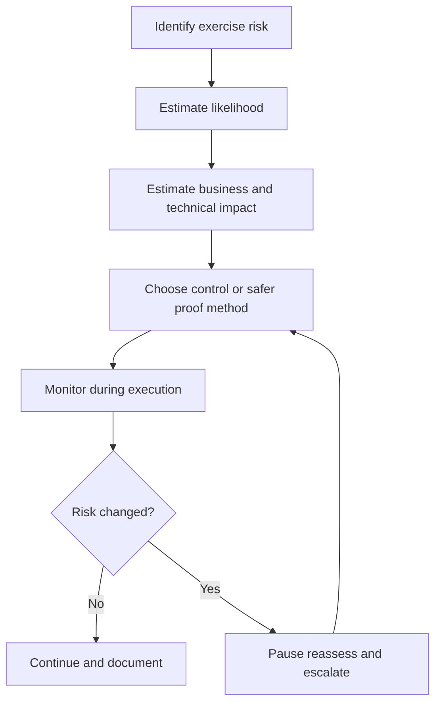
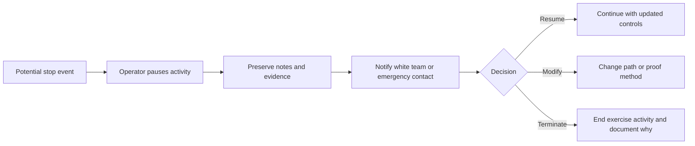

# Risk Management

> **Difficulty:** Beginner → Advanced | **Category:** Red Teaming — Engagement Planning

Risk management in red teaming is the discipline of controlling **the risk created by the exercise itself**. That is different from the risk the exercise is trying to measure in the client environment. Mature teams do both at the same time: they simulate realistic adversary behavior while continuously managing the possibility of harm, confusion, privacy issues, or unintended operational impact.

Good risk management does not weaken red teaming. It is what allows organizations to authorize meaningful exercises repeatedly.

---

## Table of Contents

1. [Why Exercise Risk Deserves Its Own Analysis](#1-why-exercise-risk-deserves-its-own-analysis)
2. [Common Risk Categories](#2-common-risk-categories)
3. [The Risk Evaluation Loop](#3-the-risk-evaluation-loop)
4. [Risk Registers and Control Selection](#4-risk-registers-and-control-selection)
5. [Stop Conditions and Escalation](#5-stop-conditions-and-escalation)
6. [Operator and Defender Viewpoints](#6-operator-and-defender-viewpoints)
7. [Practical Risk Checklist](#7-practical-risk-checklist)
8. [Common Mistakes](#8-common-mistakes)
9. [Why Good Risk Management Improves Realism](#9-why-good-risk-management-improves-realism)

---

## 1. Why Exercise Risk Deserves Its Own Analysis

Red teams are hired to explore security weakness, but they also bring their own risk surface. That risk can include:

- technical instability,
- accidental data exposure,
- confusion inside incident response,
- third-party boundary problems,
- employee distress in social engineering scenarios,
- and misleading results caused by bad timing or environmental change.

In practice, the exercise can fail in two different ways:

1. it causes avoidable harm, or
2. it teaches the wrong lesson because the environment or scenario was not controlled.

Good risk management reduces both outcomes.

---

## 2. Common Risk Categories

| Risk category | Example | Typical control |
|---|---|---|
| Operational | Service degradation, business workflow interruption, user lockouts | Safer proof methods, time windows, pause rules |
| Technical | Unstable technique, unsafe interaction with fragile systems | Lab validation, restricted methods, white-team approval |
| Legal / contractual | Unapproved third-party touchpoints, regulated data mishandling | Scope controls, legal review, explicit exclusions |
| Privacy | Exposure of employee, customer, or regulated data | Read-only proof, sampling limits, masked evidence |
| Human | Social engineering stress, executive confusion, insider concern | Scenario limits, HR/legal review, escalation paths |
| Security | Real attackers exploiting the noise or defenders misreading the exercise | Deconfliction, incident overlap checks, health monitoring |
| Reputational | Public-facing effects or internal trust damage | Careful scheduling, stakeholder alignment, communications planning |

### Risk is not just likelihood

In red teaming, low-likelihood events can still be unacceptable if the impact is high. For example, accidental interaction with a third-party regulated service may be unlikely, but it can be serious enough that special handling is mandatory.

---

## 3. The Risk Evaluation Loop

### Why the loop continues during the campaign

Risk management is not finished once planning is complete. It must continue because:

- environments change,
- defenders react,
- objectives become reachable through unexpected paths,
- and adjacent systems sometimes appear only during execution.

Mature teams keep asking:

> “Has the risk profile changed enough that our approved path is no longer the best way to learn?”

---

## 4. Risk Registers and Control Selection

A lightweight risk register is one of the most useful planning tools in a professional exercise.

| Risk | Likelihood | Impact | Typical mitigation | Residual concern |
|---|---|---|---|---|
| Access to regulated data beyond approved proof | Low | High | Metadata-only proof, white-team approval for any sample | Evidence may be less detailed |
| Service instability on critical platform | Medium | High | No destructive actions, safer validation, testing windows | Reduced realism for availability scenarios |
| Third-party boundary crossing | Medium | High | Explicit adjacency rules, stop-and-call procedure | Delay if path depends on partner systems |
| Blue team confusion during a live incident | Low | Very high | Incident overlap check, emergency stop, white-team monitoring | Exercise pacing may be interrupted |
| Employee harm from social engineering scenario | Low | High | HR/legal review, approved target population, clear exclusions | Smaller target pool |

### Common control choices

| Control type | What it does | Typical tradeoff |
|---|---|---|
| Safer proof method | Replaces deeper action with evidence-based validation | May reduce dramatic impact |
| Approval gate | Requires explicit sign-off before sensitive phases | Slower execution |
| Time restriction | Avoids fragile business windows | Less attacker freedom |
| Exclusion or containment | Protects critical or regulated assets | Some attack paths become unavailable |
| Lab rehearsal | Validates behavior before live use | Added preparation time |
| Health monitoring | Detects instability quickly | Requires more coordination |

---

## 5. Stop Conditions and Escalation

A stop condition is a trigger that tells the team the exercise must pause or end until a human decision is made.

### Typical stop conditions

- unexpected production instability,
- access to prohibited data or systems,
- contact from an external third party that was not part of planning,
- signs of a real concurrent intrusion,
- significant user safety or HR concern,
- or any event that makes the original risk assumptions false.

### The key idea

The team should never debate a stop condition while still pushing deeper. The safe default is pause first, then decide.

---

## 6. Operator and Defender Viewpoints

| Topic | Operator view | Defender / stakeholder view |
|---|---|---|
| Technical risk | “Could this action destabilize a system?” | “Can the exercise stay representative without harming operations?” |
| Data exposure | “What is enough proof without over-collecting?” | “Is privacy preserved while still validating risk?” |
| Incident overlap | “Could this be confused with a real threat?” | “Can we protect real response priorities?” |
| Control tradeoffs | “What safer method still answers the question?” | “Will the result still be meaningful?” |
| Escalation | “When do I stop and who decides next?” | “Can we trust the team to pause at the right moment?” |

Good risk management builds trust because it shows the exercise is disciplined, not reckless.

---

## 7. Practical Risk Checklist

- [ ] A risk register exists for technical, legal, privacy, and operational concerns
- [ ] High-impact low-likelihood events were still reviewed explicitly
- [ ] Safe proof methods are defined for sensitive objectives
- [ ] Stop conditions are specific and actionable
- [ ] Emergency escalation paths are tested or confirmed
- [ ] Third-party adjacency is accounted for
- [ ] Social engineering scenarios were reviewed for human safety concerns
- [ ] Real-incident overlap procedures are documented
- [ ] Residual risk is accepted by the right stakeholders

---

## 8. Common Mistakes

### 1. Treating risk management as a paperwork exercise

If it does not change operator decisions, it is not really being used.

### 2. Assuming “non-destructive” means “low risk”

Even read-only activity can create privacy, legal, or operational problems if poorly handled.

### 3. Underestimating people risk

Social engineering and executive-facing scenarios can create real stress if they are not designed carefully.

### 4. Forgetting residual risk

Every realistic exercise accepts some remaining risk. The question is whether it is known, limited, and owned.

### 5. Continuing after assumptions change

The environment does not owe the campaign stability. Teams must adapt when conditions change.

---

## 9. Why Good Risk Management Improves Realism

Mature organizations often permit more sophisticated exercises over time because trust has been earned. That trust comes from disciplined risk management.

Good controls do not make a campaign fake. They make it sustainable. They allow the team to demonstrate realistic exposure without crossing lines that would damage systems, people, or program credibility.

The practical goal is not “zero risk.” The practical goal is:

> “Take only the minimum additional risk needed to answer the security question convincingly.”

That is what separates professional adversary emulation from careless experimentation.

---

> **Defender mindset:** The safest red team exercises are often the most valuable because they preserve trust, protect the environment, and produce results leadership is willing to act on.
