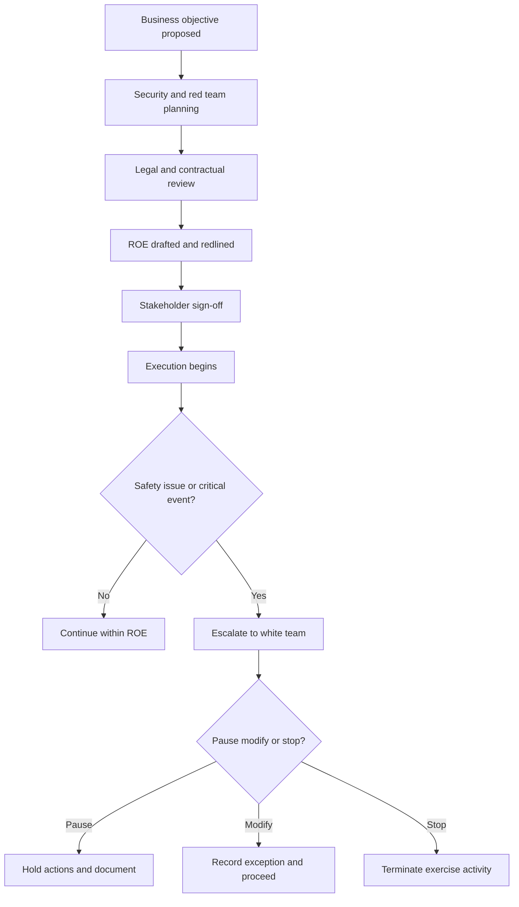
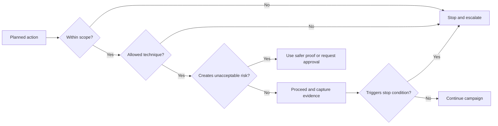

# Rules of Engagement

> **Difficulty:** Beginner → Advanced | **Category:** Red Teaming — Engagement Planning

Rules of engagement (ROE) are the written controls that make a red team exercise **authorized, safe, measurable, and professionally defensible**. In mature programs, ROE is not just a legal appendix. It is the operating manual for what the team may do, what it must not do, who can approve exceptions, and how the organization avoids confusing the exercise with a real incident.

This note focuses on how professional teams build ROE that supports realistic adversary emulation **without turning realism into recklessness**.

---

## Table of Contents

1. [Why ROE Exists](#1-why-roe-exists)
2. [Core ROE Components](#2-core-roe-components)
3. [Approval and Escalation Workflow](#3-approval-and-escalation-workflow)
4. [ROE as a Real-Time Decision Framework](#4-roe-as-a-real-time-decision-framework)
5. [Operator and Defender Viewpoints](#5-operator-and-defender-viewpoints)
6. [A Practical ROE Matrix](#6-a-practical-roe-matrix)
7. [Pre-Execution Checklist](#7-pre-execution-checklist)
8. [Common Mistakes](#8-common-mistakes)
9. [Why ROE Improves Reporting](#9-why-roe-improves-reporting)

---

## 1. Why ROE Exists

High-quality red teaming begins with the same principle NIST SP 800-115 emphasizes for technical testing: **security testing must be planned, coordinated, and explicitly authorized before execution starts**. Red teaming raises the stakes because the exercise may involve realistic timing, sensitive business workflows, privileged identities, or high-value assets.

ROE answers questions such as:

- What systems, identities, facilities, and business units are in scope?
- Which techniques are approved, conditionally approved, or forbidden?
- What proof methods are allowed when crown-jewel assets are reached?
- Who can pause, stop, or modify the exercise?
- How quickly must critical findings or safety issues be escalated?
- What happens if a real incident overlaps with the exercise?

Without those answers, the same action can be interpreted as:

- a valid exercise step,
- an unsafe operational mistake,
- a contractual violation,
- or, in the worst case, unauthorized activity.

### ROE is not a generic template

Many organizations start with a standard template, but good ROE is always tailored. A red team exercise against a SaaS-heavy company with a global SOC, change freezes, and executive phishing restrictions needs a very different ROE from an internal exercise focused on identity abuse in a lab-supported corporate environment.

---

## 2. Core ROE Components

A professional ROE usually covers several control layers at once.

| Component | What it defines | Why it matters |
|---|---|---|
| Authorization | Who approved the exercise and what authority they hold | Prevents legal and organizational ambiguity |
| Scope | Systems, identities, subsidiaries, offices, and third parties included or excluded | Prevents accidental out-of-scope activity |
| Objectives | What the engagement is trying to prove or measure | Keeps the exercise tied to business value |
| Allowed techniques | Which actions are permitted, restricted, or prohibited | Reduces safety and stability risk |
| Time windows | Business hours, blackout periods, maintenance windows, executive events | Avoids unnecessary disruption and false lessons |
| Data handling | What may be viewed, sampled, masked, or never touched | Protects regulated and high-sensitivity data |
| Escalation | Who gets called, when, and by what channel | Makes response fast under pressure |
| Stop conditions | Events that trigger pause or termination | Preserves safety when conditions change |
| Deconfliction model | Who knows about the exercise and what they know | Preserves realism without harming operations |
| Evidence rules | What artifacts the red team must collect and retain | Strengthens the final report |

### The minimum questions every ROE should answer

1. **Authority:** Which executive, security, legal, or business leaders approved the exercise?
2. **Boundaries:** What exactly is in scope, adjacent, or prohibited?
3. **Methods:** Are phishing, physical access, cloud identity abuse, or endpoint actions allowed?
4. **Safety:** What data, systems, or actions require special approval or read-only proof?
5. **Communications:** Who is reachable 24/7 for technical, legal, and business decisions?
6. **Emergency action:** What must the red team do if stability, privacy, or third-party issues appear?

### ROE should express intent, not just rules

A clause like “no disruption” is too vague on its own. A better clause explains the operating intent:

> “The red team may validate objective reachability using approved, non-destructive proof methods. Actions likely to impair availability, modify business data, or materially affect production workflows require explicit pre-approval or must be simulated.”

That wording helps operators make better decisions when they encounter edge cases.

---

## 3. Approval and Escalation Workflow

Real exercises fail more often from bad coordination than from bad technical execution. Approval chains and escalation paths need to be defined before the campaign begins.

### Typical approval roles

| Role | Why this role matters |
|---|---|
| Security leadership | Owns the defensive learning outcome |
| Business owner | Understands impact to critical workflows |
| IT or platform owner | Knows maintenance windows and stability risks |
| Legal or compliance | Validates authorization and regulated data handling |
| White team lead | Coordinates the exercise behind the scenes |
| Engagement lead | Ensures operators follow the ROE exactly |

### Escalation should be severity-based

| Situation | Typical action |
|---|---|
| Unexpected access to prohibited data | Stop collection, preserve evidence, notify white team immediately |
| Production instability or customer-facing impact | Pause activity and escalate through emergency contact path |
| Signs of a real attacker or concurrent incident | Stop exercise activity until deconflicted |
| Objective reached using approved proof method | Notify per ROE timeline and document evidence |
| Ambiguous technique not clearly covered by ROE | Do not improvise; request a decision |

---

## 4. ROE as a Real-Time Decision Framework

Good ROE is useful because it helps the team make consistent decisions under pressure.

### Why this matters operationally

During execution, teams frequently encounter gray areas:

- an asset appears business-critical but was not called out in planning,
- a newly discovered path touches a third-party provider,
- an allowed technique would be safe on one target but risky on another,
- or the team can prove the objective with a lighter-touch method.

Mature operators use ROE to choose the **lowest-risk action that still answers the engagement question**.

---

## 5. Operator and Defender Viewpoints

| Topic | Operator view | Defender / stakeholder view |
|---|---|---|
| Scope boundaries | “Can I move from this approved asset to the adjacent service?” | “Did the exercise remain in the environment we authorized?” |
| Technique approval | “Is this method explicitly allowed or only assumed?” | “Did the exercise test realistic behavior without exposing us to avoidable harm?” |
| Escalation speed | “Who do I call at 02:00 if something changes?” | “How quickly will we be informed if an exercise event matters operationally?” |
| Data proof | “What is enough evidence to prove access safely?” | “Can we trust the findings without unnecessary data exposure?” |
| Deconfliction | “Who knows enough to protect the exercise?” | “How do we preserve realism without confusing the SOC or executives?” |

### The practical lesson

ROE is one of the few documents both sides rely on in the moment. If it is vague, stress amplifies the ambiguity. If it is precise, it lowers friction for everyone involved.

---

## 6. A Practical ROE Matrix

Real ROE documents often use explicit matrices because narrative prose is easy to misread.

| Area | Approved | Conditional | Prohibited |
|---|---|---|---|
| External reconnaissance | Public footprint mapping of named assets | Expanded checks during blackout windows require approval | Touching subsidiaries not listed in scope |
| Identity simulation | Approved user populations and approved proof methods | Executive or privileged-role simulation only with named authorization | Unsanctioned employee coercion or off-scope identities |
| Cloud testing | Approved accounts, tenants, or subscriptions | Shared services only after white-team confirmation | Third-party managed tenants |
| Data access proof | Read-only proof, screenshots, metadata capture, approved samples | Larger samples only if ROE explicitly permits | Bulk collection, modification, deletion, or impact actions |
| Endpoint or server actions | Objective-driven, non-destructive validation | Higher-risk steps only with pre-defined pause points | Actions likely to impair business operations |
| Social engineering | Named methods and target classes | Coordinated scheduling for sensitive populations | Harassment, coercion, or safety-threatening scenarios |

A matrix like this gives operators fast answers and gives the client a readable control surface.

---

## 7. Pre-Execution Checklist

Before the first campaign action, confirm that the ROE answers all of the following.

### Authorization checklist

- [ ] Engagement owner and business owner are named
- [ ] Legal or compliance review is complete where required
- [ ] Emergency contacts exist and are reachable
- [ ] Exception approval authority is documented

### Operational checklist

- [ ] Exact in-scope and out-of-scope boundaries are written down
- [ ] Allowed, conditional, and prohibited methods are separated clearly
- [ ] Data handling and safe proof rules are defined
- [ ] Blackout windows and maintenance periods are recorded
- [ ] Stop conditions are specific, not generic
- [ ] Deconfliction model is agreed upon

### Evidence checklist

- [ ] Operators know what proof is sufficient for each objective
- [ ] Timeline and activity logging requirements are known
- [ ] Evidence retention and destruction rules are defined
- [ ] Reporting recipients and critical notification timelines are documented

---

## 8. Common Mistakes

### 1. Treating ROE like a legal form only

This produces documents that are technically signed but operationally useless.

### 2. Assuming professional judgment can replace explicit rules

Good judgment matters, but operators should not have to invent policy during a live exercise.

### 3. Forgetting adjacent systems and third parties

Modern environments are full of SaaS integrations, shared cloud services, external identity providers, and contractors. If ROE ignores those edges, the team will eventually hit one.

### 4. Using vague stop conditions

“Stop if something bad happens” is not actionable. Teams need specific triggers.

### 5. Writing ROE that only protects the client

Good ROE protects the organization, the red team, the evidence, and the learning outcome.

---

## 9. Why ROE Improves Reporting

Strong final reporting depends on whether the exercise was controlled. ROE improves reporting because it lets the red team say:

- what they were authorized to test,
- what they intentionally avoided,
- when they chose safer proof over deeper action,
- what decisions required escalation,
- and how the exercise stayed aligned with business risk.

That context makes findings more credible to leadership, legal teams, auditors, defenders, and engineers.

A strong report does not just say, “we reached the objective.” It explains:

> “We reached the objective within the approved boundaries, using the proof methods and escalation rules that had been agreed in advance, and the decisions taken during the exercise are traceable back to the ROE.”

That is what professional control looks like.

---

> **Defender mindset:** Planning notes matter because realistic simulations are only valuable when they are authorized, scoped, safe, and tied to business context.
