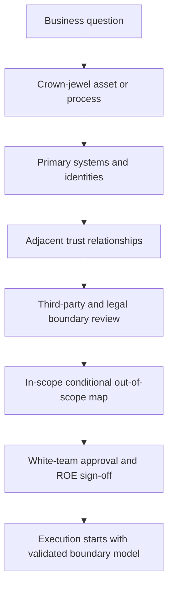

# Target Scoping

> **Difficulty:** Beginner → Advanced | **Category:** Red Teaming — Engagement Planning

Target scoping is the process of defining **what the red team may test, what it may approach carefully, and what it must not touch at all**. In professional red teaming, scope is not just a list of domains or IP ranges. It is a model of the organization, its crown jewels, its trust boundaries, and the legal and operational edges around the exercise.

Good scoping creates three benefits at the same time:

- it keeps the exercise safe,
- it makes the scenario more realistic,
- and it tells defenders what success should mean.

---

## Table of Contents

1. [What Scope Really Means](#1-what-scope-really-means)
2. [The Main Dimensions of Scope](#2-the-main-dimensions-of-scope)
3. [A Professional Scoping Workflow](#3-a-professional-scoping-workflow)
4. [Scoping Tiers and Gray Zones](#4-scoping-tiers-and-gray-zones)
5. [Operator and Defender Viewpoints](#5-operator-and-defender-viewpoints)
6. [A Practical Scoping Worksheet](#6-a-practical-scoping-worksheet)
7. [Scoping Checklist](#7-scoping-checklist)
8. [Common Mistakes](#8-common-mistakes)
9. [Why Good Scoping Improves Learning](#9-why-good-scoping-improves-learning)

---

## 1. What Scope Really Means

New practitioners often think scope means “the targets.” Mature teams think of scope as **the engagement boundary model**.

That model includes:

- technical assets,
- user and service identities,
- business processes,
- data classes,
- geographic and legal jurisdictions,
- third-party services,
- and approved methods.

In other words, scope is the answer to this question:

> “What parts of the organization are we allowed to simulate against, under what conditions, and what happens when realistic attack paths touch adjacent systems?”

### Why broad scope is not always good scope

A large scope can make a campaign look ambitious, but it often weakens the exercise if it is not tied to objectives. If everything is “in scope,” teams may spend time on noise instead of validating meaningful risk.

Good scoping is therefore **objective-led**, not asset-led.

---

## 2. The Main Dimensions of Scope

| Dimension | Questions to answer | Example planning concern |
|---|---|---|
| Assets | Which applications, hosts, domains, cloud accounts, offices, and networks matter? | Shared cloud resources may sit beside out-of-scope tenants |
| Identities | Which user types, admins, contractors, vendors, and service accounts matter? | A contractor identity may be realistic but contractually excluded |
| Data | Which information classes may be proved reachable, sampled, or never accessed? | Payroll, health, or customer data may require special proof rules |
| Business process | Which workflow is actually being validated? | Finance approval flows matter more than random servers |
| Geography | Which countries, legal regimes, or business units apply? | Regional privacy laws can change what is allowed |
| Methods | Are phishing, physical access, cloud abuse, or wireless elements allowed? | A method can be realistic but still excluded |
| Time | When may the team operate? | Blackout periods and change freezes affect both realism and safety |
| Third parties | What happens when realistic paths touch SaaS, MSPs, or partner infrastructure? | Adjacent services need explicit handling rules |

### Scope is often weakest around identity and SaaS

Traditional scoping focused on servers and networks. Modern scoping must also handle:

- single sign-on and identity providers,
- SaaS administration layers,
- shared collaboration platforms,
- cloud management planes,
- outsourced IT functions,
- and personal or BYOD boundaries.

These are often the places where ambiguity becomes dangerous.

---

## 3. A Professional Scoping Workflow

### What professional teams do in this phase

1. **Start from the business concern**
   - Example: “Can an external adversary reach finance reporting data?”
2. **Identify the direct technical path**
   - Which identities, apps, and services would realistically matter?
3. **Map the adjacent dependencies**
   - Identity provider, MFA platform, SaaS connector, MSP, cloud tenant, or contractor workflow.
4. **Mark the boundary states**
   - clearly in scope,
   - conditionally in scope,
   - or explicitly out of scope.
5. **Decide how gray zones will be handled during execution**
   - stop,
   - request a decision,
   - or prove the path using a safer method.

This is why scoping is inseparable from rules of engagement.

---

## 4. Scoping Tiers and Gray Zones

A useful way to scope modern red team exercises is to group assets by relationship to the objective.

| Tier | Meaning | Example |
|---|---|---|
| Tier 1 — Primary objective assets | Directly tied to the business question | Finance SaaS, privileged identity platform, executive mailbox |
| Tier 2 — Supporting path assets | Realistic stepping stones toward the objective | User workstations, VPN, SSO portal, cloud admin console |
| Tier 3 — Adjacent systems | Likely to be touched indirectly and must be governed carefully | Ticketing system, logging platform, partner tenant, shared storage |
| Tier 4 — Out of scope | Must not be touched beyond approved safety handling | Third-party providers, unrelated subsidiaries, regulated data stores with no approval |

### The gray zone problem

Most scope mistakes happen in Tier 3. These systems are not the objective, but realistic attack paths often pass near them.

Good plans decide in advance what to do when the red team reaches a gray-zone asset:

- stop and notify,
- use read-only proof only,
- capture metadata without interacting further,
- or escalate for case-by-case approval.

### Scope is about path realism, not just endpoints

If a realistic adversary path depends on identity, email, VPN, or cloud control-plane relationships, the scope model has to account for that path. Otherwise the campaign either becomes unrealistic or drifts into unauthorized activity.

---

## 5. Operator and Defender Viewpoints

| Topic | Operator view | Defender / stakeholder view |
|---|---|---|
| Objective boundary | “What do I need to touch to answer the business question?” | “Are we testing the right systems, not just the easy ones?” |
| Adjacent platforms | “If the path crosses SaaS or a partner service, what do I do?” | “Have we protected third-party and legal boundaries?” |
| High-risk assets | “What is the approved proof method here?” | “Can the exercise validate exposure without unnecessary data access?” |
| Identity scope | “Which users or roles are fair game?” | “Are sensitive roles or executives treated appropriately?” |
| Detection planning | “Which teams should plausibly observe this activity?” | “Can defenders interpret results because the scope was clear?” |

A well-scoped exercise makes both execution and interpretation easier. Defenders know what the red team was trying to validate, and operators know where realism stops and authorization begins.

---

## 6. A Practical Scoping Worksheet

| Category | Example questions | Example output |
|---|---|---|
| Business objective | What are we trying to prove? | “Can an external actor reach payroll reporting?” |
| Crown-jewel process | Which process matters most? | Payroll approval and reporting workflow |
| Core systems | Which systems directly support it? | SSO, payroll SaaS, admin portal |
| Identities | Which roles matter? | Standard user, payroll analyst, cloud admin |
| Sensitive data | What can be viewed, sampled, or must remain untouched? | Metadata only; no bulk employee records |
| Adjacent systems | What dependencies might realistically appear? | Ticketing, email, file storage, MSP portal |
| Third parties | Where must the team stop or escalate? | Partner-hosted HR integrations |
| Approved methods | Which simulation methods are allowed? | Limited phishing, cloud identity simulation, safe proof only |
| Exclusions | What is explicitly off-limits? | Subsidiary environments, customer tenants, destructive actions |

This type of worksheet forces ambiguity into the open before the exercise begins.

---

## 7. Scoping Checklist

### Boundary checklist

- [ ] In-scope assets are mapped to a business objective
- [ ] High-value identities are handled explicitly
- [ ] Third-party and shared-service boundaries are documented
- [ ] Geographic and legal constraints are reviewed
- [ ] Sensitive data handling rules are defined

### Realism checklist

- [ ] The scope reflects realistic attacker paths, not only infrastructure ownership
- [ ] Adjacent systems that may be encountered are categorized in advance
- [ ] Safe proof methods exist for crown-jewel assets
- [ ] The SOC and white team can interpret what the exercise is meant to validate

### Operational checklist

- [ ] Out-of-scope behavior is defined
- [ ] Edge cases trigger escalation, not improvisation
- [ ] Contact paths exist for scope clarifications during execution
- [ ] Scope assumptions are recorded in planning artifacts

---

## 8. Common Mistakes

### 1. Scoping by asset inventory only

This produces long target lists without a realistic scenario.

### 2. Forgetting the identity plane

Modern attacks often depend more on identity relationships than on raw network reachability.

### 3. Ignoring third-party adjacency

Shared SaaS and external providers create the most dangerous scope misunderstandings.

### 4. Treating “in scope” as permission for all methods

Scope and method authorization are related, but not identical.

### 5. Not defining what happens at the boundary

If the team reaches an adjacent service and no one knows whether to continue, planning was incomplete.

---

## 9. Why Good Scoping Improves Learning

Good scoping helps an exercise answer meaningful questions such as:

- which path mattered,
- what controls protected the path,
- where boundaries blocked the team,
- and whether the objective was realistically reachable.

It also prevents bad lessons. Poorly scoped exercises create findings that are hard to trust because nobody is sure whether the team tested the intended path, crossed a hidden boundary, or chased an objective with the wrong assumptions.

Strong scoping makes the final report sharper because every action can be connected back to an approved boundary model.

---

> **Defender mindset:** Good scoping protects people and systems, keeps the scenario realistic, and ensures the exercise answers a business question instead of becoming uncontrolled exploration.
