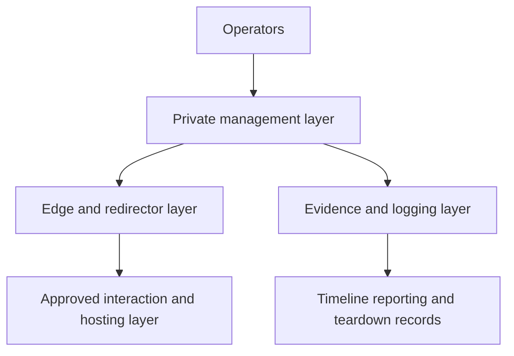

# Attack Infrastructure

> **Difficulty:** Beginner → Advanced | **Category:** Red Teaming — Infrastructure

Attack infrastructure is the collection of systems, domains, cloud resources, certificates, logging paths, and operational controls that support an authorized red team exercise. In professional red teaming, infrastructure is treated as **a safety-critical platform**, not as an afterthought.

That mindset matters because infrastructure choices affect all of the following at once:

- realism,
- cost,
- observability,
- legal and policy compliance,
- operator safety,
- and the quality of final evidence.

---

## Table of Contents

1. [What Counts as Attack Infrastructure](#1-what-counts-as-attack-infrastructure)
2. [Core Design Principles](#2-core-design-principles)
3. [A Layered Reference Architecture](#3-a-layered-reference-architecture)
4. [Infrastructure Lifecycle in a Real Engagement](#4-infrastructure-lifecycle-in-a-real-engagement)
5. [Design Tradeoffs That Matter](#5-design-tradeoffs-that-matter)
6. [Operator and Defender Viewpoints](#6-operator-and-defender-viewpoints)
7. [Infrastructure Planning Checklist](#7-infrastructure-planning-checklist)
8. [Common Mistakes](#8-common-mistakes)
9. [Why Infrastructure Quality Shapes Reporting](#9-why-infrastructure-quality-shapes-reporting)

---

## 1. What Counts as Attack Infrastructure

In beginner discussions, people often reduce infrastructure to “a server.” Mature teams think much more broadly.

Typical red team infrastructure may include:

- domains and DNS records approved for the engagement,
- cloud or hosting resources used for public-facing interaction,
- edge systems such as reverse proxies or redirectors,
- core management systems kept away from direct public exposure,
- artifact or payload hosting for approved exercise content,
- evidence storage and timeline systems,
- certificates, access controls, and health monitoring,
- and teardown procedures for end-of-engagement cleanup.

### Relevant ATT&CK concepts

MITRE ATT&CK helps frame several pieces of this topic at a high level:

| ATT&CK concept | Why it matters here |
|---|---|
| T1583.001 — Acquire Infrastructure: Domains | Domain selection and registration create visibility, branding, and policy considerations |
| T1583.003 — Acquire Infrastructure: VPS | Cloud and VPS choices affect speed, reputation, cost, and traceability |
| T1090 — Proxy | Layered routing and exposure separation matter for both realism and detection |

These references are useful for understanding the adversary tradecraft being simulated, not for copying it blindly.

---

## 2. Core Design Principles

Professional infrastructure usually follows a small set of principles.

| Principle | What it means in practice | Why it matters |
|---|---|---|
| Separation of duties | Public-facing systems, management systems, and evidence stores are isolated | Limits the blast radius of mistakes |
| Least privilege | Operators get only the access they need, and infrastructure services are tightly scoped | Reduces accidental exposure |
| Observability | Logs, health checks, and timelines are built in from the start | Makes troubleshooting and reporting credible |
| Ephemerality | Assets are created for the engagement and retired cleanly afterward | Reduces reuse patterns and cleanup risk |
| Traceability | Ownership, purpose, and change history are documented | Supports audits, lessons learned, and reporting |
| Policy compliance | Infrastructure choices honor ROE, provider policy, and legal boundaries | Prevents “realistic” from becoming unauthorized |

### Why simplicity often wins

Complex infrastructure can look advanced, but every extra layer increases:

- setup effort,
- troubleshooting complexity,
- operator error potential,
- and the chance of exposing metadata defenders can correlate.

Mature teams therefore choose the **simplest architecture that still answers the exercise question**.

---

## 3. A Layered Reference Architecture

### Why layering matters

This separation lets teams do several important things safely:

- keep administrative access off the public path,
- collect evidence without exposing it through the edge,
- rotate or retire edge systems without rebuilding the entire platform,
- and isolate infrastructure failures more quickly.

### A useful mental model

Think of red team infrastructure like enterprise infrastructure:

- the edge handles exposure,
- the core handles management,
- and the evidence plane preserves truth.

If those roles are mixed carelessly, both operators and defenders get worse outcomes.

---

## 4. Infrastructure Lifecycle in a Real Engagement

Infrastructure work usually follows a lifecycle instead of a one-time setup.

| Phase | Typical questions |
|---|---|
| Design | What components are needed to support the objectives safely? |
| Provisioning | Which assets, providers, and access controls are approved? |
| Validation | Do DNS, TLS, logging, and health checks work as expected? |
| Operation | Can the team observe, troubleshoot, and document activity cleanly? |
| Adaptation | If the campaign changes, can infrastructure change without losing evidence? |
| Retirement | Are assets torn down, logs retained appropriately, and credentials revoked? |

### What professional teams do differently

They plan the end state at the beginning:

- who owns each asset,
- how long it should exist,
- what logs must be retained,
- and how teardown will be confirmed.

That makes infrastructure easier to explain and safer to remove.

---

## 5. Design Tradeoffs That Matter

| Decision area | Tradeoff |
|---|---|
| Cloud convenience vs control | Cloud resources are fast to provision but may expose more provider metadata and policy constraints |
| Reputation vs uniqueness | Common providers may blend better, but reuse and provider controls can create their own signals |
| Centralization vs resilience | Centralized infrastructure is easier to manage, while distributed infrastructure can reduce single points of failure but increases complexity |
| Logging depth vs operational exposure | More telemetry helps reporting, but sensitive evidence stores require stronger protection |
| Reuse vs ephemerality | Reuse saves time, while one-off assets reduce pattern repetition and cleanup ambiguity |

### Practical operator workflow

Professional teams usually decide these tradeoffs in this order:

1. what the objective requires,
2. what ROE and policy allow,
3. what evidence must be preserved,
4. and only then what is fastest or cheapest.

That order keeps infrastructure aligned with the engagement instead of the other way around.

---

## 6. Operator and Defender Viewpoints

| Topic | Operator view | Defender view |
|---|---|---|
| Layering | “How do I isolate public exposure from core management?” | “Which layer gives me the most useful telemetry?” |
| Provider choice | “Which environment supports the scenario with acceptable risk?” | “What provider metadata or reputation signals can I correlate?” |
| Evidence | “Can I reconstruct the timeline if something changes quickly?” | “Will the final report show enough context to validate the conclusion?” |
| Teardown | “What must be removed, retained, or revoked at the end?” | “Can the client be confident nothing was left behind?” |
| Reuse patterns | “Will reused infrastructure save time or create detectable patterns?” | “Can recurring certificates, domains, or hosting relationships expose campaign linkage?” |

The strongest infrastructure choices usually improve both offensive control and defensive understanding.

---

## 7. Infrastructure Planning Checklist

- [ ] Every infrastructure asset has a defined role and owner
- [ ] Public-facing and administrative functions are separated
- [ ] DNS, TLS, and health validation are planned before live use
- [ ] Logging and evidence storage are protected and tested
- [ ] Provider policy and legal boundaries were reviewed
- [ ] High-risk assets have limited exposure windows
- [ ] Teardown and credential revocation are planned in advance
- [ ] Infrastructure supports the objectives instead of driving them

---

## 8. Common Mistakes

### 1. Combining too many roles on one system

This increases risk and weakens evidence quality.

### 2. Treating observability as optional

If the team cannot explain what happened later, the infrastructure was incomplete.

### 3. Reusing stale assets casually

Old domains, certificates, or hosts can create needless attribution and hygiene problems.

### 4. Ignoring provider policy and legal boundaries

An infrastructure design can be technically possible and still professionally inappropriate.

### 5. Forgetting teardown as part of design

Cleanup is not the end of infrastructure work. It is one of its requirements.

---

## 9. Why Infrastructure Quality Shapes Reporting

Infrastructure quality affects whether the red team can tell a trustworthy story about the exercise.

Good infrastructure helps answer:

- which systems were involved,
- when key events occurred,
- what evidence supports the objective outcome,
- where defender telemetry should have existed,
- and whether the exercise stayed within approved boundaries.

Poor infrastructure creates uncertainty in exactly those areas.

That is why professional teams treat infrastructure not as “ops plumbing,” but as one of the foundations of a credible engagement.

---

> **Defender mindset:** Infrastructure topics matter because architecture, metadata, and operator discipline often determine what defenders can observe long before content inspection or signatures help.
