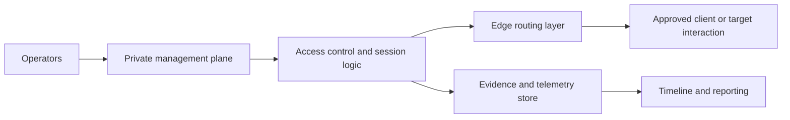

# Command and Control Architecture

> **Difficulty:** Beginner → Advanced | **Category:** Red Teaming — Infrastructure

Command and control (C2) architecture describes how an authorized red team structures remote coordination, access control, evidence capture, and operational resilience during an exercise. The important lesson is not the brand of tool used. It is the **system design around communication**.

In a professional setting, C2 architecture is where operational realism, safety controls, and defender telemetry often meet most clearly.

---

## Table of Contents

1. [What C2 Means in Red Teaming](#1-what-c2-means-in-red-teaming)
2. [Main Architectural Layers](#2-main-architectural-layers)
3. [A Reference C2 Architecture](#3-a-reference-c2-architecture)
4. [Design Tradeoffs](#4-design-tradeoffs)
5. [Detection and Observation Surfaces](#5-detection-and-observation-surfaces)
6. [Operator and Defender Viewpoints](#6-operator-and-defender-viewpoints)
7. [C2 Architecture Checklist](#7-c2-architecture-checklist)
8. [Common Mistakes](#8-common-mistakes)
9. [Why Architecture Matters More Than Tool Choice](#9-why-architecture-matters-more-than-tool-choice)

---

## 1. What C2 Means in Red Teaming

At a basic level, C2 is the control channel that lets operators coordinate activity during an engagement. At a mature level, C2 architecture is about much more than “sending commands.” It includes:

- who can access which systems,
- how management traffic is separated from public traffic,
- how evidence and logs are preserved,
- how edge exposure is controlled,
- and how the team responds if a communication path is disrupted or observed.

### Relevant ATT&CK ideas

| ATT&CK concept | Why it is useful here |
|---|---|
| T1071 — Application Layer Protocol | Shows why common protocols matter for blending and detection |
| T1090 — Proxy | Explains why layered routing and intermediaries appear in real operations |
| T1090.003 — Multi-hop Proxy | Highlights how additional hops add resilience and attribution difficulty but also complexity |

These are helpful as conceptual anchors for defenders and planners alike.

---

## 2. Main Architectural Layers

A useful way to reason about C2 is to separate it into planes.

| Layer | Purpose |
|---|---|
| Operator plane | Where human operators authenticate, coordinate, and review state |
| Management plane | Where tasks, sessions, access control, and orchestration are handled |
| Edge plane | Where public-facing communication and routing occur |
| Evidence plane | Where logs, telemetry, and campaign timelines are stored |
| Recovery plane | How the team handles path loss, rotation, and teardown |

### Why separation matters

If the edge plane is exposed, the management and evidence planes should still remain protected. If logging fails, the team should still be able to operate safely or decide to pause. If one communication path becomes visible or blocked, the exercise should not automatically lose all continuity.

---

## 3. A Reference C2 Architecture

### What this architecture is trying to achieve

- keep operator access separate from public interaction,
- capture evidence continuously,
- allow the edge to be rotated or retired independently,
- and make it easier to explain which layer defenders could have observed.

This kind of thinking matters more than copying a specific commercial or open-source framework.

---

## 4. Design Tradeoffs

| Design choice | Benefits | Costs |
|---|---|---|
| Centralized control | Simpler administration, easier logging, faster coordination | More obvious single points of failure |
| Distributed control | Better resilience and separation | More operator complexity and harder timeline reconstruction |
| Cloud-hosted edge | Fast deployment and flexible scale | Provider telemetry, metadata, and policy constraints |
| More hops | Better segmentation and sometimes better realism | Higher latency, more troubleshooting, more exposed metadata |
| Rich logging | Stronger reporting and easier troubleshooting | More sensitive evidence to protect |

### The most important tradeoff

Every C2 design balances **operational convenience** against **defensive exposure and governance requirements**. Mature teams accept a little inconvenience if it leads to cleaner evidence, safer access control, and easier teardown.

---

## 5. Detection and Observation Surfaces

Defenders rarely need to see the content of communication to learn something useful. Metadata is often enough.

| Observation surface | Defender question |
|---|---|
| DNS lookups and TTL patterns | Is this destination normal for this environment? |
| TLS certificates and handshake metadata | Do certificate reuse, issuer patterns, or JA3-like signals stand out? |
| Connection timing and regularity | Does the traffic behave like a human workflow or a machine-driven control path? |
| Hosting and ASN relationships | Are multiple suspicious domains clustered under related providers? |
| Identity access to management systems | Are privileged sessions, tokens, or remote admin paths appearing unusually? |
| Edge infrastructure behavior | Do headers, redirects, or proxy fingerprints reveal an intermediary layer? |

### Why defenders should care about architecture

If defenders understand the likely layers of a C2 design, they can build detections that survive tool changes. Tools come and go. Architectural weaknesses and telemetry opportunities usually last longer.

---

## 6. Operator and Defender Viewpoints

| Topic | Operator view | Defender view |
|---|---|---|
| Segmentation | “Can I isolate the edge from the management core?” | “Which layer can I monitor most reliably?” |
| Resilience | “If a path is disrupted, what is the safe fallback?” | “What changes in traffic or routing would suggest adaptation?” |
| Evidence | “Can I preserve timestamps and context cleanly?” | “Can I map what I saw to the actual campaign phases?” |
| Access control | “Who inside the red team should reach each layer?” | “Are there admin or token anomalies around supporting systems?” |
| Public exposure | “How much of the architecture must be internet-facing?” | “Where can proxy, certificate, or hosting metadata help?” |

---

## 7. C2 Architecture Checklist

- [ ] Operator, edge, and evidence functions are separated
- [ ] Administrative access is not exposed through the public layer
- [ ] Logging and timeline collection are tested before use
- [ ] Fallback and recovery expectations are defined
- [ ] Provider policy and ROE constraints are respected
- [ ] Public-facing components can be rotated or retired safely
- [ ] The architecture is explainable in the final report

---

## 8. Common Mistakes

### 1. Equating C2 with a single tool

Architecture is a design problem, not a product decision.

### 2. Adding complexity without a reason

Extra layers only help when they answer a real operational or safety need.

### 3. Exposing management and edge functions together

That undermines segmentation and increases risk.

### 4. Forgetting evidence protection

The same systems that help the campaign run often hold the most sensitive post-exercise data.

### 5. Assuming encryption solves detection

Encrypted content still produces timing, routing, certificate, and identity metadata.

---

## 9. Why Architecture Matters More Than Tool Choice

Teams often focus on which framework was used. That is usually the least durable lesson.

More valuable questions are:

- how the communication path was exposed,
- where logs existed,
- which layers defenders could have seen,
- how access was segmented,
- and what operational decisions the architecture enabled or constrained.

Those are the lessons defenders can use again even after tools and tactics change.

---

> **Defender mindset:** C2 architecture is best understood as a systems-design problem. The most durable detections usually come from metadata, layering, and access patterns rather than from tool-specific signatures.
