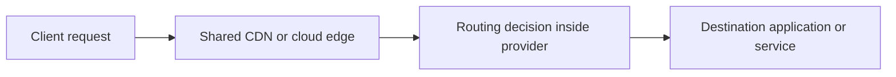

# Domain Fronting

> **Difficulty:** Beginner → Advanced | **Category:** Red Teaming — Infrastructure

Domain fronting is best understood today as a **historical and architectural case study** about how shared cloud and CDN infrastructure can separate one layer of a request from another. It became well known because it challenged simple destination-based trust and filtering models. It also became controversial enough that many major providers changed behavior or policy to restrict it.

For modern red team education, the important goal is to understand:

- how different protocol layers expose different truths,
- why shared infrastructure changes defender visibility,
- and why provider policy matters just as much as protocol behavior.

This note intentionally stays at the architecture and detection level rather than turning the topic into an unsafe how-to guide.

---

## Table of Contents

1. [The Core Concept](#1-the-core-concept)
2. [Why Domain Fronting Became Important](#2-why-domain-fronting-became-important)
3. [A Protocol-Layer View](#3-a-protocol-layer-view)
4. [Modern Reality and Policy Constraints](#4-modern-reality-and-policy-constraints)
5. [What Defenders and Red Teams Should Learn](#5-what-defenders-and-red-teams-should-learn)
6. [Operator and Defender Viewpoints](#6-operator-and-defender-viewpoints)
7. [Planning Questions and Safety Boundaries](#7-planning-questions-and-safety-boundaries)
8. [Common Misunderstandings](#8-common-misunderstandings)
9. [Key Lesson](#9-key-lesson)

---

## 1. The Core Concept

Historically, domain fronting relied on the fact that shared front-end infrastructure could process different routing information at different layers. The visible outer destination seen early in the connection path could differ from the application-layer destination chosen later by the provider’s shared routing logic.

The educational value is not the old trick itself. The educational value is this:

> Security teams must reason across DNS, TLS, HTTP, CDN behavior, and cloud routing rather than assuming one visible hostname always tells the full story.

---

## 2. Why Domain Fronting Became Important

Domain fronting became important because it showed how easy it is to over-trust shallow network indicators.

It drew attention for several reasons:

- shared cloud edges can mask many destinations behind a common provider surface,
- different protocol layers may reveal different information,
- defenders and policy teams often depend on simple destination-based rules,
- and provider architecture decisions can have large security consequences.

### Why the topic still belongs in modern notes

Even where domain fronting is restricted today, the lesson still matters for:

- CDN-backed applications,
- shared ingress architectures,
- proxy-aware detections,
- egress allow-list design,
- and cloud trust decisions.

---

## 3. A Protocol-Layer View

### What defenders should take from this

The same request can be described differently depending on where you observe it:

| Observation point | What you may learn |
|---|---|
| DNS | Which names were resolved |
| Early connection metadata | Which shared edge or provider was contacted |
| TLS metadata | Which server name or certificate behavior was presented |
| HTTP or proxy logs | Which application-layer host or route was requested |
| Provider-side telemetry | How the edge decided where to send the request |

This is why layered telemetry is so important in modern environments.

---

## 4. Modern Reality and Policy Constraints

Many cloud and CDN providers changed platform behavior or terms of service after domain fronting became widely discussed. That means the modern red team lesson is less about “using” it and more about understanding:

- provider enforcement,
- shared-edge visibility,
- routing-layer assumptions,
- and the risk of relying on outdated tradecraft folklore.

### Why policy matters

A behavior can be technically conceivable and still be:

- unsupported by the provider,
- blocked in practice,
- or explicitly outside the rules of an authorized engagement.

Professional teams therefore treat domain fronting as a topic that requires **explicit policy, legal, and ROE review** before it is even discussed as part of a modern scenario.

---

## 5. What Defenders and Red Teams Should Learn

| Lesson | Why it matters |
|---|---|
| Shared infrastructure changes visibility | A provider edge may hide meaningful routing details from shallow monitoring |
| One hostname is not the whole story | Different protocol layers can reveal different truths |
| Allow-lists need depth | Trusting a provider name alone may be too coarse |
| Provider telemetry is valuable | Cloud-native logs can reveal what perimeter logs miss |
| Historical techniques age out | Mature teams validate current feasibility and policy instead of repeating old assumptions |

### Detection thinking

Defenders should ask:

- Do we see only the outer provider edge, or do we also see application-layer context?
- Are our egress controls tied to real business need or broad provider trust?
- Do our proxy, CDN, or cloud logs help us reconcile what happened at each layer?

Those questions remain valuable even if domain fronting itself is not a realistic modern option in the environment.

---

## 6. Operator and Defender Viewpoints

| Topic | Operator view | Defender view |
|---|---|---|
| Feasibility | “Is this even possible or permitted in the current provider landscape?” | “Do our controls assume too much from a single network signal?” |
| Policy | “Would this violate provider rules or engagement boundaries?” | “Do we understand the limits of our cloud and CDN visibility?” |
| Telemetry | “Which layers would the defender realistically see?” | “Can we correlate DNS, TLS, proxy, and cloud logs?” |
| Scenario value | “Does this teach something current, or is it just historical trivia?” | “What architectural lesson should we keep even if the exact method is old?” |

---

## 7. Planning Questions and Safety Boundaries

Before domain-fronting-style discussion appears anywhere near a real engagement, mature teams ask:

- [ ] Is the behavior current and allowed by the provider?
- [ ] Does the ROE explicitly allow this type of network path or shared-service scenario?
- [ ] Is there a safer way to test the same defensive assumption?
- [ ] Would a conceptual tabletop or purple-team replay teach the lesson with less operational risk?
- [ ] Do defenders have enough multi-layer telemetry to make the exercise useful?
- [ ] Has legal, policy, and cloud-governance review happened before any live discussion?

### The professional default

If the main lesson is about visibility across layers, many organizations are better served by:

- defensive architecture review,
- cloud logging validation,
- purple-team simulation,
- or controlled tabletop discussion,

rather than trying to force an outdated technique into a live exercise.

---

## 8. Common Misunderstandings

### 1. “Encryption hides everything”

It does not. Routing, metadata, provider logs, and policy context still matter.

### 2. “If a CDN is involved, all traffic looks the same”

Shared edges create ambiguity, but not invisibility.

### 3. “Domain fronting is just an attacker trick”

It is also a cloud architecture, governance, and detection topic.

### 4. “Historical equals irrelevant”

Even older techniques can teach enduring lessons about trust boundaries and telemetry.

### 5. “If it once worked, it is fair game now”

Modern provider restrictions and ROE boundaries make that assumption unsafe.

---

## 9. Key Lesson

The durable lesson of domain fronting is not how to reproduce it. The durable lesson is:

> **Different layers of a connection can expose different truths, and defenders who rely on only one of them are easier to mislead.**

That is why mature defenders combine DNS, TLS, proxy, cloud, and application telemetry when reasoning about shared infrastructure.

---

> **Defender mindset:** Use domain fronting as a case study in protocol layering, cloud trust, and provider visibility—not as a shortcut to unsafe operational playbooks.
