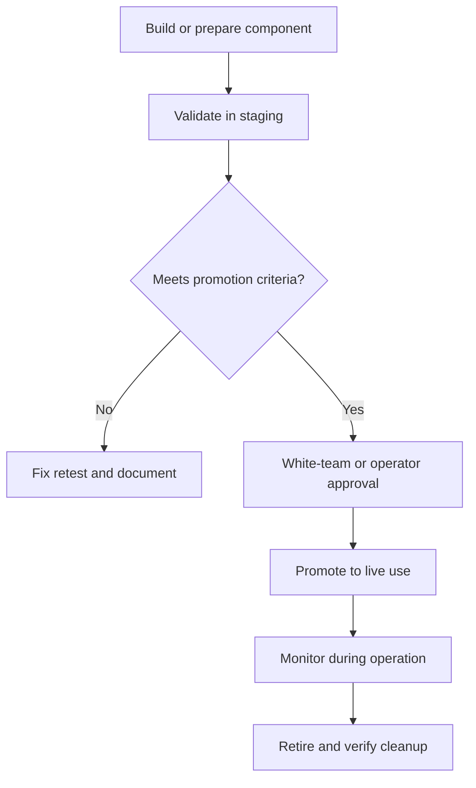

# Staging Infrastructure

> **Difficulty:** Beginner → Advanced | **Category:** Red Teaming — Infrastructure

Staging infrastructure is the intermediate layer where red team components are prepared, validated, and promoted before they are exposed to live interaction. The same idea exists in software engineering: you do not push directly to production if you care about reliability. Mature red team programs apply the same discipline to infrastructure.

Staging matters because it improves:

- safety,
- evidence quality,
- operator confidence,
- and the credibility of the final exercise.

---

## Table of Contents

1. [What Staging Means in Red Teaming](#1-what-staging-means-in-red-teaming)
2. [What Gets Validated in Staging](#2-what-gets-validated-in-staging)
3. [A Promotion Workflow](#3-a-promotion-workflow)
4. [Real Engagement Uses for Staging](#4-real-engagement-uses-for-staging)
5. [Why Defenders Benefit from Understanding Staging](#5-why-defenders-benefit-from-understanding-staging)
6. [Operator and Defender Viewpoints](#6-operator-and-defender-viewpoints)
7. [Staging Checklist](#7-staging-checklist)
8. [Common Mistakes](#8-common-mistakes)
9. [Why Staging Builds Trust](#9-why-staging-builds-trust)

---

## 1. What Staging Means in Red Teaming

In red team operations, staging is the environment or process used to validate infrastructure before it becomes part of a live campaign. That can include:

- DNS and certificate validation,
- hosting checks,
- redirector behavior review,
- access control review,
- logging and evidence pipeline validation,
- and teardown rehearsal.

### Staging is not about adding drama

Its job is to remove preventable surprises. If an issue can be found in staging, it should not be discovered for the first time when the exercise is already affecting the client environment.

---

## 2. What Gets Validated in Staging

| Validation area | Why it matters |
|---|---|
| DNS and naming | Confirms assets resolve as intended and are tied to the right layer |
| TLS and certificates | Ensures identity, trust, and metadata are understood |
| Access control | Verifies who can reach management, hosting, and evidence systems |
| Logging | Confirms events are actually captured and timestamped correctly |
| Health endpoints | Makes troubleshooting faster and safer |
| Retirement workflow | Ensures cleanup can happen cleanly at the end |

### Benign examples

```bash
curl -I https://staging.example.test/health
dig +short staging.example.test
```

These are harmless checks used to validate infrastructure readiness.

---

## 3. A Promotion Workflow



### Why promotion criteria matter

Without explicit promotion criteria, teams tend to rely on optimism. Mature teams want objective answers to questions like:

- Are logs arriving?
- Are certificates correct?
- Are admin paths protected?
- Is the evidence path working?
- Can the component be removed safely?

---

## 4. Real Engagement Uses for Staging

| Use case | Why staging helps |
|---|---|
| New edge component | Prevents broken routing or metadata leakage in live use |
| Hosting change | Validates access logging and integrity before exposure |
| Certificate rotation | Confirms the new certificate chain and timing are understood |
| Logging pipeline change | Prevents silent evidence loss during the campaign |
| Cleanup rehearsal | Reduces the chance of leaving assets or access behind |

### A realistic operator workflow

During a professional engagement, operators often:

1. prepare the asset,
2. validate it in staging,
3. record the outcome,
4. get sign-off if required,
5. promote it to the live architecture,
6. and monitor it as part of the campaign timeline.

That process is less glamorous than improvised setup, but far more reliable.

---

## 5. Why Defenders Benefit from Understanding Staging

Defenders gain value from staging awareness because mature adversaries and mature red teams both prepare infrastructure before relying on it. The signs of preparation may include:

- new but lightly used domains,
- short-lived test endpoints,
- certificate changes,
- provider or routing shifts,
- or unusual low-volume validation traffic.

Understanding staging helps defenders think earlier in the lifecycle instead of waiting only for end-stage activity.

---

## 6. Operator and Defender Viewpoints

| Topic | Operator view | Defender view |
|---|---|---|
| Validation | “Can I prove this component works before exposing it?” | “Can early preparation signals tell me something useful?” |
| Logging | “Will I lose evidence if this changes mid-campaign?” | “Did we have visibility before the main activity started?” |
| Cleanup | “Can I remove this quickly and confidently?” | “Can we verify retirement and absence of lingering exposure?” |
| Promotion gates | “Who needs to approve live use?” | “Does governance exist before risk increases?” |

---

## 7. Staging Checklist

- [ ] DNS, TLS, and access controls were validated in staging
- [ ] Logging and timestamp accuracy were confirmed
- [ ] Health checks exist and are documented
- [ ] Promotion criteria are explicit, not assumed
- [ ] Required sign-offs are known
- [ ] Rollback and teardown were considered before live use
- [ ] Staging and live environments are close enough to make validation meaningful

---

## 8. Common Mistakes

### 1. Skipping staging because the setup “looks simple”

Simple systems can still fail in ways that hurt evidence or safety.

### 2. Letting staging and live drift too far apart

If they are too different, staging results stop being useful.

### 3. Validating the service but not the logs

A component that works but leaves no evidence is still a problem.

### 4. Treating teardown as someone else’s job

Retirement must be part of the staged workflow.

### 5. Forgetting human approvals

Some promotion decisions are governance decisions, not just technical ones.

---

## 9. Why Staging Builds Trust

Organizations permit stronger exercises when they believe the team is disciplined. Staging is one of the clearest signals of that discipline because it shows the team does not want to discover preventable issues in the live environment.

In that sense, staging is more than a technical practice. It is a trust-building practice.

---

> **Defender mindset:** Staging infrastructure teaches defenders to watch for preparation, validation, and change activity—not just the final visible phase of a campaign.
