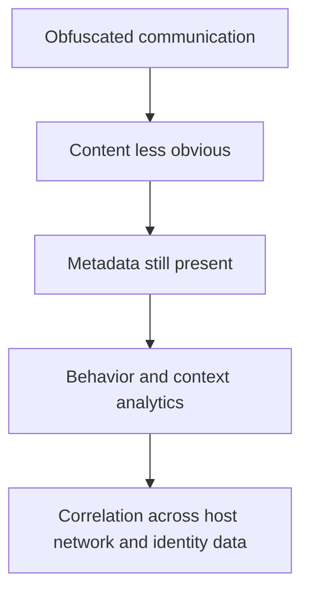

# Traffic Obfuscation

> **Difficulty:** Beginner → Advanced | **Category:** Red Teaming — Infrastructure

Traffic obfuscation is the practice of making communication patterns **harder to classify, correlate, or prioritize**. In authorized red team work, the value of this topic is understanding the contest between signal reduction and defender analytics—not providing step-by-step instructions for concealing harmful activity.

Professional teams study traffic obfuscation because it affects:

- what defenders can observe,
- how realistic a campaign feels,
- how expensive communication becomes to operate,
- and how much evidence the red team can still preserve cleanly.

---

## Table of Contents

1. [What Obfuscation Tries to Change](#1-what-obfuscation-tries-to-change)
2. [Major Obfuscation Categories](#2-major-obfuscation-categories)
3. [A Layered Visibility Model](#3-a-layered-visibility-model)
4. [Tradeoffs in Real Engagements](#4-tradeoffs-in-real-engagements)
5. [Defender Observation and Analytics](#5-defender-observation-and-analytics)
6. [Operator and Defender Viewpoints](#6-operator-and-defender-viewpoints)
7. [Planning Checklist](#7-planning-checklist)
8. [Common Mistakes](#8-common-mistakes)
9. [Key Lesson](#9-key-lesson)

---

## 1. What Obfuscation Tries to Change

Obfuscation usually targets one or more observable properties of traffic:

- content,
- protocol appearance,
- timing,
- size and chunking,
- destination patterns,
- or infrastructure pathing.

The goal is rarely perfect invisibility. The goal is usually to make traffic:

- slower to classify,
- harder to baseline,
- or more expensive to investigate confidently.

That is why defenders should think in terms of **analytics and correlation**, not just signatures.

---

## 2. Major Obfuscation Categories

| Category | High-level meaning | What defenders should remember |
|---|---|---|
| Encryption | Hides payload content | Metadata, timing, and destination context still remain |
| Protocol blending | Makes traffic resemble common enterprise protocols | Process context and behavior often still matter |
| Timing variation | Reduces obvious interval patterns | Long-term baselining can still detect unusual regularity or rarity |
| Size shaping | Alters packet or response size patterns | Distribution and consistency may still look odd |
| Path indirection | Uses intermediate infrastructure to complicate attribution | Hosting, DNS, and certificate relationships still offer clues |

### ATT&CK tie-in

MITRE ATT&CK T1071 highlights the importance of application-layer protocols for blending with ordinary traffic. The defender lesson is that “common protocol” does not mean “benign context.”

---

## 3. A Layered Visibility Model

### Why this matters

Even if content becomes harder to inspect, defenders can still ask:

- Which process created the connection?
- Is the destination rare or newly seen?
- Is the timing machine-like?
- Does the certificate, provider, or ASN fit normal business use?
- Did this appear alongside suspicious identity or host activity?

This is why obfuscation rarely defeats mature detection on its own.

---

## 4. Tradeoffs in Real Engagements

| Tradeoff | Practical consequence |
|---|---|
| More signal reduction | Harder for defenders to classify quickly, but more complex for operators to troubleshoot |
| More protocol mimicry | Better blending potential, but more chances for subtle inconsistency |
| More timing variation | Less obvious periodicity, but harder to correlate with operator actions and evidence |
| More path indirection | Better separation and attribution difficulty, but more metadata to correlate across layers |
| More complexity overall | Potentially more realism in some scenarios, but easier to break or mis-explain in reporting |

### The professional question

Teams should ask:

> “What level of obfuscation is actually needed to answer the exercise question?”

Anything beyond that may add cost without improving learning.

---

## 5. Defender Observation and Analytics

| Defender lens | Useful question |
|---|---|
| Host context | Which process, user, or service created the traffic? |
| Destination rarity | Is this destination normal for this host or business unit? |
| Timing analysis | Does the cadence look automated or human-driven? |
| TLS and certificate analysis | Are there certificate, JA3-like, or issuer patterns worth correlating? |
| Network pathing | Are provider, ASN, or DNS relationships unusual? |
| Multi-source correlation | Did suspicious network behavior align with identity or endpoint events? |

### Why defenders still win sometimes

Obfuscation reduces some signals, but defenders often regain advantage through:

- baselining,
- long-horizon analytics,
- identity correlation,
- host telemetry,
- and cloud or proxy logs.

That is the real lesson of the topic.

---

## 6. Operator and Defender Viewpoints

| Topic | Operator view | Defender view |
|---|---|---|
| Blending | “Does this resemble something normal enough for the scenario?” | “Is the behavior normal for this process, host, and time?” |
| Complexity | “Will this make troubleshooting or cleanup harder?” | “Can complexity itself create anomalies or edge-case fingerprints?” |
| Evidence | “Can I still explain what happened if timing and paths vary?” | “Can I reconstruct activity from metadata even if content is opaque?” |
| Detection | “Which signals am I reducing, and which remain?” | “What signals are still strong enough for correlation?” |

---

## 7. Planning Checklist

- [ ] The reason for using additional obfuscation is tied to the scenario
- [ ] The ROE and safety model still allow clean evidence collection
- [ ] Operators understand the troubleshooting cost of additional complexity
- [ ] Defenders have meaningful telemetry sources beyond payload inspection
- [ ] Metadata, certificate, and destination patterns were considered explicitly
- [ ] The campaign can still be explained clearly in the final report

---

## 8. Common Mistakes

### 1. Equating obfuscation with stealth

Reducing one signal may increase another.

### 2. Forgetting host and identity context

Traffic is only one part of defender visibility.

### 3. Making the exercise too complex to explain

If reporting becomes unclear, the extra complexity probably was not worth it.

### 4. Assuming enterprise protocols are automatically safe cover

Common protocols still look strange when used in strange contexts.

### 5. Ignoring operator cost

More complexity often means slower adaptation and worse evidence discipline.

---

## 9. Key Lesson

Traffic obfuscation is best understood as a contest between **signal reduction** and **multi-source correlation**. The strongest defenders do not rely on one clue. They combine network, host, identity, and cloud context to understand what encrypted or blended traffic is really doing.

---

> **Defender mindset:** Focus on context, rarity, timing, and cross-source correlation. Obfuscation changes the shape of the evidence, but it rarely removes all of it.
