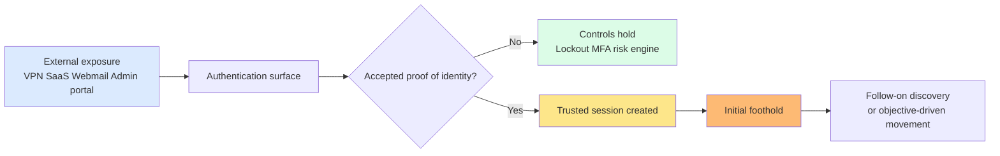
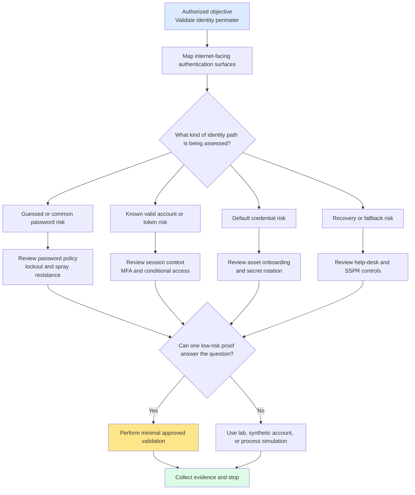
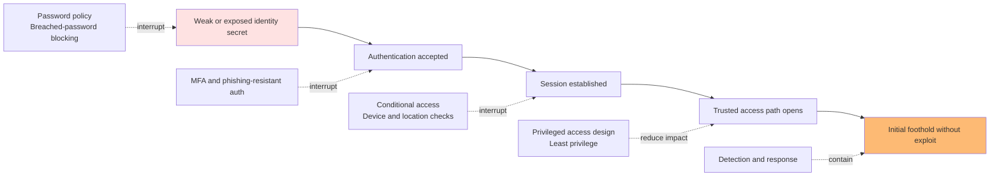
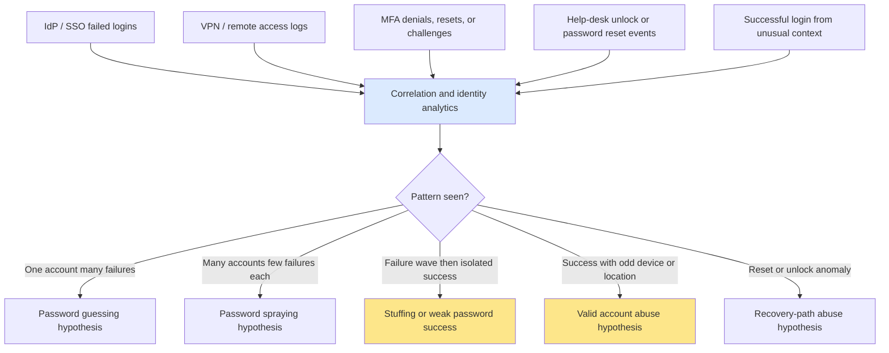

# Credential Attacks

> **Phase 05 — Initial Access**  
> **Focus:** How authorized red teams assess whether passwords, tokens, recovery flows, and identity controls can be abused to gain an initial foothold.  
> **Safety note:** This note is for **authorized adversary emulation and defensive learning only**. It explains concepts, planning, detection, and safe validation approaches. It does **not** provide step-by-step intrusion instructions, tooling recipes, or operational bypass guidance.

---

**Difficulty:** Beginner → Advanced  
**Category:** Red Teaming — Initial Access  
**Relevant ATT&CK concepts:** TA0001 Initial Access | T1110 Brute Force | T1110.001 Password Guessing | T1110.003 Password Spraying | T1110.004 Credential Stuffing | T1078 Valid Accounts

---

## Table of Contents

1. [What Credential Attacks Mean](#what-credential-attacks-mean)
2. [Why They Matter](#why-they-matter)
3. [Beginner Mental Model](#beginner-mental-model)
4. [Where Credential Attacks Fit in the Access Lifecycle](#where-credential-attacks-fit-in-the-access-lifecycle)
5. [Common Credential Attack Families](#common-credential-attack-families)
6. [How Authorized Red Teams Evaluate Them Safely](#how-authorized-red-teams-evaluate-them-safely)
7. [Diagram 1: Initial Access Decision Flow](#diagram-1-initial-access-decision-flow)
8. [Diagram 2: Identity Control Failure Chain](#diagram-2-identity-control-failure-chain)
9. [Diagram 3: Defender Correlation View](#diagram-3-defender-correlation-view)
10. [Detection Opportunities](#detection-opportunities)
11. [Defensive Controls](#defensive-controls)
12. [Safe Emulation Design Patterns](#safe-emulation-design-patterns)
13. [Conceptual Example](#conceptual-example)
14. [Reporting Guidance](#reporting-guidance)
15. [Common Mistakes](#common-mistakes)
16. [Public References](#public-references)
17. [Key Takeaways](#key-takeaways)

---

## What Credential Attacks Mean

Credential attacks are **authentication-centered initial access attempts**. Instead of exploiting a software vulnerability first, the adversary tries to cross the trust boundary by presenting something the environment accepts as proof of identity.

That “something” may be:

- a guessed password
- a commonly reused password
- an exposed username/password pair from another breach
- a default credential left on an admin interface
- a valid account already obtained by some other means
- a reset, unlock, or fallback workflow that is weaker than the normal login path

At a red-teaming level, the important question is not just:

> “Can a password be guessed?”

The more useful question is:

> **If the environment accepts a weak, reused, exposed, or poorly protected identity, how much business access does that create before defenders respond?**

### Credential attacks vs related topics

| Topic | Main Question | Typical Phase |
|---|---|---|
| **Credential attacks** | Can authentication itself be abused for initial access? | Initial Access |
| **Credential harvesting** | Can identity material be collected from users, browsers, systems, or workflows? | Often Credential Access |
| **Credential reuse** | Where else does already-obtained identity material work? | Often Lateral Movement |

A beginner-friendly way to remember this is:

```text
Credential attack     = getting through the front door
Credential harvesting = collecting more keys
Credential reuse      = discovering the same key opens many rooms
```

---

## Why They Matter

Credential attacks matter because they often let an operator **avoid exploit-heavy behavior entirely**.

If a login succeeds, the environment may treat the session as normal business activity. That makes identity a favorite entry path for real adversaries and a high-value validation area for authorized red teams.

MITRE ATT&CK documents both **Brute Force (T1110)** and **Valid Accounts (T1078)** as common ways adversaries reach or expand access. In real incidents, valid credentials have repeatedly been used against:

- VPN portals
- remote access gateways
- webmail and collaboration suites
- SaaS admin panels
- cloud control planes
- legacy management interfaces

### Why credential attacks are strategically important

| Reason | Why Operators Care | Why Defenders Should Care |
|---|---|---|
| **No exploit required** | A valid login can bypass the need for malware or RCE | Traditional vulnerability management alone will not stop identity abuse |
| **Looks legitimate** | Authentication traffic may blend with normal workflows | Logging, correlation, and context become critical |
| **Cloud and SaaS friendly** | Internet-facing identity systems are often the new perimeter | The “edge” is no longer just firewalls and VPNs |
| **Scales quickly** | One weakness may expose many users or many services | Blast radius can grow faster than analysts expect |
| **Tests real maturity** | Credential attacks reveal how password policy, MFA, lockout, SSO, and recovery actually work together | They expose whether identity controls fail closed or fail open |

> **Key insight:** Many modern intrusions are not “exploit first, authenticate later.” They are often **authenticate first, then operate inside trusted pathways**.

---

## Beginner Mental Model

Imagine a secure office building.

- The **password** is the door code.
- **MFA** is the security guard asking for a second proof.
- **Lockout and rate limits** are the rule that stops repeated bad guesses.
- **Conditional access** is the guard noticing that a valid badge is being used from the wrong building or device.
- **Password reset and help-desk workflows** are the receptionist who may let someone in through a side entrance.

Credential attacks work when the attacker finds the weakest part of that identity checkpoint.

### Three simple entry patterns

1. **Known secret**
   - The attacker already has a valid password, token, or account.
2. **Guessable secret**
   - The environment accepts something weak, common, predictable, or default.
3. **Weaker fallback path**
   - The recovery, reset, or unlock process is easier to abuse than the normal login flow.

### Beginner → advanced progression

| Level | What you usually notice | What experienced operators notice |
|---|---|---|
| **Beginner** | Weak passwords and no MFA | Identity is the real perimeter |
| **Intermediate** | Spray, stuffing, default credentials, shared secrets | Detection depends on pattern recognition, not just single failures |
| **Advanced** | Federation, break-glass accounts, service identities, recovery paths, device trust, token acceptance | One identity weakness can become a full access narrative |

---

## Where Credential Attacks Fit in the Access Lifecycle

Credential attacks sit at the boundary between **external exposure** and **trusted internal access**.



A useful practical lesson is that not all credential attacks start the same way:

| Starting Condition | What It Means |
|---|---|
| **No credentials at all** | The environment is being tested for weak, default, or guessable secrets |
| **Some likely credentials** | The environment is being tested for password reuse, stuffing, or poorly protected valid accounts |
| **Known identity path** | The environment is being tested for whether a real account grants more access than intended |
| **Fallback workflow available** | The environment is being tested for whether recovery is weaker than primary authentication |

In mature red-team planning, this section matters because it shifts the question from “Can we log in?” to **“What trust boundary fails if we can?”**

---

## Common Credential Attack Families

These families are related, but each reveals a different control weakness.

| Family | What It Relies On | Typical Target Surface | Common Defender Signal | Safe Validation Idea in an Authorized Engagement |
|---|---|---|---|---|
| **Password guessing** | Individual passwords are weak, predictable, or default-like | Single account or single service | Repeated failures on one account or one username | Use a canary or synthetic account, or verify control behavior in a lab or tabletop setting |
| **Password spraying** | A small set of weak/common passwords may work across many users | SSO, VPN, OWA, external admin portals | Many accounts receiving low-volume failures | Coordinate a tiny pre-approved simulation with clear stop conditions and SOC visibility |
| **Credential stuffing** | Users reuse passwords between unrelated services | Internet-facing sign-in portals | Distributed failures followed by isolated successes | Validate breach-password protections and response workflows with approved test identities only |
| **Valid account abuse** | An already-known credential, token, or session is accepted as normal | VPN, SaaS, cloud, remote access, internal portals | Successful logins from abnormal context with otherwise legitimate auth flow | Test one approved identity path and stop once the trust issue is proven |
| **Default or weak vendor credentials** | Setup defaults or unchanged bootstrap secrets remain in place | Appliances, legacy admin consoles, management UIs | First-time admin logins, neglected log sources, exposure on forgotten systems | Prefer configuration review, asset review, or isolated validation rather than broad production testing |
| **Recovery or fallback abuse** | Reset, unlock, MFA fallback, or help-desk flow is weaker than primary auth | SSPR, help desk, recovery channels, admin unlock paths | Password resets, unlocks, MFA resets, odd support workflows | Use process simulation, white-team coordination, and approved role-play rather than real user disruption |

### Practical interpretation

A good note for beginners is this:

- **Guessing** tests password quality.
- **Spraying** tests password quality at population scale.
- **Stuffing** tests password reuse across services.
- **Valid account abuse** tests how much trust a real identity receives.
- **Default credentials** test operational hygiene.
- **Recovery abuse** tests whether support processes are weaker than security policy.

---

## How Authorized Red Teams Evaluate Them Safely

A professional team does not treat credential attacks as “try lots of logins and see what happens.” That is noisy, risky, and often low value.

Instead, the team evaluates the identity perimeter across a small set of planning dimensions.

| Dimension | Key Question | Why It Matters |
|---|---|---|
| **Authentication surface** | Which systems actually face the internet or external identities? | It identifies the real entry points |
| **Identity class** | Are we dealing with users, admins, contractors, service accounts, or break-glass identities? | Different identities create different business impact |
| **Control stack** | What password policy, MFA, lockout, risk scoring, and device trust exist? | A credential finding is only meaningful in the context of controls |
| **Safety constraints** | Could validation lock out users, trigger support load, or affect production workflows? | Prevents the exercise from becoming disruptive |
| **Evidence value** | What is the minimum proof needed to demonstrate risk? | Keeps the test precise and defensible |
| **Detection visibility** | What should defenders see if the behavior occurs? | Makes the exercise measurable, not just technical |

### A safe evaluation workflow

1. **Define the business question**
   - Example: Can a low-friction identity attack reach remote access, email, or an admin workflow?
2. **Map the authentication surfaces**
   - Include SSO, VPN, webmail, SaaS admin, cloud, and recovery paths.
3. **Classify identity types and risk tiers**
   - Separate ordinary users from privileged, support, contractor, and emergency identities.
4. **Review control behavior before any validation**
   - Password policy, breached-password blocking, MFA enforcement, lockout logic, risk signals, conditional access, and reset controls all matter.
5. **Choose the least disruptive proof**
   - Prefer synthetic accounts, canary identities, lab validation, or a single representative check.
6. **Set explicit stop conditions**
   - Unexpected lockout, user confusion, help-desk activity, unstable service, or off-scope exposure should pause the exercise immediately.
7. **Capture both access evidence and defender evidence**
   - A credential-attack finding is incomplete without telemetry and response observations.

> **Important:** In hybrid identity environments, lockout logic should be reviewed carefully. Microsoft’s smart lockout guidance highlights that cloud and on-premises thresholds and durations should be aligned deliberately so cloud defenses do not unintentionally create on-premises lockout risk.

---

## Diagram 1: Initial Access Decision Flow



This is the mindset difference between a professional exercise and reckless testing: the goal is to answer the question with the **smallest safe proof**, not the largest number of login attempts.

---

## Diagram 2: Identity Control Failure Chain



This diagram explains why credential attacks are so important in reporting: the issue is not just “a password worked.” The issue is **which protective layers did not interrupt the identity path**.

---

## Diagram 3: Defender Correlation View



A single failed login rarely tells the whole story. Credential attacks are usually recognized through **shape, timing, distribution, and correlation**.

---

## Detection Opportunities

Credential attacks are easier to detect when defenders correlate identity signals across multiple systems instead of looking at each platform in isolation.

| Data Source | What to Look For | Why It Helps |
|---|---|---|
| **Identity provider / SSO logs** | Large numbers of failures, many accounts touched, unusual geography, unusual user agents, blocked legacy auth, risk-score changes | This is often the clearest population-level view |
| **VPN and remote access logs** | Repeated failures, success after a burst of failures, new country or ASN, unusual device posture | Remote access frequently turns credential weakness into true network foothold |
| **Webmail and collaboration logs** | External logins, suspicious mailbox access, abnormal protocol use, unusual session creation | Email access often becomes the bridge to broader compromise |
| **MFA platform logs** | Repeated denials, unusual challenge timing, reset requests, fallback usage | Helps distinguish password problems from MFA or recovery problems |
| **Active Directory / authentication service logs** | Kerberos, LDAP, or directory auth patterns that do not match normal user behavior | Useful in hybrid environments where cloud and on-prem telemetry must be linked |
| **Help-desk / ITSM records** | Unlock requests, password reset calls, identity proofing exceptions, high-risk users asking for recovery help | Recovery workflows can be an early warning channel |
| **Application or admin portal logs** | Local admin auth, default account use, unusual first-time logins | Especially important for legacy appliances and forgotten interfaces |
| **UEBA / risk engines** | Impossible travel, unfamiliar sign-in, unusual device, high-risk user activity | Adds context to otherwise legitimate successful logins |

### What mature defenders correlate

A strong blue team usually tries to answer questions such as:

- Did one account receive repeated failures?
- Did many accounts receive one or two failures each?
- Did a successful login occur shortly after an earlier failed pattern?
- Did the successful login come from a new device, location, proxy, or autonomous system?
- Did the event trigger password reset, MFA reset, or help-desk activity?
- Did the same identity then touch sensitive SaaS, VPN, or admin workflows?

> **Detection lesson:** The dangerous signal is often not the failure itself. It is the **relationship between failures, context shifts, and later success**.

---

## Defensive Controls

Good defense against credential attacks is layered. No single control is enough on its own.

| Control | Why It Helps |
|---|---|
| **Strong password and passphrase policy** | Raises the cost of guessing and reduces success of weak-password attacks |
| **Block common and breached passwords** | Directly reduces stuffing and spray success against reused or known passwords |
| **MFA, especially phishing-resistant MFA for high-value users** | Prevents password-only compromise from becoming account access |
| **Smart lockout and rate-limiting logic** | Disrupts repeated guessing while reducing unnecessary user lockouts |
| **Conditional access and device trust** | Makes a valid password less useful from the wrong place, device, or risk context |
| **Disable or rotate default credentials before production exposure** | Removes one of the easiest initial-access failure modes |
| **Unique local admin secrets and managed secret rotation** | Prevents one compromise from scaling into broad reuse |
| **Harden password reset and help-desk verification** | Stops the fallback path from being weaker than the main login path |
| **Reduce legacy authentication and old protocols** | Removes older pathways that may have weaker logging or control coverage |
| **Centralized identity logging and correlation** | Makes pattern-based attacks visible sooner |
| **Canary accounts and identity deception** | Provides high-signal alerts when unauthorized auth paths are touched |
| **Privileged access segregation** | Limits the damage if any single account is accepted |

### Practical control notes

- OWASP’s Authentication Cheat Sheet emphasizes **blocking common or breached passwords**, supporting strong password length, and designing secure recovery workflows.
- Microsoft’s smart lockout guidance highlights that hybrid organizations should tune **cloud and on-prem lockout settings together**, not separately.
- In red-team reporting, a control is strongest when described as part of a **control stack**, not as a single silver bullet.

Example:

```text
Weak password alone should not create initial access if breached-password blocking,
MFA, lockout controls, and contextual risk checks all work correctly.
```

---

## Safe Emulation Design Patterns

Credential-attack validation should be among the most carefully controlled parts of an engagement because careless testing can affect real users very quickly.

### High-quality design patterns

| Practice | Why It Matters |
|---|---|
| **Use synthetic, canary, or pre-approved test identities first** | Prevents unnecessary impact to real users |
| **Define exact authentication surfaces in scope** | Avoids accidental touch of third-party or adjacent systems |
| **Know lockout thresholds and reset behavior before validation** | Prevents user disruption and help-desk load |
| **Prefer one representative proof over broad testing** | Demonstrates the weakness without turning it into a noisy campaign |
| **Coordinate with the white team for recovery-path testing** | Password reset and help-desk scenarios can affect people and processes directly |
| **Use time windows and stop conditions** | Reduces business risk if conditions change mid-exercise |
| **Capture blue-team telemetry as part of success criteria** | Shows whether controls work operationally, not just technically |
| **Stop once the root cause is proven** | The report benefits more from clear evidence than from excessive repetition |

### Example ROE-style language

> “Credential-attack validation will be limited to approved authentication surfaces, named test identities where possible, and non-destructive proof methods. Any unplanned user lockout, support impact, third-party exposure, or uncertainty about scope requires immediate pause and white-team review.”

### What “practical” means here

Practical does **not** mean aggressive. In mature red-team work, practical means:

- the finding is believable
- the proof is safe
- the telemetry is captured
- the root cause is clear
- the remediation path is obvious

---

## Conceptual Example

### Scenario

An organization uses:

- Microsoft Entra ID for cloud identity
- a legacy VPN for network entry
- webmail and collaboration SaaS
- a help-desk password reset process for contractors

The engagement objective is to validate whether **identity controls prevent a low-friction credential-based path to remote access and sensitive business communication**.

### Safe red-team approach

The team does **not** broadly test real employees.

Instead, it:

- reviews the approved identity surfaces
- uses named synthetic or canary accounts where possible
- confirms lockout and stop conditions in advance
- validates whether the VPN and cloud identity layer enforce the same security expectations
- observes what the SOC sees from failed identity events, successful sign-ins, and recovery actions

### Example findings that could emerge

| Finding | What It Would Mean |
|---|---|
| **Cloud identity blocks weak-password attempts, but legacy VPN does not** | Identity protections are inconsistent across the perimeter |
| **Password spray pattern is visible in SSO logs but not alerted on** | Telemetry exists, but detection engineering is immature |
| **Help-desk reset path is weaker than primary login controls** | Process weakness undermines strong technical controls |
| **Successful login from an unusual device reaches email and VPN immediately** | Conditional access and session context are not strict enough |
| **One contractor identity reaches more internal systems than expected** | Access design is broader than business need |

### Why this is a strong exercise

It answers a business question safely:

> **Can identity-centric initial access succeed because authentication controls are uneven, or because recovery and remote-access pathways are weaker than leadership expects?**

That is more useful than a shallow statement such as “some passwords are weak.”

---

## Reporting Guidance

A good credential-attack finding should explain **trust failure**, not just authentication behavior.

| Reporting Element | What to Include |
|---|---|
| **Surface tested** | VPN, SSO, SaaS, admin portal, recovery workflow, or legacy auth endpoint |
| **Identity class** | User, admin, contractor, service, break-glass, or support identity |
| **Attack family** | Guessing, spraying, stuffing, valid account abuse, default credential, or recovery weakness |
| **Control condition** | MFA absent, lockout weak, default credential exposed, recovery path weaker, detection absent |
| **Observed telemetry** | Failed logins, successful sign-ins, MFA events, resets, UEBA flags, help-desk actions |
| **Business impact** | Email access, VPN foothold, SaaS access, admin workflow reach, contractor abuse path |
| **Safe proof method** | Canary identity, synthetic account, single representative validation, process simulation |
| **Remediation priority** | Which control changes most reduce blast radius fastest |

### Strong finding statement template

```text
The organization’s identity perimeter allowed [attack family] against [surface],
resulting in [type of access] because [control stack weakness].
Defender visibility was [strong / partial / absent], and the issue was proven using
[safe proof method] without disruptive user impact.
```

### What makes the report strong

The best reports answer all of these:

- What identity path failed?
- Why did it fail?
- What did defenders see?
- What business access did it create?
- Which control stack improvements would have interrupted it earliest?

---

## Common Mistakes

### Treating all credential attacks as the same

A guessed password, a reused password, a valid token, and a help-desk reset weakness are different problems. Good remediation depends on naming the right one.

### Focusing only on passwords

Modern identity systems also accept tokens, sessions, federated trust, recovery codes, certificates, and workload identities.

### Ignoring hybrid edge cases

Cloud controls may be strong while legacy VPN, AD-integrated systems, or forgotten admin interfaces remain weak.

### Testing too broadly

Mass login attempts may create lockouts, alert fatigue, or help-desk disruption without improving the quality of the finding.

### Reporting only “weak password risk”

That is often too shallow. The more important issue may be:

- lack of breached-password blocking
- absent MFA on a sensitive surface
- weak recovery workflow
- inconsistent lockout policy
- over-broad valid account trust
- missing alert correlation

### Forgetting the defender side

If a credential-attack note does not explain expected telemetry and response opportunities, it misses half the learning value of red teaming.

---

## Public References

- [MITRE ATT&CK — T1110 Brute Force](https://attack.mitre.org/techniques/T1110/)
- [MITRE ATT&CK — T1110.001 Password Guessing](https://attack.mitre.org/techniques/T1110/001/)
- [MITRE ATT&CK — T1110.003 Password Spraying](https://attack.mitre.org/techniques/T1110/003/)
- [MITRE ATT&CK — T1110.004 Credential Stuffing](https://attack.mitre.org/techniques/T1110/004/)
- [MITRE ATT&CK — T1078 Valid Accounts](https://attack.mitre.org/techniques/T1078/)
- [OWASP Authentication Cheat Sheet](https://github.com/OWASP/CheatSheetSeries/blob/master/cheatsheets/Authentication_Cheat_Sheet.md)
- [Microsoft Entra ID — Smart Lockout](https://learn.microsoft.com/en-us/entra/identity/authentication/howto-password-smart-lockout)

---

## Key Takeaways

- Credential attacks are **identity-first initial access techniques**.
- The real question is not only whether authentication can be bypassed, but **what trust boundary fails when it is**.
- Password guessing, spraying, stuffing, valid-account abuse, default credentials, and recovery weakness each expose different defensive gaps.
- Strong findings explain the **control stack failure**: password policy, MFA, lockout, conditional access, recovery, and detection.
- Safe red-team validation should be **minimal, approved, measurable, and non-disruptive**.
- The most useful report ties identity weakness directly to **business access, defender visibility, and concrete remediation**.

---

> **Defender mindset:** Treat identity systems as part of the attack surface, not just an access convenience layer. Tune the whole control stack — password quality, MFA, lockout, conditional access, recovery, telemetry, and privileged access design — so one accepted credential does not become an easy path to an objective.
