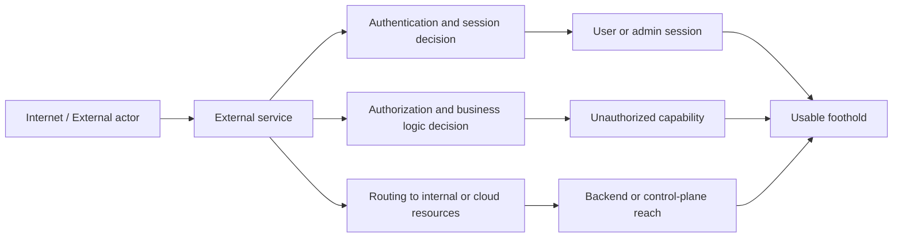
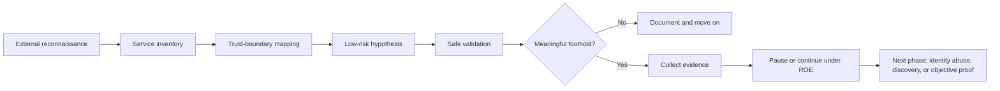
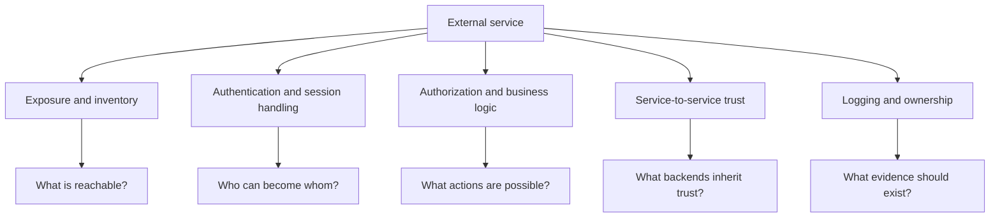
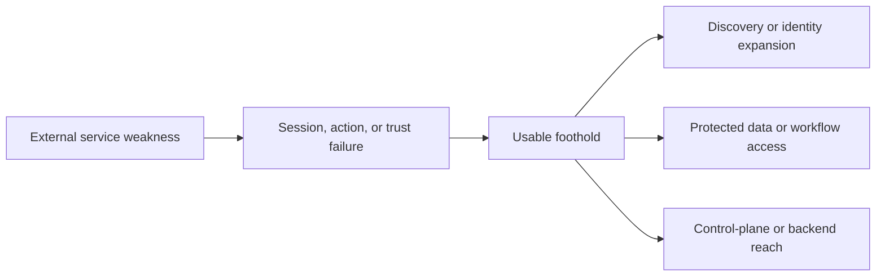

# External Service Exploitation

> **Phase 5 — Initial Access**  
> **Focus:** How an authorized red team evaluates whether internet-facing services, remote access platforms, APIs, SaaS workflows, and external management portals could provide a realistic foothold.  
> **Safety note:** This note is for authorized adversary emulation, purple teaming, and defensive learning only. It explains concepts, decision-making, safe proof strategies, and defensive priorities without providing step-by-step intrusion instructions, exploit recipes, or operational playbooks.

---

**Relevant ATT&CK concepts:** TA0001 Initial Access | T1190 Exploit Public-Facing Application | T1133 External Remote Services | T1078 Valid Accounts

---

## Table of Contents

1. [Why External Services Matter](#1-why-external-services-matter)
2. [Beginner View — What Counts as an External Service?](#2-beginner-view--what-counts-as-an-external-service)
3. [External Service Exploitation vs Web Exploitation](#3-external-service-exploitation-vs-web-exploitation)
4. [Where This Fits in a Realistic Attack Chain](#4-where-this-fits-in-a-realistic-attack-chain)
5. [Service Families That Matter Most](#5-service-families-that-matter-most)
6. [What a Red Team Actually Looks For](#6-what-a-red-team-actually-looks-for)
7. [A Safe and Practical Validation Workflow](#7-a-safe-and-practical-validation-workflow)
8. [Common Weakness Families](#8-common-weakness-families)
9. [From Service Weakness to Usable Foothold](#9-from-service-weakness-to-usable-foothold)
10. [Detection Opportunities](#10-detection-opportunities)
11. [Defensive Priorities](#11-defensive-priorities)
12. [Common Pitfalls](#12-common-pitfalls)
13. [Key Takeaways](#13-key-takeaways)
14. [References](#14-references)

---

## 1. Why External Services Matter

External services are the systems an organization intentionally exposes to the outside world so users, partners, administrators, and applications can interact with it.

That sounds normal, but it creates an important security reality:

> **An external service is a trust translator.** It takes requests from untrusted places and turns them into authenticated, routed, or privileged actions inside a business workflow.

That is why external service exploitation is such an important initial-access topic. It is not just about “finding an internet-facing bug.” It is about asking whether exposed services make unsafe trust decisions that let an adversary cross a meaningful boundary.

Examples include:

- remote access gateways such as VPN, VDI, or portal-based access systems
- identity and SSO services that issue sessions into many applications
- public APIs and customer-facing web applications
- SaaS admin consoles and collaboration platforms
- externally reachable management interfaces
- cloud service consoles, storage interfaces, and edge platforms
- vendor, webhook, and integration endpoints that accept outside input



A mature red team therefore evaluates external services as part of a larger attack path:

- Which service is exposed?
- Which trust boundary does it control?
- What capability would failure create?
- How safely can that risk be proven?

---

## 2. Beginner View — What Counts as an External Service?

A beginner-friendly definition is:

> **An external service is any system deliberately reachable from outside the organization that is trusted to make an access, routing, or privilege decision.**

That means the topic is broader than websites alone.

| Service type | Simple description | Why it matters for initial access |
|---|---|---|
| **Web application** | A browser-facing business application | May expose sessions, workflows, or server-side trust |
| **API** | A machine-readable service used by apps, partners, or mobile clients | Often exposes data, object access, and backend integration paths |
| **Remote access service** | VPN, VDI, remote desktop gateway, or portal | Can turn internet reach into internal network or application reach |
| **Identity or SSO service** | Login, federation, MFA, or session-issuing platform | A single weak decision can unlock many downstream systems |
| **Admin or management portal** | External console for support, operations, or infrastructure | High value because administrative actions are concentrated here |
| **SaaS or collaboration platform** | Cloud-hosted email, file sharing, CRM, ticketing, chat, etc. | May hold sensitive data or bridge to enterprise identity |
| **Partner or integration endpoint** | Webhooks, B2B portals, delegated access, support paths | Trusted relationships can bypass stronger front-door controls |

A simple mental model is:

```text
External exposure -> trust decision -> new capability -> foothold
```

The key phrase is **new capability**.

A realistic adversary does not care only that a weakness exists. They care whether the weakness gives them something usable, such as:

- a valid session
- access to protected records
- a privileged workflow
- a service token or role
- a path into internal or cloud resources

---

## 3. External Service Exploitation vs Web Exploitation

These ideas overlap, but they are not identical.

| Topic | Main focus | Typical question |
|---|---|---|
| **Web exploitation** | Weaknesses in web applications and APIs | “Can the application be made to do something it should not do?” |
| **External remote service abuse** | Internet-facing access services such as VPN, VDI, SaaS, and portals | “Can an exposed access workflow be misused to enter a trusted environment?” |
| **External service exploitation** | The broader family of exposed services, trust decisions, and management planes | “Can any exposed service create a realistic foothold or privileged capability?” |

So, web exploitation is one important subset of external service exploitation.

The broader lesson is that many real initial-access paths are **service-centric and identity-centric**, not only “software exploit” centric.

A public-facing application bug is one route. A weak remote-access workflow, overtrusted integration, forgotten admin portal, or exposed legacy API can be equally important.

---

## 4. Where This Fits in a Realistic Attack Chain

External service exploitation is usually part of a larger path, not the entire operation.



### What success looks like

A strong initial-access result through an external service usually means:

1. the service was realistically exposed to the modeled adversary
2. the weakness crossed a meaningful trust boundary
3. the proof stayed within authorization and safety limits
4. the resulting access or capability was actually useful
5. the team captured evidence about what defenders should have seen

### Why this often matters more than a single CVE

Organizations frequently discover that the biggest issue is not one isolated software flaw but the combination of:

- exposure nobody was tracking
- trust relationships nobody had mapped
- identity decisions nobody was monitoring
- legacy versions nobody retired
- admin workflows nobody expected to be internet-reachable

That is what makes this topic operationally valuable.

---

## 5. Service Families That Matter Most

Not all external services create the same kind of risk.

| Service family | Why attackers care | Why defenders should care |
|---|---|---|
| **Public web apps and APIs** | Broad reach, fast-changing code, direct link to business workflows | Bugs and logic flaws can become sessions, data access, or backend reach |
| **Remote access gateways** | They convert internet access into trusted entry | Authentication anomalies here may be the first sign of intrusion |
| **Identity and SSO services** | One session may unlock many downstream systems | Misconfigurations or weak session controls can multiply blast radius |
| **SaaS and collaboration platforms** | Sensitive data and admin workflows may sit outside the traditional perimeter | Audit coverage and visibility are often weaker than on-prem systems |
| **Admin and management portals** | High privilege is concentrated in one place | Even limited misuse can produce outsized impact |
| **Cloud and edge management services** | Identity, storage, compute, and routing decisions may all converge here | Configuration drift or public exposure can create immediate risk |
| **Partner and integration services** | Third-party trust may bypass stronger direct controls | Partner telemetry and ownership are often fragmented |

### A helpful way to think about service value

Some services are valuable because they hold data. Others are valuable because they **grant reach**.

| Service role | What it gives an adversary |
|---|---|
| **Content service** | access to information or records |
| **Access service** | sessions, tokens, or remote entry |
| **Control service** | administrative actions or configuration changes |
| **Bridge service** | service-to-service reach into internal, cloud, or partner environments |

Advanced operators focus heavily on the last two categories because they often shorten the path to the actual objective.

---

## 6. What a Red Team Actually Looks For

A strong red team does not begin by “trying random exploits.” It begins by understanding the exposed service as a set of trust decisions.

### Core questions

1. **What is exposed?**  
   Which hostnames, portals, APIs, versions, tenants, admin paths, and integrations are actually reachable from outside?

2. **What trust boundary does it sit on?**  
   Does the service issue sessions, proxy requests, manage identities, process files, call internal APIs, or control infrastructure?

3. **What identities exist here?**  
   Anonymous users, normal users, support roles, service accounts, admins, partner accounts, automation roles.

4. **What capability would failure create?**  
   Read access, write access, administrative action, token issuance, backend reach, or entry into a later phase.

5. **What is the least risky proof?**  
   A mature team proves the trust failure with minimal impact instead of maximizing access.



### Operator view of the attack surface

| Area | What operators evaluate | Why it matters |
|---|---|---|
| **Inventory** | hostnames, API versions, admin paths, forgotten services | Untracked exposure often means weaker controls |
| **Authentication** | login paths, MFA, device trust, recovery flows, token lifetime | Valid sessions are often more useful than noisy exploitation |
| **Authorization** | object ownership, role boundaries, admin-only features, delegated actions | Broken access control can produce immediate privilege |
| **Configuration** | default settings, debug features, public access, network reachability | Misconfiguration is a common cause of “accidental exposure” |
| **Integration trust** | webhooks, internal APIs, cloud roles, partner access, background jobs | External input may inherit trusted backend behavior |
| **Observability** | identity logs, API logs, cloud audit, WAF or edge records | Good evidence is essential for both safe execution and reporting |
| **Lifecycle** | patching, end-of-life services, change ownership, shadow deployments | Old services often survive outside normal governance |

The best external-service assessments therefore combine:

- attack surface analysis
- trust-boundary thinking
- identity analysis
- configuration review
- detection and ownership review

---

## 7. A Safe and Practical Validation Workflow

In authorized adversary emulation, the workflow matters as much as the finding.

| Phase | What it means | Safe output |
|---|---|---|
| **1. Set guardrails** | Confirm scope, prohibited targets, proof limits, stop conditions, and deconfliction | Written boundaries before any validation |
| **2. Build the service map** | Identify exposed services, versions, roles, and downstream trust relationships | A prioritized inventory, not random probing |
| **3. Prioritize by adversary value** | Focus on services tied to crown jewels, identity, or control planes | A small number of meaningful hypotheses |
| **4. Validate with least-risk proof first** | Start with minimal-impact confirmation of the trust failure | Read-only or tightly controlled evidence where possible |
| **5. Decide whether more proof is necessary** | Stop once the path is demonstrated clearly enough for the objective | Clear evidence without unnecessary escalation |

### Good proof usually looks like this

- confirmation that a service was exposed and reachable
- confirmation that a trust decision failed
- evidence of the resulting capability
- evidence of what logs or alerts should have existed
- a clear explanation of what the next realistic phase would have been

### What mature teams avoid

- unnecessary actions against production workflows
- high-volume or disruptive testing when a small proof is enough
- deep expansion into downstream systems without explicit approval
- collecting more real data than needed to prove the point

> **Good red teaming proves the most important thing with the least risk.**

---

## 8. Common Weakness Families

The categories below are useful because they are broad, durable, and defensible to leadership. They explain **why** the exposure mattered without turning the note into an intrusion recipe.

| Weakness family | What it looks like conceptually | Why it matters |
|---|---|---|
| **Patch lag or unsupported edge software** | An internet-facing service falls behind on security fixes or support status | Public exposure plus known weakness patterns can make the service a high-priority entry path |
| **Broken authentication or session design** | Weak login hardening, flawed session issuance, weak recovery, poor token handling | A small authentication mistake can become broad downstream access |
| **Broken object or function authorization** | A service accepts actions or identifiers a user should not control | This often creates immediate business impact without needing host compromise |
| **Security misconfiguration** | Exposed admin features, overly permissive storage, default settings, public management access | Misconfiguration frequently turns normal services into unintended entry points |
| **Improper inventory management** | Old API versions, forgotten subdomains, retired portals, shadow services | Defenders cannot protect what they do not know they are exposing |
| **Unsafe service-to-service trust** | An external request causes a trusted internal request, token use, or backend action | This can convert a small edge weakness into internal or cloud reach |

### Why these categories show up repeatedly

Public guidance from MITRE ATT&CK and OWASP repeatedly points back to the same themes:

- exposed services matter because they sit on the trust boundary
- APIs and modern applications fail most often at authorization, authentication, inventory, and configuration
- attack surface management matters because internet exposure changes faster than many teams realize

### A useful advanced insight

In many environments, the weakness is not “the service is vulnerable” in isolation. It is:

```text
Exposure + trust concentration + weak governance + missing detection = meaningful initial-access risk
```

That is why external service exploitation should be reported as a **system failure**, not only as a defect in one host or application.

---

## 9. From Service Weakness to Usable Foothold

A weakness matters only if it produces a capability that advances the campaign.



### Common outcome patterns

| Initial result | New capability | Likely next phase |
|---|---|---|
| **Valid session in a SaaS or portal workflow** | Access to user data, workflows, or approvals | Discovery, collection, or higher-value account targeting |
| **Administrative action in an exposed service** | Configuration change, privileged view, or role expansion | Identity abuse, persistence, or environment-wide control |
| **Server-side service context** | Application-side reach to backend systems or secrets | Discovery, credential access, or cloud pivoting |
| **Token, key, or delegated trust exposure** | Reuse of application or service identity | Access to APIs, storage, or control planes |
| **Remote access into an approved segment** | Direct presence inside a trusted zone | Internal discovery, pathfinding, or objective proof |

### Worked conceptual scenarios

#### Scenario 1 — The remote-access gateway path

A remote-access service is business-critical, highly exposed, and tightly connected to enterprise identity. If its authentication, session policy, or configuration is weak, the result may not be “a hacked appliance” in the way beginners imagine. The more important outcome is often a **trusted internal session**.

That matters because defenders now need to distinguish a malicious session from normal remote work behavior.

#### Scenario 2 — The legacy API version path

An organization secures its main application well but forgets that an older API version is still reachable. The issue is not just the existence of the old endpoint. The real problem is that the legacy path may not enforce modern authorization, logging, or rate controls.

That turns forgotten inventory into a realistic initial-access route.

#### Scenario 3 — The overtrusted integration path

A business integration accepts external input and then performs privileged actions behind the scenes. Even if the front-end service looks minor, its backend trust may be substantial.

This is why small edge services sometimes produce disproportionately large risk.

---

## 10. Detection Opportunities

External service exploitation often creates good defensive signals because it happens at the edge, at the identity boundary, or at a control plane.

| Signal | Why it matters | Typical telemetry source |
|---|---|---|
| **Unexpected public exposure** | A service appears, changes, or becomes reachable without clear ownership | attack-surface management, DNS, certificate inventory, cloud asset data |
| **First-seen or unusual logins** | New geographies, devices, network origins, or session patterns may indicate service abuse | IdP, VPN, VDI, SaaS audit logs |
| **Admin actions soon after initial access** | Fast transition from entry to privilege is rarely normal | admin audit, cloud audit, application logs |
| **Unusual API object access or role use** | May indicate broken authorization or misuse of a valid session | API gateway logs, app logs, WAF telemetry |
| **Use of old or deprecated service paths** | Legacy interfaces are often less protected and less monitored | reverse proxy logs, API version telemetry, route logs |
| **Unexpected service-to-service requests** | External input may be causing internal or cloud-side actions | proxy logs, cloud service logs, application traces |
| **Configuration changes tied to exposed services** | Control-plane abuse often appears as policy or access changes before anything else | cloud audit trails, SaaS admin logs, change-management systems |

### Detection lesson

One of the best defensive questions is:

> **If this exposed service were abused today, what is the earliest reliable signal we should see?**

That question usually leads to better detection engineering than “Which signature detects this exact bug?”

---

## 11. Defensive Priorities

| Priority | What good looks like |
|---|---|
| **Own the inventory** | Know every internet-facing service, API version, admin path, and externally reachable management plane |
| **Reduce unnecessary exposure** | Retire legacy services, close unneeded portals, and remove public reach where business use does not require it |
| **Harden identity at the edge** | Strong MFA, conditional access, session controls, and recovery workflows for every exposed access service |
| **Separate user and admin planes** | Administrative functions should not share the same exposure assumptions as normal user workflows |
| **Review service-to-service trust** | Webhooks, integrations, cloud roles, and backend fetch behavior should be tightly controlled and logged |
| **Monitor trust transitions** | Track when outside activity becomes an internal session, privileged action, token issuance, or policy change |
| **Practice safe validation** | Use purple teaming and controlled adversary emulation to verify that controls work without causing harm |

### What mature defense teams understand

They do not focus only on “the perimeter.”

They focus on:

- exposed services as business workflows
- identity as the new edge
- APIs as trust boundaries
- SaaS and cloud control planes as part of the environment
- inventory and ownership as security controls, not administrative chores

---

## 12. Common Pitfalls

### 1. Thinking “external service” means only a website

Many of the most important modern paths involve SSO, SaaS, APIs, remote access, support tooling, and cloud management planes.

### 2. Treating every exposed service as equally important

A tiny externally reachable admin portal may matter far more than a large public brochure site because it concentrates privilege.

### 3. Focusing only on software flaws

Misconfiguration, identity design, weak authorization, legacy inventory, and overtrusted integrations are often just as important as classic exploit scenarios.

### 4. Ignoring downstream trust

A low-profile service may still bridge to internal APIs, storage, directory services, or cloud control planes.

### 5. Proving too much

If read-only or tightly scoped proof is enough, there is no need to push deeper. Professionalism means restraint.

### 6. Reporting only the bug and not the path

Leadership and defenders need to understand:

- what trust boundary failed
- what capability was created
- why the service was exposed
- what should have detected it
- what control would break the path next time

---

## 13. Key Takeaways

- External service exploitation is about testing whether exposed services make unsafe trust decisions.
- The topic includes web apps, APIs, remote access services, SaaS, identity platforms, admin portals, and integrations.
- The most important question is not “is there a bug?” but “what new capability does this create for a realistic adversary?”
- Modern initial-access paths are often identity-centric and service-centric, not just host-centric.
- Strong assessments use minimal-risk proof, clear diagrams, and attack-path thinking.
- Strong defenses depend on inventory, exposure reduction, identity hardening, logging, and monitoring of trust transitions.

---

## 14. References

- [MITRE ATT&CK – TA0001 Initial Access](https://attack.mitre.org/tactics/TA0001/)
- [MITRE ATT&CK – T1190 Exploit Public-Facing Application](https://attack.mitre.org/techniques/T1190/)
- [MITRE ATT&CK – T1133 External Remote Services](https://attack.mitre.org/techniques/T1133/)
- [MITRE ATT&CK – T1078 Valid Accounts](https://attack.mitre.org/techniques/T1078/)
- [OWASP Web Security Testing Guide](https://owasp.org/www-project-web-security-testing-guide/latest/)
- [OWASP Attack Surface Analysis Cheat Sheet](https://cheatsheetseries.owasp.org/cheatsheets/Attack_Surface_Analysis_Cheat_Sheet.html)
- [OWASP API Security Top 10 – 2023](https://owasp.org/API-Security/editions/2023/en/0x11-t10/)
