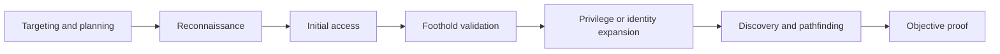
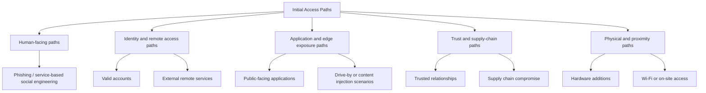
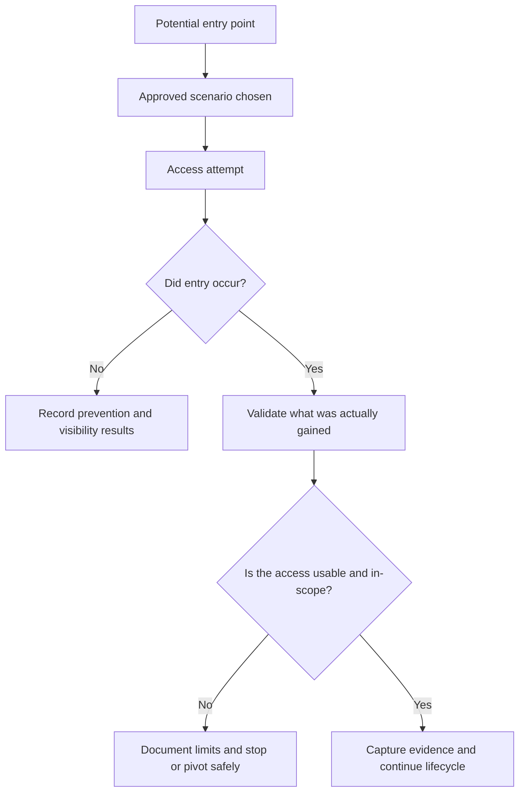
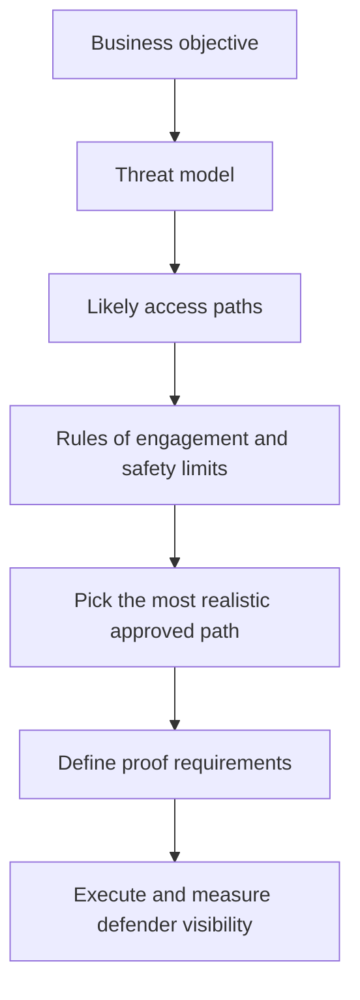
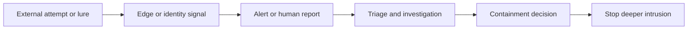

# Initial Access Overview

> **Difficulty:** Beginner → Advanced | **Category:** Red Teaming | **MITRE Tactic:** [TA0001 – Initial Access](https://attack.mitre.org/tactics/TA0001/)

Initial access is the moment an authorized adversary-emulation exercise answers a simple question:

> **Can a realistic attacker reach the organization’s environment in a way that matters to the mission?**

That “entry” might be a user session, a cloud account, a VPN connection, a public-facing application, a partner connection, or another approved path into the target environment. In mature red team work, the goal is **not** reckless intrusion for its own sake. The goal is to validate whether exposed systems, identities, workflows, and trust relationships would allow a real adversary to get a usable foothold before defenders detect and stop the attempt.

A good initial-access phase is therefore not just about getting in. It is about proving:

- whether the entry path was **realistic**
- whether it was **usable enough** to continue the scenario
- whether the organization’s **front-door controls** worked
- whether defenders had the **visibility and context** to respond early
- whether the access path aligns with the **threat model** and business objectives

---

## Table of Contents

1. [What Initial Access Means](#1-what-initial-access-means)
2. [Why This Phase Matters](#2-why-this-phase-matters)
3. [Where It Sits in the Attack Lifecycle](#3-where-it-sits-in-the-attack-lifecycle)
4. [The Main Initial Access Path Families](#4-the-main-initial-access-path-families)
5. [From Opportunity to Usable Foothold](#5-from-opportunity-to-usable-foothold)
6. [How Red Teams Choose an Access Path](#6-how-red-teams-choose-an-access-path)
7. [Safety, Rules of Engagement, and Proof](#7-safety-rules-of-engagement-and-proof)
8. [Defender Perspective](#8-defender-perspective)
9. [Common Failure Modes and Misconceptions](#9-common-failure-modes-and-misconceptions)
10. [What Strong Reporting Looks Like](#10-what-strong-reporting-looks-like)
11. [Key Takeaways](#11-key-takeaways)
12. [References](#12-references)

---

## 1. What Initial Access Means

**Initial access** is the first meaningful point at which an adversary obtains entry into the target environment or a target-controlled workflow.

For beginners, the easiest way to think about it is this:

- **Reconnaissance** finds possible doors.
- **Initial access** opens one of those doors.
- **Foothold validation** checks whether that door actually leads anywhere useful.

That distinction matters. A theoretical weakness is not the same as a usable entry path.

### A simple mental model

| Stage | Core question |
|---|---|
| Reconnaissance | What is exposed, trusted, or reachable? |
| Initial access | Can one of those paths be used to gain approved entry? |
| Foothold validation | Is the resulting access stable, meaningful, and relevant to the objective? |

In real adversary-emulation work, initial access is often less dramatic than people expect. It may be:

- access to a low-privilege SaaS account
- entry through a remote access workflow
- compromise of an Internet-facing application
- use of a trusted third-party relationship
- a simulated user-driven path such as phishing under strict controls
- physical or wireless access where the rules of engagement explicitly allow it

The important point is that **initial access is the transition from “outside” to “inside” of a meaningful trust boundary**.

---

## 2. Why This Phase Matters

Initial access matters because it tests the controls that are supposed to stop an intrusion **before the attacker gets room to maneuver**.

If this phase fails securely, the rest of the campaign may never happen. If it succeeds, the organization now has to rely on later controls such as segmentation, privilege management, detection engineering, and response speed.

### What initial access helps validate

| Question | What this phase tests |
|---|---|
| Can exposed systems be safely reached through realistic paths? | External attack surface management, patching, secure configuration |
| Can identities be abused to enter trusted systems? | MFA, conditional access, login monitoring, session controls |
| Would human-facing entry paths work against staff? | Security awareness, email protections, help-desk procedures, reporting culture |
| Can defenders see the earliest signs of compromise? | Edge telemetry, authentication logs, cloud alerts, email and web visibility |
| Can the team respond before the intrusion deepens? | Triage speed, escalation quality, playbooks, containment readiness |

### Why leadership cares so much

Initial access is often the phase that makes the scenario feel real to non-technical stakeholders.

A finding like:

> “A realistic external path could lead to a valid internal foothold within the approved scenario assumptions”

is often more meaningful than a long list of unrelated edge vulnerabilities.

It connects security weaknesses to business risk:

- exposed executive communications
- remote workforce access
- contractor and vendor trust
- public-facing applications
- cloud identity boundaries
- sensitive workflows tied to customer or operational data

---

## 3. Where It Sits in the Attack Lifecycle

Initial access is early in the lifecycle, but it should never be viewed in isolation.

A common beginner mistake is to treat initial access as the whole operation. It is not. It is only the first successful crossing of a boundary.

### What makes this phase successful?

A strong initial-access result usually means all of the following are true:

1. **The path was realistic** for the chosen threat model.
2. **The action stayed within scope and safety limits**.
3. **The resulting access was usable**, not just theoretical.
4. **The team captured evidence** of what succeeded or failed.
5. **The organization learned something actionable** about prevention or early detection.

---

## 4. The Main Initial Access Path Families

The MITRE ATT&CK Initial Access tactic groups several common entry patterns. For red teaming, it helps to think of them as **path families** rather than isolated tricks.

### 4.1 Human-facing paths

These paths depend on people, communication channels, or trust in normal business workflows.

Examples include:

- phishing simulations conducted under written authorization
- service-based messaging lures in collaboration platforms
- voice-driven pretexting where explicitly approved
- credential capture simulations against approved training infrastructure

These paths test:

- human decision-making
- email and messaging controls
- security awareness and reporting culture
- help-desk and identity-verification procedures

### 4.2 Identity and remote access paths

Some of the most important modern initial-access scenarios are identity-first, not malware-first.

Examples include:

- valid credentials used against VPN, SSO, VDI, or SaaS workflows
- abuse of remote access gateways
- cloud account entry through exposed or weakly protected authentication paths

These scenarios test:

- MFA strength and bypass resistance
- conditional access and device trust
- login telemetry and impossible-travel analytics
- how suspicious sessions are reviewed and contained

### 4.3 Application and edge exposure paths

This family focuses on Internet-facing systems and services.

Examples include:

- public-facing applications
- exposed admin interfaces
- remote management portals
- insecure Internet-facing services or weakly segmented edge systems

These scenarios test:

- patching and exposure management
- secure development and configuration
- web application detection and response
- whether the organization knows what is actually exposed

### 4.4 Trust and supply-chain paths

Sometimes the best route is not the victim’s front door, but a trusted partner, vendor, or software delivery mechanism.

Examples include:

- third-party support relationships
- delegated administrative access
- software delivery or update trust
- inherited access through business integrations

These scenarios test:

- third-party governance
- vendor access review
- federated identity boundaries
- assumptions about “trusted” systems or organizations

### 4.5 Physical and proximity paths

These are less common in many modern engagements, but still important when approved.

Examples include:

- on-site badge or visitor workflow weaknesses
- exposed network access in offices or branches
- removable media or hardware-based scenarios under strict control
- wireless access assumptions tied to physical proximity

These scenarios test:

- physical security
- office procedures
- on-prem segmentation
- whether cyber and physical security teams coordinate effectively

### Side-by-side view of path families

| Path family | What it simulates | Common control areas |
|---|---|---|
| Human-facing | A user or operator is influenced into enabling access | Email security, training, reporting, identity verification |
| Identity and remote access | Access is gained through legitimate-looking authentication paths | MFA, SSO, VPN controls, login monitoring |
| Application and edge exposure | Internet-facing technology creates an entry point | Exposure management, patching, WAF, secure config |
| Trust and supply chain | A trusted dependency becomes the route in | Third-party risk, vendor controls, software assurance |
| Physical and proximity | On-site or near-site access becomes the first foothold | Badge controls, office procedures, wireless security |

---

## 5. From Opportunity to Usable Foothold

A mature red team does not stop at “the door opened.” It asks whether the resulting access is operationally meaningful.

### What “usable” means in practice

Usable access is not always administrator rights or code execution. It may simply be enough access to support the engagement objective.

A foothold becomes meaningful when it allows one or more of the following:

- visibility into a target environment
- entry into an approved business workflow
- access to identity context that could support later movement
- proof that a real attacker would now be “inside” a trusted zone

### Questions operators ask after access

- Is this access aligned with the scenario we planned?
- Is it stable enough to support later stages?
- Is the proof already sufficient, or is more validation needed?
- Did defenders notice the event, and how quickly?
- Would pushing deeper increase learning, or only increase risk?

That last question is important. In strong engagements, the team stops when the learning objective is met.

---

## 6. How Red Teams Choose an Access Path

Initial access selection should be driven by **threat realism**, not operator preference.

### The planning logic

### Good path selection balances four things

| Factor | Key question |
|---|---|
| Realism | Would the modeled adversary actually favor this path? |
| Safety | Can it be simulated without unacceptable business or data risk? |
| Value | Will success or failure teach the organization something important? |
| Measurability | Can we observe detection, prevention, and response clearly? |

### Beginner → advanced way to think about it

- **Beginner:** Which route seems easiest to imagine?
- **Intermediate:** Which route best matches the threat actor and target environment?
- **Advanced:** Which route best validates important trust assumptions while remaining safe, realistic, and measurable?

That is the shift from “trying techniques” to **running an adversary-emulation exercise**.

---

## 7. Safety, Rules of Engagement, and Proof

Initial access is one of the easiest phases to get wrong operationally because it sits at the edge of user workflows, production systems, and sensitive trust boundaries.

### Core safety principles

- only perform actions explicitly authorized in the rules of engagement
- prefer **simulation, safe proof, or minimal approved impact** over disruptive realism
- avoid unnecessary collection of personal, regulated, or customer data
- coordinate deconfliction for high-risk paths such as executive targeting or remote access workflows
- define clear stop conditions before execution begins

### Proof should be proportional

In many engagements, the safest and most useful proof is not “deep compromise.” It may be:

- evidence that the entry path was available
- evidence that access reached a meaningful trust boundary
- evidence that defenders missed or correctly detected the event
- a minimal approved demonstration that later phases would have been possible

### Proof model example

| Proof style | When it is appropriate | Why it is useful |
|---|---|---|
| Login or workflow evidence | identity- or SaaS-based scenarios | proves boundary crossing without unnecessary expansion |
| Screenshots or metadata | sensitive environments | shows impact safely |
| Controlled training infrastructure results | user-facing simulations | avoids touching real production workflows more than necessary |
| Minimal approved foothold validation | when later phases require it | proves realism while limiting operational risk |

---

## 8. Defender Perspective

Defenders should read initial access as the organization’s first major opportunity to interrupt the intrusion.

### What defenders want to know

| Defender question | Why it matters |
|---|---|
| Did we know this entry path existed? | Unknown exposure creates preventable risk |
| Did the right control fire? | Prevention is stronger than late-stage detection |
| If prevention failed, did the right telemetry appear? | Early visibility shapes the whole incident |
| Did analysts understand the significance quickly enough? | Low-context alerts often fail in practice |
| Could containment have started before the attacker gained depth? | Early response is usually the cheapest response |

### High-value defensive lenses

1. **Exposure management** – Was the route unnecessarily available?
2. **Identity assurance** – Could the user, session, or device be trusted?
3. **Early telemetry** – Was there enough signal at the edge?
4. **Human reporting** – Did staff know something suspicious happened?
5. **Response coordination** – Could teams act before the path expanded?

### Defender visibility map

The earlier this chain works, the less the organization has to depend on downstream controls.

---

## 9. Common Failure Modes and Misconceptions

### “Initial access means malware.”

Not always. Many modern intrusions are identity-driven, SaaS-driven, or trust-driven. A legitimate-looking session can be more important than code execution.

### “If one entry path worked, that is the whole story.”

Not necessarily. A report should explain why that path was realistic, what controls should have stopped it, and whether defenders had early visibility.

### “The noisiest or flashiest path is the most realistic.”

Usually false. Realistic paths are shaped by threat intelligence, operator constraints, and defender expectations.

### “Success means going as deep as possible.”

No. In professional red teaming, success often means stopping as soon as the objective is convincingly proven.

### “If the team never gained entry, the exercise failed.”

Also false. If prevention and early detection worked, that is an important and valuable result.

---

## 10. What Strong Reporting Looks Like

Initial-access reporting should do more than say “access achieved” or “blocked.” It should explain the path, the controls, and the organizational meaning.

### A useful reporting structure

| Reporting element | What it should answer |
|---|---|
| Scenario and assumptions | Why was this path chosen? |
| Access path narrative | What trust boundary was crossed and how? |
| Preconditions | What conditions made success possible? |
| Control evaluation | Which controls failed, worked, or partially worked? |
| Detection timeline | What did defenders see, and when? |
| Business relevance | Why does this entry path matter to the mission? |
| Recommendations | What changes reduce likelihood or improve early detection? |

### Metrics that make reports stronger

- time from first activity to first relevant signal
- time from signal to analyst understanding
- whether a human report occurred
- whether MFA, email, or edge controls interrupted the path
- how much attacker effort was required
- whether the same path would still work after likely remediation

A strong report turns initial access into a story about **preventability, detectability, and business exposure**.

---

## 11. Key Takeaways

- Initial access is the first meaningful crossing of a trust boundary.
- It is best understood as a **phase of validation**, not just a moment of entry.
- Modern initial access often centers on **identity, external services, trust relationships, and exposed applications**.
- The best red team work keeps this phase **authorized, realistic, safe, and measurable**.
- Success is not “getting in at all costs.” Success is producing clear evidence about whether front-door defenses actually work.

---

## 12. References

- [MITRE ATT&CK – TA0001 Initial Access](https://attack.mitre.org/tactics/TA0001/)
- [MITRE ATT&CK – T1566 Phishing](https://attack.mitre.org/techniques/T1566/)
- [MITRE ATT&CK – T1078 Valid Accounts](https://attack.mitre.org/techniques/T1078/)
- [MITRE ATT&CK – T1133 External Remote Services](https://attack.mitre.org/techniques/T1133/)
- [MITRE ATT&CK – T1190 Exploit Public-Facing Application](https://attack.mitre.org/techniques/T1190/)
- [MITRE ATT&CK – T1199 Trusted Relationship](https://attack.mitre.org/techniques/T1199/)
- [MITRE ATT&CK – T1195 Supply Chain Compromise](https://attack.mitre.org/techniques/T1195/)
- [NIST SP 800-61 Rev. 2 – Computer Security Incident Handling Guide](https://nvlpubs.nist.gov/nistpubs/SpecialPublications/NIST.SP.800-61r2.pdf)

---

> **Authorized-use note:** This page is for approved adversary emulation, red teaming, and defensive understanding. Keep all activity legal, scoped, and non-destructive.
