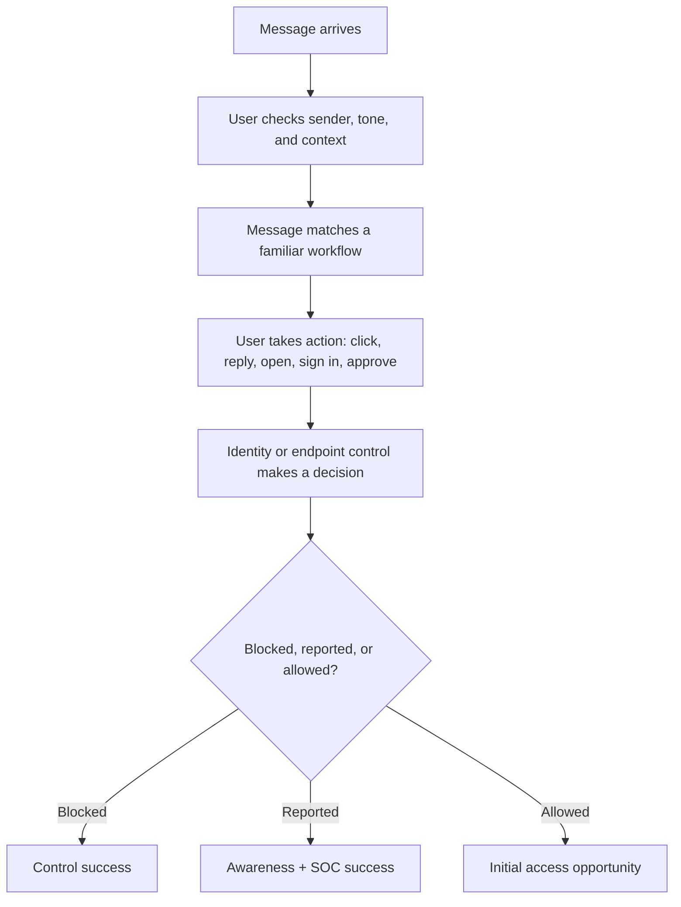
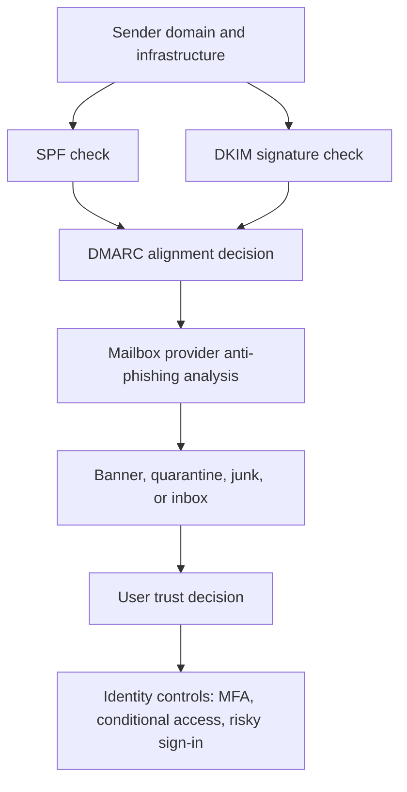

# Phishing

> **Difficulty:** Beginner → Advanced | **Category:** Red Teaming — Initial Access  
> **Safety note:** This note is for **authorized adversary emulation, awareness engineering, and detection validation**. It avoids instructions for abusing real users, stealing live credentials, or running harmful phishing operations.

Phishing remains one of the most reliable initial-access paths because it attacks **trust, urgency, routine, and identity workflows** rather than software bugs alone. In red teaming, the point of phishing is not “send convincing emails.” The point is to answer questions like:

- Will people recognize and report suspicious messages?
- Will email, identity, endpoint, and SOC controls work together?
- Can an attacker realistically reach an approved objective before being detected?

---

## Table of Contents

1. [Why It Matters](#1-why-it-matters)
2. [Beginner View](#2-beginner-view)
3. [What Phishing Is Really Exploiting](#3-what-phishing-is-really-exploiting)
4. [Major Phishing Variants](#4-major-phishing-variants)
5. [How a Professional Simulation Flows](#5-how-a-professional-simulation-flows)
6. [Designing a Safe and Useful Phishing Exercise](#6-designing-a-safe-and-useful-phishing-exercise)
7. [Email and Identity Mechanics](#7-email-and-identity-mechanics)
8. [Detection Opportunities](#8-detection-opportunities)
9. [Defensive Controls That Matter Most](#9-defensive-controls-that-matter-most)
10. [Metrics, Evidence, and Reporting](#10-metrics-evidence-and-reporting)
11. [Real-World Lessons](#11-real-world-lessons)
12. [Key Takeaways](#12-key-takeaways)
13. [Further Reading](#13-further-reading)

---

## 1. Why It Matters

Phishing matters because most organizations have invested heavily in patching, EDR, MFA, and perimeter defenses — but users still make trust decisions every day.

A phishing campaign can test several security layers at once:

| Layer | What phishing pressures |
|---|---|
| Human layer | Trust, curiosity, urgency, fear, habit |
| Email layer | Sender validation, reputation, banners, attachment/link controls |
| Identity layer | SSO, MFA, conditional access, impossible-travel and risky-sign-in detections |
| Endpoint layer | Browser isolation, attachment detonation, macro/payload blocking |
| SOC layer | User reports, alert correlation, triage speed, containment quality |

That is why phishing is still common in real intrusions: it is often the **lowest-cost way to turn human behavior into initial access**.

> **Key insight:** In mature environments, phishing is less about “tricking a user into clicking” and more about **abusing normal business trust flows** such as login prompts, document sharing, vendor conversations, help-desk requests, and collaboration invites.

---

## 2. Beginner View

At the beginner level, phishing is easy to understand:

1. An attacker sends a message that appears believable.
2. A user trusts it enough to click, open, reply, approve, or sign in.
3. That action gives the attacker a path to access, code execution, identity material, or further conversation.

A simple mental model is:

```text
Believable message → User action → Security consequence
```

The message does **not** always have to carry malware. Modern phishing often aims for:

- credential submission,
- token theft,
- MFA approval,
- OAuth consent,
- remote-support installation,
- or simply continued conversation with the target.

### Why beginners underestimate phishing

New practitioners often think phishing is “just fake emails.” In reality, phishing can be:

- email-based,
- chat-based,
- SMS-based,
- voice-assisted,
- or routed through third-party services the company does not fully control.

That is why MITRE ATT&CK groups phishing under **T1566 Phishing**, with important sub-techniques for attachments, links, and third-party services.

---

## 3. What Phishing Is Really Exploiting

Phishing succeeds when it lines up with how people normally work.

### The trust stack



### Common trust signals adversaries abuse

| Trust signal | Why it works | Example business context |
|---|---|---|
| Familiar sender name | Humans read display names faster than full email provenance | “Payroll Team”, “IT Support”, “HR” |
| Existing thread or expected workflow | Context lowers skepticism | Ongoing vendor invoice, help-desk case, shared document |
| Urgency | People prioritize fast action over careful review | Password reset, payroll issue, missed package, MFA problem |
| Authority | Users comply with executives or admins | CEO request, legal notice, security escalation |
| Scarcity or consequence | Fear of missing out or being blamed increases action rate | Account suspension, invoice overdue, benefit enrollment closes today |

### The deeper lesson

A phishing message is effective when it feels like a **normal interruption** inside a real workflow.

That is why good phishing defense is not just “train users more.” It is also about:

- reducing ambiguous prompts,
- making login journeys consistent,
- protecting identity decisions with strong controls,
- and giving users an easy reporting path.

---

## 4. Major Phishing Variants

Phishing is a family of techniques, not one thing.

| Variant | What it looks like | Typical goal | ATT&CK alignment | What defenders should watch |
|---|---|---|---|---|
| **Mass phishing** | Broad untargeted messages | Volume-based clicks or payload delivery | T1566 | Reputation spikes, bulk campaigns, user reports |
| **Spearphishing attachment** | Targeted attachment in email | Execution, lure-based document opening | T1566.001 | Attachment detonation hits, macro/process lineage, sandbox alerts |
| **Spearphishing link** | Targeted link to landing page or hosted content | Credential theft, token theft, staged delivery | T1566.002 | Safe Links rewrites, browser telemetry, risky sign-ins |
| **Spearphishing via service** | Message through social, chat, or personal webmail | Bypass corporate mail controls and build rapport | T1566.003 | Off-channel contact, unmanaged service use, unusual personal-to-work workflow |
| **Business Email Compromise (BEC)-style phishing** | No malware, high-context request | Payment fraud, account takeover, workflow abuse | Related to phishing and identity abuse patterns | Anomalous sender behavior, payment change requests, impossible role behavior |
| **Consent phishing** | OAuth or delegated app prompt | Token theft or durable API access | Often observed with link-based identity abuse | Unexpected app consent, high-risk app permissions, unusual tenant activity |
| **Callback / support-desk themed phishing** | User is instructed to call or start remote support flow | User-assisted access or remote management install | Blends phishing with user execution | Suspicious remote-support events, help-desk anomalies, unusual remote tools |

### Which variant is most dangerous?

That depends on the environment:

- **Strong mail filtering + weak identity controls** → link-based identity phishing may dominate.
- **Strong MFA + weak business process validation** → BEC-style phishing may be more dangerous.
- **Strong enterprise email controls + heavy social media recruiting/contact culture** → phishing via service may become the easiest path.

> **Note:** The most important modern shift is from “malicious file delivery” toward **identity-centered phishing**.

---

## 5. How a Professional Simulation Flows

A good red team phishing exercise is a controlled validation workflow, not an improvisation.


### What the flow is really testing

| Phase | Main question |
|---|---|
| Objective setting | Why are we running phishing at all? |
| Scenario design | Is this a realistic adversary path for this organization? |
| Population selection | Are we testing the right users and workflows? |
| Delivery | Do mail controls and sender protections work? |
| User interaction | Can employees spot and report suspicious activity? |
| Identity/endpoint reaction | Are risky sign-ins, suspicious downloads, or app consents blocked? |
| Response | Does the SOC understand the event and act quickly? |

### A healthy mindset

The goal is not to maximize clicks for bragging rights. The goal is to produce useful answers such as:

- “Finance users reported suspicious invoice lures quickly, but mailbox banners were inconsistent.”
- “Email security blocked most messages, but identity detections did not fire on risky sign-in attempts.”
- “High-value users recognized the lure, but the help-desk process could still be abused.”

---

## 6. Designing a Safe and Useful Phishing Exercise

This is where beginner exercises become professional red team work.

### Start with the objective, not the lure

A strong phishing exercise begins with a business question.

| Weak objective | Why it is weak | Stronger rewrite |
|---|---|---|
| “Test phishing” | A method is not a business outcome | “Measure whether approved finance users can identify and report vendor-themed phishing before identity compromise is possible” |
| “Get credentials” | Too risky and not necessarily necessary | “Validate whether identity protections and user reporting interrupt a realistic credential-harvest scenario” |
| “Trick executives” | Ego-driven and hard to defend | “Assess whether high-risk users receive stronger anti-impersonation protection and tailored response workflows” |

### Safe proof methods

Professional teams choose the **lowest-risk proof that still answers the question**.

| Engagement goal | Safer proof method | Why it is preferred |
|---|---|---|
| Awareness testing | Measure opens, clicks, and reports only | No need to collect secrets |
| Credential-harvest simulation | Use synthetic accounts, inert form fields, or approved canary data | Avoids storing live credentials |
| Identity-detection validation | Trigger approved, logged sign-in simulations with pre-authorized test identities | Produces telemetry without harming users |
| Workflow abuse testing | Use a controlled approval chain or white-team backed mock transaction | Validates process without business impact |

> **Warning:** Collecting real employee credentials, coercing users, or using live third-party infrastructure without explicit authorization creates legal, ethical, and operational risk very quickly.

### A practical safety matrix

| Area | Approved | Conditional | Prohibited |
|---|---|---|---|
| User populations | Named groups in scope | Sensitive roles only with special approval | Off-scope staff, customers, or unrelated third parties |
| Landing pages | Controlled, internal, or explicitly approved infrastructure | Look-alike design only if approved by white team and legal | Credential collection of live secrets without strict controls |
| Attachments or downloads | Inert documents or clearly non-destructive training artifacts | Limited controlled execution testing with explicit approval | Malware, destructive files, or anything that can spread |
| Business process simulation | Mock approvals, test mailboxes, synthetic identities | Limited live-process validation with stop conditions | Real payment redirection, data change, or operational disruption |
| Persistence after user action | Logging, banners, redirect to training or evidence page | Short-lived controlled workflow only | Hidden code execution or unauthorized follow-on actions |

### What mature programs do differently

Mature organizations separate phishing exercises into types:

1. **Awareness-focused simulation**
   - measures who clicked, reported, or ignored.
2. **Control-validation simulation**
   - measures mail, identity, and SOC detections.
3. **Objective-led adversary emulation**
   - tests whether phishing could realistically support a broader approved attack path.

Those are not the same exercise, and they should not be reported the same way.

### Pre-execution checklist

- [ ] Objective is written in business language.
- [ ] Target population is explicitly approved.
- [ ] Safe proof method is defined.
- [ ] User-support and help-desk coordination is ready.
- [ ] White-team escalation path exists.
- [ ] Stop conditions are documented.
- [ ] Evidence requirements are known before the first message is sent.

---

## 7. Email and Identity Mechanics

A phishing exercise becomes much easier to interpret when you understand what the mail and identity stack is doing.

### 7.1 Message trust is layered



### 7.2 SPF, DKIM, and DMARC in simple terms

| Control | Plain-English meaning | Why it matters for phishing defense |
|---|---|---|
| **SPF** | Says which servers are allowed to send mail for a domain | Helps detect unauthorized sending infrastructure |
| **DKIM** | Adds a cryptographic signature to prove message integrity and sender-domain involvement | Makes tampering and forgery harder |
| **DMARC** | Tells receivers how to treat messages that fail alignment checks | Improves anti-spoofing enforcement and reporting |

These controls do **not** solve phishing by themselves. They help answer a narrower question:

> “Did this message likely come from infrastructure legitimately aligned with the claimed domain?”

That still leaves room for:

- look-alike domains,
- compromised vendor accounts,
- abused third-party services,
- and perfectly legitimate but socially deceptive messages.

### 7.3 Why display names are dangerous

Many users see this:

```text
From: IT Support
```

But the real trust question is closer to:

```text
What domain sent this?
Was it authenticated?
Is the reply path normal?
Is this workflow expected?
```

Humans usually decide faster than mail headers can be interpreted, which is why visual warnings, sender indicators, and consistent login UX matter.

### 7.4 Modern phishing often targets identity, not just inboxes

In cloud-heavy organizations, the target may be:

- the SSO flow,
- the OAuth consent screen,
- a collaboration invite,
- a file-sharing request,
- or a password-reset and MFA-recovery journey.

That means phishing defense is now a combined discipline across:

- email security,
- identity and access management,
- SaaS governance,
- endpoint visibility,
- and user behavior.

### 7.5 Operator and defender viewpoints

| Topic | Operator view | Defender view |
|---|---|---|
| Sender trust | Can the scenario realistically resemble an expected source? | Do SPF/DKIM/DMARC, banners, and reputation systems reduce trust? |
| Landing flow | Does the user see a believable workflow? | Do browser, DNS, identity, and CASB controls expose the deception? |
| Credential prompt | Can safe proof be collected without harm? | Do MFA and risky-sign-in protections stop the attempt even after a click? |
| Follow-on action | Is the next step realistic and in scope? | Is post-click activity visible and actionable? |

---

## 8. Detection Opportunities

Phishing detection is strongest when defenders correlate across multiple systems instead of trusting one tool.

### Detection by stage

| Stage | Useful signals | Teams that often own them |
|---|---|---|
| Message delivery | SPF/DKIM/DMARC failures, spoof intelligence, reputation changes, attachment verdicts, URL rewrites | Email/security engineering |
| Mailbox interaction | User report button, unusual reply behavior, first-contact warnings, thread anomalies | Messaging + SOC |
| Browser / endpoint | Suspicious downloads, process lineage from document viewers, uncommon remote-support tools, browser isolation alerts | Endpoint team + SOC |
| Identity | Risky sign-ins, unfamiliar device or ASN, impossible travel, MFA denials, odd OAuth app consent | IAM + SOC |
| Post-click workflow | Password reset surge, help-desk escalations, token abuse, anomalous SaaS access | IAM, help desk, SOC |

### A correlation mindset

A single signal may be weak, but several together are high value:

```text
User reported suspicious message
+ risky sign-in from new geography
+ new OAuth consent event
= likely identity-focused phishing story
```

### What strong SOC playbooks often include

- mailbox search for similar messages,
- sender and domain scoping,
- identity review for recent risky sign-ins,
- user outreach to verify actions taken,
- token/session revocation if needed,
- and retrospective hunting for related activity.

### Common detection gaps

| Gap | Why it matters |
|---|---|
| Email team and SOC operate separately | Message telemetry never gets tied to identity or endpoint evidence |
| Reported messages are not investigated quickly | Users lose trust in reporting and stop escalating suspicious mail |
| OAuth consent and SaaS events are under-monitored | Identity phishing can bypass classic malware-centric detections |
| High-risk users are not protected differently | Executives, finance, and admins often face the same controls as everyone else |

---

## 9. Defensive Controls That Matter Most

No single control stops phishing. Good defense is layered.

### 9.1 High-value technical controls

| Control | What it helps prevent |
|---|---|
| **SPF/DKIM/DMARC with enforcement** | Simple sender spoofing and authentication failures |
| **Anti-phishing and impersonation protection** | Display-name abuse, domain impersonation, lookalike patterns |
| **Phishing-resistant MFA** | Password-only compromise from turning into account takeover |
| **Conditional access / risk-based access** | Sign-ins from unusual devices, locations, or contexts |
| **Attachment sandboxing and URL analysis** | Known-malicious files and malicious destinations |
| **OAuth app governance** | Consent phishing and durable delegated access |
| **User reporting mechanisms** | Fast human escalation of suspicious content |

Microsoft’s anti-phishing guidance emphasizes protections such as **spoof intelligence, impersonation protection, first-contact safety tips, and unauthenticated sender indicators** — all of which improve the odds that a user or system recognizes deception earlier.

### 9.2 Process controls matter too

| Process control | Why it matters |
|---|---|
| Payment or invoice verification | Reduces BEC-style fraud success |
| Help-desk identity verification | Stops social engineering through support channels |
| Consistent login and reauthentication flows | Makes fake prompts easier for users to spot |
| Executive and admin-specific protections | High-value roles need stronger controls and faster triage |
| Clear incident reporting path | Suspicion must be easy to escalate quickly |

### 9.3 User training should be realistic

Weak awareness training says:

- “Never click links.”

Good awareness training says:

- check the workflow, not just the wording,
- verify unexpected urgency,
- be suspicious of unusual sign-in or consent prompts,
- use the report mechanism early,
- and assume security teams would rather investigate a false alarm than miss a real attack.

### 9.4 The modern gold standard

The best phishing defense combines:

```text
Mail authentication + anti-impersonation + identity-aware access controls + strong reporting culture + fast SOC follow-through
```

---

## 10. Metrics, Evidence, and Reporting

A phishing exercise is only as useful as its reporting.

### 10.1 Metrics that actually matter

| Metric | What it tells you |
|---|---|
| Delivery rate | How many messages reached users versus being blocked or quarantined |
| Open / view rate | Whether the lure was even seen |
| Click rate | Whether the initial trust barrier held |
| Submission or approval rate | Whether the user progressed into the higher-risk action |
| Report rate | Whether people escalated suspicious content |
| Time to report | How fast user reporting can help containment |
| Detection rate | Whether security tools generated useful alerts |
| Time to triage / contain | Whether the SOC turned telemetry into action |
| Block rate by control | Which control layers actually reduced risk |

### 10.2 What good evidence looks like

| Evidence type | Why it is useful |
|---|---|
| Timeline of message delivery and user actions | Reconstructs the full attack story |
| Screenshots of approved landing experience | Shows what users actually saw |
| Mail-security verdicts | Explains whether controls intervened |
| Identity and endpoint alerts | Shows cross-layer visibility |
| User reports and SOC tickets | Measures human and operational response |
| Safe proof artifacts | Demonstrates reachability without destructive impact |

### 10.3 Reporting should answer both offensive and defensive questions

| Question type | Example |
|---|---|
| Offensive question | Could the modeled phishing path plausibly support initial access? |
| Defensive question | Which controls interrupted the path, and where were the blind spots? |
| Human question | Did users recognize and report the lure quickly enough? |
| Operational question | Did defenders investigate and respond with the right urgency? |

### 10.4 A practical reporting structure

1. **Executive summary**
   - plain-English outcome and business risk.
2. **Scenario and scope**
   - who was tested, what was approved, and what was intentionally excluded.
3. **Attack narrative**
   - message, interaction, control reactions, and evidence timeline.
4. **Control successes and gaps**
   - not just failures; working controls deserve credit.
5. **Recommendations**
   - prioritized by risk reduction and implementation effort.
6. **Follow-up plan**
   - awareness tune-up, detection engineering, help-desk process changes, or purple-team replay.

---

## 11. Real-World Lessons

Real adversaries continue to rely on phishing because it adapts well to changing defenses.

### Examples reflected in public ATT&CK documentation

| Example | Lesson |
|---|---|
| **Spearphishing attachments** used in major intrusions such as the 2015 Ukraine Electric Power Attack | Attachments remain relevant when they fit real workflows and bypass trust expectations |
| **Spearphishing links** used by groups such as APT29 in multiple campaigns | Link-based identity and staged-delivery lures are still highly effective |
| **Spearphishing via service** through social platforms or personal webmail | Attackers shift to channels with weaker enterprise controls or stronger social context |

### The enduring pattern

Even as attachment defenses improved, adversaries adapted toward:

- thread hijacking,
- link-based identity theft,
- cloud consent abuse,
- and off-channel relationship building.

That is the main strategic lesson:

> **Phishing evolves with business communication habits.** Defenders must protect the workflow, not just the inbox.

---

## 12. Key Takeaways

- Phishing is an **initial-access and trust-abuse problem**, not just an email problem.
- In authorized red teaming, phishing should be tied to a **clear business objective**.
- The safest and most professional exercises use the **lightest-touch proof method** that still answers the question.
- Modern phishing often targets **identity flows, collaboration tools, and delegated access**, not only attachments.
- The best defenses combine **mail authentication, anti-impersonation, phishing-resistant MFA, conditional access, user reporting, and fast SOC response**.
- A red team phishing exercise is successful when it produces **defensible evidence and practical improvements**, whether the team succeeds or gets stopped.

---

## 13. Further Reading

- **MITRE ATT&CK — T1566 Phishing:** https://attack.mitre.org/techniques/T1566/
- **MITRE ATT&CK — T1566.001 Spearphishing Attachment:** https://attack.mitre.org/techniques/T1566/001/
- **MITRE ATT&CK — T1566.002 Spearphishing Link:** https://attack.mitre.org/techniques/T1566/002/
- **MITRE ATT&CK — T1566.003 Spearphishing via Service:** https://attack.mitre.org/techniques/T1566/003/
- **Microsoft Defender for Office 365 — Anti-phishing policies:** https://learn.microsoft.com/en-us/defender-office-365/anti-phishing-policies-about

> **Final note:** The goal of phishing simulation is not to embarrass users. It is to improve the combined performance of people, process, and technology under realistic but safe conditions.
