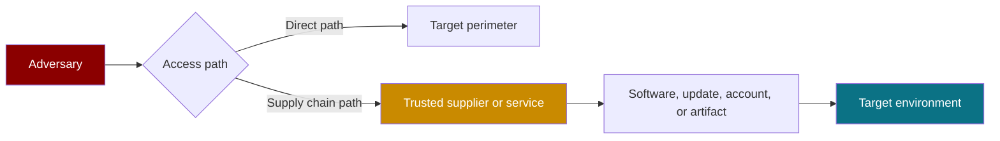
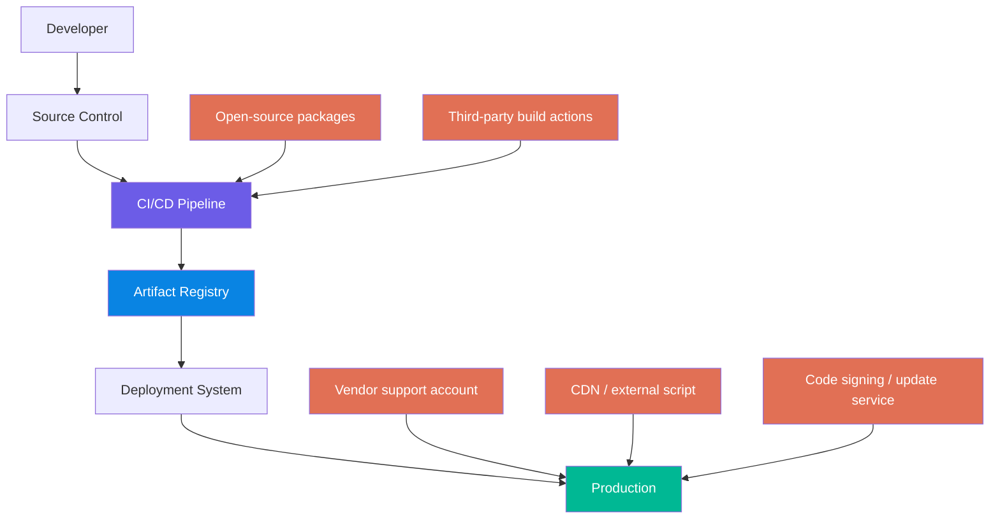
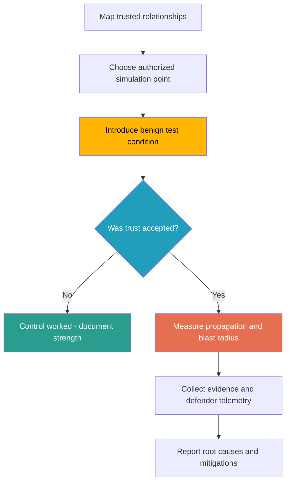
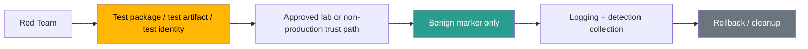
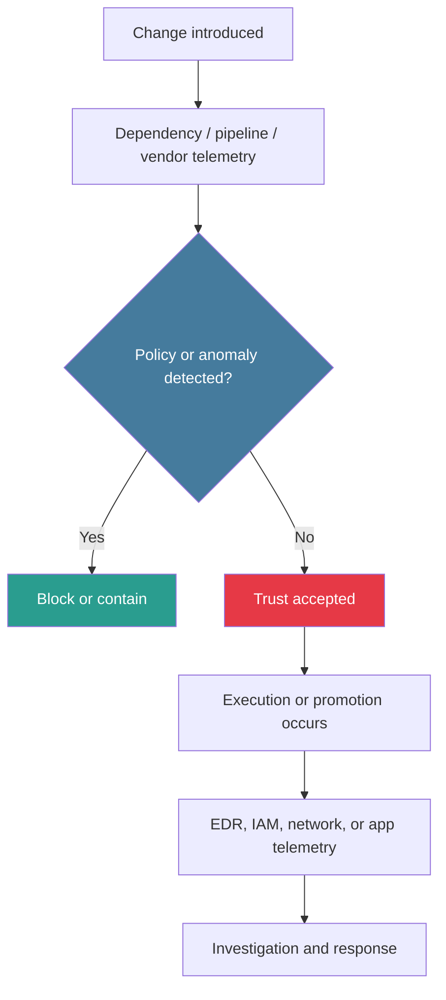

# Supply Chain Access

> **Authorized adversary-emulation framing:** This note explains how red teams safely assess whether trusted vendors, dependencies, build systems, and software delivery paths could become an **initial access** route into a target environment. It focuses on controlled validation, detection, and defense improvement — **not** real-world intrusion instructions.

---

## Table of Contents

1. [What Supply Chain Access Means](#1-what-supply-chain-access-means)
2. [Why It Matters for Initial Access](#2-why-it-matters-for-initial-access)
3. [The Trust Relationships Attackers Abuse](#3-the-trust-relationships-attackers-abuse)
4. [MITRE ATT&CK Mapping](#4-mitre-attck-mapping)
5. [How Supply Chain Access Happens](#5-how-supply-chain-access-happens)
6. [Common Supply Chain Access Paths](#6-common-supply-chain-access-paths)
7. [Beginner → Advanced Emulation Scenarios](#7-beginner--advanced-emulation-scenarios)
8. [How to Run This Safely](#8-how-to-run-this-safely)
9. [What to Observe During the Exercise](#9-what-to-observe-during-the-exercise)
10. [Detection Opportunities](#10-detection-opportunities)
11. [Defensive Controls That Matter Most](#11-defensive-controls-that-matter-most)
12. [Real-World Examples and Lessons](#12-real-world-examples-and-lessons)
13. [How to Report a Supply Chain Access Finding](#13-how-to-report-a-supply-chain-access-finding)
14. [Common Mistakes](#14-common-mistakes)
15. [Quick Review Checklist](#15-quick-review-checklist)

---

## 1. What Supply Chain Access Means

> **Difficulty:** Beginner → Advanced | **Category:** Red Teaming - Initial Access

A **supply chain access path** exists when the target trusts something **outside itself** so deeply that compromising or imitating that trusted source can become the easiest way in.

Instead of attacking the target head-on, the adversary abuses a relationship such as:

- a software dependency
- a CI/CD pipeline
- a build runner
- an artifact repository
- a software update channel
- a vendor remote-support account
- a managed service provider connection
- a third-party script loaded into a web application

### Simple mental model

A direct intrusion tries to break the front door.

A supply chain intrusion tries to arrive through a delivery truck that security already waves through.



### Why this is powerful

Supply chain access is dangerous because it turns **trust** into an attack surface.

| Property | Why It Matters |
|---|---|
| Indirect access | The target may block direct attack paths but still trust vendors, packages, or updates |
| Scale | One compromised component can affect many systems or customers |
| Legitimacy | Malicious activity may look like normal admin, deployment, or update traffic |
| Blast radius | A single weak trust link can spread into development, staging, and production |
| Detection delay | Defenders may focus on endpoints while the real problem starts in the build or vendor layer |

### Red team framing

In a **legitimate red team**, the goal is **not** to compromise public ecosystems or third parties. The goal is to **safely validate** whether the client's trust model would allow a controlled, benign supply chain scenario to reach a meaningful objective.

That usually means:

- using pre-approved lab artifacts or internal mirrors
- testing in non-production or tightly controlled production windows
- placing benign markers instead of harmful payloads
- measuring whether controls stop propagation
- documenting what defenders see at each stage

---

## 2. Why It Matters for Initial Access

When people hear *initial access*, they often think only about phishing, exposed services, or stolen credentials.

But many mature organizations are harder to penetrate directly. Their public perimeter may be fairly strong. Their **trust perimeter** may not be.

Supply chain access belongs in **Initial Access** because it can be the **first foothold** into the target's environment, identity plane, developer workflow, or deployment path.

### Common first footholds from supply chain weaknesses

- code running on a developer workstation through a trusted dependency
- secret exposure on a CI runner that builds the target's software
- unauthorized artifact promotion into a deployment pipeline
- browser-side execution through a third-party JavaScript dependency
- remote access into the target through a vendor or MSP identity
- trusted software update delivery into endpoints or servers

### A realistic red-team view

A supply chain path is often not just one tactic. It may combine:

- **Initial Access** — getting the first foothold through a trusted path
- **Credential Access** — reaching build secrets, signing material, or cloud tokens
- **Persistence** — hiding in release automation or package update flows
- **Privilege Escalation** — turning CI/CD privileges into broader infrastructure control
- **Defense Evasion** — blending into normal update or build behavior

So the lesson is important:

> **Supply chain access is rarely only a software problem. It is usually a trust-governance problem with technical consequences.**

---

## 3. The Trust Relationships Attackers Abuse

A strong way to think about supply chain risk is to map **who is trusted to execute, publish, deploy, or administer something**.



### Key trust anchors to examine

| Trust Anchor | Example | Why It Is Sensitive | What a Red Team Safely Validates |
|---|---|---|---|
| Dependency source | npm, PyPI, Maven, NuGet, internal package mirror | Installed code may execute automatically or influence builds | Whether pinning, allowlists, and registry controls block unauthorized or unexpected components |
| Development tools | Build plugins, GitHub Actions, container builders, linters | These often touch secrets and release pipelines | Whether untrusted tool changes can run, inherit secrets, or change artifacts |
| Artifact stores | Docker registry, package registry, binary repository | Trusted artifacts move toward production | Whether provenance, promotion gates, and signing checks actually work |
| Update channels | Endpoint updater, internal patching platform | Signed or trusted updates bypass normal suspicion | Whether clients verify origin, integrity, and rollout policies |
| Third-party web resources | CDN-hosted JS, analytics tags, chat widgets | Client browsers execute them with application trust | Whether SRI, CSP, and monitoring detect drift |
| Vendor/MSP accounts | Support portal, remote admin connection, contractor identity | Third-party identities may have broad access | Whether JIT access, segmentation, and monitoring contain vendor trust |
| Signing process | Release signing keys or automated signers | Signing can turn bad artifacts into trusted ones | Whether signing is isolated, approved, logged, and difficult to misuse |

### Core question

For each relationship, ask:

> **If this trusted source were compromised, confused, or misused, what would happen next inside the client environment?**

That is the heart of the exercise.

---

## 4. MITRE ATT&CK Mapping

MITRE ATT&CK places supply chain abuse under **T1195 - Supply Chain Compromise**.

### Relevant mappings

| ATT&CK Technique | Meaning in Practice |
|---|---|
| **T1195** - Supply Chain Compromise | Manipulating products or delivery mechanisms before the final consumer receives them |
| **T1195.001** - Compromise Software Dependencies and Development Tools | Abusing packages, build tooling, CI/CD components, or development dependencies |
| **T1195.002** - Compromise Software Supply Chain | Tampering with application software, release processes, or update mechanisms |
| **T1199** - Trusted Relationship | Leveraging an existing business or technical trust path, such as a vendor connection |
| **T1078** - Valid Accounts | Often relevant when vendor or pipeline identities are abused rather than software itself |

### What this means for defenders

ATT&CK mapping helps teams avoid a narrow mindset.

Supply chain access is not only:

- “a package problem”
- “a developer problem”
- “an AppSec problem”

It may also be:

- an IAM problem
- a CI/CD security problem
- a vendor management problem
- a monitoring gap
- a release engineering problem

---

## 5. How Supply Chain Access Happens

At a high level, supply chain access usually follows a predictable logic:

1. **Find a trusted path** into the target's software, identity, or operations
2. **Validate a safe insertion point** for a benign test artifact or authorized simulation
3. **Observe whether the target accepts and propagates that trust**
4. **Measure what execution, access, or visibility results**
5. **Stop before harm** and document the control failures or successes



### The important concept: acceptance is the real problem

In many environments, the key question is not “Could someone publish something bad somewhere?”

The more useful question is:

> **Would our environment automatically trust, execute, promote, or deploy it?**

That is the difference between a theoretical issue and an attack path.

---

## 6. Common Supply Chain Access Paths

### 6.1 Dependency and package trust

This is the most widely discussed form of supply chain risk.

Examples include:

- accidental trust in the wrong package source
- weak governance over internal package namespaces
- unreviewed dependency updates
- build steps that auto-execute install scripts
- unpinned third-party components inside CI workflows

**Red-team objective:** determine whether a benign, approved test component could be pulled into a build or workstation context because of weak dependency controls.

**Defender question:** do we know exactly which package source won, who approved it, and whether install-time behavior is constrained?

### 6.2 CI/CD pipeline compromise

Pipelines are extremely attractive because they often combine:

- source access
- secret access
- artifact creation
- environment promotion
- deployment authority

**Red-team objective:** validate whether a controlled change in pipeline inputs, actions, or artifacts would be blocked before it reaches staging or production.

**Defender question:** if a pipeline component changed unexpectedly, would we detect it before release?

### 6.3 Software update and release channels

Updates are trusted by design. That makes them an ideal place to test whether the organization relies too heavily on “it was signed” or “it came from the normal channel.”

**Red-team objective:** measure whether integrity checks, staged rollout, provenance, and release approvals meaningfully reduce trust abuse.

### 6.4 Third-party JavaScript and browser trust

Modern web applications often load external code from analytics providers, support widgets, CDNs, payment components, or tag managers.

**Red-team objective:** determine whether drift in a trusted third-party script would be noticed quickly and contained by CSP, SRI, or monitoring.

### 6.5 Vendor and managed service provider access

Not every supply chain path is code.

A vendor account with remote access, a support appliance, or a managed service connection can act like a supply chain pathway because the trust already exists.

**Red-team objective:** validate whether vendor trust is scoped, monitored, time-bounded, and segmented from crown-jewel systems.

### 6.6 Artifact registry and container image trust

Many organizations trust base images, internal registries, and build outputs without deeply verifying provenance.

**Red-team objective:** see whether an unauthorized or altered artifact could move through promotion gates because “it came from the right place.”

---

## 7. Beginner → Advanced Emulation Scenarios

The safest and most useful exercises scale by maturity.

### Level 1 — Tabletop or control-walkthrough

This is the best starting point for newer teams.

| Goal | Safe Setup | What You Learn |
|---|---|---|
| Understand the trust path | Walk through how a dependency, vendor, or update reaches production | Whether teams even know the path exists |
| Identify owners | Map engineering, IAM, vendor management, and SOC responsibilities | Whether ownership is fragmented or unclear |
| Test response logic | Ask who would approve, detect, contain, and rebuild | Whether the organization could respond under pressure |

**Best for:** immature programs, new red teams, highly regulated environments.

### Level 2 — Controlled dependency simulation in a lab or internal mirror

A more hands-on but still safe option is to use a **pre-approved test namespace, internal mirror, or isolated lab registry** to see whether unauthorized or unexpected components are accepted.

| Goal | Safe Setup | Evidence |
|---|---|---|
| Validate source control over dependencies | Use only internal test packages, benign markers, and non-production builds | Logs showing whether the package was requested, allowed, blocked, or executed |
| Validate runner isolation | Observe whether a build runner can reach secrets or make unexpected outbound connections | Runner telemetry, proxy logs, EDR events, alert quality |
| Validate review gates | Check whether lockfile drift, version changes, or source changes trigger review | Pull request controls, policy engine results, code owner approvals |

**Important:** the package or artifact should be **harmless and purpose-built for the exercise**, such as writing a marker, generating a benign log event, or calling an approved internal collector.

### Level 3 — CI/CD trust-path validation

This scenario asks whether the build and release process itself can be safely subverted inside an approved testing boundary.

| Goal | Safe Setup | What Success Looks Like |
|---|---|---|
| Validate pipeline integrity | Use a dedicated test repository, test runner, or non-production pipeline | The organization proves unauthorized changes cannot reach signed or promoted artifacts |
| Validate artifact promotion | Introduce a benign marker into a test artifact and track whether it is blocked or promoted | Clear evidence of gate effectiveness or failure |
| Validate provenance controls | Compare source, build metadata, and released artifact | Defenders can prove what built the artifact and why it should be trusted |

### Level 4 — Vendor identity simulation

Here the red team evaluates whether a **trusted external account** can become the initial access path.

| Goal | Safe Setup | Key Questions |
|---|---|---|
| Validate vendor account governance | Use synthetic vendor accounts or a dedicated test tenant | Are vendor sessions time-bound, approved, and recorded? |
| Validate segmentation | Allow access only to a lab segment or test service | Can vendor trust reach high-value systems too easily? |
| Validate conditional access | Simulate risky login attributes within agreed guardrails | Do identity protections treat vendor users differently from employees? |

### Level 5 — Full purple-team scenario

In a mature program, the best supply chain exercise is often a **purple-team** activity tied to concrete telemetry goals.

Example measurement goals:

- detect unexpected outbound traffic from build runners
- detect signer use outside release windows
- detect drift in third-party browser resources
- detect vendor logins from unusual contexts
- detect artifact hashes that do not match approved provenance

### A maturity ladder

```text
Tabletop only
   ↓
Benign lab package or artifact simulation
   ↓
CI/CD path validation in non-production
   ↓
Vendor identity path validation
   ↓
Full purple-team measurement with detection engineering
```

The more mature the organization, the more the exercise should move from “Could this happen?” to “How quickly would we detect, contain, and recover?”

---

## 8. How to Run This Safely

Supply chain exercises can become legally and operationally risky very quickly.

### Non-negotiable rules

1. **Get explicit written authorization** for every trust boundary involved
2. **Do not touch public ecosystems or real third parties** without approval from all affected parties
3. **Prefer internal mirrors, test namespaces, and isolated lab workflows**
4. **Use benign payloads only** — markers, logs, test callbacks, or dummy artifacts
5. **Never steal real secrets**; use canary or synthetic secrets when validation is required
6. **Use non-production first** unless production testing is explicitly approved and reversible
7. **Define stop conditions** before starting
8. **Coordinate with defenders and owners** so safety, logging, and rollback are clear

### Good vs bad exercise design

| Good Practice | Why It Is Good | Bad Practice | Why It Is Dangerous |
|---|---|---|---|
| Test package in an internal lab registry | Controlled, reversible, attributable | Publishing to a public registry | May impact third parties and exceed authorization |
| Synthetic vendor account | Safe identity-path validation | Using a real vendor account without coordination | Can break operations or create legal issues |
| Benign marker in test artifact | Measures trust acceptance safely | Delivering a real backdoor | Unnecessary harm and out-of-scope behavior |
| Canary secret or fake record | Tests exposure safely | Accessing real customer data | Creates privacy and handling problems |
| Pre-defined rollback | Limits blast radius | “We will figure it out later” | Poor safety discipline |

### A simple safety architecture



---

## 9. What to Observe During the Exercise

A good supply chain assessment is not only about whether something runs.

It is also about **where trust was granted**, **what controls were skipped**, and **what defenders could see**.

### Technical evidence to collect

| Area | Questions to Answer |
|---|---|
| Source selection | Which registry, artifact store, or vendor path was used? Why? |
| Authorization | Who or what was allowed to publish, approve, or deploy? |
| Execution | Where did the benign test component execute — workstation, runner, browser, server? |
| Secrets | Were any tokens, credentials, or environment variables reachable? |
| Propagation | Did the change remain local, or move into staging/production? |
| Detection | What alerts fired, when, and for which teams? |
| Logging | Which systems produced evidence, and which were blind? |
| Recovery | How quickly could the organization revoke trust and rebuild safely? |

### Questions that separate weak from strong programs

- Can the team prove the origin of a deployed artifact?
- Can the team distinguish “trusted but wrong” from “trusted and approved”?
- Do build systems have more access than they need?
- Are third-party identities tightly scoped?
- Can engineering rebuild from a known-good baseline quickly?

---

## 10. Detection Opportunities

Supply chain access often becomes visible **before** the final objective — but only if the organization watches the right layers.

### High-value telemetry sources

| Layer | Useful Signals |
|---|---|
| Source control | Unexpected workflow changes, unusual approvals, branch protection bypasses |
| Dependency management | New package sources, lockfile drift, sudden version jumps, install script execution |
| CI/CD runners | Unexpected outbound traffic, secret access spikes, new child processes, policy bypasses |
| Artifact registry | Unapproved publishers, unusual retags, provenance mismatch, hash drift |
| Signing infrastructure | Key use outside release windows, new signers, missing approval chain |
| Web telemetry | Third-party script hash changes, CSP reports, SRI failures |
| IAM | Vendor logins at unusual times, locations, devices, or privilege levels |
| Endpoint / EDR | Build tools spawning unusual processes, package-manager-driven anomalies |

### A defender-friendly detection flow



### What mature detection looks like

Mature organizations correlate:

- **change event** → **execution event** → **access event** → **deployment event**

That correlation is what turns isolated logs into a supply chain detection story.

---

## 11. Defensive Controls That Matter Most

The strongest defenses reduce **blind trust**.

### Foundational controls

| Control | Why It Helps |
|---|---|
| Asset and dependency inventory | You cannot defend trust paths you do not know exist |
| Lockfiles and version pinning | Reduces accidental drift and surprise dependency selection |
| Internal mirrors / allowlists | Limits what sources can be consumed |
| Code review and workflow protection | Makes it harder for unsafe changes to enter pipelines |
| Least privilege for CI/CD | Prevents build systems from becoming universal skeleton keys |
| Ephemeral runners and short-lived credentials | Reduces secret reuse and long-lived compromise value |
| Artifact signing and provenance validation | Helps prove what built the artifact and whether it should be trusted |
| Segmented vendor access | Limits business-partner trust from turning into broad internal reach |
| CSP and SRI for third-party scripts | Shrinks browser-side supply chain exposure |
| Rapid rebuild and revocation playbooks | Turns compromise into a containable event |

### Maturity view

| Maturity Level | Characteristics |
|---|---|
| Basic | Knows major vendors and dependencies, uses lockfiles, has some review controls |
| Intermediate | Uses internal mirrors, isolates runners, monitors artifact and identity changes |
| Advanced | Enforces provenance, signs releases, records vendor sessions, correlates change-to-deploy telemetry |
| Strongest | Can quickly revoke trust, rebuild from clean inputs, and prove software integrity end-to-end |

### Useful frameworks and references

- **MITRE ATT&CK T1195 / T1195.001 / T1195.002** for threat mapping
- **OWASP SCVS** for software supply chain verification controls
- broader practices around SBOMs, provenance, signing, and release integrity

---

## 12. Real-World Examples and Lessons

These cases matter because they show that supply chain compromise is not hypothetical.

### Case study summary

| Case | What Happened | Main Lesson |
|---|---|---|
| **SolarWinds (2020)** | Attackers abused a trusted software build and update path to distribute malicious code | Trust in update channels must be backed by strong build isolation, integrity validation, and monitoring |
| **3CX (2023)** | A software vendor distributed a trojanized application; the incident itself was linked to an earlier supply chain compromise | Supply chain abuse can be **second-order**: one vendor compromise can lead to another |
| **Dependency confusion research (2021)** | Public packages with names matching internal packages were accepted by some build processes | Namespace governance and deterministic package sourcing matter |
| **event-stream ecosystem incident (2018)** | A trusted open-source dependency was modified in a targeted way | Maintainer trust, package review, and dependency monitoring all matter |

### What defenders should take away

1. **Trusted does not mean safe**
2. **Signed does not mean sufficiently reviewed**
3. **Build systems are high-value targets**
4. **Vendor risk is also identity risk**
5. **Recovery speed matters as much as prevention**

---

## 13. How to Report a Supply Chain Access Finding

A strong report should explain the **trust path**, not just the final symptom.

### Good finding structure

| Section | What to Include |
|---|---|
| Executive summary | Why this trust relationship matters to the business |
| Attack path summary | How the benign simulation moved from trusted source to internal execution or access |
| Preconditions | Which trust decisions, identities, or controls made the path possible |
| Evidence | Logs, screenshots, hashes, approvals, telemetry timeline |
| Detection results | What defenders saw, missed, or investigated late |
| Blast radius | Which environments, identities, or data paths were reachable |
| Root causes | Governance, IAM, pipeline design, artifact integrity, monitoring gaps |
| Remediation | Concrete control improvements prioritized by risk and feasibility |

### Example narrative

> A controlled, benign supply chain simulation demonstrated that the organization would accept a modified build input from a trusted path without strong provenance validation. The change was able to reach a non-production deployment boundary because dependency source controls, CI secret isolation, and artifact promotion approvals were weaker than expected. No meaningful alert was generated until after execution telemetry appeared on the runner.

That style is much more useful than simply saying:

> “Supply chain attack possible.”

### Report the whole timeline

```text
Trusted source identified
  ↓
Benign test condition introduced
  ↓
Environment accepted trust
  ↓
Execution or promotion observed
  ↓
Detection quality measured
  ↓
Control gaps and recovery needs documented
```

---

## 14. Common Mistakes

### Focusing only on open-source packages

Dependencies matter, but many real problems live in:

- CI/CD permissions
- artifact promotion logic
- vendor access
- signing workflows
- third-party web resources

### Treating “vendor risk” as only a procurement issue

A vendor relationship becomes a red-team concern when it creates **technical trust** that can produce access.

### Measuring only insertion, not acceptance

It is not enough to prove that a test artifact existed. The real question is whether the organization **trusted it enough to act on it**.

### Ignoring recovery

If a client cannot revoke, rebuild, and re-establish trust quickly, the risk remains high even if detection improves.

### Running unsafe exercises

The most damaging mistake is testing outside authorization boundaries — especially against public registries, real vendor ecosystems, or production without defined safety controls.

---

## 15. Quick Review Checklist

Use these questions when planning or reviewing a supply chain access exercise:

### Trust mapping

- What external or semi-external systems can introduce code, artifacts, updates, or admin access?
- Which of those are trusted automatically?
- Who owns each trust relationship?

### Prevention

- Are dependency sources deterministic and controlled?
- Are workflows, actions, plugins, and base images pinned and reviewed?
- Are CI/CD privileges minimized and secrets short-lived?
- Are vendor accounts segmented, approved, and monitored?
- Are third-party browser scripts protected with SRI and CSP where possible?

### Detection

- Can defenders see dependency drift, artifact drift, and signer misuse?
- Do build runners generate useful security telemetry?
- Are vendor login anomalies reviewed promptly?
- Can the organization correlate source, build, artifact, and deployment events?

### Recovery

- Can trust be revoked quickly?
- Can affected artifacts be identified quickly?
- Can software be rebuilt from clean inputs?
- Is there a known-good path for emergency re-release?

---

> **Defender mindset:** The core question is not “Could someone attack our supply chain?” The better question is “Where do we extend trust, what would happen if that trust were abused, and how quickly would we know?”

## References

- MITRE ATT&CK - T1195 Supply Chain Compromise: https://attack.mitre.org/techniques/T1195/
- MITRE ATT&CK - T1195.001 Compromise Software Dependencies and Development Tools: https://attack.mitre.org/techniques/T1195/001/
- MITRE ATT&CK - T1195.002 Compromise Software Supply Chain: https://attack.mitre.org/techniques/T1195/002/
- OWASP Software Component Verification Standard (SCVS): https://owasp.org/www-project-software-component-verification-standard/
