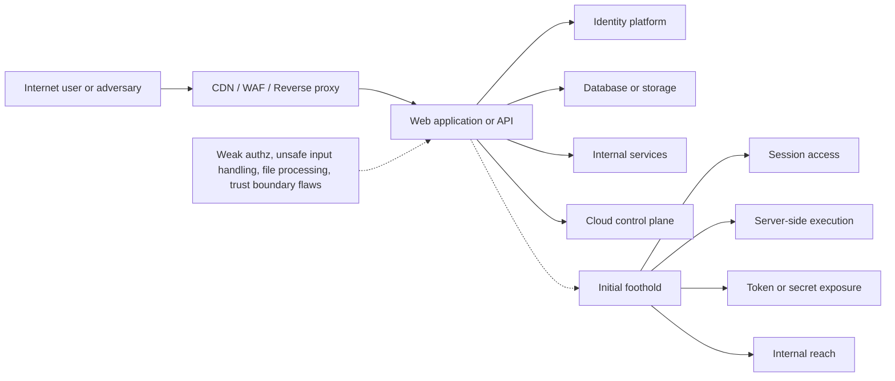
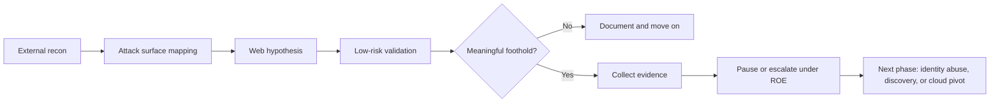
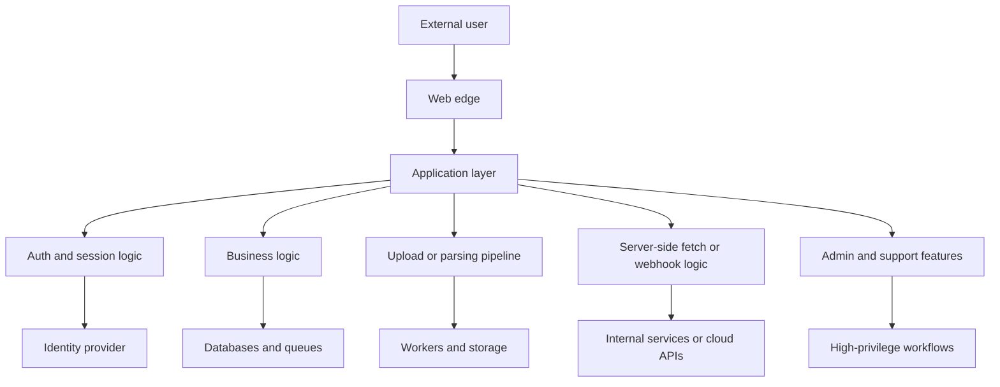
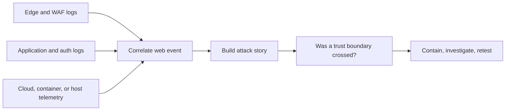
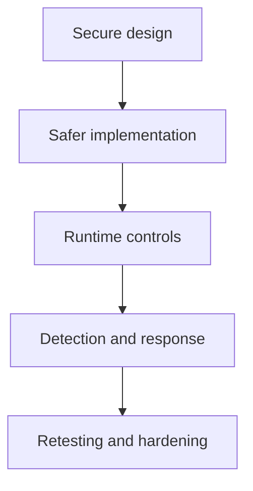

# Web Exploitation

> **Phase 5 — Initial Access**  
> **Focus:** How an authorized red team evaluates whether internet-facing web applications, APIs, and supporting web services could provide an adversary with an initial foothold.  
> **Safety note:** This note is for authorized adversary emulation, security validation, and defensive learning only. It explains concepts, decision-making, and safe proof strategies without providing intrusion playbooks or harmful exploitation steps.

---

**Relevant ATT&CK concepts:** TA0001 Initial Access | T1190 Exploit Public-Facing Application | T1078 Valid Accounts

---

## Table of Contents

1. [Why Web Exploitation Matters in Initial Access](#1-why-web-exploitation-matters-in-initial-access)
2. [Beginner View — What “Web Exploitation” Really Means](#2-beginner-view--what-web-exploitation-really-means)
3. [Where Web Entry Fits in a Realistic Attack Chain](#3-where-web-entry-fits-in-a-realistic-attack-chain)
4. [What a Red Team Actually Looks For](#4-what-a-red-team-actually-looks-for)
5. [A Safe and Practical Validation Workflow](#5-a-safe-and-practical-validation-workflow)
6. [Common Vulnerability Families and Why They Matter](#6-common-vulnerability-families-and-why-they-matter)
7. [From Web Weakness to Adversary Objective](#7-from-web-weakness-to-adversary-objective)
8. [Evidence, Safety, and Proof Without Harm](#8-evidence-safety-and-proof-without-harm)
9. [Detection Opportunities](#9-detection-opportunities)
10. [Defensive Priorities](#10-defensive-priorities)
11. [Common Pitfalls](#11-common-pitfalls)
12. [References](#12-references)

---

## 1. Why Web Exploitation Matters in Initial Access

Public-facing web systems are one of the most important initial access surfaces because they are:

- reachable from the internet
- connected to business workflows
- often trusted by employees, customers, and partners
- frequently integrated with identity, storage, payment, and internal APIs
- changed rapidly, which increases the chance of mistakes

In red teaming, **web exploitation** does not simply mean “find a bug in a website.” It means evaluating whether weaknesses in web-facing systems could let an adversary gain one of the first meaningful advantages they need, such as:

- a valid session in a sensitive application
- unauthorized access to protected records or workflows
- execution in a server-side application context
- access to secrets, tokens, or cloud metadata that can be reused elsewhere
- a pivot point into internal services that were never meant to be internet-exposed

That is why web exploitation often sits at the intersection of:

- **initial access**
- **credential access**
- **cloud abuse**
- **privilege escalation**
- **lateral movement**



A single weakness in the web tier can therefore become the **opening move** for a much larger campaign.

---

## 2. Beginner View — What “Web Exploitation” Really Means

At a beginner level, web exploitation means:

> finding a way to make a web application do something it should not do, then determining whether that behavior could create a realistic foothold for an adversary.

That foothold does **not** always mean “full server compromise.” In practice, initial access through a web application may look like any of the following:

| Outcome | What It Means | Why It Matters |
|---|---|---|
| **Unauthorized session access** | The adversary acts as a user they should not control | Can expose sensitive business functions immediately |
| **Privilege misuse through the app** | The application lets low-privilege users perform high-privilege actions | Often leads to admin workflows or account takeover |
| **Server-side code path control** | Unsafe input reaches an interpreter, command runner, template engine, or parser | Can become direct foothold on the host or container |
| **Indirect access through trust abuse** | The app can reach internal resources, cloud metadata, or privileged backends | Lets the adversary inherit trust they do not have directly |
| **Client-side session compromise** | A browser-side weakness leads to session theft or action abuse | Can still become valid-account initial access |

A useful beginner mental model is:

```text
Web bug -> trust broken -> unauthorized capability -> foothold
```

The most important word in that chain is **capability**.

Professional operators do not ask only:

- “Is this vulnerable?”

They also ask:

- “What new capability would this give a realistic adversary?”
- “Would that capability matter in this environment?”
- “Can we prove it safely?”

---

## 3. Where Web Entry Fits in a Realistic Attack Chain

Web exploitation is rarely the whole campaign. It is usually an **entry mechanism** into a broader path.

A realistic chain often looks like this:



### Example campaign logic

| Web finding type | Immediate capability | Possible next phase |
|---|---|---|
| Broken access control in admin workflow | Administrative application access | Identity abuse, data access, business-function misuse |
| Session handling flaw | Valid user session | Discovery inside the application, higher-value account targeting |
| Server-side injection or template abuse | Application-host execution path | Credential access, persistence, discovery |
| SSRF into metadata or internal APIs | Internal trust abuse | Cloud access, token theft, service-to-service pivoting |
| File processing weakness | Controlled processing path on the server | Server foothold or stored execution opportunities |

This is why web exploitation in red teaming should always be evaluated as part of an **attack path**, not as an isolated CVE or bug bounty finding.

---

## 4. What a Red Team Actually Looks For

A strong red team does not begin by throwing payloads at random endpoints. It starts by understanding the web system as a set of **trust boundaries**.

### Key questions

1. **What is exposed?**  
   Main site, APIs, admin panels, upload handlers, mobile backends, forgotten subdomains, developer tools.

2. **What identities exist?**  
   Anonymous users, standard users, support roles, admins, service accounts, API consumers.

3. **What decisions does the app make?**  
   Authentication, authorization, file handling, data export, payment actions, password reset, approval flows.

4. **What does the app trust?**  
   Client input, headers, cookies, tokens, internal services, metadata endpoints, background workers, third-party providers.

5. **What is behind the app?**  
   Databases, object storage, queues, internal APIs, cloud roles, containers, CI/CD hooks.

### Operator view of the attack surface

| Area | What operators evaluate | Why it matters for initial access |
|---|---|---|
| **Authentication** | Login flow, password reset, SSO, MFA recovery, token lifecycle | Valid-account access is often more valuable than noisy exploitation |
| **Authorization** | Role separation, object ownership, admin-only routes, API method controls | Broken access control can provide immediate privileged reach |
| **Input handling** | How the app processes structured and unstructured input | Unsafe handling can create execution or data exposure paths |
| **File processing** | Uploads, imports, document conversion, image resizing, archive extraction | Complex parsing paths frequently hide serious weaknesses |
| **Server-to-server requests** | Webhooks, URL fetchers, previews, integrations | Trust abuse can expose internal networks and cloud services |
| **Operational interfaces** | Admin consoles, debug endpoints, monitoring panels, CI tools | These often have high privilege and weak visibility |
| **Business workflows** | Approvals, account linking, invitation flows, checkout, refunds | Logic flaws can bypass controls without needing classic “exploits” |

### Simple architecture view



If you understand these trust boundaries, you understand where initial access is most likely to emerge.

---

## 5. A Safe and Practical Validation Workflow

In authorized adversary emulation, the right workflow matters as much as the finding itself.

### Phase 1 — Establish guardrails first

Before validating any web weakness, define:

- in-scope hosts, paths, and identities
- allowed proof methods
- forbidden actions such as destructive writes or customer-impacting tests
- pause conditions and escalation requirements
- monitoring and deconfliction expectations

### Phase 2 — Map the application

Build a structured understanding of:

- reachable endpoints and subdomains
- authenticated and unauthenticated functionality
- user roles and trust transitions
- integrations with cloud, storage, search, email, or internal APIs
- high-value workflows such as admin actions or data export

### Phase 3 — Prioritize by adversary value

A professional team prioritizes weaknesses that would realistically help the modeled adversary achieve the objective.

| Prioritization factor | Higher-value when... |
|---|---|
| **Reachability** | the feature is internet-facing or broadly accessible |
| **Privilege gain** | it leads to admin actions, trusted sessions, or server-side control |
| **Blast radius** | it touches many tenants, records, or business functions |
| **Stealth** | it can be abused with normal-looking traffic or a valid account |
| **Pivot potential** | it exposes tokens, internal APIs, or cloud permissions |

### Phase 4 — Validate with the least risky proof first

Start with low-impact confirmation:

- verify the behavior exists
- confirm access-control decisions are inconsistent
- prove a trust boundary can be crossed
- demonstrate read-only impact where possible
- avoid disruptive proof when a smaller proof is enough

### Phase 5 — Capture evidence and decide whether escalation is necessary

Evidence should answer:

- what was reachable
- what should have blocked it
- what actually happened
- what capability this created
- whether the next phase would be realistic

A mature red team often stops after proving the key point.

> **Good red teaming is not about doing the most. It is about proving the most important thing with the least risk.**

---

## 6. Common Vulnerability Families and Why They Matter

Web exploitation for initial access is really a collection of weakness families. The goal is to understand what each family can enable.

### 6.1 Authentication and session weaknesses

These include flaws in:

- password reset and account recovery
- MFA bypass or downgrade paths
- insecure session fixation or session invalidation
- token handling, token scope, and token lifetime
- weak federation or SSO trust assumptions

**Why they matter:** if an operator can safely prove unauthorized session acquisition, the result may be indistinguishable from a normal user login from the application’s perspective.

### 6.2 Broken access control

OWASP identifies broken access control as one of the most common and impactful web risk areas. In initial access terms, this matters because the first foothold may come not from code execution, but from **acting outside intended permissions**.

Common examples include:

- accessing objects that belong to other users
- reaching privileged routes that should be blocked
- calling write actions with insufficient role checks
- using alternate HTTP methods or API paths to bypass controls

**Why they matter:** many real intrusions succeed because the application grants a business capability the adversary should never have received.

### 6.3 Injection and unsafe server-side interpretation

OWASP also highlights injection as a high-impact class because unsafe input can influence how the server interprets data.

Relevant categories include:

- SQL and data-layer injection
- command or shell invocation issues
- server-side template injection
- unsafe deserialization or parser abuse
- expression-language and interpreter misuse

**Why they matter:** some of these issues provide direct execution paths, while others provide sensitive data access that enables the next phase.

### 6.4 File handling and content processing weaknesses

High-risk patterns include:

- unsafe upload validation
- insecure conversion or preview pipelines
- archive extraction trust problems
- document processors with privileged backend access
- storage paths that expose sensitive outputs or temporary files

**Why they matter:** file workflows are complex, business-critical, and often bridged to background workers that defenders monitor poorly.

### 6.5 SSRF and trust-boundary abuse

Server-side request behavior becomes dangerous when an application can be induced to contact destinations it should not reach.

Potential impact includes:

- internal service discovery
- metadata or cloud role exposure
- access to management interfaces
- reaching trusted services from a more privileged network position

**Why they matter:** SSRF is often less about the HTTP response itself and more about inheriting the server’s network trust.

### 6.6 Client-side weaknesses that lead to valid-account access

Not every initial foothold is server compromise. Client-side issues can matter when they lead to:

- session theft
- action abuse in a trusted browser context
- password-reset manipulation
- privileged workflow execution through a victim session

**Why they matter:** the resulting foothold may be a valid user session, which is often quieter and more realistic than a noisy exploit chain.

### 6.7 Business logic flaws

These are failures in the way a workflow is designed, not just coded.

Examples include:

- invitation flows that assign the wrong trust level
- approval sequences that can be skipped
- checkout or redemption paths that apply logic inconsistently
- account-linking designs that let users bind resources they do not own

**Why they matter:** logic flaws can produce high-value access while bypassing traditional signatures and technical detections.

### Summary table

| Weakness family | Initial access value | Typical follow-on value |
|---|---|---|
| Authentication/session flaws | Valid account or privileged session | Discovery, privilege growth, quiet persistence |
| Broken access control | Unauthorized data or admin capability | Business-function abuse, broader privilege |
| Injection / template / parser abuse | Server-side code path or sensitive data access | Host foothold, credential access, lateral preparation |
| File handling weaknesses | Controlled processing on backend systems | Execution, stored abuse, staging point |
| SSRF / trust abuse | Internal reach or cloud token exposure | Service pivot, cloud control-plane access |
| Client-side compromise | User session or privileged browser action | Account takeover, operational impersonation |
| Business logic flaws | Unauthorized workflow completion | Privilege gain with minimal technical noise |

---

## 7. From Web Weakness to Adversary Objective

A web issue becomes strategically important when it supports a realistic adversary objective.

### Objective-focused thinking

| Adversary objective | Web condition that may enable it | Safe validation question |
|---|---|---|
| **Obtain a trusted session** | auth or session weakness, client-side session compromise | Can we safely prove unauthorized use of a session-bound feature? |
| **Reach sensitive business data** | access control failure, export flaw, object ownership failure | Can we read data beyond intended permission boundaries? |
| **Gain server-side foothold** | injection, parser flaw, unsafe processing path | Can we confirm controlled server-side behavior without impact? |
| **Abuse cloud or internal trust** | SSRF, webhook abuse, metadata reachability | Can we show the app reaches sensitive internal resources? |
| **Prepare for later phases** | secret exposure, admin panel access, token leakage | Does this create a credible pivot into identity, discovery, or cloud abuse? |

### Example reasoning paths

#### Path A — Application privilege becomes campaign foothold

```text
Weak authorization -> admin function reachable -> privileged business action -> meaningful foothold
```

#### Path B — Trust abuse becomes cloud access path

```text
Server-side fetch weakness -> metadata or internal service reach -> token exposure -> broader environment access
```

#### Path C — Client-side compromise becomes valid-account access

```text
Browser-side weakness -> user session compromise -> access as trusted user -> quiet entry into business workflows
```

These paths show why the most important question is not “Is the bug severe?” but:

> **Does this create a realistic first foothold for the adversary model we are testing?**

---

## 8. Evidence, Safety, and Proof Without Harm

Authorized web exploitation should be **evidence-driven** and **minimal-impact**.

### Good proof principles

| Principle | What it looks like |
|---|---|
| **Prove the boundary break** | Show the access decision, trust decision, or unsafe behavior clearly |
| **Prefer non-destructive evidence** | Use harmless identifiers, controlled test objects, or read-only proof |
| **Stop when the objective is proved** | Do not continue deeper just because it is possible |
| **Keep impact reversible** | Use temporary, approved artifacts and document cleanup |
| **Make findings replayable** | Record the exact condition so defenders can retest safely |

### Safe proof examples

Safer proofs often include:

- demonstrating access to a controlled test record rather than production customer data
- confirming a privileged route is reachable without performing a destructive action
- proving server-side execution with an approved benign marker rather than operational commands
- confirming metadata reachability or internal request capability without abusing resulting credentials
- showing a session boundary failure with a dedicated test account pair

### Stop conditions

Pause immediately when:

- customer impact becomes likely
- the behavior is more powerful than expected
- sensitive regulated data is at risk
- production stability may be affected
- the next step exceeds the agreed rules of engagement

The best evidence is the evidence that proves the point **without becoming the incident**.

---

## 9. Detection Opportunities

Web exploitation is not only an application security problem. It is also a telemetry and response problem.

### Important observables

| Signal source | What defenders may see |
|---|---|
| **Web access logs** | unusual routes, high-entropy parameters, repeated authorization failures, unexpected methods |
| **Application logs** | parser errors, template exceptions, access-denied bypass patterns, abnormal workflow transitions |
| **Identity telemetry** | strange session creation, token reuse, impossible travel, admin activity from unusual origins |
| **WAF / edge telemetry** | blocked payload classes, rate anomalies, header manipulation, protocol oddities |
| **Cloud and metadata controls** | unexpected requests from web tiers to metadata or control-plane APIs |
| **Backend service logs** | internal API access that originates from web-facing systems unexpectedly |
| **Endpoint or container telemetry** | unusual child processes, new interpreters, unexpected network destinations |

### Detection mindset



### High-value detection questions

- Did an internet-facing app suddenly access internal-only services?
- Did a low-privilege user trigger an admin-only workflow?
- Did repeated denied requests become a successful privileged request?
- Did the web tier generate unusual errors immediately before sensitive actions?
- Did a session or token appear to change user context unexpectedly?

Strong detection is often about **correlation**, not a single signature.

---

## 10. Defensive Priorities

The goal is not only to fix one bug. It is to make web-originated initial access much harder overall.

| Defensive priority | Why it matters |
|---|---|
| **Centralized authorization design** | Prevent inconsistent access checks across routes and APIs |
| **Secure session and token lifecycle** | Reduce the value of stolen or mis-scoped sessions |
| **Strict server-side validation** | Limit unsafe interpretation of attacker-controlled input |
| **Safe file-processing architecture** | Isolate risky parsers and conversion pipelines |
| **Egress and metadata restrictions** | Prevent web servers from reaching sensitive internal or cloud endpoints freely |
| **Least privilege for app identities** | Reduce blast radius when the web tier is abused |
| **High-quality application logging** | Make trust-boundary violations visible and searchable |
| **Threat-informed testing** | Focus validation on realistic entry paths tied to your environment |

### A layered defensive model



No single control solves web-originated initial access. The goal is layered failure resistance:

- prevent what you can
- detect what gets through
- limit blast radius when a control fails
- retest the original path after remediation

---

## 11. Common Pitfalls

### Treating web exploitation as only “RCE hunting”

Many high-value initial access paths come from authorization, session, and workflow failures rather than dramatic code execution.

### Confusing severity with campaign relevance

A technically severe issue is not always the best adversary path. A quieter session or admin workflow flaw may matter more.

### Ignoring business logic

If you only test technical input handling, you may miss the workflows that actually let adversaries win.

### Proving too much in production

In authorized engagements, excessive proof can create avoidable risk. Prove the key point, then stop.

### Missing the backend trust relationships

The app itself may only be the front door. The real prize may be the identities, storage, queues, metadata, and internal services behind it.

### Testing without a defender view

A red-team finding is more valuable when it explains:

- what defenders should have seen
- where telemetry was missing
- which control would have interrupted the path earlier

---

## 12. References

- [MITRE ATT&CK - T1190: Exploit Public-Facing Application](https://attack.mitre.org/techniques/T1190/)
- [OWASP Web Security Testing Guide](https://owasp.org/www-project-web-security-testing-guide/)
- [OWASP Top 10: A01 Broken Access Control](https://owasp.org/Top10/2021/A01_2021-Broken_Access_Control/)
- [OWASP Top 10: A03 Injection](https://owasp.org/Top10/2021/A03_2021-Injection/)
- [PortSwigger Web Security Academy](https://portswigger.net/web-security)

---

> **Defender mindset:** Treat internet-facing web applications as identity, data, and trust brokers. The most dangerous web-originated intrusions are often the ones that look most like normal application behavior, so prioritize strong authorization, tight backend trust boundaries, and telemetry that explains not just requests, but the business decisions those requests triggered.
