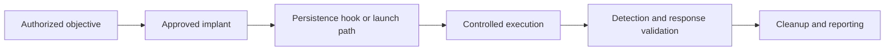
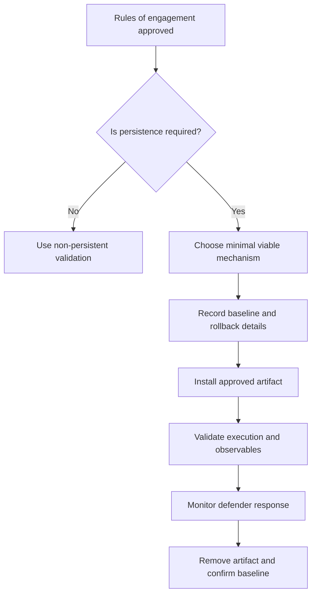
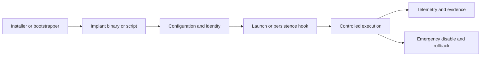
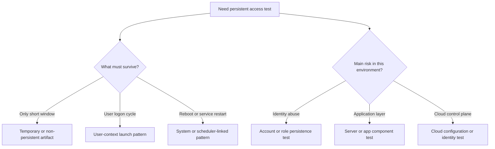
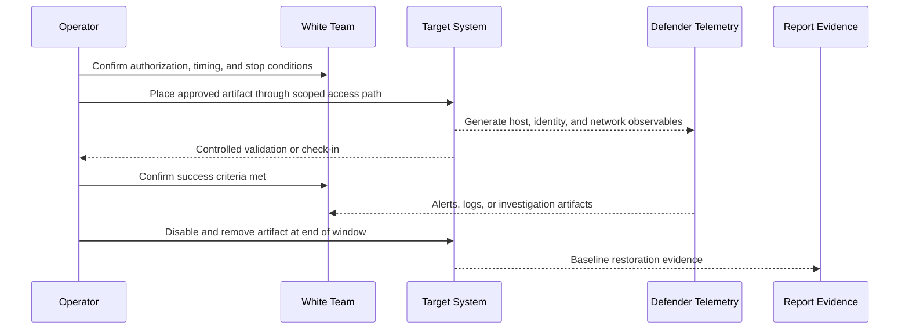
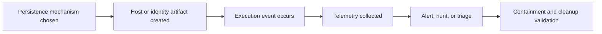
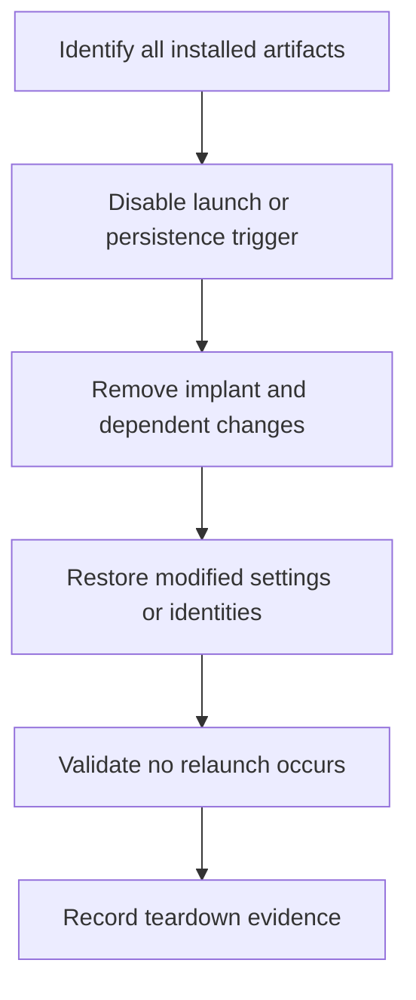

# Implant Installation

> **Difficulty:** Beginner -> Advanced | **Category:** Red Teaming — Persistence | **Safety:** Authorized adversary emulation only

In a professional red-team exercise, **implant installation** means placing an **approved, controlled access artifact** on a scoped system so the team can test persistence, response, visibility, and cleanup.

This note focuses on **planning, decision-making, observables, and teardown**. It intentionally avoids harmful step-by-step intrusion instructions or covert deployment playbooks.

---

## Table of Contents

1. [What Implant Installation Means](#1-what-implant-installation-means)
2. [Why Red Teams Install Implants](#2-why-red-teams-install-implants)
3. [Safety, Authorization, and Governance](#3-safety-authorization-and-governance)
4. [The Anatomy of an Implant Installation](#4-the-anatomy-of-an-implant-installation)
5. [Common Installation Pattern Families](#5-common-installation-pattern-families)
6. [How to Choose the Right Pattern](#6-how-to-choose-the-right-pattern)
7. [A Controlled Installation Workflow](#7-a-controlled-installation-workflow)
8. [Validation and Evidence Collection](#8-validation-and-evidence-collection)
9. [Detection and Defender Observables](#9-detection-and-defender-observables)
10. [Cleanup and Rollback](#10-cleanup-and-rollback)
11. [Common Mistakes](#11-common-mistakes)
12. [References](#12-references)

---

## 1. What Implant Installation Means

At a beginner level, think of an implant as a **temporary, approved test fixture** for security operations.

It is not just "malware placed on a host." In authorized adversary emulation, it is a **controlled mechanism** used to answer questions such as:

- Can the team maintain access across reboot or logon events?
- Which host, identity, and control-plane signals become visible?
- How quickly do defenders detect the persistence attempt?
- Can the organization remove the mechanism cleanly and confidently?

### Useful terms

| Term | Practical meaning |
|---|---|
| Implant | The resident agent, launcher, or controlled access artifact used in the exercise |
| Installer / bootstrapper | The component that places or registers the implant |
| Persistence hook | The trigger that re-launches or preserves the implant |
| Beacon / check-in | The implant's controlled contact with its operator or test infrastructure |
| Emergency disable path | A deliberate way to disable or remove the artifact quickly |
| Rollback plan | The documented process for restoring the system to baseline |

### Implant installation vs persistence

These ideas overlap, but they are not identical.

| Concept | Main question |
|---|---|
| Implant installation | How is the controlled artifact placed and validated? |
| Persistence | How does access survive interruption events? |
| C2 / access maintenance | How is that access coordinated over time? |

---

## 2. Why Red Teams Install Implants

A mature red team does not install an implant just because it can.

The team installs one only when it supports a **clear test objective**.

### Common exercise goals

- validate whether access survives reboot, logout, or service restart
- test visibility of host changes such as new services, tasks, autoruns, or account modifications
- measure blue-team response to a realistic persistence story
- support longer-form adversary emulation where dwell time matters
- verify whether cleanup, containment, and revalidation procedures actually work

### When *not* to install one

In many engagements, a persistent artifact is unnecessary.

| Situation | Better choice |
|---|---|
| One-time proof of access is enough | Use an ephemeral or memory-only demonstration |
| High-risk production system with fragile dependencies | Use simulation, tabletop validation, or a tightly controlled temporary artifact |
| The client mainly wants visibility testing | Prefer observable but low-impact methods with fast rollback |
| Rules of engagement disallow persistence | Do not install one |

### Relevant ATT&CK concepts

These are useful conceptual anchors for reporting and defender mapping:

| ATT&CK concept | Why it matters here |
|---|---|
| TA0003 — Persistence | The tactic focused on maintaining access |
| T1543 — Create or Modify System Process | Covers service or daemon-based persistence concepts |
| T1053 — Scheduled Task / Job | Covers recurring or trigger-based execution concepts |
| T1547 — Boot or Logon Autostart Execution | Covers user or system startup execution patterns |
| T1098 — Account Manipulation | Covers identity-based ways access can be preserved |
| T1505 — Server Software Component | Covers application- or server-resident footholds |

---

## 3. Safety, Authorization, and Governance

This is the most important section.

Implant installation in a real environment should happen **only** when written authorization, scope, and rollback are already in place.

### Minimum control gates

| Control gate | Why it matters |
|---|---|
| Written authorization | Confirms the activity is approved, legal, and expected |
| Scoped targets | Prevents drift into systems or tenants that were never approved |
| Allowed mechanism families | Limits the team to persistence methods explicitly permitted by the engagement |
| Stop conditions | Defines when the team must pause, remove, or escalate to the white team |
| Emergency disable path | Reduces risk if instability or unintended spread appears |
| Cleanup ownership | Makes sure removal is someone's explicit responsibility |
| Evidence plan | Ensures every change is documented for rollback and reporting |
| Time limit | Prevents test artifacts from quietly outliving the engagement |

### A safe engagement mindset

### Practical pre-install checklist

- Is the business reason for persistence clear?
- Which specific systems, users, or cloud resources are in scope?
- Which persistence families are explicitly allowed?
- What evidence proves success without causing harm?
- Who can authorize emergency removal?
- How will the team verify the artifact is gone at the end?

A strong red team asks these questions **before** placing anything.

---

## 4. The Anatomy of an Implant Installation

Even simple installations have several moving parts.

### What advanced teams think about

| Component | Questions to ask |
|---|---|
| Artifact | Is it approved, versioned, and tied to the exercise ID? |
| Configuration | Does it contain only the minimum settings needed for the objective? |
| Launch path | Does it depend on boot, logon, task scheduling, service start, or an app event? |
| Identity context | Will it execute as a user, service account, privileged account, or app identity? |
| Telemetry | What logs, alerts, or changes should defenders see? |
| Rollback | What exact files, tasks, services, keys, accounts, or policies must be removed later? |

### Beginner mental model

A useful beginner model is:

> **Installer places the artifact -> a trigger launches it -> defenders should be able to observe the trigger, the artifact, or the resulting behavior -> the team then removes it and proves the system returned to baseline.**

---

## 5. Common Installation Pattern Families

This note stays at the pattern level rather than providing deployment instructions.

### Pattern comparison

| Pattern family | High-level example | Typical value | Main tradeoff | Defender visibility |
|---|---|---|---|---|
| Service / daemon based | Registered as a background service that starts automatically | Reliable, survives reboot well | Usually requires higher privileges and leaves durable host artifacts | Service definitions, startup config, host logs |
| Scheduled execution | Registered through an OS scheduler or recurring trigger | Flexible timing and trigger control | Metadata is often easy for defenders to enumerate | Scheduler logs, task metadata, cron/task changes |
| Boot / logon autostart | Runs when a user logs in or the system starts | Good for user-context or startup testing | Dependent on user behavior or startup path | Autorun locations, startup folders, registry/login items |
| Account / identity based | Additional credentials, delegated access, or role changes | Tests identity-centric persistence stories | Can affect governance-sensitive systems | IAM audit logs, group changes, key changes |
| Application / server component | Plugin, extension, server-side component, or web app foothold | Useful when the objective is app-layer persistence | Can create high business risk if poorly controlled | App logs, deployment records, file integrity alerts |
| Cloud control-plane persistence | Tenant, instance, automation, or service-principal changes | Realistic for cloud-heavy organizations | Very visible in mature audit environments | Cloud audit trails, policy changes, API activity |
| Temporary non-persistent implant | A short-lived agent with no reboot survival goal | Safer for visibility testing | Lower realism for long-dwell scenarios | Process and network telemetry rather than persistence artifacts |

### Key lesson

The "best" installation pattern is usually **not** the most durable one.

It is the one that:

- answers the exercise question,
- fits the environment,
- stays within the rules of engagement,
- and can be removed cleanly.

---

## 6. How to Choose the Right Pattern

A good selection process starts with constraints, not tools.

### Decision factors

| Question | Why it matters |
|---|---|
| Must access survive a reboot? | Pushes the team toward stronger startup or service-linked patterns |
| Must execution happen in a user context? | Favors user-logon or user-scope approaches |
| Is identity abuse the real risk? | Suggests testing account or role persistence rather than host persistence |
| Is the environment cloud-first? | Control-plane persistence may be more realistic than host-based persistence |
| Is the system fragile or business critical? | Favors minimal-impact or temporary approaches |
| Is defender telemetry the main goal? | Choose the mechanism that best exercises the target detections |

### Simple decision diagram

### Operator and defender viewpoints

| Topic | Operator view | Defender view |
|---|---|---|
| Reliability | Will the artifact relaunch when expected? | Can we see the relaunch trigger and resulting activity? |
| Privilege | What execution context is realistic? | Is a privileged or unusual launch context visible? |
| Scope | Can we keep this to approved systems only? | Can we tie the behavior back to an affected asset group? |
| Cleanup | Can it be removed completely? | Can we verify restoration, not just disablement? |

---

## 7. A Controlled Installation Workflow

Think of installation as a **measured lifecycle**, not a one-time action.

### Practical workflow stages

#### 1. Define the success condition

Examples of safe success criteria:

- the host executed the approved artifact after a restart event
- the expected detection fired and was triaged correctly
- the artifact was removed and the change set was fully reversed

#### 2. Capture the baseline

Before installation, record what "normal" looks like:

- current services, tasks, autoruns, or relevant app components
- relevant identity or group memberships
- expected startup behavior
- system owner contacts and rollback path

#### 3. Install the minimum viable artifact

Professional teams prefer the **minimum installation** that still answers the question.

That usually means:

- smallest practical scope
- shortest practical dwell time
- clearest ownership and attribution to the exercise
- easiest rollback path consistent with realism

#### 4. Validate behavior safely

Validation should answer:

- Did the intended trigger fire?
- Did the artifact run in the expected identity and host context?
- Did defenders get the signal they were supposed to get?
- Can the team disable it immediately if needed?

#### 5. Time-box the observation window

Once the objective is achieved, the team should not leave the mechanism in place "just in case." Long-lived test artifacts become governance problems.

---

## 8. Validation and Evidence Collection

A strong installation is one the team can **prove**, **explain**, and **reverse**.

### Evidence checklist

| Proof type | Question it answers |
|---|---|
| Placement proof | What was installed or registered? |
| Execution proof | Did it actually launch? |
| Persistence proof | Did it survive the planned interrupting event? |
| Detection proof | What telemetry, alert, or workflow was produced? |
| Rollback proof | Was every change fully removed or restored? |

### Recommended evidence points

- exact host, tenant, or application in scope
- time of installation and time of first execution
- mechanism family chosen and why
- every artifact created or changed
- expected defender telemetry sources
- evidence that the emergency disable path works
- evidence that teardown succeeded

### Maturity ladder

| Level | What good looks like |
|---|---|
| Beginner | Team can explain the mechanism family and expected observables |
| Intermediate | Team chooses the mechanism based on environment and defender goals |
| Advanced | Team integrates realistic identity context, detection hypotheses, rollback proof, and post-remediation replay |

---

## 9. Detection and Defender Observables

Implant installation is valuable because it creates a **story defenders can validate**.

### Common observation surfaces

| Surface | What defenders may look for |
|---|---|
| File and configuration changes | New or modified startup components, service definitions, scheduled items, app modules |
| Identity changes | New credentials, role changes, group membership updates, delegated access |
| Process behavior | Unusual parent-child relationships, unexpected launch timing, recurring executions |
| Host startup behavior | New boot-time or logon-time execution patterns |
| Network behavior | Regular check-ins, unusual destinations, certificate or metadata anomalies |
| Cloud audit trails | Policy changes, instance metadata edits, new automation or credential assignments |

### Why this matters to defenders

### Defender questions worth asking

- Do we detect the installation event, the execution event, or both?
- Are startup and scheduler changes monitored on critical systems?
- Do IAM and cloud audit logs show persistence-related changes clearly?
- Can analysts distinguish legitimate administration from adversary-emulation behavior?
- After removal, do we have proof the environment is actually back to normal?

The best detections are usually **behavior- and artifact-focused**, not tied to one tool name.

---

## 10. Cleanup and Rollback

The cleanup plan should exist **before** installation begins.

### Rollback principles

| Principle | Why it matters |
|---|---|
| Inventory every change | You cannot remove what you never documented |
| Remove triggers before dependent artifacts | Prevents accidental relaunch during cleanup |
| Revoke added access | Accounts, keys, roles, and delegated permissions must be restored |
| Verify baseline restoration | "Disabled" is not the same as "removed" |
| Preserve evidence | Cleanup should not destroy the reporting trail |

### Safe rollback flow

### Practical teardown checklist

- Remove or disable the persistence trigger.
- Remove the approved artifact itself.
- Restore changed configuration, policy, or identity settings.
- Confirm the artifact no longer executes after the relevant trigger.
- Capture evidence that the system returned to baseline.
- Hand the final change record to the engagement owner or white team.

---

## 11. Common Mistakes

### 1. Installing persistence before proving it is needed

This creates risk without improving the exercise.

### 2. Choosing the strongest mechanism instead of the right mechanism

Maximum durability is rarely the right goal in a controlled engagement.

### 3. Forgetting the defender learning objective

If the team cannot explain what defenders were supposed to observe, the installation was poorly planned.

### 4. Treating cleanup as an afterthought

Cleanup is part of the exercise, not a postscript.

### 5. Ignoring identity-centric persistence

Many modern environments are better modeled through account, role, or cloud-control persistence than through host startup tricks alone.

### 6. Confusing stealth with success

A valuable red-team exercise may deliberately choose a persistence pattern that defenders *should* catch.

---

## 12. References

- [MITRE ATT&CK — Persistence (TA0003)](https://attack.mitre.org/tactics/TA0003/)
- [MITRE ATT&CK — T1543 Create or Modify System Process](https://attack.mitre.org/techniques/T1543/)
- [MITRE ATT&CK — T1547 Boot or Logon Autostart Execution](https://attack.mitre.org/techniques/T1547/)
- [MITRE ATT&CK — T1053 Scheduled Task / Job](https://attack.mitre.org/techniques/T1053/)
- [MITRE ATT&CK — T1098.004 SSH Authorized Keys](https://attack.mitre.org/techniques/T1098/004/)
- [Microsoft — Task Scheduler Start Page](https://learn.microsoft.com/en-us/windows/win32/taskschd/task-scheduler-start-page)
- [Microsoft — schtasks](https://learn.microsoft.com/en-us/windows-server/administration/windows-commands/schtasks)
- [Microsoft — Run and RunOnce Registry Keys](https://learn.microsoft.com/en-us/windows/win32/setupapi/run-and-runonce-registry-keys)
- [man7 — crontab(5)](https://man7.org/linux/man-pages/man5/crontab.5.html)

---

> **Defender mindset:** Treat implant installation as a controlled test of persistence assumptions, identity controls, host change monitoring, and cleanup discipline. The most durable lesson is not which tool was used, but whether the organization could observe, understand, and reverse the persistence story safely.
