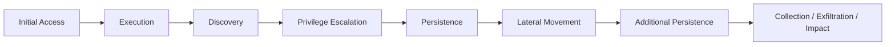
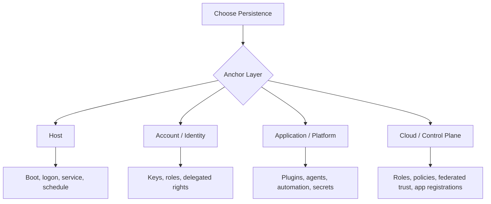
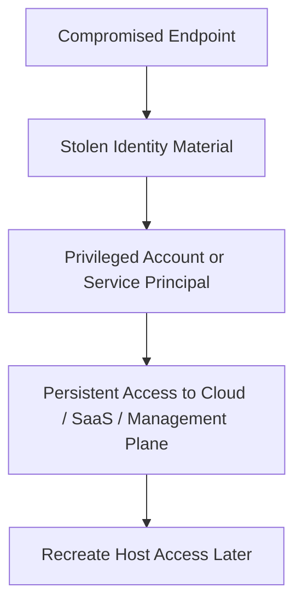
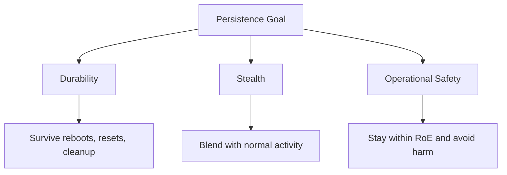
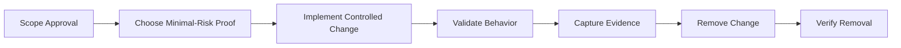
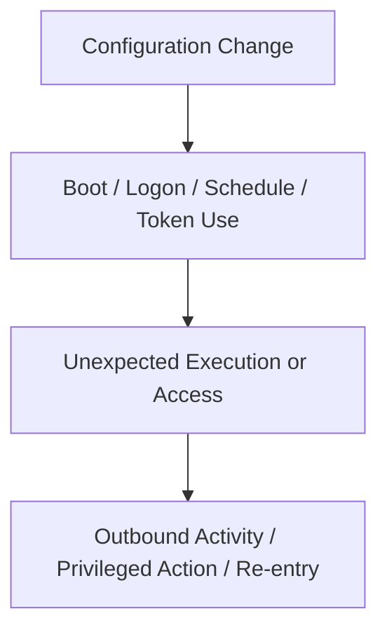
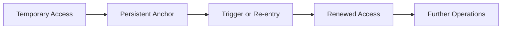

# Persistence Overview

> **Difficulty:** Beginner → Advanced | **Category:** Red Teaming | **MITRE Tactic:** [TA0003 – Persistence](https://attack.mitre.org/tactics/TA0003/)
>
> **Authorized-use note:** This note is for approved adversary emulation, security testing, and defense improvement only. It explains how persistence works, how to evaluate it safely, and how to detect or reduce it. It intentionally avoids step-by-step intrusion instructions.

---

## Table of Contents

1. [What Persistence Means](#1-what-persistence-means)
2. [Why Persistence Matters](#2-why-persistence-matters)
3. [Where It Fits in the Attack Lifecycle](#3-where-it-fits-in-the-attack-lifecycle)
4. [The Persistence Mindset](#4-the-persistence-mindset)
5. [Core Persistence Families](#5-core-persistence-families)
6. [Platform View: Windows, Linux, Cloud, and Identity](#6-platform-view-windows-linux-cloud-and-identity)
7. [Trade-Offs: Stealth vs Durability vs Risk](#7-trade-offs-stealth-vs-durability-vs-risk)
8. [Safe Red-Team Workflow](#8-safe-red-team-workflow)
9. [Detection Opportunities](#9-detection-opportunities)
10. [Defensive Controls](#10-defensive-controls)
11. [Practical Conceptual Scenarios](#11-practical-conceptual-scenarios)
12. [Common Beginner Mistakes](#12-common-beginner-mistakes)
13. [Key Takeaways](#13-key-takeaways)
14. [References](#14-references)

---

## 1. What Persistence Means

**Persistence** is the ability to keep access after the original access path becomes unreliable or disappears.

In plain language:

- initial access gets you **in**
- persistence helps you **stay in**
- privilege escalation helps you **go higher**
- lateral movement helps you **go wider**

MITRE ATT&CK defines the **Persistence** tactic as the adversary trying to **maintain their foothold**. That simple phrase is important because persistence is not only about malware surviving a reboot. It can also mean keeping access through:

- user logon and logoff cycles
- system restarts
- password changes
- software updates
- replacement of one compromised host with another trusted path
- identity or cloud changes that continue to grant access later

### Beginner view

A beginner often thinks persistence means: “make a program start again later.”

That is only one part of the picture.

A stronger mental model is:

> **Persistence = attaching access to something that is likely to happen again**

Examples of “something that happens again” include:

- a system booting
- a user logging in
- a scheduled task running
- an administrator using a trusted management tool
- a cloud role remaining assigned
- an SSH key continuing to be accepted

---

## 2. Why Persistence Matters

Persistence matters because real adversaries do not want to repeat noisy or fragile access steps if they can avoid it.

If a red team demonstrates only initial access, the client may think:

> “We patch that one bug and the problem is over.”

Persistence changes that conversation to:

> “Even after the original weakness is fixed, the attacker may still have a path back.”

### Why this phase changes risk perception

| Persistence outcome | What it proves to the client |
|---|---|
| Access survives reboot | Recovery procedures may be incomplete |
| Access survives password reset | Identity hygiene and key lifecycle are weak |
| Access returns through trusted tooling | Detection may miss activity that looks administrative |
| Access is tied to cloud or identity control plane | Business impact can outlast one host rebuild |
| A red team can prove persistence safely without full deployment | Risk is real even when the exercise stays controlled |

### The business lesson

Persistence is often where a technical issue becomes an **operational resilience** issue.

It tests whether the organization can:

- remove unauthorized changes completely
- detect hidden or recurring execution
- invalidate stolen trust material
- rebuild systems and identities with confidence

---

## 3. Where It Fits in the Attack Lifecycle

Persistence is not always a single phase that happens once. Mature operators revisit it throughout an engagement.



A realistic campaign may establish:

- **early persistence** on the first foothold so access survives interruptions
- **privileged persistence** later on a more valuable system or identity
- **strategic persistence** in identity, management, or cloud layers that outlives a single endpoint

### Key idea

The most important persistence is usually **not the first one installed**.

The most important one is the one attached to the **most trusted and hardest-to-revoke layer**.

---

## 4. The Persistence Mindset

When thinking like an experienced operator or defender, ask four questions.

### 1. What am I anchored to?

Is the access tied to:

- a host
- a user account
- a service account
- an application
- a management platform
- a cloud control plane

### 2. What event reactivates it?

What causes the access path to come back?

- boot
- logon
- timer or schedule
- admin workflow
- token refresh
- policy evaluation
- synchronization or automation

### 3. How durable is it?

Would it survive:

- reboot
- logout
- password reset
- host rebuild
- EDR reinstall
- IAM review
- tenant cleanup

### 4. What is the detection cost?

Some persistence is easy to create but obvious to defenders. Other forms are quieter because they hide inside normal operations.



This is the shift from beginner to advanced understanding:

- **Beginner:** “How do I get something to run again?”
- **Advanced:** “What trusted layer gives the longest, quietest, most realistic foothold?”

---

## 5. Core Persistence Families

Persistence techniques vary a lot, but most fall into a small number of families.

### 5.1 Boot or logon autostart persistence

This family ties execution to operating-system startup or user logon.

MITRE ATT&CK technique **T1547 – Boot or Logon Autostart Execution** describes this class as configuring system settings so a program runs automatically during boot or logon.

Common examples include:

- startup folders
- autorun registry locations
- login items
- shell or profile initialization points
- launch agents or launch daemons
- service startup behavior

### 5.2 Scheduled execution persistence

MITRE ATT&CK technique **T1053 – Scheduled Task/Job** covers recurring or trigger-based execution.

This family is powerful because it can blend into legitimate automation.

Examples include:

- scheduled tasks
- cron jobs
- timer units
- event-triggered jobs
- tasks tied to boot, logon, idle state, or system events

> Microsoft documents that Task Scheduler can run tasks when the system boots, when a user logs on, when the system is idle, or when specific events occur. That makes it useful for administrators—and attractive for adversaries.

### 5.3 Service or daemon persistence

A service or daemon is attractive because it may:

- start automatically
- run with elevated privileges
- appear normal in enterprise operations
- survive user sessions ending

This class often overlaps with privilege escalation, because modifying a privileged service can provide both **durability** and **higher execution context**.

### 5.4 Account and authentication persistence

This family attaches access to identity instead of process execution.

Examples include:

- additional SSH authorized keys
- extra cloud credentials
- delegated access
- added group memberships
- application passwords or long-lived tokens
- new trust relationships that preserve access

This category is especially important because **identity persistence often survives host cleanup**.

### 5.5 Application and platform persistence

Sometimes the foothold is attached to software the organization already trusts.

Examples include:

- web application extensions
- CI/CD secrets or runners
- API tokens
- collaboration or messaging app integrations
- endpoint management tooling
- software deployment systems

These are often more strategically valuable than a single endpoint foothold because they sit in places defenders intentionally allow.

### 5.6 Cloud and control-plane persistence

This is the advanced view.

In cloud-heavy environments, persistence may exist primarily in:

- IAM roles and policies
- service principals or app registrations
- federated trust relationships
- access keys and refreshable credentials
- automation accounts
- container or orchestration permissions

In mature environments, the “real persistence” may be in the **identity and automation plane**, not on a workstation.

### Summary table

| Persistence family | Common anchor | Typical trigger | Why it matters |
|---|---|---|---|
| Boot / logon autostart | OS startup path | Reboot or user logon | Simple and durable on endpoints |
| Scheduled execution | Scheduler or timer | Time, boot, event, idle | Blends with automation |
| Services / daemons | Background service layer | Service start or system boot | Often privileged and persistent |
| Account / identity | Keys, groups, roles, delegates | Authentication or authorization flow | Can survive host rebuilds |
| App / platform | Trusted business software | Normal workflow or app startup | High realism, often high value |
| Cloud / control plane | IAM and automation | Token use, policy evaluation, orchestration | Broad reach and high durability |

---

## 6. Platform View: Windows, Linux, Cloud, and Identity

A practical persistence note should help you recognize how the same idea appears on different platforms.

### 6.1 Windows view

Windows offers many legitimate mechanisms for recurring execution.

Two examples from Microsoft documentation are especially helpful:

- **Run / RunOnce** registry keys can launch a program at logon
- **Task Scheduler** can trigger tasks at boot, logon, idle, time, or specific events

That means defenders should think in terms of **execution surfaces**, not just “malware files.”

| Windows persistence area | Beginner explanation | Why defenders care |
|---|---|---|
| Run / RunOnce keys | Something starts when a user logs on | Registry-based changes can be easy to miss if you only watch files |
| Scheduled tasks | Something runs on a timer or trigger | Looks similar to legitimate administration |
| Services | A background component starts with Windows | Often privileged and long-lived |
| Startup folders / logon items | Programs launch with user session | Can hide in noisy user environments |
| WMI / event-based automation | Execution tied to system behavior | Harder to understand without baselines |

### 6.2 Linux view

Linux persistence often maps to the same logical categories even though the implementation differs.

The `crontab(5)` manual describes cron as a way to schedule execution of programs at specified times, and notes that each user can define their own crontab.

That matters because scheduled execution is not inherently suspicious—it is a normal system feature.

| Linux persistence area | Beginner explanation | Why defenders care |
|---|---|---|
| Cron / crontab | Commands run on a schedule | Very common in administration, so context matters |
| systemd services / timers | Background units start automatically or on timers | Common on modern Linux systems |
| Shell initialization files | Something runs when a shell starts or a user logs in | Easy to overlook in user space |
| SSH authorized keys | A key keeps working for remote login | Identity-based persistence may outlast process cleanup |
| Init or startup scripts | Services or scripts start at boot | Durable, especially on servers |

### 6.3 Cloud and SaaS view

Cloud persistence is often less visible to traditional endpoint tools.

A defender may rebuild a VM and still miss the real issue if the persistence lives in:

- IAM permissions
- application registrations
- access keys
- automation runbooks
- serverless roles
- tenant-wide delegated trust

| Cloud persistence area | What it means | Why it is high priority |
|---|---|---|
| IAM role changes | Extra permissions remain assigned | Broad access with little endpoint evidence |
| New cloud credentials | Additional keys or secrets exist | Access can survive password resets |
| App registrations / service principals | Access tied to trusted applications | Hard to notice without identity review |
| Automation accounts / pipelines | Execution occurs through approved workflows | Can blend into normal operations |

### 6.4 Identity-centric view

Identity is the advanced layer because it connects everything else.



If an attacker can keep access to **identity**, they may be able to recreate host-level persistence whenever needed.

That is why modern defenders prioritize:

- key rotation
- privileged access management
- delegated permission review
- app consent review
- short-lived credentials
- strong monitoring of admin changes

---

## 7. Trade-Offs: Stealth vs Durability vs Risk

There is no “best” persistence mechanism in all cases. There are only trade-offs.

### Practical trade-off matrix

| Question | Low-risk answer | Higher-risk answer |
|---|---|---|
| How visible is the change? | Small, explainable, well-documented proof | Broad or noisy modification |
| How durable is it? | Survives one event | Survives many cleanup actions |
| How much privilege does it need? | User-level change | System or tenant-wide change |
| How much blast radius does it create? | Single host or user | Shared infrastructure or identity plane |
| How easy is it to remove safely? | Simple rollback | Complex rollback with operational risk |

### The persistence triangle



Strong red-team work is not about maximizing one corner blindly. It is about showing risk while staying safe and professional.

### Advanced lesson

The more strategic the persistence layer becomes, the more important **cleanup, documentation, and client approval** become.

A noisy host-based proof may be easier to remove than a subtle identity or cloud change. That matters.

---

## 8. Safe Red-Team Workflow

This section is the practical heart of persistence in an authorized engagement.

### Step 1: Confirm scope and rules of engagement

Before demonstrating persistence, verify:

- persistence is explicitly allowed
- data handling rules are clear
- privileged systems are in scope
- rollback expectations are documented
- emergency contacts and deconfliction paths are known

### Step 2: Choose the lowest-risk proof that still proves the point

In many engagements, the best persistence demonstration is **minimal**.

Examples of low-risk proof models:

- screenshot or metadata proof of a writable persistence surface
- controlled one-time trigger under supervision
- short-lived authorized test object
- documented simulation rather than long-lived foothold

### Step 3: Prefer explainable, reversible changes

A professional red team prefers a proof that can be:

- described clearly in the report
- tied to a specific control weakness
- removed cleanly
- validated as removed

### Step 4: Record the full chain

Document:

- what was changed
- where it was changed
- when it was activated
- what event would trigger it
- how it was removed
- how removal was verified

### Step 5: Clean up deliberately

Persistence is not finished when it works.

Persistence work is finished when it has been:

1. demonstrated
2. reported
3. removed
4. validated as removed



### Safe operator checklist

```text
- Is this persistence mechanism explicitly allowed?
- Is there a lower-risk proof that demonstrates the same issue?
- Would this survive longer than the client expects?
- Can I remove it completely?
- Have I documented the rollback steps before I proceed?
```

---

## 9. Detection Opportunities

Defenders should treat persistence as a **change-monitoring problem** and a **behavior-correlation problem**.

### 9.1 Watch for changes to recurring execution surfaces

Examples include:

- new or modified scheduled tasks
- new services or service configuration changes
- registry autorun changes
- startup folder changes
- cron or timer modifications
- login profile changes
- new SSH keys
- IAM role or policy changes
- new app registrations, delegates, or long-lived credentials

### 9.2 Correlate the change with the trigger event

A change may look harmless until it is connected with what happens next.



This is why persistence is often missed: each individual event may appear ordinary, but the **sequence** is suspicious.

### 9.3 Hunt the story, not only the artifact

Good hunting questions include:

- What changed shortly before recurring execution began?
- Did a new task, service, key, or role appear after a compromise indicator?
- Did an identity change enable later host or cloud access?
- Does the trigger line up with business activity or stand out from it?

Microsoft Defender’s advanced hunting documentation is a useful reminder here: defenders need good query logic and event correlation, not just single alerts.

### 9.4 Think in layers

Persistence detection should cover:

- endpoint telemetry
- identity telemetry
- cloud audit logs
- administrative tooling
- change management records

If one of those layers is missing, persistence can hide in the gap.

---

## 10. Defensive Controls

| Control | Why it helps against persistence |
|---|---|
| **Configuration monitoring** | Detects changes to tasks, services, autoruns, timers, keys, and startup points |
| **Least privilege** | Reduces who can create durable changes |
| **Privileged access management** | Makes high-value identity persistence harder and more visible |
| **Application allowlisting** | Limits what can execute even if a trigger exists |
| **Credential lifecycle management** | Rotates or invalidates keys, tokens, and long-lived access |
| **Centralized logging and correlation** | Connects configuration change, trigger, and resulting activity |
| **Cloud IAM review** | Finds persistent permissions that endpoint teams may never see |
| **Recovery playbooks** | Ensures cleanup removes the foothold, not just the symptom |

### A defender maturity model

- **Basic:** watch common autoruns and scheduled tasks
- **Intermediate:** correlate persistence changes with suspicious execution
- **Advanced:** include identity, SaaS, cloud, and management-plane persistence in the same detection strategy

---

## 11. Practical Conceptual Scenarios

These examples are intentionally high-level and safe. The goal is to understand the logic, not to provide intrusion instructions.

### Scenario 1: Endpoint durability proof

A red team gains approved access to a workstation and demonstrates that a recurring execution point exists at user logon. The important lesson is not the exact mechanism. The lesson is that the organization lacks monitoring for user-session startup changes and would likely miss an attacker returning after reboot.

### Scenario 2: Identity-based persistence

A red team proves that access is tied to an authentication artifact rather than a single host. The client resets one password, but the exercise shows the attacker could still regain access through a different trust path. The lesson is that **identity cleanup** matters as much as endpoint cleanup.

### Scenario 3: Cloud control-plane persistence

The team demonstrates that a cloud permission change could outlast host rebuilding. Even if the original VM is reimaged, the trusted cloud role or application permission would still let an attacker rebuild presence later. The lesson is that incident response must include **cloud IAM review**, not just endpoint restoration.

### The common pattern



---

## 12. Common Beginner Mistakes

### Mistake 1: Thinking persistence only means malware on disk

Modern persistence may live in:

- accounts
- keys
- policies
- applications
- automation platforms
- cloud roles

### Mistake 2: Ignoring cleanup risk

A persistence proof that is hard to remove is a bad choice for a professional exercise, even if it is technically impressive.

### Mistake 3: Confusing execution with persistence

If something runs once, that is not automatically persistence. Persistence means there is a **repeatable or durable path back**.

### Mistake 4: Focusing only on endpoints

In hybrid enterprises, the most valuable foothold may be in identity or cloud control planes.

### Mistake 5: Reporting the mechanism but not the impact

A good finding explains:

- what persistence surface existed
- why it was reachable
- what business risk it created
- what cleanup and hardening should change

---

## 13. Key Takeaways

- Persistence means **maintaining access**, not merely launching a process again.
- The strongest persistence is often attached to the **most trusted layer**, such as identity, management, or cloud control plane.
- Scheduled tasks, autoruns, services, cron, and SSH keys are easy entry points for understanding the topic, but they are only part of the story.
- Mature adversary emulation focuses on **minimal-risk proof, clear documentation, and verified cleanup**.
- Mature defense focuses on **change monitoring, event correlation, identity review, and complete recovery**, not just malware removal.

---

## 14. References

- [MITRE ATT&CK – TA0003 Persistence](https://attack.mitre.org/tactics/TA0003/)
- [MITRE ATT&CK – T1053 Scheduled Task/Job](https://attack.mitre.org/techniques/T1053/)
- [MITRE ATT&CK – T1547 Boot or Logon Autostart Execution](https://attack.mitre.org/techniques/T1547/)
- [Microsoft Learn – Run and RunOnce Registry Keys](https://learn.microsoft.com/en-us/windows/win32/setupapi/run-and-runonce-registry-keys)
- [Microsoft Learn – Task Scheduler Start Page](https://learn.microsoft.com/en-us/windows/win32/taskschd/task-scheduler-start-page)
- [man7 – crontab(5)](https://man7.org/linux/man-pages/man5/crontab.5.html)
- [Microsoft Learn – Advanced Hunting Query Language](https://learn.microsoft.com/en-us/defender-xdr/advanced-hunting-query-language)
