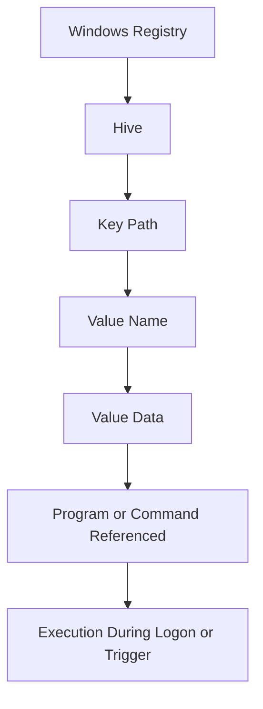
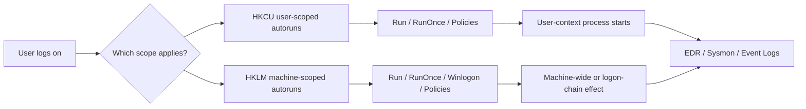
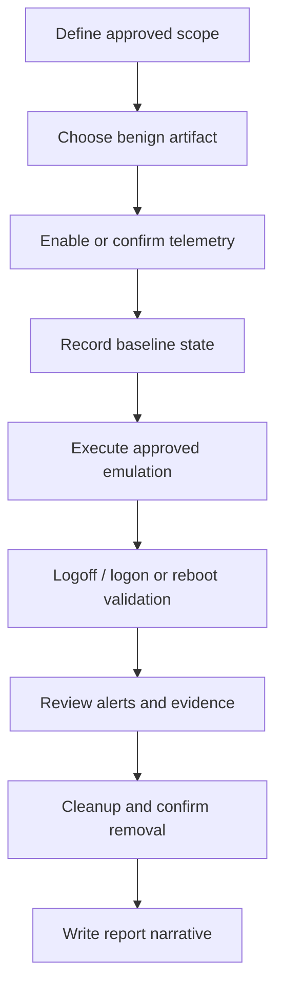
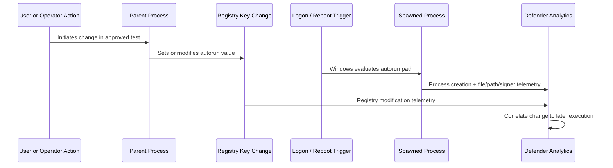
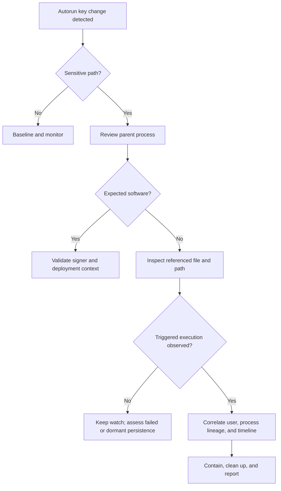

# Registry Persistence

> **Difficulty:** Beginner → Advanced | **Category:** Red Teaming — Persistence | **Scope:** Authorized adversary emulation, detection engineering, and defensive investigation on Windows

Registry-based persistence is about **making code or a program start again after logon or reboot by using Windows configuration stored in the registry**. In real engagements, this topic matters because it connects operator goals, operating system behavior, and defender telemetry.

> This note is intentionally framed for **approved lab use, purple-team exercises, and authorized adversary emulation**. It explains how the mechanism works, what defenders should monitor, and how to validate detections safely. It does **not** provide weaponized step-by-step intrusion instructions.

---

## Table of Contents

1. [What Registry Persistence Means](#1-what-registry-persistence-means)
2. [Windows Registry Mental Model](#2-windows-registry-mental-model)
3. [Common Registry Autorun Locations](#3-common-registry-autorun-locations)
4. [Why Some Keys Matter More Than Others](#4-why-some-keys-matter-more-than-others)
5. [Authorized Emulation Workflow](#5-authorized-emulation-workflow)
6. [Detection and Investigation](#6-detection-and-investigation)
7. [Practical Read-Only Inspection Examples](#7-practical-read-only-inspection-examples)
8. [Red Flags, False Positives, and Common Mistakes](#8-red-flags-false-positives-and-common-mistakes)
9. [Hardening and Prevention](#9-hardening-and-prevention)
10. [Reporting Guidance](#10-reporting-guidance)
11. [References](#11-references)

---

## 1. What Registry Persistence Means

At a beginner level, registry persistence means:

- a program or command is referenced in the Windows registry,
- Windows checks that location during boot, logon, or another trigger,
- and the referenced program starts again later without the operator manually relaunching it.

That gives an adversary or red team **continuity of access**.

### Why it matters in red teaming

Persistence is not just about “staying on the box.” It is about answering these questions:

- Can access survive a reboot or user logoff?
- Does the mechanism need **user context** or **administrator context**?
- How noisy is the change from a defender perspective?
- Can the change be explained clearly in the final report?
- Can it be removed safely during cleanup?

### Persistence is not the same as privilege escalation

A common beginner mistake is to think persistence automatically means higher privileges.

| Question | Persistence | Privilege Escalation |
|---|---|---|
| Main goal | Regain execution later | Gain more permissions |
| Typical outcome | Access survives restart/logon | Access becomes more powerful |
| Can happen as standard user? | Yes, often | Sometimes, but not by definition |
| Example idea | A user logon autorun | A service misconfiguration leading to admin |

A `HKCU` autorun may only restore **that user’s** access. It can still be important, but it is not automatically an admin-level foothold.

---

## 2. Windows Registry Mental Model

The Windows registry is a hierarchical configuration database. For persistence, you care about **which hive**, **which key path**, and **which value data** are used.

### The core hives to remember

| Hive | Meaning | Why it matters for persistence |
|---|---|---|
| `HKCU` | Current user | Good for per-user autoruns; usually does not require admin rights |
| `HKLM` | Local machine | Affects the whole machine; typically needs elevated rights |
| `HKU` | Loaded user profiles | Useful when investigating which user hive owns an entry |
| `HKCR` | Classes / associations | Less common for simple autoruns, but relevant for some execution hijacks |

### The simplest mental model



### `Run` vs `RunOnce`

Microsoft documents four classic autorun locations:

- `HKLM\Software\Microsoft\Windows\CurrentVersion\Run`
- `HKLM\Software\Microsoft\Windows\CurrentVersion\RunOnce`
- `HKCU\Software\Microsoft\Windows\CurrentVersion\Run`
- `HKCU\Software\Microsoft\Windows\CurrentVersion\RunOnce`

Important behavior differences:

| Key type | Behavior |
|---|---|
| `Run` | Launches when the relevant user logs on, again and again |
| `RunOnce` | Intended for one-time execution, then removed |
| `HKCU` scope | Applies to the current user profile |
| `HKLM` scope | Machine-wide, typically higher operational impact |

### Details defenders should know

From Microsoft’s documentation on `Run` and `RunOnce`:

- `Run` and `RunOnce` start programs at user logon.
- Multiple entries can exist under the same key.
- Execution order is **not guaranteed**.
- `RunOnce` is normally deleted before execution.
- `RunOnce` has special behavior around `!` and `*` prefixes, which matters during deeper investigation.
- Windows may delay execution for user experience reasons.

### Why that matters operationally

This means a persistence mechanism may be:

- present in the registry,
- valid on disk,
- yet behave differently than expected depending on logon timing, profile state, safe mode, and whether the entry is user- or machine-scoped.

That is why mature teams validate persistence through **controlled observation**, not assumptions.

---

## 3. Common Registry Autorun Locations

Not every registry persistence mechanism is equally important. Some are common, reliable, and easy to explain. Others are advanced, fragile, or more detectable.

### 3.1 High-value keys every analyst should know

| Location | Scope | Typical trigger | Why defenders monitor it |
|---|---|---|---|
| `HKCU\Software\Microsoft\Windows\CurrentVersion\Run` | User | User logon | Common, easy to abuse, often writable in user context |
| `HKLM\Software\Microsoft\Windows\CurrentVersion\Run` | Machine | User logon | Broad impact; often requires elevated rights |
| `HKCU\Software\Microsoft\Windows\CurrentVersion\RunOnce` | User | Next user logon | Often used for setup workflows; useful for one-time execution |
| `HKLM\Software\Microsoft\Windows\CurrentVersion\RunOnce` | Machine | Next logon | Legitimate installers use it; defenders should baseline it |
| `HKLM\Software\Microsoft\Windows NT\CurrentVersion\Winlogon` | Machine | Logon process | Critical because it influences the Windows logon chain |
| `HKCU\Software\Microsoft\Windows\CurrentVersion\Policies\Explorer\Run` | User | User logon | Less common than `Run`, so unusual values can stand out |
| `HKLM\Software\Microsoft\Windows\CurrentVersion\Policies\Explorer\Run` | Machine | User logon | Often more suspicious because it is less common in normal environments |

### 3.2 Why Winlogon is special

`Winlogon`-related values deserve extra attention because they are tied closely to the logon experience.

Common values investigators often review include:

- `Shell`
- `Userinit`

If these are changed unexpectedly, the result can be much more serious than a typical startup entry because they influence **how the user session starts**.

### 3.3 Advanced registry-assisted execution points

These are worth knowing about conceptually, especially for advanced defenders, but they are not the first places most beginners should start.

| Area | Why it matters |
|---|---|
| Image File Execution Options (IFEO) | Can redirect or interfere with expected process execution |
| AppInit-related settings | Can affect how DLLs load in certain contexts |
| Explorer / shell extension-related keys | Can create execution through normal shell behavior |
| COM-related registry references | Can support stealthier execution chains in some environments |

The lesson is not to memorize every possible key. The lesson is to recognize that the registry can be used as an **execution decision point**, not just a storage location.

### Autorun visibility diagram



---

## 4. Why Some Keys Matter More Than Others

A strong red team note should not just list keys. It should explain the **tradeoffs**.

### Operator tradeoff table

| Decision factor | `HKCU Run` | `HKLM Run` | `Winlogon`-related keys |
|---|---|---|---|
| Admin rights needed | Usually no | Usually yes | Usually yes |
| Scope | Single user | Whole machine | Can affect core logon behavior |
| Reliability | Usually high for that user | High if rights exist | Can be powerful but riskier |
| Detection risk | Moderate; often monitored | High-value change | Very high-value change |
| Cleanup complexity | Lower | Moderate | Higher |
| Reporting impact | Easy to explain | Stronger business impact | High technical severity |

### The practical lesson

In an authorized exercise, the “best” persistence mechanism is not the fanciest one. It is the one that:

- matches the scenario,
- stays within rules of engagement,
- produces useful defender telemetry,
- can be cleaned up safely,
- and supports a clear finding narrative.

### A realistic example of thinking

Suppose a red team already has access only as a normal user and the exercise goal is to validate whether endpoint monitoring notices **user-profile persistence**. In that case, a user-scoped autorun is usually the cleanest conceptual test.

If the goal is instead to assess whether defenders notice **high-risk changes to core logon behavior**, then `Winlogon`-related monitoring may be more relevant — but also more sensitive and more likely to require stricter approvals.

---

## 5. Authorized Emulation Workflow

This section focuses on **safe exercise design**, not on covert intrusion instructions.

### 5.1 Recommended workflow for an approved lab or engagement

1. **Define scope clearly**
   - Which hosts are approved?
   - Which user accounts are in scope?
   - Is reboot or logoff testing allowed?

2. **Choose a benign validation artifact**
   - Use a harmless internal executable, script, or signed test binary.
   - The artifact should produce an observable effect such as writing a log line, launching a known benign process, or generating a controlled telemetry marker.

3. **Map the test to ATT&CK and reporting goals**
   - Example concept: `T1547.001` for registry run keys / startup folder.
   - Decide whether the purpose is persistence validation, telemetry validation, or SOC analyst training.

4. **Prepare telemetry before the test**
   - Confirm EDR coverage.
   - Confirm registry auditing or Sysmon coverage.
   - Confirm process creation logging.

5. **Capture before / during / after evidence**
   - baseline state,
   - key creation or modification telemetry,
   - subsequent process execution after logon or reboot,
   - cleanup evidence.

6. **Validate safely**
   - Test only on approved systems.
   - Prefer controlled logoff/logon cycles before disruptive reboot testing.
   - Ensure rollback steps are defined before execution.

7. **Clean up and document**
   - Remove the persistence artifact.
   - Reconfirm the affected registry locations are clean.
   - Document what defenders saw and what they missed.

### 5.2 What “good emulation” looks like

A mature exercise should answer:

- Did the registry change get logged?
- Did the subsequent process start get correlated back to the registry change?
- Did the SOC understand whether the persistence was user-scoped or machine-scoped?
- Did the team distinguish between persistence and privilege escalation?

### Safe validation lifecycle



---

## 6. Detection and Investigation

This is where the topic becomes especially practical.

### 6.1 Useful telemetry sources

| Source | What it tells you |
|---|---|
| EDR registry telemetry | Who changed the key, from which process, and when |
| Sysmon Event IDs 12, 13, 14 | Registry create/delete, value set, and rename activity |
| Sysmon Event ID 1 | Process creation after logon or reboot |
| Security Event 4657 (if enabled) | Registry value modification auditing |
| Logon telemetry such as 4624 | Which account started the session that triggered execution |
| Autoruns snapshots or EDR startup inventory | What changed compared with a known-good baseline |

### 6.2 The sequence defenders want to correlate

A single registry write is often not enough to tell the full story. The stronger story is a **sequence**.



### 6.3 Investigation questions that produce better outcomes

| Question | Why it matters |
|---|---|
| Was the change under `HKCU` or `HKLM`? | Tells you scope and likely required privilege |
| What process made the registry change? | Helps distinguish installer behavior from suspicious staging |
| Is the referenced binary signed and expected? | Fast way to separate common software from anomalies |
| Does the path point to a user-writable location? | User profile directories are common risk areas |
| Did process creation occur after the expected trigger? | Confirms whether persistence actually executed |
| Is the value name masquerading as a trusted component? | Common indicator of deception |
| Did the change happen near phishing, script, or LOLBin activity? | Helpful for campaign correlation |

### 6.4 What strong detections usually look for

Strong detections are often built around combinations such as:

- a sensitive autorun key change,
- performed by an unexpected parent process,
- referencing a new executable or script in a user-writable path,
- followed by logon-triggered execution,
- with a suspicious signer state or rare filename.

That is much stronger than alerting on “any Run key change” by itself.

---

## 7. Practical Read-Only Inspection Examples

These examples are intentionally **read-only** and meant for triage, baselining, and investigation.

### 7.1 PowerShell: inspect common autorun keys

```powershell
Get-ItemProperty 'HKCU:\Software\Microsoft\Windows\CurrentVersion\Run'
Get-ItemProperty 'HKCU:\Software\Microsoft\Windows\CurrentVersion\RunOnce'
Get-ItemProperty 'HKLM:\Software\Microsoft\Windows\CurrentVersion\Run'
Get-ItemProperty 'HKLM:\Software\Microsoft\Windows\CurrentVersion\RunOnce'
Get-ItemProperty 'HKLM:\Software\Microsoft\Windows NT\CurrentVersion\Winlogon'
```

### 7.2 `reg query`: quick command-line checks

```cmd
reg query "HKCU\Software\Microsoft\Windows\CurrentVersion\Run"
reg query "HKLM\Software\Microsoft\Windows\CurrentVersion\Run"
reg query "HKLM\Software\Microsoft\Windows NT\CurrentVersion\Winlogon"
```

### 7.3 What to look for in output

| Signal | Why it can matter |
|---|---|
| Executable in `%AppData%`, `%Temp%`, or another user-writable path | Often higher risk than `Program Files` |
| Random or pseudo-Microsoft value names | Possible masquerading |
| Quoting problems in paths | Can indicate sloppy tooling or path confusion |
| Values pointing to scripts or script hosts | Often deserves closer review |
| Unsigned or unknown binaries | Strong triage lead |
| Entries that appeared very recently | Useful during incident scoping |

### 7.4 Autoruns-style triage mindset

Tools like **Autoruns** are helpful because they show more than just a single key. They help analysts answer:

- Is this item disabled, hidden, or recently added?
- Is it signed?
- Which autostart category does it belong to?
- Does it exist on disk?
- Is it common across the fleet or unique to one host?

### 7.5 Example of suspicious vs normal thinking

| Entry pattern | Likely interpretation |
|---|---|
| `OneDrive` under `Program Files` with valid signer | Often legitimate |
| `Windows Update Service` pointing to `C:\Users\<user>\AppData\Roaming\...` | More suspicious; likely needs investigation |
| `RunOnce` value created by a known installer during software deployment | Could be expected |
| `Winlogon` `Shell` value changed away from the normal explorer flow | High-priority investigation |

---

## 8. Red Flags, False Positives, and Common Mistakes

### 8.1 Common red flags

- New autorun values added outside software deployment windows
- Value names that imitate trusted vendors or Windows components
- File paths in user-profile or temporary directories
- Suspicious parent processes making the registry change
- Registry changes followed by unexpected logon-time process creation
- Entries that break normal `Winlogon` expectations

### 8.2 Common false positives

Not every startup entry is malicious. Frequent legitimate sources include:

- collaboration software,
- endpoint management agents,
- accessibility tools,
- printer or driver updaters,
- VPN clients,
- browser update components,
- enterprise software installers using `RunOnce`.

The point of investigation is not “this key exists.” The point is “**why does this entry exist here, who created it, and is it expected in this environment?**”

### 8.3 Common analyst mistakes

#### 1. Looking only at the key, not the process lineage

The parent process that wrote the key often tells the story.

#### 2. Ignoring scope

`HKCU` and `HKLM` mean very different things operationally.

#### 3. Missing 32-bit vs 64-bit context

On 64-bit Windows, registry redirection and alternate views can complicate analysis. Mature tooling usually abstracts some of this, but investigators should still be aware of it.

#### 4. Assuming the entry executed just because it exists

A persistence entry is a configuration change. You still need proof of **triggered execution**.

#### 5. Forgetting cleanup validation

In a red team exercise, removal evidence matters almost as much as execution evidence.

### 8.4 Common operator mistakes in authorized tests

- choosing a mechanism that exceeds the approved scope,
- failing to coordinate reboots or logoffs with system owners,
- not collecting baseline data first,
- testing persistence without ensuring telemetry exists,
- using a mechanism that is hard to clean up cleanly.

---

## 9. Hardening and Prevention

### Defensive priorities

| Control | Why it helps |
|---|---|
| Application control / allowlisting | Limits what can launch even if an autorun is added |
| Registry auditing on high-value keys | Improves change visibility |
| Sysmon or EDR coverage | Helps correlate registry changes and process starts |
| Least privilege | Reduces access to machine-wide autorun locations |
| Baselining common autoruns | Makes rare or new entries stand out faster |
| Monitoring user-writable startup paths | Catches common low-friction persistence behavior |
| Protecting critical `Winlogon` values | Reduces risk around core logon-chain abuse |

### Defender checklist

- [ ] Monitor `Run`, `RunOnce`, `Policies\Explorer\Run`, and `Winlogon`-related keys
- [ ] Correlate registry writes with later process creation
- [ ] Flag unsigned or rare binaries launched at logon
- [ ] Track whether referenced files live in user-writable locations
- [ ] Compare suspicious entries against fleet baseline
- [ ] Verify cleanup during purple-team or red-team exercises

### Investigation workflow



---

## 10. Reporting Guidance

A good finding should explain four things clearly:

1. **What changed** — which key or autorun location was involved.
2. **What it enabled** — user-level or machine-level re-execution.
3. **What telemetry existed** — whether defenders logged the change and the later process start.
4. **What the business implication is** — persistence across logon/reboot increases dwell time and complicates eradication.

### Example finding language

> During an authorized adversary-emulation exercise, the team validated that a Windows registry autorun location allowed benign test code to execute again after user logon. The mechanism provided persistence in user context rather than privilege escalation. Endpoint telemetry recorded the follow-on process execution, but registry modification visibility and alert correlation were incomplete, creating a gap in early detection.

### Reporting tips

- Be explicit about **scope**: user vs machine.
- Be explicit about **trigger**: logon, reboot, or shell startup.
- Be explicit about **evidence**: registry change, process start, timestamps, and cleanup.
- Separate **persistence impact** from **privilege impact**.
- Include a remediation path that defenders can actually implement.

---

## 11. References

- [MITRE ATT&CK – Boot or Logon Autostart Execution (T1547)](https://attack.mitre.org/techniques/T1547/)
- [MITRE ATT&CK – Registry Run Keys / Startup Folder (T1547.001)](https://attack.mitre.org/techniques/T1547/001/)
- [Microsoft – Run and RunOnce Registry Keys](https://learn.microsoft.com/en-us/windows/win32/setupapi/run-and-runonce-registry-keys)
- [Microsoft Sysinternals – Sysmon](https://learn.microsoft.com/en-us/sysinternals/downloads/sysmon)
- [Microsoft Sysinternals – Autoruns](https://learn.microsoft.com/en-us/sysinternals/downloads/autoruns)

---

> **Key takeaway:** Registry persistence is best understood as a combination of **Windows startup behavior, access scope, and telemetry correlation**. The most valuable lessons for defenders usually come from seeing not just the registry write, but the full chain from configuration change to later execution.
