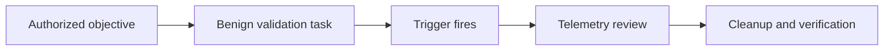
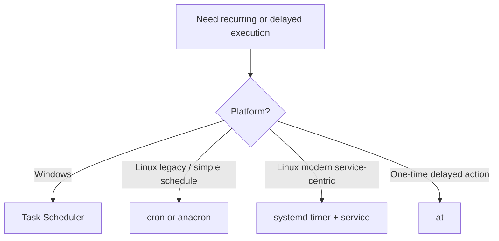
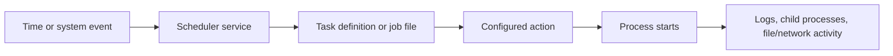
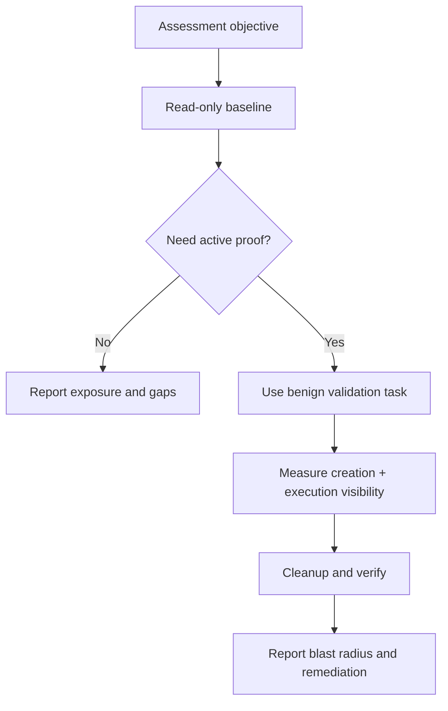
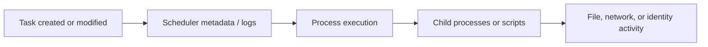

# Scheduled Tasks

> **Difficulty:** Beginner → Advanced | **Category:** Red Teaming — Persistence | **Safety:** Use this topic only for authorized adversary-emulation, lab validation, and defensive improvement. The goal is to understand and detect abuse of scheduled execution — not to provide covert intrusion instructions.

Scheduled tasks matter because they live in a trusted part of the operating system:

- the OS already knows how to run them,
- administrators rely on them every day,
- they can execute without a user clicking anything,
- and they often survive reboot, logout, and routine maintenance.

For a red team, the professional question is not:

> **How do we hide forever?**

It is:

> **Can the organization detect, investigate, and remove unauthorized scheduled execution before it becomes a durable foothold?**

---

**Relevant ATT&CK concepts:** TA0003 Persistence | T1053 Scheduled Task/Job | T1053.002 At | T1053.003 Cron | T1053.005 Scheduled Task | T1053.006 Systemd Timers

---

## Table of Contents

1. [What Scheduled Tasks Actually Are](#1-what-scheduled-tasks-actually-are)
2. [Why This Matters in Adversary Emulation](#2-why-this-matters-in-adversary-emulation)
3. [Platform Map and ATT&CK Framing](#3-platform-map-and-attck-framing)
4. [How Scheduled Execution Trust Works](#4-how-scheduled-execution-trust-works)
5. [Anatomy of a Scheduled Task or Job](#5-anatomy-of-a-scheduled-task-or-job)
6. [A Safe Assessment Workflow](#6-a-safe-assessment-workflow)
7. [Practical Read-Only Inspection Commands](#7-practical-read-only-inspection-commands)
8. [Detection and Hunting Ideas](#8-detection-and-hunting-ideas)
9. [Defensive Hardening Priorities](#9-defensive-hardening-priorities)
10. [Beginner → Advanced Learning Path](#10-beginner--advanced-learning-path)
11. [Common Mistakes](#11-common-mistakes)
12. [Quick Review Checklist](#12-quick-review-checklist)
13. [References](#13-references)

---

## 1. What Scheduled Tasks Actually Are

A **scheduled task** is any operating-system-managed job that runs because a defined trigger fires.

That trigger might be:

- a specific time,
- a recurring interval,
- system startup,
- user logon,
- system idle state,
- or another operating-system event.

This makes scheduled tasks different from ordinary one-time process execution.

A normal process runs because a user or program starts it **right now**.
A scheduled task runs because the system says:

```text
"When this condition happens later, run this action automatically."
```

### The key idea

Persistence through scheduled tasks is not just about a file on disk.
It is about controlling a **trusted scheduling relationship**:

```text
Trigger → scheduler service → task definition → action → recurring execution
```

### Why attackers and defenders both care

| Perspective | Why scheduled tasks matter |
|---|---|
| Operator | They provide repeatable execution using built-in OS features. |
| Defender | They leave artifacts, trigger metadata, logs, and process lineage that can be monitored. |
| Incident responder | They often explain why suspicious activity keeps returning after reboot or cleanup. |
| System administrator | They are common enough that malicious entries can blend into normal operational noise. |

### Scheduled task vs service vs startup item

These mechanisms are related, but not identical.

| Mechanism | Typical trigger | Common use case | Main difference |
|---|---|---|---|
| Scheduled task / job | Time, boot, logon, event, interval | Recurring or conditional execution | Runs when a defined trigger fires |
| Startup service | Boot or service start dependency | Long-running background capability | Usually designed to stay running |
| User autostart item | User login or desktop session start | Per-user helpers | Usually tied to a specific user session |

---

## 2. Why This Matters in Adversary Emulation

A mature assessment uses scheduled tasks to answer **defensive questions**.

### What a good exercise is validating

| Question | Why it matters |
|---|---|
| Can defenders spot creation or modification of scheduled jobs? | The persistence attempt is often visible before the payload matters. |
| Can they tell normal IT automation from unauthorized changes? | Real environments are full of legitimate schedulers. |
| Can they trace which account created or updated the task? | Identity context is often more important than the task name. |
| Can they correlate the task definition with later process execution? | A task artifact alone is weaker evidence than a task-to-process chain. |
| Can they remove the task and verify it no longer runs? | Durable footholds require durable cleanup validation. |

### What safe emulation looks like

In an authorized exercise, teams should prefer a **harmless proof action**, such as:

- writing a distinctive log entry,
- creating a benign marker file,
- starting an internal health-check script,
- or emitting a known event that defenders can hunt for.

That proves the persistence path **without becoming the problem**.



### Why scheduled tasks are attractive to adversaries

| Advantage | Why it matters operationally | Defensive signal |
|---|---|---|
| Built-in OS feature | Blends with admin automation | Creation/modification logs and task metadata |
| Repeatable execution | Lets an action return after reboot, logon, or delay | Recurring process lineage |
| Flexible triggers | Can align with user activity or maintenance windows | Unusual trigger choice or frequency |
| Multiple privilege contexts | May run as user, service account, admin, or SYSTEM/root | Run-as account drift |
| Common enterprise usage | Noise can hide suspicious entries | Baselining becomes essential |

### The professional mindset

The goal is not to show that a task *can* exist.

The goal is to show whether the organization can answer:

```text
Who created it?
What does it run?
When does it fire?
Under which account?
Did we detect and contain it fast enough?
```

---

## 3. Platform Map and ATT&CK Framing

Different platforms implement scheduling differently, but the trust model is similar.

### Cross-platform comparison

| Platform | Primary mechanism | Common trigger types | Typical artifact locations / objects | Why defenders care |
|---|---|---|---|---|
| Windows | Task Scheduler | Boot, logon, time, event, idle | Task Scheduler library, XML-backed task definitions, Task Scheduler logs | Deep enterprise usage, rich trigger options, often privileged |
| Linux / Unix | `cron` / `crontab` | Time-based, `@reboot` | User crontabs, `/etc/crontab`, `/etc/cron.d/`, periodic cron directories | Very common, especially on servers |
| Linux | `systemd` timers | Calendar-based, boot-relative, service-relative | `.timer` and matching `.service` units | Modern replacement for many cron workflows |
| Linux | `at` | One-time deferred execution | Queue-managed job files | Useful for delayed execution, often forgotten in reviews |
| macOS | `launchd` with calendar or interval settings | Logon, load, interval, calendar | LaunchAgents / LaunchDaemons plists | Adjacent scheduling surface, especially in user contexts |

### ATT&CK mapping

| ATT&CK item | What it covers |
|---|---|
| **T1053 — Scheduled Task/Job** | The broad persistence/execution family |
| **T1053.005 — Scheduled Task** | Windows Task Scheduler abuse |
| **T1053.003 — Cron** | Unix-like recurring task scheduling |
| **T1053.006 — Systemd Timers** | Timer-based activation in `systemd` environments |
| **T1053.002 — At** | One-time delayed job execution |

> **Scope note:** This note focuses mainly on Windows Task Scheduler, Linux `cron`, and Linux `systemd` timers because those are the most common host-based surfaces defenders encounter.

### A simple selection model



---

## 4. How Scheduled Execution Trust Works

If you remember one diagram from this note, make it this one.



### Why this matters

Each stage gives defenders a different place to look.

| Layer | Example defender questions |
|---|---|
| Trigger | Why does this task run at this time or event? |
| Scheduler service | Which subsystem handled it: Task Scheduler, cron, systemd, launchd? |
| Definition | Was the task newly created, modified, hidden, or renamed? |
| Action | Does the command point to a trusted and business-owned location? |
| Runtime behavior | Did the resulting process spawn scripts, interpreters, archives, or network connections? |

### The main defensive lesson

Many teams look only at the final process.
That is not enough.

A strong investigation correlates:

```text
artifact change + trigger + run-as context + resulting process + follow-on behavior
```

That correlation is what turns “a weird executable” into a defensible scheduled-task finding.

---

## 5. Anatomy of a Scheduled Task or Job

Attackers and defenders care about many of the same fields.
The difference is **why** they care.

### 5.1 Windows Task Scheduler anatomy

A Windows scheduled task usually has these important elements:

| Element | What it tells you | Why it matters |
|---|---|---|
| Task name and path | How it is labeled and organized | Masquerading often starts here |
| Trigger | When it fires | Boot, logon, idle, time, or event-driven execution all create different risk patterns |
| Action | What actually runs | Often the most important field in the whole task |
| Principal / Run As | Which account executes it | Determines privilege and blast radius |
| Settings | Retry, hidden state, power conditions, idle behavior | Can make a task more durable or less obvious |
| Last run time / last result | Whether it has executed and how it behaved | Helps validate both attacker success and defender timelines |

### Windows mental model

```text
Task name
  ├─ Trigger: when to run
  ├─ Action: what to run
  ├─ Principal: who runs it
  └─ Settings: how aggressively and under what conditions it runs
```

### What reviewers should inspect first

- Does the task name match the vendor, function, and path?
- Does the action launch from a trusted directory?
- Is it using an unexpected interpreter such as PowerShell, script host, or `cmd.exe` for something that claims to be an updater?
- Is the run-as identity unusually privileged for the claimed purpose?
- Was it recently created or modified near other suspicious activity?

### 5.2 Cron anatomy

A cron entry is simple, which is exactly why it is powerful.

```text
minute hour day-of-month month day-of-week command
```

### Cron time-field refresher

| Field | Allowed values | Beginner meaning |
|---|---|---|
| Minute | `0-59` | Which minute |
| Hour | `0-23` | Which hour |
| Day of month | `1-31` | Which day number |
| Month | `1-12` or names | Which month |
| Day of week | `0-7` or names | Which weekday |

A safe, harmless example of a validation line is:

```text
15 3 * * 1-5 /usr/bin/logger red-team-scheduled-task-validation
```

That example is useful because it demonstrates the structure **without performing a harmful action**.

### Where cron jobs commonly live

| Location | Typical scope | Why it matters |
|---|---|---|
| User crontab | Per-user | Good for understanding user-context persistence |
| `/etc/crontab` | System-wide | Often higher impact because it can run as specified users |
| `/etc/cron.d/` | Drop-in jobs | Common place for operational automation and drift |
| `/etc/cron.hourly/`, `.daily/`, `.weekly/`, `.monthly/` | Periodic jobs | Useful for persistence that blends into maintenance activity |

### Important cron nuances

Official `crontab(5)` documentation highlights several things defenders often miss:

- jobs run as the owning user,
- environment variables such as `SHELL`, `HOME`, and `MAILTO` matter,
- timing edge cases happen during daylight saving changes,
- and syntax mistakes can stop a job from running or make it noisier than expected.

### 5.3 `systemd` timer anatomy

Modern Linux systems increasingly use **timers plus services** instead of traditional cron.

The relationship is usually:

```text
example.timer  →  triggers  →  example.service
```

Key timer concepts from official `systemd.timer` documentation:

| Field / concept | What it means | Why defenders care |
|---|---|---|
| `OnCalendar=` | Wall-clock schedule | Similar to recurring time-based jobs |
| `OnBootSec=` / `OnStartupSec=` | Relative to boot or service-manager startup | Useful for delayed boot execution |
| `OnUnitActiveSec=` | Relative to the last activation | Creates repeat intervals |
| `Persistent=` | Catches up missed runs after downtime | Important for laptops and irregularly powered hosts |
| `AccuracySec=` | Scheduling precision window | Can affect exact execution timing |

Safe conceptual example:

```ini
# validation-marker.timer
[Timer]
OnCalendar=Mon..Fri 03:15
Persistent=true

# validation-marker.service
[Service]
Type=oneshot
ExecStart=/usr/bin/logger red-team-scheduled-task-validation
```

Why this example is safe:

- it demonstrates the timer/service relationship,
- it uses a benign action,
- and it gives defenders a deterministic string to search for.

### 5.4 Choosing between cron and `systemd` timers

| If you care most about... | Usually look first at... |
|---|---|
| Simple recurring schedules | `cron` |
| Tight integration with modern Linux services | `systemd` timers |
| Catching missed runs after downtime | `anacron` or `Persistent=true` timers |
| Service-like ownership and unit dependencies | `systemd` timers |

---

## 6. A Safe Assessment Workflow

The best scheduled-task assessments are deliberate and measurable.

### Step 1: Define the security question

Examples:

- Can we detect a new privileged task definition?
- Can we correlate task creation with later process execution?
- Can we see the difference between user-context and SYSTEM/root-context scheduled activity?
- Can responders remove the job and prove it no longer fires?

### Step 2: Choose the least invasive proof

Good proof actions include:

- writing a known event or log message,
- creating a harmless marker file in a scoped location,
- running an internal validation script that reports success,
- or touching a non-sensitive file under change control.

Avoid turning a validation task into a noisy pseudo-incident.

### Step 3: Baseline first

Before changing anything, review:

- what tasks already exist,
- which ones run frequently,
- which service accounts normally own scheduled jobs,
- and what telemetry the environment already captures.

### Step 4: Track the full change lifecycle

Document exactly:

- artifact name,
- trigger type,
- run-as identity,
- action path,
- expected execution time,
- and cleanup steps.

### Step 5: Validate both creation and execution detection

Many teams detect one but not the other.
A strong exercise checks whether defenders can observe:

- the task being created or modified,
- the scheduler reading the definition,
- the resulting process execution,
- and the cleanup afterward.

### Step 6: Stop once the claim is proven

If a harmless marker proves the organization cannot detect unauthorized scheduled execution, that is usually enough.
There is rarely value in escalating to more disruptive behavior.



### When scheduled tasks are the right test

| Good fit | Poor fit |
|---|---|
| Validating recurring or boot/logon-triggered persistence detection | Demonstrating impact that could be shown with safer evidence |
| Testing task-definition monitoring | High-frequency noisy execution that floods logs |
| Comparing user vs privileged execution visibility | Internet callbacks or external payload delivery |
| Measuring cleanup and re-verification maturity | Long-running intrusive tasks that complicate containment |

---

## 7. Practical Read-Only Inspection Commands

These commands are for **inspection and auditing**, not for creating persistence.

### Windows

| Goal | Read-only command |
|---|---|
| List tasks with details | `schtasks /query /fo LIST /v` |
| Review task objects in PowerShell | `Get-ScheduledTask` |
| Check execution metadata | `Get-ScheduledTaskInfo -TaskName <name>` |
| Review Task Scheduler operational logs | Event Viewer → **Applications and Services Logs / Microsoft / Windows / TaskScheduler / Operational** |

### Linux / Unix (`cron`)

| Goal | Read-only command |
|---|---|
| View current user's crontab | `crontab -l` |
| Review system crontab | `cat /etc/crontab` |
| Inspect cron drop-ins | `ls -la /etc/cron.d /etc/cron.hourly /etc/cron.daily /etc/cron.weekly /etc/cron.monthly` |
| Review cron logs | `journalctl -u cron -u crond` |

### Linux (`systemd` timers)

| Goal | Read-only command |
|---|---|
| List timers | `systemctl list-timers --all` |
| Inspect a timer definition | `systemctl cat <name>.timer` |
| Inspect the linked service | `systemctl cat <name>.service` |
| Review timer/service logs | `journalctl -u <name>.timer -u <name>.service` |

### What to look for during review

- task names that imitate normal software but point to odd paths,
- jobs that run from user-writable directories,
- interpreters launching scripts where signed binaries would be expected,
- unusual boot/logon triggers on endpoints that do not normally need them,
- and high-frequency schedules that do not match a business process.

---

## 8. Detection and Hunting Ideas

Scheduled-task abuse is a **behavior chain**, not just an artifact.

### High-value detection questions

| Question | Why it matters |
|---|---|
| Was a new or modified scheduled artifact introduced? | Earliest point to catch the activity |
| Which account created or changed it? | Helps distinguish admin work from suspicious identity use |
| What command or script path does it launch? | The action often reveals intent faster than the name |
| Did it execute from a trusted location? | Task names can lie; paths and signatures tell the story |
| What happened after the task fired? | Child processes, file changes, and network activity complete the picture |

### Common suspicious patterns

| Pattern | Why it stands out | Analyst follow-up |
|---|---|---|
| Task name resembles a vendor updater, but path is user-writable | Masquerading attempt | Who created it, and is the path trusted? |
| Every-minute or very frequent execution | Often unnecessary and noisy | What business function truly needs this frequency? |
| Boot/logon task running under a highly privileged account | High blast radius | Is the privilege justified for the claimed purpose? |
| Hidden or rarely documented task in a noisy enterprise OU or server role | Blending strategy | Was it part of the approved baseline? |
| Timer or cron job calling script interpreters from temp/home directories | Weak trust path | What other artifacts were dropped nearby? |

### Correlation diagram



### Good hunting data sources

- task-definition changes,
- file integrity monitoring on cron and timer locations,
- process creation telemetry,
- command-line or script-block visibility where appropriate,
- task scheduler and system journal logs,
- and identity telemetry showing which account performed the change.

### Important nuance

Not every scheduled task is suspicious.
Mature environments are full of:

- backup jobs,
- monitoring agents,
- patching workflows,
- software updaters,
- certificate renewal tasks,
- and housekeeping automation.

That is why **baselines and ownership data** matter so much.

---

## 9. Defensive Hardening Priorities

The strongest defenses reduce both **opportunity** and **ambiguity**.

| Control | Why it helps |
|---|---|
| Restrict who can create or modify privileged tasks | Shrinks the attack surface |
| Baseline scheduled jobs by host role | Makes drift visible |
| Monitor trusted scheduler locations for changes | Catches the artifact before or near first execution |
| Prefer trusted paths and signed binaries | Makes weird task actions stand out faster |
| Separate privileged admin activity from user workstations | Reduces high-value run-as exposure |
| Alert on unusual trigger patterns and unexpected frequencies | Surfaces abuse hidden inside routine automation |
| Review stale and orphaned tasks regularly | Old tasks are easy places to hide |
| Correlate task creation with process and network telemetry | Prevents artifact-only blind spots |
| Verify cleanup after incident response | Removes false confidence after containment |

### Defender mindset

Do not ask only:

```text
Can we list scheduled tasks?
```

Also ask:

```text
Do we know which ones are normal?
Who owns them?
What changed recently?
Would we notice a malicious one before it proves impact?
```

---

## 10. Beginner → Advanced Learning Path

### Beginner

Learn:

- what Task Scheduler, `cron`, and `systemd` timers are,
- where their artifacts live,
- the difference between system and user context,
- and why recurring execution is useful for persistence.

### Intermediate

Practice:

- reading task definitions and cron syntax,
- mapping trigger type to likely runtime behavior,
- comparing user-owned versus privileged scheduled jobs,
- and reviewing scheduler logs alongside process telemetry.

### Advanced

Focus on:

- correlating artifact change with identity and execution behavior,
- measuring whether defenders caught creation, execution, and cleanup,
- comparing task-based persistence to services and other startup mechanisms,
- and reporting blast radius based on run-as identity, host role, and timing.

### Safe practice ideas

| Level | Practice idea |
|---|---|
| Beginner | Inventory existing scheduled tasks on a lab host and classify them by trigger type |
| Intermediate | Trace one benign task from definition to process execution to log evidence |
| Advanced | Run a harmless validation exercise and measure detection, triage, and cleanup time |

---

## 11. Common Mistakes

### Confusing all automatic execution with the same mechanism

A scheduled task is not always a service, startup item, or login script.
The trigger and scheduler subsystem matter.

### Looking only at the payload

The task definition, authoring account, trigger type, and path often explain the risk faster than the final process alone.

### Ignoring context

A harmless-looking task may still be high risk if it runs as SYSTEM, root, or a powerful service account.

### Forgetting modern Linux timer models

Defenders sometimes hunt cron and miss `systemd` timers entirely.

### Using proof that is too noisy

If the exercise floods logs or creates avoidable operational impact, it stops being a clean persistence validation.

### Failing to verify cleanup

Removing a task name is not enough if the linked script, timer, or supporting artifact remains behind.

---

## 12. Quick Review Checklist

Use this when reviewing scheduled-task persistence exposure.

- [ ] Do we know which scheduling mechanisms are present on this platform?
- [ ] Do we have a baseline of normal tasks and owners for this host role?
- [ ] Can we spot new or modified scheduled artifacts quickly?
- [ ] Can we see the run-as identity and action path clearly?
- [ ] Can we correlate task creation to later execution?
- [ ] Do we monitor user-writable paths and interpreter-based actions?
- [ ] Can responders remove the artifact and prove it no longer fires?
- [ ] Are scheduled jobs included in post-incident review and hardening?

---

## 13. References

- MITRE ATT&CK — **T1053 Scheduled Task/Job**: https://attack.mitre.org/techniques/T1053/
- MITRE ATT&CK — **T1053.003 Cron**: https://attack.mitre.org/techniques/T1053/003/
- MITRE ATT&CK — **T1053.005 Scheduled Task**: https://attack.mitre.org/techniques/T1053/005/
- Microsoft Learn — **Task Scheduler start page**: https://learn.microsoft.com/en-us/windows/win32/taskschd/task-scheduler-start-page
- `crontab(5)` manual page: https://man7.org/linux/man-pages/man5/crontab.5.html
- `systemd.timer` reference: https://www.freedesktop.org/software/systemd/man/latest/systemd.timer.html
