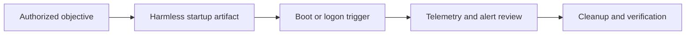
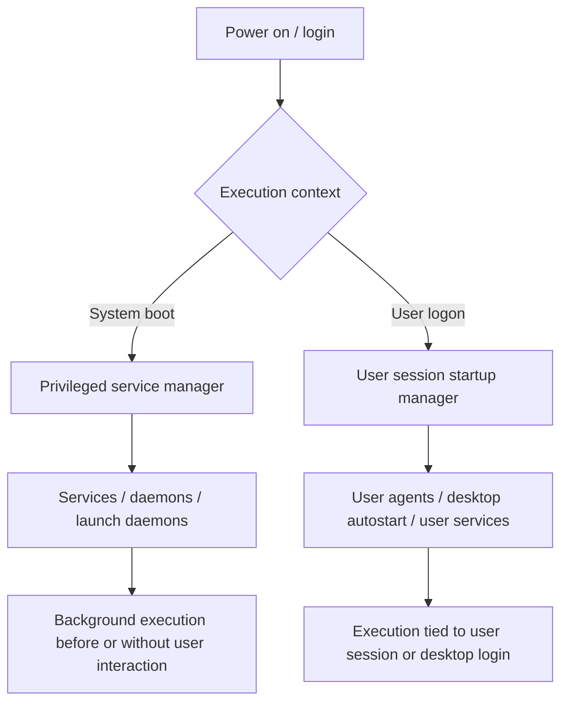
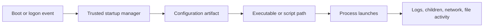
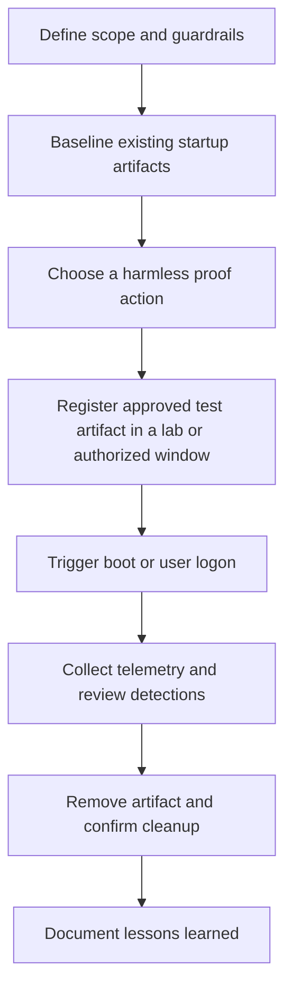
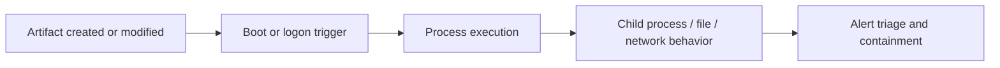

# Startup Services

> **Difficulty:** Beginner → Advanced | **Category:** Red Teaming — Persistence | **Safety:** Use this topic only for authorized adversary-emulation, lab validation, and defensive improvement. The goal is to understand and detect startup trust abuse — not to provide covert intrusion playbooks.

Startup services are one of the most important persistence surfaces because they sit inside the operating system's **trusted boot and logon path**. If an attacker can change what the OS starts automatically, they may keep access across reboots, user logouts, and routine cleanup.

For red teams, the point is not “how do I secretly backdoor a box?”

The professional question is:

> **Can the organization detect, investigate, and reverse unauthorized changes to service and startup mechanisms before those changes become durable footholds?**

---

## Table of Contents

1. [What Startup Services Actually Are](#1-what-startup-services-actually-are)
2. [Why This Matters in Adversary Emulation](#2-why-this-matters-in-adversary-emulation)
3. [Platform Map: Windows, Linux, macOS, and User Autostart](#3-platform-map-windows-linux-macos-and-user-autostart)
4. [How Startup Trust Works](#4-how-startup-trust-works)
5. [Anatomy of a Startup Service or Agent](#5-anatomy-of-a-startup-service-or-agent)
6. [A Safe Assessment Workflow](#6-a-safe-assessment-workflow)
7. [Practical Read-Only Inspection Commands](#7-practical-read-only-inspection-commands)
8. [Detection and Hunting Ideas](#8-detection-and-hunting-ideas)
9. [Defensive Hardening Priorities](#9-defensive-hardening-priorities)
10. [Beginner → Advanced Learning Path](#10-beginner--advanced-learning-path)
11. [Common Mistakes](#11-common-mistakes)
12. [Quick Review Checklist](#12-quick-review-checklist)
13. [References](#13-references)

---

## 1. What Startup Services Actually Are

A **startup service** is any OS-managed program, daemon, agent, or autostart entry that executes automatically during:

- system boot,
- user logon,
- session initialization,
- or a predefined service start condition.

These mechanisms exist for legitimate reasons:

- networking must come up,
- security tooling must start early,
- endpoint agents must survive reboot,
- background synchronization must resume,
- and user desktop helpers often need to launch automatically.

That same trust makes startup services important to attackers.

### The key idea

Persistence here is not about a single file.

It is about controlling a **trusted execution relationship**:

```text
OS boot/logon path → service manager → approved configuration → executable/script → recurring execution
```

If a red team can safely emulate abuse of that relationship with a harmless test artifact, defenders can validate whether they notice:

- a new service,
- a modified service,
- a changed execution path,
- a suspicious startup account,
- or abnormal child-process/network behavior after boot.

### ATT&CK framing

| ATT&CK technique | Why it matters here |
|---|---|
| T1543 — Create or Modify System Process | Core service/daemon/agent persistence concept |
| T1543.002 — Systemd Service | Linux service persistence via systemd units |
| T1543.003 — Windows Service | Windows Service Control Manager abuse or modification |
| T1543.001 / T1543.004 | macOS Launch Agents and Launch Daemons |
| T1037 — Boot or Logon Initialization Scripts | Adjacent startup mechanisms often confused with services |
| T1547 — Boot or Logon Autostart Execution | Broader family of autostart persistence |

> **Important boundary:** Startup services are only one part of persistence. Scheduled tasks, registry run keys, shell profiles, and login items are related but distinct mechanisms.

---

## 2. Why This Matters in Adversary Emulation

A good red-team exercise uses startup services to answer **defensive questions**, not to chase drama.

### What a mature exercise is validating

| Question | Why it matters |
|---|---|
| Can privileged changes to service configuration be detected quickly? | Service persistence usually implies admin/root-level impact |
| Can defenders distinguish normal admin work from unauthorized boot-path changes? | Real environments create lots of legitimate noise |
| Are startup artifacts baselined? | You cannot spot drift without a known-good state |
| Can responders identify what ran at boot or logon? | Timeline quality matters during incident response |
| Can the team cleanly reverse the change and verify removal? | Durable footholds require durable cleanup |

### What safe emulation looks like

In a professional engagement, the team typically uses a **benign proof action**, such as:

- writing a unique marker to a log,
- creating a harmless test file,
- launching a controlled internal health-check binary,
- or emitting a known event for detection validation.

That proves the persistence path **without becoming the incident**.



### Operator mindset vs defender mindset

| Viewpoint | Main concern |
|---|---|
| Operator | Can we validate the persistence surface safely and measurably? |
| Defender | Can we detect the creation, modification, execution, and cleanup of startup artifacts? |
| Engagement lead | Did we stay inside scope, use non-destructive proof, and preserve evidence? |

---

## 3. Platform Map: Windows, Linux, macOS, and User Autostart

Different operating systems implement startup trust differently, but the logic is always similar:

1. a trusted manager reads configuration,
2. that configuration points to code,
3. the code runs automatically.

### Cross-platform comparison

| Platform | Primary startup mechanism | Typical scope | Common artifact locations / objects | Why defenders care |
|---|---|---|---|---|
| Windows | Service Control Manager (SCM) | System-wide | Service definitions, registry-backed configuration, binary paths, start types | Often high privilege, very common in enterprise telemetry |
| Linux | `systemd` services | System-wide and per-user | `/etc/systemd/system/`, `/usr/lib/systemd/system/`, `~/.config/systemd/user/` | Easy to hide in operational noise if baseline is weak |
| Linux (legacy) | SysV/init scripts, `rc.local` | Mostly system-wide | `/etc/init.d/`, compatibility symlinks, legacy startup hooks | Older systems still carry historical startup debt |
| macOS | `launchd` LaunchDaemons / LaunchAgents | System-wide and per-user | `/Library/LaunchDaemons/`, `/Library/LaunchAgents/`, `~/Library/LaunchAgents/` | Common persistence surface with strong user/system separation |
| Desktop Linux | XDG Autostart | Per-user desktop session | `/etc/xdg/autostart/`, `~/.config/autostart/` | Useful for user-context persistence and often overlooked |

### System vs user startup



### A useful mental model

- **System startup artifacts** matter because they may run with elevated privileges.
- **User startup artifacts** matter because they often survive password resets, session restarts, and normal user behavior.
- **Both** matter because they create repeatable execution.

---

## 4. How Startup Trust Works

If you remember only one diagram from this note, make it this one.



### Why this diagram matters

Each box gives defenders a place to look:

| Layer | Examples of useful questions |
|---|---|
| Boot or logon event | Did anything unusual happen immediately after restart or sign-in? |
| Trusted startup manager | Which service manager or agent domain handled execution? |
| Configuration artifact | Was a unit file, plist, service entry, or autostart file newly created or modified? |
| Executable or script path | Does the path point to a trusted, expected, signed, and business-owned location? |
| Runtime behavior | Did the process spawn odd children, contact the network, or behave differently from its name? |

### The defensive lesson

Many teams focus only on the final process.

That is incomplete.

A strong investigation correlates:

```text
artifact change + startup trigger + resulting process + follow-on behavior
```

That correlation is what turns a suspicious file into a defensible finding.

---

## 5. Anatomy of a Startup Service or Agent

Attackers and defenders both care about the same fields, just for different reasons.

### 5.1 Linux `systemd` unit anatomy

A `systemd` service generally has three conceptual parts:

| Section | Purpose | What reviewers should inspect |
|---|---|---|
| `[Unit]` | Describes dependencies and timing | Does the timing make sense for the named service? |
| `[Service]` | Defines what actually runs | Is `ExecStart` expected? Is the `User=` appropriate? |
| `[Install]` | Controls how it becomes enabled | Why is it attached to this target? |

Safe example of a **benign validation artifact**:

```ini
[Unit]
Description=Red Team Validation Marker
After=network.target

[Service]
Type=oneshot
ExecStart=/usr/bin/logger red-team-startup-validation
User=nobody

[Install]
WantedBy=multi-user.target
```

Why this is safe:

- it only writes a log marker,
- it proves boot-path execution,
- and it gives defenders a deterministic string to hunt.

### 5.2 Windows service anatomy

Windows services are usually reviewed through fields like these:

| Field | Why it matters |
|---|---|
| Service name / display name | Masquerading often happens here |
| Binary path (`ImagePath`) | The most important review field in many cases |
| Start type | Automatic, delayed, manual, disabled, trigger-based |
| Service account | LocalSystem, LocalService, NetworkService, custom account |
| Dependencies | Can reveal why a service starts early or in a certain order |
| Recovery actions | Re-launch behavior can matter operationally |

Defenders should ask:

- Does the display name match the vendor, path, and purpose?
- Is the binary in a normal trusted directory?
- Is the service account more privileged than necessary?
- Was the path changed recently?

### 5.3 macOS `launchd` anatomy

macOS uses property list (`.plist`) files for startup jobs.

Common fields include:

| Key | Meaning | Review question |
|---|---|---|
| `Label` | Unique job identifier | Does the label look legitimate and owned? |
| `ProgramArguments` | What actually runs | Is the path expected and signed? |
| `RunAtLoad` | Run when loaded | Is automatic execution justified? |
| `KeepAlive` | Restart logic | Does it fit the software's purpose? |
| Domain | System daemon vs user agent | Should this run for all users or one user? |

Safe example of a benign launchd concept:

```xml
<key>Label</key>
<string>com.example.redteam.validation</string>
<key>ProgramArguments</key>
<array>
  <string>/usr/bin/logger</string>
  <string>red-team-startup-validation</string>
</array>
<key>RunAtLoad</key>
<true/>
```

### 5.4 XDG Autostart anatomy

Desktop Linux often uses `.desktop` files for session startup.

Important fields:

| Field | Why it matters |
|---|---|
| `Name` | Visible label in desktop tooling |
| `Exec` | Command executed at login |
| `Hidden` / `NoDisplay` | Can reduce visibility to users |
| `OnlyShowIn` / `NotShowIn` | Limits to certain desktop environments |

### What mature reviewers look for

```text
Name legitimacy
+ path legitimacy
+ privilege context
+ startup trigger
+ runtime behavior
= better judgment
```

No single field proves maliciousness. Context does.

---

## 6. A Safe Assessment Workflow

The safest way to test startup-service detection is to treat the work like a controlled experiment.



### 6.1 Scope and guardrails

Before testing anything, define:

- approved hosts,
- approved accounts,
- approved time window,
- approved proof action,
- rollback steps,
- and stop conditions.

### 6.2 Baseline first

A startup-service test is weak if the team cannot answer:

- what existed before the exercise,
- what changed during the exercise,
- and what remained afterward.

### 6.3 Use harmless proof, not risky payloads

Good proof actions include:

- a unique log marker,
- a harmless file write in a lab path,
- a message to an internal test collector,
- or a signed internal utility that performs no sensitive action.

Avoid proof that:

- downloads tooling from the internet,
- modifies customer data,
- creates covert remote access,
- or introduces uncontrolled persistence outside the engagement plan.

### 6.4 Validate cleanup

Persistence testing is incomplete until the team confirms:

- the artifact was removed,
- the startup manager no longer references it,
- no leftover symlinks, plist files, or service entries remain,
- and reboot/logon no longer triggers execution.

---

## 7. Practical Read-Only Inspection Commands

These commands are for **inventory and review**, not for implanting persistence.

### 7.1 Linux (`systemd` and related)

```bash
# List service units and whether they are enabled
systemctl list-unit-files --type=service

# Show the full definition of a specific service
systemctl cat <service-name>

# Review recent logs for a service
journalctl -u <service-name> --no-pager

# Find system-wide unit files
find /etc/systemd/system /usr/lib/systemd/system -maxdepth 2 -type f 2>/dev/null

# Find user-level unit files
find ~/.config/systemd/user -maxdepth 2 -type f 2>/dev/null
```

### 7.2 Windows services

```powershell
# Enumerate services
Get-Service | Sort-Object Status, DisplayName

# Review service configuration in detail
Get-CimInstance Win32_Service | Select-Object Name, DisplayName, StartMode, State, PathName, StartName

# Query one service directly
sc.exe qc <ServiceName>

# Review service registry area
reg query HKLM\SYSTEM\CurrentControlSet\Services
```

### 7.3 macOS `launchd`

```bash
# Print loaded system jobs
launchctl print system

# Print user jobs for the current UID
launchctl print gui/$(id -u)

# Review installed launch daemons and agents
ls /Library/LaunchDaemons /Library/LaunchAgents ~/Library/LaunchAgents 2>/dev/null

# Parse a plist safely for review
plutil -p /Library/LaunchDaemons/<job>.plist
```

### 7.4 XDG Autostart

```bash
# System-wide desktop autostart entries
ls /etc/xdg/autostart 2>/dev/null

# Per-user desktop autostart entries
ls ~/.config/autostart 2>/dev/null

# Review a desktop entry
cat ~/.config/autostart/<entry>.desktop
```

### What to capture during review

For every suspicious or newly observed artifact, collect:

- name,
- path,
- hash or signature status,
- owner,
- privilege context,
- startup mode,
- creation/modification time,
- linked process behavior,
- and a clear business owner if one exists.

---

## 8. Detection and Hunting Ideas

The most useful detections usually combine **artifact monitoring** with **runtime monitoring**.

### 8.1 High-value detection opportunities

| Signal | Why it is useful |
|---|---|
| New or modified startup artifact | Catches persistence before or at first execution |
| Change to binary path or `ExecStart`-style field | Often more important than the service name itself |
| Privilege escalation in service account choice | Can turn persistence into higher-impact access |
| Boot-time or logon-time process launch from unusual path | Excellent behavior-level clue |
| Suspicious child process or outbound network activity | Strong follow-on signal |
| Service/agent whose name imitates a trusted component | Common masquerading pattern |

### 8.2 Platform-specific telemetry ideas

| Platform | Good places to look |
|---|---|
| Windows | Service installation/change events, registry auditing, EDR process creation, signed-binary checks, service state change logs |
| Linux | File integrity monitoring on systemd paths, `auditd` watches, `journalctl`, package manager history, EDR process telemetry |
| macOS | Unified Logs, file monitoring for LaunchAgents/LaunchDaemons, process execution telemetry, code-signing review |
| Desktop Linux | File monitoring on XDG autostart paths, session-start process telemetry |

> **Note:** Specific event IDs and log sources vary by configuration, log policy, EDR product, and platform version. Build detections around behavior and artifact classes, not one telemetry source alone.

### 8.3 Practical hunting heuristics

Look for combinations like these:

- service name looks like a system component, but path points to a user-writable directory,
- `systemd` unit name looks legitimate, but `ExecStart` runs a shell, script wrapper, or temporary path,
- user-level service or launch agent shows repeated outbound network behavior with no business purpose,
- `launchd` job uses `KeepAlive`, but nobody can explain why the software must always relaunch,
- desktop autostart entry is hidden or no-display and launches something unrelated to the user's workflow,
- service path changed recently while the name stayed the same.

### 8.4 Detection chain view



Teams that only monitor **D** miss opportunities earlier at **A** and **B**.

---

## 9. Defensive Hardening Priorities

Startup-service security is mostly about reducing unnecessary trust and improving change control.

### Core hardening actions

| Priority | Why it matters |
|---|---|
| Restrict who can create or modify services and startup artifacts | Limits the number of accounts that can establish durable footholds |
| Baseline approved startup items | Necessary for drift detection |
| Use application control and code-signing checks where possible | Makes path abuse and unsigned binaries easier to catch |
| Prefer least-privilege service accounts | Reduces impact if a service is abused |
| Monitor service paths and configuration directories with FIM | Detects changes before deep analysis starts |
| Review user-level startup surfaces, not just system services | Many teams ignore the user layer entirely |
| Manage service definitions as code where possible | Makes unauthorized changes easier to detect |
| Periodically remove stale or ownerless services/agents | Old operational debris creates hiding places |

### A strong governance question

Ask this during reviews:

> **If this startup artifact changed tonight, who would know, how quickly, and from which telemetry source?**

If nobody can answer, the persistence surface is not well governed.

---

## 10. Beginner → Advanced Learning Path

| Level | What to learn |
|---|---|
| Beginner | Understand the difference between system services, user agents, and desktop autostart |
| Beginner | Learn where each platform stores startup configuration |
| Intermediate | Trace a startup artifact to the exact executable path and account context |
| Intermediate | Correlate artifact changes with boot/logon execution and process telemetry |
| Advanced | Hunt for masquerading, path abuse, unexpected dependencies, and configuration drift |
| Advanced | Design safe emulation that proves visibility without introducing harmful persistence |
| Advanced | Build detections that combine configuration, execution, and cleanup validation |

### Practical study sequence

1. Inventory startup artifacts on one Windows, one Linux, and one macOS system.
2. Identify which are system-wide and which are user-specific.
3. Pick one legitimate artifact and explain why it exists, what it launches, and how it is logged.
4. In a disposable lab, introduce a benign validation artifact that only writes a marker.
5. Measure whether your telemetry catches:
   - artifact creation,
   - startup execution,
   - and artifact removal.

That sequence builds real understanding without drifting into unsafe tradecraft.

---

## 11. Common Mistakes

### 1. Treating “new service” as the whole problem

Many real cases involve **modifying an existing trusted item**, not adding an obviously new one.

### 2. Ignoring user-level startup

Teams often monitor system services well but miss:

- user `systemd` services,
- LaunchAgents,
- and desktop autostart entries.

### 3. Looking only at names

A believable display name means very little if the path, signer, and behavior are wrong.

### 4. Testing persistence without rollback discipline

If the artifact is not removed and verified, the exercise was incomplete.

### 5. Forgetting business context

Some startup items look strange but are legitimate enterprise software. Detection quality improves when every item has an owner and a reason to exist.

---

## 12. Quick Review Checklist

Use this checklist when triaging a startup service, agent, or autostart item.

- [ ] Do we know whether this is system-wide or user-level?
- [ ] Do we know the exact executable or script path?
- [ ] Is the path trusted, expected, and appropriately protected?
- [ ] Does the name match the vendor, path, and purpose?
- [ ] Which account or privilege context does it run under?
- [ ] Was it newly created, recently modified, or long-standing?
- [ ] Do we have evidence of execution at boot or logon?
- [ ] Did it spawn suspicious children or create unexpected network traffic?
- [ ] Is there a valid business owner or change record?
- [ ] Has cleanup or rollback been confirmed if this was part of a test?

---

## 13. References

- MITRE ATT&CK — T1543: Create or Modify System Process: https://attack.mitre.org/techniques/T1543/
- MITRE ATT&CK — T1543.002: Systemd Service: https://attack.mitre.org/techniques/T1543/002/
- MITRE ATT&CK — T1543.003: Windows Service: https://attack.mitre.org/techniques/T1543/003/
- systemd service manual: https://www.freedesktop.org/software/systemd/man/systemd.service.html
- Microsoft Windows Services documentation: https://learn.microsoft.com/en-us/windows/win32/services/services
- Apple launchd job guidance: https://developer.apple.com/library/archive/documentation/MacOSX/Conceptual/BPSystemStartup/Chapters/CreatingLaunchdJobs.html
- XDG Autostart specification: https://specifications.freedesktop.org/autostart-spec/latest/

---

> **Defender mindset:** Startup-service persistence matters because it abuses operating-system trust. The strongest teams monitor both the configuration change and the resulting execution, then prove they can remove the foothold cleanly.
