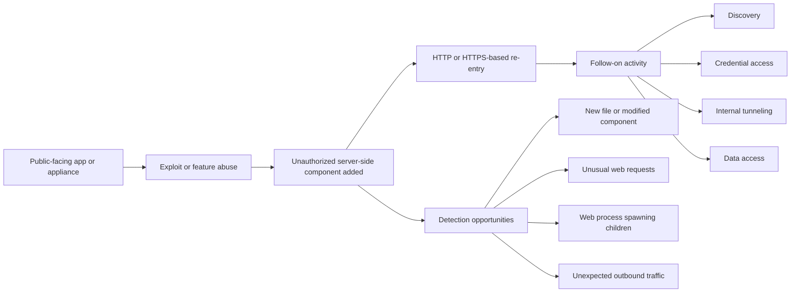
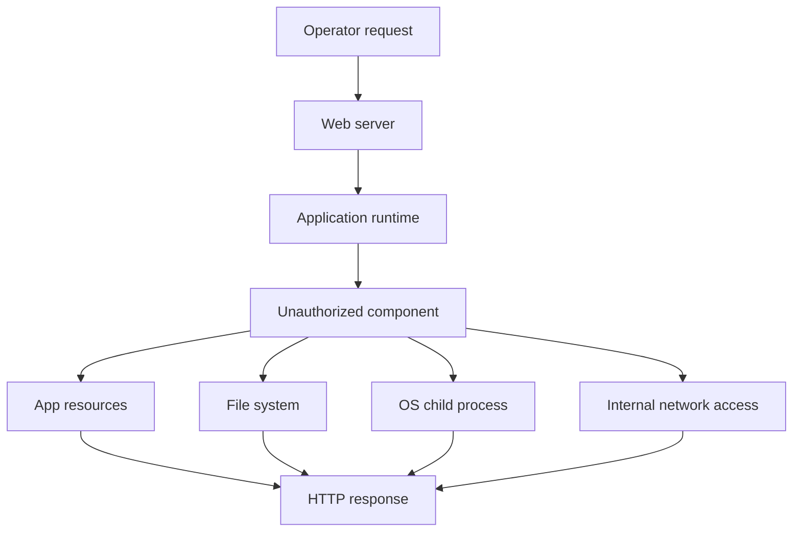
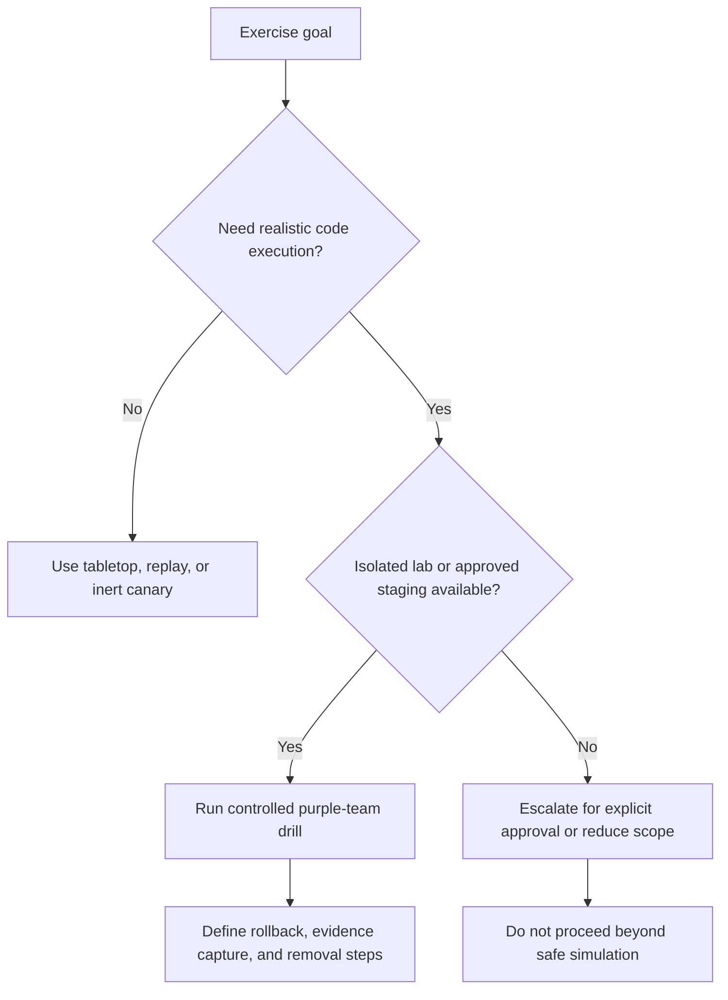
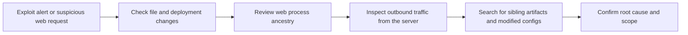

# Web Shells

> **Difficulty:** Beginner → Advanced | **Category:** Red Teaming — Persistence | **ATT&CK:** T1505.003 (Server Software Component: Web Shell)

> **Authorized-use only:** This note is for approved adversary emulation, lab validation, purple teaming, incident response, and defender education. It explains how web shells work conceptually, how teams safely emulate them, and how defenders detect and remove them. It does **not** provide unauthorized intrusion instructions.

---

## Table of Contents

1. [What a Web Shell Is](#1-what-a-web-shell-is)
2. [Why Web Shells Matter in Persistence](#2-why-web-shells-matter-in-persistence)
3. [Where Web Shells Fit in an Intrusion](#3-where-web-shells-fit-in-an-intrusion)
4. [Anatomy of a Web Shell](#4-anatomy-of-a-web-shell)
5. [Common Hosting Contexts](#5-common-hosting-contexts)
6. [Why Adversaries Use Them](#6-why-adversaries-use-them)
7. [Limitations and Failure Modes](#7-limitations-and-failure-modes)
8. [Safe Adversary-Emulation Patterns](#8-safe-adversary-emulation-patterns)
9. [Detection and Hunting](#9-detection-and-hunting)
10. [Hardening and Prevention](#10-hardening-and-prevention)
11. [Response and Cleanup](#11-response-and-cleanup)
12. [Reporting Guidance](#12-reporting-guidance)
13. [Key Takeaways](#13-key-takeaways)

---

## 1. What a Web Shell Is

A **web shell** is a malicious or unauthorized server-side script or component that lets an operator interact with a compromised web application or web-accessible service over **HTTP or HTTPS**.

At a beginner level, think of it like this:

- a normal web page receives a request and returns content;
- a web shell receives a request and performs an **operator-controlled action** instead;
- that action may be as simple as returning information or as serious as enabling file access, command execution, or HTTP-based tunneling.

The key point is that a web shell is usually **not the initial access technique itself**. It is more often a **post-compromise persistence or access-enablement mechanism** placed after exploitation, abuse of admin features, or misuse of upload/workflow functionality.

### Web Shell vs. Related Concepts

| Concept | Main idea | Typical path | Why it matters |
|---|---|---|---|
| Web shell | HTTP(S)-reachable server-side control point | Through a web server, app server, or appliance UI | Good for persistent, web-native access |
| Reverse shell | Host connects outward to operator infrastructure | Direct outbound network connection | Strong interactivity, often noisier on network |
| Backdoor account | Extra identity or credential | Authentication layer | May survive app cleanup but not IAM review |
| Implant/agent | Dedicated malware or framework payload | Host process or service | More capable, but often more detectable |
| Tunnel/proxy component | Bridges traffic through the server | Application-layer relaying | Useful for pivoting and internal reachability |

### The Defender's Mental Model

The most useful way to think about a web shell is:

> **"An unauthorized server-side capability hidden inside normal web traffic."**

That is why web shells are so important in red teaming and incident response. They sit at the intersection of:

- **application security**
- **host telemetry**
- **network monitoring**
- **identity and access control**

---

## 2. Why Web Shells Matter in Persistence

Web shells matter because public-facing applications often remain reachable even when other access paths are disrupted.

### Why they are attractive to adversaries

- They use **common web protocols** defenders must allow.
- They may remain accessible after the original vulnerability is patched.
- They can give access to a **server process that already has trusted connectivity**.
- They may let an operator blend into traffic headed to a legitimate application.
- They can act as a **redundant foothold** if a primary session or credential is lost.

### Why they matter to defenders

- They are often a sign that the intrusion moved beyond initial exploitation.
- They frequently indicate a risk of **follow-on actions**: data access, internal discovery, tunneling, or staging.
- They can survive surprisingly long when teams focus only on the original exploit.

### Persistence Does Not Mean "Permanent"

A common beginner mistake is assuming web shells always survive.

They often **do not** survive:

- immutable redeployments,
- container replacement,
- golden-image restoration,
- CMS or application file integrity checks,
- blue/green application swaps,
- or full rebuilds from clean source.

So the correct mental model is:

> A web shell is often **durable enough to matter**, but rarely **guaranteed to survive everything**.

---

## 3. Where Web Shells Fit in an Intrusion

### Typical Intrusion Role

In many real intrusions documented by ATT&CK and vendor incident reports, web shells appear after compromise of:

- email platforms,
- content management systems,
- SharePoint-like collaboration servers,
- VPN or remote access appliances,
- or custom web applications with weak file handling.

### Why This Phase Matters

Initial access answers:

> "How did the operator get in?"

Persistence via a web shell answers:

> "How did they make sure they could come back?"

That distinction is important in reporting. A client may patch the original bug and still remain exposed if the unauthorized server-side component is not found and removed.

---

## 4. Anatomy of a Web Shell

Not all web shells look alike. Some are tiny. Some are multi-feature remote administration consoles. Some are mainly **tunnels** rather than command launchers.

### Core Building Blocks

| Component | What it does | Beginner explanation |
|---|---|---|
| Trigger surface | Receives operator input through HTTP | The part that listens for requests |
| Action handler | Interprets the request and does something | The "brain" of the shell |
| Execution or access primitive | Touches files, processes, or app resources | The capability it abuses |
| Response channel | Sends data back in the HTTP response | How the operator sees results |
| Access gate | Password, secret, cookie, header, or path trick | A crude lock to keep others out |
| Masquerade layer | Name, path, or code style meant to blend in | How it hides among normal files |

### Conceptual Request Path

### What Mature Defenders Notice

A mature SOC does not only search for the file itself. It also asks:

- Did the web server process suddenly start doing something it normally never does?
- Did a new endpoint appear with no matching deployment record?
- Did the server begin making strange outbound requests after a web exploit alert?
- Did request patterns shift from human browsing to **machine-driven control traffic**?

### Web Shell Capability Levels

| Capability level | Description | Risk implication |
|---|---|---|
| Minimal | Returns basic data or executes a narrow action | Easy to hide, limited flexibility |
| Administrative | File browsing, upload, delete, database interaction | Useful for long-lived access |
| Proxy/tunnel | Relays traffic to internal systems | Enables deeper intrusion without direct VPN access |
| Multi-stage controller | Supports staging, follow-on tooling, modular tasks | Higher operational maturity |

---

## 5. Common Hosting Contexts

Web shells are best understood as a **class of server-side abuse**, not as a PHP-only problem.

### Common Environments

| Environment | Why it is exposed | Typical defender concern |
|---|---|---|
| PHP applications and CMS platforms | Large plugin ecosystem, frequent upload features | Unexpected executable content in app directories |
| ASP.NET / IIS | Rich enterprise deployments and admin surfaces | New or modified `.aspx` or config-linked components |
| Java app servers | Business apps, portals, middleware | New JSP/servlet artifacts or modified web archives |
| Appliance web interfaces | Internet-facing management portals | Vendor-specific files or templates changed post-exploit |
| Collaboration / mail platforms | Sensitive data and broad access | Unauthorized server component after zero-day exploitation |

### Questions That Matter More Than Language Choice

- Which directories are **writable** by the application?
- Which file types are **executed** by the server?
- Are upload directories **non-executable**?
- Is the application deployed from **immutable artifacts**?
- Can the web process create child processes or only serve application logic?
- Are changes to web roots and templates **baselined and monitored**?

These questions are often more important than whether the environment uses PHP, ASP.NET, or JSP.

---

## 6. Why Adversaries Use Them

MITRE ATT&CK T1505.003 documents repeated web shell use across real intrusions involving Exchange, SharePoint, internet-facing appliances, and tunneling tools such as **reGeorg** and **Neo-reGeorg**. That tells us something important:

> Web shells are not just "cheap hacker tricks." They are a durable access pattern in real operations.

### Main Benefits

| Benefit | Why it matters operationally |
|---|---|
| Re-entry over HTTPS | Uses a protocol most environments already depend on |
| Access near sensitive applications | The shell often lives where valuable data and trust already exist |
| Redundant foothold | Useful if stolen credentials are rotated or a session dies |
| Tunneling potential | Can bridge traffic to internal systems without a traditional VPN |
| Blending opportunity | Requests may resemble legitimate application traffic unless monitored well |

### Main Costs

| Cost | Why it hurts the operator |
|---|---|
| File-based artifact | There is something defenders can hunt, hash, compare, and remove |
| Web logs exist | Even encrypted transport still leaves metadata and request traces |
| App updates may break it | Redeployments and package refreshes can wipe it out |
| Process ancestry may expose it | Web processes spawning shells or utilities stands out |
| Signature overlap | Many public shells are well known to AV, WAF, YARA, and IR teams |

### Advanced Perspective

From an advanced red-team or IR viewpoint, web shells are often used for one of three goals:

1. **redundant access**
2. **operator tasking through web traffic**
3. **pivoting or tunneling into internal environments**

That third category is especially important. A web shell on a perimeter server is sometimes less about "running commands" and more about **turning a public system into a relay point**.

---

## 7. Limitations and Failure Modes

A strong note should explain not only why a technique works, but also where it fails.

### Common Failure Modes

- The application server user has **low privilege**, limiting impact.
- The upload or content path is **not executable**.
- The environment is **containerized or immutable**, so changes disappear on redeploy.
- WAF, AV, or file integrity monitoring detects the artifact quickly.
- The shell depends on a component that breaks after a patch or app update.
- The server is internet-facing, but **egress is tightly filtered**, reducing follow-on activity.

### Why Containers and Modern Deployments Matter

In older environments, dropping a file into a web-accessible path could be surprisingly durable.

In modern environments:

- stateless containers may be recreated often,
- web roots may be rebuilt from CI/CD pipelines,
- runtime file changes may trigger alerts,
- and sidecar or service mesh telemetry may expose odd behavior quickly.

So an advanced operator asks:

> "Is this environment mutable enough for a file-based persistence mechanism to matter?"

A mature defender asks:

> "Do our deployment and integrity controls naturally erase or expose this class of persistence?"

---

## 8. Safe Adversary-Emulation Patterns

This is where authorized red teaming differs from uncontrolled abuse.

The goal is usually **not** to maximize stealth or access. The goal is to safely answer questions such as:

- Can the blue team detect unauthorized server-side components?
- Can the SOC correlate web exploitation to host activity?
- Can responders identify persistence and remove it completely?
- Do patch-and-rebuild workflows actually eliminate the foothold?

### Safe Emulation Ladder

| Level | Emulation style | When to use it |
|---|---|---|
| 1 | Tabletop / log replay | When validating triage logic or alert correlation |
| 2 | Inert canary artifact | When validating file integrity or web-root monitoring |
| 3 | Benign server-side component in an isolated lab or staging environment | When validating end-to-end visibility without real command capability |
| 4 | Full authorized exercise with named approvers, rollback, and removal plan | When the client explicitly wants realism and accepts the risk |

### Preferred Starting Point

For many organizations, the best first exercise is **not** a functional shell. It is a **benign canary** that mimics the presence of an unauthorized server-side component without enabling harmful actions.

That tests whether defenders can spot:

- unexpected file creation,
- abnormal deployment drift,
- unusual requests to a nonstandard endpoint,
- and incident response workflow quality.

### Decision Model for Emulation

### Red-Team Safety Checklist

- [ ] Explicit written authorization covers server-side persistence testing
- [ ] Named system owners and defenders know the approved boundaries
- [ ] A rollback and cleanup plan exists before testing starts
- [ ] Evidence capture is enabled so defenders can learn from the event
- [ ] Success criteria are detection- and response-focused, not "got shell"
- [ ] End-of-engagement validation confirms artifact removal

---

## 9. Detection and Hunting

Defenders catch web shells by correlating **application**, **host**, and **network** signals.

### High-Value Detection Surfaces

| Telemetry source | What to look for | Why it matters |
|---|---|---|
| Web server logs | Rare endpoints, strange parameterization, repetitive small POSTs, unusual headers/cookies | Shows the operator-control channel |
| File integrity monitoring | New or modified executable server-side files | Finds the artifact itself |
| EDR / host telemetry | Web service process spawning command interpreters or admin tools | Reveals behavior beyond normal request handling |
| Process ancestry | Parent-child chains rooted in `apache`, `nginx`, `php-fpm`, `w3wp`, `tomcat`, etc. | Strong signal of server-side abuse |
| Network telemetry | New outbound connections or proxy-like relay patterns from web tier | Suggests follow-on activity or tunneling |
| Deployment logs | Drift outside approved releases | Helps distinguish legitimate change from intrusion |

### A Good Hunting Sequence

### Practical Hunting Questions

Instead of asking only "Do we have a web shell file?", ask:

- Did a public-facing web process begin spawning **shells, scripting engines, or archive tools**?
- Did the server begin accessing **internal-only systems** it normally never contacts?
- Were there file writes in web directories **outside the deployment pipeline**?
- Did request timing look like **human browsing**, or like regular operator tasking?
- Did remediation remove only the original exploit, while a secondary access mechanism remained?

### Strong Detection Ideas

#### 1. Parent-child behavior

Web servers usually serve content, call app runtimes, and interact with expected libraries. They should rarely launch:

- shell interpreters,
- system administration tools,
- compression utilities,
- or unexpected scripting hosts.

#### 2. Drift in web content

A mature defender baselines:

- template files,
- plugin or theme directories,
- server-rendered pages,
- and appliance web assets.

Unauthorized drift in these areas is often high value.

#### 3. Tunneling-like request patterns

Proxy-oriented shells may produce:

- many small requests,
- structured but opaque payload sizes,
- unusual request regularity,
- or odd server-to-internal-service patterns.

Even if the content is encrypted, the **shape** of the traffic may still stand out.

### Common Analyst Mistake

Deleting one suspicious file and closing the ticket is often not enough.

A better question is:

> "Was this the only unauthorized component, or one of several redundant access paths?"

---

## 10. Hardening and Prevention

OWASP guidance on unrestricted file upload is especially relevant here: the danger is not only the file itself, but also **where it lands, how it is interpreted, and what processing path touches it**.

### Prevention Priorities

| Layer | Strong control |
|---|---|
| Application | Strict allowlists for upload types, metadata validation, content validation, no direct execution of user-controlled uploads |
| Web server | Disable script execution in upload or content directories |
| Deployment | Immutable builds, signed artifacts, controlled release pipeline |
| Host | Least privilege for web service accounts, application allowlisting where appropriate |
| Monitoring | File integrity, web log analytics, EDR on web tier, config drift detection |
| Exposure management | Rapid patching of internet-facing apps and appliances |

### The Most Important Design Principle

> **Store untrusted uploads outside executable web roots whenever possible.**

That single design choice removes a huge amount of risk.

### Additional Hardening Questions

- Can the server interpret user-controlled files as active content?
- Can a web application write into locations the runtime also executes from?
- Are administrative upload or plugin-install paths tightly restricted?
- Are web servers prevented from launching unnecessary child processes?
- Are there clean rebuild procedures for externally exposed services?

---

## 11. Response and Cleanup

If a real web shell is suspected, response should be broader than simple file deletion.

### Recommended IR Sequence

1. **Preserve evidence first**  
   Collect volatile and persistent evidence before destroying context.

2. **Scope the intrusion**  
   Determine whether the web shell enabled additional access, tunneling, or credential theft.

3. **Identify all persistence paths**  
   Look for sibling artifacts, modified templates, changed configs, rogue scheduled tasks, or secondary backdoors.

4. **Remove the root cause**  
   Patch the exploited exposure, fix the workflow weakness, or disable the abused feature.

5. **Rebuild from known-good artifacts when possible**  
   This is often safer than trying to trust a live repaired system.

6. **Rotate secrets and review adjacent systems**  
   Assume the shell may have enabled broader access.

### Why Rebuilds Often Beat "Cleanup in Place"

If a server was externally exposed and modified, responders may never be fully certain they found every change.

That is why strong response guidance often favors:

- restore from known-good source,
- redeploy from trusted pipeline,
- rotate credentials,
- and verify detection coverage after recovery.

---

## 12. Reporting Guidance

A red-team note should help the operator explain risk clearly.

### What to Capture in a Report

| Reporting element | What to document |
|---|---|
| Access path | Which exposed service or workflow allowed unauthorized server-side placement |
| Persistence value | Why this provided durable or repeatable re-entry |
| Defensive blind spot | Which controls failed to detect file creation, execution, or abnormal traffic |
| Potential impact | What the foothold could realistically enable next |
| Cleanup recommendation | How to remove it and prevent recurrence |

### Good Reporting Language

Strong reporting avoids dramatic but vague statements like:

> "We owned the server."

Better language is:

> "Following compromise of the internet-facing application, we demonstrated that an unauthorized server-side component could be introduced and later reached over HTTPS. This provided a repeatable re-entry path from the same public service and highlighted gaps in file integrity monitoring, deployment drift detection, and web-tier process monitoring."

### Reporting the Detection Story

For mature clients, the most valuable lesson is often not that the shell existed, but:

- whether anyone saw it,
- how quickly it was triaged,
- whether responders searched for related persistence,
- and whether rebuild/eradication workflows were trustworthy.

---

## 13. Key Takeaways

- A web shell is best understood as an **unauthorized server-side control point reachable through web traffic**.
- It is usually a **post-compromise persistence mechanism**, not the initial exploit itself.
- Its power comes from sitting on systems that are **already public-facing and trusted enough to matter**.
- The biggest defender opportunities are usually **file drift, web-process behavior, request patterns, and outbound activity**.
- In authorized adversary emulation, start with the **safest possible simulation** that still answers the client's question.
- Strong remediation is usually broader than "delete one file" and often points toward **rebuild, patch, rotate, and verify**.

---

## References for Further Study

- **MITRE ATT&CK — T1505.003: Server Software Component: Web Shell**
- **OWASP — Unrestricted File Upload**

These are useful anchors for both red-team planning and defensive engineering because they frame web shells as a mix of **application design risk**, **persistence technique**, and **detection problem**.
