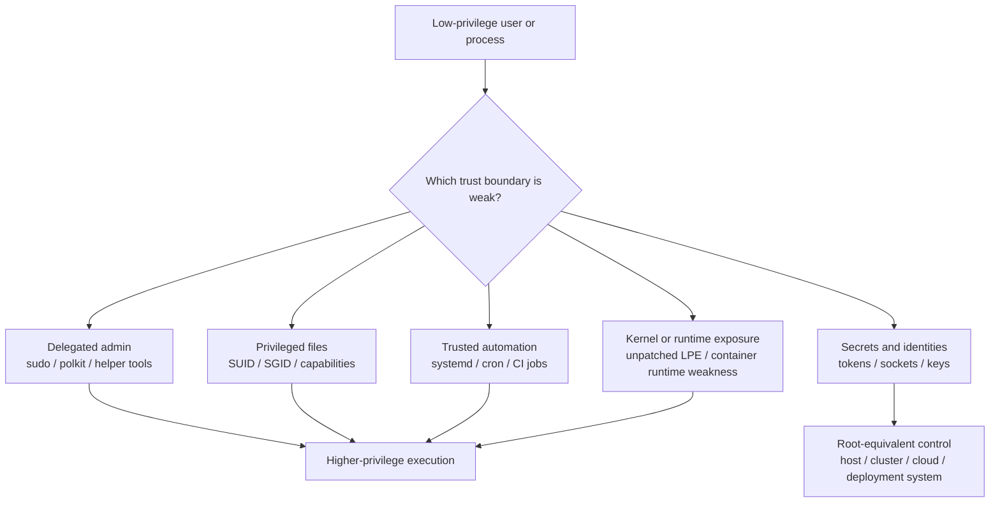
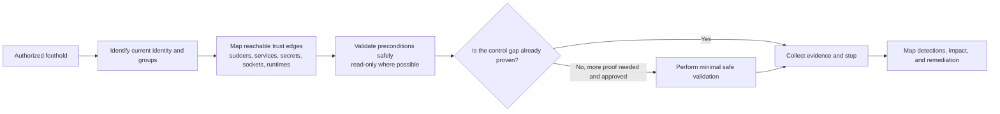
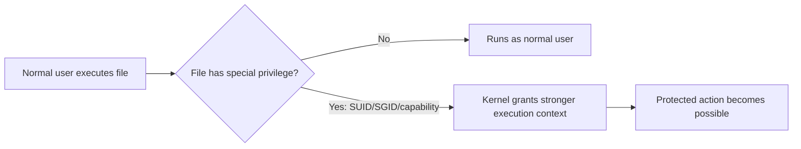
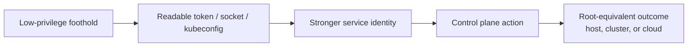
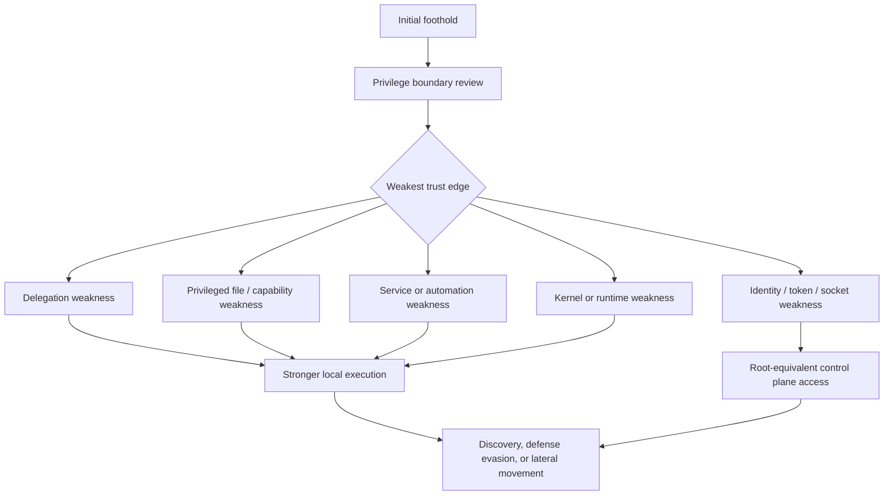

# Linux Privilege Escalation

> **Difficulty:** Beginner -> Advanced | **Category:** Red Teaming - Privilege Escalation | **Focus:** Understanding how a low-privilege Linux foothold becomes root or root-equivalent during **authorized** adversary emulation

Linux privilege escalation is the study of **trust boundaries inside a Linux environment**. In practice, it asks a simple question:

> If an attacker already has limited code execution or a normal user account, **what mistakes, weak controls, or unsafe design choices could let them reach stronger privileges?**

In a real engagement, this is never about reckless exploitation for its own sake. It is about validating whether **least privilege, service isolation, patching, and monitoring** actually hold up under realistic pressure.

A beginner-friendly analogy is this:

- **initial access** gives you a visitor badge
- **privilege escalation** tests whether that visitor can quietly obtain a master key
- **defense** is about making sure every key transition is tightly controlled, logged, and justified

This note is written for **authorized adversary emulation, defensive understanding, and secure design review**. It explains how escalation paths work, how mature teams think about them, and how defenders detect and harden them. It does **not** provide harmful step-by-step intrusion instructions.

---

## Table of Contents

1. [What Linux Privilege Escalation Really Means](#1-what-linux-privilege-escalation-really-means)
2. [Linux Privilege Model in Plain English](#2-linux-privilege-model-in-plain-english)
3. [The Main Escalation Families](#3-the-main-escalation-families)
4. [How Authorized Teams Assess Safely](#4-how-authorized-teams-assess-safely)
5. [Deep Dive by Escalation Family](#5-deep-dive-by-escalation-family)
6. [Thinking in Attack Chains, Not Isolated Tricks](#6-thinking-in-attack-chains-not-isolated-tricks)
7. [Detection and Defensive Validation](#7-detection-and-defensive-validation)
8. [Common Mistakes and Mental Models](#8-common-mistakes-and-mental-models)
9. [Practical Hardening Checklist](#9-practical-hardening-checklist)
10. [References](#10-references)

---

## 1. What Linux Privilege Escalation Really Means

> **Difficulty:** Beginner -> Advanced | **Mindset:** Trust Boundaries Over "Magic Exploits"

Many beginners imagine Linux privilege escalation as a dramatic moment where a single exploit instantly turns a normal user into `root`. That can happen, but in mature environments the reality is usually less cinematic and more architectural.

Linux privilege escalation is often the result of one of these conditions:

- **over-delegated administration** such as unsafe `sudo` rules
- **unsafe privileged binaries** such as risky SUID/SGID files or excessive file capabilities
- **weak service trust** such as root-owned services that run user-influenced files
- **exposed higher-privilege identities** such as tokens, sockets, SSH keys, or cloud credentials
- **container or control-plane trust failures** that create root-equivalent outcomes
- **unpatched kernel/runtime weaknesses** that allow local privilege elevation

### Why this matters in red teaming

Privilege escalation sits in the middle of many attack chains:

```text
Initial Access -> Limited Foothold -> Privilege Escalation -> Discovery -> Lateral Movement -> Objective
```

Without escalation, an operator may be trapped in a narrow part of the environment. With escalation, the same foothold may suddenly unlock:

- credential stores
- service configuration
- security tooling tampering opportunities
- host-level logs and secrets
- container runtime access
- cloud or cluster administration paths

### "Root" is not the only important outcome

A strong mental model is that **privilege is broader than UID 0**.

In modern Linux environments, these can be functionally **root-equivalent** for the scenario:

- membership in highly trusted groups such as `docker` or `lxd`
- control over a `systemd` unit that runs as root
- access to Kubernetes service account tokens with broad RBAC
- access to cloud instance roles or deployment credentials
- write access to scripts or config files executed by privileged automation

So the real question is not only:

> "Can I become root?"

It is also:

> "Can I reach any identity, execution context, or control plane that gives me materially more power than I have now?"

---

## 2. Linux Privilege Model in Plain English

Linux privilege escalation is easiest to understand when you see Linux as a stack of **permission boundaries**.

| Concept | Plain-English Meaning | Why It Matters |
|---|---|---|
| UID / GID | Who the process belongs to | The basic identity boundary |
| Effective UID (EUID) | The identity the kernel actually honors for access checks | Explains why SUID and `sudo` matter |
| `root` | The traditional all-powerful local admin account | Still the main host-level boundary |
| `sudo` / `polkit` / delegated admin | Controlled ways to let non-root users perform privileged actions | Useful but risky when over-broad |
| SUID / SGID | File permission bits that make programs run as the file owner/group | A common privilege transition mechanism |
| Linux capabilities | Fine-grained slices of privilege instead of full root | Powerful, but often misunderstood |
| `systemd`, cron, timers | Automation layers that frequently run as root | Trusted execution chains are common escalation surfaces |
| Namespaces / containers | Isolation boundaries for processes, filesystems, networks, and users | Important because container root is not always host root |
| Sockets, tokens, keys | Indirect access to stronger identities or control planes | Often the cleanest modern escalation path |

### A layered way to think about Linux privilege



### The key beginner insight

Linux does **not** usually grant more privilege by accident. It grants more privilege because **someone intentionally created a trusted path**:

- a command is allowed to run as root
- a binary is marked SUID
- a service runs automatically with elevated permissions
- a secret is stored where the wrong user can read it
- a container is given too much authority
- a vulnerable kernel or runtime remains unpatched

That is why escalation is best understood as **abuse of trust**, not just abuse of code.

---

## 3. The Main Escalation Families

A practical way to organize Linux escalation is by **which boundary fails**.

| Escalation Family | What Usually Goes Wrong | Typical Outcome | Defensive Theme |
|---|---|---|---|
| Delegated administration | Over-broad `sudo`, weak policy helpers, unsafe command allowlists | User can perform root actions indirectly | Tight delegation and audit |
| Privileged binaries | Unexpected SUID/SGID, dangerous capabilities, shell-escape-capable tools | Process runs with stronger permissions | Minimize privileged executables |
| Services and automation | Root-owned jobs trust user-controlled scripts, paths, or configs | User influences privileged execution | Protect service inputs |
| Identity and secrets | Tokens, SSH keys, sockets, kubeconfigs, metadata access | User acquires stronger identity | Reduce and isolate credential exposure |
| Containers and control planes | Privileged containers, host mounts, unsafe sockets, over-broad RBAC | Namespace escape or root-equivalent control | Reduce runtime authority |
| Kernel / runtime weakness | Local privilege escalation vulnerabilities remain exploitable | Host root or equivalent | Patch fast and validate exposure |

### Why this structure is useful

This model helps both operators and defenders avoid shallow thinking.

Instead of asking:

- "Which exploit should I try first?"

Ask:

- Which trust boundary exists here?
- Why was it created?
- Who is allowed to cross it?
- Can lower-privilege users influence it safely enough to prove a gap?
- Would defenders notice the transition?

That is a much more realistic adversary-emulation mindset.

---

## 4. How Authorized Teams Assess Safely

Strong red teams do **not** begin with destructive proof. They begin with **controlled validation**.

### A safe assessment workflow



### What this means in practice

1. **Understand the current context**
   - Which user is this?
   - Which groups is it in?
   - Is this a host, container, jump box, CI worker, or Kubernetes pod?

2. **Inventory trust transitions**
   - What admin delegation exists?
   - Which services run as root?
   - Which secrets or sockets point to stronger identities?
   - Is the kernel or runtime behind on patching?

3. **Prefer read-only proof first**
   - Often the presence of a misconfiguration already proves the control gap.
   - You do not always need full root to prove that root is reachable.

4. **Stop at the proof threshold**
   - If a writable root-executed script or cluster-admin service account is clearly exposed, deeper action may add risk without adding insight.

5. **Report the chain, not just the trick**
   - Show how the foothold, boundary failure, and business impact connect.

### Read-only audit examples for authorized review

These are common **enumeration and validation** checks used during authorized assessment and defensive auditing:

```bash
# authorized, read-only examples only
id
sudo -l
getent group sudo wheel adm docker lxd libvirt
find / -xdev -type f \( -perm -4000 -o -perm -2000 \) 2>/dev/null
getcap -r / 2>/dev/null
systemctl list-unit-files --state=enabled
find /etc/cron* -maxdepth 2 -ls 2>/dev/null
```

The purpose of commands like these is not reckless exploitation. It is to answer questions such as:

- what trusted paths exist?
- which privileged binaries are present?
- which services or schedulers execute automatically?
- which groups imply stronger-than-expected authority?

---

## 5. Deep Dive by Escalation Family

### 5.1 Delegated administration: `sudo`, policy helpers, and controlled elevation

Delegated administration exists because normal users occasionally need to perform admin tasks without logging in directly as root.

That is good design **when narrowly scoped**.

It becomes risky when the organization grants:

- commands that are too broad
- wildcards that allow unintended behavior
- shells, interpreters, editors, or package managers with elevated rights
- long-lived cached elevation without strong controls
- writable `sudoers` include paths or weak admin workflows

### Why this family matters so much

MITRE ATT&CK maps this area to **T1548: Abuse Elevation Control Mechanism**, including **T1548.003: Sudo and Sudo Caching**.

The core idea is simple:

- the system has a built-in way to elevate safely
- the configuration intended to reduce risk becomes the path that increases risk

### Risky vs safer delegation

```text
Risky:
  deploy ALL=(root) NOPASSWD: /usr/bin/systemctl *

Safer:
  deploy ALL=(root) /usr/bin/systemctl restart myapp.service
```

The difference is not cosmetic. The safer version narrows:

- **which binary** can run
- **which arguments** are allowed
- **which action** is expected
- **what audit trail** defenders should see

### What defenders should review

- all entries in `/etc/sudoers` and `/etc/sudoers.d/`
- use of `NOPASSWD`
- commands that launch shells, editors, or interpreters
- wildcard arguments
- who belongs to privileged groups
- whether the organization reviews delegation after role changes

### Detection ideas

- watch for unusual `sudo` usage outside the user's normal admin pattern
- correlate `sudo` with subsequent service, file, or user-management actions
- monitor for privilege transitions where **UID and effective UID differ**
- centralize `sudo` logging into `journald`, syslog, SIEM, or EDR pipelines

---

### 5.2 SUID, SGID, and Linux capabilities

This is the classic Linux local escalation area, but it is still misunderstood.

### SUID and SGID in plain English

A binary with the **SUID** bit runs with the privileges of its file owner. If the owner is root, a normal user may execute code in a root-honored context through that binary.

A binary with the **SGID** bit does the same for group context.

MITRE ATT&CK tracks this as **T1548.001: Setuid and Setgid**.

### Capabilities: privilege broken into pieces

Modern Linux also supports **capabilities**, which split root-like power into narrower buckets.

That sounds safer than full root, and often it is. But it can still be dangerous when powerful capabilities are granted carelessly.

Examples of especially sensitive capability categories include those that affect:

- discretionary access control bypass
- user and group ID changes
- filesystem mounts
- kernel administration
- raw networking or packet control

### Why this is practical, not theoretical

Organizations often inventory `sudo`, but forget to inventory:

- third-party utilities installed with SUID
- legacy admin tools left behind after migrations
- vendor binaries with elevated bits or capabilities
- unexpected drift from package baselines

### A simple execution model



### High-risk patterns defenders should notice

- SUID on tools that were never meant to be privileged
- SUID/SGID on interpreters or flexible utility programs
- capabilities such as broad admin or access-bypass powers on general-purpose binaries
- files whose ownership, mode, or capabilities drift from package defaults
- privileged binaries in writable or poorly governed paths

### Read-only validation questions

- Which SUID/SGID files exist?
- Which capabilities exist, and why?
- Are these package defaults or local drift?
- Could the binary perform actions broader than its business purpose requires?

### Defensive response

- remove unnecessary SUID/SGID bits
- prefer narrowly delegated admin over legacy privileged binaries
- inventory file capabilities regularly
- baseline privileged file metadata with package management or FIM
- review new software for unexpected privileged install behavior

---

### 5.3 Services, timers, cron, and startup trust

This family is one of the most common **real-world** escalation paths because Linux systems automate important work constantly.

Examples:

- backups
- log rotation
- deployment hooks
- maintenance scripts
- security agents
- package update jobs
- custom `systemd` services or timers

If any of those run as root while trusting a lower-privileged input, the trust boundary is weak.

### The dangerous pattern

```text
lower-privileged user controls or influences a file, path, variable, or script
                ↓
privileged automation consumes it automatically
                ↓
the user's influence executes in a stronger context
```

### Common weak points

- writable scripts called by root-owned services
- writable directories in execution paths
- unsafe `PATH` use in service wrappers
- environment files that lower-privileged users can modify
- permissive cron directories or drop-ins
- unit files or overrides with weak ownership controls
- temporary files, symlinks, or working directories that privileged jobs trust

### Safer service design

```ini
# risky pattern
ExecStart=/usr/local/bin/backup.sh
Environment="PATH=/tmp:/usr/local/bin:/usr/bin"

# stronger pattern
ExecStart=/usr/local/bin/backup.sh
Environment="PATH=/usr/bin:/usr/sbin"
NoNewPrivileges=yes
ProtectSystem=strict
PrivateTmp=yes
```

The point is not that these exact lines solve every problem. The point is that **privileged automation should trust as little as possible**.

### Why red teams care

This category often produces a strong, business-relevant finding because it shows that:

- a routine workflow can be influenced by a lower-privileged identity
- the exploit path is operationally plausible
- the root cause is governance and engineering, not just one vulnerable binary

### What defenders should inventory

- enabled `systemd` units and timers
- service drop-in directories
- ownership and permissions on called scripts
- cron jobs and the files they invoke
- environment files and helper scripts used by privileged automation

---

### 5.4 Secrets, sockets, and identity edges

In many modern Linux environments, the cleanest privilege escalation path is **identity-first**, not host-first.

In other words, the most valuable thing a low-privilege user may gain is not a root shell but **access to a stronger identity or trusted control interface**.

### Examples of high-value trust edges

- Docker or container runtime sockets
- Kubernetes service account tokens
- kubeconfig files with broad permissions
- cloud instance role access or metadata-derived credentials
- CI/CD runner tokens
- SSH private keys used for automation
- backup or orchestration credentials

### Why this matters

If one of those identities can:

- start privileged workloads
- alter deployments
- mount host paths
- assume cloud admin roles
- access secrets managers
- reconfigure security tooling

then it may be **more impactful than local root on a single host**.

### A modern escalation chain



### Container and platform example

OWASP's Kubernetes guidance warns that overly permissive RBAC, especially broad bindings such as `cluster-admin`, can dramatically increase blast radius. That means a "Linux escalation" finding may actually be a **platform trust** problem.

### Defender questions to ask

- Which sockets are mounted and who can access them?
- Are service account tokens mounted by default?
- Do workloads have more RBAC than they need?
- Can deployment credentials create or modify privileged workloads?
- Are CI runners isolated from production control paths?

### The advanced lesson

Many strong Linux escalation findings are really **identity escalation through Linux-resident material**.

The machine is only the stepping stone.

---

### 5.5 Containers, namespaces, and runtime confusion

Containers add an important nuance:

> `root` inside a container is not automatically the same as `root` on the host.

That is a critical beginner lesson.

But the equally important advanced lesson is this:

> container isolation is only as strong as the runtime, mounts, capabilities, namespaces, and control-plane policy around it.

### What changes the risk level

| Condition | Why It Raises Risk |
|---|---|
| Privileged container | Greatly expands what the workload can do |
| Host path mounts | Bridges container and host trust boundaries |
| Access to Docker / containerd socket | Can enable stronger runtime control |
| Broad Linux capabilities like `CAP_SYS_ADMIN` | Erodes namespace isolation |
| Host PID / host network / host IPC | Weakens separation between workload and node |
| Weak seccomp / AppArmor / SELinux posture | Reduces containment depth |

### A practical mental model

| Environment | What "higher privilege" really means |
|---|---|
| Bare metal or VM | Host root or stronger host identity |
| Container | Stronger namespace privileges, runtime control, or host influence |
| Kubernetes pod | More powerful service account, workload permissions, or node-level trust |
| CI runner | Access to deployment, secrets, signing, or production automation |

### How mature teams handle this safely

In authorized adversary emulation, teams often stop once they have proven that a workload can reach a stronger runtime or control-plane context. Full breakout is not always necessary to prove the security gap.

That keeps the exercise safer while still showing the real risk.

---

### 5.6 Kernel and runtime vulnerabilities

This is the escalation family most people think of first: **local privilege escalation through a kernel, driver, or runtime vulnerability**.

MITRE ATT&CK tracks this as **T1068: Exploitation for Privilege Escalation**.

### Important reality check

Kernel-based escalation is real, but it is often the **last**, not first, choice in a professional engagement because it can be:

- unstable
- version-dependent
- noisy
- risky to system availability
- unnecessary if safer proof already exists

### What makes it serious

If a target has:

- a known vulnerable kernel or driver
- local code execution already established
- no meaningful hardening layers
- slow patching and reboot discipline

then the path from low privilege to host root may be far too short.

### What mature red teams usually do

Unless explicit written approval exists, strong teams often prefer to:

- prove vulnerable version exposure
- confirm exploit preconditions in a lab or non-production setting
- show why the host is realistically exposed
- stop short of unnecessary production risk

### What defenders should do

- treat local privilege escalation vulnerabilities as serious attack-chain multipliers
- patch kernels, drivers, and runtimes quickly
- reduce reboot lag after critical fixes
- enforce AppArmor, SELinux, seccomp, and related hardening where appropriate
- monitor vulnerable driver and runtime usage, not just network exposure

---

## 6. Thinking in Attack Chains, Not Isolated Tricks

Privilege escalation is most useful when placed in a **full attack narrative**.

That matches the project goal of documenting **attack chains** and **real-world operational methodology**.

### Example chain thinking

| Initial Position | Weak Boundary | Higher Privilege Reached | Why the Finding Matters |
|---|---|---|---|
| App service account on a Linux VM | Over-broad delegated admin | Root-controlled service action | A single web foothold can turn into persistent host control |
| Low-privilege user on a build runner | Readable deployment credentials | Production deployment authority | Software supply chain risk, not just local host risk |
| Container foothold | Mounted runtime socket | Node or cluster-equivalent power | Workload compromise can become platform compromise |
| User account on a laptop/server | Unpatched local kernel bug | Host root | Endpoint foothold can bypass local admin boundaries |

### Why attack-chain thinking is better

A good report should not read like this:

> "Found risky SUID binary. Found weak sudo rule. Found readable token."

It should read more like this:

> "A realistic adversary with a low-privilege foothold could reach root-equivalent control because delegated admin, privileged automation, and workload identity design created multiple reinforcing trust failures."

That is the kind of statement leaders and defenders can act on.

### A simple attack-chain diagram



---

## 7. Detection and Defensive Validation

A mature defense does not just block escalation. It also makes escalation **visible**.

### High-value detection areas

| Area | What to Watch | Why It Matters |
|---|---|---|
| `sudo` and delegated admin | unusual command patterns, odd timing, new admin paths, UID-to-EUID changes | Shows privileged execution transitions |
| SUID/SGID and capabilities | file mode drift, ownership changes, unexpected `setcap`, package baseline mismatches | Catches dangerous privileged-file changes |
| `systemd` and cron | new units, modified drop-ins, restarts, changed timers, writable helper scripts | Exposes tampering with privileged automation |
| Tokens, sockets, kubeconfigs, metadata paths | unexpected access from unusual users or workloads | Detects identity-based escalation |
| Kernel and runtime exposure | vulnerable versions, failed or suspicious privilege-transition activity, runtime policy changes | Helps catch high-impact local escalation conditions |

### Useful telemetry sources

- `journald`
- auth logs such as `/var/log/auth.log` or distro equivalent
- `sudo` logs
- `auditd` or eBPF-based audit tooling
- EDR process lineage and privilege-transition telemetry
- file integrity monitoring
- Kubernetes audit logs and cloud control-plane logs

### Practical defensive controls

| Weakness Area | Stronger Defensive Pattern |
|---|---|
| Over-broad `sudo` | Exact command allowlists, reduced `NOPASSWD`, short-lived admin workflows |
| Legacy SUID / SGID | Remove what is not required, baseline what remains |
| Excessive capabilities | Grant only required capability sets, review third-party packages |
| Weak privileged automation | Lock file ownership, use immutable paths, constrain service environments |
| Token and socket exposure | Limit mounts, isolate runners, avoid broad default service account access |
| Container over-privilege | Drop capabilities, avoid privileged mode, restrict host mounts |
| Local kernel exposure | Fast patching, hardening, and disciplined reboot/update practice |

### A strong defensive metric

One of the best measurements is not just "was escalation possible?" but:

> **How early would we know that a low-privilege identity is attempting to cross into a stronger trust zone?**

That is the heart of good detection engineering.

---

## 8. Common Mistakes and Mental Models

### Mistake 1: Thinking privilege escalation always means a kernel exploit

Most real environments fail first at **configuration and trust design**, not at exotic exploitation.

### Mistake 2: Thinking only `root` matters

In modern infrastructure, a service account with deployment authority or container runtime control may be as dangerous as host root.

### Mistake 3: Treating containers as a security guarantee by themselves

Containers provide isolation, but poor runtime design can erase that benefit quickly.

### Mistake 4: Assuming a narrow `sudo` rule is automatically safe

If the allowed command can indirectly reach broader behavior, the rule may still be too permissive.

### Mistake 5: Proving too much in production

A professional engagement stops when the control failure is proven. Going further can increase risk without improving the finding.

### The best mental model

Think of Linux privilege escalation as a graph of **trusted relationships**:

- who can execute what
- which files influence privileged processes
- which identities are stored or reachable locally
- which runtimes can create stronger contexts
- which controls should detect the transition

That model scales from a beginner workstation to a complex containerized platform.

---

## 9. Practical Hardening Checklist

### For defenders and platform engineers

- review all `sudoers` entries and remove broad or wildcard-based delegation
- require the narrowest possible admin workflows
- inventory SUID/SGID files and unexpected file capabilities
- verify package baselines and alert on drift
- audit all root-owned services, timers, cron jobs, and helper scripts
- ensure privileged automation does not trust writable paths, permissive environment files, or weak temporary-file patterns
- reduce exposure of tokens, kubeconfigs, SSH keys, and runtime sockets
- avoid privileged containers and unnecessary host mounts
- minimize Kubernetes and cloud RBAC to least privilege
- patch kernels, drivers, runtimes, and container stacks quickly
- centralize logs for privileged execution and privileged-file change events

### For authorized red team operators

- confirm that local escalation testing is explicitly in scope
- prefer read-only validation and minimal-safe proof
- stop when the control gap is clearly demonstrated
- capture evidence for the whole path, not just the final privilege state
- map the finding to business impact, detection opportunities, and remediation

### The outcome mature teams want

The best result is not a flashy screenshot of `root`.

It is a clear conclusion such as:

> "A low-privilege foothold could reliably cross into a stronger trust zone because delegated administration, privileged automation, and workload identity controls were broader than intended, and the transition generated weak detection signal."

That is actionable. That is realistic. That is what good adversary emulation is for.

---

## 10. References

- [MITRE ATT&CK - Privilege Escalation (TA0004)](https://attack.mitre.org/tactics/TA0004/)
- [MITRE ATT&CK - Abuse Elevation Control Mechanism (T1548)](https://attack.mitre.org/techniques/T1548/)
- [MITRE ATT&CK - Setuid and Setgid (T1548.001)](https://attack.mitre.org/techniques/T1548/001/)
- [MITRE ATT&CK - Sudo and Sudo Caching (T1548.003)](https://attack.mitre.org/techniques/T1548/003/)
- [MITRE ATT&CK - Exploitation for Privilege Escalation (T1068)](https://attack.mitre.org/techniques/T1068/)
- [OWASP Kubernetes Top Ten 2022 - Overly Permissive RBAC](https://owasp.org/www-project-kubernetes-top-ten/2022/en/src/K03-overly-permissive-rbac)
- Local Linux documentation worth reviewing in labs and hardening work: `man 5 sudoers`, `man 7 capabilities`, `man systemd.exec`

---

> **Defender mindset:** Linux privilege escalation is best understood as the abuse of trusted admin paths, privileged execution chains, and exposed identities. Keep testing authorized, keep proof minimal, and design systems so that every privilege boundary is narrow, intentional, and visible.
