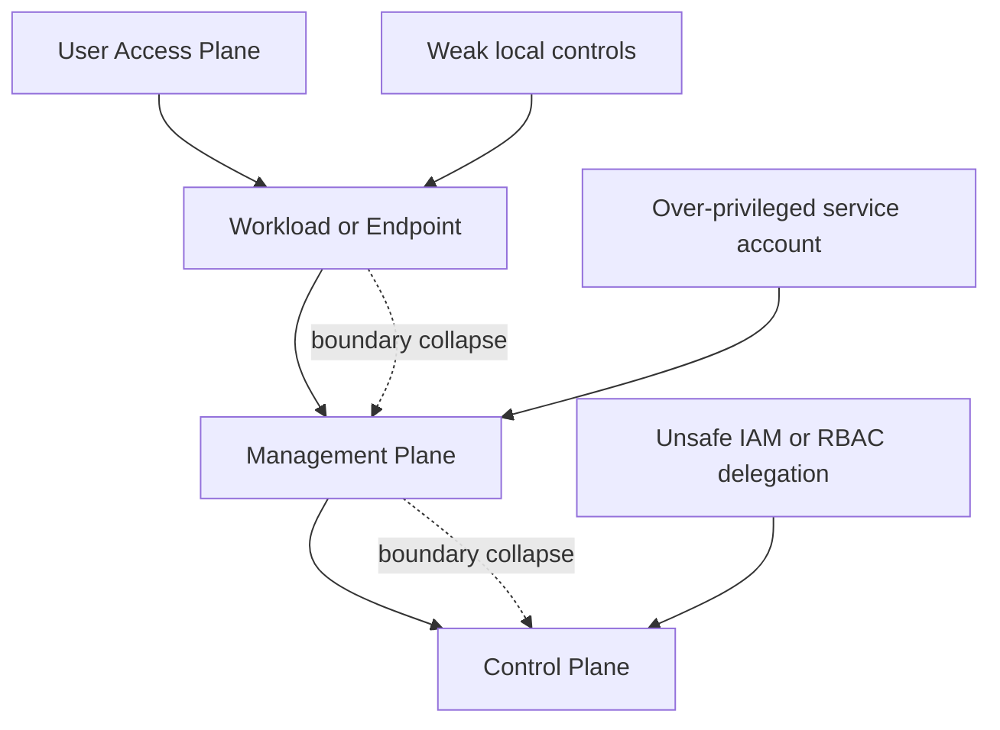
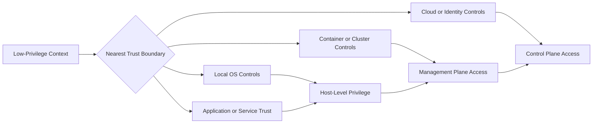
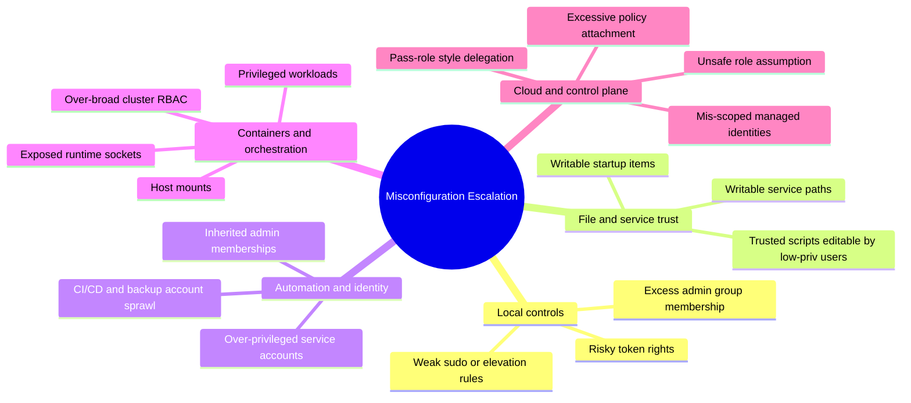
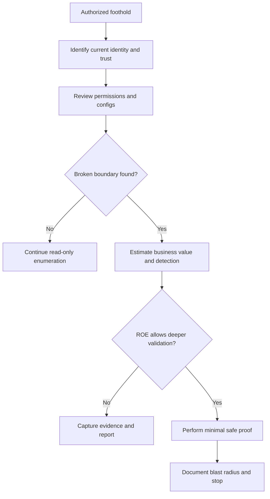
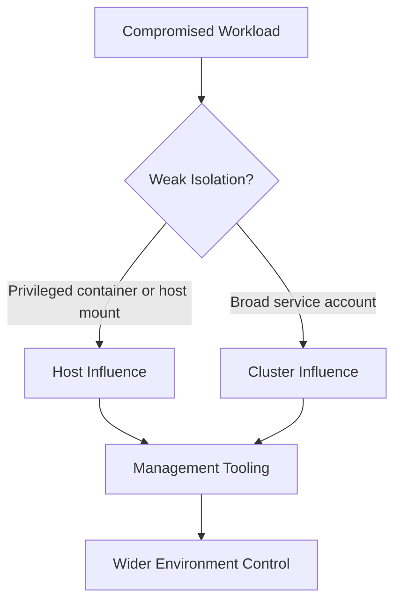
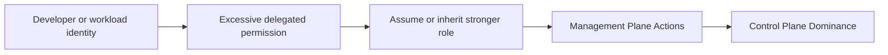
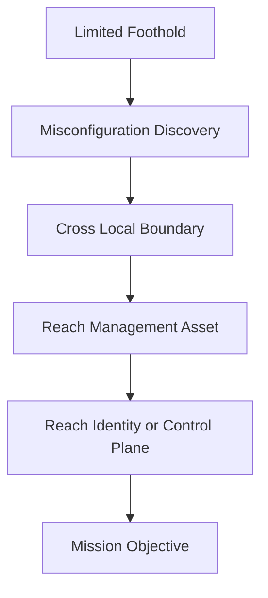

# Misconfiguration Escalation

> **Phase 07 — Privilege Escalation**  
> **Focus:** How authorized operators identify and validate privilege escalation paths created by weak configuration across endpoints, identity systems, containers, orchestration platforms, and cloud control planes.  
> **Safety note:** This note is for authorized adversary emulation and defensive improvement. It focuses on read-only validation, decision-making, detection, and remediation rather than step-by-step abuse.

---

**Relevant ATT&CK concepts:** TA0004 Privilege Escalation | T1548 Abuse Elevation Control Mechanism | T1134 Access Token Manipulation | T1611 Escape to Host | T1548.005 Temporary Elevated Cloud Access

---

## Table of Contents

1. [Why It Matters](#1-why-it-matters)
2. [Beginner View](#2-beginner-view)
3. [Privilege-Boundary Mental Model](#3-privilege-boundary-mental-model)
4. [Common Misconfiguration Families](#4-common-misconfiguration-families)
5. [A Safe Assessment Workflow](#5-a-safe-assessment-workflow)
6. [Read-Only Validation Examples](#6-read-only-validation-examples)
7. [Common Escalation Patterns](#7-common-escalation-patterns)
8. [Platform Walkthroughs by Layer](#8-platform-walkthroughs-by-layer)
9. [Chaining Logic in Real Operations](#9-chaining-logic-in-real-operations)
10. [Detection Opportunities](#10-detection-opportunities)
11. [Defensive Controls](#11-defensive-controls)
12. [Reporting Guidance](#12-reporting-guidance)
13. [Conceptual Scenarios](#13-conceptual-scenarios)
14. [Key Takeaways](#14-key-takeaways)
15. [References](#15-references)

---

## 1. Why It Matters

Misconfiguration-based privilege escalation is one of the most realistic ways a limited foothold turns into meaningful control during an engagement. In real environments, operators more often encounter **trust failures** than dramatic memory corruption. A system may already trust the wrong account, the wrong path, the wrong service, or the wrong role.

That matters because misconfigurations are usually:

- **Common** — OWASP notes that 90% of tested applications showed some form of security misconfiguration.
- **Stable** — unlike crash-prone exploit chains, configuration flaws often work consistently until someone hardens them.
- **Chainable** — one weak boundary often reveals a stronger one behind it.
- **Operationally believable** — misuse of admin tooling, service identities, or inherited permissions often resembles legitimate activity.

In red-team work, the question is not only:

> “Can we become admin?”

It is also:

> “Which trust boundary can we cross with the least noise and the highest mission value?”

Microsoft’s privileged access model is useful here: environments have **user**, **workload**, **management**, and **control** planes. Misconfiguration escalation happens when a lower-trust plane is able to influence a higher-trust one.



A useful mental shortcut:

- **Exploit-based escalation** breaks software.
- **Misconfiguration-based escalation** abuses misplaced trust.

---

## 2. Beginner View

At the beginner level, privilege escalation sounds simple: a low-privileged user gains higher privileges.

That is true, but incomplete.

In mature operations, escalation is really about **moving upward through trust layers**:

- from **standard user** to **local admin or root**
- from **application or container** to **host control**
- from **host control** to **management tooling**
- from **management tooling** to **identity or cloud control planes**

### A beginner-to-advanced ladder

| Level | Key question | What to look for |
|---|---|---|
| **Beginner** | What on this system runs with more privilege than I have? | admin groups, privileged services, scheduled tasks, elevation helpers |
| **Intermediate** | Which privileged components trust writable files, inherited permissions, or broad rules? | writable paths, risky ACLs, weak `sudo` rules, permissive service identities |
| **Advanced** | If I cross this boundary, what larger plane do I reach next? | backup systems, deployment systems, virtualization, IAM, orchestration, directory services |

The most valuable escalation path is usually not the flashiest one. It is the one that:

1. fits the rules of engagement,
2. creates strong proof of risk,
3. avoids unnecessary operational noise, and
4. connects to a business-relevant objective.

---

## 3. Privilege-Boundary Mental Model

A strong operator thinks in **boundaries**, not just in commands.

### Boundary types that matter

| Boundary | Typical starting point | Example misconfiguration | Why it matters |
|---|---|---|---|
| **User → Local Admin** | standard workstation user | broad elevation rules, writable privileged paths, unsafe scheduled tasks | full control of one host |
| **Service/App → Host** | web app, container, service account | exposed runtime sockets, host mounts, privileged capabilities | breaks isolation and reaches the underlying OS |
| **Host → Management Plane** | local admin on a server | deployment tools, backup agents, orchestration tooling with broad rights | one host becomes a force multiplier |
| **Management Plane → Control Plane** | CI/CD, identity sync, cloud admin helper | unsafe role assumption, over-broad RBAC, inherited admin groups | organization-wide impact |



This is why misconfiguration escalation is so dangerous: the first gain may look local, but the **second-order effect** is often much larger.

---

## 4. Common Misconfiguration Families

Different platforms express the same basic problem in different ways: a high-privilege action is reachable from a lower-privilege context.



### A useful pattern to remember

Misconfiguration escalation usually follows one of four shapes:

1. **A privileged thing trusts a writable thing.**  
   Example: a high-privilege service depends on a path or file that lower-privileged users can change.
2. **A privileged identity is broader than intended.**  
   Example: a service account or role has far more rights than its function requires.
3. **An isolation boundary is weaker than assumed.**  
   Example: a container can influence the host or cluster.
4. **A delegated control path is not properly constrained.**  
   Example: an account can request, inherit, or assume more privilege than defenders expect.

---

## 5. A Safe Assessment Workflow

During an authorized engagement, misconfiguration escalation should be validated deliberately. The best practice is to gather strong evidence **without creating avoidable impact**.

### A practical workflow

1. **Confirm the evidence threshold**  
   Know whether the client wants observation only, safe proof-of-control, or limited validation up to a defined stop point.

2. **Inventory current trust**  
   Determine the current user, groups, roles, tokens, service context, and reachable management systems.

3. **Enumerate read-only first**  
   Prefer permissions review, policy review, group review, and configuration inspection before touching anything that changes state.

4. **Prioritize by mission value**  
   A path to backup infrastructure or cloud IAM is usually more strategically important than a noisy local-only gain.

5. **Map the detection surface**  
   Ask what logs, events, or control-plane actions the defender would see if this path were used.

6. **Stop at the approved proof point**  
   If the evidence already shows that a boundary is broken, do not continue farther than the rules allow.



### Evidence goals that keep engagements safe

| Goal | Good evidence | Avoid if not required |
|---|---|---|
| **Prove access path exists** | group membership, policy output, ACL review, role graph | irreversible privilege changes |
| **Prove impact** | screenshots, read-only commands, allowed simulation output | modifying business data |
| **Prove reachability** | policy simulation, access review, path mapping | full objective completion if unnecessary |

---

## 6. Read-Only Validation Examples

These examples are meant for **authorized review and evidence collection only**. They focus on understanding privilege boundaries without showing abuse steps.

### Linux and Unix-like systems

```bash
# Identity and group context
id
groups
sudo -l

# Privileged binaries and capabilities
find / -perm -4000 -type f 2>/dev/null
getcap -r / 2>/dev/null

# Startup, service, and scheduled-execution trust
systemctl list-unit-files --state=enabled 2>/dev/null
find /etc/systemd /usr/lib/systemd -type f -writable 2>/dev/null
crontab -l 2>/dev/null
ls -la /etc/cron.* 2>/dev/null
```

### Windows endpoints and servers

```powershell
whoami /all
whoami /priv
net user %USERNAME%
net localgroup Administrators
schtasks /query /fo LIST /v
sc qc Schedule
icacls "C:\Program Files" /T | findstr /I "(F) (M) Everyone Users Authenticated"
```

### Containers and Kubernetes

```bash
id
cat /proc/1/cgroup
ls -l /var/run/docker.sock 2>/dev/null
kubectl auth can-i --list
kubectl get rolebindings,clusterrolebindings -A
kubectl get pods -A -o wide
```

### Cloud and identity control planes

```bash
# AWS
aws sts get-caller-identity
aws iam list-attached-user-policies --user-name <authorized-user>
aws iam simulate-principal-policy --policy-source-arn <authorized-arn> --action-names sts:AssumeRole iam:PassRole

# Azure
az account show
az role assignment list --assignee <authorized-object-id>

# GCP
gcloud auth list
gcloud projects get-iam-policy <project-id>
```

### Why these examples matter

None of the commands above are interesting by themselves. Their value comes from the questions they answer:

- Which identities are more powerful than they should be?
- Which trusted execution paths are editable from below?
- Which control plane can be reached from the current plane?
- Which finding is worth validating further under the engagement rules?

---

## 7. Common Escalation Patterns

The table below focuses on **how to reason about the pattern**, not how to weaponize it.

| Pattern | Typical evidence | Why it escalates | Detection surface | Strong reporting angle |
|---|---|---|---|---|
| **Overly broad elevation rules** | permissive `sudo`, risky user rights, excessive local admin membership | low-priv user can trigger higher-priv execution | auth logs, privilege assignment events, command lineage | “Local privilege boundary is policy-broken, not exploit-broken.” |
| **Writable trusted path** | privileged service or task depends on writable file, directory, or script | trusted execution can be influenced from a lower context | file integrity alerts, service/task modification events | “High-privilege process trusts low-integrity content.” |
| **Over-privileged service account** | service identity belongs to admin groups or holds broad cloud roles | compromise of one application becomes privileged control | unusual service logons, identity-provider events, control-plane API calls | “Application compromise inherits administrative reach.” |
| **Backup / deployment / orchestration sprawl** | agent or tool has rights across many hosts or environments | one management component becomes a cross-environment pivot | admin protocol logs, deployment logs, backup console activity | “Management plane has become a privilege amplifier.” |
| **Container isolation failure** | privileged pod, host mount, runtime socket exposure | workload can influence host or cluster boundary | cluster audit logs, runtime events, policy violations | “Workload boundary is weaker than assumed.” |
| **Unsafe RBAC or role delegation** | role assumption, pass-role style permissions, cluster-admin grants | user or service can self-elevate into a more trusted plane | IAM audit logs, role assignment changes, unusual token use | “Delegation model permits vertical movement into control plane.” |
| **Identity inheritance drift** | nested groups, stale admin membership, help-desk or automation overlap | benign-seeming accounts accumulate high-value rights | group change logs, privileged sign-in analytics | “Privilege sprawl makes escalation look legitimate.” |

A simple way to score findings:

| Question | Why it matters |
|---|---|
| **Does it cross a higher-value plane?** | moving into identity, backup, virtualization, or cloud control is strategically significant |
| **Does it look like normal admin activity?** | believable activity is harder for defenders to spot |
| **Can it be proven safely?** | strong findings do not require unsafe validation |
| **Would it chain cleanly into the exercise objective?** | good red-team findings fit the campaign story |

---

## 8. Platform Walkthroughs by Layer

### 8.1 Linux and Unix-like hosts

Misconfiguration escalation on Linux is often about **execution trust**.

Common review areas:

- broad `sudo` rules or cached elevation assumptions
- risky SUID/SGID footprint
- unsafe Linux capabilities on non-essential binaries
- root-owned services that depend on writable content
- scheduled jobs that execute scripts from weakly protected paths

#### The key idea

If a lower-privileged user can influence what a privileged process runs, the privilege boundary is already broken.

| Review area | Read-only evidence | Why defenders should care |
|---|---|---|
| `sudo` policy | `sudo -l`, `sudoers` review | convenience rules often outlive their original purpose |
| SUID/SGID sprawl | file inventory and owner review | old admin tooling expands attack surface |
| file capabilities | `getcap` review | fine-grained privilege can quietly become coarse-grained power |
| service and cron trust | unit files, timers, script ACLs | operational scripts are often trusted more than they are protected |

### 8.2 Windows endpoints and servers

Windows escalation through misconfiguration often hides inside **service management**, **task scheduling**, **group membership**, and **delegated admin rights**.

Common review areas:

- service paths and ACLs
- startup tasks and maintenance jobs
- over-granted local admin rights
- backup, restore, or debug-style rights granted too widely
- management tooling installed on user-accessible systems

#### The key idea

In Windows environments, the most realistic red-team path often looks like ordinary administration from an unusual origin.

| Review area | Read-only evidence | Why defenders should care |
|---|---|---|
| service configuration | `sc qc`, service ACL review | services are durable trust anchors |
| scheduled tasks | task definitions and principals | recurring automation is easy to forget and hard to monitor well |
| group memberships | nested local/domain admin review | inherited privilege is a common blind spot |
| token and user rights | `whoami /priv`, policy review | excessive rights can enable privilege jumps without obvious malware |

### 8.3 Containers and Kubernetes

Containerized environments frequently create a false sense of safety. A container is not a security boundary if it can directly influence the host, runtime, or orchestrator.

Common review areas:

- privileged workloads
- host namespace or host-path access
- exposed runtime sockets
- service accounts with broad RBAC
- secrets and management APIs reachable from workloads



#### The key idea

The question is not whether a container is “isolated by default.” The question is whether operations, convenience, or platform exceptions quietly removed that isolation.

### 8.4 Cloud and identity control planes

Cloud escalation by misconfiguration is usually about **delegation mistakes**.

Common review areas:

- ability to assume or request a stronger role
- pass-role style permissions that let one identity launch another with more rights
- over-broad managed identities and service principals
- CI/CD tokens with production control-plane reach
- help-desk, sync, or automation accounts spanning too many tiers

#### The key idea

Cloud and identity systems are not just another platform layer. They are often the **highest-value privilege plane** in the environment.



---

## 9. Chaining Logic in Real Operations

Misconfiguration escalation becomes especially important when it connects otherwise separate attack phases.

### Example chain types

| Starting point | Misconfiguration | Next plane reached | Why it matters |
|---|---|---|---|
| **user workstation** | weak local admin boundary or trusted maintenance path | local host admin | gives visibility into cached admin activity and tooling |
| **application server** | over-privileged service account | management or backup systems | turns one app compromise into broad infrastructure reach |
| **containerized workload** | unsafe runtime exposure or broad service account | cluster or host control | breaks expected isolation model |
| **CI/CD runner** | excessive deployment identity | cloud or production control plane | blends into normal automation |
| **help-desk or operations account** | privilege sprawl across tiers | identity or directory infrastructure | converts support access into strategic control |

### A memorable chain model



The important lesson is that escalation findings should be written as **attack chains**, not isolated facts. A local misconfiguration matters much more when it is the shortest route to the client’s crown jewels.

---

## 10. Detection Opportunities

Misconfiguration escalation is often detectable, but only if defenders correlate **identity**, **configuration**, and **execution** signals together.

| Layer | What to monitor | Why it matters |
|---|---|---|
| **Linux / Unix** | `sudo` usage, UID vs EUID mismatches, service definition changes, cron changes, capability changes | trusted execution paths often leave quiet but clear evidence |
| **Windows** | privileged logons, service changes, scheduled task changes, process lineage, group membership changes | escalation often looks administrative rather than obviously malicious |
| **Containers / Kubernetes** | privileged pod creation, hostPath use, runtime socket access, role binding changes, sensitive namespace access | cluster drift is one of the clearest escalation indicators |
| **Cloud / IAM** | role assumption, pass-role style activity, policy changes, secret creation, JIT elevation events | identity-plane escalation is high impact and richly logged |

### Practical defender mindset

Ask three questions together:

1. **Who gained more power than usual?**
2. **What configuration allowed it?**
3. **What higher-value plane became reachable as a result?**

MITRE’s guidance for T1548 also highlights monitoring for:

- setuid/setgid changes or executions on Unix-like systems,
- high-integrity executions with unusual process lineage on Windows,
- sudden elevation via role or permission changes in cloud environments.

---

## 11. Defensive Controls

Misconfiguration escalation is best prevented by reducing hidden trust and making privilege boundaries explicit.

| Control | Why it helps |
|---|---|
| **Least privilege everywhere** | reduces the blast radius of compromised users, services, and workloads |
| **Administrative tiering** | prevents lower-trust systems from reaching management and control planes directly |
| **Configuration baselines and hardening** | repeatable secure builds reduce drift and remove convenience shortcuts |
| **Tight file, service, and task ACLs** | privileged components should not depend on editable content from below |
| **JIT / approved elevation** | limits standing privilege and creates auditable elevation moments |
| **RBAC and IAM review** | stops slow privilege sprawl and self-elevation paths |
| **Drift detection and continuous audit** | many escalation paths appear months after the original secure build |
| **Cross-layer monitoring** | identity, endpoint, cluster, and cloud logs must be correlated |

A strong program does not only harden endpoints. It protects the **relationships between planes**.

---

## 12. Reporting Guidance

A good red-team finding on misconfiguration escalation should read like a clear story.

### Include these elements

| Element | What to capture |
|---|---|
| **Condition** | the specific trust failure or excessive permission |
| **Starting context** | what level of access was required to observe it |
| **Safe proof** | the minimal evidence collected under the rules of engagement |
| **Escalation result** | what higher privilege or plane became reachable |
| **Business consequence** | what this would mean for the client’s objective, data, or recovery model |
| **Detection notes** | what telemetry should have revealed the path |
| **Remediation** | how to remove the trust failure, not just the symptom |

### A simple reporting formula

> A lower-trust identity or asset could influence a higher-trust component because of a configuration weakness. This allowed a realistic path from **[starting context]** to **[higher-trust plane]** with **[observed level of defender visibility]**.

That wording keeps the focus on the broken boundary rather than on tool-centric detail.

---

## 13. Conceptual Scenarios

### Scenario 1: Workstation to management plane

A red team begins with a standard user foothold on an employee workstation. Read-only review shows that a trusted maintenance mechanism runs with high privilege and depends on content editable from a lower-trust path. The team stops at safe proof, documents the broken trust boundary, and explains how this would expose local admin context and any management tooling used from that host.

### Scenario 2: Application server to backup environment

A web application compromise reveals that the service account has access far beyond the application’s purpose. The team does not abuse the account to perform broad actions; instead, it demonstrates the role scope, reachable systems, and likely follow-on path into backup or orchestration infrastructure.

### Scenario 3: Container to cluster influence

A compromised workload has a service account with broader rights than expected. The team validates the role relationships, namespace access, and potential control-plane reach, then reports how a workload incident could become a platform incident.

### Scenario 4: Cloud workload to control plane

An automation identity meant for deployment can also inherit stronger permissions than intended. The team uses policy review and approved simulation to show that production control-plane actions are reachable from a lower-trust automation context.

---

## 14. Key Takeaways

- Misconfiguration escalation is usually a **trust problem**, not a software-bug problem.
- The best red-team question is not just “Can this escalate?” but “**What higher plane does this reach?**”
- Read-only validation and minimal safe proof often produce stronger findings than noisy over-validation.
- Containers, CI/CD systems, backup tooling, and IAM are often the most important escalation surfaces because they multiply reach.
- Defenders win by combining hardening, privilege review, tiering, and cross-layer telemetry.

---

## 15. References

- [MITRE ATT&CK — Privilege Escalation (TA0004)](https://attack.mitre.org/tactics/TA0004/)
- [MITRE ATT&CK — Abuse Elevation Control Mechanism (T1548)](https://attack.mitre.org/techniques/T1548/)
- [OWASP Top 10 2021 — A05 Security Misconfiguration](https://owasp.org/Top10/2021/A05_2021-Security_Misconfiguration/index.html)
- [Microsoft — Enterprise Access Model / Privileged Access Strategy](https://learn.microsoft.com/en-us/security/privileged-access-workstations/privileged-access-access-model)
- [NIST SP 800-123 — Guide to General Server Security](https://csrc.nist.gov/pubs/sp/800/123/final)

*Last updated: 2026 — aligned to authorized adversary-emulation framing and focused on safe validation over intrusive execution.*
