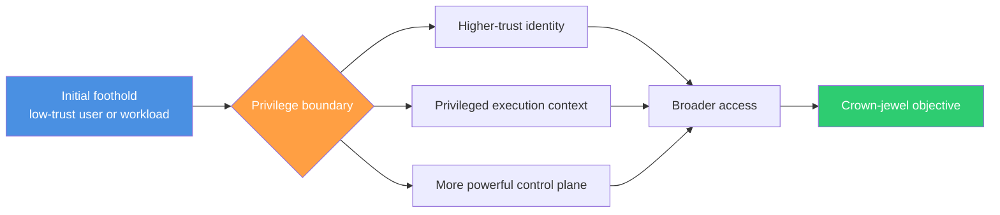
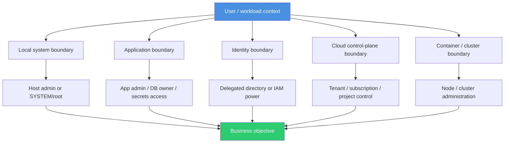
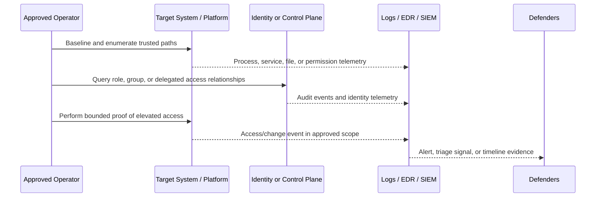

# 🔐 Privilege Escalation Overview

> **Audience:** Beginner → Advanced | **Category:** Red Teaming - Privilege Escalation
> 
> **Authorized use only:** This note is for approved adversary-emulation, purple-team, and security validation work. It explains how to understand and assess privilege boundaries safely, with emphasis on realistic attack paths, careful evidence collection, and defensive improvement — **not** unsafe intrusion playbooks.

---

## 📚 Table of Contents

1. [Core Definition](#1-core-definition)
2. [Why Privilege Escalation Matters](#2-why-privilege-escalation-matters)
3. [Privilege Boundaries and Trust Layers](#3-privilege-boundaries-and-trust-layers)
4. [Types of Privilege Escalation](#4-types-of-privilege-escalation)
5. [Common Root Causes](#5-common-root-causes)
6. [Safe Red Team Assessment Workflow](#6-safe-red-team-assessment-workflow)
7. [What Good Enumeration Focuses On](#7-what-good-enumeration-focuses-on)
8. [Platform-by-Platform View](#8-platform-by-platform-view)
9. [Detection and Telemetry](#9-detection-and-telemetry)
10. [Privilege Chains and Business Impact](#10-privilege-chains-and-business-impact)
11. [Reporting Privilege Escalation Well](#11-reporting-privilege-escalation-well)
12. [Hardening Priorities](#12-hardening-priorities)

---

## 1. Core Definition

**Privilege escalation** is the movement from one security context to another that has **more authority, more reach, or more trust**.

Beginners often think only in terms of:

- standard user → administrator
- administrator → `SYSTEM`
- user → `root`

That is part of the story, but mature red teaming treats privilege escalation more broadly:

- application user → database owner
- low-trust service account → deployment account
- workstation user → directory-admin capability
- container identity → cloud control-plane role
- helpdesk role → reset rights over privileged identities

The key idea is simple:

> **Privilege escalation is really trust escalation.**

If a new identity, token, role, or execution context lets an operator do things that were previously blocked, the boundary has been crossed.

### A simple mental model

Think of an enterprise like a building with badges:

| Badge Level | What It Allows |
|---|---|
| Visitor badge | Lobby access only |
| Employee badge | Office floors |
| Facilities badge | Utility rooms and restricted areas |
| Executive/security badge | Sensitive rooms, controls, and vaults |

Privilege escalation is discovering that a person with a lower badge can still reach a higher-trust area because of:

- a bad door configuration
- a shared key left in the wrong place
- a trusted escort process that can be abused
- an over-permissive exception created for convenience



---

## 2. Why Privilege Escalation Matters

Initial access is often **insufficient** for the real objective.

A foothold may let a red team prove code execution or account access, but important goals usually sit behind stronger trust boundaries:

- privileged management interfaces
- service accounts with broad reach
- directory or IAM roles
- backup systems
- secrets stores
- regulated or business-critical data
- security tooling and response controls

### Why mature adversaries care

Privilege determines four things very quickly:

| Question | Low Privilege | Higher Privilege |
|---|---|---|
| **What can I reach?** | Limited user-owned data and apps | Admin surfaces, shared systems, crown-jewel paths |
| **What can I change?** | Mostly user-space settings | Services, policies, accounts, trust relationships |
| **How far can I move?** | Narrow and noisy | Faster, broader, often via trusted channels |
| **How much impact can I demonstrate?** | Local proof only | Enterprise-wide consequences become plausible |

### Why defenders care

Privilege escalation is where a security event often changes from:

- **contained endpoint issue**

into:

- **identity compromise**
- **domain or tenant-level risk**
- **widespread operational exposure**

That is why this phase is so important in adversary emulation. It answers:

> Could a realistic attacker turn a small foothold into meaningful control before defenders stop them?

---

## 3. Privilege Boundaries and Trust Layers

Not all privilege is the same. Different environments enforce different boundaries.

### Common boundary types



### Important idea: privilege is contextual

A local administrator on a workstation is powerful, but may still be **less relevant** to the objective than:

- a cloud automation role with storage access
- a CI/CD identity that can deploy code
- a helpdesk role with password-reset rights
- an application admin who can reach production secrets

So the correct question is not just:

> “Can we become local admin?”

It is:

> “Which privilege boundary most meaningfully advances the mission objective?”

### How major platforms think about privilege

| Environment | Boundary Concept | What “more privilege” usually means |
|---|---|---|
| Windows | Standard token, elevated admin token, `SYSTEM`, delegated admin rights | More ability to modify services, drivers, security settings, identities |
| Linux/Unix | UID/GID, `sudo`, setuid/setgid, capabilities, root-owned automation | More ability to control services, protected files, scheduled execution |
| Active Directory / IAM | Groups, ACLs, delegated rights, role assignments | More ability to manage users, systems, secrets, or policies |
| Cloud | Roles, policies, trust relationships, workload identity | More control over compute, storage, networking, and identity |
| Containers / Kubernetes | Pod identity, RBAC, node trust, admission controls | More access to secrets, workloads, cluster APIs, or underlying hosts |

Microsoft’s UAC model is a good example of a boundary designed to **limit unauthorized elevation**, while Linux privilege models often split sensitive actions across `sudo`, ownership, and capabilities. MITRE ATT&CK also treats privilege escalation as a broad tactic that includes abuse of elevation control mechanisms, token manipulation, and account manipulation.

---

## 4. Types of Privilege Escalation

### 4.1 Vertical escalation

This is the classic “move upward” case.

```text
standard user → local admin → SYSTEM/root → broader identity control
```

It increases authority within the same system or trust hierarchy.

### 4.2 Horizontal escalation

This is movement between identities at a similar technical level, but with **better access**.

```text
user A → user B
service account X → service account Y
team role 1 → peer role 2 with more data access
```

This matters because equal-looking accounts often have very unequal business value.

### 4.3 Transitive or chained escalation

This is the most realistic enterprise pattern.

```text
low-privilege foothold
   ↓
reachable secret or trust relationship
   ↓
broader service identity
   ↓
admin capability on a more important system
   ↓
objective reached
```

No single step looks dramatic, but together they create meaningful control.

### 4.4 Cross-plane escalation

This happens when privilege crosses from one layer into another:

- endpoint → identity platform
- application → cloud control plane
- container → host or cluster
- support role → production administration

### Quick comparison

| Type | What Changes | Simple Example |
|---|---|---|
| Vertical | Same hierarchy, more authority | User gains host admin rights |
| Horizontal | Different identity, same rough level, more useful access | One employee account reaches another user’s data or tools |
| Chained | Multiple smaller jumps create major reach | App foothold leads to service identity, then to admin action |
| Cross-plane | Boundary crosses technology layers | Workload identity reaches tenant-level cloud role |

---

## 5. Common Root Causes

Privilege escalation rarely begins with “magic.” It usually begins with **design drift, admin convenience, or forgotten trust**.

### The major root-cause families

| Root Cause | What It Looks Like | Why It Matters |
|---|---|---|
| Over-privileged identities | Users, service accounts, or roles have more rights than needed | One foothold unlocks broad access quickly |
| Weak local configuration | Services, tasks, scripts, or files trust writable locations or weaker users | Lower-trust principals can influence higher-trust execution |
| Exposed secrets and tokens | Credentials, API keys, certificates, or cached sessions are reachable | Identity boundaries collapse without exploiting software |
| Vulnerable privileged software | A high-trust component has a security flaw | Software bug becomes trust bypass |
| Unsafe automation | Build jobs, deployment hooks, schedulers, or management tools run with broad power | Convenience becomes privilege bridge |
| Delegation drift | Group nesting, ACLs, role inheritance, or temporary exceptions accumulate | Nobody realizes how much power is actually reachable |
| Boundary confusion | Container root treated like host root, app admin treated like infra admin, etc. | Teams misunderstand what the controls really protect |
| Monitoring gaps | Escalation paths exist and are technically visible, but no one correlates them | Defenders miss the transition from foothold to high-risk access |

### A useful rule of thumb

> **Privilege escalation opportunities usually appear where trust is broader than intended.**

That could mean:

- a process trusts a path it should not trust
- a role trusts a principal it should not trust
- an admin workflow trusts an operator without enough guardrails
- a control plane trusts an identity with overbroad scope

---

## 6. Safe Red Team Assessment Workflow

In professional adversary emulation, the goal is to validate the boundary **safely and convincingly**, not to maximize disruption.

```mermaid
flowchart LR
    A[Define objective and rules of engagement] --> B[Baseline current privilege context]
    B --> C[Enumerate reachable trust boundaries]
    C --> D[Rank plausible escalation paths]
    D --> E[Choose least invasive validation method]
    E --> F[Capture evidence and telemetry]
    F --> G[Stop at proof threshold]
    G --> H[Report root cause and remediation]

    style A fill:#4a90e2,color:#fff
    style E fill:#ff9f43,color:#fff
    style H fill:#2ecc71,color:#fff
```



### 6.1 Define the objective

Before any action, clarify:

- what business objective matters
- which systems or identities are in scope
- which safety constraints apply
- what proof is enough
- which actions require pre-approval or deconfliction

### 6.2 Baseline the current context

Understand exactly what the current principal can already do.

This includes:

- current identity and group or role memberships
- local and remote permissions
- available tokens, sessions, and delegated rights
- access to management interfaces and secrets stores
- proximity to sensitive automation or admin workflows

### 6.3 Enumerate trust boundaries

Do not jump straight to exploitation thinking. First ask:

- what runs above me?
- what trusts me?
- what can I influence?
- what identities can I impersonate, request, or inherit in approved testing?
- what administrative workflows touch this system?

### 6.4 Choose the least invasive proof

A strong red team prefers **safe, minimal, high-confidence validation**.

For example, the team may prove a boundary crossing by showing:

- effective permission over a benign test object
- access to a non-sensitive management action
- ability to assume a higher-trust role in a sandboxed or read-only way
- control of a privileged workflow without touching production data

### 6.5 Stop at the proof threshold

If the objective is “prove local admin reachability,” there is usually no need to:

- dump sensitive secrets unnecessarily
- alter production user data
- disable security tooling
- maintain persistence after proof is collected

The best engagements are persuasive **because they are disciplined**.

### Safe validation examples

| Boundary | Good Proof | Avoid Unless Explicitly Authorized |
|---|---|---|
| Local admin on a host | Show control of an approved admin-only setting or benign admin-owned test object | Reading broad credential stores or altering security controls |
| Directory or IAM delegation | Demonstrate effective rights over a test user, group, or role | Modifying privileged production identities |
| Cloud role escalation | Use policy simulation, read-only inventory, or approved test resource access | Creating broad new roles or changing production IAM |
| Database privilege increase | Show access to metadata or a canary record | Pulling customer or regulated datasets |
| Container / cluster boundary | Prove higher RBAC or host influence in a lab or test namespace | Changing live workloads without deconfliction |

---

## 7. What Good Enumeration Focuses On

Skilled operators do not start with “Which exploit should I try?”

They start with **questions**.

### Identity-focused questions

- Which groups, roles, and delegated rights are already attached to this identity?
- Are there temporary, break-glass, or just-in-time permissions nearby?
- Are there cached tokens, certificates, or sessions that change effective access?
- Does this identity interact with more trusted systems as part of normal work?

### Execution-focused questions

- Which processes, services, tasks, or jobs run above this context?
- Can lower-trust users modify inputs that higher-trust automation consumes?
- Are there startup paths, scripts, packages, plug-ins, or libraries trusted by privileged components?

### Secrets and configuration questions

- Where are credentials or connection strings stored?
- Are secrets exposed through logs, deployment artifacts, environment variables, or backups?
- Does the application reveal a service identity that is more powerful than the current user?

### Control-plane questions

- Which admin interfaces are reachable from here?
- Which management APIs trust this workload or host?
- Is local access quietly equivalent to cloud, directory, or cluster access?

### Practical clue map

| Clue | What It Often Suggests |
|---|---|
| Writable input to a privileged service or scheduled workflow | Trust boundary between low- and high-privilege execution may be weak |
| Reachable secret material or token cache | Identity boundary may be weaker than the OS boundary |
| Overly broad group nesting or role inheritance | Escalation may be administrative rather than technical |
| Automation identity with wildcard permissions | One service compromise may become environment-wide reach |
| Privileged container or pod exceptions | Container isolation may not match assumptions |
| Repeated “temporary” admin exceptions | Legacy access may have become standing privilege |

### The mature mindset

> **Enumerate more, assume less, and prove only what you need.**

That principle keeps both the engagement and the findings high quality.

---

## 8. Platform-by-Platform View

### 8.1 Windows

Windows privilege is not just “admin or not.” It is shaped by:

- standard user token vs elevated token
- local administrator rights
- `SYSTEM` and service context
- delegated rights in directory or management tooling
- trust relationships between services, tasks, and policies

### Why the Windows model matters

UAC exists to reduce unauthorized elevation by keeping most user activity in a standard context and prompting for higher-privilege actions when needed. In practice, that means red teams should think about:

- whether the user already has latent admin capability
- whether trusted services expose indirect control paths
- whether identity or management-plane rights matter more than local admin

### What practitioners look for

- local admin membership and delegated admin tooling
- service and scheduled-task trust relationships
- privileged software with weak configuration controls
- token-rich service contexts and shared management workflows
- directory rights that allow password resets, group changes, or policy influence

### Safe evidence ideas

- show effective rights over a benign administrative action
- prove a delegated identity management action in a test scope
- demonstrate that a privileged workflow is controllable without changing production state

---

### 8.2 Linux and Unix-like systems

Linux privilege is often simpler at first glance — user vs `root` — but in reality it is distributed across multiple mechanisms:

- file ownership and permissions
- `sudo` policy
- setuid/setgid behavior
- Linux capabilities
- `cron`, `systemd`, and service execution
- secrets in config files, environment variables, and automation

### Why this matters

A system may look locked down while still exposing a narrow path where a lower-trust user can influence a higher-trust process.

### What practitioners look for

- overbroad `sudo` or delegated command execution
- privileged automation that consumes writable files or scripts
- services launched from unsafe paths or with weak file ownership
- exposed credentials, keys, or deployment artifacts
- capabilities or container/runtime settings that grant more reach than expected

### Safe evidence ideas

- show that a trusted path is writable or influenceable
- demonstrate approved visibility into a root-owned test artifact
- prove that automation would execute with higher trust under controlled conditions

---

### 8.3 Identity systems and directories

This is where many advanced engagements are won.

Privilege escalation in identity systems may not require deep host access at all. Sometimes the most important paths are:

- delegated password reset rights
- group management rights
- ACL inheritance problems
- service-account overreach
- administrative tiering failures
- certificate or enrollment workflows that grant stronger identity

### Why this is so important

Identity control often scales farther than host control.

A modest-looking delegated permission can sometimes lead to:

- control over more users
- access to administrative sessions
- policy influence over many systems
- lateral movement with trusted identities

### Safe evidence ideas

- demonstrate effective rights against a test object
- show reachable admin path through group or ACL analysis
- validate one bounded identity action instead of modifying critical accounts

---

### 8.4 Cloud and SaaS platforms

Cloud privilege escalation is usually about **roles, trust policies, and workload identity**.

Common themes include:

- overbroad role assignments
- role assumption paths that are too permissive
- CI/CD or automation identities with tenant-wide reach
- secrets that unlock stronger cloud roles
- instance, function, or workload identities trusted too broadly
- weak separation between development and production administration

### Why cloud escalation feels different

On-prem privilege often grows host by host. Cloud privilege can jump directly into:

- storage control
- secrets management
- network changes
- compute orchestration
- IAM modification

That means even a small identity mistake can have a very large blast radius.

### Safe evidence ideas

- use read-only inventory or policy simulation
- validate access against a pre-approved test resource
- prove role reachability without making persistent configuration changes

---

### 8.5 Containers and Kubernetes

Container environments create two common misunderstandings:

1. **Root inside a container is not automatically root on the host**
2. **A small cluster permission can still be strategically powerful**

Important boundaries include:

- container user vs host user
- pod/service account vs cluster RBAC
- workload namespace vs cluster-wide administration
- secret access vs workload execution
- node trust vs control-plane trust

### What practitioners look for

- privileged workload exceptions
- unnecessary host mounts or device access
- service accounts with broad RBAC
- secret exposure through workload specs or management pipelines
- administrative tooling reachable from application workloads

### Safe evidence ideas

- show higher RBAC against a test namespace
- demonstrate access to a non-sensitive secret or workload metadata path
- prove that workload configuration violates intended isolation

---

## 9. Detection and Telemetry

Privilege escalation is not only an attacker problem. It is a **visibility test**.

A strong report should explain not just that escalation was possible, but also:

- what logs existed
- which events were noisy or silent
- whether the sequence looked suspicious to defenders
- where the organization had a chance to interrupt the chain



### Detection questions defenders should ask

| Detection Area | What Good Coverage Looks Like | Common Blind Spot |
|---|---|---|
| Endpoint telemetry | Visibility into service changes, task changes, process ancestry, and privileged file access | Only alerting on malware-like behavior, not trust abuse |
| Identity telemetry | Clear logging of group changes, role assumption, password reset, token use, delegated actions | No correlation between “admin action” and the lower-trust starting identity |
| Cloud audit logs | Role use, policy changes, secret access, unusual admin operations | Lots of logs, little context about what is normal |
| Container / cluster audit logs | RBAC decisions, secret reads, privileged workload creation, node interaction | Poor retention or no alerting for control-plane abuse |
| Response workflow | Analysts know which escalations are high priority and how to validate them | Escalation events are visible but not recognized as attack progression |

### High-value signals

Defenders usually care about patterns such as:

- a low-trust identity suddenly performing an admin-like action
- access to secrets stores or credential material soon before elevated activity
- unusual role assumption or delegated admin usage
- privileged service changes from unexpected hosts or users
- workload identities taking actions outside their normal pattern
- local admin events that precede directory, cloud, or cluster actions

---

## 10. Privilege Chains and Business Impact

The most important privilege escalation findings are usually **chains**, not isolated tricks.

### Abstract example chain

```text
Low-privilege app foothold
    ↓
Reachable deployment secret
    ↓
Automation identity with broader infrastructure rights
    ↓
Admin control of a critical platform component
    ↓
Access path to crown-jewel data or business process
```

This kind of chain is valuable because it explains:

- where the first trust gap appeared
- why later steps became possible
- which defensive layers did not reinforce each other
- what business objective became reachable as a result

### Why chains matter more than single issues

A single local weakness may look “medium” in isolation.

But if it enables access to:

- a privileged identity
- a deployment pipeline
- a directory control path
- a cloud admin role

then its practical risk becomes much higher.

This is one reason red team reporting should always tie technical escalation back to:

- objective reachability
- blast radius
- detectability
- remediation priority

---

## 11. Reporting Privilege Escalation Well

A strong finding does not just say:

> “Privilege escalation was possible.”

It explains the entire control failure clearly.

### What the report should capture

| Reporting Element | What Good Looks Like |
|---|---|
| Starting context | Initial identity, host, workload, or role and its original limits |
| Boundary crossed | Exactly what higher-trust context became reachable |
| Root cause | Misconfiguration, over-privilege, trust misuse, software flaw, or chain of factors |
| Safe proof | Evidence collected without unnecessary impact |
| Business effect | Why the new privilege mattered to the mission objective |
| Detection story | What defenders saw, missed, or misunderstood |
| Remediation | Specific actions that remove the trust gap |

### Example finding language

> A low-trust workload identity could reach a higher-trust operational role because deployment automation exposed reusable credentials and the target role had broader permissions than required. This allowed a realistic path from application access to infrastructure administration. Logging captured the final administrative action but did not clearly expose the earlier identity transition, reducing defender response quality.

That is much more useful than a vague statement such as “got admin.”

---

## 12. Hardening Priorities

The best remediation for privilege escalation is usually **better trust design**, not just patching one symptom.

### High-value fixes

1. **Reduce standing privilege**
   - Remove broad admin rights that are rarely needed.
2. **Review delegated rights regularly**
   - Especially helpdesk, automation, and inherited group/role access.
3. **Harden secrets handling**
   - Keep credentials out of logs, environment variables, shared storage, and deployment artifacts.
4. **Protect privileged automation**
   - Ensure schedulers, CI/CD, services, and scripts do not trust low-integrity inputs.
5. **Separate tiers of administration**
   - Workstation admin, server admin, directory admin, and cloud admin should not blur together.
6. **Instrument the escalation path**
   - Log role assumptions, delegated identity actions, service changes, and access to secrets.
7. **Use canary objects and safe validation paths**
   - Make it easier to prove or detect dangerous access without touching sensitive data.
8. **Re-test with purple-team follow-up**
   - Confirm the boundary is truly fixed and detection logic improved.

### Quick memory aid

```text
Privilege escalation = reachable trust + weak guardrail + meaningful new access
```

If you remember that formula, you will understand most real-world escalation findings.

---

## Final Takeaway

Privilege escalation is one of the most important phases in red teaming because it translates a small foothold into meaningful control. But mature operators do not treat it as a reckless race to “become root.” They treat it as a careful study of **trust boundaries**:

- Which boundary matters most?
- Why is it reachable?
- How can it be proven safely?
- What should defenders have seen?
- Which fix actually removes the path?

That mindset produces better evidence, safer engagements, and far more useful findings.
