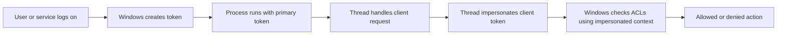
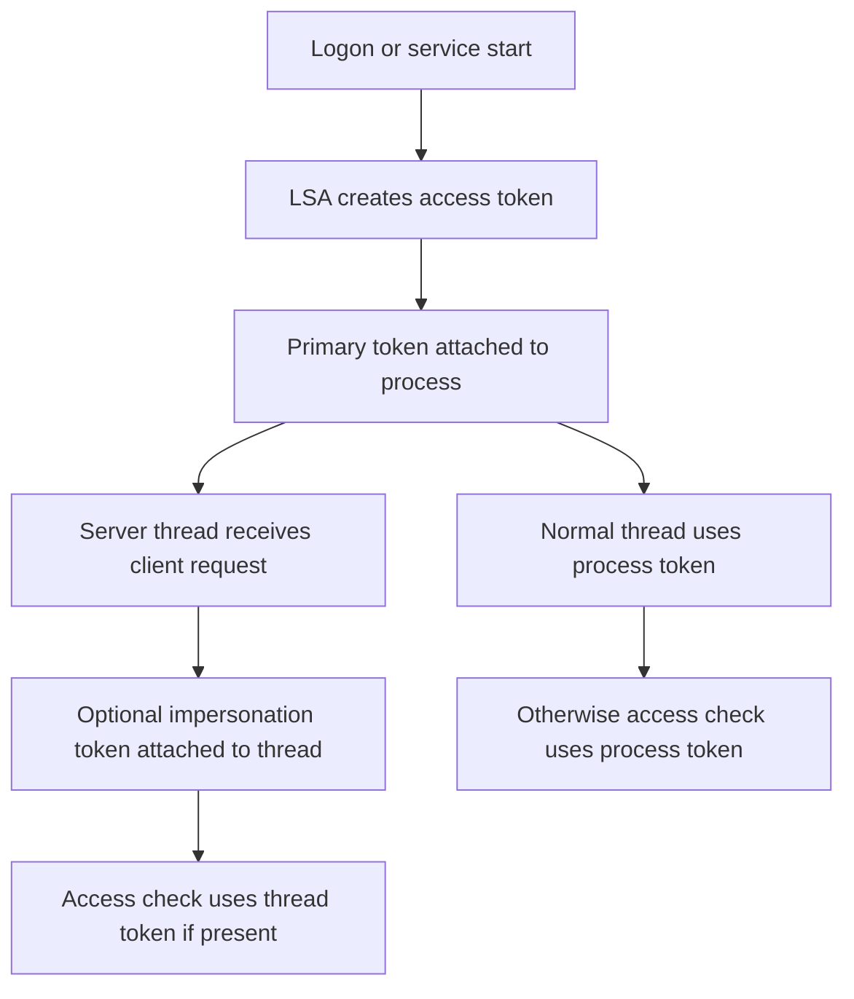
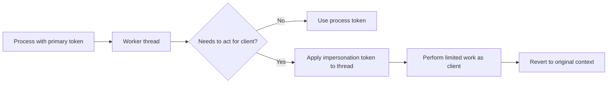
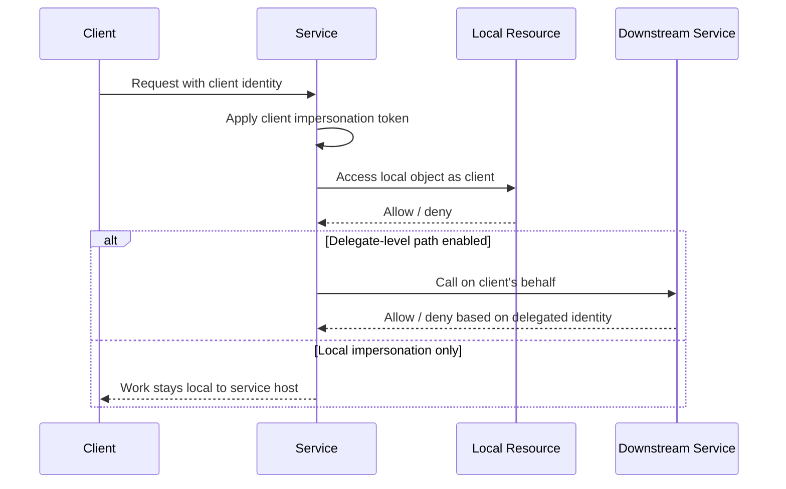
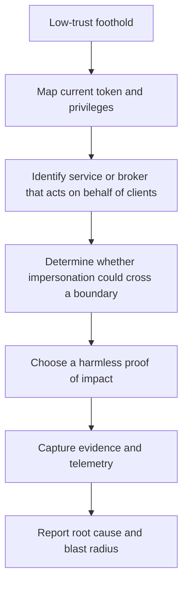

# Token Impersonation

> **Audience:** Beginner → Advanced | **Category:** Red Teaming - Privilege Escalation
>
> **Authorized use only:** This note is for approved adversary-emulation, purple-team, and defensive validation work. It explains how Windows token impersonation works, why it matters, how to assess it safely, and what defenders should monitor — **not** step-by-step intrusion instructions.

---

**Relevant ATT&CK concepts:** TA0004 Privilege Escalation | T1134 Access Token Manipulation | T1134.001 Token Impersonation/Theft | T1134.002 Create Process with Token

---

## 📚 Table of Contents

1. [What Token Impersonation Means](#1-what-token-impersonation-means)
2. [Why It Matters in Red Teaming](#2-why-it-matters-in-red-teaming)
3. [Windows Access Token Basics](#3-windows-access-token-basics)
4. [Primary Tokens vs. Impersonation Tokens](#4-primary-tokens-vs-impersonation-tokens)
5. [Impersonation Levels](#5-impersonation-levels)
6. [Where Token Impersonation Appears in Real Environments](#6-where-token-impersonation-appears-in-real-environments)
7. [Safe, Practical Assessment Workflow](#7-safe-practical-assessment-workflow)
8. [Detection and Telemetry Opportunities](#8-detection-and-telemetry-opportunities)
9. [Hardening Priorities](#9-hardening-priorities)
10. [Reporting Token Impersonation Well](#10-reporting-token-impersonation-well)
11. [Common Misunderstandings](#11-common-misunderstandings)
12. [Key Takeaways](#12-key-takeaways)
13. [References](#13-references)

---

## 1. What Token Impersonation Means

A **Windows access token** is the runtime identity attached to a process or thread. It tells Windows:

- who the subject is
- which groups it belongs to
- which privileges it holds
- what integrity level it runs at
- what security checks should succeed or fail

**Token impersonation** means a thread or service temporarily acts using **someone else's security context**.

### Beginner mental model

Think of a token like a building badge.

- A normal process wears **its own badge**.
- A server thread handling a request may temporarily wear **the client's badge**.
- While that borrowed badge is active, access checks are made against the **borrowed identity**, not the original one.

That behavior is not automatically malicious. In fact, it is part of normal Windows design. Many services need to act on behalf of users.

The problem begins when a lower-trust context can cause a higher-trust token to be applied in a way that crosses a security boundary.



### The core red-team idea

> **Token impersonation is really about whether a trusted identity can be borrowed long enough to do something meaningful.**

That is why it sits inside privilege escalation. If the borrowed context is more powerful than the starting context, the operator may have crossed a trust boundary.

---

## 2. Why It Matters in Red Teaming

Token impersonation matters because Windows trusts tokens deeply. When a token changes, the answer to *"what can this code do?"* changes immediately.

### Why it is operationally important

| Question | Why It Matters |
|---|---|
| **Can a user context become a higher local context?** | This shows whether local privilege boundaries are actually enforced. |
| **Can a service or broker act as someone stronger than the caller?** | This tests the safety of Windows service design and delegated execution paths. |
| **Can local impersonation lead to `SYSTEM` or service-account actions?** | This often turns a limited foothold into real host control. |
| **Can the impersonated context reach network resources?** | This determines whether the issue is only local or could extend outward. |
| **Would defenders notice the transition?** | Good detections should spot unusual identity or integrity shifts. |

### Practical impact ladder

```text
Medium-integrity user
   ↓
Elevated administrator process
   ↓
NT AUTHORITY\SYSTEM or privileged service account
   ↓
Potential access to broader local secrets, controls, or brokered operations
   ↓
In some configurations, delegated network access
```

### Why mature teams care

A lot of attacks do **not** fail because the initial foothold is weak.
They fail because the environment correctly prevents that foothold from becoming more trusted.

Token impersonation is one of the clearest ways to test whether those trust boundaries are solid.

---

## 3. Windows Access Token Basics

Before learning impersonation, you need to know what a token contains.

### What is inside a token?

| Token Element | What It Means | Why It Matters in Assessments |
|---|---|---|
| **User SID** | The main security identity | Determines who Windows thinks the subject is |
| **Group SIDs** | Membership such as Administrators or service groups | Expands what the token is allowed to access |
| **Privileges** | Rights such as `SeImpersonatePrivilege`, `SeDebugPrivilege`, `SeAssignPrimaryTokenPrivilege` | Often determine whether a token path is even interesting |
| **Integrity level** | Low, medium, high, or system-like trust boundary | Explains why some actions fail even when group membership looks strong |
| **Session information** | Desktop/session context | Affects what processes and resources are reachable |
| **Token type** | Primary or impersonation | Changes whether the token is tied to a whole process or just a thread |
| **Default DACL / security attributes** | Default security behavior for objects the subject creates | Useful for understanding side effects and resource ownership |

### Why tokens matter more than account names

A beginner may look at a process and ask:

> "Which user started this?"

A more useful question is:

> "What token is Windows actually using for this action right now?"

That is the advanced mindset, because Windows enforces security decisions based on the token, not on a simple human label.

### Where tokens live conceptually



### Important token-related privileges to recognize

| Privilege | Why It Deserves Attention |
|---|---|
| `SeImpersonatePrivilege` | Strongly relevant when a process may act on behalf of another security context |
| `SeAssignPrimaryTokenPrivilege` | Matters when a token may be assigned to a new process context |
| `SeDebugPrivilege` | Can expose sensitive process and identity material |
| `SeTcbPrivilege` | Extremely powerful and uncommon; suggests deep trust |
| `SeBackupPrivilege` / `SeRestorePrivilege` | Can bypass normal file access assumptions even without classic admin workflows |

### UAC reminder

On Windows, a user being in the local Administrators group does **not always** mean every process they launch is fully elevated. User Account Control often creates a split between:

- an admin-capable identity
- an actually elevated process

That is why token analysis is so important in privilege-escalation work.

---

## 4. Primary Tokens vs. Impersonation Tokens

This distinction is one of the most important ideas in the whole topic.

### Quick comparison

| Token Type | Attached To | Typical Purpose | Key Limitation |
|---|---|---|---|
| **Primary token** | Process | Defines the main security context of the process | Usually needed when a whole new process should run under that identity |
| **Impersonation token** | Thread | Lets code temporarily act on behalf of a client or another identity | Often limited to the thread's work and does not automatically mean unrestricted process creation |

### Easy way to remember it

```text
Primary token     = “Who this process is.”
Impersonation token = “Who this thread is pretending to be right now.”
```

### Why the difference matters

Many real token abuse paths are misunderstood because people assume:

> "If I can impersonate a token, I automatically own everything that identity owns."

Not exactly.

In practice, several things affect the real impact:

- whether the token is **primary** or **impersonation**
- whether it is applied to a **thread** or a **new process**
- what **privileges** exist in the current context
- whether the impersonation level allows only local actions or broader delegation
- whether the target action is **local resource access** or **network access**

### Safe architectural view



That last step — **revert to original context** — is part of healthy service design. Poor design or unsafe trust boundaries are where risk appears.

---

## 5. Impersonation Levels

Microsoft documents four impersonation levels. These levels matter because they describe **how much authority** a server gets when acting as a client.

### The four levels

| Level | Meaning | Practical Red-Team Interpretation |
|---|---|---|
| **Anonymous** | The server cannot meaningfully identify the client | Usually not useful for meaningful action |
| **Identify** | The server can learn who the client is and perform ACL checks | Identity awareness exists, but action is limited |
| **Impersonate** | The server can act as the client on the local system | Often the key local privilege-boundary concern |
| **Delegate** | The server can act as the client and potentially pass that identity onward | Highest risk when delegation is truly enabled and supported |

### Diagram: local impersonation vs. delegation



### Important advanced note

According to Microsoft's documentation, **delegate** level is not automatically available. It depends on conditions such as:

- the client choosing a delegate-capable impersonation level
- the account not being marked as sensitive and non-delegable
- the server being trusted for delegation
- domain and authentication-package support

That means many token-impersonation risks are **local privilege escalation issues**, while only some become broader network-identity problems.

---

## 6. Where Token Impersonation Appears in Real Environments

Token impersonation is not just a theory topic. It appears in normal Windows architecture.

### Common places where it shows up legitimately

- services handling user requests
- RPC and COM brokers
- management agents
- task or job schedulers
- file, print, and system-management workflows
- remote administration helpers
- enterprise tools that perform actions on behalf of a user

### Why this creates opportunity

Whenever a more privileged service accepts work on behalf of a less privileged caller, three questions matter:

1. **Whose token is active during the sensitive action?**
2. **What privileges does the service already hold?**
3. **Can an untrusted caller shape the moment when impersonation happens?**

### Common preconditions for meaningful risk

| Preconditions | Why They Matter |
|---|---|
| A reachable privileged service or broker exists | There must be something worth impersonating through |
| The current context has useful token-related privileges or access to a trusted path | Not every foothold can influence token handling |
| A higher-trust identity can be presented to the service | The token must come from somewhere |
| The target action under impersonation is meaningful | A token is only valuable if it crosses a real boundary |
| Defenders lack visibility into the transition | Otherwise the validation may prove detection works well |

### Conceptual risk chain



### Safe examples of what teams validate

Without going into exploit steps, authorized teams may validate whether a token path could allow:

- a benign read of a protected but non-sensitive local object in a lab
- a controlled action as `SYSTEM` or a service account that proves the boundary is weak
- confirmation that a service can perform local work under a higher-trust context
- demonstration that a delegated identity would reach a downstream resource when it should not

The goal is **controlled evidence**, not operational damage.

---

## 7. Safe, Practical Assessment Workflow

This is the safest way to approach token impersonation in a professional engagement.

### Step 1: Define the boundary you are testing

Ask:

- Are we testing **user → admin**?
- **admin → `SYSTEM`**?
- **service account → broader local control**?
- **local impersonation only** or **possible downstream delegation**?

A good assessment starts with the boundary, not with a tool.

### Step 2: Understand the starting context

Document:

- current user and integrity level
- relevant group membership
- whether token-related privileges are present
- whether the host runs services likely to broker actions on behalf of users

This keeps the exercise evidence-driven and reduces unnecessary experimentation.

### Step 3: Identify legitimate impersonation surfaces

Focus on architecture, not recipes.

Examples include:

- services that accept client-authenticated requests
- local brokers that mediate privileged actions
- components designed to access resources on behalf of callers
- enterprise agents with strong local rights

### Step 4: Choose a harmless proof of impact

Safer proofs of impact include:

- read-only access to a known protected object in a lab
- a white-team-approved process-creation demonstration on a disposable host
- validation that a privileged action becomes possible without changing business data
- controlled confirmation that downstream identity forwarding exists

### Step 5: Collect telemetry while validating

Capture:

- process lineage
- token or integrity context transitions if your tooling exposes them
- Windows security logs and EDR telemetry
- service identity involved
- any downstream authentication evidence if delegation is in scope

### Step 6: Revert and document immediately

A mature token-impersonation test should end with:

- minimal state change
- clean evidence collection
- clear description of prerequisites
- concrete mitigation guidance

### What good practice avoids

Authorized teams should avoid:

- destructive persistence changes
- arbitrary account creation when a safer proof exists
- disabling security controls just to force a result
- copying public exploit walkthroughs into production testing without explicit approval

That discipline is what separates adversary emulation from unsafe experimentation.

---

## 8. Detection and Telemetry Opportunities

Token impersonation is easiest to miss when defenders only look for passwords, malware, or obvious new logons.

### Useful telemetry categories

| Signal | Why It Can Matter | Example Sources |
|---|---|---|
| **Unexpected privileged child process from a service** | May suggest a token was applied to perform work under a stronger context | Security Event 4688, Sysmon Event 1, EDR process lineage |
| **Process integrity or account-context jump** | Shows a sudden move from medium or high integrity into a stronger token context | EDR process metadata, endpoint security platforms |
| **Named pipe / RPC / COM activity preceding privileged action** | Many impersonation paths rely on local brokered communication | Sysmon pipe events, RPC telemetry, EDR behavioral traces |
| **Special privileges assigned or used in unusual places** | Highlights risky token-related rights on endpoints that may not need them | Security Event 4672, baseline privilege inventories |
| **Delegation-capable service activity** | Important when a local issue may forward identity downstream | AD configuration review, Kerberos logs, service-account monitoring |
| **Service account behavior that breaks normal patterns** | A service account suddenly touching unusual resources may indicate abuse or design weakness | EDR, server logs, file access telemetry, network logs |

### What defenders should correlate

A single event is rarely enough. Better detections correlate:

```text
Local brokered communication
        +
privileged service activity
        +
unusual process or token transition
        +
read/write attempt against a protected resource
```

### Why detection is hard

Token impersonation can blend into legitimate Windows behavior because:

- services are supposed to impersonate users in many normal workflows
- some paths do not look like a clean new interactive logon
- the dangerous part is often **context change**, not obviously malicious code

### High-value detection questions

- Which processes on endpoints have `SeImpersonatePrivilege` and actually need it?
- Which service accounts can delegate identity to other systems?
- Which services spawn children unexpectedly or under unusual conditions?
- Can EDR show the effective token, integrity level, and parent service for suspicious actions?

Those questions usually produce better detections than searching only for known exploit names.

---

## 9. Hardening Priorities

The best defenses reduce both **opportunity** and **impact**.

### Priority controls

| Control | Why It Helps |
|---|---|
| **Minimize `SeImpersonatePrivilege` and related rights** | Reduces the number of contexts that can meaningfully abuse token-handling paths |
| **Run services with the least privilege they truly need** | Lowers the blast radius when a service design is unsafe |
| **Review brokered and delegated execution paths** | Many risks come from trusted helpers that do too much on behalf of callers |
| **Restrict delegation where not required** | Prevents local impersonation issues from becoming broader identity problems |
| **Mark sensitive accounts as non-delegable when appropriate** | Limits downstream use of powerful identities |
| **Patch Windows and third-party service components** | Many impersonation-related issues depend on known local privilege-escalation weaknesses |
| **Harden workstations and servers differently** | Services acceptable on servers may create unnecessary attack surface on endpoints |
| **Instrument service/process lineage well** | Strong telemetry often turns a stealthy path into a quickly detected one |

### Architectural principle

> **The safest service is not just patched — it is designed so that impersonation happens rarely, briefly, and with minimal privilege.**

### Practical hardening checklist

- review which services and agents truly require token-related privileges
- remove unused legacy brokers and remote-management helpers
- validate delegation settings in Active Directory
- restrict high-trust service accounts from unnecessary workstation exposure
- monitor for privileged children of long-running services
- baseline where high-integrity and `SYSTEM` actions are expected

---

## 10. Reporting Token Impersonation Well

A strong report explains the **boundary failure**, not just the observed effect.

### Good reporting structure

| Reporting Element | What to Include |
|---|---|
| **Starting context** | Initial user, integrity level, and relevant privileges |
| **Boundary crossed** | Example: medium-integrity user to `SYSTEM`, or local service account to delegated downstream identity |
| **Preconditions** | What had to be true for the issue to work |
| **Harmless proof** | Controlled evidence used to validate impact |
| **Operational significance** | What this enables in a real attack chain |
| **Detection observations** | Which logs or tools did or did not show the transition |
| **Root cause** | Over-privileged service, unsafe broker design, weak delegation control, missing hardening, etc. |
| **Remediation** | Specific service, privilege, and configuration fixes |

### Business-focused impact wording

Instead of writing only:

> "We obtained `SYSTEM`."

A better report says:

> "A medium-integrity user context was able to trigger a trusted local service path that resulted in controlled execution under a stronger local security context. This breaks host containment assumptions and could allow a real adversary to access protected local secrets, alter system-wide configuration, or chain into broader identity abuse if paired with additional host or domain weaknesses."

That wording helps defenders understand the real consequence.

---

## 11. Common Misunderstandings

### “Token impersonation is just password theft.”

No. Password theft targets an authentication secret. Token impersonation targets the **runtime security context** Windows is already using.

### “Any account with `SeImpersonatePrivilege` automatically becomes `SYSTEM`.”

No. That privilege is important, but meaningful abuse still depends on reachable trust paths, token handling behavior, and a real boundary to cross.

### “If it is only impersonation, it cannot affect process creation.”

Not always true. The distinction between thread-level impersonation and whole-process context is exactly why primary-token handling matters in advanced cases.

### “Delegate always means domain-wide compromise.”

No. Delegation is powerful, but it depends on configuration, protocol support, and what downstream resources actually trust the forwarded identity.

### “If no new logon appears, nothing important happened.”

False. Some of the most important security changes are **context shifts inside existing processes or service workflows**.

---

## 12. Key Takeaways

- Windows access tokens are the real enforcement objects behind process and thread identity.
- Token impersonation is legitimate Windows behavior, which is why it can be easy to misunderstand and easy to miss.
- The red-team question is not “Can we borrow a token?” but “Can that borrowed context cross a meaningful trust boundary?”
- Primary tokens, impersonation tokens, and impersonation levels all change what impact is possible.
- Safe adversary emulation proves impact with controlled, reversible actions and strong telemetry collection.
- Good defense comes from least privilege, careful service design, delegation control, and visibility into token-driven context changes.

---

## 13. References

- [MITRE ATT&CK - T1134 Access Token Manipulation](https://attack.mitre.org/techniques/T1134/)
- [Microsoft - Impersonation Levels](https://learn.microsoft.com/en-us/windows/win32/com/impersonation-levels)
- [Microsoft - Delegation and Impersonation](https://learn.microsoft.com/en-us/windows/win32/com/delegation-and-impersonation)
